+-------------------------------------------------------------+
|     \ **Beratung und Support**                              |
|                                                             |
|     **Technische Plattform**                                |
|                                                             |
|     **Support-Netz-Portal**                                 |
+=============================================================+
|     *paedML*\ :sup:`®` – stabil und zuverlässig vernetzen   |
+-------------------------------------------------------------+
|                                                             |
+-------------------------------------------------------------+
| Stand                                                       |
|                                                             |
| paedML\ :sup:`®`                                            |
|                                                             |
| Version:                                                    |
+-------------------------------------------------------------+

+------------------------------------------------------------------------------------------------------------------------------------------------------------------------------------------------------------------------------------------------+
| **Impressum**                                                                                                                                                                                                                                  |
+------------------------------------------------------------------------------------------------------------------------------------------------------------------------------------------------------------------------------------------------+
| **Herausgeber **                                                                                                                                                                                                                               |
|                                                                                                                                                                                                                                                |
| | Landesmedienzentrum Baden-Württemberg (LMZ)                                                                                                                                                                                                  |
| | Support-Netz                                                                                                                                                                                                                                 |
| | Rotenbergstraße 111                                                                                                                                                                                                                          |
|                                                                                                                                                                                                                                                |
| 70190 Stuttgart                                                                                                                                                                                                                                |
+------------------------------------------------------------------------------------------------------------------------------------------------------------------------------------------------------------------------------------------------+
| **Autoren **                                                                                                                                                                                                                                   |
|                                                                                                                                                                                                                                                |
| | der Zentralen Expertengruppe Netze (ZEN),                                                                                                                                                                                                    |
| | Support-Netz, LMZ                                                                                                                                                                                                                            |
+------------------------------------------------------------------------------------------------------------------------------------------------------------------------------------------------------------------------------------------------+
|                                                                                                                                                                                                                                                |
+------------------------------------------------------------------------------------------------------------------------------------------------------------------------------------------------------------------------------------------------+
| **Endredaktion **                                                                                                                                                                                                                              |
+------------------------------------------------------------------------------------------------------------------------------------------------------------------------------------------------------------------------------------------------+
| Bildnachweis Symbole Titelseite                                                                                                                                                                                                                |
|                                                                                                                                                                                                                                                |
| CC By 3.0 US von Gregor Cresnar, The Noun Project                                                                                                                                                                                              |
+------------------------------------------------------------------------------------------------------------------------------------------------------------------------------------------------------------------------------------------------+
| **Weitere Informationen**                                                                                                                                                                                                                      |
|                                                                                                                                                                                                                                                |
| | www.support-netz.de                                                                                                                                                                                                                          |
| | www.lmz-bw.de                                                                                                                                                                                                                                |
+------------------------------------------------------------------------------------------------------------------------------------------------------------------------------------------------------------------------------------------------+
| **Änderungen und Irrtümer vorbehalten.**                                                                                                                                                                                                       |
+------------------------------------------------------------------------------------------------------------------------------------------------------------------------------------------------------------------------------------------------+
| Veröffentlicht:                                                                                                                                                                                                                                |
|                                                                                                                                                                                                                                                |
| Die Nutzung dieses Handbuches ist ausschließlich für eigene Zwecke zulässig. Die Nutzung sowie die Weitergabe dieses Handbuches zu kommerziellen Zwecken wie z.B. Schulungen ist nur nach ausdrücklicher Einwilligung durch das LMZ erlaubt.   |
|                                                                                                                                                                                                                                                |
| © Landesmedienzentrum Baden-Württemberg                                                                                                                                                                                                        |
+------------------------------------------------------------------------------------------------------------------------------------------------------------------------------------------------------------------------------------------------+
|                                                                                                                                                                                                                                                |
+------------------------------------------------------------------------------------------------------------------------------------------------------------------------------------------------------------------------------------------------+

Inhaltsverzeichnis

`1. Übersicht über die *paedML* *Linux* 14 <#_Toc518306976>`__

`1.1 Geräte und deren Aufgaben 14 <#_Toc518306977>`__

`1.1.1 Virtualisierung 14 <#_Toc518306978>`__

`1.1.2 Firewall pfSense 16 <#_Toc518306979>`__

`1.1.3 *paedML* Server 16 <#_Toc518306980>`__

`1.1.4 *paedML* opsi-Server 17 <#_Toc518306981>`__

`1.1.5 Optional: Webserver 17 <#_Toc518306982>`__

`1.1.6 AdminVM 18 <#_Toc518306983>`__

`1.1.7 Management-PC 18 <#_Toc518306984>`__

`1.1.8 NAS als Datensicherungs-System 18 <#_Toc518306985>`__

`1.1.9 Clients und Netzwerkgeräte 19 <#_Toc518306986>`__

`1.1.10 Gäste-Netz für schulfremde Geräte 19 <#_Toc518306987>`__

`1.2 Benutzerrollen der *paedML* *Linux* 20 <#_Toc518306988>`__

`1.3 Wichtige Administrationstools 20 <#_Toc518306989>`__

`1.3.1 Startseite 20 <#_Toc518306990>`__

`1.3.2 Schulkonsole 23 <#_Toc518306991>`__

`1.3.2.1 Der Aufbau der Schulkonsole 23 <#_Toc518306992>`__

`1.3.2.2 Navigation in der Schulkonsole 24 <#_Toc518306993>`__

`1.3.2.3 Untermenüs 24 <#_Toc518306994>`__

`1.3.2.4 Schulkonsolenmodule 25 <#_Toc518306995>`__

`1.3.2.5 Favoriten 29 <#_Toc518306996>`__

`1.3.2.6 Benachrichtigungen 30 <#_Toc518306997>`__

`1.3.3 Univention Configuration Registry 30 <#_Toc518306998>`__

`1.3.4 opsi configed editor 32 <#_Toc518306999>`__

`1.3.5 Kommandozeile oder Konsole 32 <#_Toc518307000>`__

`1.4 Nützliche Werkzeuge 32 <#_Toc518307001>`__

`1.4.1 OpenVPN 33 <#_Toc518307002>`__

`1.4.2 PuTTY – der Alternative Weg zur Serverkonsole
33 <#_Toc518307003>`__

`1.4.3 WinSCP und Explorer – Datenaustausch mit dem Server
35 <#_Toc518307004>`__

`1.4.4 Editoren 37 <#_Toc518307005>`__

`1.5 Allgemeine Hinweise 39 <#_Toc518307006>`__

`2. Unterrichtsorganisation und -steuerung 42 <#_Toc518307007>`__

`3. Benutzerverwaltung 43 <#_Toc518307008>`__

`3.1 Import von Benutzerlisten über die Schulkonsole
43 <#_Toc518307009>`__

`3.1.1 Format der Benutzerlisten 44 <#_Toc518307010>`__

`3.1.2 Stichwort: „Datenkonsistenz“ 46 <#_Toc518307011>`__

`3.1.3 Import der Benutzerlisten 48 <#_Toc518307012>`__

`3.1.3.1 Korrektur fehlerhafter Datensätze 50 <#_Toc518307013>`__

`3.1.4 Sortieren 52 <#_Toc518307014>`__

`3.1.5 Ignorieren 52 <#_Toc518307015>`__

`3.1.6 Importieren 53 <#_Toc518307016>`__

`3.2 Versetzen von Schülern 55 <#_Toc518307017>`__

`3.3 Überprüfung und Modifikation von Benutzerdaten
55 <#_Toc518307018>`__

`3.4 Anwender manuell hinzufügen 56 <#_Toc518307019>`__

`3.5 Benutzerdatensätze löschen 58 <#_Toc518307020>`__

`3.5.1 Daten gelöschter Benutzer 59 <#_Toc518307021>`__

`3.6 Änderung von Passwörtern 60 <#_Toc518307022>`__

`3.6.1 Änderung von Lehrer- und Schüler-Passwörtern
60 <#_Toc518307023>`__

`3.6.2 Änderung von Passwörtern administrativer *paedML*-Benutzer
61 <#_Toc518307024>`__

`3.6.3 Optional: Änderung der Passwörter für SQL-Server
62 <#_Toc518307025>`__

`3.7 Passwort des lokalen Windows-Administrators ändern
63 <#_Toc518307026>`__

`3.8 Passwort-Policy 65 <#_Toc518307027>`__

`3.8.1 Systemgenerierte Passwörter 65 <#_Toc518307028>`__

`3.8.2 Von Benutzern angelegte Passwörter 65 <#_Toc518307029>`__

`3.9 Anlegen von Arbeitsgruppen 66 <#_Toc518307030>`__

`4. Verwaltung von Geräten 67 <#_Toc518307031>`__

`4.1 Vorbemerkungen 67 <#_Toc518307032>`__

`4.1.1 Klärung der Systemrolle 69 <#_Toc518307033>`__

`4.1.2 Hinweise zur Systemrolle Windows-System 70 <#_Toc518307034>`__

`4.2 Aufnahme von Geräten in das *paedML* Netz 70 <#_Toc518307035>`__

`4.2.1 Aufnahme über Rechnerliste 71 <#_Toc518307036>`__

`4.2.2 Aufnahme via Netzwerk-Boot 74 <#_Toc518307037>`__

`4.2.2.1 Aufnahme via BIOS-Boot 74 <#_Toc518307038>`__

`4.2.2.2 Aufnahme via UEFI-Boot 78 <#_Toc518307039>`__

`4.2.3 Rechneraufnahme über die Schulkonsole 79 <#_Toc518307040>`__

`4.3 Geräte mit mehreren Netzwerkkarten (z.B. WLAN und Kabelnetzwerk)
81 <#_Toc518307041>`__

`4.4 Integration von Netzwerkkomponenten 84 <#_Toc518307042>`__

`4.5 Standard DHCP Lease-Zeit 84 <#_Toc518307043>`__

`4.6 Ändern und Löschen von Geräten 86 <#_Toc518307044>`__

`4.6.1 Neuer Name bestehender Geräte 86 <#_Toc518307045>`__

`4.6.2 Änderung der IP-Adresse bestehender Geräte 87 <#_Toc518307046>`__

`5. Verwaltung der Computerräume 92 <#verwaltung-der-computerräume>`__

`5.1 Anlegen von Computerraum und Zuweisung von Geräten
92 <#_Toc518307048>`__

`5.2 Entfernen vor Rechnern aus Computerräumen 94 <#_Toc518307049>`__

`5.3 Entfernen von Computerräumen 95 <#_Toc518307050>`__

`6. Einrichtung von Druckern 96 <#_Toc518307051>`__

`6.1 Aufnahme des Druckers in die Domäne 98 <#_Toc518307052>`__

`6.2 Anlegen einer Druckerfreigabe 99 <#_Toc518307053>`__

`6.3 Integration weiterer Druckertreiber in CUPS 103 <#_Toc518307054>`__

`6.4 Vorbereitung der Druckermoderation 106 <#_Toc518307055>`__

`6.5 Bereitstellen von Druckertreibern für Windows
109 <#_Toc518307056>`__

`6.5.1 Druckserver hinzufügen 110 <#_Toc518307057>`__

`6.5.2 Treiber hochladen 111 <#_Toc518307058>`__

`6.5.3 Treiber an Drucker zuweisen 114 <#_Toc518307059>`__

`6.5.4 Standardeinstellungen setzen 115 <#_Toc518307060>`__

`6.6 Verteilung von Druckertreibern an Clients über opsi
116 <#_Toc518307061>`__

`6.7 Druckerzuordnung an Räume 118 <#druckerzuordnung-an-räume>`__

`6.8 Manuelle Einrichtung des Druckertreibers am Client
120 <#_Toc518307063>`__

`6.9 Erstellen von PDF-Dokumenten (für die Druckermoderation)
120 <#_Toc518307064>`__

`7. Einrichtung der Arbeitsplatzrechner 122 <#_Toc518307065>`__

`7.1 Unterstützte Betriebssysteme 123 <#_Toc518307066>`__

`7.2 Einführung in opsi 123 <#_Toc518307067>`__

`7.2.1 opsi-Produkte 124 <#_Toc518307068>`__

`7.3 Start von opsi-configed 125 <#_Toc518307069>`__

`7.3.1 Start des opsi configuration editors 125 <#_Toc518307070>`__

`7.3.2 Anmeldung an opsi via Webzugriff 126 <#_Toc518307071>`__

`7.4 Die Benutzeroberfläche 129 <#_Toc518307072>`__

`7.5 Vervollständigen der opsi-Pakete für die Windows-Installation
137 <#_Toc518307073>`__

`7.5.1 Bereitstellen von Installationsdateien über die opsi-Konsole
138 <#_Toc518307074>`__

`7.5.2 Bereitstellen der Installationsdateien über vSphere Client
140 <#_Toc518307075>`__

`7.6 Installation der Arbeitsplatzrechner 141 <#_Toc518307076>`__

`7.7 Hinweise zur Arbeit mit „product-properties“
146 <#_Toc518307077>`__

`7.8 opsi-Standard-Einstellungen („Produkt-Defaultproperties“)
147 <#_Toc518307078>`__

`7.9 Treiberintegration 149 <#_Toc518307079>`__

`7.9.1 Identifizieren von Treibern 151 <#_Toc518307080>`__

`7.9.2 Einspielen von Treibern in das opsi-Depot 152 <#_Toc518307081>`__

`7.9.2.1 Treiberupload via opsi-Konsole 154 <#_Toc518307082>`__

`7.9.2.2 Treiberupload via winscp 155 <#_Toc518307083>`__

`7.9.2.3 Symlinks für Treiber setzen 157 <#_Toc518307084>`__

`7.9.3 Integration der Treiber in die Installation
157 <#_Toc518307085>`__

`7.10 Troubleshooting – Probleme beim Booten 158 <#_Toc518307086>`__

`7.10.1 Konfigurieren von Bootparametern 158 <#_Toc518307087>`__

`7.10.2 Anzeige der opsi-Konsolenausgabe im Fehlerfall
159 <#_Toc518307088>`__

`7.10.3 Log-Dateien zu Boot-Problemen 160 <#_Toc518307089>`__

`7.10.4 Besonderheiten beim UEFI-Boot 161 <#_Toc518307090>`__

`7.11 Einspielen von Software 162 <#_Toc518307091>`__

`7.12 Empfohlene opsi-Localboot-Produkte 164 <#_Toc518307092>`__

`7.13 Neuinstallation von Rechnern 166 <#_Toc518307093>`__

`7.14 Erstellen von opsi-Paketen 168 <#_Toc518307094>`__

`7.15 Einbindung von opsi-Paketen 168 <#_Toc518307095>`__

`7.16 Bearbeitung ganzer PC-Räume 170 <#_Toc518307096>`__

`7.16.1 Arbeiten mit Gruppen 170 <#_Toc518307097>`__

`7.17 PDF-Reports erstellen 171 <#_Toc518307098>`__

`8. Übernahme alter Rechner in die Domäne 175 <#_Toc518307099>`__

`8.1.1 Rechneraufnahme in die *paedML* 175 <#_Toc518307100>`__

`8.1.2 Einspielen von opsi-client-agent 175 <#_Toc518307101>`__

`8.1.3 Rechneraufnahme in die Domäne 177 <#_Toc518307102>`__

`9. Arbeiten mit lokalen Images von Rechnern 180 <#_Toc518307103>`__

`9.1 opsi-local-image-prepare 181 <#_Toc518307104>`__

`9.1.1 opsi-local-image-backup 181 <#_Toc518307105>`__

`9.2 opsi-local-image-restore 183 <#_Toc518307106>`__

`9.3 opsi-local-image-delimage 185 <#_Toc518307107>`__

`10. Capture-Images 186 <#_Toc518307108>`__

`10.1 Ablauf 188 <#_Toc518307109>`__

`10.2 Vorbereitende Schritte für Bestandskunden
188 <#vorbereitende-schritte-für-bestandskunden>`__

`10.3 Erstellen von Capture-Images
190 <#erstellen-von-capture-images>`__

`10.4 Einspielen eines Capture-Images 193 <#_Toc518307112>`__

`11. Gruppenrichtlinien für Windows-Clients 195 <#_Toc518307113>`__

`11.1 Gruppenrichtlinien in der *paedML* *Linux* 195 <#_Toc518307114>`__

`11.1.1 Aufruf der Gruppenrichtlinenverwaltung 196 <#_Toc518307115>`__

`11.1.2 Aufbau der Gruppenrichtlinienverwaltung 196 <#_Toc518307116>`__

`11.1.3 Übersicht über die Gruppenrichtlinien der *paedML* *Linux*
198 <#_Toc518307117>`__

`11.2 Änderung der Gruppenrichtlinien 198 <#_Toc518307118>`__

`11.2.1 Aktivieren und Deaktivieren von Gruppenrichtlinien
199 <#_Toc518307119>`__

`11.2.2 Bearbeiten von Gruppenrichtlinien 201 <#_Toc518307120>`__

`12. Windows 10 ausrollen, konfigurieren und aktualisieren
206 <#_Toc518307121>`__

`12.1 Auswahl der geeigneten Windows 10 Edition 206 <#_Toc518307122>`__

`12.2 Windows 10 ausrollen 207 <#_Toc518307123>`__

`12.2.1 Vorbereitungen 207 <#_Toc518307124>`__

`12.2.2 Installation der Arbeitsplatzrechner 209 <#_Toc518307125>`__

`12.3 Windows 10 konfigurieren 210 <#_Toc518307126>`__

`12.3.1 opsi-Paket „config-win10“ 210 <#_Toc518307127>`__

`12.3.2 Windows 10 Gruppenrichtlinien 214 <#_Toc518307128>`__

`12.3.2.1 Beispiel: Konfiguration von „location\_sensors“ über
Gruppenrichtlinien
214 <#beispiel-konfiguration-von-location_sensors-über-gruppenrichtlinien>`__

`12.3.2.2 Windows-Store deaktivieren 217 <#_Toc518307130>`__

`12.3.2.3 Einstellen der Standardprogramme unter Windows 10
217 <#einstellen-der-standardprogramme-unter-windows-10>`__

`12.4 Windows 10 aktualisieren 219 <#_Toc518307132>`__

`12.4.1 Einspielen von Funktionsupdates 219 <#_Toc518307133>`__

`12.4.2 Einspielen von Qualitätsupdates 219 <#_Toc518307134>`__

`12.5 Editionsupgrade von Geräten mit vorinstalliertem Windows 10
220 <#_Toc518307135>`__

`12.5.1 Editionsupgrade über ein MDM-System (Mobile Device Management)
220 <#_Toc518307136>`__

`12.5.2 Editionsupgrade mithilfe eines Bereitstellungspakets
221 <#_Toc518307137>`__

`12.5.3 Editionsupgrade mittels Kommandozeile 221 <#_Toc518307138>`__

`12.5.4 Editionsupgrade durch manuelle Eingabe eines Produkt-Schlüssels
221 <#_Toc518307139>`__

`13. Weitere Anpassungen der Computer 223 <#_Toc518307140>`__

`13.1 Standardprofile für das Kopieren von Desktop-Verknüpfungen
223 <#_Toc518307141>`__

`13.2 Desktop-Verknüpfungen mit Gruppenrichtlinien erstellen
224 <#_Toc518307142>`__

`13.3 Festlegen einer eigenen Startseite von Chrome
228 <#_Toc518307143>`__

`13.4 Festlegen eines eigenen Hintergrundbildes 228 <#_Toc518307144>`__

`13.5 Freigabe von Wechseldatenträgern für Schüler
228 <#_Toc518307145>`__

`14. Aktivierung von Windows / MS-Office 229 <#_Toc518307146>`__

`14.1 Datenbankprofil für den Domänen-Administrator anlegen
231 <#_Toc518307147>`__

`14.2 Anlegen einer neuen VAMT-Datenbank 237 <#_Toc518307148>`__

`14.3 Einrichtung von VAMT 238 <#_Toc518307149>`__

`14.3.1 Suche nach installierten Microsoft-Produkten
239 <#_Toc518307150>`__

`14.3.2 Eingabe der Lizenzschlüssel 243 <#_Toc518307151>`__

`14.4 Aktivierung der Lizenzen 245 <#_Toc518307152>`__

`14.5 Sicherung der Lizenzinformationen 252 <#_Toc518307153>`__

`14.5.1 Sicherung über ein lokales Image auf den Rechnern
252 <#_Toc518307154>`__

`14.5.2 Sicherung der Lizenzinformationen von VAMT
252 <#_Toc518307155>`__

`14.6 Reaktivierung von Lizenzen nach Neuaufsetzen
253 <#_Toc518307156>`__

`15. Updates für die *paedML* *Linux*
255 <#updates-für-die-paedml-linux>`__

`15.1 *paedML* *Linux* Server 255 <#_Toc518307158>`__

`15.2 pfSense-Firewall 255 <#_Toc518307159>`__

`15.3 Updates/Hotfixes für Windows und opsi-Pakete
256 <#_Toc518307160>`__

`15.4 Übersicht über Updatezeiten 257 <#_Toc518307161>`__

`16. Steuerung der Internetzugriffe 258 <#_Toc518307162>`__

`16.1 Definition von Internetregeln 258 <#_Toc518307163>`__

`16.2 Internetregeln zuweisen 260 <#_Toc518307164>`__

`16.3 Unbeschränkten Internetzugriff für Lehrer 262 <#_Toc518307165>`__

`16.4 Filterung durch internen Proxy 262 <#_Toc518307166>`__

`16.5 Eintrag eines externen Proxys 263 <#_Toc518307167>`__

`16.6 Sperren von HTTPS-Aufrufen 265 <#_Toc518307168>`__

`16.7 Protokollierung von Internetzugriffen 268 <#_Toc518307169>`__

`17. Nagios 270 <#_Toc518307170>`__

`17.1 Funktionsweise 270 <#_Toc518307171>`__

`17.2 Die Nagiosübersichtsseiten 271 <#_Toc518307172>`__

`17.3 Übersicht über die überwachten Dienste 273 <#_Toc518307173>`__

`18. Mailserver 276 <#_Toc518307174>`__

`18.1 Aufruf von Horde 276 <#_Toc518307175>`__

`18.2 Posteingang 277 <#_Toc518307176>`__

`18.3 Versand von E-Mails 279 <#_Toc518307177>`__

`18.4 Adressbuch 280 <#_Toc518307178>`__

`18.5 Änderung von Anhangsgrößen (Attachments) 280 <#_Toc518307179>`__

`18.6 Einrichtung IMAP am Beispiel Thunderbird 280 <#_Toc518307180>`__

`19. Helpdesk Modul 285 <#_Toc518307181>`__

`20. Zugriff von außen via OpenVPN 287 <#_Toc518307182>`__

`20.1 Aktivierung von dynamischem DNS in der Firewall
287 <#_Toc518307183>`__

`20.2 Troubleshooting Einrichtung DDNS-Dienst 291 <#_Toc518307184>`__

`20.3 Portweiterleitung für den Zugriff mit OpenVPN
291 <#_Toc518307185>`__

`20.3.1 Einrichtung von OpenVPN auf dem Client 292 <#_Toc518307186>`__

`20.3.2 Wurzelzertifikat des Servers 292 <#_Toc518307187>`__

`20.3.3 Einrichtung von OpenVPN 293 <#_Toc518307188>`__

`20.3.4 Herstellen einer OpenVPN-Verbindung 294 <#_Toc518307189>`__

`21. Verzeichnisstruktur Nutzerdaten 297 <#_Toc518307190>`__

`21.1 Anwendersicht auf Home-Verzeichnisse (H:\\)
298 <#_Toc518307191>`__

`21.2 Administratorsicht auf /home 299 <#_Toc518307192>`__

`21.3 Tauschverzeichnisse für Gruppen (T:\\) 300 <#_Toc518307193>`__

`21.4 Programmverzeichnis (K:\\) 302 <#_Toc518307194>`__

`21.5 Für alle beschreibbares Share 303 <#_Toc518307195>`__

`22. Datensicherung und Datenwiederherstellung 307 <#_Toc518307196>`__

`23. Fernzugriff zur Wartung 307 <#_Toc518307197>`__

`23.1 Zugriff auf Teamviewer 308 <#_Toc518307198>`__

`23.2 Einrichtung von Teamviewer als Systemdienst
309 <#_Toc518307199>`__

`24. Unterrichtzeiten 311 <#_Toc518307200>`__

`25. Known Issues 313 <#_Toc518307201>`__

`25.1 Lehrertauschverzeichnis 313 <#_Toc518307202>`__

`25.2 Generieren von Benutzernamen bei CSV-Import
313 <#_Toc518307203>`__

`25.3 Benutzernamen: Case-Sensitivity bei der Anmeldung an der
Schulkonsole 313 <#_Toc518307204>`__

`25.4 Firefox-Proxy-Einstellungen müssen manuell gesetzt werden
314 <#_Toc518307205>`__

`25.5 Probleme bei der Domänenanmeldung 314 <#_Toc518307206>`__

`25.6 „Anmeldung Benutzerprofildienst fehlgeschlagen“
314 <#_Toc518307207>`__

`25.7 Internetzugriff für Apps 314 <#_Toc518307208>`__

`25.8 Weiterleitung von E-Mails in Horde nicht möglich
315 <#_Toc518307209>`__

`25.9 Klassensortierung 315 <#klassensortierung>`__

`25.10 Passwortänderung über die Schulkonsole nicht möglich
315 <#passwortänderung-über-die-schulkonsole-nicht-möglich>`__

`25.11 Probleme mit Druckern unter Windows 10 316 <#_Toc518307212>`__

`25.12 Radius-Authentifizierung mit Windows-7 Clients schlägt fehl
318 <#_Toc518307213>`__

`Quellen 319 <#quellen>`__

`Anhang A Nomenklatur 323 <#_Toc518307215>`__

`Anhang B Firewallkonfiguration 326 <#firewallkonfiguration>`__

`B.1 Firewall-Regeln 326 <#_Toc518307217>`__

`B.2 NAT-Regeln 329 <#_Toc518307218>`__

`B.3 Anpassungen an der Firewall 330 <#_Toc518307219>`__

`B.3.1 Zugriff von außen 330 <#_Toc518307220>`__

`B.3.2 Zugriff nach außen 331 <#_Toc518307221>`__

`B.3.3 Änderungen des Zeitservers 331 <#_Toc518307222>`__

`Anhang C Materialverteilung – Dateigröße
333 <#materialverteilung-dateigröße>`__

`Anhang D Grafiken 334 <#_Toc518307224>`__

`Anhang E Übersicht über opsi-Images 336 <#_Toc518307225>`__

`Anhang F Übersicht Gruppenrichtlinien 337 <#_Toc518307226>`__

Einführung

Vielen Dank, dass Sie sich für die *paedML* *Linux* entschieden haben.
Die Arbeit mit Computern bietet täglich vielfältige Herausforderungen,
denen Sie sich als IT-Verantwortlicher Ihrer Schule stellen müssen. Wir
hoffen, dass wir mit unserem Produkt dazu beitragen, dass Sie die an Sie
gestellten Aufgaben meistern und Spaß an der Arbeit als Netzwerkberater
haben.

Die *paedML Linux* ist seit der Version *6.0* eine Neuentwicklung, die
im Vergleich zu ihren Vorgängerversionen mit einem komplett neuen
Server- und Clientmanagement ausgestattet wurde. *Univention Corporate
Server („UCS“* mit der Applikation *UCS@school*) bilden nun die
technologische Plattform für die Schul-IT-Komplettlösung. Damit ist die
*paedML* hervorragend geeignet, um IT-Infrastrukturen im Schulumfeld
bereitzustellen und zu verwalten. Für Lehrkräfte wurde die
Anwenderoberfläche neugestaltet und mit einer intuitiven
„\ *Schulkonsole*\ “ ausgestattet. Hinzugekommen sind neue
Steuerungsfunktionen, die den Lehrkräften noch mehr Sicherheit beim
Unterrichten geben (zum Beispiel „Schülercomputer steuern“,
„Klassenarbeiten schreiben“, „Internet verwalten“ oder „Drucker
moderieren“). Die neue Version ermöglicht deutlich mehr Mobilität beim
Lernen, denn Schülerinnen und Schüler können auch mit ihren privaten
Geräten im „\ *Gäste-Netz*\ “ der Schule arbeiten (*Bring Your Own*
*Device*). Schuleigene Geräte sind im pädagogischen Schulnetz
integriert.

Neben den Verbesserungen für den aktiven Unterrichtablauf bringt die
*paedML Linux 7.0* auch für Netzwerkbetreuer deutliche
Arbeitserleichterungen mit sich: Viele Installationsroutinen wurden
automatisiert. Das beginnt mit einem vereinfachten und weniger
fehleranfälligen Installationsverfahren der *paedML*-Server mittels
Virtualisierung. Außerdem erfolgen Betriebssysteminstallation und
Softwareverteilung weitgehend automatisch mit der Open Source Software
*Open Server Integration* – kurz: *opsi*. Die Restaurierung wurde ebenso
deutlich verbessert, sodass jetzt einzelne oder die gesamten
Schüler-Computer in einem Klassenraum innerhalb kürzester Zeit mittels
zentraler Steuerung wiederhergestellt werden können.

Mit der *paedML Linux 7.0* haben Sie sich für eine moderne IT-Lösung
entschieden, die mit einem professionellen technischen Unterbau
ausgestattet ist. Verlässlichkeit und Stabilität kennzeichnen die neue
Version, denn Hardwareunterstützung und die Handhabung wurden deutlich
verbessert. Technologisch gesehen ist die *paedML Linux 7.0* stärker
modular aufgebaut, wodurch die weitere Produktentwicklung in Zukunft
flexibler gestaltet werden kann. Wir sind an der Rückmeldung unserer
Kunden interessiert und wenn Sie Anregungen oder Wünsche für die
Weiterentwicklung der *paedML* haben, bitten wir Sie um Rückmeldung, z.
B. über unseren User-Helpdesk.

Die Mitarbeiter der Hotline stehen Ihnen mit Rat und Tat zur Seite, um
Sie in der Administration Ihres schulischen Netzwerks zu unterstützen.
Die Erfahrung hat gezeigt, dass es ratsam ist lieber einmal zu viel, als
einmal zu wenig in der Hotline anzurufen. Wenn Sie Fragen zu Ihrer
*paedML* *Linux* haben, dann kontaktieren Sie bitte Ihre
Supportmitarbeiter.

*Linux* Hotline

0711 – 25 35 83 88

*linux*-hotline@lmz-bw.de

Geschäftszeiten:

montags – donnerstags 8.00 – 16.00 Uhr

freitags 8.00 – 14.30 Uhr

Dokumentationen zur *paedML* *Linux*

Es gibt drei Handbücher für die *paedML Linux*, die sich an verschiedene
Zielgruppen richten:

-  Das hier vorliegende „Administrationshandbuch“ richtet sich an den
   Netzwerkberater als Systembetreuer der Schule und an den
   Dienstleister. Hier werden administrative Aufgaben beschrieben, die
   im Schulalltag getätigt werden können. Darüber hinaus werden hier
   auch administrative Aufgaben bei der Einrichtung des Schulnetzes
   beschrieben, die primäre Aufgaben des Dienstleisters sind, der das
   Schulnetz einrichtet.

-  Die „Installationsanleitung“, welche die Einrichtung von *VMware*,
   das Aufsetzen der *paedML* Infrastruktur und den technischen Aufbau
   des *paedML*-Netzwerks behandelt, richtet sich ausschließlich an
   Dienstleister.

-  Das „Handbuch für Lehrkräfte“, welches die pädagogischen Funktionen
   Ihrer *paedML Linux* näher beschreibt, erläutert relevante Module für
   den Unterricht.

Neben diesen drei Handbüchern gibt es weitere Dokumente, die Sie bei der
Planung und dem Aufbau eines *paedML* *Linux* Netzwerkes unterstützen.

-  Der „Konzeptionsleitfaden“ bietet eine kurze Einführung in die
   *paedML* *Linux*. Dieses Dokument enthält Hinweise zur Planung der
   Installation des schulischen Netzwerkes.

-  Hinweise für die Ausschreibung des schulischen Netzes und bei der
   Übergabe des Netzwerks von Ihrem Dienstleister an die Schule finden
   Sie in unserem „Ausschreibungsleitfaden“.

-  In einem weiteren Dokument haben wir die „Hardwareanforderungen“ der
   *paedML* *Linux* 7.0 zusammengefasst.

Um inhaltliche Doppellungen zu vermeiden, verweisen wir mit Link an
gegebener Stelle auf andere Handbücher.

Alle hier genannten Handreichungen zur *paedML* *Linux* finden Sie unter
`*http://www.lmz-bw.de/technische-unterstuetzung/kundenportal/\ *linux*/dokumentationen.html* <http://www.lmz-bw.de/technische-unterstuetzung/kundenportal/linux/dokumentationen.html>`__
.

Überprüfen Sie diese Seite bitte regelmäßig nach Aktualisierungen!

+--------------+-------------------------------------------------------------------------------------------------------------------------------------------------------------------------------------------------------------------------------------------------------------------------------------------------------------------------------------------------------------------------------------------------------------------------------------------------------------------------------------------------------------------------------------------------------------------------------------------------------------------------------------------------------------------------------------------+
| \ |image0|   | Anmerkung zum vorliegenden Administrationshandbuch:                                                                                                                                                                                                                                                                                                                                                                                                                                                                                                                                                                                                                                       |
|              |                                                                                                                                                                                                                                                                                                                                                                                                                                                                                                                                                                                                                                                                                           |
|              | Das vorliegende Handbuch richtet sich an die Systemrollen „\ *Dienstleister“* und *„Netz­werk­be­rater“.* Leider sind die Aufgaben der beiden Rollen nicht immer klar voneinander zu trennen, da sowohl der Dienstleister, als auch der Netzwerkberater administrative Aufgaben übernehmen.                                                                                                                                                                                                                                                                                                                                                                                               |
|              |                                                                                                                                                                                                                                                                                                                                                                                                                                                                                                                                                                                                                                                                                           |
|              | In diesem Handbuch finden Sie daher mehr Informationen, als Ihnen als Netzwerkberater recht sein dürfte! Aber vielleicht nicht genug, um den *„Geek“* (Streber) unter den Netzwerkberatern zufrieden zu stellen?                                                                                                                                                                                                                                                                                                                                                                                                                                                                          |
|              |                                                                                                                                                                                                                                                                                                                                                                                                                                                                                                                                                                                                                                                                                           |
|              | Als Anbieter der *paedML Linux* stellen wir fest, dass die Bandbreite schulischer Anforderungen in den letzten Jahren immer größer geworden ist. Das hängt zum Beispiel mit den veränderten Lern- und Schulformen und dem Wunsch nach mehr Mobilität und Kollaboration beim Lernen zusammen. Parallel dazu wurden verbesserte Technologien für schulische IT-Lösungen entwickelt, die wir u.a. auch in der *paedML* integriert haben, um den Wünschen der Schulen gerecht zu werden. Technisch gesehen ist die *paedML* deutlich innovativer, flexibler und komfortabler geworden. Andererseits hat die Komplexität zugenommen, weil das Spektrum an Möglichkeiten größer geworden ist.   |
|              |                                                                                                                                                                                                                                                                                                                                                                                                                                                                                                                                                                                                                                                                                           |
|              | Wir hoffen, dass uns mit unseren Handreichungen der Spagat zwischen diesen unterschiedlichen Anforderungen gelingt.                                                                                                                                                                                                                                                                                                                                                                                                                                                                                                                                                                       |
|              |                                                                                                                                                                                                                                                                                                                                                                                                                                                                                                                                                                                                                                                                                           |
|              | Wir möchten Sie ausdrücklich darauf hinweisen, dass es nicht Aufgabe des Netz­werk­bera­ters sein sollte, das schulische Netzwerk alleine zu betreuen. Hilfe des Dienstleisters sollte bei Bedarf in Anspruch genommen werden. Wir möchten Sie dennoch dazu ermutigen, bei Bedarf jederzeit unsere Hotline-Kollegen, als Ansprechpartner für die Administration der *paedML Linux* zu kontaktieren.                                                                                                                                                                                                                                                                                       |
|              |                                                                                                                                                                                                                                                                                                                                                                                                                                                                                                                                                                                                                                                                                           |
|              | Wenn Sie konkrete Anmerkungen zu unseren Dokumentationen haben, dann freuen wir uns auf Ihre Rückmeldung unter                                                                                                                                                                                                                                                                                                                                                                                                                                                                                                                                                                            |
|              |                                                                                                                                                                                                                                                                                                                                                                                                                                                                                                                                                                                                                                                                                           |
|              | **linux-hotline@lmz-bw.de**                                                                                                                                                                                                                                                                                                                                                                                                                                                                                                                                                                                                                                                               |
+==============+===========================================================================================================================================================================================================================================================================================================================================================================================================================================================================================================================================================================================================================================================================================+
+--------------+-------------------------------------------------------------------------------------------------------------------------------------------------------------------------------------------------------------------------------------------------------------------------------------------------------------------------------------------------------------------------------------------------------------------------------------------------------------------------------------------------------------------------------------------------------------------------------------------------------------------------------------------------------------------------------------------+

Typografische Konventionen

Zur besseren Lesbarkeit werden bestimmte Elemente typografisch vom Rest
des Textes abgehoben.

-  Hervorhebungen in diesem Dokument sind *kursiv*.

-  Besondere Hervorhebungen sind fett ausgezeichnet.

-  Ausgaben oder Abfragen von Programmen sind *„kursiv und erhalten
   Anführungszeichen“*. Ebenso werden Menüs oder Knöpfe, in Programmen
   und Bedienoberflächen mit Anführungszeichen hervorgehoben.

-  Vom Benutzer auszuführende Tastatureingaben an der *Linux*-Konsole
   oder an der *Windows* Eingabeaufforderung (zum Beispiel
   Systembefehle) sowie Auszüge aus Systemdateien, werden durch die
   Darstellung in Roboto Mono vom Rest des Textes abgesetzt. Das Gleiche
   gilt für Zugangsdaten wie Benutzernamen oder Passwörter.

-  Tastenbeschriftungen werden durch Rahmen hervorgehoben.

-  Verschachtelte Menüstrukturen werden durch einen senkrechten Strich
   (\|) als Trennzeichen (in der *Linux* Welt auch „\ *Pipe*\ “ [1]_
   genannt) voneinander getrennt. So finden Sie zum Beispiel den Zugriff
   für das Helpdesk-Modul (vgl. Kapitel 19, Seite 284) unter
   „\ *Schulkonsole: Unterricht \| Helpdesk kontaktieren*\ “.

Unter einigen Kapitelüberschriften finden Sie einen Hinweis, wie Sie den
in dem Kapitel beschriebenen Baustein der *paedML Linux* aufrufen
können. In der Regel werden konfigurative Änderungen, die in diesem
Handbuch beschrieben sind, vom Netzwerkberater ausgeführt. Manche Menüs
sind jedoch nur für den Administrator zugänglich. Diese Ausnahmen werden
durch Nennung des vom Benutzer „\ *netzwerkberater*\ “ abweichenden
Benutzernamens gekennzeichnet.

Beispiele:

Aufruf über Schulkonsole (netzwerkberater): Schul-Administration \|
Benutzer (Schulen)

Adresse:
`https://server.\ *paedml*-*linux*.lokal/nagios <https://server.paedml-linux.lokal/nagios>`__

+------------+------------------------------------------------------------------------------------------------------------------------------------------------+
| |image1|   | Der Aufruf aller internen Webseiten der *paedML Linux* muss über den FQDN (voll qualifizierten Domain-Namen) der jeweiligen Seite geschehen.   |
|            |                                                                                                                                                |
|            | Es genügt also nicht bspw. `*https://server/horde* <https://server/horde>`__ einzugeben, um die Startseite des Webmailers aufzurufen.          |
|            |                                                                                                                                                |
|            | Nutzen Sie stattdessen *https://server.\ *paedml*-*linux*.lokal/horde* .                                                                       |
+============+================================================================================================================================================+
+------------+------------------------------------------------------------------------------------------------------------------------------------------------+

Hinweise und Tipps werden durch besondere Symbole grafisch vom Text
abgehoben:

+------------+-------------------------------------------------------------------------------------------------------------------------------------------------------------------------------------------+
| |image2|   | Durch Hinweis-Felder werden Sie auf Sachverhalte hingewiesen, die Sie beachten sollten, um bestimmte Probleme zu vermeiden, die den Betrieb der *paedML Linux* beeinträchtigen könnten.   |
+============+===========================================================================================================================================================================================+
+------------+-------------------------------------------------------------------------------------------------------------------------------------------------------------------------------------------+

+------------+-----------------------------------------------------------------------------------+
| |image3|   | Das Tipp-Feld gibt Hinweise, die nicht zwingend notwendig, aber hilfreich sind.   |
+============+===================================================================================+
+------------+-----------------------------------------------------------------------------------+

+------------+----------------------------------------------------------------------------------------------------------------------------------------------------------------------------------------------------------------------------------------------------+
| |image4|   | Dieses Feld kennzeichnet Inhalte, die nicht von der Hotline unterstützt werden.                                                                                                                                                                    |
|            |                                                                                                                                                                                                                                                    |
|            | Es handelt sich um Funktionen und Programme, die nicht Bestandteil der Entwicklung der *paedML* *Linux* sind. Diese Programme sind in der Regel zu komplex und zu umfangreich, um in Ihrer Tiefe durch die Hotline unterstützt werden zu können.   |
|            |                                                                                                                                                                                                                                                    |
|            | Andererseits bewirken Änderungen in den beschriebenen Funktionen, Abweichungen von Standardeinstellungen der *paedML* *Linux*\  [2]_.                                                                                                              |
+============+====================================================================================================================================================================================================================================================+
+------------+----------------------------------------------------------------------------------------------------------------------------------------------------------------------------------------------------------------------------------------------------+

Aufgrund der besseren Lesbarkeit wird in diesem Handbuch die männliche
Form verwendet. Die weibliche Form ist selbstverständlich immer mit
eingeschlossen.

Übersicht über die *paedML* *Linux* 
====================================

Die *paedML Linux 7.0* bietet viele Neuerungen im Vergleich zu Ihren
Vorgängerversionen. Wir wollen Ihnen hier zunächst einen Überblick über
die Infrastruktur Ihres Netzwerkes geben (Kapitel 1.1, Seite 14), dann
werfen wir einen kurzen Blick auf Benutzerrollen, die in der *paedML*
*Linux* zum Einsatz kommen (Kapitel 1.2, Seite 20). Das darauf folgende
Unterkapitel (Kapitel 1.3 , Seite 20) beschreibt die Werkzeuge, die
Ihnen für die Konfiguration der *paedML Linux* zur Verfügung stehen. Im
Anschluss an dieses Kapitel erhalten Sie eine Übersicht über nützliche
Werkzeuge, die den Systemadministrator bei der Arbeit unterstützen
(Kapitel 1.4, Seite 32), sowie ein paar allgemeine Tipps (Kapitel 1.5,
Seite 39).

Geräte und deren Aufgaben
-------------------------

In der folgenden Grafik (große Darstellung in Anhang auf Seite 333)
sehen Sie ein *paedML Linux* Netzwerk. Beachten Sie im Zusammenhang mit
der Adressierung der Geräte bitte auch die Tabelle auf Seite 68. In
diesem Unterkapitel werden wir uns einen Überblick über die Rechner
verschaffen, die im Netzwerk der *paedML Linux* zum Einsatz kommen.

+------------+
| |image5|   |
+------------+

Abb. : Übersicht über die paedML Linux

Virtualisierung
~~~~~~~~~~~~~~~

Die Server der *paedML Linux* werden virtualisiert ausgeliefert. Während
die *paedML* *Linux* in früheren Versionen zwar virtualisiert
installiert werden konnte, in der Regel aber auf physikalischer Hardware
lief, gibt es seit der Einführung der *paedML* *Linux* 6.0 nur noch die
Möglichkeit in einer virtuellen Umgebung zu installieren.
Virtualisierung hat den großen Vorteil der Hardware-Unabhängigkeit. Sie
benötigen also keine Treiber für Hardwarekomponenten, wenn Sie in einer
virtualisierten Umgebung installieren.

Wir empfehlen für die Virtualisierung ausdrücklich einen aktuellen
*VMware ESX(i)* Hypervisor [3]_. Auf solchen Systemen wird die *paedML
Linux* auch in Zukunft weiterentwickelt und getestet. Die *paedML* läuft
zwar auch auf einem anderen Hypervisor, die Hotline leistet allerdings
nur für Systeme Support, die mit *VMware* installiert werden.

Die nächste Abbildung zeigt eine schematische Darstellung des Netzwerks
der *paedML Linux*. Der Übersichtlichkeit wegen wurde auf
Netzwerkkomponenten wie Switches,… verzichtet.

Das Management-Netzwerk muss auf jeden Fall integriert werden, um den
*ESXI-Host* zu verwalten. Wir empfehlen einen dedizierten Steuerrechner,
die sogenannte „\ *AdminVM*\ “ als eigenständigen Hardware-Rechner zu
betreiben. Dieses Gerät kann für administrative Aufgaben im
Schulnetzwerk und ggf. von der Hotline oder Ihrem Dienstleister für
Wartungsarbeiten von außerhalb herangezogen werden. Eine Umsetzung der
Netzwerkverwaltung über ein dediziertes Management-Netzwerk, mit eigener
Netzwerkkarte am Server, ist optional.

In der Virtualisierungsschicht (grün) befinden sich die *paedML Server*,
deren virtuelle Netzwerkkarten über virtuelle Switches
(„*v-Switches*\ “) auf physikalische Netzwerkkarten auf der
Hardwareebene (grau) des Virtualisierungsservers verweisen. Zwischen der
Hardwareebene und den virtuellen Maschinen liegt der Hypervisor (blau),
der auch „Virtualisierungsschicht“ genannt wird.

+------------+
| |image6|   |
+------------+

Abb. : Schematische Darstellung der Virtualisierung.

Firewall pfSense 
~~~~~~~~~~~~~~~~~

DNS-Name: firewall.\ *paedml*-*linux*.lokal – IP-Adresse: 10.1.0.11

Die Firewall steht als Gateway zwischen dem internen pädagogischen
Netzwerk und dem Internet. Sie schützt vor Angriffen von außen und
regelt, welche Dienste aus dem schulischen Netzwerk Verbindungen nach
außen aufbauen dürfen. Auf dem System ist die auf *FreeBSD* basierende
Distribution *pfSense* installiert. Nach der initialen Einrichtung
während der Installation des Schulnetzwerkes muss diese Maschine in der
Regel nicht weiter konfiguriert werden.

Auf der Firewall läuft ein Zeitserver, über den die Server im Schulnetz
mit der aktuellen Uhrzeit versorgt werden. Die Rechner im Schulnetz
synchronisieren wiederum Ihre Zeit mit den *paedML*-Servern.

Sie haben die Möglichkeit über ein zusätzliches Netzwerk an der Firewall
ein WLAN für schulfremde Geräte in Ihrer Schule einzurichten. Dieses
WLAN wird als Gäste-Netz bezeichnet.

Die Firewall wird durch Ihren Dienstleister eingerichtet. Ein Zugriff
auf die Konfigurationsoberfläche sollte nicht notwendig werden.

Einige Anpassungen sind im Anhang dieses Dokumentes beschrieben. Wenn
Sie weiter gehende Änderungswünsche bezüglich der Firewall-Konfiguration
haben, wenden Sie sich bitte an ihren Dienstleister oder an die Hotline.

\ *paedML* Server
~~~~~~~~~~~~~~~~~

DNS-Name: server.\ *paedml*-*linux*.lokal – IP-Adresse: 10.1.0.1

Die *paedML* wird mit zwei virtualisierten Servern ausgeliefert. Der
eine ist der Master-Server (Server), der andere der opsi Server. Auf den
beiden *paedML* Servern werden verschiedene Dienste, die für den Betrieb
der *paedML* *Linux* notwendig sind, ausgeführt. Hierfür werden manche
Dienste auf einer Maschine zur Verfügung gestellt, andere Dienste werden
von beiden Systemen ausgeführt.

Die *paedML* Server sind DNS-Server für das interne Netzwerk. Sie
brauchen sich beim Betrieb der *paedML* keine IP-Adressen von Maschinen
zu merken. Via Namensauflösung sind alle Geräte im schulischen Netzwerk
erreichbar.

Auf dem Server laufen – neben den Standard-\ *Linux* Systemdiensten –
weitere Dienste wie z.B.:

-  Samba 4 – als Domänencontroller mit Active Directory Funktionen

-  Nagios – ein Werkzeug zur Überwachung verschiedener Parameter Ihrer
   Hardware und Ihres Netzwerkes

-  Horde – die Groupware in der *paedML* *Linux*

Sie können auf diese Funktionen über die Startseite des Servers (siehe
auch Kapitel 1.3.1, Seite 20) zugreifen.

+------------+--------------------------------------------------------------------------------------------------------------------------------------------------------------------------------------------------------------------+
| |image7|   | Die *paedML Linux* wird mit zwei virtualisierten Servern ausgeliefert. Wir bitten Sie darum, diese beiden Server IMMER gleichzeitig zu betreiben, damit die im Hintergrund laufenden Dienste gewährleistet sind.   |
+============+====================================================================================================================================================================================================================+
+------------+--------------------------------------------------------------------------------------------------------------------------------------------------------------------------------------------------------------------+

\ *paedML* opsi-Server [4]_
~~~~~~~~~~~~~~~~~~~~~~~~~~~

DNS-Name: backup.paedml-linux.lokal – IP-Adresse: 10.1.0.2

Auf dem *opsi-* oder *Backup-Server* ist *opsi* (zur Verwaltung von
*Windows*\ rechnern) installiert. Hier laufen die *opsi*-Dienste, durch
die die *Windows-*\ Clients installiert und mit Software versorgt
werden. Der Name *Backup-Server* ist historisch aus der Systemrolle im
*Univention-Corporate­-Server*-Kontext übernommen. In der *paedML Linux*
bekommt dieses System als zentrale Aufgabe die Clientverwaltung mit
*opsi*. Daher wird das System auch als *opsi-Server* bezeichnet.

Im „\ *opsi*-*Depot*\ “ werden Pakete von *Windows*\ programmen,
Installations-Images des Betriebssystems und Systemwerkzeuge abgelegt,
die benötigt werden, um einen *Windows*\ rechner auszuspielen, mit
Software zu versorgen und/oder zu warten.

Sie können auf die *opsi*-Konfiguration über die Startseite des Servers
(siehe auch Kapitel 1.3.1, Seite 20) zugreifen.

+------------+-------------------------------------------------------------------------------------------------------------------------------------------------------------------------------------------------------------------------------------------------------------------------------------+
| |image8|   | Sowohl Ihr Server, als auch Ihr Backup-Server können über die in dieser Anleitung beschriebenen Werkzeuge (wie zum Beispiel die Schulkonsole) konfiguriert werden. Die Standardkonfiguration des Backup-Servers sollte nicht durch Sie oder Ihren Dienstleister verändert werden.   |
+============+=====================================================================================================================================================================================================================================================================================+
+------------+-------------------------------------------------------------------------------------------------------------------------------------------------------------------------------------------------------------------------------------------------------------------------------------+

Optional: Webserver
~~~~~~~~~~~~~~~~~~~

DNS-Name: intranet.\ *paedml*-*linux*.lokal – IP-Adresse: 10.1.0.5

+------------+-------------------------------------------------------------------------------------------------------------------------------------------------------------------------------------------------+
| |image9|   | Der hier vorgestellte Webserver ist ein Vorschlag, wie Sie ein eigenes System für Webservices aufsetzen [5]_ können.                                                                            |
|            |                                                                                                                                                                                                 |
|            | Wir raten Ihnen dringend davon ab, eigene Dienste auf den von uns konfigurierten *paedML* Servern zu installieren. In diesem Fall wäre ein Verlust des Supportanspruchs nicht ausgeschlossen!   |
|            |                                                                                                                                                                                                 |
|            | Der Webserver und die darauf installierten Dienste sind NICHT Bestandteil des Supports!                                                                                                         |
+============+=================================================================================================================================================================================================+
+------------+-------------------------------------------------------------------------------------------------------------------------------------------------------------------------------------------------+

Wenn Sie in Ihrem pädagogischen Netz einen Webserver betreiben wollen,
um eigene Dienste (zum Beispiel Vertretungsplan, Testumgebung für
Internet-AG,…) im Schulnetz bereit zu stellen, können Sie ein eigenes
System aufsetzen und in das Schulnetz integrieren.

Wir empfehlen den Einsatz eines *Univention Corporate Servers*, der im
Schulnetz unter der Adresse 10.1.0.5 betrieben wird.

AdminVM
~~~~~~~

DNS-Name: AdminVM.\ *paedml*-*linux*.lokal – IP-Adresse: 10.1.0.13

Es gibt einige Services für den Betrieb der *paedML*-*Linux* (z.B. die
*Windows*-Aktivierung, die Definition von Gruppenrichtlinien), die auf
einer *Windows*-Maschine laufen müssen. Dafür ist die virtuelle Maschine
*AdminVM* vorgesehen.

Die *AdminVM* kann auch auf Hardware installiert werden. In diesem Fall
sollte auf dem Gerät ein *vSphere Client* für die
*VMware*-Administration und das Programm *Teamviewer* für den
Hotline-Zugriff installiert werden.

Da aus lizenzrechtlichen Gründen kein vorinstalliertes *Windows*-System
ausgeliefert werden darf, enthält die *VMware*-Vorlage „\ *AdminVM*\ “
zwar die Grundkonfiguration der virtuellen Maschine, jedoch noch kein
Betriebssystem.

Management-PC
~~~~~~~~~~~~~

Unter dem Begriff „Management-PC“ wird ein physischer PC verstanden, auf
dem ein *vSphere-Client* installiert ist. Dieser Rechner ist über das
Netzwerk mit dem Virtualisierungs-Host verbunden. Bei der Einrichtung
des schulischen Netzes kann ein Rechner des Dienstleisters diese Aufgabe
übernehmen.

Vorgehen nach der Installation

Wenn die Installation der *paedML Linux* abgeschlossen ist, wird der
*Management-PC* nur noch sporadisch benötigt. Über den *vSphere Client*
werden virtuelle Maschinen und/oder der Hypervisor gestartet oder
heruntergefahren. Konfigurative Änderungen an der Virtualisierung werden
ebenfalls über den *vSphere Client* durchgeführt.

Obwohl aus „Kostengründen“ auch ein Client-PC temporär als Management-PC
zweckentfremdet werden könnte, empfehlen wir dringend, für
Administrationsaufgaben der *paedML* *Linux* einen dedizierten
Windows-PC als Management-PC zu verwenden.

Der Vorteil beim Einsatz eines dedizierten *Management-PC*\ s im
Netzsegment „\ *Internet*\ “ (vgl. folgender Abschnitt) ist, dass
Dienstleister oder die Hotline immer auf das System zugreifen können.
Dies gilt auch, wenn der Virtualisierungs-Server nicht läuft, da der
Zugriff direkt nach dem Router erfolgt. Wenn das Gerät nicht in
Benutzung ist, kann es ausgeschaltet werden.

+-------------+-----------------------------------------------------------------------------------------------------------------------------+
| |image10|   | Bei *Management-PC* und *AdminVM* handelt es sich um völlig verschiedene Maschinen, die nicht verwechselt werden sollten.   |
|             |                                                                                                                             |
|             | Als Betriebssystem für den *Management-PC* wird *Windows 7* (64 Bit) empfohlen.                                             |
+=============+=============================================================================================================================+
+-------------+-----------------------------------------------------------------------------------------------------------------------------+

NAS als Datensicherungs-System
~~~~~~~~~~~~~~~~~~~~~~~~~~~~~~

DNS-Name: nas-backup.\ *paedml*-*linux*.lokal – IP-Adresse: 10.1.0.12

Wir empfehlen Ihnen für die Sicherung des Betriebs der *paedML* *Linux*
eine NAS [6]_ zu beschaffen, auf der Backup-Dateien abgelegt werden
können. Das Thema Backup wird in Kapitel 22, ab Seite 306 beschrieben.

Die Einrichtung des Backup-Systems sehen wir als Aufgabe des
Dienstleisters.

Clients und Netzwerkgeräte
~~~~~~~~~~~~~~~~~~~~~~~~~~

DNS-Name: Computername – IP-Adresse: wird bei Rechneraufnahme vergeben

Die Geräte der *paedML* *Linux* bekommen bei der Aufnahme in die
*paedML* eine feste Systemrolle zugewiesen, von der abhängt, wie ein
Client verwaltet wird (vgl. Kapitel 4.1.1, ab Seite 69).

+-------------+---------------------------------------------------------------------------------------------------------------------------------------------------------------------------+
| |image11|   | Als Client-Betriebssysteme werden die deutschen Versionen von *Windows 7 Professional* (64-Bit) sowie *Windows 10 Education* (64-Bit) unterstützt.                        |
|             |                                                                                                                                                                           |
|             | Windows 10 Build 1607 (verfügbar ab 02.08.2016) wird nicht von der *paedML* *Linux* 7.0 unterstützt. Diese Version sollte nicht auf dem OPSI-Server eingespielt werden.   |
+=============+===========================================================================================================================================================================+
+-------------+---------------------------------------------------------------------------------------------------------------------------------------------------------------------------+

Gäste-Netz für schulfremde Geräte
~~~~~~~~~~~~~~~~~~~~~~~~~~~~~~~~~

Das Schulnetz wird durch ein zusätzliches Netzwerk, das *Gäste-Netz*,
erweitert.

Wir raten Ihnen aus Sicherheitsgründen dringend dazu, schulfremde Geräte
NICHT in das Schulnetz aufzunehmen, sondern über das Gäste-Netz an die
IT-Infrastruktur anzubinden.

Besonderheiten:

-  Eigenes, vom Schulnetz getrenntes Netz. Adressbereich 172.16.0.0/12
   (IP-Adressen von 172.16.0.1 – 172.31.255.254)

-  IP-Adressierung per DHCP oder feste IP-Vergabe möglich.

-  Keine Anmeldung an schulischen Ressourcen, wie Home- oder
   Tauschverzeichnissen.

-  Proxy-Authentifizierung für Internetaufrufe. Anmeldung mit
   Domänenkonto (Benutzername und Passwort wie im Schulnetz).

-  In den Standardeinstellungen ist nur ein Zugang zu den Protokollen
   http und https, also nur das Surfen im Internet offen.

-  Webfilterung wie im pädagogischen Schulnetz.

In der Anleitung „WLAN in der *paedML* *Linux*\ “ finden Sie weitere
Informationen zur Einrichtung des Gäste-Netzes:
`http://www.lmz-bw.de/technische-unterstuetzung/kundenportal/\ *linux*/howtos/wlan-in-der-*paedml*\ r-\ *linux*-60.html <http://www.lmz-bw.de/technische-unterstuetzung/kundenportal/linux/howtos/wlan-in-der-paedmlr-linux-60.html>`__.

Benutzerrollen der *paedML* *Linux*
-----------------------------------

Um die einzelnen Bereiche wie Unterricht, Pflege der Nutzerdaten und
Administration voneinander zu trennen, gibt es in der *paedML* *Linux*
verschiedene Benutzerrollen mit unterschiedlichen Berechtigungen. Die
verschiedenen Rollen bestimmen auch darüber, welche Module die Anwender
in der *Schulkonsole* angezeigt bekommen. Die Benutzerrollen werden in
*nicht administrative* und *administrative* Benutzer unterschieden.

1. Nicht administrative Benutzerrollen:

   1. Mitglieder der Gruppe *Schüler* erhalten in der
      Standardeinstellung nur Zugriff auf Ihr eigenes Kennwort, das sie
      in der *Schulkonsole* ändern können. Sie können sich mit ihren
      Benutzerkonten nur an *Windows*-Clients anmelden und die für sie
      freigegebenen Dateifreigaben und Drucker verwenden.

   2. *Lehrer* haben gegenüber Schülern zusätzliche Funktionen in der
      *Schulkonsole*, mit denen Sie z.B. auf *Schulkonsole*\ nmodule
      zugreifen, die das Zurücksetzen von Schülerpasswörtern oder das
      Auswählen von Internetfiltern ermöglichen. Für die Steuerung des
      Unterrichts sind pädagogische Funktionen ebenso enthalten.

2. Administrative Benutzerrollen:

   1. Um administrative Aufgaben im Netz auszuführen, wurde der Benutzer
      *netzwerkberater* als *paedML*-eigener Benutzer eingeführt.

   2. Der Benutzer *domadmin* ist ausschließlich für die Rechneraufnahme
      über die *Schulkonsole* oder den Domänenbeitritt bei der
      Clientaufnahme erstellt worden. Mit diesem Konto sollten Sie sich
      nicht im Schulnetz anmelden.

   3. | Vollen Zugriff auf die Administrationsfunktionen der
        *Schulkonsole* erhält der *Administrator*. Er kann neben den
        *paedML*-Features auch Einstellungen auf der Betriebssystemebene
        des Servers vornehmen. Dieses Konto sollte NUR bei der
        Einrichtung des Servers oder dann, wenn es die hier
        beschriebenen Änderungen erfordern, benutzt werden. Das
        Benutzerprofil *Administrator* sollte nur dann zum Einsatz
        kommen, wenn Sie genau wissen, was sie ändern. Mit diesem Konto
        sollten Sie sich nicht an einem Client im Schulnetz anmelden.
      | Eine Dokumentation Ihrer Änderungen hilft bei der späteren
        Fehlersuche durch die Hotline oder den Dienstleister!
      | Der Benutzer *Administrator* kann zudem Änderungen an der
        Firewall vornehmen und ist administrativer Benutzer des
        Clientmanagements *opsi*.

+-------------+------------------------------------------------------------------------------------------------------------------------------------------------------------------------------------------------------+
| |image12|   | Systeminterne Informationen oder Störungen werden per E-Mail an das Konto *netzwerkberater* gesendet. Dieses Konto ist mit einer internen Mailadresse angelegt und muss nicht konfiguriert werden.   |
|             |                                                                                                                                                                                                      |
|             | Bitte rufen Sie dieses Mailkonto regelmäßig ab (vgl. Kapitel 18 „Mailserver“, Seite 275) und überprüfen Sie, ob ggf. Störungen des Servers vorliegen!                                                |
+=============+======================================================================================================================================================================================================+
+-------------+------------------------------------------------------------------------------------------------------------------------------------------------------------------------------------------------------+

1. .. rubric:: Wichtige Administrationstools
      :name: wichtige-administrationstools

   1. .. rubric:: Startseite
         :name: startseite

Adresse: https://server.\ *paedml*-*linux*.lokal

Sie erreichen den Server der *paedML* *Linux* über die folgende URL:
*https://server.\ *paedml*-*linux*.lokal*

+-------------+----------------------------------------------------------------------------------------------------------------------------------------------------------------------------------------------------------------------------------------------------------------------------------------------------------+
| |image13|   | Wir empfehlen Ihnen ausdrücklich, administrative Aufgaben über diese Adresse auszuführen. Dort finden Sie eine Übersicht mit allen wichtigen Links zur *paedML Linux*, z.B. über die in der *paedML* verfügbaren Dienste und über externe Angebote, wie z.B. `www.lmz-bw.de <http://www.lmz-bw.de>`__.   |
|             |                                                                                                                                                                                                                                                                                                          |
|             | Wie bereits oben beschrieben, müssen Sie in der Regel nichts am *Backup-Server* ändern. Im Folgenden werden daher nur die Administratorentools des Servers beschrieben.                                                                                                                                  |
+=============+==========================================================================================================================================================================================================================================================================================================+
+-------------+----------------------------------------------------------------------------------------------------------------------------------------------------------------------------------------------------------------------------------------------------------------------------------------------------------+

Die Startseite des Servers beinhaltet drei Menüpunkte auf. Der erste
Punkt „LMZ Portal“ führt zur Homepage des LMZ
(`www.lmz-bw.de <http://www.lmz-bw.de>`__). Der zweite Menüpunkt
„Web-Services“ richtet sich an alle Benutzer. Er enthält drei
Verknüpfungen:

1. *„Schulkonsole“* – Über diesen Link gelangen Sie zur Schulkonsole (s.
   Kapitel 0, Seite 22). Der Inhalt der Schulkonsole richtet sich nach
   der Benutzerrolle (vgl. Kapitel 1.2). Dieser Link führt jeden
   autorisierten Benutzer (Administratoren und Lehrer) in das
   Computerraummodul, aus dem die Unterrichtsfunktionen genutzt werden
   können. Schüler werden zur Passwortverwaltung (Änderung des eigenen
   Kennwortes) weitergeleitet.

2. *„Wurzelzertifikat“* – Hier kann das Zertifikat für eine
   verschlüsselte Kommunikation mit dem Server heruntergeladen werden.
   Das Zertifikat dient beispielsweise für die Einrichtung von
   OpenVPN-Verbindungen (s. Kapitel 20, ab Seite 286).

1. *„Horde Webmail“* – Dieser Link führt Sie zu Horde (vgl. Kapitel 18,
   Seite 275).

Der dritte Menüpunkt *„Administration“* dient als zentraler Anlaufpunkt
für die Systemkonfiguration. Hier finden Sie die folgenden
Verknüpfungen:

1. *„System- und Domäneneinstellungen“* – Über diesen Link gelangen Sie
   zur Schulkonsole (s. Kapitel 0, Seite 22). Der Inhalt der
   Schulkonsole richtet sich nach der Benutzerrolle (vgl. Kapitel 1.2).

1. *„Lokales Nagios“* – Die Übersichtsseite der Monitoring-Software
   Nagios (vgl. Kapitel 17 ab Seite 269) kann über diesen Link erreicht
   werden.

2. *„OPSI-Server“* – Dieser Link bringt Sie auf die Startseite des
   Backup-Servers. An diesem System muss in der Regel nichts
   konfiguriert werden.

3. *„pfSense Firewall“* – Wenn Sie diesem Link folgen, dann gelangen Sie
   auf die Konfigurationsmaske Ihrer Firewall.

4. *„Wurzelzertifikat“* – Hier kann das Zertifikat für eine
   verschlüsselte Kommunikation mit dem Server heruntergeladen werden.
   Das Zertifikat dient beispielsweise für die Einrichtung von
   OpenVPN-Verbindungen (s. Kapitel 20 „Zugriff von außen “ auf Seite
   286)

5. *„Zertifikat-Sperrliste“* – Alte Serverzertifikate können hier
   eingesehen werden.

+-------------+
| |image14|   |
+-------------+

Abb. : Die Startseite der Schulkonsole – Anlaufstelle für die meisten
steuernden Aufgaben der paedML.

Schulkonsole
~~~~~~~~~~~~

Aufruf über Startseite:
`https://server.\ *paedml*-*linux*.lokal <https://server.paedml-linux.lokal>`__
\| Schaltfläche „Schulkonsole“

Der Aufbau der Schulkonsole
^^^^^^^^^^^^^^^^^^^^^^^^^^^

Der Aufbau der *Schulkonsole* ist für alle Benutzer gleich. Er enthält
folgende Elemente:

+-------+----------------------------------------------------------------------------------------------------------------------------------------------------------+
| Nr.   | Beschreibung                                                                                                                                             |
+=======+==========================================================================================================================================================+
|       | Name des aktiven Servers (server.*paedml*-*linux*.lokal)                                                                                                 |
+-------+----------------------------------------------------------------------------------------------------------------------------------------------------------+
|       | Name des jeweils angemeldeten Benutzers. Wenn Sie auf den Namen des Benutzers klicken öffnet sich ein Menü (siehe und ):                                 |
+-------+----------------------------------------------------------------------------------------------------------------------------------------------------------+
|       | „Hilfe“ gibt Ihnen weiterführende Hinweise und Hilfefunktionen.                                                                                          |
+-------+----------------------------------------------------------------------------------------------------------------------------------------------------------+
|       | Meldet den aktuellen Benutzer von der Schulkonsole ab.                                                                                                   |
+-------+----------------------------------------------------------------------------------------------------------------------------------------------------------+
|       | Oben sehen Sie in Reitern sortiert bereits zuvor geöffnete Module, zu denen Sie mit einem Klick wechseln können.                                         |
+-------+----------------------------------------------------------------------------------------------------------------------------------------------------------+
|       | Hier finden Sie die dem Benutzer zur Verfügung stehenden Menüpunkte. Wenn Sie eine Kategorie anklicken, werden die darin enthaltenen Module angezeigt.   |
+-------+----------------------------------------------------------------------------------------------------------------------------------------------------------+
|       | Im Hauptfenster der Schulkonsole werden die zur Auswahl stehenden Module oder der Inhalt des jeweils aktiven Moduls angezeigt.                           |
+-------+----------------------------------------------------------------------------------------------------------------------------------------------------------+

Tabelle 1: Aufbau der Schulkonsole

+-------------+
| |image15|   |
+-------------+

Abb. : Schulkonsolenansicht für den Netzwerkberater

Navigation in der Schulkonsole
^^^^^^^^^^^^^^^^^^^^^^^^^^^^^^

+-------+-------------------------------------------------------------------------------------------------------------------------------------------------------------------------------------------------------------------+
| Nr.   | Beschreibung                                                                                                                                                                                                      |
+=======+===================================================================================================================================================================================================================+
|       | Bereits geöffnete Module werden als Reiter angezeigt. Reiter, die aktuell angezeigt werden sind farbig. Inaktive Reiter erscheinen grau. Sie können zu einem anderen Reiter wechseln, indem Sie darauf klicken.   |
+-------+-------------------------------------------------------------------------------------------------------------------------------------------------------------------------------------------------------------------+
|       | Über dieses Symbol wird das Modul geschlossen. Es hat die gleiche Funktion, wie .                                                                                                                                 |
+-------+-------------------------------------------------------------------------------------------------------------------------------------------------------------------------------------------------------------------+
|       | Hier gelangen Sie zurück zur Übersicht über alle Module.                                                                                                                                                          |
+-------+-------------------------------------------------------------------------------------------------------------------------------------------------------------------------------------------------------------------+
|       | In der Modulsuche können Sie gezielt nach Modulen suchen.                                                                                                                                                         |
+-------+-------------------------------------------------------------------------------------------------------------------------------------------------------------------------------------------------------------------+
|       | Über dieses Symbol wird das Modul geschlossen. Es hat die gleiche Funktion, wie .                                                                                                                                 |
+-------+-------------------------------------------------------------------------------------------------------------------------------------------------------------------------------------------------------------------+
|       | Die verschiedenen Funktionen des Moduls werden in diesem Bereich angezeigt.                                                                                                                                       |
+-------+-------------------------------------------------------------------------------------------------------------------------------------------------------------------------------------------------------------------+

Tabelle 2: Navigation in der Schulkonsole

+-------------+
| |image16|   |
+-------------+

Abb. : Navigation in der Schulkonsole

Untermenüs
^^^^^^^^^^

Untermenüs gliedern sich in vier Bereiche:

+-------+-------------------------------------------------------------------------------------------------------------------------------------------------------------------------------------------------------------------------------------------------------------------------+
| Nr.   | Beschreibung                                                                                                                                                                                                                                                            |
+=======+=========================================================================================================================================================================================================================================================================+
|       | Oben werden die Menüreiter angezeigt. Durch eine Überschrift und (optional) einen kleinen Hilfetext sehen Sie, welchen Bereich Sie konfigurieren und welche Eingaben hierfür notwendig sind. Über ein „\ *X*\ “ im Reiter des Menüs kann das Menü geschlossen werden.   |
+-------+-------------------------------------------------------------------------------------------------------------------------------------------------------------------------------------------------------------------------------------------------------------------------+
|       | Mit einem Klick auf dieses Symbol gelangen Sie zurück zur Übersicht.                                                                                                                                                                                                    |
+-------+-------------------------------------------------------------------------------------------------------------------------------------------------------------------------------------------------------------------------------------------------------------------------+
|       | In der Mitte geben Sie die jeweiligen Informationen ein, die benötigt werden, um ein Objekt anzulegen oder zu modifizieren. Ein Stern (\*) kennzeichnet Felder, die eine Eingabe benötigen. Felder ohne Stern sind optional.                                            |
+-------+-------------------------------------------------------------------------------------------------------------------------------------------------------------------------------------------------------------------------------------------------------------------------+
|       | Der untere Bereich dient der Navigation im Untermenü. Hier können Sie Eingaben abbrechen, auf die vorherige Maske wechseln oder Werte übernehmen.                                                                                                                       |
+-------+-------------------------------------------------------------------------------------------------------------------------------------------------------------------------------------------------------------------------------------------------------------------------+

Tabelle 3: Elemente eines Untermenüs

+-------------+
| |image17|   |
+-------------+

Abb. : Ein Untermenü um Computer hinzuzufügen.

Schulkonsolenmodule
^^^^^^^^^^^^^^^^^^^

Die *Schulkonsole* lädt dynamisch Module – abhängig von der
Benutzergruppe, der ein Anwender angehört:

1. *Administrative Benutzer* – Administratoren können in der
   *Schulkonsole* fast alle Anpassungen des Schulnetzwerkes vornehmen.
   Hier werden zum Beispiel neue Räume, Drucker, Rechner angelegt oder
   Benutzer verwaltet. Die *Schulkonsole* ist aber auch ein effektives
   Instrument zur Konfiguration Ihrer Server. Diese Funktionen sollten
   nicht (oder nur nach Rücksprache mit der Hotline) genutzt werden! **
   **\ Wir empfehlen Ihnen ausdrücklich, administrative Aufgaben mit dem
   Benutzer „netzwerkberater“ durchzuführen.

1. *Lehrer* können über die *Schulkonsole* Ihren Unterricht steuern.

2. *Schüler* können sich an der *Schulkonsole* zwar anmelden, erhalten
   jedoch keinen Zugriff auf Module und Funktionen.

Nach Anmeldung an der *Schulkonsole* sehen Sie die für den jeweiligen
Benutzer verfügbaren Menüs.

+-------------+------------------------------------------------------------------------------------------------------------------------------------------------------------------------------------------------------------------------------+
| |image18|   | Die folgende Übersicht beschreibt kurz alle im System verfügbaren Menüs und deren einzelne Module.                                                                                                                           |
|             |                                                                                                                                                                                                                              |
|             | Sofern wir in unseren Anleitungen nicht explizit auf ein Modul verweisen, bitten wir Sie dringend, keine eigenständigen Veränderungen an einem solchen Modul vorzunehmen.                                                    |
|             |                                                                                                                                                                                                                              |
|             | Die Anforderungen an Schulnetzwerke sind vielfältig. Sie sollten die Möglichkeit haben, Ihr System an die schulischen Bedürfnisse anzupassen. Wir raten Ihnen jedoch dringend davon ab, im Live-System zu experimentieren.   |
|             |                                                                                                                                                                                                                              |
|             | Nehmen Sie nur in äußersten Ausnahmefällen Änderungen an nicht dokumen­tierten Modulen vor, wenn Sie wirklich wissen, was Sie machen! Dokumentieren Sie alle Änderungen sorgfältig!                                          |
|             |                                                                                                                                                                                                                              |
|             | Nehmen Sie im Zweifelsfall immer Kontakt mit der Hotline auf!                                                                                                                                                                |
|             |                                                                                                                                                                                                                              |
|             | Melden Sie im Fehlerfall die Änderungen am System an die Hotline, damit die Fehlersuche einfacher wird!                                                                                                                      |
+=============+==============================================================================================================================================================================================================================+
+-------------+------------------------------------------------------------------------------------------------------------------------------------------------------------------------------------------------------------------------------+

+-------------+---------------------------------------------------------------------------------------------------------------------------------------------------------------------------------------------------------------------------------------------------------------------------------------------+
| |image19|   | Umsteiger der *paedML* *Linux* 5.x werden sich vermutlich aus Gewohnheit mit dem Profil Administrator (bitte beachten Sie unbedingt den Großbuchstaben im Benutzernamen) an der Schulkonsole anmelden. Wir raten hiervon jedoch ausdrücklich ab!                                            |
|             |                                                                                                                                                                                                                                                                                             |
|             | Die Einstellungsmöglichkeiten des Benutzers Administrator reichen tief in das System hinein. Ein unbedachter Klick kann unter Umständen ungewollte Auswirkungen haben. Für die Aufgaben als Netzwerkberater sollte die Anmeldung mit dem Benutzerprofil netzwerkberater ausreichend sein.   |
+=============+=============================================================================================================================================================================================================================================================================================+
+-------------+---------------------------------------------------------------------------------------------------------------------------------------------------------------------------------------------------------------------------------------------------------------------------------------------+

1. Im Menü *„Favoriten“* können Sie häufig genutzte Module ablegen, um
   schnell darauf zugreifen zu können. Dieses Menü ist dynamisch und
   kann von jedem Benutzer individuell gestaltet werden (vgl. Kapitel
   1.3.2.5, Seite 29).

1. Der Menüpunkt *„Unterricht“* beinhaltet die pädagogischen Funktionen
   der *paedML Linux*. Eine Beschreibung der einzelnen Module finden Sie
   im Lehrerhandbuch.

+-------------------------+------------------------------------------------------------------------------------+
| Unterricht              |                                                                                    |
+=========================+====================================================================================+
| Computerraum            | Zugriff auf Schülerrechner via iTalc, Internet-Einstellungen, Rechner sperren, …   |
+-------------------------+------------------------------------------------------------------------------------+
| Materialien verteilen   | Unterrichtsmaterial verteilen und einsammeln                                       |
+-------------------------+------------------------------------------------------------------------------------+
| Klassenarbeit starten   | Klassearbeit einrichten und starten                                                |
+-------------------------+------------------------------------------------------------------------------------+
| Drucker moderieren      | Moderation von Druckaufträgen                                                      |
+-------------------------+------------------------------------------------------------------------------------+
| Helpdesk kontaktieren   | Kontakt zu Netzwerkberater im Fall von Problemen bei der IT-Infrastruktur.         |
+-------------------------+------------------------------------------------------------------------------------+

1. Der Menüpunkt *„Schuladministration“* deckt die organisatorischen
   Aufgaben des Netzbetriebes ab.

+---------------------------------------+----------------------------------------------------------------------------------------+
| Schul-Administration                  |                                                                                        |
+=======================================+========================================================================================+
| Benutzer (Schulen)                    | Benutzer verwalten und anlegen                                                         |
+---------------------------------------+----------------------------------------------------------------------------------------+
| Klassen (Schulen)                     | Klassen verwalten und anlegen                                                          |
+---------------------------------------+----------------------------------------------------------------------------------------+
| Rechner (Schulen)                     | Geräte verwalten und anlegen                                                           |
+---------------------------------------+----------------------------------------------------------------------------------------+
| Passwörter (Schüler)                  | Schülerpasswörter ändern                                                               |
+---------------------------------------+----------------------------------------------------------------------------------------+
| Passwörter (Lehrer)                   | Lehrerpasswörter ändern                                                                |
+---------------------------------------+----------------------------------------------------------------------------------------+
| Computerräume verwalten               | Computerräume anlegen und Rechner zuweisen                                             |
+---------------------------------------+----------------------------------------------------------------------------------------+
| Klassen zuordnen                      | Klassen den Lehrern zuordnen                                                           |
+---------------------------------------+----------------------------------------------------------------------------------------+
| Lehrer zuordnen                       | Lehrer den Klassen zuordnen                                                            |
+---------------------------------------+----------------------------------------------------------------------------------------+
| Arbeitsgruppen verwalten              | Arbeitsgruppen anlegen und verwalten                                                   |
+---------------------------------------+----------------------------------------------------------------------------------------+
| Internetregeln zuweisen               | Internetregeln für Klassen oder Arbeitsgruppen zuweisen                                |
+---------------------------------------+----------------------------------------------------------------------------------------+
| Internetregeln definieren             | Internetregeln bearbeiten                                                              |
+---------------------------------------+----------------------------------------------------------------------------------------+
| Unterrichtszeiten                     | Unterrichtszeiten definieren                                                           |
+---------------------------------------+----------------------------------------------------------------------------------------+
| CSV-Import                            | Benutzerlistenimport                                                                   |
+---------------------------------------+----------------------------------------------------------------------------------------+
| UCS@School Konfigurations-Assistent   | Assistent für die Ersteinrichtung des Systems (ohne Funktion, da bereits ausgeführt)   |
+---------------------------------------+----------------------------------------------------------------------------------------+

1. Das Schulkonsolenmodul *„Benutzer“* beinhaltet verschiedene Menüs, um
   die Benutzerattribute in der Schuldomäne *paedml*-*linux*.lokal zu
   konfigurieren.

+---------------------+---------------------------------------------------------------------------------+
| Benutzer            |                                                                                 |
+=====================+=================================================================================+
| Benutzer            | Verwaltung aller Domänennutzer, also auch der Admins und der System-Accounts.   |
+---------------------+---------------------------------------------------------------------------------+
| Dateisystem Quota   | Setzen, Entfernen und Bearbeiten von Quota-Einstellungen von lokalen Systemen   |
+---------------------+---------------------------------------------------------------------------------+
| Gruppen             | Verwaltung von Benutzer- und Rechnergruppen der Domäne                          |
+---------------------+---------------------------------------------------------------------------------+
| Passwort ändern     | Änderung des Passworts (des aktiven Benutzers)                                  |
+---------------------+---------------------------------------------------------------------------------+

1. Das Schulkonsolenmodul *„Geräte“* beinhaltet verschiedene Menüs, um
   die Geräteattribute der Schuldomäne *paedml-linux.lokal* zu
   konfigurieren.

+-----------------+--------------------------------------+
| Geräte          |                                      |
+=================+======================================+
| Druckaufträge   | Verwalten von Druckaufträgen         |
+-----------------+--------------------------------------+
| Drucker         | Verwaltung von Druckern              |
+-----------------+--------------------------------------+
| Nagios          | Nagios-Konfiguration                 |
+-----------------+--------------------------------------+
| Rechner         | Verwaltung von Rechnern der Domäne   |
+-----------------+--------------------------------------+

1. Das Schulkonsolenmodul *„Domäne“* beinhaltet verschiedene Menüs, um
   die Domänenattribute der Schuldomäne *paedml-linux.lokal* zu
   konfigurieren.

+--------------------------+-----------------------------------------------------------------------+
| Domäne                   |                                                                       |
+==========================+=======================================================================+
| DHCP                     | DHCP-Einstellungen der Domäne                                         |
+--------------------------+-----------------------------------------------------------------------+
| DNS                      | DNS-Einstellungen der Domäne                                          |
+--------------------------+-----------------------------------------------------------------------+
| Domänenbeitritt          | Domänenbeitritt des lokalen Systems                                   |
+--------------------------+-----------------------------------------------------------------------+
| E-Mail                   | Verwaltung von Mail-Domänen und Mailinglisten                         |
+--------------------------+-----------------------------------------------------------------------+
| Freigaben                | Verwaltung von Verzeichnisfreigaben                                   |
+--------------------------+-----------------------------------------------------------------------+
| LDAP-Verzeichnis         | Durchsuchen und Verwalten des LDAP-Verzeichnisses                     |
+--------------------------+-----------------------------------------------------------------------+
| Netzwerke                | Konfiguration von Netzwerkeinstellungen                               |
+--------------------------+-----------------------------------------------------------------------+
| Richtlinien              | Verwaltung von domänenweiten Richtlinien                              |
+--------------------------+-----------------------------------------------------------------------+
| SAML identity provider   | Konfiguration des Service Providers für die Single Sign On Funktion   |
+--------------------------+-----------------------------------------------------------------------+

1. Unter *„System“* finden Sie Menüs, die für den jeweiligen Server
   (Master-Server oder opsi-Server) aktiv sind.

+-------------------------------------+-----------------------------------------------------------------------+
| System                              |                                                                       |
+=====================================+=======================================================================+
| Hardwareinformationen               | Übersicht über Hardwareinformationen des lokalen Systems (Server)     |
+-------------------------------------+-----------------------------------------------------------------------+
| Netzwerk-Einstellungen              | Setzen der IP-Adressen, Gateways, http-Ptoxies und DNS-Server         |
+-------------------------------------+-----------------------------------------------------------------------+
| Prozessübersicht                    | Prozessübersicht des lokalen Systems (Server)                         |
+-------------------------------------+-----------------------------------------------------------------------+
| Sprach-Einstellungen                | Konfiguration aller sprachrelevanten Einstellungen                    |
+-------------------------------------+-----------------------------------------------------------------------+
| Statistiken                         | Nutzungsstatistiken zur Auslastung der Maschine (CPU/Swap/Speicher)   |
+-------------------------------------+-----------------------------------------------------------------------+
| Systemdienste                       | Übersicht und Konfiguration lokaler Systemdienste                     |
+-------------------------------------+-----------------------------------------------------------------------+
| UCS-Einrichtungsassistent           | Konfiguration des UCS-Systems                                         |
+-------------------------------------+-----------------------------------------------------------------------+
| Univention Configuration Registry   | Verwaltung von UCR-Variablen des lokalen Systems (Server)             |
+-------------------------------------+-----------------------------------------------------------------------+
| Zertifikats-Einstellungen           | Erstellung eines neuen root-Zertifikats                               |
+-------------------------------------+-----------------------------------------------------------------------+
| System-Fehlerdiagnose               | Das System auf bekannte Probleme analysieren                          |
+-------------------------------------+-----------------------------------------------------------------------+
| UCC Einrichtung                     | Assistent zur Konfiguration von Univention Corporate Client           |
+-------------------------------------+-----------------------------------------------------------------------+
| UCC-Images                          | Herunterladen und Verwalten von UCC-Images                            |
+-------------------------------------+-----------------------------------------------------------------------+

1. Unter *„Software“* finden Sie Menüs, für Softwareaktualisierungen und
   zur Paketverwaltung.

+----------------------------+-------------------------------------------+
| Software                   |                                           |
+============================+===========================================+
| App Center                 | Applikationen hinzufügen oder entfernen   |
+----------------------------+-------------------------------------------+
| Paket-Verwaltung           | Installation von Software-Paketen         |
+----------------------------+-------------------------------------------+
| Repository-Einstellungen   | Konfiguration des Repository-Servers      |
+----------------------------+-------------------------------------------+

1. Das letzte Schulkonsolenmodul *„Installierte Applikationen“*
   schließlich gibt eine Übersicht über die verschiedenen
   Softwarepakete, die für den Betrieb der *paedML Linux* auf dem Server
   installiert sind. Hier dürfen Sie keine Änderungen vornehmen!

   1. .. rubric:: Favoriten
         :name: favoriten

Jeder Benutzer hat die Möglichkeit, häufig benutzte Menüpunkte als
*Favoriten* in einem eigenen Menü abzulegen.

+-------------+
| |image20|   |
+-------------+

Abb. : Favoriten

Um einen Menüpunkt zu den Favoriten hinzuzufügen, klicken Sie mit der
linken Maustaste einmal auf das Menüsymbol des jeweiligen Moduls. Ein
*neues Menüsymbol* erscheint. Es öffnet sich ein Dialog, mit dem Sie die
Möglichkeit erhalten, den Menüpunkt zu den Favoriten hinzuzufügen oder
aus den Favoriten zu entfernen.

+-------------+
| |image21|   |
+-------------+

Abb. : Favoriten können Sie selbst verwalten

Benachrichtigungen
^^^^^^^^^^^^^^^^^^

Benachrichtigungen werden am rechten Bildschirmrand angezeigt, zum
Beispiel, wenn ein Benutzer angelegt wurde.

+-------------+
| |image22|   |
+-------------+

Abb. : Benachrichtigung: Ein Benutzer wurde erstellt…

Univention Configuration Registry
~~~~~~~~~~~~~~~~~~~~~~~~~~~~~~~~~

Aufruf über Schulkonsole (Administrator): System \| Univention
Configuration Registry

Einige Parameter der *paedML Linux* werden über die „\ *Univention
Configuration Registry*\ “ (kurz „\ *UCR*\ “) konfiguriert.

+-------------+--------------------------------------------------------------------------------------------------------------------------------------------------------------------------------------------------------------------+
| |image23|   | Falsche Einträge in der *UCR* können zu unerwünschten Effekten führen. Dieses Modul ist mächtig und relativ komplex, weniger in der Bedienung, jedoch im Funktionsumfang und in den Auswirkungen von Änderungen.   |
|             |                                                                                                                                                                                                                    |
|             | Wir möchten Sie ausdrücklich darauf hinweisen, dass Sie Änderungen an der UCR nur dann vornehmen dürfen, wenn Sie sich im Klaren darüber sind, was diese Änderungen im System bewirken.                            |
|             |                                                                                                                                                                                                                    |
|             | BESSER IST ES, IN DIESEM MODUL NICHTS ZU ÄNDERN!                                                                                                                                                                   |
|             |                                                                                                                                                                                                                    |
|             | Dokumentieren Sie jede Änderung und teilen Sie Änderungen im Fehlerfall der Hotline mit!                                                                                                                           |
|             |                                                                                                                                                                                                                    |
|             | In diesem Handbuch werden an ein einigen Stellen Parameter der *UCR* und deren Optionen beschrieben. Das Verfahren zum Ändern dieser Parameter wird nur hier beschrieben.                                          |
+=============+====================================================================================================================================================================================================================+
+-------------+--------------------------------------------------------------------------------------------------------------------------------------------------------------------------------------------------------------------+

Sie öffnen das Schulkonsolenmodul „\ *Univention Configuration
Registry*\ “ in der *Schulkonsole* über dem Menüpunkt „\ *System \|
Univention Configuration Registry*\ “.

+-------------+
| |image24|   |
+-------------+

Abb. : Aufruf des UCR-Moduls

Es öffnet sich ein neuer Reiter, in dem ALLE *UCR-Variablen* angezeigt
werden. Um eine bestimmte Variable zu finden, können Sie ein
„\ *Schlüsselwort*\ “ in das gleichnamige Feld eintragen. Die Suche kann
über die Angabe einer „\ *Kategorie*\ “ oder der Auswahl eines Wertes im
Feld „\ *Suchattribut*\ “ verfeinert werden. Mit Klick auf
„\ *Suchen*\ “ startet Ihre Suche.

Die Suchergebnisse werden im Hauptfenster angezeigt. Um eine
*UCR*-*Variable* zu ändern, markieren Sie die Checkbox („Haken“) vor der
Variablen. Anschließend werden oberhalb der Variablen (neben dem
„\ *Hinzufügen*\ “-Knopf) zwei weitere Knöpfe „\ *Bearbeiten*\ “ und
„\ *Löschen*\ “ angezeigt. Mit Klick auf „\ *Bearbeiten*\ “ öffnet sich
ein neuer Dialog.

+-------------+
| |image25|   |
+-------------+

Abb. : Auswahl der UCR-Variable „squid/webports“ für die Bearbeitung

Im Dialogfenster „\ *UCR-Variable bearbeiten*\ “ können Sie Änderungen
der Variablen vornehmen. Viele Variablen haben im Beschreibungstext eine
Erläuterung zu den Parametern. Übernehmen Sie die Änderungen mit
„\ *Speichern*\ “.

+-------------+
| |image26|   |
+-------------+

Abb. : Änderung einer UCR-Variable.

opsi configed editor
~~~~~~~~~~~~~~~~~~~~

Aufruf über Startseite https://backup.\ *paedml*-*linux*.lokal \|
Menüpunkt „Administration“ \| Schaltfläche: *„opsi configed“* oder
Aufruf über lokal installierten opsi-Client.

Der opsi configed Editor ist ein Java Programm, mit dem sich
Windows-Clients grafisch verwalten lassen. Das Programmpaket opsi, das
für die Softwareverteilung benötigt wird, ist in Kapitel 7 ab Seite 122
beschrieben.

Kommandozeile oder Konsole
~~~~~~~~~~~~~~~~~~~~~~~~~~

Die (Server) -Kommandozeile wird in der *paedML* *Linux 7* weitaus
weniger als in älteren Versionen benötigt. Über die Eingabe von Befehlen
können Sie zum Beispiel Programme starten, Dateien editieren oder
Inhalte auf dem Server suchen. Die Konsole erscheint auf den ersten
Blick kompliziert, stellt aber ein sehr effektives und wirksames
Werkzeug dar.

Mit der *paedML Linux* können Sie fast alle Aufgaben über die grafische
Benutzeroberfläche durchführen. Diese wurde in der Version 7.0 intuitiv
gestaltet. Nur wenige Vorgänge lassen sich nur über Konsolenbefehle
abbilden.

Konsolenbefehle werden wir für Sie möglichst genau dokumentieren.
Außerdem stehen Ihnen die Mitarbeiter der Hotline gerne im Zweifelsfall
mit Rat und Tat zur Seite.

+-------------+
| |image27|   |
+-------------+

Abb. : Das Homeverzeichnis des Administrators an der Konsole.

Nützliche Werkzeuge
-------------------

Die Liste der Werkzeuge für die Arbeit mit Computern ist groß und die
Vorlieben der Benutzer sind verschieden. Häufig erfüllen verschiedene
Programme denselben Zweck. Wir möchten Ihnen hier ein paar Programme
vorstellen, die Ihnen die Arbeit im schulischen Netzwerk erleichtern.

OpenVPN
~~~~~~~

Das Programm OpenVPN ermöglicht einen Fernzugriff von entfernten
Rechnern in das Schulnetz. Mithilfe dieses Programmes kann
Unterrichtsmaterial von zu Hause in das eigene Homeverzeichnis
übertragen werden. Der Administrator kann theoretisch [7]_ von zu Hause
aus Wartungsarbeiten durchführen. Die Beschreibung zu OpenVPN finden Sie
in Kapitel 20 „Zugriff von außen “ auf Seite 286.

PuTTY – der Alternative Weg zur Serverkonsole
~~~~~~~~~~~~~~~~~~~~~~~~~~~~~~~~~~~~~~~~~~~~~

Der ssh-Client *PuTTY* stellt Verbindungen zu (*Linux*-) Servern her,
auf denen der Dienst das Protokoll *ssh*\  [8]_ verfügbar macht. Dadurch
können Sie von einem *Windows*\ rechner aus über das Netzwerk auf die
Kommandozeile Ihres Servers zugreifen und dort Befehle ausführen.
*PuTTY* ist eine Alternative zur Arbeit an der Serverkonsole.
Administrative Aufgaben können von einem *Windows*\ rechner aus erledigt
werden.

Einen Downloadlink finden Sie unter
`*http://www.chiark.greenend.org.uk/~sgtatham/PuTTY/download.html* <http://www.chiark.greenend.org.uk/~sgtatham/putty/download.html>`__
.

Beim Aufruf von *PuTTY* erscheint eine Anmeldemaske, in der Sie den
Namen oder die IP-Adresse des fernzusteuernden Servers (Feld
„\ *Hostname (or IP-Adress)*\ “) sowie den „\ *Port*\ “ für den
Fernzugriff eintragen müssen. Sie können die Werte für einen späteren
Zugriff speichern. Geben Sie hierfür in das Feld unter „\ *Saved
Sessions*\ “ einen Namen ein.

Ein Klick auf „\ *Open*\ “ oder ein Doppelklick auf ein gespeichertes
Serverprofil öffnet eine Verbindung zum jeweiligen Server.

+--------------------------+--------------------------------------------+------------------------------------------------------+
| System                   | Adresse                                    | Port                                                 |
+==========================+============================================+======================================================+
| Server von intern        | server.\ *paedml*-*linux*.lokal            | 22                                                   |
+--------------------------+--------------------------------------------+------------------------------------------------------+
| Server von außen         | IP-Adresse des Schulnetzes / DynDNS-Name   | 22222 (muss ggf. in der Firewall aktiviert werden)   |
+--------------------------+--------------------------------------------+------------------------------------------------------+
| opsi-Server von intern   | backup.\ *paedml*-*linux*.lokal            | 22                                                   |
+--------------------------+--------------------------------------------+------------------------------------------------------+
| opsi-Server von außen    | IP-Adresse des Schulnetzes / DynDNS-Name   | 22223 (muss ggf. in der Firewall aktiviert werden)   |
+--------------------------+--------------------------------------------+------------------------------------------------------+

Tabelle 4: Adressen für den Zugriff auf die paedML Server

+-------------+
| |image28|   |
+-------------+

Abb. : *PuTTY* – Welchen Server hätten Sie gern?

Die Anmeldung am jeweiligen Zielserver geschieht mit Benutzername und
Passwort des Servers. Empfohlener Benutzer ist der *Administrator*.

Nach erfolgreichem Login haben Sie mit *PuTTY* eine vollwertige
Serverkonsole, mit der Sie Befehle an den Server senden können. Die
Abmeldung erfolgt über den Befehl exit oder durch Schließen der
*PuTTY*-Konsole.

+-------------+
| |image29|   |
+-------------+

Abb. : Eine *PuTTY*-Konsole nach erfolgter Anmeldung.

WinSCP und Explorer – Datenaustausch mit dem Server
~~~~~~~~~~~~~~~~~~~~~~~~~~~~~~~~~~~~~~~~~~~~~~~~~~~

+-------------+--------------------------------------------------------------------------------------------------------------------------------------------------------------------+
| |image30|   | *WinSCP* ermöglicht Ihnen den Zugriff auf die Verzeichnisstruktur des Servers und kann beispielsweise für das Übertragen von *opsi*-Paketen verwendet werden.      |
|             |                                                                                                                                                                    |
|             | Wenn Sie Daten (beispielsweise für den Benutzerimport) nur im Home-Verzeichnis des Administrators ablegen wollen, können Sie auch den *Windows-Explorer* nutzen.   |
+=============+====================================================================================================================================================================+
+-------------+--------------------------------------------------------------------------------------------------------------------------------------------------------------------+

WinSCP

*WinSCP* ist eines von vielen Programmen, das Ihnen den Datenaustausch
zwischen *Windows*-Systemen und dem *Linux*-Server ermöglicht. Dadurch
können Sie zum Beispiel Benutzerlisten auf den Server übertragen. Die
Software steht als *opsi*-Paket zur Verfügung und kann einfach auf
Clients, die mit *opsi* verwaltet werden, installiert werden.

Sie können *WinSCP* aber auch direkt vom Hersteller herunterladen und
installieren
(`*http://winscp.net/eng/docs/lang:de* <http://winscp.net/eng/docs/lang:de>`__).

Wenn Sie *WinSCP* auf Ihrem Arbeitsplatz installiert haben und die
Anwendung aufrufen, öffnet sich ein Anmeldefenster. Hier geben Sie die
Zugangsdaten für den Rechner an, mit dem Sie sich verbinden wollen. Sie
können auf den Server intern, (also innerhalb des Schulnetzes), oder
auch von außerhalb des Schulnetzes zugreifen. Der Zugriff von außen kann
beispielsweise durch den Dienstleister geschehen. Hierfür müssen in der
Firewall im Menüpunkt „\ *Firewall \| NAT*\ “ und dort im Reiter
„\ *Port Forward*\ “ die vordefinierten Zugriffsregeln aktiviert werden
(vgl. Anhang „ Firewallkonfiguration“ Seite 325). Die Regeln sind im
Auslieferungszustand deaktiviert.

Der Zugriff auf das jeweilige System geschieht über den
„\ *Rechnernamen*\ “ (bzw. die IP-Adresse bei Zugriff von außen), die
jeweilige „\ *Portnummer*\ “, den „\ *Benutzernamen*\ “ und das
zugehörige „\ *Kennwort*\ “.

+-------------+
| |image31|   |
+-------------+

Abb. : Anmeldedaten beim Aufruf von WinSCP

Es öffnet sich ein neues Fenster. Auf der linken Seite ist zunächst der
lokale Rechner, auf dem das Programm aufgerufen wurde. Auf der rechten
Seite befindet sich der Rechner, auf den Sie zugreifen wollen.

Sie können nun Daten zwischen den beiden Systemen austauschen. Markieren
Sie hierfür die entsprechenden Dateien und verschieben Sie diese per
„Drag and Drop“ oder nutzen Sie die Schaltflächen im oberen Viertel des
Programmes.

+-------------+
| |image32|   |
+-------------+

Abb. : WinSCP in Aktion.

*Windows*-Explorer

Während mit *WinSCP* Zugriff auf alle Verzeichnisse der Server möglich
ist, ist der Zugriff durch den *Windows-Explorer* begrenzt. Hier können
unter *Windows* angemeldete Benutzer nur auf *Windows-*\ Freigaben
zugreifen, die auf Server erreichbar sind. Hinweise zur
Verzeichnisstruktur finden Sie in Kapitel 21, ab Seite 296.

Für bestimmte administrative Aufgaben ist ein eingeschränkter Zugriff
ausreichend. Als Beispiel sei die Übertragung von Benutzer- und
Rechnerlisten für den Import an der Konsole genannt.

Im folgenden Beispiel sehen Sie den Zugriff von *Windows* auf das
Homeverzeichnis *H:\\* des Administrators. Melden Sie sich hierfür als
Administrator der Domäne mit „\ *Administrator@paedml-linux*\ “ und dem
zugehörigen Kennwort an einem *Windows*-Rechner an.

Auf dem Desktop liegt die Verknüpfung „\ *Computer*\ “ (1) über die Sie
zu einer Übersicht der lokalen Laufwerke des Rechners, sowie der für den
jeweiligen Benutzer verfügbaren Netzwerkfreigaben gelangen.

Öffnen Sie nun die Netzwerkfreigabe „\ *Administrator (\\\\server)
(H:)*\ “ (2), um in das Homeverzeichnis des Administrators zu gelangen.

Sie können anschließend eine auf dem Desktop abgelegte Benutzerliste in
das Verzeichnis übertragen (3).

+-------------+
| |image33|   |
+-------------+

Abb. : Anmeldung im Home-Laufwerk des Administrators.

+-------------+-------------------------------------------------------------------------------------------------------------------------------------------------------------------------------------------------+
| |image34|   | Alle Domänen-Benutzer (und damit auch der Administrator) können über die Eingabe von „\ *H:*\ “ in der Adressleiste des *Windows-Explorers* jederzeit auf das eigene Home-Laufwerk zugreifen.   |
+=============+=================================================================================================================================================================================================+
+-------------+-------------------------------------------------------------------------------------------------------------------------------------------------------------------------------------------------+

Editoren
~~~~~~~~

Häufig gehen Anpassungen am System mit Änderungen an (Konfigurations-)
Dateien einher. Der beständige Wechsel der Systembenutzer ist ein
Beispiel dafür. Neue Schüler, neue Lehrer kommen, alte müssen gelöscht
werden. Um Dateien zu ändern, werden Bearbeitungsprogramme, sogenannte
Editoren, eingesetzt. Mit diesen Programmen können Sie Dateien öffnen,
modifizieren und die neue Datei speichern.

Die Wahl eines Editors ist abhängig vom Geschmack des Anwenders. Es gibt
Programme, die direkt auf dem Server ausgeführt werden können (*vi*,
*mcedit*, *nano*,…) und Programme, die unter *Windows* laufen. Erstere
sind schlank, an der Serverkonsole verfügbar, aber zum Teil wenig
intuitiv. Letztere bieten einen höheren Komfort (Mausbedienung,
Plugins,..) und eine einfachere Bedienbarkeit. Aus der Vielfalt der
Bearbeitungsprogramme wählen wir zwei aus und sie Ihnen kurz vor.
Welchen Editor Sie benutzen, bleibt letztlich Ihnen überlassen.

notepad++

Ein unter *Windows* weit verbreiteter Editor ist das Programm
*notepad++.* Wir empfehlen Ihnen die Installation des Editors. Dieser
relativ einfach zu bedienende Editor hat den Vorteil, dass er
Kodierungen konvertieren kann.

+-------------+---------------------------------------------------------------------------------------------------------------------------------------------------------------------------------------------------+
| |image35|   | Wir empfehlen Ihnen *notepad++* für das Bearbeiten von Dateien zu verwenden. Dieser Editor wird – bei richtiger Einrichtung – automatisch auf die *AdminVM* installiert und ist dort verfügbar.   |
+=============+===================================================================================================================================================================================================+
+-------------+---------------------------------------------------------------------------------------------------------------------------------------------------------------------------------------------------+

+-------------+
| |image36|   |
+-------------+

Abb. : Eine Benutzerliste im Editor Notepad++

jedit

Im Auslieferungszustand der *paedML* *Linux* ist das *opsi*-Paket
*jedit* enthalten. *jedit* benötigt ein installiertes *java* auf dem
Client von dem aus es ausgeführt wird\ *.* *java* wird automatisch für
die Installation ausgewählt, wenn *jedit* installiert wird.

Sofern Sie *opsi*-Pakete konfigurieren bietet *jedit* einen
entscheidenden Vorteil: Es unterstützt Syntax-High-Lightning, also die
Hervorhebung von *opsi*-Syntax.

+-------------+
| |image37|   |
+-------------+

Abb. : jedit mit opsi-Syntax-High-Lightning.

Allgemeine Hinweise
-------------------

Dieses Unterkapitel soll Ihnen ein paar Tipps und Anregungen für häufig
vergessene oder „stiefmütterlich“ behandelte Themen im Kontext des
schulischen IT-Umfeldes geben. Die Themen treten immer wieder in
Beratungssituationen der Hotline auf und finden hier Ihren Platz. Der
Weisheit letzter Schluss kann hier nicht angeboten werden. Es gilt daher
abzuwägen, in welchem Verhältnis Mehrwert und Aufwand in Ihrem Schulnetz
stehen. So führen wir hier beispielsweise Überlegungen zum Sperren von
USB-Sticks aus, die der Philosophie der Datensicherung privater Daten
durch die Anwender entgegenstehen. Ein Kompromiss wäre der Einsatz eines
Virenscanners, um Schadsoftware aus dem Netzwerk fern zu halten und
USB-Sticks für die individuelle Datensicherung der Anwender freizugeben.

1. Legen Sie immer Sicherungskopien von Dateien an bevor Sie darin
   Änderungen vornehmen. Dateien sind schnell verändert, die
   ursprünglichen Werte gehen aber dauerhaft verloren. Auch wenn eine
   Datei auf den ersten Blick „richtig“ aussehen sollte, so kann es
   sein, dass wichtige Details fehlen.

Ein Beispiel aus der Datei /etc/ldap/slapd.conf:

suffix "dc=*paedml*-*linux*,dc=lokal" (Original)

suffix dc=\ *paedml*-*linux*,dc=lokal (Fälschung)

Wenn Sie diese Zeilen isoliert betrachten, springt Ihnen als Leser
sofort ins Auge, dass in der zweiten Zeile keine Anführungszeichen
enthalten sind. Wenn Sie diese Zeile im Kontext einer
Konfigurationsdatei betrachten, könnten Sie dieses Detail schnell
überlesen.

Wenn Sie von der ursprünglichen Datei ein Backup angelegt haben, dann
können Sie mit dem *Linux*\ befehl diff herausfinden, wo Veränderungen
vorgenommen wurden:

root@server:/etc/ldap# diff slapd.conf slapd.conf.alt

91c91

< suffix "dc=*paedml*-*linux*,dc=lokal"

---

> suffix dc=\ *paedml*-*linux*,dc=lokal

1. Erstellen Sie regelmäßig Sicherungen Ihres Systems. Insbesondere vor
   „größeren Eingriffen“ empfehlen wir Ihnen, eine Komplettsicherung der
   *paedML* Server und der Nutzerdaten anzulegen. Sie können auch
   alternativ die Benutzer für Ihre eigene Datensicherung verantwortlich
   machen. So entlasten Sie sich ungemein, falls der „Daten-Gau“
   eintreten und die Daten Ihres Servers gelöscht werden sollten. Die
   Mitarbeiter der Hotline werden gegebenenfalls nur in Ihr System
   eingreifen, wenn Sie uns versichern können, dass Sie ein
   funktionierendes Backup vorliegen haben.

2. Eine Sicherung von Nutzerdaten führt bei Datenverlust (durch
   Serverausfall oder ähnlichem) zu einem Mehraufwand beim Zurückspielen
   der Daten. Eine durchaus erwägenswerte Alternative wäre es, den
   Anwendern klar zu machen, dass sie selbst für das Sichern Ihrer Daten
   verantwortlich sind. Da im Auslieferungszustand Wechseldatenträger
   gesperrt sind, sollten Sie über eine Freigabe von USB-Sticks
   nachdenken (s. letzter Punkt dieser Liste und Kapitel 13.5, ab Seite
   227)

3. In diesem Kontext sollten Sie auch darüber nachdenken, wie
   Homeverzeichnisse regelmäßig aufgeräumt werden. Speicherplatz ist
   heute nicht mehr unbedingt ein finanzielles Problem, dennoch sammeln
   sich – vor allem bei vielen Benutzern – mit der Zeit einige Daten an.
   Bevor es hierbei zu Kapazitätsproblemen kommt, sollten nicht
   benötigte Daten gelöscht werden. Der Schuljahreswechsel bietet sich
   für ein „Großreinemachen“ an.

4. Ein wichtiger Bestandteil für den Umgang mit PCs in der Schule ist
   eine Nutzungsordnung [9]_, die alle Schüler – beziehungsweise deren
   Erziehungsberechtigte – unterschreiben müssen. Hier wird der Umgang
   mit dem Schulnetz geregelt und die Grundlage für die Ahndung von
   Verstößen gelegt. Die *paedML* *Linux* bietet mit Funktionen wie der
   Druckermoderation oder der Möglichkeit für Lehrer, den
   Bildschirminhalt von Schülern einzusehen, den Zugriff auf persönliche
   Daten durch die Lehrkraft. Hierbei müssen datenschutzrechtliche
   Anforderungen bedacht werden. Eine Benutzerordnung hilft Schülern und
   Eltern über diesen Sachverhalt zu informieren.

1. Machen Sie sich bitte Gedanken zum Thema (Client-)Security.
   Computernetzwerke mit vielen Benutzern bieten mannigfaltige
   Gelegenheiten für das Ausbreiten von Malware. Ein unbedachter
   Download, ein infizierter USB-Stick, ein infizierter Anhang einer
   E-Mail,... Die Möglichkeit der Computerrestauration sorgt zwar dafür,
   dass Rechner wieder desinfiziert werden, bis zum Erkennen und
   Beseitigen einer Infektion, kann diese jedoch weitere Systeme
   befallen. Manche Schadprogramme verbreiten sich auch automatisch über
   das Netzwerk und befallen die Homeverzeichnisse aller Benutzer, die
   sich zum Zeitpunkt der Infektion angemeldet haben. Wir wollen hier
   keine Panik verbreiten, Sie aber dennoch darauf hinweisen, dass der
   Einsatz eines Virenscanners durchaus Sinn ergibt und die Arbeit für
   die Einrichtung eines Schutzprogrammes den Aufwand für die
   Beseitigung einer Infektion locker wettmacht. Bitte lassen Sie sich
   zu diesem Thema von Ihrem Hardwarehändler beraten.

1. Im Zusammenhang mit Sicherheitsüberlegungen muss natürlich auch das
   Sperren von USB-Sticks in den Blick genommen werden. Aus
   Sicherheitsgründen ist es im Auslieferungszustand für Schüler nicht
   möglich auf Wechseldatenträger zuzugreifen. Dieser Zugriff kann aber
   aus bestimmten Gründen doch Sinn ergeben (Daten für Präsentationen in
   das Netzwerk bringen, Sicherung von Benutzerdaten,…). Hierbei gilt es
   Schaden und Nutzen abzuwägen (siehe oben). Die Deaktivierung der
   Sperre externer Speichermedien ist in Kapitel 13.5, ab Seite 227
   beschrieben.

1. 

Unterrichtsorganisation und -steuerung
======================================

Unter dem Hauptmenü *Schulkonsole \| Unterricht* stehen Ihnen als
Netzwerkberater die gleichen Werkzeuge für die Gestaltung des
Unterrichts zur Verfügung, auf die alle Lehrkräfte nach Anmeldung an der
Schulkonsole zugreifen können. Da die Unterrichtsorganisation
ausführlich im Lehrerhandbuch der *paedML* *Linux* beschrieben wird,
möchten wir Sie für die Beschreibung der Funktionen der
Unterrichtswerkzeuge auf dieses Handbuch verweisen.

+-------------+
| |image38|   |
+-------------+

Abb. : Schöner unterrichten mit der Schulkonsole

**
**

Benutzerverwaltung
==================

+-------------+--------------------------------------------------------------------------------------------------------+
| |image39|   | Bitte beachten Sie unbedingt die Hinweise zur Nomenklatur der *paedML Linux* im Anhang A, Seite 322.   |
+=============+========================================================================================================+
+-------------+--------------------------------------------------------------------------------------------------------+

+-------------+---------------------------------------------------------------------------------------------------------------------------------------------------------------------------------------------------------------------------------------------------------------+
| |image40|   | Beim Anlegen und Versetzen von Benutzern laufen im Hintergrund verschiedene Prozesse ab, über die Daten zwischen dem LDAP-Verzeichnis und Samba synchronisiert werden. Der Fortschritt der Datensynchronisation wird nicht an der *Schulkonsole* angezeigt.   |
|             |                                                                                                                                                                                                                                                               |
|             | Warten Sie nach dem Ausführen von Änderungen einige Zeit ab, bis Sie weitere Änderungen an Benutzerdaten vornehmen. Das System verarbeitet pro Stunde ca. 800 Benutzerdaten.                                                                                  |
|             |                                                                                                                                                                                                                                                               |
|             | Der Fortschritt der Datensynchronisation kann an der Konsole des Servers mit dem Befehl                                                                                                                                                                       |
|             |                                                                                                                                                                                                                                                               |
|             | # tailf /var/log/univention/connector-s4.log                                                                                                                                                                                                                  |
|             |                                                                                                                                                                                                                                                               |
|             | eingesehen werden. Wenn hier keine Änderungen mehr vorgenommen werden, ist die Synchronisation abgeschlossen.                                                                                                                                                 |
+=============+===============================================================================================================================================================================================================================================================+
+-------------+---------------------------------------------------------------------------------------------------------------------------------------------------------------------------------------------------------------------------------------------------------------+

Übersicht

Dieses Kapitel beschreibt den Umgang mit Benutzern in der *paedML Linux
7.0*.

-  Zunächst betrachten wir den Import von Benutzerlisten, durch die Sie
   Benutzer in die *paedML* *Linux* einpflegen.

-  Kapitel 3.2 (ab Seite 55) beschreibt, wie Sie Schüler versetzen.

-  Kapitel 3.3 (ab Seite 55) erklärt, wie Sie Datensätze überprüfen und
   ggf. modifizieren können.

-  Kapitel 3.4 (ab Seite 56) erläutert das manuelle Hinzufügen einzelner
   Benutzer.

-  Es folgt ein kurzer Überblick über das Löschen von Benutzern (Kapitel
   3.5, ab Seite 58).

-  Das Ändern von Kennwörtern wird in Kapitel 3.6 behandelt, die
   Passwort-Policy (also das Regelwerk der *paedML* *Linux*-Passwörter)
   ist Gegenstand in Kapitel 3.7.

-  Das Kapitel zur Benutzerverwaltung endet mit einem Verweis auf das
   Handbuch für Lehrkräfte, in dem der Umgang mit Arbeitsgruppen
   beschrieben wird (Seite 66).

   1. .. rubric:: Import von Benutzerlisten über die Schulkonsole
         :name: import-von-benutzerlisten-über-die-schulkonsole

Aufruf über Schulkonsole (netzwerkberater): Schul-Administration \|
CSV-Import

Die Benutzerverwaltung der *paedML* *Linux* ist darauf ausgelegt, dass
die primäre Verwaltung der Schülerdaten durch die Schulverwaltung
erfolgt. Diese Daten werden in eine Datei im CSV-Format exportiert und
in die *paedML* importiert.

+-------------+-----------------------------------------------------------------------------------------------------------------------------------------------------------------------------------------------------------------------------------------------------------------------------------------------------------------------------------------------------------------------------------------------------------------------------------+
| |image41|   | Unter `http://www.lmz-bw.de/technische-unterstuetzung/kundenportal/\ *linux*/                                                                                                                                                                                                                                                                                                                                                     |
|             | howtos/benutzernamen-\ *paedml*-*linux*.html <http://www.lmz-bw.de/technische-unterstuetzung/kundenportal/linux/howtos/benutzernamen-paedml-linux.html>`__ finden Sie eine Anleitung und Hilfsdateien, mit denen Sie Daten aus der Schulverwaltung für die *paedML* aufarbeiten können. Diese Hilfsdatei kann abgespeichert werden, um später eine Liste mit allen Benutzernamen und Initialpasswörtern zur Verfügung zu haben.   |
|             |                                                                                                                                                                                                                                                                                                                                                                                                                                   |
|             | Es wird ausdrücklich empfohlen Benutzerlisten vor dem Import in die *paedML* mit den Hilfsdateien zu überarbeiten. Sie können Daten aber auch ohne die Aufarbeitung in die *paedML* importieren – in diesem Fall kann es jedoch zu Problemen kommen!                                                                                                                                                                              |
|             |                                                                                                                                                                                                                                                                                                                                                                                                                                   |
|             | Beim Import von vielen Benutzern kann es vereinzelt zu Problemen mit dem Browser Google Chrome kommen. Die Schulkonsole wird dann während des Importvorgangs nicht mehr angezeigt. Verwenden Sie in diesem Fall den Microsoft Internet Explorer oder Microsoft Edge.                                                                                                                                                              |
+=============+===================================================================================================================================================================================================================================================================================================================================================================================================================================+
+-------------+-----------------------------------------------------------------------------------------------------------------------------------------------------------------------------------------------------------------------------------------------------------------------------------------------------------------------------------------------------------------------------------------------------------------------------------+

Die Verarbeitung von Nutzerdaten der *paedML* *Linux* erfolgt über die
Schulkonsole. Über das Schulkonsolenmodul „Schul-Administration \|
CSV-Import“ werden sowohl Lehrer als auch Schülerlisten eingelesen.

Hierbei können Sie auch Benutzerlisten aus Ihrer Vorgängerversion der
*paedML* *Linux* übernehmen.

Schon bei den Vorgängerversionen der *paedML* *Linux* war die Verwaltung
der Daten von Schülern und Lehrern in verschiedenen Listen aufgeteilt.
Dieses Verfahren muss weiterhin praktiziert werden.

Vom Server werden beim Anlegen von Benutzern die folgenden Schritte
ausgeführt:

-  Anlage von LDAP-Datensatz des Benutzers. Die Daten hierfür werden aus
   der Benutzerliste/ Schulkonsole importiert. Mit Hilfe der Login-Daten
   (Benutzername und Kennwort) kann sich ein Benutzer im schulischen
   Netzwerk anmelden.

-  Es wird ein Benutzername generiert.

-  Es wird ein Passwort generiert.

-  Neu angelegte Benutzer bekommen eine interne Mailadresse
   (`BENUTZERNAME@\ *paedml*-*linux*.lokal <mailto:BENUTZERNAME@paedml-linux.lokal>`__).

-  AUSNAHME: Benutzer mit Sonderzeichen im Namen bekommen keine
   Mailadresse generiert. Um dies zu vermeiden empfehlen wir die
   Benutzerlisten wie unter
   `http://www.lmz-bw.de/technische-unterstuetzung/kundenportal/\ *linux*/howtos/benutzernamen-*paedml*-*linux*.html <http://www.lmz-bw.de/technische-unterstuetzung/kundenportal/linux/howtos/benutzernamen-paedml-linux.html>`__
   beschrieben aufzuarbeiten.

-  Mit der ersten Anmeldung eines Benutzers im Netzwerk wird sein
   „Homeverzeichnis“ angelegt, in dem die Daten des Benutzers
   (Dokumente, *Windows*-Benutzerprofil, ...) gespeichert werden.

   -  Verzeichnisname bei Lehrern: */home/lehrer/ BENUTZERNAME*

   -  Verzeichnisname bei Schülern: */home/schueler/BENUTZERNAME*

   1. .. rubric:: Format der Benutzerlisten
         :name: format-der-benutzerlisten

Für den Import von Schülerlisten können Sie sich eine Datei aus dem
Schulverwaltungsprogramm exportieren lassen, in der alle Schüler
eingetragen sind.

Diese Datei sollte UTF-8 kodiert sein. Jede Zeile dieser Datei enthält
einen Benutzerdatensatz. Die einzelnen Felder der CSV-Datei sind durch
ein Semikolon zu trennen.

Die Dateien dürfen KEINE Leerzeichen oder Tabulatoren enthalten.

Die Datensätze der Benutzerlisten haben verschiedene Felder, die befüllt
werden können. Die folgenden Felder sind verfügbar:

+-----------------------+------------------------------------------------------------------------------------------------------------------------------------------------------------------------------------------------------------------------------------------------------------+
| Datentyp des Feldes   | Hinweise                                                                                                                                                                                                                                                   |
+=======================+============================================================================================================================================================================================================================================================+
| Klasse                | Hier kann ein alphanumerischer Wert eingetragen werden (z.B. 7a, gym-9c)                                                                                                                                                                                   |
|                       |                                                                                                                                                                                                                                                            |
|                       | Geben Sie bei Schülern einen Wert für die Klasse ein. Die Schüler werden beim Anlegen an die Gruppe der Klasse zugewiesen.                                                                                                                                 |
|                       |                                                                                                                                                                                                                                                            |
|                       | Beim Versetzen von Schülern wird der Wert im Feld Klasse geändert.                                                                                                                                                                                         |
|                       |                                                                                                                                                                                                                                                            |
|                       | Lehrer tragen sich später über die Schulkonsole in Klassen ein. Hier kann als Platzhalter die Klasse „Lehrer“ eingetragen werden.                                                                                                                          |
+-----------------------+------------------------------------------------------------------------------------------------------------------------------------------------------------------------------------------------------------------------------------------------------------+
| Nachname              | Umlaute und das scharfe S (ß) werden beim Import von Benutzern vom System verarbeitet.                                                                                                                                                                     |
|                       |                                                                                                                                                                                                                                                            |
|                       | Achten Sie darauf, dass keine Sonderzeichen (?, !, ..), Accents oder ähnliches in den Benutzernamen vorkommen dürfen.                                                                                                                                      |
+-----------------------+------------------------------------------------------------------------------------------------------------------------------------------------------------------------------------------------------------------------------------------------------------+
| Vorname               | siehe Nachname                                                                                                                                                                                                                                             |
+-----------------------+------------------------------------------------------------------------------------------------------------------------------------------------------------------------------------------------------------------------------------------------------------+
| Benutzername          | Der Benutzername wird automatisch generiert. Dabei werden jeweils die Benutzernamen „VORNAME.NACHNAME“ angelegt.                                                                                                                                           |
|                       |                                                                                                                                                                                                                                                            |
|                       | Sie können auch eigene Benutzernamen definieren oder die über die Hilfsdateien generierten Namen an das System übergeben (empfohlen).                                                                                                                      |
|                       |                                                                                                                                                                                                                                                            |
|                       | Wenn Benutzer den gleichen Vor- und Nachnamen haben, dann werden beide Datensätze rot hinterlegt (s.u.). Für einen der Benutzer muss in diesem Fall händisch der Benutzername angelegt werden. Wir empfehlen, den Namen „VORNAME.NACHNAME1“ zu vergeben.   |
|                       |                                                                                                                                                                                                                                                            |
|                       | Der Benutzername darf maximal 15 Zeichen enthalten und muss aus Kleinbuchstaben bestehen.                                                                                                                                                                  |
+-----------------------+------------------------------------------------------------------------------------------------------------------------------------------------------------------------------------------------------------------------------------------------------------+
| Geburtstag            | Format: TT.MM.JJJJ (z.B. 24.12.1993)                                                                                                                                                                                                                       |
|                       |                                                                                                                                                                                                                                                            |
|                       | Geburtsdaten müssen in der Vergangenheit liegen, jedoch nicht vor 1900.                                                                                                                                                                                    |
+-----------------------+------------------------------------------------------------------------------------------------------------------------------------------------------------------------------------------------------------------------------------------------------------+
| E-Mail                | Wir empfehlen dringend kein Feld E-Mail an das CSV-Modul zu übergeben, sondern Mailadressen vom System generieren zu lassen. Die Mailadressen werden im Format VORNAME.NACHNAME@\ *paedml*-*linux*.lokal generiert.                                        |
+-----------------------+------------------------------------------------------------------------------------------------------------------------------------------------------------------------------------------------------------------------------------------------------------+
| Passwort              | Wenn hier kein Eintrag vorgenommen wird, dann wird jedem Benutzer ein vom System generiertes, nicht auslesbares Passwort gesetzt. An der Schulkonsole können die Passwörter später geändert werden (vgl. Kapitel 3.6, Seite 60).                           |
+-----------------------+------------------------------------------------------------------------------------------------------------------------------------------------------------------------------------------------------------------------------------------------------------+

Tabelle 5: Felder für den CSV-Import.

+-------------+---------------------------------------------------------------------------------------------------------------------------------------------------------------------------------------------------------------------------------------------+
| |image42|   | Sie müssen nicht alle Felder zuweisen. Aus den „führenden“ Feldern Vor- und Nachname wird ein Benutzerdatensatz generiert. Die anderen Felder sind zwar optional, es sollte aber mindestens noch die Klasse der Schüler angegeben werden.   |
+=============+=============================================================================================================================================================================================================================================+
+-------------+---------------------------------------------------------------------------------------------------------------------------------------------------------------------------------------------------------------------------------------------+

Beispiel einer Schülerliste:

(…)

7B;Jupp;Heynckes;09.05.1945

7B;Bernd;Hölzenbein;09.03.1946

8A;Gerd;Müller;03.11.1945

(…)

Die Lehrerliste kann folgendermaßen aufgebaut sein [10]_:

(…)

Lehrer;Hans;Bo;01.03.1902;bo

Lehrer;Heinz;Bader;03.01.1908;ba

(…)

Übertragen Sie die Benutzer-Listen auf die Admin-VM. Erstellen Sie ein
Verzeichnis „Benutzer-Listen“ auf dem Desktop. Kopieren Sie die
Benutzerlisten in dieses Verzeichnis. Die empfohlenen Dateinamen lauten
*„lehrer.csv“* und *„schüler.csv“*.

Die Hotline kann im Fehlerfall einfacher auf die Dateien zugreifen, wenn
Sie sich an diese Namensvorgaben halten, da die Listen nicht gesucht
werden müssen.

Stichwort: „Datenkonsistenz“
~~~~~~~~~~~~~~~~~~~~~~~~~~~~

+-------------+-------------------------------------------------------------------------------------------------------------------------------------------------------------------------------------------------------------------------------+
| |image43|   | Überprüfen Sie vor dem Import alle Benutzerlisten auf ihre Richtigkeit. Dies erspart Ihnen Arbeit, die Sie mit für das Nachbessern von Fehlern aufwenden müssen.                                                              |
|             |                                                                                                                                                                                                                               |
|             | Achten Sie insbesondere darauf, dass alle Spalten der Benutzerlisten richtig angelegt wurden. Ein Geburtsdatum in der Spalte der Nachnamen sorgt zum Beispiel dafür, dass der Schüler *Vorname.Geburtsdatum* angelegt wird!   |
|             |                                                                                                                                                                                                                               |
|             | Die Reihenfolge der Felder der csv-Dateien ist zunächst nicht wichtig, wobei die Dateien in sich natürlich konsistent sein sollten. Die Datentypen der Felder werden beim Import über die Schulkonsole zugewiesen.            |
+=============+===============================================================================================================================================================================================================================+
+-------------+-------------------------------------------------------------------------------------------------------------------------------------------------------------------------------------------------------------------------------+

Achten Sie beim Import neuer Benutzerlisten unbedingt auf
Datenkonsistenz!

Die Benutzerverwaltung der *paedML* *Linux* ist so konfiguriert, dass
die Datensätze der Benutzer vor dem Anlegen überprüft werden. Wenn in
den Daten eines bestehenden Benutzers Änderungen vorgenommen werden,
wird der alte Datensatz (inklusive Benutzerkonto) unter Umständen
gelöscht und ein neuer Benutzer angelegt.

Es erfolgt eine Sicherung der alten Benutzerdaten nach
*/home/backup/ALTERBENUTZERNAME*

Wenn Benutzer manuell an der Schulkonsole angelegt wurden (vgl. Kapitel
3.4, Seite 56) müssen die Daten dieser Benutzer mit der Liste des
Schulverwaltungs-Programmes abgeglichen werden.

Obgleich in der Praxis vermutlich nicht umsetzbar, wäre ein
Informationsfluss zwischen Sekretariat und Netzwerkberater bezüglich
geänderter Stammdaten von Benutzern (Korrektur von Schüler-Namen,…),
hilfreich.

Hierdurch könnten geänderte Schüler beim Import neuer Listen schneller
identifiziert und ggf. der jeweilige Datensatz angepasst werden, bevor
der Schüler versehentlich gelöscht und neu angelegt wird.

Das Ändern von Datensätzen an der Schulkonsole ist zwar möglich, es
besteht jedoch auch hier die Gefahr, dass Änderungen nicht in das
Schulverwaltungsprogramm, bzw. in die Benutzerlisten übertragen werden
und Benutzer gegebenenfalls gelöscht und neu angelegt werden. Wir raten
daher den Benutzer-Import ausschließlich über Benutzerlisten
vorzunehmen.

Beim Import der Listen müssen ALLE zu importierenden Felder ALLER
Benutzer durchgängig mit den gleichen Datentypen befüllt sein.

Ein Beispiel einer *„falschen“* Lehrerliste:

(…)

ba;Bader;Heinz;03.01.1908;9c

bo;14.09.1914;Bo;Hans

13.08.1911;Siegfried;Sorglos

(…)

Aus diesem Beispiel können Sie herauslesen, dass der automatische Import
fehlschlagen muss!

1. Der Datensatz von Heinz Bader ist der einzige „richtige“ Datensatz,
   in dem alle Felder sauber belegt sind.

1. Bei Hans Bo gibt es keine Klassen, wodurch beim Anlegen alle
   Datenfelder verrutschen würden.

2. Siegfried Sorglos hat weder eine Klassen-Zuordnung noch einen
   Login-Namen. Der Vor- und Nachname sind bei diesem Datensatz
   vertauscht.

+-------------+
| |image44|   |
+-------------+

Abb. : Dieser Datenimport führt zu einem unbrauchbaren Ergebnis!

Nach der Auswertung der Import-Liste zeigt das System Ergebnisse, die
Sie guten Gewissens verwerfen sollten. In diesem Fall muss die
CSV-Datei, auf der der Import basiert, nochmals überarbeitet werden.

Wenn Werte leer gelassen werden sollen, müssen Sie mit einem Semikolon
(;) übersprungen werden. Andernfalls „verrutschen“ die Daten eines
Datensatzes und der Datensatz wird falsch vom System eingelesen.

Das folgende Beispiel zeigt, wie fehlende Daten aufgefangen werden
können (grüner Datensatz) und wie Fehler entstehen (roter Datensatz).

(Klasse; Nachname; Vorname; Benutzername; Geburtstag)

7B; Heynckes; Jupp; Jupp.Henckes 09.05.1945

8A; Müller; Gerd; ; 03.11.1945

7B; Hölzenbein; Bernd; 09.03.1946

Import der Benutzerlisten
~~~~~~~~~~~~~~~~~~~~~~~~~

+-------------+--------------------------------------------------------------------------------------------------------------------------------------------------------------------------------------------------------------------------------------------------------------------------------------------------------------------------------------------------------------------------+
| |image45|   | Das Anlegen von Lehrer- und Schülerlisten geschieht nach den gleichen Mechanismen. Wir beschreiben nur das Verfahren für Schüler. Unterschiede zwischen diesen beiden Gruppen bestehen lediglich in folgenden Punkten: Lehrkräfte haben mehr Berechtigungen. Schüler gehören immer nur einer Klasse an, während Lehrer verschiedenen Klassen zugewiesen werden können.   |
+=============+==========================================================================================================================================================================================================================================================================================================================================================================+
+-------------+--------------------------------------------------------------------------------------------------------------------------------------------------------------------------------------------------------------------------------------------------------------------------------------------------------------------------------------------------------------------------+

Um eine Benutzerliste in das System zu übernehmen, öffnen Sie die
Schulkonsole und darin den Menüpunkt „\ *Schul-Administration \|
CSV-Import*\ **“.**

+-------------+
| |image46|   |
+-------------+

Abb. : Der Knopf „CSV-Import bringt Sie zum Benutzer-Import.

Im ersten Dialog treffen Sie die Auswahl, ob Lehrer oder Schüler in das
System übernommen werden sollen. Achten Sie auf die richtige Auswahl!
Wählen Sie die Benutzerrolle, die den Einträgen der Liste zugeordnet
werden soll und drücken Sie anschließend „\ *Weiter*\ “, um
fortzufahren.

+-------------+
| |image47|   |
+-------------+

Abb. : Auswahl: Welche Art von Benutzern sollen importiert werden?

Die nächste Maske ermöglicht Ihnen, eine CSV-Datei auszuwählen. Drücken
Sie hierfür den Knopf „\ *Hochladen*\ “ und wählen Sie die zu
importierende Liste. Überprüfen Sie, ob Sie den Haken vor „\ *Austausch
der vorhandenen Benutzer…*\ “ setzen und fortfahren wollen.

+-------------+-----------------------------------------------------------------------------------------------------------------------------------------------------------------+
| |image48|   | Wenn der Haken vor „\ *Austausch der vorhandenen Benutzer…*\ “ gesetzt ist, werden alle nicht mehr in der Liste vorhandenen Benutzer gelöscht.                  |
|             |                                                                                                                                                                 |
|             | Dies kann gewünscht sein, wenn Sie beim Schuljahreswechsel alte Schüler aus dem System löschen wollen.                                                          |
|             |                                                                                                                                                                 |
|             | Wenn der Haken beim Einpflegen einer Liste mit ausschließlich neuen Schülern zur Jahresmitte gesetzt ist, wäre das Löschen der restlichen Schüler verheerend!   |
+=============+=================================================================================================================================================================+
+-------------+-----------------------------------------------------------------------------------------------------------------------------------------------------------------+

+-------------+
| |image49|   |
+-------------+

Abb. : Auswahl der Import-Liste

Sobald die Liste in das System geladen wurde, bekommen Sie eine Maske,
in der Sie den Spalten die jeweiligen Datentypen zuweisen müssen.
Klicken Sie hierfür oberhalb jeder Spalte auf den Eintrag
„\ *Unbenutzt*\ “. Es öffnet sich eine Liste mit Werten, die Sie den
Spalten zuweisen können. Übernehmen Sie die Auswahl mit „\ *Weiter*\ “.

+-------------+
| |image50|   |
+-------------+

Abb. : Zuweisung von Datentypen an die Spalten der Benutzerliste

Sofern Sie keine Spalte „\ *Benutzername*\ “ definiert haben, erscheint
der folgende Dialog. Klicken Sie auf „\ *Benutzernamen automatisch
bestimmen*\ “, um durch das System Benutzernamen
„\ *Vorname.Nachname*\ “ generieren zu lassen.

+-------------+
| |image51|   |
+-------------+

Abb. : Automatisches Anlegen von Benutzernamen?

Im folgenden Schritt werden alle Datensätze überprüft. Dabei werden
folgende Entscheidungen vom System getroffen:

+----------------------------------------------------------+----------------------------------+
| Situation                                                | Aktion                           |
+==========================================================+==================================+
| Benutzer sind neu in der Benutzerliste.                  | „\ *Erstellen*\ “ der Benutzer   |
+----------------------------------------------------------+----------------------------------+
| Benutzer sind nicht mehr in der Benutzerliste.           | „\ *Löschen*\ “ der Benutzer     |
+----------------------------------------------------------+----------------------------------+
| Vorhandene Benutzer werden in andere Klassen versetzt.   | „\ *Ändern*\ “ der Benutzer      |
+----------------------------------------------------------+----------------------------------+

Tabelle 6: Aktionen des CSV-Import-Skriptes.

Bevor die Benutzer im folgenden Schritt in das System eingepflegt
werden, erhalten Sie eine Ausgabe aller vom System überprüften
Datensätze der CSV-Datei.

Korrektur fehlerhafter Datensätze
^^^^^^^^^^^^^^^^^^^^^^^^^^^^^^^^^

Vom System als fehlerhaft erkannte Datensätze werden rot hervorgehoben.
Wenn Sie die Ansicht auf diese Datensätze beschränken wollen, dann
klicken Sie auf die Checkbox vor „\ *Nur Zeilen mit Problemen
anzeigen*\ “.

+-------------+
| |image52|   |
+-------------+

Abb. : Ausgabe der überprüften Benutzerliste.

In fehlerhaften Datensätzen wird hervorgehoben, welche Probleme erkannt
wurden. Im folgenden Screenshot gibt es Fehler bei den Geburtstagen der
Benutzer. Der Benutzername „\ *benja.1972*\ “ zeigt außerdem, dass eine
erneute Überprüfung der Benutzerlisten in diesem Stadium durchaus Sinn
ergibt.

+-------------+
| |image53|   |
+-------------+

Abb. : Die Ausgabe wurde auf fehlerhafte Datensätze beschränkt.

Es findet zusätzlich ein Abgleich mit den Daten bestehender Benutzer
statt. Differenzen zwischen den im System hinterlegten Daten und den
Daten der aktuellen Import-Liste werden gelb hervorgehoben. Im folgenden
Screenshot wurde das Geburtsdatum geändert. Bei Übernahme dieser
Änderung wird der Geburtstag des Benutzers geändert.

+-------------+
| |image54|   |
+-------------+

Abb. : Differenzen zwischen bestehenden Daten und neuer Import-Liste.

Um einen zu ändernden Datensatz zu bearbeiten, klicken Sie mit
Doppelklick (linke Maustaste) auf den Datensatz. Im nächsten Dialog
können Sie den Datensatz korrigieren. Beenden Sie die erfolgreiche
Bearbeitung durch einen Klick auf „\ *Übernehmen*\ “.

+-------------+
| |image55|   |
+-------------+

Abb. : Ändern eines fehlerhaften Datensatzes.

Nach der Korrektur der falschen Daten wird der Datensatz als „richtig“
erkannt. Die Auswahl kann durch Entfernen des Hakens vor „\ *Nur Zeilen
mit Problemen anzeigen*\ “ wieder auf alle Datensätze erweitert werden.

Sortieren
~~~~~~~~~

Das CSV-Import-Modul bietet die Möglichkeit die Datensätze nach einer
bestimmten Spalte sortieren zu lassen. Am interessantesten dürfte
hierbei das Sortieren nach den Einträgen der Spalte „\ *Aktion*\ “ sein.
Klicken Sie auf eine Spaltenüberschrift, um die Tabelle nach der Spalte
zu sortieren. Drücken Sie erneut auf die Überschrift, um die
Sortierreihenfolge umzudrehen.

Im folgenden Screenshot wurde nach „Aktion“ sortiert. Dadurch werden
alle Benutzer gruppiert, deren Daten einer bestimmten Aktion zugeordnet
wurden. Nutzen Sie Ihre letzte Chance, um zu überprüfen, ob die Daten
korrekt sind!

+-------------+
| |image56|   |
+-------------+

Abb. : Sortieren der Benutzerliste nach „Aktion“.

Ignorieren
~~~~~~~~~~

Datensätze, bei denen Sie sich nicht sicher sind, ob diese importiert
werden sollen, können nun vom Import ausgenommen werden, in dem Sie
zuerst die Checkbox vor den betreffenden Daten aktivieren und
anschließend auf „\ *Ignorieren*\ “ klicken. Der Eintrag im Feld
„Aktion“ der ausgewählten Datensätze wird ebenfalls mit dem Wert
„\ *Ignorieren*\ “ befüllt. Diese Datensätze werden nicht in das System
übernommen.

+-------------+----------------------------------------------------------------------------------------------------------------------------------------------------+
| |image57|   | Notieren Sie sich alle Datensätze, die Sie vom Import ausschließen, damit Sie diese zu einem späteren Zeitpunkt in das System einpflegen können.   |
+=============+====================================================================================================================================================+
+-------------+----------------------------------------------------------------------------------------------------------------------------------------------------+

+-------------+
| |image58|   |
+-------------+

Abb. : Ignorieren Fehlerhafter Datensätze.

Sie können Änderungen, die an der Schulkonsole getätigt wurden,
rückgängig machen, indem Sie den Datensatz auswählen (Haken setzen) und
die Taste „Zurücksetzen“ drücken.

+-------------+
| |image59|   |
+-------------+

Abb. : An der Schulkonsole vorgenommene Änderungen der Datensätze können
rückgängig gemacht werden.

Importieren
~~~~~~~~~~~

Ein Klick auf „\ *Weiter*\ “ (unten rechts) übernimmt die Liste in das
System, sofern alle Fehler bereinigt wurden. Wenn es noch fehlerhafte
Datensätze gibt, dann wird eine Warnmeldung eingeblendet:

+-------------+
| |image60|   |
+-------------+

Abb. : Warnmeldung bei fehlerhaften Datensätzen

Wenn alle Fehler behoben wurden, kann die Liste in das System
eingespielt werden. In einem Dialogfenster wird angezeigt, welche
Änderungen am System vorgenommen werden. Wenn diese Änderungen in
Ordnung sind, können Sie mit „\ *Änderungen bestätigen*\ “ den Import
der Benutzerliste anstoßen.

+-------------+
| |image61|   |
+-------------+

Abb. : Eine letzte Bestätigung und der Import läuft an.

Im Anschluss erfolgt die Verarbeitung der Datensätze,…

+-------------+
| |image62|   |
+-------------+

Abb. : Benutzerdaten werden verarbeitet…

… die im Idealfall keine Fehler liefern sollte. Im vorliegenden Fall hat
das System beim Anlegen zwei fehlerhafte Geburtsdaten gefunden.

Diese Benutzer müssen nochmals gesondert überprüft und mit einer
separaten Import-Liste dem System hinzugefügt werden.

+-------------+
| |image63|   |
+-------------+

Abb. : … und am Ende wird eine Ausgabe angezeigt.

Besser ist es natürlich, wenn keine Probleme auftreten:

+-------------+
| |image64|   |
+-------------+

Abb. : Fehlerfreier Import

Versetzen von Schülern
----------------------

Zum Schuljahreswechsel bekommen Sie eine neue CSV-Datei aus dem
Schulverwaltungsprogramm, die Sie, wie im vorausgegangenen Kapitel
beschrieben, in das System einpflegen.

Die Daten der Datei werden während des Prozesses überprüft und Benutzer
werden – sofern sich sonst nichts am Stammdatensatz geändert hat –
automatisch in eine neue Klasse versetzt.

Überprüfung und Modifikation von Benutzerdaten
----------------------------------------------

Aufruf über Schulkonsole (netzwerkberater): Schul-Administration \|
Benutzer (Schulen)

Der Benutzer Administrator kann sich alle Schüler und Lehrer, die in der
*paedML* *Linux* angelegt sind, über das Schulkonsolenmenü
„\ *Schul-Administration \| Benutzer (Schulen)*\ “ anzeigen lassen.

+-------------+
| |image65|   |
+-------------+

Abb. : Aufruf der Benutzerübersicht

Beim Aufruf des Schulkonsolenmoduls werden alle verfügbaren Benutzer
anzeigt. Sie können die Anzeige aber auch auf eine Systemrolle
(„*Schüler*\ “ oder „\ *Lehrer*\ “) einschränken oder durch einen
Eintrag im Feld „\ *Filter*\ “ und einem anschließenden Klick auf
„\ *Suchen*\ “ gezielt nach Anwendern suchen.

+-------------+
| |image66|   |
+-------------+

Abb. : Anzeige aller Anwender, die aber auch eingeschränkt werden kann.

Wenn Sie auf den Namen eines Benutzers drücken, dann öffnet sich eine
Maske mit den Daten des Anwenders. Hier können Sie die Werte überprüfen
und ggf. Änderungen vornehmen.

Nehmen Sie auf keinen Fall Änderungen unter „Erweiterte Einstellungen“
vor, da diese tief in das System reichen und nicht garantiert werden
kann, dass der Benutzer weiterhin arbeiten kann.

+-------------+
| |image67|   |
+-------------+

Abb. : Änderungsmaske von Benutzerdaten

+-------------+--------------------------------------------------------------------------------------------------------------------------------------------------------------+
| |image68|   | Achten Sie auf Datenkonsistenz! Änderungen, die in diesem Modul vorgenommen werden, müssen in die Listen für das *paedML*-Import-Skript übertragen werden.   |
+=============+==============================================================================================================================================================+
+-------------+--------------------------------------------------------------------------------------------------------------------------------------------------------------+

Anwender manuell hinzufügen
---------------------------

+-------------+------------------------------------------------------------------------------------------------------------+
| |image69|   | Wir empfehlen ausdrücklich, den Import von Benutzern über CSV-Dateien durchzuführen.                       |
|             |                                                                                                            |
|             | Im Einzelfall kann es sinnvoll sein, Benutzer über das hier beschriebene Verfahren manuell einzupflegen.   |
+=============+============================================================================================================+
+-------------+------------------------------------------------------------------------------------------------------------+

Ebenfalls im Schulkonsolenmenü „\ *Schul-Administration \| Benutzer
(Schulen)*\ “ finden Sie den Knopf „\ *Hinzufügen*\ “, über den Benutzer
angelegt werden können.

+-------------+
| |image70|   |
+-------------+

Abb. : Hinzufügen einzelner Benutzer.

In der ersten Maske werden Sie gefragt, was für einen Benutzer Sie
anlegen wollen. Wählen Sie einen Benutzertyp („Schüler“ oder „Lehrer“)
und klicken Sie auf „Weiter“.

+-------------+
| |image71|   |
+-------------+

Abb. : Erster Schritt: Festlegen eines Benutzertyps.

Für das Anlegen von Benutzern benötigen Sie „Vor- und Nachnamen“ und
einen „Benutzernamen“ [11]_. Optional können Sie den Benutzern noch eine
„E-Mail“-Adresse und das „Geburtsdatum“ zuweisen.

Die Masken für das Anlegen von Lehrern und Schülern unterscheiden sich
im Feld „Klasse“. Dieses ist bei Schülern vorhanden und muss mit einem
Wert befüllt werden. Bitte verwenden Sie keine Leerzeichen!

Lehrer können sich – wie im „Handbuch für Lehrkräfte“ beschrieben – über
die Schulkonsole einer Klasse zuordnen. Dies ergibt aus administrativer
Sicht Sinn, da die Zuordnung sich regelmäßig ändern kann. Außerdem
können Lehrer auch in Vertretungsstunden die „Kontrolle“ über Klassen
übernehmen, beispielsweise um Unterrichtsmaterial an die Klasse
verteilen zu können.

+-------------+-------------------------------------------------------------------------------------------------------------------------------------------------------------------------------------------------------+
| |image72|   | Das Feld „Mailadresse“ kann leer bleiben, sofern Sie den Benutzern keine Mailadresse vergeben wollen. In diesem Fall wird für den Benutzer kein Konto mit dem Benutzernamen im Mailsystem angelegt.   |
|             |                                                                                                                                                                                                       |
|             | Das Feld „Mailadresse“ darf keine Umlaute, kein ß oder andere Sonderzeichen enthalten!                                                                                                                |
+=============+=======================================================================================================================================================================================================+
+-------------+-------------------------------------------------------------------------------------------------------------------------------------------------------------------------------------------------------+

+-------------+-------------------------------------------------------------------------------------------------------------------------------------+
| |image73|   | Wenn Sie kein Kennwort eingeben, dann wird ein Zufallskennwort vergeben.                                                            |
|             |                                                                                                                                     |
|             | Da es keine Möglichkeit gibt, dieses Kennwort auszulesen, empfehlen wir hier ein Kennwort zu setzen und dem Benutzer mitzuteilen.   |
+=============+=====================================================================================================================================+
+-------------+-------------------------------------------------------------------------------------------------------------------------------------+

+-------------+-------------------------------------------------------------------------------------------+
| |image74|   | Achten Sie unbedingt darauf, dass der Benutzername höchstens 15 Zeichen enthalten darf!   |
+=============+===========================================================================================+
+-------------+-------------------------------------------------------------------------------------------+

+-------------+
| |image75|   |
+-------------+

Abb. : Anlegen eines Schülers.

+-------------+
| |image76|   |
+-------------+

Abb. : Anlegen eines Lehrers mit lokalem Mailkonto.

Ein neu angelegtes Benutzerkonto wird mit einer Meldung im oberen
Bereich des Browserfensters quittiert:

+-------------+
| |image77|   |
+-------------+

Abb. : Ein Benutzer wurde erfolgreich angelegt.

Benutzerdatensätze löschen
--------------------------

Aufruf über Schulkonsole (netzwerkberater): Schul-Administration \|
Benutzer (Schulen)

Das Löschen angelegter Benutzer geschieht im Menü
„\ *Schul-Administration \| Benutzer (Schulen)*\ “.

+-------------+----------------------------------------------------------------------------------------------------------+
| |image78|   | Der in dieser Maske vorhandene Benutzer „netzwerkberater“ darf unter keinen Umständen gelöscht werden.   |
|             |                                                                                                          |
|             | Sollte dies doch versehentlich geschehen, müssen Sie an der Server-Konsole den Befehl                    |
|             |                                                                                                          |
|             | #lmz-settings-users                                                                                      |
|             |                                                                                                          |
|             | ausführen.                                                                                               |
+=============+==========================================================================================================+
+-------------+----------------------------------------------------------------------------------------------------------+

Markieren Sie alle Anwender, die Sie aus dem System löschen wollen und
klicken Sie auf „\ *Löschen*\ “.

+-------------+
| |image79|   |
+-------------+

Abb. : Auswahl der zu löschenden Benutzer.

Eine letzte Bestätigung ist erforderlich, bevor die Daten gelöscht
werden. Drücken Sie im nächsten Fenster nochmals auf „Löschen“, wenn die
Schulbenutzer endgültig entfernt werden sollen

+-------------+
| |image80|   |
+-------------+

Abb. : Bestätigung des Löschvorganges.

Daten gelöschter Benutzer
~~~~~~~~~~~~~~~~~~~~~~~~~

Wenn ein Benutzer aus dem System gelöscht wird, wird der LDAP-Datensatz
des Benutzers entfernt. Dadurch ist mit sofortiger Wirkung [12]_ keine
Anmeldung am System möglich.

Die Daten des gelöschten Benutzers aus dessen Home-Verzeichnis werden
nach */home/backup/BENUTZERNAME* gesichert. Dort kann ein
administrativer Benutzer auf die Daten zugreifen, falls zum Beispiel der
Benutzer versehentlich gelöscht wurde.

Alte Benutzerverzeichnisse aus */home/backup* müssen manuell gelöscht
werden.

Daten, die ein Benutzer auf ein Tauschverzeichnis kopiert hat, werden
nicht verschoben.

1. .. rubric:: Änderung von Passwörtern
      :name: änderung-von-passwörtern

   1. .. rubric:: Änderung von Lehrer- und Schüler-Passwörtern
         :name: änderung-von-lehrer--und-schüler-passwörtern

| Aufruf über Schulkonsole (netzwerkberater): Schul-Administration \|
  Passwörter (Schüler)
| Aufruf über Schulkonsole (netzwerkberater): Schul-Administration \|
  Passwörter (Lehrer)

+-------------+------------------------------------------------------------------------------------------------------------------------------------------------------------+
| |image81|   | Die Änderung von Passwörtern für Schüler und für Lehrer erfolgt nach dem gleichen Schema. Hier wird nur die Änderung von Schülerpasswörtern beschrieben.   |
+=============+============================================================================================================================================================+
+-------------+------------------------------------------------------------------------------------------------------------------------------------------------------------+

Organisatorisch ist es vermutlich am einfachsten, wenn beim ersten
IT-Unterricht durch den Lehrer ein Kennwort für alle Schüler der zu
unterrichtenden Klasse gesetzt wird, das diese bei Ihrer ersten
Anmeldung ändern müssen. Dieses Verfahren ist im Lehrerhandbuch
beschrieben.

Für den Fall, dass Sie als „netzwerkberater“ Kennwörter (bspw. der
Kollegen) ändern müssen, ist das Verfahren hier nochmals beschrieben.

Um Kennwörter zu ändern, navigieren Sie in der Schulkonsole in das Menü
„Schul-Administration \| Passwörter (Schüler)“.

+-------------+
| |image82|   |
+-------------+

Abb. : Aufruf der Passwortänderung

Sie erhalten eine Übersicht über alle Schüler. Sie können über das
Dropdownmenü „Klasse oder Arbeitsgruppe“ die Liste auf eine bestimmte
Klasse verkleinern. Über das Suchfeld „Name“ und anschließenden Druck
auf „Suchen“ können Sie einen Schüler direkt suchen. Sie können einzelne
oder mehrere Schüler auswählen, deren Kennwort geändert werden soll.
Markieren Sie hierfür die Checkboxen vor dem Namen der entsprechenden
Schüler.

Drücken Sie auf „Passwort zurücksetzen“, um die Schülerkennwörter zu
ändern.

+-------------+
| |image83|   |
+-------------+

Abb. : Anzeige von Schülern für die Passwortänderung

In der folgenden Maske können Sie ein neues Kennwort eingeben. Dieses
wird Ihnen zur Kontrolle im Klartext angezeigt. Sie können markieren, ob
der Benutzer sein Passwort bei der nächsten Anmeldung ändern muss
(empfohlen). Ein Klick auf „\ *Zurücksetzen*\ “ ändert das Passwort.

Teilen Sie das neue Kennwort dem Benutzer mit.

+-------------+
| |image84|   |
+-------------+

Abb. : Eingabe eines neuen Passworts

Änderung von Passwörtern administrativer *paedML*-Benutzer
~~~~~~~~~~~~~~~~~~~~~~~~~~~~~~~~~~~~~~~~~~~~~~~~~~~~~~~~~~

Alle Passwörter von administrativen Benutzern werden bei der
Installation des Systems mit dem Ausführen des Skriptes
lmz-initial-setup auf denselben Wert gesetzt. Wird dieser Befehl nach
der Ersteinrichtung erneut ausgeführt, werden im Hintergrund noch
weitere Prozesse angestoßen. So wird beispielsweise das
Server-Zertifikat neu generiert. Nach Möglichkeit sollten dieser Befehl
also nicht ausgeführt werden. Stattdessen wird empfohlen die Kennwörter
der administrativen Benutzer – wie im Folgenden beschrieben – zu ändern.

Die Kennwörter der Administratoren-Konten können wie folgt geändert
werden:

+-------------------+---------------------------------------------------------------------------------------------------------------------------------------------------------+
| Benutzer          | Passwortänderung via                                                                                                                                    |
+===================+=========================================================================================================================================================+
| root              | Passwortänderung an der Server-Konsole mit dem Befehl. Hierüber werden die Passwörter für den Benutzer „root“ am Server und am Backupserver geändert:   |
|                   |                                                                                                                                                         |
|                   | #lmz-initial-setup --root                                                                                                                               |
+-------------------+---------------------------------------------------------------------------------------------------------------------------------------------------------+
| Administrator     | Änderung (nur des Passwortes) über das Schulkonsolenmenü „Domäne \| Benutzer“. [13]_                                                                    |
+-------------------+---------------------------------------------------------------------------------------------------------------------------------------------------------+
| domadmin          | Passwortänderung an der Server-Konsole mit dem Befehl                                                                                                   |
|                   |                                                                                                                                                         |
|                   | #lmz-initial-setup --domadmin                                                                                                                           |
+-------------------+---------------------------------------------------------------------------------------------------------------------------------------------------------+
| netzwerkberater   | Änderung (nur des Passwortes) über das Schulkonsolenmenü „Domäne \| Benutzer“. [14]_                                                                    |
+-------------------+---------------------------------------------------------------------------------------------------------------------------------------------------------+

Tabelle 7: Optionen für die Passwortänderung von administrativen
Benutzern.

Optional: Änderung der Passwörter für SQL-Server
~~~~~~~~~~~~~~~~~~~~~~~~~~~~~~~~~~~~~~~~~~~~~~~~

+-------------+---------------------------------------------------------------------------------------------------------------------------------------------------------------------------------------------------------------------------------------------------------------------------------------------------------------------+
| |image85|   | Dieser Abschnitt ist nur relevant, wenn Sie die *Windows*-Aktivierung über *VAMT* durchführen und das Passwort des lokalen Administrators auf der *AdminVM* (bzw. der Maschine, auf der *VAMT* installiert ist) geändert wird, nachdem die *opsi*-Produkte "*ms-vamt*" bzw. "*ms-sql-2012ee*" installiert wurden.   |
|             |                                                                                                                                                                                                                                                                                                                     |
|             | Näheres hierzu finden Sie in Kapitel 14.1 ab Seite 230.                                                                                                                                                                                                                                                             |
+=============+=====================================================================================================================================================================================================================================================================================================================+
+-------------+---------------------------------------------------------------------------------------------------------------------------------------------------------------------------------------------------------------------------------------------------------------------------------------------------------------------+

Um das lokale Administratorkennwort auf dem SQL-Server zu hinterlegen,
öffnen Sie die Computerver­waltung und navigieren dort auf „\ *Dienste
\| SQL Server (INSTANCE1)*\ “. Ein Doppelklick öffnet die Eigenschaften
des SQL-Servers. Dort navigieren Sie in den Reiter „Anmelden“ und hier
können Sie das neue Kennwort eintragen.

+-------------+
| |image86|   |
+-------------+

Abb. : Änderung des Administrator-Kennwortes für den SQL-Server

Passwort des lokalen Windows-Administrators ändern
--------------------------------------------------

+-------------+-------------------------------------------------------------------------------------------------------------------------------------------------------+
| |image87|   | Rechner, die mit opsi installiert werden, bekommen unter Windows das lokale Administrator-Passwort paedmllinux.                                       |
|             |                                                                                                                                                       |
|             | Da dies ein potentielles Sicherheitsrisiko darstellt, wurde eine Möglichkeit umgesetzt, wie das lokale Administrator-Kennwort geändert werden kann.   |
|             |                                                                                                                                                       |
|             | Es wird dringend empfohlen dieses Kennwort zu ändern.                                                                                                 |
+=============+=======================================================================================================================================================+
+-------------+-------------------------------------------------------------------------------------------------------------------------------------------------------+

Die Änderung des lokalen Administrator-Kennwortes geschieht über die
Gruppenrichtline „\ *Musterloesung\_Computer*\ “, welche Sie über die
Gruppenrichtlinien-Verwaltung „\ *gpmc.msc*\ “ (group policy management
console) ändern können.

Sie können auf das Programm zugreifen, in dem Sie in der Admin-VM auf
„\ *Start \| Ausführen*\ “ drücken.

Im sich anschließend öffnenden Fenster geben Sie „\ *gpmc.msc*\ “ ein.

+-------------+
| |image88|   |
+-------------+

Abb. : Ausführen der Gruppenrichtlinien-Verwaltung

Navigieren Sie im Fenster der Gruppenrichtlinien-Verwaltung auf der
linken Seite zu dem Gruppenrichtlinienobjekt
„\ *Gruppenrichtlinienverwaltung \| Gesamtstruktur: paedml-linux.lokal
\| Domänen \| paedml-linux.lokal \| schule \|
Musterloesung\_Computer*\ “.

Klicken Sie über diesen Eintrag mit der rechten Maustaste und wählen Sie
„\ *Bearbeiten*\ “.

+-------------+
| |image89|   |
+-------------+

Abb. : Bearbeiten von „Musterloesung\_Computer“

Im sich öffnenden „\ *Gruppenrichtlinienverwaltungs-Editor*\ “ wählen
Sie den Eintrag „\ *Musterloesung\_Computer … \| Computerkonfiguration
\| Richtlinien \| Windows-Einstellungen \| Skripts
(Start/Herunterfahren)*\ “ (1).

Mit einem Doppelklick auf „\ *Starten*\ “ (2) öffnet sich das Fenster
„\ *Eigenschaften von Starten*\ “.

Wählen Sie im Reiter „\ *Skripts*\ “ den Eintrag
„\ *\\\\server\\netlogon\\ScriptsML\\StartUp\\setPWLocalAdmin.cmd*\ “
und klicken Sie auf „\ *Bearbeiten*\ “ (3).

Im letzten Arbeitsschritt vergeben Sie im Feld „\ *Skriptparameter*\ “
Ihr neues Kennwort für die Anmeldung des lokalen Administrators (4).
Beim Rechnerneustart werden die Gruppenrichtlinien abgearbeitet und das
neue Kennwort gesetzt.

+-------------+
| |image90|   |
+-------------+

Abb. : Setzen des lokalen Administrator-Kennworts

+-------------+-------------------------------------------------------------------------------------------------------------------------------------------------+
| |image91|   | Ändern Sie KEINE anderen Einstellungen an der Gruppenrichtlinie.                                                                                |
|             |                                                                                                                                                 |
|             | Eigene Einstellungen dürfen nur über die extra hierfür bereit gestellten Gruppenrichtlinen *„\_Eigene\_Anpassungen\_...“* vorgenommen werden!   |
+=============+=================================================================================================================================================+
+-------------+-------------------------------------------------------------------------------------------------------------------------------------------------+

1. .. rubric:: Passwort-Policy
      :name: passwort-policy

   1. .. rubric:: Systemgenerierte Passwörter
         :name: systemgenerierte-passwörter

Die Kennwörter, die die *paedML Linux* beim Benutzerimport anlegt, sind
komplex. Sie bestehen aus mindestens acht Zeichen mit Groß- und
Kleinbuchstaben, Zahlen und Sonderzeichen. Passwörter können nicht
ausgelesen werden!

Von Benutzern angelegte Passwörter
~~~~~~~~~~~~~~~~~~~~~~~~~~~~~~~~~~

+-------------+---------------------------------------------------------------------------------------------------------------------------------------------------------------------------------------------------------------------------------------------------------------------------------------------------------------------------------------------+
| |image92|   | Das System akzeptiert neue Kennwörter nur, wenn diese sich von den vorherigen Kennwörtern eines Benutzers unterscheiden. Hierbei werden die letzten drei Passwörter berücksichtigt, das heißt nach drei Passwortwechseln darf wieder ein altes Passwort verwendet werden.                                                                   |
|             |                                                                                                                                                                                                                                                                                                                                             |
|             | Wenn ein Benutzer beispielsweise beim Login unter Windows nach der Änderungsaufforderung dasselbe Passwort verwendet, welches er bereits verwendet hatte, wird er bei jeder Anmeldung an der Schulkonsole erneut aufgefordert das Kennwort zu ändern. Erst durch das Setzen eines neuen Kennworts verschwindet die Änderungsaufforderung.   |
+=============+=============================================================================================================================================================================================================================================================================================================================================+
+-------------+---------------------------------------------------------------------------------------------------------------------------------------------------------------------------------------------------------------------------------------------------------------------------------------------------------------------------------------------+

Die einzige Beschränkung bei benutzergenerierten Kennwörtern ist die
Zeichenlänge von mindestens acht Zeichen bzw. vier Zeichen in der paedML
für Grundschulen.

Anlegen von Arbeitsgruppen
--------------------------

Aufruf über Schulkonsole (netzwerkberater): Schul-Administration \|
Arbeitsgruppen verwalten

Über Arbeitsgruppen können Sie Projektarbeiten innerhalb sowie außerhalb
des regulären Klassenverbandes abbilden. So könnten Sie der Schulband,
die sich aus verschiedenen Klassen zusammensetzt, in einem gleichnamigen
Projekt Noten austeilen. Es ist aber auch möglich Projekte in Klassen
anzulegen, um Arbeitsgruppen mit Material zu versorgen.

Für jedes Projekt wird ein Ordner nach dem Austeilen in den
Home-Laufwerken der Schüler angelegt. Sollten diese Ordner nicht mehr
benötigt werden, müssen sie von Hand gelöscht werden. Achten Sie bitte
darauf, dass Sie bei der Bezeichnung von Arbeitsgruppen und Klassen
keine Leerzeichen verwenden.

Eine genaue Beschreibung für den Umgang mit Arbeitsgruppen finden Sie im
Lehrerhandbuch.

Verwaltung von Geräten
======================

+-------------+-------------------------------------------------------------------------------------------------------------------------------------------------------------------------------------------------------------------------------------------+
| |image93|   | Bitte beachten Sie unbedingt die Hinweise zur Nomenklatur der *paedML* *Linux* im Anhang A, Seite 322, vor allem die Hinweise zu Rechner- und Gerätenamen.                                                                                |
|             |                                                                                                                                                                                                                                           |
|             | Hinweis Radius-Authentifizierung mit Windows-7 Clients                                                                                                                                                                                    |
|             |                                                                                                                                                                                                                                           |
|             | Wenn Sie aktuell oder zukünftig beabsichtigen die Radius-Authentifizierung über Rechnernamen zu verwenden, beachten Sie bitte den Hinweis in Kapitel 25.12 „Radius-Authentifizierung mit Windows-7 Clients schlägt fehl“ auf Seite 317.   |
+=============+===========================================================================================================================================================================================================================================+
+-------------+-------------------------------------------------------------------------------------------------------------------------------------------------------------------------------------------------------------------------------------------+

Übersicht

-  | Kapitel 4.1 (Seite 67): Konzeptionelle Überlegungen:
   | Welche IP-Adressbereiche gibt es in der *paedML* *Linux*? Welche
     Systemrollen [15]_ können Clients erhalten? Wie ist die Systemrolle
     „Windows“ definiert?

-  | Kapitel 4.2 (Seite 70): Wie können Rechner in die *paedML* *Linux*
     integriert werden?
   | Hierfür werden drei Verfahren beschrieben:

   -  die Rechneraufnahme über eine Datei

   -  die Rechneraufnahme via Netzwerk-Boot (PXE-Boot)

   -  die Aufnahme über die Schulkonsole

-  Kapitel 4.3 (Seite 81): Verwaltung von Geräten mit mehreren
   Netzwerkkarten (z.B. mobile Geräte mit WLAN- und Ethernet-Karte).
   Hier ist die Eintragung von weiteren MAC-Adressen notwendig.

-  Kapitel 4.4 (Seite 84): Netzwerkintegration von Geräten, die keine
   Computer sind. Hierzu zählen beispielsweise Netzwerkkomponenten wie
   WLAN-Accesspoints oder Drucker.

-  Kapitel 4.5 (Seite 84): Erhöhung der Standard DHCP-Lease-Zeit nach
   der Rechneraufname zur Reduzierung der DHCP-Anfragen im Netz.

-  Kapitel 4.6 (Seite 86): Umbenennen und Löschen von Geräten aus dem
   pädagogischen Netz.

   1. .. rubric:: Vorbemerkungen
         :name: vorbemerkungen

Die Domäne der *paedML* *Linux* arbeitet mit Namensauflösung (DNS). Alle
Geräte im Netzwerk können über Ihren Netzwerknamen adressiert werden.
Die Kenntnis von IP-Adressen ist für den Betrieb der *paedML* *Linux*
daher nicht zwingend notwendig.

Beispiele zur Illustration:

Die Eingabe von
`https://server.\ *paedml*-*linux*.lokal <https://server.paedml-linux.lokal>`__
in der Adressleiste Ihres Browsers führt Sie auf die Startseite des
Servers.

Netzwerkbefehle wie bspw. #ping können ebenfalls auf einen DNS-Namen
oder auf eine IP-Adresse ausgeführt werden. Um einen Rechner im Netzwerk
zu pingen, kann dieser per Namen oder per IP-Adresse erreicht werden.
Der DNS-Name eines Rechners (zum Beispiel r119-pc09) ist vermutlich
einfacher zu merken als die IP-Adresse 10.1.0.153.

Bei der Aufnahme von neuen Geräten wird durch die Angabe von *10.1.0.0*
(Netzadresse) die nächste freie IP-Adresse aus dem Adresspool der
*paedML* (*10.1.0.32 bis 10.1.0.229*) vergeben. Sie brauchen sich also
eigentlich keine Gedanken über IP-Adressen zu machen.

Allerdings ist ein strukturiertes Netzwerk mit fest vergebenen
IP-Adressen durchaus sinnvoll, wenn Sie bspw. im IT-Unterricht mit
IP-Adressen arbeiten wollen und hierfür wissen möchten, wie die Rechner
in einem Raum zu erreichen sind. Sie können IP-Adressen bei der
Rechneraufnahme auch selbst vergeben. Bitte wählen Sie hierfür jeweils
eine Adresse zwischen *10.1.0.32* und *10.1.0.229*. Sollte die von Ihnen
gewählte Adresse bereits vergeben sein, dann erhalten Sie eine
Fehlermeldung.

Wir empfehlen Ihnen ausdrücklich, bei der manuellen Vergabe von
IP-Adressen Ihr Netzwerk im Vorfeld der Installation zu planen und die
IP-Adressierung entsprechend umzusetzen. Hinweise hierzu finden Sie im
oben erwähnten Konzeptionsleitfaden [16]_.

Die folgende Tabelle gibt Ihnen eine Übersicht über den IP-Adressraum
der *paedML Linux 7.0*.

+---------------------------------------------+----------------------------------------------------------------------------------+--------------------------------------+
| IP-Adressen                                 | Was befindet sich im Adressraum?                                                 | Anzahl der verfügbaren IP-Adressen   |
+=============================================+==================================================================================+======================================+
| 10.1.0.0/24                                 | Pädagogisches Netzwerk                                                           | 254                                  |
+---------------------------------------------+----------------------------------------------------------------------------------+--------------------------------------+
| | 10.1.0.1 - 10.1.0.20                      | | Reservierte IP-Adressen                                                        | 20                                   |
| | 10.1.0.1                                  | | Server                                                                         |                                      |
| | 10.1.0.2                                  | | Backup-Server („opsi-Server“)                                                  |                                      |
| | 10.1.0.5                                  | | Webserver (optional)                                                           |                                      |
| | 10.1.0.10                                 | | Router (optionales Gateway für das Routen in andere interne Netzwerke [17]_)   |                                      |
| | 10.1.0.11                                 | | Firewall                                                                       |                                      |
| | 10.1.0.12                                 | | NAS zur Verwendung von BackupPC (optional)                                     |                                      |
|                                             |                                                                                  |                                      |
| 10.1.0.13                                   | AdminVM                                                                          |                                      |
+---------------------------------------------+----------------------------------------------------------------------------------+--------------------------------------+
| 10.1.0.21 – 10.1.0.31                       | Frei verfügbarer Bereich für schuleigene Server                                  | 11                                   |
+---------------------------------------------+----------------------------------------------------------------------------------+--------------------------------------+
| 10.1.0.32 - 10.1.0.229                      | Arbeitsplatzrechner und Geräte im pädagogischen Netzwerk                         | 198                                  |
+---------------------------------------------+----------------------------------------------------------------------------------+--------------------------------------+
| 10.1.0.230 - 10.1.0.254                     | DHCP-Pool für nicht registrierte Geräte, zum Beispiel bei der Rechneraufnahme    | 25                                   |
+---------------------------------------------+----------------------------------------------------------------------------------+--------------------------------------+
| Weitere Netzsegmente der *paedML* *Linux*   |
+---------------------------------------------+----------------------------------------------------------------------------------+--------------------------------------+
| 10.1.1.0/24                                 | separates Lehrernetz                                                             | 254                                  |
+---------------------------------------------+----------------------------------------------------------------------------------+--------------------------------------+
| 172.16.0.0/12                               | Adressbereich für Gäste-Netz (WLAN) – Anschluss über Firewall                    | 1.048.576                            |
|                                             |                                                                                  |                                      |
| (172.16.0.0 – 172.31.255.255)               |                                                                                  |                                      |
+---------------------------------------------+----------------------------------------------------------------------------------+--------------------------------------+
| 192.168.255.0/24                            | Virtuelles Netz für OpenVPN – Anschluss über Firewall                            | 254                                  |
+---------------------------------------------+----------------------------------------------------------------------------------+--------------------------------------+

Tabelle 8: IP-Adressen der paedML Linux.

Klärung der Systemrolle
~~~~~~~~~~~~~~~~~~~~~~~

Bei der Aufnahme eines neuen Rechners in die *paedML* *Linux* bekommt
der Rechner einen Namen, eine IP-Adresse (optional: eine Inventarnummer)
und eine Systemrolle, bzw. einen Systemtypen zugewiesen.

Bevor ein Gerät in die Domäne aufgenommen wird, sollte geklärt werden,
um was für einen „Typ“ Gerät es sich handelt. Diese Zuordnung bestimmt,
wie das Gerät von der *paedML* verwaltet wird. Bei der Aufnahme von
Geräten in das Schulnetz stehen verschiedene Gerätetypen zur Auswahl:

+-------------------------------+--------------------+--------------------------------------------+
| Rechner-Typ Schulkonsole      | Typ in CSV-Datei   | Erklärung                                  |
+===============================+====================+============================================+
| Windows-System                | windows            | Client mit Windows                         |
+-------------------------------+--------------------+--------------------------------------------+
| Univention Corporate Client   | ucc                | Clients mit Univention *Linux* (UCC)       |
+-------------------------------+--------------------+--------------------------------------------+
| Gerät mit IP-Adresse          | ipmanagedclient    | Drucker, Printserver, WLAN-Access-Points   |
+-------------------------------+--------------------+--------------------------------------------+

Tabelle 9: Gerätetypen der paedML Linux

Bitte beachten Sie im Zusammenhang mit der Systemrolle die folgenden
Hinweise:

-  Der Typ „\ *Windows-System*\ “ wird für alle Clients verwendet, die
   Mitglied der *paedML* Domäne sind und mit *Microsoft*
   *Windows*-Betriebssystem betrieben werden. Dies ist unabhängig davon,
   ob die Rechner über Netzwerk gebootet und von opsi mit Software
   versorgt werden oder nicht.

-  Der Typ „\ *Univention Corporate Client*\ “ ist nur für Clients, auf
   denen die *Linux*-Distribution *UCC* über PXE-Boot installiert werden
   soll [18]_.

-  Bei Auswahl des Typs „\ *Gerät mit IP-Adresse*\ “ wird kein
   Computerkonto in der *Samba*-Domäne angelegt.

-  Im Computerraummodul werden nur Clients des Typs „\ *Windows*-System“
   und „Univention-Corporate-Client“ angezeigt.

   1. .. rubric:: Hinweise zur Systemrolle Windows-System
         :name: hinweise-zur-systemrolle-windows-system

Windows-Rechner werden über den auf dem Backup-Server laufenden Dienst
opsi verwaltet und von dort aus mit Betriebssystem, Software und Updates
versorgt. Die Konfiguration läuft über den opsi-config-editor (siehe
auch Kapitel 7, Seite 122).

Unterstützt werden die Betriebssysteme Windows 7 Pro (64-Bit), sowie
Windows 10 Education (64-Bit).

Windows 10 Build 1607 (verfügbar ab 02.08.2016) wird nicht von der
*paedML* *Linux* 7.0 unterstützt. Diese Version sollte nicht auf dem
OPSI-Server eingespielt werden.

Aufnahme von Geräten in das *paedML* Netz
-----------------------------------------

+-------------+------------------------------------------------------------------------------------------------------------------------------------------------------------------------------------------------------------------------------------------------------+
| |image94|   | Achten Sie bei der Aufnahme der Rechner darauf, welche Firmware-Variante in den Rechnern verbaut ist. Das bisherige Firmware-System BIOS wird durch den Nachfolger UEFI [19]_ abgelöst, der in neuer Computerhardware verbaut ist.                   |
|             |                                                                                                                                                                                                                                                      |
|             | opsi verwaltet Rechner mit den verschiedenen Firmware-Varianten unterschiedlich. Daher muss bei der Clientintegration darauf geachtet werden, um welches System es sich handelt.                                                                     |
|             |                                                                                                                                                                                                                                                      |
|             | Im Folgenden wird an den entsprechenden Stellen darauf hingewiesen, dass Sie darauf achten müssen, ob ein PC mit BIOS oder mit UEFI läuft.                                                                                                           |
|             |                                                                                                                                                                                                                                                      |
|             | Ein falsch angelegtes System kann nur durch Löschen und Neuaufnahme korrigiert werden.                                                                                                                                                               |
|             |                                                                                                                                                                                                                                                      |
|             | Zulässige Zeichen für den Hostnamen sind Buchstaben ohne Umlaute, Ziffern sowie das Minuszeichen. Wir empfehlen dringend, den Hostnamen in Kleinbuchstaben zu schreiben. Weitere Angaben zur Nomenklatur entehmen Sie bitte Anhang A ab Seite 322.   |
+=============+======================================================================================================================================================================================================================================================+
+-------------+------------------------------------------------------------------------------------------------------------------------------------------------------------------------------------------------------------------------------------------------------+

Um einen neuen Client in die *paedML Linux* aufzunehmen, können Sie drei
Wege beschreiten:

1. Rechneraufnahme über eine Rechnerliste

1. Rechneraufnahme via Netzwerk-Boot

2. Rechneraufnahme über die *Schulkonsole*

Die zweite Möglichkeit Rechner aufzunehmen bedeutet einmalig
„Turnschuhadministration“, d.h. Sie müssen jeden Rechner einzeln
einschalten und registrieren.

Die anderen beiden Aufnahmeverfahren setzen voraus, dass Sie alle
MAC-Adressen [20]_ der Netzwerkkarten kennen. Die Rechneraufnahme kann
in diesen Fällen bequem von einem Schreibtischstuhl aus erledigt werden.

Aufnahme über Rechnerliste
~~~~~~~~~~~~~~~~~~~~~~~~~~

Das erste Verfahren ist sinnvoll, wenn Sie die gleichzeitige Aufnahme
mehrerer Clients durchführen. Diese Aufnahme kann über eine Text-Datei
erfolgen. Die Text-Datei für skriptbasierten Client-Import benötigt die
folgenden Felder:

+------+--------------------------------+-----------------------------------------------------+---------------------+
|      | Feld                           | Beschreibung                                        | Beispiel            |
+======+================================+=====================================================+=====================+
| 1    | Rechner-Typ                    | Siehe Tabelle 9: Gerätetypen der *paedML* *Linux*   | windows             |
+------+--------------------------------+-----------------------------------------------------+---------------------+
| 2    | Hostname [21]_                 | Name des Clients                                    | pcraum2-pc12        |
|      |                                |                                                     |                     |
|      |                                | Bitte achten Sie auf die KLeinschreibung            |                     |
+------+--------------------------------+-----------------------------------------------------+---------------------+
| 3    | MAC-Adresse                    | Wird für DHCP benötigt                              | 00:0c:29:12:34:56   |
+------+--------------------------------+-----------------------------------------------------+---------------------+
| 4    | LDAP-OU                        | die LDAP-Schul-OU „schule“                          | schule [22]_        |
+------+--------------------------------+-----------------------------------------------------+---------------------+
| 5    | IP-Adresse                     | IP-Adresse des Clients                              | 10.1.0.0            |
+------+--------------------------------+-----------------------------------------------------+---------------------+
| 6    | Inventarnummer                 | optionale Inventarnummer                            | 5146 Zimmer 114     |
+------+--------------------------------+-----------------------------------------------------+---------------------+
| 7    | In der *paedML* nicht belegt   |                                                     |                     |
+------+--------------------------------+-----------------------------------------------------+---------------------+
| 8    | In der *paedML* nicht belegt   |                                                     |                     |
+------+--------------------------------+-----------------------------------------------------+---------------------+
| 9    | In der *paedML* nicht belegt   |                                                     |                     |
+------+--------------------------------+-----------------------------------------------------+---------------------+
| 10   | In der *paedML* nicht belegt   |                                                     |                     |
+------+--------------------------------+-----------------------------------------------------+---------------------+
| 11   | BIOS/UEFI                      | 0 = BIOS/ 1 = UEFI                                  | 1                   |
+------+--------------------------------+-----------------------------------------------------+---------------------+

Tabelle 10: Felder der CSV-Datei für den skriptbasierten Client-Import

Hinweise:

Die ersten fünf Felder sind Pflichtfelder, um einen Rechner
einzurichten. Jedes Rechnerobjekt muss in eine eigene Zeile geschrieben
werden.

-  Verwenden Sie als Trennzeichnen zwischen den Feldern einen
   *Tabulator*.

-  Die Felder 7-10 sind derzeit nicht belegt. Fügen Sie entsprechend
   vier *Tabulatoren* ein.

-  Der Hostname muss in der ganzen Schule eindeutig sein.

-  Zulässige Zeichen sind Buchstaben ohne Umlaute, Ziffern sowie das
   Minuszeichen.

-  Rechner mit mehreren MAC-Adressen können beim Import nur eine Adresse
   zugewiesen bekommen. Die Einrichtung mehrerer MAC-Adressen wird in
   Kapitel 4.3 ab Seite 81 beschrieben.

-  Die *LDAP-OU* ist in der *paedML Linux* immer „\ *schule*\ “.

-  Wird als IP-Adresse ein Subnetz angegeben (z.B. *10.1.0.0*), wird dem
   Client automatisch die nächste freie IP-Adresse aus diesem IP-Subnetz
   zugewiesen. Sie können hier aber auch eine feste IP-Adresse aus dem
   Adressbereich 10.1.0.32 - 10.1.0.229 vergeben.

-  Die Netzmaske (im Feld „IP-Adresse“ einzugeben) kann sowohl als
   *Prefix* (/*24*) als auch in *Oktettschreibweise* (*255.255.255.0*)
   angegeben werden. Die Angabe der Netzmaske ist optional. Wird sie
   weggelassen, wird die Netzmaske *255.255.255.0* angenommen.

Die folgenden Felder (Feld sechs bis zwölf) sind optional, das bedeutet,
dass der Import auch ohne diese Felder durchgeführt werden kann.
Beachten Sie jedoch, dass die Reihenfolge eingehalten werden muss, falls
Sie eines dieser Felder benutzen.

-  Die *Inventar-Nummer* kann Buchstaben und Zahlen enthalten.

-  Es folgen vier leere Felder (Trennzeichen = Tabulator).

-  Im elften Feld wird der *Eintrag für UEFI oder BIOS* gesetzt. Der
   Wert *0* steht für ein herkömmliches *BIOS*, der Wert *1* steht für
   ein *UEFI*.

Beispiel einer Importdatei:

windows pc01 d2:13:96:26:47:91 schule 10.1.0.0/24 → → → → → 1

windows pc02 52:13:96:26:48:09 schule 10.1.0.0/24 → → → → → 0

Exportieren Sie die Rechner-Liste in eine Text-Datei. Nennen Sie die
Datei „\ *rechner.txt*\ “.

+-------------+---------------------------------------------------------------------------------------------------------------------------------------------+
| |image95|   | Achten Sie beim Import von Listen (Benutzerlisten/Gerätelisten) auf die richtige Zeichencodierung [23]_ (Character Encoding) der Dateien.   |
|             |                                                                                                                                             |
|             | Unterstützt wird nur der Zeichensatz ANSI. Bei anderen Zeichensätzen kann es zu Problemen beim Import von Daten kommen.                     |
+=============+=============================================================================================================================================+
+-------------+---------------------------------------------------------------------------------------------------------------------------------------------+

Die eben exportierte Datei „\ *rechner.txt*\ “ muss nun in das
Home-Verzeichnis des Benutzers „\ *Administrator*\ “ kopiert werden,
z.B. mit Hilfe von *WinSCP* oder dem *Windows-Explorer* (Vgl. Kapitel
1.4.3, Seite 35).

+-------------+----------------------------------------------------------------------------------------------------------------------------------------------------------------------------------------------------------------------------------------------------------+
| |image96|   | Das Kopieren der Datei auf den Server sollte von einem Rechner erfolgen, der im pädagogischen Netzwerk angeschlossen ist und per DHCP eine IP-Adresse bekommen hat. Außerdem sollten *WinSCP* (optional) und *PuTTY* auf dem Rechner installiert sein.   |
+=============+==========================================================================================================================================================================================================================================================+
+-------------+----------------------------------------------------------------------------------------------------------------------------------------------------------------------------------------------------------------------------------------------------------+

Öffnen Sie anschließend *PuTTY* (vgl. Kapitel 1.4.2 auf Seite 33) und
loggen Sie sich mit den Zugangsdaten des Benutzers „root“ auf dem Server
ein. Sie können sich auch direkt an einer Serverkonsole anmelden.

Navigieren Sie in das Verzeichnis, in das die Datei importiert wurde
(#cd /home/Administrator). Führen Sie folgenden Befehl aus (ergänzen Sie
dabei „\ *IMPORTDATEI.txt*\ “ durch den Namen Ihrer Datei):

#/usr/share/ucs-school-import/scripts/import\_computer IMPORTDATEI.txt
>> /var/log/client\_import.log 2>&1

Der Umbruch des Befehls ist darstellungsbedingt. Schreiben Sie den
Befehl in eine Zeile!

Die importierten Rechnerobjekte werden nun so konfiguriert, dass jedes
Mal, wenn sich ein Rechner an der Domäne anmeldet, dieser die angegebene
IP-Adresse zugeordnet bekommt und der angegebene Hostname über das
*Domain Name System* (DNS) aufgelöst werden kann.

+-------------+
| |image97|   |
+-------------+

Abb. : Ausgabe an der Konsole nach Import von Geräten über eine Datei

Aufnahme via Netzwerk-Boot
~~~~~~~~~~~~~~~~~~~~~~~~~~

Es ist in der *paedML* *Linux* möglich Geräte mit BIOS oder dem neueren
UEFI-Standard aufzunehmen. Zu beachten ist allerdings, dass Sie entweder
BIOS oder UEFI-Geräte in Ihrem Netzwerk einsetzen. Als Standard ist der
Server für die Aufnahme von BIOS-Geräten vorbereitet.

Wenn Sie UEFI-Geräte aufnehmen möchten müssen Sie sich als „root“ am
Server anmelden und den folgenden Befehl in der Serverkonsole ausführen:

lmz-network-boot –uefi

Mit folgendem Befehl stellen Sie den Server wieder für die Aufnahme von
BIOS-Geräten um:

lmz-network-boot –pxe

Aufnahme via BIOS-Boot
^^^^^^^^^^^^^^^^^^^^^^

1. Vorbereitungen

Um einen schuleigenen Rechner in Ihr Schulnetz aufzunehmen, schließen
Sie diesen an das Netzwerk Pädagogik an (vgl. Grafik auf Seite 14).

Starten Sie den Rechner und stellen Sie im BIOS die Bootreihenfolge so
ein, dass der Rechner zuerst über das Netzwerk (PXE-Boot), dann von der
die Festplatte startet. Diese Einstellung sollte dauerhaft vorgenommen
werden, damit spätere Änderungen [24]_ beim Hochfahren der Rechner
angewandt werden können.

+-------------+
| |image98|   |
+-------------+

Abb. : Bootreihenfolge im Bios Menü. Starten Sie Schulclients immer über
PXE-Boot

Speichern Sie die BIOS-Einstellung und starten Sie das Gerät neu.

+-------------+
| |image99|   |
+-------------+

Abb. : PXE-Boot – Der Computer lädt sich über das Netzwerk ein
Betriebssystem

1. Rechneraufnahme über den UCC (Univention Corporate Client)

Beim Hochfahren sucht der Rechner nach bootbaren Images im Netzwerk. Der
Server stellt ein *UCC*\  [25]_-*Linux*-Abbild zur Verfügung, welches
der Rechner startet. Über dieses Betriebssystem kann der Rechner in die
Domäne aufgenommen werden.

+--------------+------------------------------------------------------------------------------------------------------------------------------------------------------------------------------------------------------+
| |image100|   | Wenn der aufzunehmende Rechner nicht mit dem *UCC*-*Linux*-Abbild gestartet werden kann, empfehlen wir ausdrücklich die Rechneraufnahme über die Schulkonsole oder über die CSV-Datei vorzunehmen!   |
+==============+======================================================================================================================================================================================================+
+--------------+------------------------------------------------------------------------------------------------------------------------------------------------------------------------------------------------------+

+--------------+
| |image101|   |
+--------------+

Abb. : Start des UCC-Live Systems für die Domänenaufnahme.

Die Konfiguration des *UCC*-Abbildes ist so eingestellt, dass
automatisch ein Webbrowser (*Firefox*) mit *Schulkonsole* für die
Domänenaufnahme des Clients geladen wird. Melden Sie sich hier zunächst
als Benutzer „\ *domadmin*\ “ an (das Kennwort entspricht – sofern nicht
geändert – dem Administratorkennwort).

+--------------+
| |image102|   |
+--------------+

Abb. : Anmeldung an der Schulkonsole

Nach erfolgter Anmeldung können Sie zunächst bestimmen, was für ein
Betriebssystem der Rechner später bekommen soll. Das Dropdown-Menü *Typ*
gibt Ihnen hierfür verschiedene Auswahlmöglichkeiten (Vgl. Kapitel 4.1.1
ab Seite 69).

Wählen Sie „\ *Windows-System“*, wenn es sich um einen *Windows*-Rechner
handeln soll.

Der Rechnertyp „\ *Univention Corporate Client*\ “ wird derzeit nicht
verwendet.

Der Eintrag *Gerät mit IP-Adresse* ist für Netzwerkgeräte, z.B.
Printserver oder WLAN-Accesspoints. Hierbei wird für das Gerät eine
DHCP-Adresse reserviert und ein DNS-Eintrag erstellt. Es wird kein
Computerkonto angelegt.

+--------------+----------------------------------------------------------------------------------------------------------------------------------------------------------------------+
| |image103|   | Wenn Rechner in das Schulnetz integriert, aber nicht über opsi verwaltet werden sollen, können Sie diese als „\ *Gerät mit IP-Adresse*\ “ in die Domäne aufnehmen.   |
|              |                                                                                                                                                                      |
|              | Für Computer, die nicht der Schule gehören, empfehlen wir ausdrücklich KEINE Aufnahme in die Schuldomäne, sondern eine Integration in das Gäste-Netzwerk.            |
+==============+======================================================================================================================================================================+
+--------------+----------------------------------------------------------------------------------------------------------------------------------------------------------------------+

+--------------+
| |image104|   |
+--------------+

Abb. : Eingabe für Computertyp

Die folgende Maske hilft Ihnen dabei, den Rechner für die Domäne zu
konfigurieren. Geben Sie hierfür den „Namen“ [26]_ und die „IP-Adresse“
des Rechners ein. Die Eingabe der Netz-Adresse „10.1.0.0“ vergibt die
nächste freie IP-Adresse im Adresspool. Wenn Sie eine eigene Adresse
vergeben wollen, dann wählen Sie bitte eine Adresse zwischen „10.1.0.32“
und „10.1.0.229“.

Der Wert der Subnetzmaske ist vorgeschrieben und darf nicht geändert
werden.

Die „MAC-Adresse“ der Netzwerkkarte, mit der die Verbindung zum Server
aufgebaut wurde, wird automatisch angezeigt.

Falls Ihre Hardware inventarisiert ist, können Sie die „Inventarnummer“
angeben.

+--------------+----------------------------------------------------------------------------------------------------------------------------------------------------------------------------+
| |image105|   | Bei der Rechneraufnahme über den PXE-Boot darf der Haken bei „\ *UEFI*\ “ nur dann gesetzt werden, wenn das Gerät nach der Aufnahme auf UEFI-Modus gestellt werden kann.   |
|              |                                                                                                                                                                            |
|              | Der Haken darf nur bei Geräten des Typs „\ *Windows-System*\ “ gesetzt werden.                                                                                             |
+==============+============================================================================================================================================================================+
+--------------+----------------------------------------------------------------------------------------------------------------------------------------------------------------------------+

Speichern Sie die Werte, um Änderungen zu übernehmen. Falls das System
Fehler entdeckt (doppelte Namen, MAC- oder IP-Adressen) bekommen Sie
eine Meldung mit der Aufforderung, den Datensatz zu korrigieren.

+--------------+
| |image106|   |
+--------------+

Abb. : Rechneraufnahme

Das System quittiert die Neuaufnahme mit einer Meldung am oberen
Bildschirmrand. Diese Meldung wird nur kurz eingeblendet. Bis zum
Erscheinen dieser Anzeige kann es unter Umständen bis zu einer Minute
dauern. Bitte warten Sie darauf, dass die Anzeige erscheint, bevor Sie
fortfahren.

+--------------+
| |image107|   |
+--------------+

Abb. : Computer wurde erfolgreich erstellt.

Nun können Sie den Computer herunterfahren, indem Sie sich an der
Schulkonsole abmelden.

Sie haben hierfür zwei Möglichkeiten:

1. Schalten Sie den Rechner einfach aus

oder

1. Fahren Sie den Rechner kontrolliert herunter

Schließen Sie zunächst das Browserfenster durch Drücken auf das
verborgene X, das eingeblendet wird, wenn Sie den Mauszeiger auf den
oberen Bildschirmrand bewegen.

+--------------+
| |image108|   |
+--------------+

Abb. : Schließen des Browserfensters

Der UCC-Client startet anschließend eine *Linux*-Anmeldemaske, aus der
Sie den Rechner ausschalten können. Drücken Sie hierfür auf das
Computersymbol oben links und dort auf „\ *Shut Down*\ “. Im nächsten
Dialog müssen Sie das Herunterfahren nochmals mit einem Klick auf
„\ *Shut Down*\ “ bestätigen.

+--------------+
| |image109|   |
+--------------+

Abb. : Rechner herunterfahren

Aufnahme via UEFI-Boot
^^^^^^^^^^^^^^^^^^^^^^

Vorbereitungen

Wenn Sie einen schuleigenen UEFI-Rechner in Ihr Schulnetz aufnehmen
möchten, schließen Sie diesen an das Netzwerk Pädagogik an (vgl. Grafik
auf Seite 15). Danach müssen Sie den folgenden Befehl in der Konsole des
Servers ausführen:

lmz-network-boot –-uefi

Dieses Skript nimmt alle Einstellungen am Server vor, die für die
Aufnahme via UEFI-Boot notwendig sind. Beachten Sie bitte, dass nun
ausschließlich UEFI-Geräte aufgenommen werden können.

Schalten Sie nun den Rechner an und rufen Sie das UEFI-Programm des
Clients auf. Dort muss „Secure Boot“ ausgeschaltet werden. Die
Bootreihenfolge muss so eingestellt sein, dass die interne Festplatte
als erstes bootet.

Nach einem Neustart muss das Boot-Menü des UEFI-Gerätes aufgerufen
werden und einmalig auf Netzwerkboot gestellt werden. Bitte beachten Sie
außerdem die Besonderheiten beim UEFI-Boot in Kapitel 7.10.4 auf Seite
161.

Rechneraufnahme

Nun kann der Rechner wie im vorherigen Kapitel unter „Rechneraufnahme
über den UCC (Univention Corporate Client)“ beschrieben aufgenommen
werden.

Rechneraufnahme über die Schulkonsole
~~~~~~~~~~~~~~~~~~~~~~~~~~~~~~~~~~~~~

Aufruf über Schulkonsole (netzwerkberater): Schul-Administration \|
Rechner (Schulen)

Eine weitere Möglichkeit Rechner in das Netzwerk zu integrieren bietet
die Schulkonsole. Bitte beachten Sie, dass Sie für diesen Weg alle
MAC-Adressen der aufzunehmenden Rechner kennen müssen.

Melden Sie sich als netzwerkberater an der Schulkonsole an und öffnen
Sie das Menü „Schul-Administration“. Hier wählen Sie den Menüpunkt
„Rechner (Schulen)“.

+--------------+
| |image110|   |
+--------------+

Abb. : Neuanlegen von Rechnern über Menüpunkt Rechner Schulen

Es öffnet sich eine neue Maske mit der Übersicht über alle im System
angelegten Geräte. Klicken Sie oben links auf den Knopf „Hinzufügen“, um
ein neues Rechnerobjekt zu erstellen.

+--------------+
| |image111|   |
+--------------+

Abb. : Rechnerobjekt hinzufügen

In der nächsten Maske können Sie bestimmen, was für ein Betriebssystem
der Rechner später bekommen soll. Das Dropdown-Menü „Typ“ gibt Ihnen
hierfür verschiedene Auswahlmöglichkeiten.

Wählen Sie „Windows-System“, wenn es sich um einen Windows-Rechner
handeln soll.

Der Rechnertyp „Univention Corporate Client“ wird derzeit in der
*paedML* *Linux* nicht verwendet.

Der Rechnertyp „Mac OS X“ wird derzeit in der *paedML* *Linux* nicht
verwendet.

Der Eintrag Gerät mit IP-Adresse ist für Netzwerkgeräte, z.B.
Printserver bzw. WLAN-Accesspoints vorgesehen. Hierbei wird für das
Gerät eine DHCP-Adresse reserviert und ein DNS-Eintrag erstellt. Es wird
kein Computerkonto angelegt.

Bestätigen Sie Ihre Auswahl mit „Weiter“.

+--------------+
| |image112|   |
+--------------+

Abb. : Welcher Client soll in das Schulnetzwerk integriert werden?

Die folgende Maske hilft Ihnen dabei, den Rechner für die Domäne zu
konfigurieren. Geben Sie hierfür den „Namen [27]_“ und die „IP-Adresse“
des Rechners ein. Die Eingabe der Netz-Adresse „10.1.0.0“ vergibt die
nächste freie IP-Adresse im Adresspool. Wenn Sie eine eigene Adresse
vergeben wollen, dann wählen Sie bitte eine Adresse zwischen 10.1.0.32
und 10.1.0.229.

Wenn es sich um ein Gerät mit UEFI-Firmware handelt, muss zusätzlich der
Haken bei „UEFI“ gesetzt werden. Setzen Sie diesen Haken NUR bei Geräten
des Typs „Windows-System“!

Der Wert der „Subnetzmaske“ ist vorgeschrieben und darf nicht geändert
werden.

Die „MAC-Adresse“ des aufzunehmenden Rechners muss in das entsprechende
Feld eingetragen werden. Bitte beachten Sie für die Einrichtung eines
Computers mit mehreren Netzwerkkarten den Hinweis am Ende dieses
Unterkapitels.

Falls Ihre Hardware inventarisiert ist, können Sie die „Inventarnummer“
angeben.

Speichern Sie die Werte mit „Weiter“, um Änderungen zu übernehmen. Falls
das System Fehler entdeckt (doppelte Namen, MAC- oder IP-Adressen, nicht
zulässige Sonderzeichen) bekommen Sie eine Meldung mit der Aufforderung,
den Datensatz zu korrigieren.

+--------------+
| |image113|   |
+--------------+

Abb. : Rechneraufnahme

Das System quittiert die Neuaufnahme mit einem Hinweis, der nur kurz
eingeblendet wird.

Wenn Sie wollen, können Sie anschließend weitere Rechner aufnehmen oder
das Untermenü verlassen.

+--------------+
| |image114|   |
+--------------+

Abb. : Computer wurde erfolgreich erstellt.

Geräte mit mehreren Netzwerkkarten (z.B. WLAN und Kabelnetzwerk)
----------------------------------------------------------------

Aufruf über Schulkonsole (als Administrator): Geräte \| Rechner

Die Aufnahme von Clients über eine Import-Datei ist in Kapitel 4.2.1 auf
Seite 71 beschrieben. In diesem Abschnitt wird beschrieben, wie an
Rechner weitere Netzwerkkarten zugewiesen werden, die bisher nur mit
einer Netzwerkkarte im System geführt werden. Dies ist z.B. bei Laptops
der Fall, die mit Kabelnetzwerk und WLAN betrieben werden sollen. Die
Zuweisung einer weiteren Netzwerkkarte erfolgt über die Eintragung einer
weiteren MAC-Adresse.

Hierfür müssen Sie nach dem Anlegen des Rechners in die *Schulkonsole*
wechseln und das Rechnerobjekt bearbeiten. Sie können jedem Gerät
weitere MAC-Adressen zuweisen.

+--------------+-----------------------------------------------------------------------------------------------------------------------------------------------------------------------------------------------------------------------------------------------------------------------------+
| |image115|   | Pro Rechner darf es nur eine IP-Adresse geben.                                                                                                                                                                                                                              |
|              |                                                                                                                                                                                                                                                                             |
|              | Es können in einem Rechnerobjekt mehrere Netzwerkkarten hinterlegt werden. So kann beispielsweise ein Laptop mit Kabelverbindung und mit WLAN-Karte im Netz betrieben werden. Der Rechner bekommt vom Server immer die gleiche IP –Adresse bei der Anmeldung am Netzwerk.   |
+==============+=============================================================================================================================================================================================================================================================================+
+--------------+-----------------------------------------------------------------------------------------------------------------------------------------------------------------------------------------------------------------------------------------------------------------------------+

+--------------+---------------------------------------------------------------------------------------------------------------------------------------------------------------------------------+
| |image116|   | Die hier beschriebenen Einstellungen haben den Vorteil, dass die Rechner immer mit derselben IP-Adresse (Kabel oder WLAN) an das Netzwerk angeschlossen sind.                   |
|              |                                                                                                                                                                                 |
|              | Wichtig: Die Beschränkung auf eine IP-Adresse ist notwendig, da sowohl das Computerraum-Modul der Schulkonsole sowie opsi nur mit einer IP-Adresse pro Client umgehen können!   |
|              |                                                                                                                                                                                 |
|              | Hinweis: Der gleichzeitige Anschluss beider NICs sollte vermieden werden, da nur eine Karte die richtige IP-Adresse bekommt.                                                    |
+==============+=================================================================================================================================================================================+
+--------------+---------------------------------------------------------------------------------------------------------------------------------------------------------------------------------+

Im Menüpunkt „\ *Geräte \| Rechner*\ “ finden Sie eine Liste aller
Clients des Schulnetzes. Wählen Sie sich das Gerät, dem Sie eine zweite
Netzwerkkarte zuweisen wollen und öffnen Sie dieses mit einem Mausklick.

+--------------+
| |image117|   |
+--------------+

Abb. : Auswahl des zu bearbeitenden Gerätes

Scrollen Sie in dem sich öffnenden Fenster bis zu den
„\ *Netzwerk-Einstellungen*\ “. Drücken Sie auf das *+-Symbol* und
tragen Sie in das entsprechende Feld unter der vorhandenen
„\ *MAC-Adresse*\ “ die MAC-Adresse der zweiten Netzwerkkarte ein.

+--------------+
| |image118|   |
+--------------+

Abb. : Eintragen einer weiteren MAC-Adresse

Scrollen Sie noch weiter nach unten bis zu dem Feld „\ *DHCP*\ “. Dort
befinden sich drei Dropdownmenüs, die wie folgt befüllt werden müssen:

+---------------+--------------------------------------------------------------------------------------------------+
| Feld          | Wert                                                                                             |
+===============+==================================================================================================+
| DHCP-Dienst   | schule                                                                                           |
+---------------+--------------------------------------------------------------------------------------------------+
| IP-Adresse    | Dieselbe Adresse, die der Rechner schon für die andere Netzwerk-Karte zugewiesen bekommen hat.   |
+---------------+--------------------------------------------------------------------------------------------------+
| MAC-Adresse   | Die oben eingegebene MAC-Adresse der zweiten Netzwerkkarte                                       |
+---------------+--------------------------------------------------------------------------------------------------+

Tabelle 11: Einträge im Feld DHCP

+--------------+
| |image119|   |
+--------------+

Abb. : Einstellungen für den DHCP-Server

Übernehmen Sie die Änderungen mit „\ *Änderungen speichern*\ “.

+--------------+
| |image120|   |
+--------------+

Abb. : Änderungen speichern

+--------------+------------------------------------------------------------------------------------------------------------------------------------------------------------------------------------------------------------------------------------------------------------------------------------------------------------------------------------+
| |image121|   | Mögliche Probleme mit Tablets:                                                                                                                                                                                                                                                                                                     |
|              |                                                                                                                                                                                                                                                                                                                                    |
|              | Da Tablets in der Regel nicht über Netzwerkkarten verfügen, gibt es häufig die Möglichkeit mit USB-Ethernet-Adaptern eine Kabelverbindung zum Netzwerk herzustellen. Über diese Kabelverbindung kann ein Gerät beispielsweise mit neuer Software versorgt werden. Jeder dieser USB-Ethernet-Adapter hat eine eigene MAC-Adresse.   |
|              |                                                                                                                                                                                                                                                                                                                                    |
|              | ACHTUNG! Da diese USB-Geräte mobil sind, könnte der USB-Ethernet-Adapter zu einem anderen Tablet wandern und die Client-Registrierung, welche an die MAC-Adresse gebunden ist, würde fälschlicherweise mitwandern. Folgende Fehler könnten hierbei auftreten:                                                                      |
|              |                                                                                                                                                                                                                                                                                                                                    |
|              | -  Geräte erhalten evtl. die falsche IP-Adresse – erstmal nicht schlimm                                                                                                                                                                                                                                                            |
|              |                                                                                                                                                                                                                                                                                                                                    |
|              | -  Im Computerraum werden die Geräte im falschen Raum angezeigt, bzw. es wird das falsche Tablet als online angezeigt – störend.                                                                                                                                                                                                   |
|              |                                                                                                                                                                                                                                                                                                                                    |
|              | -  Beim Rollout wird das falsche Gerät ausgerollt, bzw. nichts ausgerollt – problematisch.                                                                                                                                                                                                                                         |
|              |                                                                                                                                                                                                                                                                                                                                    |
|              | Im Falle eines Rollouts muss der Administrator sicherstellen, dass das richtige Gerät mit dem richtigen Adapter ausgerollt wird.                                                                                                                                                                                                   |
|              |                                                                                                                                                                                                                                                                                                                                    |
|              | Daher empfehlen wir pro Tablet einen eigenen Adapter zu beschaffen. Alle Adapter sollten mit der MAC-Adresse beschriftet und (per Markierung) einem Gerät zugewiesen werden. Jedes Tablet sollte ausschließlich mit dem ihm zugewiesenen Adapter betrieben werden.                                                                 |
+==============+====================================================================================================================================================================================================================================================================================================================================+
+--------------+------------------------------------------------------------------------------------------------------------------------------------------------------------------------------------------------------------------------------------------------------------------------------------------------------------------------------------+

Integration von Netzwerkkomponenten
-----------------------------------

Die bisher beschriebenen Verfahren gelten für Rechner, die von der
*paedML* verwaltet werden sollen. Diese Rechner werden in der Regel über
*opsi* installiert und bekommen Softwarepakte über *opsi* verteilt. Es
gibt jedoch Geräte, die nicht in diese Kategorie fallen.

Hierzu zählen zum Beispiel:

-  Netzwerkgeräte (wie Router, Switches, Accesspoints) mit eigener
   IP-Adresse

-  Drucker mit Netzwerkanschluss

-  Computer, die in das Netzwerk aufgenommen, aber nicht via opsi
   verwaltet werden sollen [28]_.

Diese Geräte werden wie oben beschrieben in das Netzwerk eingebunden, es
wird jedoch bei der Auswahl des *Computeryps* der Wert „\ *Gerät mit
IP-Adresse*\ “ ausgewählt. Bei Verwendung dieses Typs wird nur eine
DHCP-Reservierung angelegt und kein Computerkonto in der Domäne.

+--------------+--------------------------------------------------------------------------------------------------------------+
| |image122|   | Für Computer, die nicht der Schule gehören, empfehlen wir ausdrücklich eine Anbindung über das Gäste-Netz.   |
+==============+==============================================================================================================+
+--------------+--------------------------------------------------------------------------------------------------------------+

Standard DHCP Lease-Zeit 
-------------------------

Die DHCP Lease-Zeiten, also der Zeitraum, in dem eine DHCP-Adresse für
ein Gerät reserviert ist, ist derzeit so eingestellt, dass neue Rechner
schnell dem System hinzugefügt werden können (kurze Lease-Zeiten).

Wir empfehlen nach dem Rollout der Computerräume die DHCP Lease-Zeiten
hoch zu setzen, damit die Anzahl der DHCP-Anfragen im Netz reduziert
wird.

Melden Sie sich hierfür an der Schulkonsole als Admninistrator an und
öffnen Sie das *Schulkonsolen*-Modul „\ *Domäne \| Richtlinien*\ “.

+--------------+
| |image123|   |
+--------------+

Abb. : Schulkonsolen-Menü: „Domäne \| Richtlinien“

Öffnen Sie den Eintrag „default-settings“ vom Typ „DHCP Lease Zeit“ in
dem Sie den Eintrag anklicken.

+--------------+
| |image124|   |
+--------------+

Abb. : Auswahl von „default-settings DHCP Lease-Zeit“

Ändern Sie die Werte entsprechend der folgenden Tabelle ab.

+-----------------------+-------------+
| Eintrag               | Wert        |
+=======================+=============+
| Standard Lease-Zeit   | 7 Tage      |
+-----------------------+-------------+
| Minimal Lease-Zeit    | 2 Stunden   |
+-----------------------+-------------+
| Maximale Lease-Zeit   | 30 Tage     |
+-----------------------+-------------+

Tabelle 12: DHCP Lease-Zeiten

+--------------+
| |image125|   |
+--------------+

Abb. : Neue Lease-Zeiten

1. .. rubric:: Ändern und Löschen von Geräten
      :name: ändern-und-löschen-von-geräten

   1. .. rubric:: Neuer Name bestehender Geräte
         :name: neuer-name-bestehender-geräte

Aufruf über Schulkonsole (als Administrator): Domäne \| Rechner

+--------------+-----------------------------------------------------------------------------------------------------------------------------------------------------------+
| |image126|   | Da das Umbenennen von Geräten über die Schulkonsole nicht möglich ist, müssen Sie Geräte löschen und neu anlegen, wenn deren Name geändert werden soll.   |
|              |                                                                                                                                                           |
|              | Dieser Löschvorgang wird im folgenden Abschnitt beschrieben.                                                                                              |
|              |                                                                                                                                                           |
|              | Anschließend müssen alle neu angelegten Rechner erneut mit opsi eingerichtet werden (Betriebssystem und Software).                                        |
+==============+===========================================================================================================================================================+
+--------------+-----------------------------------------------------------------------------------------------------------------------------------------------------------+

Die Verwaltung der Rechner geschieht über das Schulkonsolenmodul
„\ *Geräte \| Rechner*\ “, das Sie als *Administrator* aufrufen müssen.

+--------------+
| |image127|   |
+--------------+

Abb. : Aufruf der Rechnerverwaltung

Nach Aufruf des „\ *Rechner*\ “-Moduls bekommen Sie eine Liste aller im
System angelegten Geräte angezeigt. Hier werden nicht nur Rechner,
sondern alle Geräte, also auch Drucker und andere „\ *Geräte mit
IP-Adresse*\ “ angezeigt.

Um einen Eintrag zu löschen, markieren Sie die Checkbox vor dem Gerät.
Oberhalb der Liste werden jetzt Schaltflächen angezeigt. Klicken Sie auf
die Schaltfläche „\ *Löschen*\ “, um den Eintrag aus dem System zu
entfernen.

+--------------+--------------------------------------------------------------------------------------------------------------------------------------------------------------------------------------------------+
| |image128|   | Bitte beachten Sie, dass in dieser Liste ALLE Geräte der *paedML* *Linux* angezeigt werden und ein unbedachtes Löschen (zum Beispiel das Entfernen des Servers) unangenehme Folgen haben kann.   |
+==============+==================================================================================================================================================================================================+
+--------------+--------------------------------------------------------------------------------------------------------------------------------------------------------------------------------------------------+

+--------------+
| |image129|   |
+--------------+

Abb. : Ein Rechner wurde zum Löschen markiert.

Bevor das Gerät aus dem System gelöscht werden kann, müssen Sie in einem
Dialogfenster den Löschvorgang bestätigen. Achten Sie dabei darauf, dass
der Haken bei „\ *Zugehörige Objekte löschen*\ “ gesetzt ist.

Änderung der IP-Adresse bestehender Geräte
~~~~~~~~~~~~~~~~~~~~~~~~~~~~~~~~~~~~~~~~~~

Aufruf über Schulkonsole (als Administrator): Geräte \| Rechner

+--------------+---------------------------------------------------------------------------------------------------------------------------------------------------------------------------------------------------------------------------------------------------+
| |image130|   | Bei der nachträglichen Änderung von IP-Adressen über die *Schulkonsole* ist zu beachten, dass Geräte vom Rechner-Typ „\ *Windows-System*\ “ Anpassungen benötigen, ohne die die Änderung der IP-Adresse zu unerwünschtem Verhalten führt [29]_.   |
+==============+===================================================================================================================================================================================================================================================+
+--------------+---------------------------------------------------------------------------------------------------------------------------------------------------------------------------------------------------------------------------------------------------+

Die nachträgliche Änderung der IP-Adresse geschieht als *Administrator*
im Schulkonsolenmodul „\ *Geräte \| Rechner*\ “.

Rufen Sie das *Schulkonsolen*-Menü auf und wählen Sie den Rechner, der
bearbeitet werden soll.

+--------------+
| |image131|   |
+--------------+

Abb. : Der Rechner bib\_01 soll eine neue IP-Adresse bekommen.

Im Reiter „\ *Allgemein*\ “ im Abschnitt „\ *Netzwerk-Einstellungen*\ “
tragen Sie die neue IP-Adresse ein (roter Kasten). Die neue IP-Adresse
muss in dieser Maske mehrfach eingetragen werden. Ein rotes
Ausrufezeichen markiert die Felder, in denen die Änderung vorgenommen
werden muss. Scrollen Sie die Maske nach unten und ändern Sie jedes Feld
mit rotem Ausrufezeichen (vgl. roter Kreis) in den Wert der neuen
IP-Adresse.

+--------------+
| |image132|   |
+--------------+

Abb. : Die neue IP-Adresse muss mehrfach eingegeben werden.

Wenn nicht alle notwendigen Felder geändert wurden, erscheint ein
Warnhinweis.

+--------------+
| |image133|   |
+--------------+

Abb. : Warnhinweis bei unvollständiger Änderung der Maske.

Übernehmen Sie die Änderungen an dem Rechnerobjekt mit „\ *Änderungen
speichern*\ “.

Anschließend öffnen Sie das Schulkonsolenmenü „\ *Domäne \| DHCP*\ “.

+--------------+
| |image134|   |
+--------------+

Abb. : Öffnen von Domäne \| DHCP

In der sich öffnenden Maske „\ *Konfiguration von DHCP-Einstellungen der
Domäne*\ “ wählen Sie den soeben geänderten Rechner aus. Dieser sollte
im Container „\ *schule*\ “ liegen. Öffnen Sie das Bearbeitungsmenü.

+--------------+
| |image135|   |
+--------------+

Abb. : Aufruf des soeben geänderten Rechners

Im Reiter „\ *Richtlinien*\ “ und dort im Abschnitt „\ *Richtlinie:
DHCP-Boot*\ “ wurde durch die Änderung der IP-Adresse eine Änderung
vorgenommen, die nun manuell rückgängig gemacht werden muss. Der Rechner
bekommt einen falschen „\ *Boot-Server*\ “ gesetzt und der
„\ *Boot-Dateiname*\ “ wird u.U. ebenfalls falsch eingetragen.

+--------------+
| |image136|   |
+--------------+

Abb. : Reiter-„Richtlinien“ \| Abschnitt „Richtlinie: DHCP-Boot“ mit
falschen Werten

Ändern Sie den Eintrag im Feld „Richtlinien-Konfiguration“ über das
Drop-Down-Menü. Hier muss – abhängig von der Firmware-Variante des
Gerätes – einer der folgenden Einträge gewählt werden:

-  Wählen Sie „cn=opsi-boot,cn=boot,…“, wenn es sich um einen Rechner
   mit BIOS handelt.

-  Wählen Sie „cn=opsi-uefi-boot,cn=boot,…“, wenn es sich um einen
   Rechner mit UEFI handelt.

+--------------+
| |image137|   |
+--------------+

Abb. : Auswahl der Richtlinie – abhängig von der Firmware-Variante des
Rechners

Wenn Sie die Änderung vorgenommen haben, dann werden die Einträge in den
Feldern „\ *Boot-Server*\ “ und „\ *Boot-Dateiname*\ “ automatisch an
die richtigen Werte angepasst. Übernehmen Sie die Einstellungen mit
„\ *Änderungen speichern*\ “.

+--------------+
| |image138|   |
+--------------+

Abb. : Reiter-„Richtlinien“ \| Abschnitt „Richtlinie: DHCP-Boot“ mit
richtigen Werten für BIOS-Rechner

+--------------+
| |image139|   |
+--------------+

Abb. : Reiter-„Richtlinien“ \| Abschnitt „Richtlinie: DHCP-Boot“ mit
richtigen Werten für UEFI-Rechner

Verwaltung der Computerräume
============================

Aufruf über Schulkonsole (netzwerkberater): Schul-Administration \|
Computerräume verwalten

+--------------+--------------------------------------------------------------------------------------------------------+
| |image140|   | Bitte beachten Sie unbedingt die Hinweise zur Nomenklatur der *paedML Linux* im Anhang A, Seite 322.   |
+==============+========================================================================================================+
+--------------+--------------------------------------------------------------------------------------------------------+

Um neue Computerräume hinzuzufügen, melden Sie sich als
„netzwerkberater“ an der Schulkonsole an.

Im Menü „Schul-Administration \| Computerräume verwalten“ werden die in
Kapitel 4 angelegten Geräte der Schule einem Computerraum zugeordnet.
Diese Computerräume können von den Lehrern während des Unterrichts
verwaltet werden, etwa indem der Internetzugang freigegeben wird.

+--------------+
| |image141|   |
+--------------+

Abb. : Übersicht über die Computerräume

Anlegen von Computerraum und Zuweisung von Geräten
--------------------------------------------------

+--------------+----------------------------------------------------------------------------------------------------------------------------------------------------------------------------------------------------------------------------------------------------------------------------------------------------------------------------------------------------------------+
| |image142|   | Es gibt keine Überprüfung, ob ein Computer bereits einem Raum zugeordnet wurde, daher können Rechner verschiedenen Räumen zugewiesen werden. Dies sollte nach Möglichkeit vermieden werden!                                                                                                                                                                    |
|              |                                                                                                                                                                                                                                                                                                                                                                |
|              | Andernfalls erscheinen die Rechner in verschiedenen Computerräumen und Lehrende könnten sich bei der Bedienung der Schulkonsole in die Quere kommen. Wenn beispielsweise beim Unterrichten in Raum A ein Client gesperrt wird, der in Raum B steht und beiden Räumen zugewiesen ist, würde der Client (ohne Wissen der Lehrkraft in Raum B) gesperrt werden.   |
+==============+================================================================================================================================================================================================================================================================================================================================================================+
+--------------+----------------------------------------------------------------------------------------------------------------------------------------------------------------------------------------------------------------------------------------------------------------------------------------------------------------------------------------------------------------+

Mit dem Knopf „Raum hinzufügen“ wird ein neuer Computerraum angelegt.

+--------------+
| |image143|   |
+--------------+

Abb. : Hinzufügen eines neuen Computerraumes

In der Maske *„Raum hinzufügen“* werden im Abschnitt *„Computer“* alle
dem Raum zugewiesenen Computer angezeigt. Wenn Sie auf *„Hinzufügen“*
klicken, können Sie weitere Rechner hinzufügen.

Das sich öffnende Fenster *„Objekte hinzufügen“* verfügt über eine
Suchfunktion, über die Sie nach Computern suchen können. Wenn Sie nichts
eingeben und auf *„Suchen“* klicken werden alle im System registrierten
Geräte angezeigt. Geben Sie einen Teil eines bekannten Namens ein, dann
wird dieser Suchstring gesucht. Am folgenden Beispiel wird im System
nach Geräten gesucht, die im Namen „lehr“ (Lehrerzimmer) enthalten.

Wählen Sie aus, welche Objekte in den Raum aufgenommen werden sollen und
klicken Sie anschließend auf *„Hinzufügen“.*

+--------------+
| |image144|   |
+--------------+

Abb. : Zuweisen von Geräten zu einem Computerraum

Wenn die Bearbeitung eines Computerraumes abgeschlossen ist, wird das
Ergebnis gespeichert, damit die Änderungen aktiv werden.

+--------------+
| |image145|   |
+--------------+

Abb. : Der neu angelegte Raum Lehrerzimmer mit allen darin befindlichen
Clients

Entfernen vor Rechnern aus Computerräumen 
------------------------------------------

Wenn Sie Rechner aus einem Raum löschen wollen, dann wählen Sie den
jeweiligen Raum in der Übersicht der Computerräume aus. Anschließend
aktivieren Sie die Checkbox vor dem Rechnernamen (Auswahl mehrerer
Objekte möglich). Ein Linksklick auf „Entfernen“ löscht die ausgewählten
Objekte aus dem Raum, das Gerät selbst wird dabei aber nicht gelöscht.

Entfernen von Computerräumen
----------------------------

Bereits angelegte Computerräume können nachträglich über die
Computerraumverwaltung bearbeitet oder gelöscht werden. Aktivieren Sie
in der Übersicht die Checkbox vor einem Raum und klicken Sie auf
„Löschen“, um den Raum zu löschen. Es ist nicht möglich, mehrere Räume
gleichzeitig zu löschen. Bevor der Löschvorgang ausgeführt wird,
erscheint eine Abfrage, die bestätigt werden muss.

Die Geräte, die einem Raum zugeordnet sind, werden nicht gelöscht, wenn
der Raum gelöscht wird.

+--------------+
| |image146|   |
+--------------+

Abb. : Computerraum löschen

**
**

Einrichtung von Druckern
========================

Bereitstellung von Druckertreibern via Samba

In der *paedML* *Linux* werden Druckaufträge über das Drucksystem CUPS
(Common Unix Printing System) [30]_ ausgeführt. CUPS läuft als
Systemdienst auf dem Server und dient als Warteschlange für die
Verarbeitung von Druckaufträgen.

Beim Drucken spielt der Systemdienst Samba eine wichtige Rolle. Dort
werden die Druckertreiber für die Windows-Rechner hinterlegt. Dies
geschieht über die Windows-Freigabe „print$“. Jede Druckerfreigabe wird
mit Hilfe des von Windows bereitgestellten Point 'n' Print Verfahrens
mit einem Treiber aus der „print$“-Freigabe verknüpft.

Über eine Zuordnung in der Schulkonsole bekommen Computerräume Drucker
zugewiesen. Bei der Einrichtung der Computer wird – sofern ein Drucker
zugewiesen ist – automatisch der Druckertreiber für den Client
bereitgestellt. Hierdurch kann der Benutzer auf den entsprechenden
Drucker zugreifen und über die Druckerfreigabe drucken.

Druckprozess

Nachdem die Druckertreiber auf dem Client installiert wurden, kann der
Druckauftrag an den Drucker (bzw. die Druckerfreigabe) versandt werden
(1). Windowsclients erkennen hierbei den Druckdienst CUPS an der von
Samba bereitgestellten Druckerfreigabe und übertragen die Druckdaten an
CUPS (2). Alle ankommenden Druckaufträge werden von CUPS in einer
Warteschlange abgearbeitet und an die Drucker weitergeleitet (3).

Die folgende Grafik zeigt Ihnen schematisch wie das Drucken der *paedML*
*Linux* funktioniert.

+--------------+
| |image147|   |
+--------------+

Abb. : Überblick über die Verwaltung von Druckaufträgen

+--------------+---------------------------------------------------------------------------------------------------------------------------------------------------------------------------------------------------------------------------------------------------+
| |image148|   | Achten Sie bei der Anschaffung von Druckern darauf, dass diese netzwerkfähig und PCL/Postscriptfähig sind und ein netzwerkfähiger Treiber zur Verfügung steht.                                                                                    |
|              |                                                                                                                                                                                                                                                   |
|              | Testen Sie vor dem Kauf, ob Sie die Druckertreiber in die Druckverwaltung einbinden können (siehe Kapitel 6.5 auf Seite 109). Dies ist die Vorraussetzung für den uneingeschränkten Einsatz von Druckern in der *paedML* *Linux*.                 |
|              |                                                                                                                                                                                                                                                   |
|              | (Optional, wenn auch *Linux*-Clients zum Einsatz kommen:                                                                                                                                                                                          |
|              |                                                                                                                                                                                                                                                   |
|              | Achten Sie bei der Anschaffung von Druckern unbedingt darauf, dass diese mit Cups betrieben werden können. Es gibt Geräte, für die keine Treiber für *Linux* zur Verfügung stehen.                                                                |
|              |                                                                                                                                                                                                                                                   |
|              | Eine Integration solcher Geräte in CUPS ist – wenn überhaupt – nur mit erheblichem Aufwand umsetzbar [31]_.                                                                                                                                       |
|              |                                                                                                                                                                                                                                                   |
|              | Es wird ausdrücklich empfohlen Drucker via Netzwerkkabel an das Schulnetz anzuschließen und am Server einzurichten.                                                                                                                               |
|              |                                                                                                                                                                                                                                                   |
|              | Die in Kapitel 6.8, Seite 120, beschriebene Möglichkeit Drucker direkt an einem Arbeitsplatzrechner anzuschließen und über eine lokale Druckerfreigabe zu drucken wird nur als Notlösung beschrieben, aber nicht durch die Hotline unterstützt.   |
|              |                                                                                                                                                                                                                                                   |
|              | Sollte es zu Problemen mit Druckern unter Windows 10 kommen, beachten Sie bitte den Lösungsvorschlag in Kapitel 25.11 auf Seite 315.                                                                                                              |
+==============+===================================================================================================================================================================================================================================================+
+--------------+---------------------------------------------------------------------------------------------------------------------------------------------------------------------------------------------------------------------------------------------------+

Übersicht

-  Zunächst wird in diesem Kapitel beschrieben, wie Sie – analog zu
   Kapitel 4.2.3 „Rechneraufnahme über die Schulkonsole“ – einen Drucker
   in das pädagogische Netzwerk aufnehmen.

-  Im Anschluss wird das Anlegen eines Druckers über die Druckverwaltung
   beschrieben (Kapitel 6.2).

-  Die Integration weiterer Druckertreiber, die nicht in Cups enthalten
   sind, wird in Kapitel 6.3 beschrieben. Dieses Kapitel kann in der
   Regel übersprungen werden und ist nur relevant, wenn Sie die
   Druckermoderation aktivieren.

-  Kapitel 6.4 zeigt auf, wie die Druckermoderation eingerichtet wird.

-  Darauf folgt ein Unterkapitel (Kapitel 6.5) zur Bereitstellung von
   Treibern über *Samba*.

-  Die Druckerzuordnung an bestimmte Räume ist Gegenstand von Kapitel
   6.6.

-  Im darauf folgenden Kapitel 6.8 wird die manuelle Einrichtung von
   Druckern an einzelnen Arbeitsplätzen beschrieben.

-  Das Kapitel endet mit Hinweisen zum PDF-Drucker, über den Benutzer in
   PDF-Dateien drucken können (Kapitel 6.9).

Checkliste: Ablauf der Druckereinrichtung

Die Einrichtung eines Druckers geschieht in vier Schritten:

-  Aufnahme des Druckers in die Domäne („Gerät mit IP-Adresse“)

-  Anlegen/Einrichten des Druckers im Drucker-Modul der Schulkonsole

-  Bereitstellen von Druckertreibern für Windows

-  Zuweisung von Treibern an den Drucker

-  Zuweisung der Drucker an Räume, damit der Druckertreiber an die
   Clients verteilt werden kann

   1. .. rubric:: Aufnahme des Druckers in die Domäne
         :name: aufnahme-des-druckers-in-die-domäne

Aufruf über Schulkonsole (netzwerkberater): Schul-Administration \|
Rechner (Schulen)

Bevor das Druckerprofil im System eingerichtet werden kann, muss das
zugehörige Gerät (Drucker oder Printserver) in die *paedML* aufgenommen
werden. Dies geschieht als netzwerkberater über die Rechnerverwaltung in
der Schulkonsole im Menü „Schul-Administration \| Rechner (Schulen)“.

Gehen Sie hierbei wie in Kapitel 4.2.3 „Rechneraufnahme über die
Schulkonsole“, Seite 79 beschrieben vor. Der Unterschied zur Aufnahme
eines Rechners liegt darin, dass für Drucker kein Computerkonto erstellt
wird.

Sie wählen also in der Maske, in der der Computertyp definiert wird, den
letzten Eintrag „Gerät mit IP-Adresse“. Dieser ist für Netzwerkgeräte –
in diesem Fall ein Drucker. Anschließend wird für das Gerät eine
DHCP-Adresse reserviert und ein DNS-Eintrag erstellt.

+--------------+
| |image149|   |
+--------------+

Abb. : Drucker haben den Typ Gerät mit IP-Adresse, sonst ist die
Einrichtung gleich wie in Kapitel 4.2.3

Wenn der Drucker in das Netzwerk aufgenommen wurde, muss das Gerät so
konfiguriert werden, dass es die in der Schulkonsole zugewiesene
IP-Adresse erhält und dadurch im Netzwerk erreichbar ist. Das Gerät
sollte hierfür so konfiguriert sein, dass es seine Netzwerkeinstellungen
über DHCP bezieht. Nähere Informationen hierzu entnehmen Sie bitte dem
Handbuch Ihres Druckers.

+--------------+----------------------------------------------------------------------------------------------------------------------------------------------------------------------------------------------------------------------------------------+
| |image150|   | Falls der Drucker nicht über eine Netzwerkkarte verfügt, können Sie mit einem Druckserver (Printserver) arbeiten, der die Daten für den Drucker über ein Netzwerkkabel entgegennimmt und an den Anschluss des Druckers weiterleitet.   |
+==============+========================================================================================================================================================================================================================================+
+--------------+----------------------------------------------------------------------------------------------------------------------------------------------------------------------------------------------------------------------------------------+

Anlegen einer Druckerfreigabe
-----------------------------

Aufruf über Schulkonsole (als Administrator): Geräte \| Drucker

Die Verwaltung von Druckern geschieht ebenfalls über die Schulkonsole.
Öffnen Sie hierfür den Menüpunkt „Geräte \| Drucker“ als Administrator.
Sie erhalten eine Auswahl von im System hinterlegten Druckern
(mindestens ein „PDFDrucker“, der mit der *paedML* *Linux* ausgeliefert
wird).

Beim Hinzufügen, Entfernen oder Bearbeiten einer Druckerfreigabe wird
der Drucker automatisch auch in CUPS konfiguriert. Die Druckerfreigaben
werden automatisch auch für Windows-Clients bereitgestellt. Dies
geschieht mit dem Systemdienst Samba.

Über „Hinzufügen“ können Sie einen neuen Drucker einrichten.

+--------------+
| |image151|   |
+--------------+

Abb. : Druckerverwaltung in der Schulkonsole

In den Einstellungen der nächsten Maske wählen Sie bitte unbedingt den
„Container lokal.\ *paedml*-*linux*/schule/printers“ aus, damit der
Drucker in der Schuldomäne verwaltet werden kann. Der Eintrag im
Dropdownmenü „Druckertyp“ bleibt auf der Vorgabe „Druckerfreigabe:
Drucker“. Weiter mit „Weiter“.

+--------------+
| |image152|   |
+--------------+

Abb. : Systemeigenschaften des Druckers (hier bitte den Container
ändern)

Über die folgende Maske wird das Druckerprofil angelegt. Bitte tragen
Sie hierbei die Werte ein, die für Ihren Drucker zutreffend sind. Die
für die Konfiguration notwendigen Werte finden Sie in Tabelle 13:
Attribute für die Einrichtung eines Druckerprofiles (Attribute mit \*
müssen eingetragen werden) auf Seite 102.

Der Eintrag für „\ *Protokoll*\ “ ist davon abhängig, wie Sie den
Drucker an das Netzwerk anschließen. Drucker, die an einer Netzwerkdose
hängen, werden anders angesprochen als Drucker, die mit Computern
verbunden sind. Das Protokoll ist in diesem Fall abhängig vom Drucker.
Die meisten Modelle nutzen das „\ *Protokoll*\ “ „\ *socket://*\ “,
einige neuere Modelle arbeiten mit dem „\ *Protokoll*\ “
„\ *http://*\ “.

Entnehmen Sie bitte dem Handbuch des Druckers die genaue
Protokollunterstützung.

Die IP-Adresse („*Ziel*\ “) entspricht dem Wert, den Sie bei der
Aufnahme des Gerätes in die Domäne vergeben haben (Vgl. Kapitel 6.1 auf
Seite 98).

Als Drucker-Hersteller können Sie den Wert „\ *misc*\ “ und als Modell
den Wert „\ *None*\ “ eintragen. Wenn Sie *Linux*-Clients und/oder die
Druckermoderation nutzen wollen, müssen hier die richtigen Einstellungen
für den benutzten Drucker eingetragen werden. Abschließend speichern Sie
mit einem Klick auf das „Disketten-Symbol“.

+--------------+
| |image153|   |
+--------------+

Abb. : Eingabe der Druckereinstellungen

Die folgende Tabelle gibt eine Übersicht über die einzelnen Felder, die
in der Maske der Druckergrundeinstellungen vorhanden sind.

+---------------------------+-----------------------------------------------------------------------------------------------------------------------------------------------------------------------------------------------------------------------------------------------------------------------------------------------------------------------------------------------------------------------------------------------------------------------------------------------------------------------------------------------------------------------------------------------+
| Attribut                  | Beschreibung                                                                                                                                                                                                                                                                                                                                                                                                                                                                                                                                  |
+===========================+===============================================================================================================================================================================================================================================================================================================================================================================================================================================================================================================================================+
| Name (\*)                 | Dieses Feld enthält den Namen für die Druckerfreigabe. Dieses Feld wird nach dem Speichern gesperrt. Unter diesem Namen erscheint der Drucker unter Windows und Linux. Der Name der Druckerfreigabe darf nur Buchstaben und Zahlen sowie Binde- und Unterstriche enthalten.                                                                                                                                                                                                                                                                   |
+---------------------------+-----------------------------------------------------------------------------------------------------------------------------------------------------------------------------------------------------------------------------------------------------------------------------------------------------------------------------------------------------------------------------------------------------------------------------------------------------------------------------------------------------------------------------------------------+
| Windows-Name              | Lassen Sie dieses Feld leer!                                                                                                                                                                                                                                                                                                                                                                                                                                                                                                                  |
+---------------------------+-----------------------------------------------------------------------------------------------------------------------------------------------------------------------------------------------------------------------------------------------------------------------------------------------------------------------------------------------------------------------------------------------------------------------------------------------------------------------------------------------------------------------------------------------+
| Server (\*)               | Der Druckdienst muss auf dem Master-Server („server“) ausgeführt werden.                                                                                                                                                                                                                                                                                                                                                                                                                                                                      |
+---------------------------+-----------------------------------------------------------------------------------------------------------------------------------------------------------------------------------------------------------------------------------------------------------------------------------------------------------------------------------------------------------------------------------------------------------------------------------------------------------------------------------------------------------------------------------------------+
| Protokoll und Ziel (\*)   | In diesem Feld wird definiert, wie der Druckserver auf den Drucker zugreift.                                                                                                                                                                                                                                                                                                                                                                                                                                                                  |
|                           |                                                                                                                                                                                                                                                                                                                                                                                                                                                                                                                                               |
|                           | Die folgende Liste beschreibt die Syntax der einzelnen Protokolle für die Konfiguration lokal an den Server angeschlossener Drucker:                                                                                                                                                                                                                                                                                                                                                                                                          |
|                           |                                                                                                                                                                                                                                                                                                                                                                                                                                                                                                                                               |
|                           | -  parallel://<devicedatei> Beispiel: parallel://dev/lp0                                                                                                                                                                                                                                                                                                                                                                                                                                                                                      |
|                           |                                                                                                                                                                                                                                                                                                                                                                                                                                                                                                                                               |
|                           | -  usb://<devicedatei> Beispiel: usb://dev/usb/lp0                                                                                                                                                                                                                                                                                                                                                                                                                                                                                            |
|                           |                                                                                                                                                                                                                                                                                                                                                                                                                                                                                                                                               |
|                           | Die folgende Liste beschreibt die Syntax der einzelnen Protokolle für die Konfiguration von Netzwerk-Druckern:                                                                                                                                                                                                                                                                                                                                                                                                                                |
|                           |                                                                                                                                                                                                                                                                                                                                                                                                                                                                                                                                               |
|                           | -  socket://<server>:<port> Beispiel: socket://printer\_03:9100                                                                                                                                                                                                                                                                                                                                                                                                                                                                               |
|                           |                                                                                                                                                                                                                                                                                                                                                                                                                                                                                                                                               |
|                           | -  http://<server>[:<port>]/<pfad> Beispiel: http://192.168.0.10:631/printers/remote                                                                                                                                                                                                                                                                                                                                                                                                                                                          |
|                           |                                                                                                                                                                                                                                                                                                                                                                                                                                                                                                                                               |
|                           | -  ipp://<server>/printers/<queue> (queue = Name der Druckerwarteschlange) Beispiel: ipp://printer\_01/printers/kopierer                                                                                                                                                                                                                                                                                                                                                                                                                      |
|                           |                                                                                                                                                                                                                                                                                                                                                                                                                                                                                                                                               |
|                           | -  lpd://<server>/<queue> Beispiel: lpd://10.200.18.30/bwdraft                                                                                                                                                                                                                                                                                                                                                                                                                                                                                |
|                           |                                                                                                                                                                                                                                                                                                                                                                                                                                                                                                                                               |
|                           | Das Protokoll „cups-pdf“ wird zur Anbindung eines Pseudo-Druckers verwendet, der aus allen Druckaufträgen ein PDF-Dokument erzeugt. Die Einrichtung ist in Abschnitt 6.9 auf Seite 120 dokumentiert.                                                                                                                                                                                                                                                                                                                                          |
|                           |                                                                                                                                                                                                                                                                                                                                                                                                                                                                                                                                               |
|                           | Das Protokoll „file://“ erwartet als Ziel einen Dateinamen. Der Druckauftrag wird nicht auf einen Drucker geschrieben, sondern in diese Datei, was für Testzwecke nützlich sein kann. Die Datei wird mit jedem Druckauftrag neu geschrieben.                                                                                                                                                                                                                                                                                                  |
|                           |                                                                                                                                                                                                                                                                                                                                                                                                                                                                                                                                               |
|                           | Mit dem Protokoll „smb://“ kann eine Windows-Druckerfreigabe eingebunden werden. Um beispielsweise die Druckerfreigabe laser01 des Windows-Systems win01 einzubinden, muss als Ziel win01/laser01 angegeben werden. Dabei sollten Hersteller und Modell-Typ entsprechend des verwendeten Geräts gewählt werden. Der Druckserver nutzt dabei die verwendeten Druckermodell Einstellungen um die Druckaufträge ggf. umzuwandeln und sendet diese anschließend an die URI smb://win01/laser01. Hierbei werden keine Windows-Treiber verwendet.   |
|                           |                                                                                                                                                                                                                                                                                                                                                                                                                                                                                                                                               |
|                           | Unabhängig von diesen Einstellungen kann die Druckerfreigabe auch weiterhin von anderen Windows-Systemen mit den entsprechenden Druckertreibern eingebunden werden.                                                                                                                                                                                                                                                                                                                                                                           |
+---------------------------+-----------------------------------------------------------------------------------------------------------------------------------------------------------------------------------------------------------------------------------------------------------------------------------------------------------------------------------------------------------------------------------------------------------------------------------------------------------------------------------------------------------------------------------------------+
| Drucker-Hersteller (\*)   | Wählen Sie einen Hersteller, um die Auswahlliste in „Druckermodell“ zu aktualisieren.                                                                                                                                                                                                                                                                                                                                                                                                                                                         |
|                           |                                                                                                                                                                                                                                                                                                                                                                                                                                                                                                                                               |
|                           | In Umgebungen, in denen weder Linux-Rechner noch die Druckermoderation zum Einsatz kommen ist der empfohlene Wert: „misc“                                                                                                                                                                                                                                                                                                                                                                                                                     |
+---------------------------+-----------------------------------------------------------------------------------------------------------------------------------------------------------------------------------------------------------------------------------------------------------------------------------------------------------------------------------------------------------------------------------------------------------------------------------------------------------------------------------------------------------------------------------------------+
| Drucker-Modell (\*)       | Hier werden alle verfügbaren PPD-Dateien des unter „Drucker-Hersteller“ ausgewählten Herstellers angezeigt.                                                                                                                                                                                                                                                                                                                                                                                                                                   |
|                           |                                                                                                                                                                                                                                                                                                                                                                                                                                                                                                                                               |
|                           | In Umgebungen, in denen weder Linux-Rechner noch die Druckermoderation zum Einsatz kommen ist der empfohlene Wert: „None“                                                                                                                                                                                                                                                                                                                                                                                                                     |
+---------------------------+-----------------------------------------------------------------------------------------------------------------------------------------------------------------------------------------------------------------------------------------------------------------------------------------------------------------------------------------------------------------------------------------------------------------------------------------------------------------------------------------------------------------------------------------------+
| Quota aktivieren          | Wurden Quota für den Drucker aktiviert, greifen die Quota-Einstellungen der Richtlinie [Druck-Quota].                                                                                                                                                                                                                                                                                                                                                                                                                                         |
|                           |                                                                                                                                                                                                                                                                                                                                                                                                                                                                                                                                               |
|                           | Hierfür muss das Druck-Quota-System installiert sein. Derzeit wird die Druck-Quota nicht durch die Hotline unterstützt.                                                                                                                                                                                                                                                                                                                                                                                                                       |
+---------------------------+-----------------------------------------------------------------------------------------------------------------------------------------------------------------------------------------------------------------------------------------------------------------------------------------------------------------------------------------------------------------------------------------------------------------------------------------------------------------------------------------------------------------------------------------------+
| Preis pro Druckauftrag    | Die anfallenden Kosten werden im Konto jedes Benutzers aufsummiert und dienen zur genauen Abrechnung von Druckkosten. Wird kein Wert angegeben, findet keine Druckkostenberechnung statt.                                                                                                                                                                                                                                                                                                                                                     |
|                           |                                                                                                                                                                                                                                                                                                                                                                                                                                                                                                                                               |
|                           | Hierfür muss das Druck-Quota-System installiert sein.                                                                                                                                                                                                                                                                                                                                                                                                                                                                                         |
+---------------------------+-----------------------------------------------------------------------------------------------------------------------------------------------------------------------------------------------------------------------------------------------------------------------------------------------------------------------------------------------------------------------------------------------------------------------------------------------------------------------------------------------------------------------------------------------+
| Standort                  | Diese Angabe wird von einigen Anwendungen bei der Druckerauswahl angezeigt. Sie kann mit einem beliebigen Text gefüllt werden.                                                                                                                                                                                                                                                                                                                                                                                                                |
+---------------------------+-----------------------------------------------------------------------------------------------------------------------------------------------------------------------------------------------------------------------------------------------------------------------------------------------------------------------------------------------------------------------------------------------------------------------------------------------------------------------------------------------------------------------------------------------+
| Beschreibung              | Diese Angabe wird von einigen Anwendungen bei der Druckerauswahl angezeigt. Sie kann mit einem beliebigen Text gefüllt werden.                                                                                                                                                                                                                                                                                                                                                                                                                |
+---------------------------+-----------------------------------------------------------------------------------------------------------------------------------------------------------------------------------------------------------------------------------------------------------------------------------------------------------------------------------------------------------------------------------------------------------------------------------------------------------------------------------------------------------------------------------------------+

Tabelle 13: Attribute für die Einrichtung eines Druckerprofiles
(Attribute mit \* müssen eingetragen werden)

Integration weiterer Druckertreiber in CUPS
-------------------------------------------

Aufruf über Schulkonsole (als Administrator): Domäne \| LDAP-Verzeichnis

Die technischen Fähigkeiten eines Druckers werden in sogenannten
*PPD-Dateien* spezifiziert. In diesen Dateien ist beispielsweise
festgehalten, ob ein Drucker farbig drucken kann, ob ein beidseitiger
Druck möglich ist, welche Papierschächte vorhanden sind, welche
Auflösungen unterstützt und welche Druckerbefehlssprachen unterstützt
werden (z.B. PCL oder Postscript).

Neben den bereits im Standardumfang enthaltenen *PPD-Dateien* können
weitere über die *Schulkonsole* hinzugefügt werden. Die *PPD-Datei* wird
in der Regel vom Hersteller des Druckers bereitgestellt und muss auf dem
Server in das Verzeichnis */usr/share/ppd* kopiert werden.

Laden Sie hierfür den Druckertreiber des Herstellers auf den Rechner
herunter, mit dem Sie die Administration des Netzwerkes vornehmen.

+--------------+-------------------------------------------------------------------------------------------------------------------------------------------+
| |image154|   | Leider können nicht alle Drucker unter *CUPS* eingerichtet werden. In diesem Fall ist ein Drucken über den Server häufig nicht möglich.   |
|              |                                                                                                                                           |
|              | Diese Drucker können aber unter Umständen – ohne Zugriffskontrolle seitens der Lehrer – direkt am Client eingerichtet werden.             |
+==============+===========================================================================================================================================+
+--------------+-------------------------------------------------------------------------------------------------------------------------------------------+

Öffnen Sie das Programm WinSCP (vgl. Kapitel 1.4.3 auf Seite 35) und
melden Sie sich mit Ihren Zugangsdaten (Benutzername: root, Adresse:
*server* Port *22*) am Server an. Navigieren Sie auf der rechten
Fensterseite in das Verzeichnis */usr/share/ppd* . Sie können die Datei
direkt in das Verzeichnis kopieren, ein bestehendes Unterverzeichnis
nutzen oder ein neues Anlegen.

+--------------+
| |image155|   |
+==============+
+--------------+

Abb. : In eigenes Verzeichnis hochgeladener neuer Druckertreiber

Die Druckertreiberlisten werden im Menü „\ *Domäne \|
LDAP-Verzeichnis*\ “ in der *Schulkonsole* verwaltet. Dort muss in den
Container „\ *univention“* und dort in den Untercontainer „\ *cups*\ “
gewechselt werden. Für die meisten Druckerhersteller existieren bereits
Druckertreiberlisten. Diese können ergänzt werden.

+--------------+
| |image156|   |
+==============+
+--------------+

Abb. : LDAP-Container für Druckertreiber

Falls Sie ein Gerät haben, dessen Hersteller nicht in der Liste der
Druckerhersteller ist, können Sie das Gerät entweder der
Druckertreiberliste eines beliebigen anderen Herstellers zuordnen oder
dem Objekt „\ *None*\ “, dass Sie zwischen den Herstellern „\ *NEC*\ “
und „\ *NRG*\ “ finden.

Wählen Sie den Namen der Druckertreiberliste, in die Sie den neuen
Treiber hochladen wollen. Ein Klick auf den Namen öffnet die Liste der
darin hinterlegten Drucker. Der unterste Eintrag der Liste sollte leer
sein. Hier können Sie Ihren Neuen Drucker anlegen.

Der Pfad zur PPD-Datei, wird relativ zu dem Verzeichnis
*/usr/share/ppd/* eingetragen. Soll beispielweise die Datei
*/usr/share/ppd/eigene-treiber/DRUCKERTREIBER.ppd* verwendet werden, so
ist hier „\ *eigene-treiber/DRUCKERTREIBER.ppd*\ “ einzutragen. Es
können auch gzip-komprimierte Dateien (Dateiendung „\ *.ppd.gz*\ “)
angegeben werden.

Drücken Sie auf „\ *Änderungen speichern*\ “, um den neuen Eintrag zu
übernehmen

+--------------+
| |image157|   |
+==============+
+--------------+

Abb. : Einbinden eines neuen Druckertreibers

Die folgende Tabelle beschreibt die einzelnen Felder:

+----------------+---------------------------------------------------------------------------------------------------------------------------------------------------------------------------------------------------------------------------------------------------------------------+
| Attribut       | Beschreibung                                                                                                                                                                                                                                                        |
+================+=====================================================================================================================================================================================================================================================================+
| Name (\*)      | Der Name der Druckertreiberliste. Unter diesem Namen erscheint die Liste in der Auswahlliste „Drucker-Hersteller“ auf der Karteikarte „Allgemein“ der Druckerfreigaben (Schulkonsolenmenü: „Geräte \| Drucker“).                                                    |
+----------------+---------------------------------------------------------------------------------------------------------------------------------------------------------------------------------------------------------------------------------------------------------------------+
| Treiber        | Der Pfad zur PPD-Datei, relativ zu dem Verzeichnis /usr/share/ppd/. Soll beispielweise die Datei /usr/share/ppd/laserjet.ppd verwendet werden, so ist hier laserjet.ppd einzutragen. Es können auch gzip-komprimierte Dateien (Dateiendung .gz) angegeben werden.   |
+----------------+---------------------------------------------------------------------------------------------------------------------------------------------------------------------------------------------------------------------------------------------------------------------+
| Beschreibung   | Eine Beschreibung des Druckertreibers, unter der er in der Auswahlliste Drucker-Modell auf der Karteikarte „Allgemein“ der Druckerfreigaben erscheint.                                                                                                              |
+----------------+---------------------------------------------------------------------------------------------------------------------------------------------------------------------------------------------------------------------------------------------------------------------+

Tabelle 14: Integration neuer Druckertreiber

Nachdem der Druckertreiber im System hinterlegt wurde, kann er einem
über das Schulkonsolenmodul „\ *Geräte \| Drucker*\ “ einem Drucker
zugewiesen werden.

+--------------+
| |image158|   |
+==============+
+--------------+

Abb. : Zuweisen des neuen Druckertreibers an einen Drucker

Vorbereitung der Druckermoderation
----------------------------------

Die Druckermoderation wird im Handbuch für Lehrkräfte beschrieben. Wenn
Sie eine Moderation von Druckaufträgen wünschen, dann wird empfohlen,
dass Sie den zu moderierenden Drucker nicht für Schüler frei geben. Als
Beispiel sei ein Farblaserdrucker genannt, der in einem Computerraum
steht, aber ausdrücklich nur von Lehrkräften benutzt werden soll.

Wenn ein Schüler auf besagtem Farblaserdrucker drucken möchte, dann muss
er im Fall der Moderation von Druckaufträgen einen Druck (vgl. Kapitel
6.9, Seite 120) erstellen, der von der Lehrkraft ausgedruckt wird.

+--------------+--------------------------------------------------------------------------------------------------------------------------------------------------------------------------------------------------------------------------------------------+
| |image159|   | 1. Druckermoderation bedeutet einen Mehraufwand für die Lehrkräfte, die Druckaufträge von Schülern durchschauen und freigeben müssen.                                                                                                      |
|              |                                                                                                                                                                                                                                            |
|              | 1. Wenn Sie die Druckermoderation nutzen wollen, benötigen Sie CUPS-Treiber, die bei der Druckereinrichtung (vorheriger Abschnitt Felder: „\ *Drucker*-*Hersteller*\ “ und „\ *Drucker*-*Modell*\ “) im System ausgewählt werden müssen.   |
+==============+============================================================================================================================================================================================================================================+
+--------------+--------------------------------------------------------------------------------------------------------------------------------------------------------------------------------------------------------------------------------------------+

+--------------+------------------------------------------------------------------------------------------------------------------------------------------------------------------------------------------+
| |image160|   | Eine weniger aufwändige Option, um Druckaufträge zu steuern bietet die Druckersperre der Schulkonsole, über die während des Unterrichts der Zugriff auf Drucker gesteuert werden kann.   |
|              |                                                                                                                                                                                          |
|              | Dieser Zugriff kann jedoch nicht so „fein“ gesteuert werden, wie die Druckermoderation.                                                                                                  |
+==============+==========================================================================================================================================================================================+
+--------------+------------------------------------------------------------------------------------------------------------------------------------------------------------------------------------------+

Der zweite Reiter des Druckerprofils ermöglicht eine
„\ *Zugriffskontrolle*\ “. Der Zugriff auf Drucker kann für einzelne
Benutzer und für Gruppen geregelt werden. Hier muss in der Regel nichts
eingestellt werden.

+------------------------------------+--------------------------------------------------------------------------------------------------------------------------------------------------------------------------------+
| Attribut                           | Beschreibung                                                                                                                                                                   |
+====================================+================================================================================================================================================================================+
| Zugriffslisten                     | Der Zugriff kann auf bestimmte Gruppen oder Benutzer beschränkt werden oder er kann generell freigegeben und spezifisch für bestimmte Gruppen oder Benutzer gesperrt werden.   |
|                                    |                                                                                                                                                                                |
|                                    | Diese Rechte werden auch für die entsprechende Samba-Druckerfreigabe übernommen.                                                                                               |
+------------------------------------+--------------------------------------------------------------------------------------------------------------------------------------------------------------------------------+
| Zugelassene/abgewiesene Benutzer   | Diese Auswahl führt einzelne Benutzer auf, für die der Zugriff reguliert werden soll.                                                                                          |
+------------------------------------+--------------------------------------------------------------------------------------------------------------------------------------------------------------------------------+
| Zugelassene/abgewiesene Gruppen    | Diese Auswahl führt Gruppen auf, für die der Zugriff reguliert werden soll.                                                                                                    |
+------------------------------------+--------------------------------------------------------------------------------------------------------------------------------------------------------------------------------+

Tabelle 15: Optionale Zugriffskontrolle auf Drucker

In den Standardeinstellungen dürfen alle Gruppen und Benutzer auf den
Drucker zugreifen. Hierfür muss ein Drucker jedoch auf den Clients im
Schulnetz eingerichtet werden.

Wenn Sie den Zugriff auf einen Drucker einschränken wollen, dann können
Sie zwei Verfahren anwenden:

1. | Sie können festlegen, dass nur ausgewählte Benutzer oder Gruppen
     auf einen Drucker zugreifen dürfen. Wechseln Sie hierfür in den
     Reiter „\ *Zugriffskontrolle*\ “ und wählen Sie im Dropdown-Menü
     den Eintrag „\ *Zugriff nur für ausgewählte Benutzer/ Gruppen
     zulassen*\ “. Im Anschluss können Sie Benutzer oder Gruppen in den
     dafür vorgesehenen Feldern „\ *Hinzufügen*\ “, die auf den Drucker
     zugreifen dürfen.
   | In diesem Beispiel (siehe Screenshot) dürfen NUR Lehrer auf den
     Drucker zugreifen.

1. Sie können festlegen, dass der Zugriff für ausgewählte Benutzer oder
   Gruppen verweigert werden soll. Auch hierfür wechseln Sie in den
   Reiter „\ *Zugriffskontrolle*\ “. Wählen Sie im Dropdown-Menü den
   Eintrag „\ *Zugriff für ausgewählte Benutzer/ Gruppen verweigern*\ “.
   Im Anschluss können Sie Benutzer oder Gruppen in den dafür
   vorgesehenen Feldern „\ *Hinzufügen*\ “, die nicht auf den Drucker
   zugreifen dürfen.

Die neuen Einstellungen müssen jeweils mit „\ *Speichern*\ “
(Diskettensymbol) übernommen werden.

+--------------+
| |image161|   |
+--------------+

Abb. : Wer darf auf den Drucker zugreifen?

+--------------+---------------------------------------------------------------------------------------------------------------------------+
| |image162|   | Durch dieses Verfahren kann nicht unterbunden werden, dass Benutzer, direkt über die IP-Adresse eines Druckers drucken.   |
+==============+===========================================================================================================================+
+--------------+---------------------------------------------------------------------------------------------------------------------------+

Der dritte Reiter „Richtlinien“ ist nur dann relevant, wenn die
Drucker-Quota aktiviert wird. Diese Funktion wird derzeit nicht von der
Hotline unterstützt.

Wenn Sie alle Einstellungen vorgenommen haben, können Sie über das
Symbol „Speichern“ die Änderungen übernhem. Dieser neu angelegte Drucker
erscheint nun in der Übersicht der Druckerverwaltung.

+--------------+
| |image163|   |
+--------------+

Abb. : Druckerverwaltungsmaske mit neu angelegtem Drucker

Um einen Drucker nachträglich zu bearbeiten, müssen Sie auf den „Namen“
des Druckers drücken. Sie gelangen in die Maske mit den
„Grundeinstellungen“ des Gerätes.

Bereitstellen von Druckertreibern für Windows [32]_
---------------------------------------------------

Bei der Bereitstellung von Druckertreibern ist die Architektur der
Client-Betriebssysteme relevant. Werden x86-(32-Bit)-
*Windows*\ installationen, X64-(64-Bit)-\ *Windows*\ installationen oder
beide parallel betrieben.

Es gibt also drei mögliche Szenarien:

1. | *Reine 32-Bit Umgebungen* (auf den Rechnern, die drucken können
     sollen, ist jeweils nur *Windows* 7 32-Bit (x86-Architektur)
     installiert):
   | In diesem Fall muss auf dem Server mit dem Befehl

    ucr set --force
    samba/global/options/spoolss:architecture="\ *Windows* x86"

die Druckerfreigabe von Samba an die x86-Architektur angepasst werden.
Bei der Treiberbereitstellung genügt es die Treiber für die
x86-Architektur bereit zu stellen.

Wenn auf eine Mischumgebung oder eine x64-Umgebung umgestellt wird, muss
der Befehl

    ucr unset --force samba/global/options/spoolss:architecture

am Server ausgeführt werden.

1. *Reine 64-Bit Umgebungen* (die Rechner, die drucken können sollen,
   haben nur 64-bittige Betriebssysteme installiert):

Hier genügt es die Druckertreiber als 64-Bit Version bereit zu stellen.

1. *Mischumgebungen von 32- und 64-bittigen Windowsinstallationen*:

In einer gemischen x86/x64-Clientumgebung müssen generell immer für
beide Architekturen die Treiber hochgeladen werden.

+--------------+----------------------------------------------------------------------------------------------------------------------------------------------------------------------------------------------------------------------------------------------------------------------------------------------------------+
| |image164|   | Testen Sie vor dem Kauf, ob Sie die Druckertreiber in die Druckverwaltung einbinden können (siehe Kapitel 6.5.2 auf Seite 111). Dies ist die Vorraussetzung für den uneingeschränkten Einsatz von Druckern in der *paedML* *Linux*.                                                                      |
|              |                                                                                                                                                                                                                                                                                                          |
|              | Die Einrichtung von Druckertreibern wird in dieser Anleitung von der Admin-VM mit *Windows 7* ausgeführt.                                                                                                                                                                                                |
|              |                                                                                                                                                                                                                                                                                                          |
|              | Das Drucken unter *Windows 10* funktioniert häufig mit den gleichen Treibern, die *Windows 7* verwendet. Bei Druckern, die mit *Windows 7* und *Windows 10* Geräten angesteuert werden sollen, kann es dennoch zu Problemen kommen. In diesem Fall wird empfohlen nur ein Betriebssystem zu verwenden.   |
|              |                                                                                                                                                                                                                                                                                                          |
|              | Achten Sie bei der Bereitstellung von Treibern auf jeden Fall darauf, dass diese aktuell sind.                                                                                                                                                                                                           |
+==============+==========================================================================================================================================================================================================================================================================================================+
+--------------+----------------------------------------------------------------------------------------------------------------------------------------------------------------------------------------------------------------------------------------------------------------------------------------------------------+

Drücken Sie die Windows-Taste und öffnen Sie den
„\ *Ausführen*\ “-Dialog.

In den sich neu öffnenden Fenster geben Sie „\ *printmanagement.msc*\ “
ein und drücken Sie anschließend auf „\ *OK*\ “.

+--------------+
| |image165|   |
+--------------+

Abb. : Ausführen von „printmanagement.msc“

Es öffnet sich das Fenster „\ *Druckerverwaltung*\ “.

Druckserver hinzufügen
~~~~~~~~~~~~~~~~~~~~~~

Dort navigieren Sie im linken Bereich auf „\ *Druckverwaltung \|
Druckerserver“*. Klicken Sie mit der rechten Maustaste auf
„\ *Druckserver*\ “ und anschließend auf „\ *Server
hinzufügen/entfernen…*\ “.

+--------------+
| |image166|   |
+--------------+

Abb. : Hinzufügen eines Druckservers

Es öffnet sich ein neues Fenster, in dem der neue Druckserver
eingetragen wird. Tragen Sie im Feld „Server hinzufügen“ den Namen des
Druckservers „\ *SERVER*\ “ ein. Ein Klick auf „\ *Zur Liste
hinzufügen*\ “ fügt den Server der Liste der Druckserver hinzu.

Speichern Sie die Änderung mit „\ *OK*\ “.

+--------------+
| |image167|   |
+--------------+

Abb. : Eintrag des Servers „SERVER“

In der Druckerverwaltung sollte der Server nun in der Liste der
Druckerserver erscheinen. Wählen Sie den Eintrag "*Drucker*" und
überprüfen Sie, ob die Drucker, die eingerichtet werden sollen,
angezeigt werden.

Treiber hochladen
~~~~~~~~~~~~~~~~~

+--------------+----------------------------------------------------------------------------------------------------------------------------------------------------------------------------------------------------------------------------------------------------------------------------+
| |image168|   | Dieser Schritt ergibt aus zwei Gesichtspunkten Sinn:                                                                                                                                                                                                                       |
|              |                                                                                                                                                                                                                                                                            |
|              | 1. Auf diesem Weg hochgeladene Treiber stehen allen Druckern der Geräteklasse zur Verfügung. Sie müssen den Treiber nicht für jedes Gerät einzeln hochladen.                                                                                                               |
|              |                                                                                                                                                                                                                                                                            |
|              | 1. Treiber liegen in 32-bittiger, sowie in 64-bittiger Version vor. Es wird empfohlen die *paedML* *Linux* mit 64-bittigem Windows zu betreiben, falls Sie aber dennoch 32-bit Windows-Versionen betreiben, sollten hier zwei Mal Treiber zur Verfügung gestellt werden.   |
+==============+============================================================================================================================================================================================================================================================================+
+--------------+----------------------------------------------------------------------------------------------------------------------------------------------------------------------------------------------------------------------------------------------------------------------------+

Ein Rechtsklick auf den Eintrag „\ *Druckerverwaltung \| Druckserver \|
SERVER \| Treiber*\ “ und die Auswahl von „\ *Treiber hinzufügen*\ “
startet den Dialog für die Treiberinstallation.

+--------------+
| |image169|   |
+--------------+

Abb. : Treiber hinzufügen

+--------------+----------------------------------------------------------------------------------------------------------------------------------------------------------------------------------------------------------------------------------------------------------------------------------+
| |image170|   | Beachten Sie, dass der Treiber von dem Betriebssystem aus, von dem der Drucker später genutzt werden soll, installiert werden sollte. Wenn also ein Treiber für *Windows 10* 64-Bit installiert werden soll, dann sollter er von einem solchen Rechner aus installiert werden.   |
+==============+==================================================================================================================================================================================================================================================================================+
+--------------+----------------------------------------------------------------------------------------------------------------------------------------------------------------------------------------------------------------------------------------------------------------------------------+

Es öffnet sich ein Dialogfenster „\ *Assistent für die
Druckertreiberinstallation*\ “. Drücken Sie hier auf „\ *Weiter*\ “.

Im nächsten Dialog werden Sie nach der Prozessor-Architektur gefragt.
Wählen Sie den Prozessor-Typ, bzw. die Windows-Version (*x64 oder x86*).

+--------------+
| |image171|   |
+--------------+

Abb. : Prozessorauswahl, bzw. Auswahl des eingesetzten Betriebssystems

Im nächsten Dialog wird der Speicherort des Treibers ausgewählt.
Gegebenenfalls muss noch das Druckermodell ausgewählt werden.
Installieren Sie den Treiber für Ihr Druckermodell.

+--------------+-----------------------------------------------------------------------------------------------------------------------------------------------------------------------------------------------------------------------------------------------------------------------------------+
| |image172|   | Es wird ausdrücklich empfohlen den aktuellsten Treiber vom Druckerhersteller zu laden und zu installieren. Häufig verwenden Hersteller denselben Treiber für *Windows 7* und für *Windows 10* Installationen. In diesem Fall muss der Treiber nur einmal bereitgestellt werden.   |
+==============+===================================================================================================================================================================================================================================================================================+
+--------------+-----------------------------------------------------------------------------------------------------------------------------------------------------------------------------------------------------------------------------------------------------------------------------------+

+--------------+
| |image173|   |
+--------------+

Abb. : Treiberauswahl

Eventuell erscheint eine Meldung „Vertauen Sie diesem Drucker?“.
Bestätigen Sie dies mit „Treiber installieren“.

+--------------+
| |image174|   |
+--------------+

Abb. : Vertrauensabfrage bestätigen

+--------------+
| |image175|   |
+--------------+

Abb. : Juhu,… der Treiber ist auf dem Server

Treiber an Drucker zuweisen
~~~~~~~~~~~~~~~~~~~~~~~~~~~

Wählen Sie den einzurichtenden Drucker, drücken Sie die rechte Maustaste
und wählen Sie „\ *Eigenschaften*\ “.

+--------------+
| |image176|   |
+--------------+

Abb. : Auswahl des Druckers

Es erscheint ein Dialogfenster, in dem darauf hingewiesen wird, dass
kein Treiber installiert ist. Bestätigen Sie den Dialog mit
„\ *Nein*\ “, da der Treiber bereits im vorigen Abschnitt hochgeladen
wurde.

+--------------+
| |image177|   |
+--------------+

Abb. : Kein Druckertreiber? Kein Problem!

Anschließend öffnet sich ein Fenster mit den „\ *Eigenschaften von
‚NEUER DRUCKER‘ an SERVER*\ “. Öffnen Sie dort den Reiter
„\ *Erweitert*\ “ und wählen Sie den im vorigen Abschnitt hinterlegten
„\ *Treiber*\ “.

Wenn der Treiber eingetragen wurde, können Sie den Dialog mit „\ *OK*\ “
schließen. Die Einrichtung des Druckers unter Samba ist hiermit
abgeschlossen.

+--------------+
| |image178|   |
+--------------+

Abb. : Überprüfen des Druckertreibers

+--------------+----------------------------------------------------------------------------------------------------------------------------------------------------+
| |image179|   | Falls der soeben hochgeladene Treiber nicht verfügbar sein sollte, können Sie Ihn erneut über die Schaltfläche „\ *Neuer Treiber*\ “ hoch laden.   |
+==============+====================================================================================================================================================+
+--------------+----------------------------------------------------------------------------------------------------------------------------------------------------+

Standardeinstellungen setzen
~~~~~~~~~~~~~~~~~~~~~~~~~~~~

Manchmal ist es nötig, die Standardeinstellungen in einem Druckertreiber
zu verändern. Es kann zum Beispiel vorkommen, dass anstatt des
Papierformats *„A4“* das *Format „Letter*\ “ eingestellt ist. Um diese
Einstellung zu korrigieren klicken Sie in der Druckerverwaltung mit der
rechten Maustaste auf den Drucker (1), wählen dann im Reiter
*„Geräteeinstellungen“* (2) das gewünschte Papierformat aus (3) und
bestätigen Sie den Dialog mit *„OK“.* Selbstverständlich können an
dieser Stelle, je nach Druckertreiber, weitere Einstellungen gesetzt
werden. Die Einstellungen gelten dann für alle Clients im Netzwerk, die
sich mit diesem Drucker verbinden.

+--------------+
| |image180|   |
+--------------+

Abb. : Papierformat ändern

Verteilung von Druckertreibern an Clients über opsi
---------------------------------------------------

Das opsi-Paket *„druckertreiber“* installiert die sich auf dem
opsi-Depot im Verzeichnis „files“ befindenden Druckertreiber auf
Windows-Clients. Die Auswahl der Treiber, die installiert werden sollen,
erfolgt im opsi-Configed über die Property *„treiberliste“* - dort sind
die Pfade zu den Inf-Dateien der Druckertreiber unterhalb von
*„druckertreiber“* einzutragen.

Vorgehensweise:

1. *opsi*-Paket *„druckertreiber“* auf den Clients einspielen (z.B. mit
   Hilfe des opsi-Configed), es entsteht der Ordner *„druckertreiber“*
   auf dem *opsi*-Depot
   (`\\\\backup\\opsi\_depot-rw <file://backup/opsi_depot-rw>`__)

+--------------+
| |image181|   |
+--------------+

Abb. : opsi-Paket „druckertreiber“ auf den Clients installieren

1. | Gesamten Druckertreiber (nicht nur die Inf-Datei) entpackt ablegen
     in eigenem Verzeichnis passend zum Druckernamen (keine Umlaute,
     Leer- oder Sonderzeichen. z.B. „brotherHL3040cn“) unterhalb von
     `\\\\backup\\opsi\_depot\_rw\\druckertreiber\\druckertreiber <file://backup/opsi_depot_rw/druckertreiber/druckertreiber>`__.
   | Dieser Treiber muss derselbe sein, der auch in der Druckverwaltung
     verwendet wurde!

+--------------+
| |image182|   |
+--------------+

Abb. : opsi-Paket „druckertreiber“ auf den Clients installieren

1. Den Befehl *„opsi-set-rights“* auf der Konsole des opsi-Servers
   ausführen:

+--------------+
| |image183|   |
+--------------+

Abb. : opsi-Paket „druckertreiber“ auf den Clients installieren

1. Im opsi-Configed unter Produkteigenschaften beim Produkt
   *„druckertreiber“* die Property *„treiberliste“* mit den
   Verzeichnisnamen (ggf. mit Pfad bei Unterverzeichnissen) füllen, in
   der die Inf-Dateien des jeweiligen Druckertreibers liegen.

   Beispiel: Die Inf-Dateien liegen unter
   `\\\\backup\\opsi\_depotrw\\druckertreiber\\druckertreiber\\brotherHL3040cn <file://backup/opsi_depotrw/druckertreiber/druckertreiber/brotherHL3040cn>`__

   Somit wird in die Property *„treiberliste“* eingetragen:

   *brotherHL3040cn*

    Erstellen Sie pro Verzeichnis einen neuen Eintrag (Plus-Zeichen),
    dann wählen Sie alle zur Installation gewünschten Einträge außer
    *„beispieltreiber“* aus.

+--------------+
| |image184|   |
+--------------+

Abb. : Eintrag erstellen

+--------------+
| |image185|   |
+--------------+

Abb. : Eintrag in „treiberliste“

1. Setzen Sie das Paket *„druckertreiber“* auf *„setup“* und speichern
   Sie die Konfiguration.

+--------------+
| |image186|   |
+--------------+

Abb. : Druckertreiber auf die Clients verteilen

Druckerzuordnung an Räume
-------------------------

Aufruf über Schulkonsole (als Administrator): Benutzer \| Gruppen

Die Zuordnung von Druckern an Räume geschieht über das Schulkonsolenmenü
„\ *Benutzer \| Gruppen*\ “.

+--------------+
| |image187|   |
+--------------+

Abb. : Drucker werden über Gruppen an Räume zugewiesen

Wenn Sie dieses Modul öffnen, dann bekommen Sie alle Gruppen der *paedML
Linux* angezeigt. Hierzu gehören Benutzergruppen, Klassen und Räume.
Letztere benötigen wir, um einen Drucker einem Raum zuzuweisen.

Sie können die Anzeige auf Räume begrenzen, indem Sie auf das Feld
„\ *Erweiterte Optionen*\ “ klicken…

+--------------+
| |image188|   |
+--------------+

Abb. : Erweiterte Optionen

…und im Dropdown-Menü „\ *Suche In:*\ “ den Container
„\ *lokal.paedml-linux:/schule/groups/raeume*\ “ auswählen. Wenn Sie auf
„Suche“ klicken, werden nur noch Computerräume angezeigt. Räume haben
das Präfix „\ *schule-*\ “, zum Beispiel „\ *schule-r119*\ “.

+--------------+
| |image189|   |
+--------------+

Abb. : Einschränken der Anzeige auf Computerräume

Anschließend können Sie den Raum auswählen, dem Sie den Drucker zuordnen
wollen. Klicken Sie auf den Raum und navigieren Sie zum Reiter
„\ *Druckerzuordnung*\ “. Im Drop-Down-Menü „\ *Zugewiesene Drucker*\ “
können Sie einen Drucker auswählen und mit „\ *Speichern*\ “
(Diskettensymbol) dem Raum zuweisen.

+--------------+
| |image190|   |
+--------------+

Abb. : Auswahl des Druckers

Der Drucker ist anschließend dem Raum zugeordnet. Beim Login der
Benutzer wird der dem Raum zugeordnete Drucker auf dem Rechner
eingerichtet und der Treiber wird installiert.

Manuelle Einrichtung des Druckertreibers am Client
--------------------------------------------------

+--------------+----------------------------------------------------------------------------------------------------------------------------------------------------------------------------------------------+
| |image191|   | Das im Folgenden beschriebene Verfahren funktioniert nur für einzelne Arbeitsplätze. Empfohlen wird ausdrücklich Drucker über die Schulkonsole (vgl. Kapitel 6.6, Seite 116) einzurichten.   |
+==============+==============================================================================================================================================================================================+
+--------------+----------------------------------------------------------------------------------------------------------------------------------------------------------------------------------------------+

Die in der *Schulkonsole* eingerichteten Druckerfreigaben können auf
*Windows*-Systemen als Netzwerkdrucker hinzugefügt werden. Dies erfolgt
unter *Windows* über die Systemsteuerung unter „\ *Geräte und
Drucker*\ “. Dies öffnet einen Dialog, in dem das Feld „\ *Drucker
hinzufügen*\ “ ausgewählt werden muss. Im nächsten Dialog müssen Sie auf
„\ *Einen Netzwerk- Drahtlos oder Bluetoothdrucker hinzufügen*\ “
klicken. Wählen Sie den einzurichtenden Drucker aus.

Die Druckertreiber müssen beim ersten Zugriff eingerichtet werden.
Wurden die Treiber serverseitig hinterlegt (siehe vorheriger Abschnitt),
erfolgt die Zuweisung des Treibers automatisch.

Druckerfreigaben werden in der Regel mit den mitgelieferten
*Windows*-Druckertreibern betrieben. Der Netzwerkdrucker kann auf
*Windows*-Seite alternativ mit einem Standard-PostScript-Druckertreiber
eingerichtet werden. Wenn auf einen Farbdrucker zugegriffen werden soll,
sollte auf *Windows*-Seite ein Treiber für einen PostScript-fähigen
Farbdrucker verwendet werden, z.B. *HP Color Laserjet 8550*.

+--------------+--------------------------------------------------------------------------------------------------------------------------------------------------------------------------------------------------------------------------+
| |image192|   | Der Zugriff auf einen Drucker ist für einen regulären Benutzer nur möglich wenn dieser über lokale Rechte zur Treiberinstallation verfügt oder ein entsprechender Druckertreiber auf dem Druckserver hinterlegt wurde.   |
|              |                                                                                                                                                                                                                          |
|              | Ist dies nicht der Fall kann es zu einer *Windows*-Fehlermeldung kommen, die besagt, dass die Berechtigungen nicht ausreichen, um eine Verbindung mit dem Drucker herzustellen.                                          |
+==============+==========================================================================================================================================================================================================================+
+--------------+--------------------------------------------------------------------------------------------------------------------------------------------------------------------------------------------------------------------------+

Erstellen von PDF-Dokumenten (für die Druckermoderation)
--------------------------------------------------------

+--------------+---------------------------------------------------------------------------------------------------------------------------------------------------+
| |image193|   | Das Konzept der Druckermoderation sieht vor, dass an Arbeitsplatzrechnern KEINE Hardwaredrucker eingerichtet sind.                                |
|              |                                                                                                                                                   |
|              | Druckaufträge werden lediglich über den PDF-Drucker erstellt und müssen durch den unterrichtenden Lehrer freigegeben (bzw. ausgedruckt) werden.   |
|              |                                                                                                                                                   |
|              | Die Druckermoderation ist im Lehrerhandbuch beschrieben.                                                                                          |
+==============+===================================================================================================================================================+
+--------------+---------------------------------------------------------------------------------------------------------------------------------------------------+

Durch das auf dem Server installierte Paket univention-printserver-pdf
wird der Druckserver um den speziellen Druckertyp *cups-pdf* erweitert,
der eingehende Druckaufträge in das PDF-Format umwandelt und für den
jeweiligen Benutzer lesbar in ein Verzeichnis auf dem Druckserver
ausgibt.

Druckaufträge werden nach */var/spool/cups-pdf/BENUTZERNAME* gedruckt,
so dass der PDF-Drucker für jeden Benutzer ein eigenes Verzeichnis
verwendet.

Der PDF-Drucker wird automatisch an jedem Client eingerichtet und steht
jedem Benutzer zur Verfügung. Um eine PDF-Datei zu drucken, muss beim
Druckauftrag einfach der „\ *PDF-Drucker am Server*\ “
(\\\\server\\PDFDrucker“) ausgewählt werden. Die Druckausgabe wird in
eine Textdatei umgeleitet.

+--------------+
| |image194|   |
+--------------+

Abb. : Druckauftrag an den PDF-Drucker senden

Der Zugriff auf das *„gedruckte“* Dokument geschieht über die
Verknüpfung „\ *Freigaben/PDF Drucker*\ “, die jeder Benutzer auf dem
Desktop hat. Der Zugriff ist erst dann möglich, wenn Druckaufträge in
diesem Verzeichnis vorhanden sind.

Alternativ können Sie in der Netzwerkumgebung auf den Pfad
`*\\\\SERVER\\* <file://SERVER/>`__\ *pdfPrinterShare* navigieren. Dort
befinden sich die „gedruckten“ PDF-Dateien.

+--------------+
| |image195|   |
+--------------+

Abb. : `\\\\Server\\pdfPrinterShare <file://Server/pdfPrinterShare>`__ -
der Speicherort der PDF-Dateien.

Einrichtung der Arbeitsplatzrechner
===================================

Aufruf über Startseite
`https://server.\ *paedml*-*linux*.lokal <https://server.paedml-linux.lokal>`__
\| Reiter „Administration“ \| Knopf: „OPSI *Windows*-Client Management“
oder

`https://backup.\ *paedml*-*linux*.lokal:4447/configed <https://backup.paedml-linux.lokal:4447/configed>`__
oder

Aufruf über opsi-Anwendung (opsi configuration editor), die lokal auf
Rechnern installiert werden kann (empfohlen).

+--------------+----------------------------------------------------------------------------------------------------------------------------------------------------------------------------------------------------+
| |image196|   | Generell gilt, dass Rechner, die mit opsi verwaltet werden sollen, immer über PXE gebootet werden müssen.                                                                                          |
|              |                                                                                                                                                                                                    |
|              | Nur so bekommen die Rechner über das Netzwerk ein Signal gesendet, wenn opsi Aktionen wie die Installation von Betriebssystem, das Erstellen oder Wiederherstellen von Backups,… vorgesehen ist.   |
+==============+====================================================================================================================================================================================================+
+--------------+----------------------------------------------------------------------------------------------------------------------------------------------------------------------------------------------------+

+--------------+--------------------------------------------------------------------------------------------------------+
| |image197|   | Bitte beachten Sie unbedingt die Hinweise zur Nomenklatur der *paedML Linux* im Anhang A, Seite 322.   |
+==============+========================================================================================================+
+--------------+--------------------------------------------------------------------------------------------------------+

Übersicht

-  Im nächsten Unterkapitel bekommen Sie einen kurzen Einblick in die
   Mechanismen von opsi. Dabei werden einerseits kurz die
   Programmabläufe, andererseits die „opsi-Produkttypen“ (Netboot- und
   Localboot-Produkte) vorgestellt.

-  Die Anmeldung an der opsi-Konsole wird in Kapitel 7.3 beschrieben.

-  Im Anschluss (Kapitel 7.4, Seite 129) geben wir einen Überblick über
   die Benutzeroberfläche, den opsi-configed (opsi configuration
   editor).

-  Kapitel 7.5 (S. 137 ff.) beschreibt, wie Sie die Installationsdateien
   für die Installation des Betriebssystems auf dem Server einspielen.

-  Die Installation von Windows auf den Arbeitsplatzrechnern wird in
   Kapitel 7.6 (ab Seite 141) beschrieben.

-  opsi bietet Ihnen die Möglichkeit, Hardwaretreiber auf die
   Arbeitsstationen zu verteilen (Kapitel 7.8 ab Seite 147), um die
   unterschiedlichen Hardwarekomponenten Ihres Schulnetzes zu
   unterstützen.

-  Das folgende Unterkapitel 7.10 ab Seite 158 zeigt, wie Sie sich bei
   Bootproblemen, die hardwareseitig bedingt sind, helfen können.

-  Es folgen die Beschreibung der Softwareinstallation (vgl. Kapitel
   7.10.4) und

-  Hinweise zu Programmpaketen, die für den Betrieb mit der *paedML*
   *Linux* notwendig sind (vgl. Kapitel 7.12, Seite 164).

-  Im Anschluss folgen Hinweise zur Integration weiterer Softwarepakete
   (vgl. Kapitel 7.13 und 7.15, S. 166 ff.).

-  Die Beschreibung über die Auswahl und gleichzeitige Installation
   mehrerer Rechner (z.B. eines Computerraumes) schließt das Kapitel ab
   (vgl. Kapitel 7.16 ab Seite 170).

   1. .. rubric:: Unterstützte Betriebssysteme
         :name: unterstützte-betriebssysteme

+--------------+---------------------------------------------------------------------------------------------------------------------------------------------------------------------------+
| |image198|   | Die *paedML Linux* unterstützt nur die deutschen Versionen von *Windows 7 Professional* (64-Bit) sowie *Windows 10 Education* (64-Bit).                                   |
|              |                                                                                                                                                                           |
|              | Windows 10 Build 1607 (verfügbar ab 02.08.2016) wird nicht von der *paedML* *Linux* 7.0 unterstützt. Diese Version sollte nicht auf dem OPSI-Server eingespielt werden.   |
+==============+===========================================================================================================================================================================+
+--------------+---------------------------------------------------------------------------------------------------------------------------------------------------------------------------+

+--------------+----------------------------------------------------------------------------------------------------------------------------------------------------------------------------------------------------------------------------------------------------------------------------------------------------------------------------------------------------------------------------------------------+
| |image199|   | Seit dem Ausliefern der USB-Sticks *„paedML Linux 7.0“* und *„paedML für Grundschulen 7.0“* sind auf dem opsi-Server die Installationspakete für *Windows 7 Professional (64-Bit)* und *Windows 10 Education (64-Bit)* vorhanden. Sie können die Installation der genannten Betriebssysteme durchführen, ohne die im Kapitel 7.5 ab Seite 137 beschriebenen Arbeitsschritte durchzuführen.   |
|              |                                                                                                                                                                                                                                                                                                                                                                                              |
|              | Wenn Sie andere, hier nicht genannten Versionen von Windows installieren möchten, oder eine ältere Installation der paedML Linux haben, müssen Sie die Installationsdateien - wie hier beschrieben - auf dem opsi-Server einrichten.                                                                                                                                                         |
+==============+==============================================================================================================================================================================================================================================================================================================================================================================================+
+--------------+----------------------------------------------------------------------------------------------------------------------------------------------------------------------------------------------------------------------------------------------------------------------------------------------------------------------------------------------------------------------------------------------+

Einführung in opsi
------------------

Das Clientmanagementsystem *opsi* („*open pc server integration*\ “)
wird zur Verwaltung von *Windows­*\ Clients verwendet. Mit *opsi* können
Sie das Betriebssystem ausrollen, Software verteilen und die Rechner des
Schulnetzes mit Updates versorgen.

+--------------+------------------------------------------------------------------------------------------------------------------------------------------------------------------------------------------------------------+
| |image200|   | *opsi* ist ein umfangreiches Softwaremanagement-System, dessen gesamter Funktionsumfang in dieser Anleitung nicht abgebildet werden kann.                                                                  |
|              |                                                                                                                                                                                                            |
|              | Wir beschreiben hier, die für den Betrieb der *paedML Linux* wesentlichen Features von *opsi*. Wenn Sie nähere Informationen zu *opsi* benötigen, dann nehmen Sie bitte Kontakt mit der Hotline auf.       |
|              |                                                                                                                                                                                                            |
|              | Weitergehende Informationen zu *opsi* finden Sie auf der Webseite des Herstellers unter `*http://uib.de/de/opsi-dokumentation/dokumentationen* <http://uib.de/de/opsi-dokumentation/dokumentationen>`__.   |
+==============+============================================================================================================================================================================================================+
+--------------+------------------------------------------------------------------------------------------------------------------------------------------------------------------------------------------------------------+

*opsi* wird als „Gesamtpaket“ auf dem *paedML*-System „\ *OPSI-Server“*
installiert. *opsi* besteht aus mehreren Komponenten, deren
Zusammenspiel dafür sorgt, dass die Arbeitsplatzrechner mit Software
versorgt werden:

1. Auf dem *opsi*-Server (Backup-Server) läuft eine *Datenbank*, in der
   gespeichert wird, welche Software auf einem Rechner installiert ist.
   In dieser Datenbank werden alle *opsi*-Aktionen protokolliert. Hier
   finden sich Einträge über erfolgte oder fehlgeschlagene
   Installationen. Pakete, die installiert werden sollen, werden mit
   einem entsprechenden Vermerk versehen.

1. Im sogenannten *opsi-Depot* (Verzeichnis /var/lib/opsi/depot) liegen
   alle Softwarekomponenten (*opsi-Produkte*), die installiert werden
   können (s. u.).

2. Ein listener-notifier-Mechanismus sorgt dafür, dass bei Bedarf die
   Software installiert wird.

   1. Auf dem Server läuft ein Webservice (*opsiconfd*), der die
      Informationen über neue Softwarepakete an die Clients übermittelt
      (notifier).

   2. Auf den Clients läuft ein Agent (*opsi-winst*), der beim
      Systemstart mit dem Betriebssystem gestartet wird und Befehle von
      *opsiconfd* entgegennimmt (listener).

   3. Wenn ein Paket zur Installation vorgemerkt ist, wird dieses auf
      den Client ausgespielt. Die Installation geschieht in der Regel
      beim Start der Maschine [33]_, kann über die
      *opsi*-Management-Konsole aber auch manuell gestartet werden.

1. Die Konfiguration der *opsi*-Datenbank geschieht über das Programm
   „\ *opsi-configed*\ “. Dieses kann an der Konsole des Backup-Servers
   mit *opsi*-Befehlen bedient werden. Angenehmer in der Bedienung ist
   die grafische opsi-Mangement-Konsole. *ospi-configed* kann als Paket
   auf den Clients installiert oder über einen Webbrowser ausgeführt
   werden.

+--------------+
| |image201|   |
+--------------+

Abb. : schematische Darstellung von opsi

opsi-Produkte
~~~~~~~~~~~~~

In der Benutzeroberfläche von *opsi* werden alle installierbaren
Softwarekomponenten als *opsi-Produkte* bezeichnet. *opsi*-Produkte
werden unterteilt in *Netboot-Produkte* und *Localboot-Produkte*.

1. *Netboot-Produkte* sind Routinen, die beim Starten eines Rechners
   über PXE ausgeführt werden. Hierzu zählt die Installation von
   *Windows* sowie die Erstellung und Wiederherstellung von lokalen
   Rechnerabbildern.

1. *Localboot-Produkte* sind vor allem Anwendungen, die auf den Rechnern
   installiert werden. Hierzu zählen Officepakete, Internetprogramme und
   andere Anwendungen. Daneben finden sich in diesem Bereich *Microsoft*
   „\ *Hotfixes*\ “ für *Windows* und *Microsoft* *Office* sowie Skripte
   für Aktionen wie den Domänenbeitritt oder das Herunterfahren der
   Rechner. Diese, sind unter dem Reiter Produktkonfiguration zu finden.

*opsi* verwaltet seine Pakete in einem sogenannten *opsi-Depot*. Der
Speicherort auf dem *opsi-*\ Server ist */var/lib/opsi/depot*. Dieser
Ort ist auch als *Windows*-Freigabe aufrufbar. Daten für das opsi-Depot
müssen über die opsi-Konsole (opsi-configed) eingespielt werden.

+--------------+
| |image202|   |
+--------------+

Abb. : Einblick in das opsi-Depot via *Windows*-Explorer

In dieses Verzeichnis werden alle auf *Windows*\ rechnern zu
installierenden Softwarepakete abgelegt. Das Einspielen von
*opsi*-Paketen auf dem *Backup-Server* wird im Kapitel 7.10.4 auf Seite
161 beschrieben.

Start von opsi-configed
-----------------------

+--------------+---------------------------------------------------------------------------------------------------------------------------------------------------------------------------------------------------------------------------------------------------------------------------------------+
| |image203|   | Damit Sie *opsi* auf einem Rechner bedienen können, benötigen Sie ein aktuelles *Java Runtime* *Environment*\  [34]_. Sie können *opsi* mit jedem Betriebssystem im Browser (Java installiert) aufrufen. *Java* gibt es als *opsi*-Paket, das auf die Rechner verteilt werden kann.   |
+==============+=======================================================================================================================================================================================================================================================================================+
+--------------+---------------------------------------------------------------------------------------------------------------------------------------------------------------------------------------------------------------------------------------------------------------------------------------+

Start des opsi configuration editors
~~~~~~~~~~~~~~~~~~~~~~~~~~~~~~~~~~~~

Das *opsi-*\ Paket *opsi-configed* kann auf jedem Rechner im Netzwerk
installiert werden. Das Programm ist Bestandteil der
Standardinstallation der virtuellen Maschine *AdminVM*.

Wenn das Programm installiert wurde, dann können Sie es über eine
Verknüpfung im Startmenü öffnen.

+--------------+
| |image204|   |
+--------------+

Abb. : Aufruf des lokalen opsi-Konfigurationspgrogrammes

Wenn Sie das Programm ausführen, werden Sie nach Benutzernamen und
Passwort gefragt. Geben Sie hier die Zugangsdaten für den Benutzer
*Administrator* (mit großem A) ein. Wenn Sie sich mit dem „falschen“
„administrator“ anmelden, erhalten Sie – neben einer Fehlermeldung –
eine leere *opsi*-Konsole, in der keine Clients ausgewählt werden
können.

+--------------+
| |image205|   |
+--------------+

Abb. : Anmeldung an der opsi-Konsole als Domänen-Administrator

Anmeldung an opsi via Webzugriff
~~~~~~~~~~~~~~~~~~~~~~~~~~~~~~~~

*opsi-configed* kann aber auch ohne lokale Installation über einen
Webbrowser gestartet werden.

+--------------+---------------------------------------------------------------------------------------------------------------------------------------------------------------------------------------------------------------------------+
| |image206|   | Der Webzugriff sollte nur dann genutzt werden, wenn keine lokale *opsi-configed-*\ Installation vorhanden ist. Das auf den Rechnern installierte opsi-Programmpaket ist unter Umständen aktueller, als die Web-Version.   |
+==============+===========================================================================================================================================================================================================================+
+--------------+---------------------------------------------------------------------------------------------------------------------------------------------------------------------------------------------------------------------------+

Aufgrund einer Anpassung in der Sicherheit von *Java* ist der Zugriff
von einem *Windows*-Rechner auf opsi blockiert. Um dennoch auf opsi
zugreifen zu können, muss eine Ausnahme für das Ausführen von *Java*
Anwendungen des Backup-Servers in der *Java*-Konfiguration eingetragen
werden.

Um die *Java*-Konfiguration anzupassen, öffnen Sie „\ *Start \|
Programme \| Java \| Configure Java*\ “. (Alternativ über die
*Systemsteuerung*, Menüpunkt „\ *Java*\ “)

+--------------+
| |image207|   |
+--------------+

Abb. : Öffnen der Java-Konfiguration

Im sich nun öffnenden Fenster „\ *Java-Control-Panel*\ “ navigieren Sie
auf den Reiter „\ *Sicherheit*\ “. Klicken Sie auf „\ *Sitelist
bearbeiten…*\ “, um den Backup-Server einzutragen. Es öffnet sich ein
neues Fenster.

Klicken Sie auf „\ *Hinzufügen*\ “, um eine Ausnahme zu erstellen.
Tragen Sie „\ *https://backup.paedml-linux.lokal:4447/configed*\ “ in
das entsprechende Feld ein. Und bestätigen Sie den Eintrag mit
„\ *OK*\ “.

+--------------+
| |image208|   |
+--------------+

Abb. : Hinzufügen einer Ausnahme für Java

Schließen Sie das „\ *Java-Control-Panel*\ “, in dem Sie nochmals
„\ *OK*\ “ drücken. Die Ausnahme ist nun eingetragen und aktiv.

+--------------+
| |image209|   |
+--------------+

Abb. : Ausnahme eingetragen

Wenn Sie *opsi* aufrufen, müssen Sie zunächst Sicherheitswarnungen
quittieren. Die Meldungen können variieren – abhängig von Ihrer
*Java*-Version.

Die erste Sicherheitswarnung bezieht sich auf die Vertrauenswürdigkeit
der Anwendung. Klicken Sie auf „\ *Weiter*\ “.

+--------------+
| |image210|   |
+--------------+

Abb. : Zertifikatsprüfung durch den Browser. Mit „Weiter“ quittieren

Akzeptieren Sie im zweiten Dialog das „Risiko“, die Anwendung
auszuführen. Setzen Sie hierfür das entsprechende Häkchen und klicken
sie auf „\ *Ausführen*\ “.

+--------------+
| |image211|   |
+--------------+

Abb. : Warnungsmeldung vor der Ausführung von Java-Programmcode von
unbekanntem Anbieter

Nun müssen Sie sich mit Ihrem Administratorkonto (Administrator mit
großem A!) und dem zugehörigen Kennwort an *opsi* anmelden.

+--------------+
| |image212|   |
+--------------+

Abb. : Anmeldung an der opsi-Oberfläche als Administrator der Domäne

Die Benutzeroberfläche
----------------------

+--------------+--------------------------------------------------------------------------------------------------------------------------------------------------------------------------------------------------------+
| |image213|   | Wir raten dringend davon ab, nicht von uns dokumentierte Änderungen im *opsi*-*config editor*\  [35]_ vorzunehmen, da dies zu Problemen bei der Synchronisation mit dem *paedML* Server führen kann.   |
|              |                                                                                                                                                                                                        |
|              | Sie sollten insbesondere keine Rechner über opsi anlegen oder angelegte Rechnerobjekte mit Hilfe von opsi ändern (zum Beispiel umbenennen von Clients).                                                |
+==============+========================================================================================================================================================================================================+
+--------------+--------------------------------------------------------------------------------------------------------------------------------------------------------------------------------------------------------+

Wir wollen Ihnen hier einen Überblick über die im Schulalltag
wichtigsten Funktionen von *opsi* geben, wobei für die Verwaltung der
Schulrechner nur ein Teil der *opsi*-Bausteine Relevanz hat. Die hier
benannten *opsi*-Elemente haben wir in der Vorstellung der
*opsi*-Benutzermaske mit Symbolen gekennzeichnet:

-  - Diese Funktion ist wichtig für die Arbeit im Schulnetz.

-  - Ein „nice to have feature“. Das Modul unterstützt Sie bei der
   Arbeit, muss aber nicht zwangsweise genutzt werden.

-  - Die Benutzung dieser Funktion führt mit hoher Wahrscheinlichkeit zu
   Problemen. Bitte nicht benutzen. Dieses Symbol kennzeichnet ferner
   Module, die nicht im Standardlieferumfang der *paedML Linux*
   enthalten sind (z.B. das Modul „Lizenzverwaltung“).

Die Benutzeroberfläche – der *opsi config editor* – teilt sich in sechs
Bereiche auf (s. folgender Screenshot).

1. Die Menüleiste,

2. acht Knöpfe links oben,

3. sechs weitere Knöpfe rechts oben,

4. das Auswahlfenster, in dem Clients und Gruppen für die Konfiguration
   ausgewählt werden können,

5. das in verschiedene Reiter unterteilte Hauptfenster und

6. ein dynamischer Bereich, der, je nach selektiertem Modul im
   Hauptfenster mit Inhalt versorgt wird.

+--------------+
| |image214|   |
+--------------+

Abb. : Übersicht über den opsi config editor

Da in diesem Kapitel immer wieder auf die Übersicht der *opsi*-Konsole
Bezug genommen wird, finden Sie die Übersicht über die *opsi*-Konsole
nochmals im Anhang. Sie können sich die Grafik für die Arbeit mit diesem
Kapitel ausdrucken. Dadurch finden Sie sich hoffentlich schneller
zurecht, wenn beispielsweise von der Rechnerliste (4) oder dem
Hauptfenster (5) die Rede ist.

1. Die *Menüleiste*

Hinter der Menüleiste verbergen sich verschiedene Einträge, die
größtenteils auch in der Hauptmaske abgebildet werden.

+--------------+
| |image215|   |
+--------------+

Abb. : Die Menüleiste von opsi

1. Unter „\ *Datei*\ “ befinden sich die folgenden Menüeinträge:

   1. „\ *Speichern der Konfiguration*\ “

   2. „\ *Alle Daten neu laden*\ “

   3.  „\ *International*\ “ – hier können Sie die Sprache der
          Oberfläche auswählen.

   4.  „\ *Beenden*\ “ – hierüber kann das Fenster geschlossen werden.

2. Unter „\ *Auswahl*\ “ finden Sie:

   1. „\ *Freie Anfrage*\ “ – öffnet ein neues Fenster, in dem Sie
      Rechner nach Eigenschaften suchen und auswählen können.

   1. „\ *Gespeicherte Anfragen*\ “ – "Freie Anfragen“ können
          gespeichert und wieder aufgerufen werden.

   2.  „\ *Nicht aktuelles Produkt installiert…*\ “ – mit diesem
          Menüpunkt können Sie Rechner anzeigen lassen, bei denen ein
          ausgewähltes Programmpaket installiert ist, aber nicht in der
          aktuell verfügbaren Version vorliegt. Die Anzeige der
          betroffenen Rechner erfolgt im Reiter „\ *Clients*\ “ im
          Hauptfenster.

   3. „\ *Fehlgeschlagene Aktionen bei Produkt…*\ “ – mit diesem
          Menüpunkt können Sie Programmepakete anzeigen lassen, die
          nicht vollständig installiert wurden. Die Anzeige der
          betroffenen Rechner erfolgt im Reiter „\ *Clients*\ “ im
          Hauptfenster.

   4. *„Fehlgeschlagene Aktionen“* – zeigt an, welche Aktionen *opsi*
          nicht durchgeführt hat. Die Anzeige kann zeitlich eingegrenzt
          werden. Es werden hier, sowie beim vorigen Punkt nur
          Ergebnisse angezeigt, wenn Fehler in der Konfiguration der
          Rechner vorliegen. Die Anzeige der betroffenen Rechner erfolgt
          im Reiter „\ *Clients*\ “ im Hauptfenster.

   5. „\ *Nur die ausgewählten Clients anzeigen*\ “ – blendet alle
          Rechner aus, die nicht der Auswahl entsprechen.

3. Im Menü „\ *Opsi-Client*\ “ sind verschiedene Menüpunkte, die das
   Verhalten von Rechnern steuern.

+--------------+
| |image216|   |
+--------------+

Abb. : Der Menüeintrag „OpsiClient“

1.  „\ *Wecke* *Clients*\ “ – hier können Sie einen Zeitraum festlegen,
    der ausgewertet wird, wenn markierte Rechner zeitgleich (0 Sekunden)
    oder zeitversetzt geweckt werden sollen.

2.  „\ *opsiclientd*-*Event* *auslösen*\ “ – Hinter diesem Menüeintrag
    finden Sie einen Eintrag „\ *on*\ \_\ *demand*\ “, mit dem Sie
    Änderungen sofort (bzw. beim nächsten Systemstart) an Rechner
    einspielen können.

3.  „\ *Sende* *Nachricht*\ “ – Hiermit können Sie Benutzern von
    selektierten Rechnern eine Nachricht auf den Monitor schicken.
    Dadurch können Anwender beispielsweise über das Einspielen von
    Software informiert werden.

4.  „\ *Session-Information* *anfordern*\ “ – Hiermit können Sie
    überprüfen, welche Benutzer an Clients angemeldet sind (Anzeige im
    Hauptfenster \| Reiter „\ *Clients*\ “).

5.  „\ *Für WAN-Clients: Pakete-Cache löschen*\ “ – Ohne Funktion in der
    *paedML*

6.  „\ *Herunterfahren*\ “ – Hier können Sie – nach Bestätigung eines
    Dialogfensters – ausgewählte Clients herunterfahren.

7.  „\ *Reboot*\ “ – Hier können Sie – nach Bestätigung eines
    Dialogfensters – ausgewählte Clients neu starten.

8.  „\ *Remote Control Software aufrufen*\ “ – hier können die
    ausgewählten Clients gepingt werden.

9.  „\ *Lösche Client*\ s“ – Deaktiviert.

10. „\ *Neuen OpsiClient erstellen*\ “ – Deaktiviert.

11.  *„Localboot-Produkte zurücksetzen“* – löscht alle Einträge, die
    für einen Client in der Produktkonfiguration (Localboot-, nicht
    Netzboot-Produkte!) hinterlegt sind. Also die Informationen darüber,
    welche Software in welcher Version installiert ist. Dieser Schritt
    ist notwendig, bevor ein Client neu installiert wird.

12. „\ *Umbenennen des Clients*\ “ – Nicht Benutzen!

13. „\ *Anzeige* …“ – Der untere Bereich dieses Menüs ermöglicht es
    Ihnen die Anzeige der Rechnerinformationen im Reiter „\ *Clients*\ “
    des Hauptfensters (5) anzupassen. Sie können mit diesem Abschnitt
    Spalten ein- oder ausblenden.

1. Der Menüeintrag „\ *Serverkonsole“* – Bitte nicht benutzen! Hier wird
   es in Zukunft möglich sein, grafisch bestimmte Befehle auf dem
   opsi-Server auszuführen, ohne auf die opsi-Serverkonsole wechseln zu
   müssen.

2.  Der Menüeintrag „\ *Fenster*\ “

   1. *„Lizenzen“* – Ist in dieser Version noch ohne Funktion.

   2. *„Produkte (Spezialfunktionen)“ –* siehe Kapitel 7.5.1
      „Bereitstellen von Installationsdateien über die opsi-Konsole“, S.
      138

   3. *„Gruppen (Spezialfunktionen)“* – siehe Kapitel 7.16.1 „Arbeiten
      mit Gruppen“, S. 170

3.  Der Menüeintrag „\ *Hilfe*\ “ verbirgt Verweise zu
   Unterstützungsangeboten rund um opsi. Hier können Sie außerdem
   Informationen rund um die opsi-Installation einsehen.

+--------------+
| |image217|   |
+--------------+

Abb. : Der Menüeintrag „Hilfe“

1.  Für die Fehlersuche relevant und daher hier gesondert erwähnt ist
   der Menüeintrag „\ *ConfigEditor Log-Stufe*\ “. Hier können Sie
   festlegen, welche Meldungen in die Log-Dateien geschrieben werden
   sollen („*Log-Level*\ “).

Unter der Menüleiste finden Sie verschiedene Symbole, die im Folgenden
erklärt werden. Für alle Symbole des oberen Bereichs der
opsi-Konfigurationsseite gibt es eine Beschreibung, die Sie angezeigt
bekommen, wenn Sie mit dem Mauszeiger über dem jeweiligen Symbol
verweilen.

Die *Symbole links oben* bieten einen Schnellzugriff auf Menüpunkte

+--------------+
| |image218|   |
+--------------+

Abb. : Detail opsi config editor

+--------------+-----------------------------------------------------------------------------------------------------------------------------------------------------------------------------------------------------------------------------------------------------------------------------------------------------------------------------------------------------------+
| Symbol       | Beschreibung                                                                                                                                                                                                                                                                                                                                              |
+==============+===========================================================================================================================================================================================================================================================================================================================================================+
| |image219|   |  Mit dem ersten Symbol können Sie die Daten von opsi neu laden.                                                                                                                                                                                                                                                                                          |
+--------------+-----------------------------------------------------------------------------------------------------------------------------------------------------------------------------------------------------------------------------------------------------------------------------------------------------------------------------------------------------------+
| |image220|   | Der blaue Monitor fügt neue Rechner zu opsi hinzu.                                                                                                                                                                                                                                                                                                        |
|              |                                                                                                                                                                                                                                                                                                                                                           |
|              | **Achtung! Diese Funktion darf nicht verwendet werden, wenn die Rechner mit der *paedML* *Linux* verwaltet werden. Das Symbol ist daher inaktiv.**                                                                                                                                                                                                        |
+--------------+-----------------------------------------------------------------------------------------------------------------------------------------------------------------------------------------------------------------------------------------------------------------------------------------------------------------------------------------------------------+
| |image221|   |  Mit dem nächsten Knopf können Sie eine Auswahl definieren. Ein Klick auf das Symbol öffnet ein neues Fenster, das Sie dafür nutzen, Rechner mit bestimmten Eigenschaften anzeigen zu lassen. Sie können Computer aus dem Schulnetz nach „Host-Eigenschaften“ (zum Beispiel IP-Adresse, Name („ID“), … ) „opsi Produkt-Eigenschaften“ anzeigen lassen.   |
|              |                                                                                                                                                                                                                                                                                                                                                           |
|              | Sie können aus einer großen Kriterienliste wählen, nach welchen Hardwareeigenschaften eine Auswahl von Rechnern angezeigt werden soll.                                                                                                                                                                                                                    |
+--------------+-----------------------------------------------------------------------------------------------------------------------------------------------------------------------------------------------------------------------------------------------------------------------------------------------------------------------------------------------------------+
| |image222|   |  Das fünfte Symbol der Liste ist ein grüner Haken, der rot wird, wenn Sie Änderungen an der Konfiguration von Rechnern vorgenommen haben, die noch nicht gespeichert wurden.                                                                                                                                                                             |
|              |                                                                                                                                                                                                                                                                                                                                                           |
|              | Um Änderungen zu speichern, muss der rote Haken angeklickt werden.                                                                                                                                                                                                                                                                                        |
+--------------+-----------------------------------------------------------------------------------------------------------------------------------------------------------------------------------------------------------------------------------------------------------------------------------------------------------------------------------------------------------+
| |image223|   |  Der blaue Trichter ermöglicht es Ihnen, aus der Liste der Clients die nicht selektierten auszublenden und nur ausgewählte Clients zu zeigen.                                                                                                                                                                                                            |
+--------------+-----------------------------------------------------------------------------------------------------------------------------------------------------------------------------------------------------------------------------------------------------------------------------------------------------------------------------------------------------------+
| |image224|   |  Das nächste Symbol können Sie nutzen, um zu überprüfen, welche Rechner mit opsi verbunden sind.                                                                                                                                                                                                                                                         |
+--------------+-----------------------------------------------------------------------------------------------------------------------------------------------------------------------------------------------------------------------------------------------------------------------------------------------------------------------------------------------------------+
| |image225|   |  Das letzte Symbol dieser Leiste bietet die Möglichkeit, im Hauptfenster (5) im Reiter “Clients“ eine „Abfrage der Session-Informationen von allen Clients“ anzeigen zu lassen. Um diese Informationen einsehen zu können, müssen Sie in der Menüleiste (1) im Menü „Opsi-Client“ den Punkt „Anzeige Session-Informationen“ aktivieren.                  |
+--------------+-----------------------------------------------------------------------------------------------------------------------------------------------------------------------------------------------------------------------------------------------------------------------------------------------------------------------------------------------------------+

Tabelle 16: Symbole der opsi-Konsole

Einige der *Symbole rechts oben* helfen Ihnen bei der Navigation. Die
Auswahl einzelner *opsi*-Komponenten (zum Beispiel das dritte Symbol
„\ *Host-Parameter*\ “) ändern die Auswahlmöglichkeiten im Hauptfenster,
die Sie mit hier beschriebenen Knöpfen wiederherstellen können.

+--------------+
| |image226|   |
+--------------+

Abb. : Detail opsi config editor

+--------------+-----------------------------------------------------------------------------------------------------------------------------------------------------------------------------------------------------------------------------------------------------------------------------------------+
| Symbol       | Beschreibung                                                                                                                                                                                                                                                                            |
+==============+=========================================================================================================================================================================================================================================================================================+
| |image227|   |  Das erste Symbol auf der rechten Seite bringt Sie direkt in die Clientansicht („Clientkonfiguration“) des Hauptfensters (5).                                                                                                                                                          |
+--------------+-----------------------------------------------------------------------------------------------------------------------------------------------------------------------------------------------------------------------------------------------------------------------------------------+
| |image228|   | Über das nächste Symbol gelangen Sie zu den „Depoteigenschaften“. **Hier dürfen keine Werte verändert werden!**                                                                                                                                                                         |
+--------------+-----------------------------------------------------------------------------------------------------------------------------------------------------------------------------------------------------------------------------------------------------------------------------------------+
| |image229|   | Das Monitorsymbol mit dem opsi-Logo führt zur „Server -Konfiguration“ und öffnet den besonderen Reiter „Host-Parameter“ im Hauptfenster (5). Mit diesem Knopf können Sie globale Parameter für die Clients einstellen. **Hier bitte nichts ohne Rücksprache mit der Hotline ändern.**   |
+--------------+-----------------------------------------------------------------------------------------------------------------------------------------------------------------------------------------------------------------------------------------------------------------------------------------+
| |image230|   |  „Gruppenbezogene Aktionen“ können über das nächste Symbol ausgeführt werden.                                                                                                                                                                                                          |
+--------------+-----------------------------------------------------------------------------------------------------------------------------------------------------------------------------------------------------------------------------------------------------------------------------------------+
| |image231|   |  Die „Produktverwaltung“, also die Verwaltung von opsi-Paketen verbirgt sich hinter Symbol Nummer fünf. Hier können Sie opsi-Netboot-Produkte einspielen und Instal­la­tions­da­teien von Windows vervollständigen.                                                                    |
+--------------+-----------------------------------------------------------------------------------------------------------------------------------------------------------------------------------------------------------------------------------------------------------------------------------------+
| |image232|   | Die Verwaltung von „Lizenzen“ verbirgt sich hinter dem letzten Symbol. Dieses Modul ist nicht aktiv. Mehr Informationen erhalten Sie über einen Klick auf den Knopf.                                                                                                                    |
+--------------+-----------------------------------------------------------------------------------------------------------------------------------------------------------------------------------------------------------------------------------------------------------------------------------------+

Tabelle 17: weitere Symbole der opsi-Konsole

1. |  Im weißen Fenster, der *Rechnerliste* auf der linken Seite, sehen
     Sie alle über die Schulkonsole aufgenommenen Rechner des Rechner
     Typs „\ *Windows-System“*.
   | Sie können einzelne Rechner („*CLIENT-LISTE*\ “) oder
     „\ *GRUPPEN*\ “ (entspricht Computerräumen) auswählen. Die Auswahl
     von Gruppen wird in Kapitel 7.16 ab Seite 170 beschrieben. Mit
     Hilfe der Strg-Taste können Sie mehrere Objekte einzeln markieren
     (Strg gedrückt halten und mit der Maus Clients hinzu- oder
     abwählen). Die Shift-Taste ermöglicht es Ihnen, größere Bereiche
     zwischen zwei Objekten hinzuzufügen oder abzuwählen.
   | Ausgewählte Rechner werden markiert und in der Hauptseite (Punkt 5)
     im Reiter „\ *Clients*\ “ angezeigt.
   | Der Eintrag bei „\ *Depot-Server*\ “ zeigt den Namen des
     *paedML*-Servers, auf dem das opsi-Depot installiert ist.

+--------------+
| |image233|   |
+--------------+

Abb. : opsi-config editor Detail – Auswahl einzelner Rechner

Das Hauptfenster ist in verschiedene Reiter unterteilt:

+--------------+
| |image234|   |
+--------------+

Abb. : Übersicht der Reiter im Hauptfenster

1.  „\ *Clients*\ “: Hier finden Sie alle unter Punkt 4 ausgewählten
   Rechner.

2.  „\ *Produktkonfiguration*\ “: Hier können Sie Software auf Rechner
   verteilen.

3.  „\ *Netboot-Produkte*\ “: Dies sind Routinen, die über PXE-Boot
   verteilt werden können.

4.  „\ *Host-Parameter*\ “: Hier finden Sie u.a. Parameter, die
   angepasst werden müssen, falls es Probleme beim Start von Rechnern
   gibt. Diese Funktion ist vergleichbar mit den Bootparametern unter
   *Linbo* in der *paedML Linux 5.x*. Nähere Informationen hierzu finden
   Sie in Kapitel 7.10.1 ab Seite 158.

5.  „\ *Hardwareinformationen*\ “; Über das *Netboot-Produkt*
   *hwinvent* wird eine Liste der Hardwarekomponenten eines Clients
   erstellt. Diese Informationen werden zur Treiberintegration beim
   *Windows*-Rollout herangezogen.

6.  „\ *Software-Inventur*\ “: Hier wird von *opsi* die am Client
   installierte Software aufgelistet. Hierfür muss auf den Clients das
   Programmpaket *swaudit* mindestens einmal installiert worden sein.

7.  „\ *Logdateien*\ “: Hier finden Sie verschiedene *opsi*-Logdateien.
   Der Log-Level kann angepasst werden.

8.  „\ *Produkt-Defaultproperties*\ “: Hier können Standard-Werte
   eingestellt werden, die den Produkten bei der Installation zugewiesen
   werden.

9.  „\ *Depots*\ “: Hier kann zwischen verschiedenen *opsi*-Depots
   gewechselt werden. Der Knopf ist zunächst inaktiv, wird aber durch
   den Knopf „\ *Depoteigenschaften*\ “ (3.2) aktiviert. Hier dürfen
   keine Werte verändert werden!

+--------------+
| |image235|   |
+--------------+

Abb. : opsi config editor Detail

Auf der rechten Seite finden Sie einen Bereich der – je nach Auswahl des
opsi-Menüs – dynamisch befüllt wird. Hier können Parameter für die
einzelnen opsi-Module eingesehen und bei Bedarf geändert werden.

Vervollständigen der opsi-Pakete für die Windows-Installation
-------------------------------------------------------------

+----------------+---------------------------------------------------------------------------------------------------------------------------------------------------------------------+
| \ |image236|   | Die *paedML Linux* unterstützt nur die deutschen Versionen von *Windows 7 Professional* (64-Bit) sowie *Windows 10 Education* (64-Bit).                             |
|                |                                                                                                                                                                     |
|                | Windows 10 Build 1607 (verfügbar ab 02.08.2016) wird nicht von der *paedML Linux* unterstützt. Diese Version sollte nicht auf dem OPSI-Server eingespielt werden.   |
+================+=====================================================================================================================================================================+
+----------------+---------------------------------------------------------------------------------------------------------------------------------------------------------------------+

+--------------+-----------------------------------------------------------------------------------------------------------------------------------------------------------------------------------------------------------------------------------------------------------------------------------------------------------------------------------------------------------+
| |image237|   | Mit dem Ausliefern der USB-Sticks *„paedML Linux 7.0“* und *„paedML für Grundschulen 7.0“* sind auf dem opsi-Server die Installationspakete für *Windows 7 (x64)* und *Windows 10 Education (x64)* vorhanden. Sie können die Installation der genannten Betriebssysteme durchführen, ohne die im Folgenden beschriebenen Arbeitsschritte durchzuführen.   |
|              |                                                                                                                                                                                                                                                                                                                                                           |
|              | Wenn Sie andere, hier nicht genannten Versionen von Windows installieren möchten, müssen Sie die Installationsdateien - wie hier beschrieben - auf dem opsi-Server einrichten.                                                                                                                                                                            |
+==============+===========================================================================================================================================================================================================================================================================================================================================================+
+--------------+-----------------------------------------------------------------------------------------------------------------------------------------------------------------------------------------------------------------------------------------------------------------------------------------------------------------------------------------------------------+

Es gibt zwei Wege, wie Sie Installationsdateien in das *opsi*-Depot
übertragen können. Sie können über *opsi-configed* Dateien auf den
Server kopieren (folgender Abschnitt) oder die Daten über den *VMware
vSphere Client* (vgl. Kapitel 7.5.2, ab Seite 140) in das System
integrieren.

Bereitstellen von Installationsdateien über die opsi-Konsole
~~~~~~~~~~~~~~~~~~~~~~~~~~~~~~~~~~~~~~~~~~~~~~~~~~~~~~~~~~~~

+--------------+-------------------------------------------------------------------------------------------------------------------------------------------------------------+
| |image238|   | Nutzen Sie für die folgende Funktion die lokale Instanz des *opsi-configed*, da es bei der Web-Version zu Problemen bei der Datenübertragung kommen kann.   |
+==============+=============================================================================================================================================================+
+--------------+-------------------------------------------------------------------------------------------------------------------------------------------------------------+

*opsi-configed* führt Sie mit dem Knopf „\ *Produkte
(Spezialfunktionen)*\ “, in ein Dialogfenster, über das Sie
*opsi*-*Pakete* installieren können. Sie können über diese Funktion
*Localboot*-*Produkte* (vgl. Kapitel 7.15, Seite 168) auf den Server
laden oder Installationsdateien für *Netboot*-*Produkte*
vervollständigen. Sie finden den Knopf oben rechts in der
*opsi*-Management-Konsole.

+--------------+
| |image239|   |
+--------------+

Abb. : Der Button „Produkte (Spezialfunktionen)“

Im unteren Bereich des neuen Fensters („Vervollständigung eines
*Windows*\ produkts“) können Sie Ihre Anpassungen vornehmen. Auf dem
Backup-Server finden sich im Ordner */var/lib/opsi/depot* Unterordner
mit den *opsi*-Produkten. Neben den Programmpaketen (oder zum Beispiel
7-zip, Firefox,…) finden Sie dort Ordner, in denen die Netboot-Produkte
(„opsi-local-image-\*“) für die Betriebssysteminstallation liegen.

+--------------+---------------------------------------------------------------------------------------------------------------------------------------------------------------------------------------------------------------------------------------------------------------------------------------------+
| |image240|   | Damit Sie auf das *opsi-Depot* zugreifen können, müssen Sie an dem Arbeitsplatz, von dem Sie Änderungen vornehmen, als Administrator der Domäne angemeldet sein. Melden Sie sich bitte aus Sicherheitsgründen nicht an einem Schüler-Client im Schulnetz als Administrator der Domäne an.   |
|              |                                                                                                                                                                                                                                                                                             |
|              | +--------------+                                                                                                                                                                                                                                                                            |
|              | | |image241|   |                                                                                                                                                                                                                                                                            |
|              | +--------------+                                                                                                                                                                                                                                                                            |
|              |                                                                                                                                                                                                                                                                                             |
|              | Abb. : Anmelden als Administrator der Domäne                                                                                                                                                                                                                                                |
+==============+=============================================================================================================================================================================================================================================================================================+
+--------------+---------------------------------------------------------------------------------------------------------------------------------------------------------------------------------------------------------------------------------------------------------------------------------------------+

Für das Vervollständigen der Installationsdateien benötigen Sie einen
Zugriff von der Maschine, mit der gearbeitet wird (zum Beispiel die
„\ *AdminVM*\ “) auf die Installationsdateien. Diese können entweder als
CD/DVD oder über ein Laufwerk zur Verfügung gestellt werden.

+--------------+
| |image242|   |
+--------------+

Abb. : Vervollständigung des *Windows*-Produkts
„opsi.local-image-win7-x64“

Die folgenden Einträge sollten Sie vornehmen:

+---------------------------------------------+------------------------------------------------------------------------------------------------------------------------------------------------------------------------------------------------------+
| Feld                                        | Beschreibung                                                                                                                                                                                         |
+=============================================+======================================================================================================================================================================================================+
| Depotserver                                 | Zielserver des opsi-Depots, nicht editierbar.                                                                                                                                                        |
+---------------------------------------------+------------------------------------------------------------------------------------------------------------------------------------------------------------------------------------------------------+
| Windows-Produkt                             | Wählen Sie hier das Netboot-Produkt aus, das mit Daten versorgt werden soll.                                                                                                                         |
+---------------------------------------------+------------------------------------------------------------------------------------------------------------------------------------------------------------------------------------------------------+
| PE-Dateien nehmen aus                       | Windows-PE-Dateien werden für die Installation von Windows benötigt. Hier darf nichts geändert werden, da sich diese Dateien bereits auf dem Server befinden.                                        |
+---------------------------------------------+------------------------------------------------------------------------------------------------------------------------------------------------------------------------------------------------------+
| InstallFiles nehmen aus                     | Geben Sie hier den Ort des Installationsmediums ein. (Im vorliegenden Beispiel Datenträger in D:\\)                                                                                                  |
+---------------------------------------------+------------------------------------------------------------------------------------------------------------------------------------------------------------------------------------------------------+
| Ohne Beschriftung: Status des opsi-Depots   | Hier sollte „Verbunden mit \\\\10.1.0.2\\opsi\_depot\_rw“ stehen, damit die Daten übertragen werden können. Über den bunten Knopf kann ggf. eine Verbindung hergestellt werden.                      |
|                                             |                                                                                                                                                                                                      |
|                                             | Sollte keine Verbindung zustande kommen, hat der Benutzer, mit dem Sie am Rechner angemeldet sind, möglicherweise keinen Zugriff auf `\\\\backup\\opsi-depot-rw <file://backup/opsi-depot-rw>`__ .   |
+---------------------------------------------+------------------------------------------------------------------------------------------------------------------------------------------------------------------------------------------------------+
| Zielverzeichnis (in opsi\_depot)            | Zielort des opsi-Depots, wird über die Auswahl des Windows-Produktes gefüllt.                                                                                                                        |
+---------------------------------------------+------------------------------------------------------------------------------------------------------------------------------------------------------------------------------------------------------+
| Serverdefault für Productkey                | Hier kann ein Lizenzschlüssel eingetragen werden. Dies ist aber in der Regel nicht notwendig, da die Aktivierung über VAMT (vgl. Kapitel 14 ab Seite 228) geschieht.                                 |
+---------------------------------------------+------------------------------------------------------------------------------------------------------------------------------------------------------------------------------------------------------+

Tabelle 18 - Werte von *Windows*-Produkten

Wenn alle Werte entsprechend eingetragen wurden, können Sie das
ausgewählte *Netboot-Produkt* auf dem Server vervollständigen. Drücken
Sie hierfür auf den Knopf „\ *Upload starten*\ “ unten rechts.

Bereitstellen der Installationsdateien über vSphere Client
~~~~~~~~~~~~~~~~~~~~~~~~~~~~~~~~~~~~~~~~~~~~~~~~~~~~~~~~~~

Zur Installation von *Windows 7 Professional* bzw. *Windows 10
Education* benötigt *opsi* alle Daten der Installations-DVD. Auf der DVD
sollte das jeweils aktuelle Service Pack bereits enthalten sein.

+--------------+----------------------------------------------------------------------------------------------------------------------------------------------+
| |image243|   | Verwenden Sie für die Installation von Windows 10 ausschließlich ISO-Dateien oder DVDs der Build-Versionen 1703 (April 2017).                |
|              |                                                                                                                                              |
|              | Für das Windows 10 Build 1607 (August 2016) gibt es für die *paedML* *Linux* 7 keine Konfigurationsanpassungen.                              |
|              |                                                                                                                                              |
|              | Bitte beachten Sie, dass ISO-Dateien, die mit dem Microsoft Media Creation Tool erstellt wurden, nicht über opsi ausgerollt werden können.   |
+==============+==============================================================================================================================================+
+--------------+----------------------------------------------------------------------------------------------------------------------------------------------+

Legen Sie die DVD in dem Computer ein, auf dem Sie den *VMware vSphere
Client* ausführen und öffnen Sie die Konsole der *opsi-Server-VM*.
Binden Sie nun das DVD-Laufwerk des Computers in die virtuelle Maschine
ein, indem Sie auf das CD-Icon klicken und das passende Laufwerk
verbinden.

+--------------+
| |image244|   |
+--------------+

Abb. : DVD-Laufwerk verbinden

Melden Sie sich nun als Benutzer „root“ an der *OPSI-Server-VM* an und
führen Sie folgende Befehle aus:

1. Einhängen der CD:

#mount /cdrom

1. Kopieren der Daten für *Windows 7*:

#cp –r /cdrom/\*
/var/lib/opsi/depot/opsi-local-image-win7-x64/installfiles

oder für *Windows 10*:

#cp –r /cdrom/\*
/var/lib/opsi/depot/opsi-local-image-win10-x64/installfiles

1. Aushängen der CD:

#umount /cdrom

1. Setzen der Rechte der eben kopierten Daten für *Windows 7*:

#opsi-set-rights
/var/lib/opsi/depot/opsi-local-image-win7-x64/installfiles

oder für *Windows 10*:

#opsi-set-rights
/var/lib/opsi/depot/opsi-local-image-win10-x64/installfiles

Trennen Sie abschließend das DVD-Laufwerk des Computers von der
*OPSI-Server-VM*, indem Sie auf das CD-Icon klicken und das Laufwerk
trennen.

Installation der Arbeitsplatzrechner
------------------------------------

Nachdem im vorigen Abschnitt die Installationsdateien für die
*Windows*\ installation bereitgestellt wurden, kann nun mit der
Vorbereitung und dem Ausrollen der Arbeitsplatzrechner begonnen werden.

Bevor Clients jedoch mit *opsi* verwaltet werden können, müssen Sie am
Server registriert werden (vgl. Kapitel 4.2 Seite 70 ff.). Bitte
beachten Sie, dass Clients bei der Registrierung unbedingt mit dem
*Systemtyp „Windows-System“* versehen werden müssen, damit Sie mit
*opsi* verwaltet werden können.

Bei der Rechneraufnahme in die *paedML* wird ein Rechner-Objekt in der
*opsi*-Datenbank erstellt. Diese Rechner erscheinen in der Rechner-Liste
(3) und können dort ausgewählt werden.

In der *opsi*-Konsole können Sie definieren, mit welcher Software ein
Rechner versorgt werden soll. Hierüber können Sie beispielsweise das
Betriebssystem einspielen (inklusive Anpassung der Partitionsgrößen),
Softwarepakete installieren oder ein Programm anstoßen, das die
Rechnerhardware inventarisiert (wichtig für die Integration von
Treibern).

Die Installation der ausgewählten Pakete können Sie zu verschiedenen
Zeitpunkten [36]_ starten:

1. sofort, sofern der Rechner gestartet ist,

1. sofort, sofern der Rechner ausgeschaltet ist und über PXE gebootet
   werden kann oder

2. beim nächsten Systemstart.

+--------------+-------------------------------------------------------------------------------------------------------+
| |image245|   | Die Einrichtung und Aufnahme von Rechnern in die *paedML* ist originäre Aufgabe des Dienstleisters.   |
+==============+=======================================================================================================+
+--------------+-------------------------------------------------------------------------------------------------------+

+--------------+-----------------------------------------------------------------------------------------------------------------------------------------+
| |image246|   | Beachten Sie, dass bei einem mit opsi verwalteten Rechner (Windows-)Updates nicht manuell oder automatisch eingespielt werden dürfen.   |
|              |                                                                                                                                         |
|              | Spielen Sie (*Windows*-)Aktualisierungen NUR über *opsi* ein. Das OPSI-Paket „mshotfix“ beinhaltet diese Updates.                       |
+==============+=========================================================================================================================================+
+--------------+-----------------------------------------------------------------------------------------------------------------------------------------+

Um Computer Ihres schulischen Netzes zu installieren, markieren Sie
diese in der Rechnerliste (4).

Im Hauptfenster (5) wählen Sie den Reiter „\ *Netboot-Produkte*\ “.

Wir empfehlen, die Installation der Rechner immer mit dem
„\ *Netboot-Produkt*\ “ „\ *opsi-local-Image-prepare*\ “ durchzuführen.
Mit diesem *opsi*-Werkzeug wird eine Festplatte eingerichtet, die in
verschiedene Bereiche partitioniert wird.

*opsi-local-image-prepare* arbeitet mit einem statischen
Partitionskonzept (vgl. die folgende Grafik):

-  Auf der *System-Partition* liegt das Betriebssystem mit allen
   Programmdateien.

-  Bei jeder Partitionierung wird eine *Hilfs-Partition* angelegt, die
   für die Ablage der Installationsdateien des Betriebssystems
   (Windows-PE) genutzt wird. *Linux*-Systeme könnten diese Partition
   später als *Swap-Partition* verwenden.

-  Die optionale *Daten-Partition* kann eingerichtet werden, um
   Festplattenplatz für Projekte bereit zu stellen. So kann man zum
   Beispiel für Videoprojekte dauerhaft Daten auf der *Daten-Partition*
   ablegen und lokal damit arbeiten. Der Austausch großer Datenmengen
   mit dem Server kann so verhindert werden.

-  Ein zentraler Bestandteil der Installation mit
   „\ *opsi-local-image-prepare*\ “ ist das Erstellen einer
   *Backup-Partition*. In dieser *Backup-Partition* werden lokale Images
   der Rechner vorgehalten (vgl. Kapitel 9 ab Seite 180).

+--------------+-------------------------------------------------------------------------------------------------------------------------------------------------------------------------------------------------------------------------------------------------------+
| |image247|   | Achtung! Rechner mit UEFI dürfen keine Datenpartition erhalten. Die Partition wird zwar richtig angelegt, es ist aber nicht möglich unter Windows auf die Partition zuzugreifen.                                                                      |
|              |                                                                                                                                                                                                                                                       |
|              | Die optionale Datenpartition muss gesondert gesichert werden – natürlich nur, wenn Sie die Daten gesichert haben wollen.                                                                                                                              |
|              |                                                                                                                                                                                                                                                       |
|              | Ein Problem bei Datenpartitionen ist, dass sie im Klassenarbeitsmodus NICHT deaktiviert werden. Dadurch können Schüler „virtuelle Spickzettel“ erstellen und damit arbeiten.                                                                          |
|              |                                                                                                                                                                                                                                                       |
|              | Außerdem wird die Datenpartition nicht von der *paedML* verwaltet. Alle dort abgelegten Daten bleiben unangetastet, bis sie händisch gelöscht werden oder das System mit Hilfe des Netboot-Produktes opsi-local-image-prepare neu installiert wird.   |
+==============+=======================================================================================================================================================================================================================================================+
+--------------+-------------------------------------------------------------------------------------------------------------------------------------------------------------------------------------------------------------------------------------------------------+

+--------------+
| |image248|   |
+--------------+

Abb. : Konfiguration der Festplatte mit opsi-local-image-prepare

Bei der Einrichtung eines Rechners können Sie verschiedene Anpassungen
an *opsi-local-image-prepare* vornehmen. Wählen Sie das Produkt aus uns
klicken Sie in die Spalte „\ *Angefordert“*. Wählen Sie dort den Eintrag
„\ *Setup“*.

+--------------+
| |image249|   |
+--------------+

Abb. : Auswahl von opsi-local-image-prepare für die
*Windows*\ installation

Der dynamische Inhalt der *opsi*-Konsole (6) wird mit Informationen zum
*Netbootprodukt* und mit Parametern (Bereich: „\ *Konfiguration für
Client“*) gefüllt, die angepasst werden müssen. Die Einstellungen können
wie folgt vorgenommen werden:

+-------------------------------------+--------------------------------------------------------------------------------------------------------------------------------------------------------------------------------------------------------------------------------------------------------------------------------------------------------------------------------------------------------------------------------------------------------------------------+
| Property-Name                       | Property-Wert                                                                                                                                                                                                                                                                                                                                                                                                            |
+=====================================+==========================================================================================================================================================================================================================================================================================================================================================================================================================+
| askbeforeinst                       | Hier kann eine Bestätigung vor der Installation am Arbeitsplatzrechner eingebaut werden. Sofern der Wert auf „false“ belassen wird (empfohlen), läuft die Installation automatisch durch. Bei der Installation wird die Festplatte komplett formatiert!                                                                                                                                                                  |
+-------------------------------------+--------------------------------------------------------------------------------------------------------------------------------------------------------------------------------------------------------------------------------------------------------------------------------------------------------------------------------------------------------------------------------------------------------------------------+
| backup\_partition\_on\_same\_disk   | Wird der Wert auf „true” eingestellt, wird die Backup-Partition auf der gleichen Festplatte erstellt, auf der das Betriebssystem installiert wurde. „False“ erstellt die Backup-Partition auf der zweiten Festplatte.                                                                                                                                                                                                    |
+-------------------------------------+--------------------------------------------------------------------------------------------------------------------------------------------------------------------------------------------------------------------------------------------------------------------------------------------------------------------------------------------------------------------------------------------------------------------------+
| data\_partition\_size               | (optional) – Wie groß soll eine Datenpartition angelegt werden.                                                                                                                                                                                                                                                                                                                                                          |
|                                     |                                                                                                                                                                                                                                                                                                                                                                                                                          |
|                                     | Der Property-Wert für data\_partition\_size ist im Standard auf 0G gestellt. Wobei G für Gigabyte steht. Wenn Sie Datenpartitionen anlegen wollen, müssen Sie diesen Wert entsprechend ändern.                                                                                                                                                                                                                           |
+-------------------------------------+--------------------------------------------------------------------------------------------------------------------------------------------------------------------------------------------------------------------------------------------------------------------------------------------------------------------------------------------------------------------------------------------------------------------------+
| delay\_for\_reboot                  | Hier kann eine Verzögerung in Sekunden angegeben werden, bevor das System neu startet.                                                                                                                                                                                                                                                                                                                                   |
+-------------------------------------+--------------------------------------------------------------------------------------------------------------------------------------------------------------------------------------------------------------------------------------------------------------------------------------------------------------------------------------------------------------------------------------------------------------------------+
| minimal\_backup\_partition\_size    | Minimale Größe der Backup-Partition (relational zur Gesamtgröße der Festplatte) – Standardwert: 40%                                                                                                                                                                                                                                                                                                                      |
+-------------------------------------+--------------------------------------------------------------------------------------------------------------------------------------------------------------------------------------------------------------------------------------------------------------------------------------------------------------------------------------------------------------------------------------------------------------------------+
| multi\_disk\_mode                   | Hier wird angegeben auf welcher Festplatte das Betriebssystem installiert werden soll. „0“ steht für die erste Festplatte, „1“ für die Zweite. Wird „prefer\_rotational“ ausgewählt werden gewöhnliche Festplatten für die Installation bevorzugt, bei „prefer\_ssd“ Solid State Drives (SSD). Bitte beachten Sie, dass Sie bei BIOS-Geräten die Bootreihenfolge ändern müssen, bei UEFI-Geräten ist dies nicht nötig.   |
+-------------------------------------+--------------------------------------------------------------------------------------------------------------------------------------------------------------------------------------------------------------------------------------------------------------------------------------------------------------------------------------------------------------------------------------------------------------------------+
| start\_os\_installation             | Hier wird ausgewählt, welches Betriebssystem installiert werden soll.                                                                                                                                                                                                                                                                                                                                                    |
+-------------------------------------+--------------------------------------------------------------------------------------------------------------------------------------------------------------------------------------------------------------------------------------------------------------------------------------------------------------------------------------------------------------------------------------------------------------------------+
| system\_partition\_size             | Wie groß soll die Systempartition angelegt werden?                                                                                                                                                                                                                                                                                                                                                                       |
|                                     |                                                                                                                                                                                                                                                                                                                                                                                                                          |
|                                     | Der Property-Wert für system\_partition\_size ist im Standard auf 80G gesetzt. Wählen Sie hier einen anderen vordefinierten Wert oder geben Sie eine eigene Partitionsgröße ein, falls Sie Ihre Windows-Partition größer anlegen wollen.                                                                                                                                                                                 |
+-------------------------------------+--------------------------------------------------------------------------------------------------------------------------------------------------------------------------------------------------------------------------------------------------------------------------------------------------------------------------------------------------------------------------------------------------------------------------+
| winpe\_partition\_size              | Ablage des Windows-PE-Images und der Treiber – Standard-Größe: 4GB                                                                                                                                                                                                                                                                                                                                                       |
+-------------------------------------+--------------------------------------------------------------------------------------------------------------------------------------------------------------------------------------------------------------------------------------------------------------------------------------------------------------------------------------------------------------------------------------------------------------------------+

Tabelle 19: Parameter von „opsi-local-image-prepare“

+--------------+
| |image250|   |
+--------------+

Abb. : Einstellungen für „opsi-local-image-prepare“

Das Feld „\ *start\_os\_installation*\ “ wird mit den auf dem
Backup-Server installierten *Windows*\ abbildern befüllt. Dieser Wert
ist daher abhängig von der Einrichtung der Installationsdateien, die Sie
in Kapitel 7.5 vorgenommen haben. Zu jeder installierten
*Windows*\ version gibt es ein eigenes *Netboot-Produkt*
„\ *opsi-local-image-VERSION*\ “, das Sie für die Installation auswählen
können.

+--------------+
| |image251|   |
+--------------+

Abb. : Auswahl des zu installierenden Betriebssystems

Alle Änderungen müssen anschließend mit dem *roten Haken* unter (2)
gespeichert werden.

+--------------+
| |image252|   |
+--------------+

Abb. : Der rote Haken zeigt an, dass Änderungen noch nicht übernommen
wurden.

Wenn die Werte übernommen wurden, wird der Haken *grün*.

+--------------+
| |image253|   |
+--------------+

Abb. : Änderungen wurden übernommen.

Vor der Installation der Rechner können Sie im Reiter
„\ *Produktkonfiguration*\ “ auswählen, welche Software Sie installieren
wollen (vgl. Kapitel 7.10.4).

Beim nächsten Clientstart wird die Installation angestoßen, sofern der
Client über PXE bootet. Das System wird ggf. automatisch neu gestartet,
um die Installation durchzuführen.

Die Zuweisung spezieller Treiber geschieht über das Netboot-Produkt,
welches im Feld „\ *start\_os\_installation*\ “ angegeben wird. Das
Einspielen spezieller Geräte-Treiber ist Gegenstand des folgenden
Abschnittes.

Hinweise zur Arbeit mit „product-properties“
--------------------------------------------

Im dynamischen Bereich (6) der *opsi*-Konsole können Sie vordefinierte
Werte für Produkteigenschaften („*product-properties*\ “) auswählen oder
häufig auch eigene Werte eintragen, die dann in das jeweilige
*opsi*-Produkt übernommen werden. Bei der Auswahl von
„\ *Property-Wert(en)*\ “ muss darauf geachtet werden, dass die Werte
eindeutig sind und KEINE leeren Felder übergeben werden.

Ein Beispiel hierfür wäre die Produkteigenschaft
„\ *additional\_drivers*\ “, über die Sie beim Ausrollen von
Betriebssystemen an Rechner definieren können, welche zusätzlichen
Gerätetreiber installiert werden sollen. Wird dort aus Versehen der
„leere“ Eintrag, der sich am Beginn der Liste befindet, mit ausgewählt,
führt dies zu Problemen bei der Rechnerinstallation.

+--------------+---------------------------------------------------------------------------------------------------------------------------------------------------------------------------------+
| |image254|   | Der leere Eintrag versteckt sich gut. Im folgenden Screenshot ist nicht zu erkennen, dass über dem Eintrag „Fujitsu…“ ein leeres Feld steht, dass ebenfalls ausgewählt wurde.   |
+==============+=================================================================================================================================================================================+
+--------------+---------------------------------------------------------------------------------------------------------------------------------------------------------------------------------+

+--------------+
| |image255|   |
+--------------+

Abb. : Obacht in der opsi-Auswahl

Erst nach der Übernahme des „\ *Property-Wertes*\ “ ist zu erkennen,
dass ein leeres Feld mit übernommen wurde: Die „Property-Werte“ werden
durch Kommata getrennt. Ein Komma am Anfang mehrerer Werte lässt auf ein
leeres Feld schließen.

Durch einen Doppelklick auf den „Property-Wert“ kann der Fehler behoben
werden. Achten Sie in diesem Fall unbedingt darauf nur gültige Werte
auszuwählen.

+--------------+
| |image256|   |
+--------------+

Abb. : Hier hat sich ein leeres Feld eingeschlichen (erkennbar durch das
Komma am Anfang)

opsi-Standard-Einstellungen („Produkt-Defaultproperties“)
---------------------------------------------------------

Die meisten *opsi*-Produkte können bei der Installation angepasst
werden. So gibt es für bestimmte Programme die Option bei der
Installation einen Proxy einzurichten. Für das Netboot-Produkt
„opsi-local-image-prepare“ kann eingestellt werden, wie groß
Festplattenpartitionen angelegt werden sollen.

Bevor ein *opsi*-Produkt ausgespielt wird, können Sie die
„\ *Property-Konfiguration*\ “, also die konfigurierbaren Werte, für die
zur Installation vorgesehenen Programme ändern.

+--------------+-------------------------------------------------------------------------------------------------------------------------------------------------------------------------------------------------------------------------------------------------------------------------------+
| |image257|   | Die *Property*-Konfiguration gilt zunächst global. Dies bedeutet, dass alle Rechner mit den vordefinierten Werten installiert werden.                                                                                                                                         |
|              |                                                                                                                                                                                                                                                                               |
|              | *Produkt-Properties* können aber auch für ausgewählte Clients gesetzt werden. Diese Werte können bei der Installation des jeweiligen Produktes angepasst werden. In diesem Fall wirken sich nachträgliche Änderungen an den Default-Properties NICHT auf diese Rechner aus.   |
+==============+===============================================================================================================================================================================================================================================================================+
+--------------+-------------------------------------------------------------------------------------------------------------------------------------------------------------------------------------------------------------------------------------------------------------------------------+

Um die Standard-Einstellungen dauerhaft zu ändern, müssen diese im
Reiter „\ *Produkt-Default-Properties*\ “ eingestellt werden. Der Reiter
„\ *Produkt-Defaultproperties*\ “ im Hauptfenster (5) ist zunächst
inaktiv und wird erst durch das Anklicken der Schaltfläche
„\ *Depoteigenschaften*\ “ verfügbar.

+--------------+
| |image258|   |
+--------------+

Abb. : Zugriff auf „Produkt-Defaultproperties“ über die
„Depoteigenschaften“

+--------------+--------------------------------------------------------------------------------------------------------------------------------------------------+
| |image259|   | Im Reiter „\ *Depot-Konfiguration*\ “, der ebenfalls nach dem Klick auf „\ *Depoteigenschaften*\ “ verfügbar ist, darf NICHTS geändert werden.   |
+==============+==================================================================================================================================================+
+--------------+--------------------------------------------------------------------------------------------------------------------------------------------------+

Um die Parameter eines *opsi*-Produktes dauerhaft zu verändern, wählen
Sie das Produkt aus. Alle konfigurierbaren Werte (die sogenannten
„\ *Produkt-Properties*\ “) finden Sie nach Auswahl des *opsi*-Produktes
im dynamischen Bereich (6) der *opsi*-Konsole.

Im folgenden Beispiel wird die Größe der Systempartition von
*Windows*-Installationen angepasst. Geänderte Werte werden fett
hervorgehoben.

+--------------+
| |image260|   |
+--------------+

Abb. : Auswahl des opsi-Produktes

Die Produkteigenschaften können Sie ändern, indem Sie den zu ändernden
Wert mit einem Doppelklick in der Spalte „\ *Property-Wert*\ “ öffnen.
Sie können einen der vordefinierten Werte übernehmen oder einen neuen
Index-Eintrag erstellen. Letzteres geschieht, in dem Sie den neuen Wert
in das leere Feld eintragen (im folgenden Screenshot soll die
Systempartition auf 85G(igabyte) erhöht werden) und auf das *gelbe
Plus-Zeichen* drücken. Der neue Wert wird in die Liste der auswählbaren
Werte übernommen und kann ausgewählt werden.

Ein Klick auf den grünen Haken übernimmt den selektierten Eintrag als
„\ *Default-Produktproperty*\ “. Künftig werden alle Installationen von
opsi-Produkten – bis zu nächsten Änderung – mit dem neu definierten Wert
ausgeführt.

+--------------+
| |image261|   |
+--------------+

Abb. : Eintragen eines neuen Wertes für die Partitionsgröße

Wenn die Depot-Eigenschaften konfiguriert werden, sind alle anderen
*opsi*-Reiter ausgegraut. Sie können die Reiterauswahl wieder rückgängig
machen, indem Sie auf den Knopf „\ *Client-Konfiguration*\ “ klicken.

+--------------+
| |image262|   |
+--------------+

Abb. : Zugriff auf die opsi-Standardreiter via „Client-Konfiguration“

Treiberintegration
------------------

Ein häufig anzutreffendes Problem bei der Installation von
Betriebssystemen sind fehlende Treiber. Heterogene Clients mit
unterschiedlichen Hardware-Komponenten, exotische Chipsätze,
unterschiedliche Betriebssysteme,… Die Faktoren, die einen Administrator
zur Verzweiflung bringen können, sind vielfältig.

Leider kann dieses Problem auch durch den Einsatz von *opsi* nicht
gelöst werden, so dass die Suche nach fehlenden Treibern immer noch
Aufgabe des Administrators bleiben wird! Was *opsi* aber bietet ist das
zentrale Bereitstellen von Treibern [37]_, die bei der Installation
automatisiert auf den Clients installiert werden.

Wenn kein Treiber für eine Komponente auf dem *opsi-*\ Server gefunden
wurde, dann bricht die Installation entweder ab oder es wird ein Eintrag
in den *opsi*-Logdateien erstellt, in dem auf den nicht vorhandenen
Treiber hingewiesen wird.

(…)

[6] [Feb 24 11:14:22] Searching driver for PCI\_DEVICE '3rd Gen Core
processor Graphics Controller', id '8086:0166'
(*Windows*\ Drivers.py\|94)

[3] [Feb 24 11:14:22] PCI\_DEVICE vendor directory
'opsi-local-image-win10-x64/drivers/pciids/8086' not found
(*Windows*\ Drivers.py\|108)

(…)

+--------------+-----------------------------------------------------------------------------------------------------------------------------------------------------------------------------------------------------------------------------+
| |image263|   | Die Log-Dateien des Systems sollten auf Einträge, wie die im folgenden Screenshot gezeigten, untersucht werden. Damit kann sichergestellt werden, dass die Installation aller Treiber auf den Rechnern durchgelaufen ist.   |
|              |                                                                                                                                                                                                                             |
|              | Sie finden die entsprechenden Einträge im *opsi*-*Hauptfenster* (5) im Reiter „\ *Logdateien*\ “ und dort im Unterreiter „\ *boot-Image*\ “.                                                                                |
+==============+=============================================================================================================================================================================================================================+
+--------------+-----------------------------------------------------------------------------------------------------------------------------------------------------------------------------------------------------------------------------+

+--------------+
| |image264|   |
+--------------+

Abb. : Ansichtsfenster der Logdateien

Wenn bei der Installation nicht automatisch die Treiber aller
Komponenten eines Rechners gefunden werden, dann haben Sie verschiedene
Möglichkeiten, eigene Treiber auf einem Arbeitsplatzrechner zu
integrieren:

1. *Treiber händisch nachinstallieren* – nicht wirklich eine Lösung, da
   in der Regel zu aufwändig, vor allem, wenn mehrere Rechner
   installiert werden müssen! Das unten beschriebene Verfahren der
   lokalen Imageerstellung (vgl. Kapitel 9 ab Seite 180) kann das
   Arbeitsergebnis dann aber sichern.

1. *Nachträgliche Installation eines Treibers als opsi-Programmpaket*.
   Wenn ein Treiber als .exe-Datei oder msi-Paket vorliegt, dann kann
   der Treiber zu einem *opsi*-Paket umgewandelt und über die
   *opsi*-Konsole verteilt werden. Das Erstellen und die Einbindung
   eigener Pakete werden nicht durch die Hotline unterstützt.

2. *Einspielen von Treibern auf den opsi-Server und (Neu-)Installation
   des Rechners mit allen Treibern*.

Wir empfehlen die dritte Option, die im Folgenden beschrieben wird.

Identifizieren von Treibern
~~~~~~~~~~~~~~~~~~~~~~~~~~~

Am einfachsten ist es natürlich, Treiber vom Hersteller direkt per
Datenträger einzubinden. Bei Neugeräten sollten in der Regel Treiber vom
Hersteller mitgeliefert werden, die Sie auf den Backup-Server übertragen
können.

Wenn Sie das Problem haben, dass die Arbeitsplatzrechner nicht
automatisch mit allen Treibern versorgt werden und Sie keine
Hersteller-CD zur Hand haben, stellt sich die Frage, um welche Treiber
es sich handelt, die nicht installiert werden können. opsi bietet hier
die komfortable Möglichkeit, dies herauszufinden.

Das *opsi-Netbootprodukt hwinvent* liest die Hardwareinformationen der
Arbeitsplatzrechner aus und stellt diese im Reiter
„Hardwareinformationen“ im Hauptfenster (5) dar. Das Programm läuft
automatisch bei jeder Installation, kann aber auch händisch gestartet
werden. Wählen Sie das Produkt im Reiter „\ *Netboot-Produkte*\ “ aus
und stellen Sie den Wert in der Spalte „\ *Angefordert*\ “ auf
„\ *setup*\ “.

+--------------+
| |image265|   |
+--------------+

Abb. : Manuelle Initialisierung von hwinvent

Wenn *hwinvent* erfolgreich ausgeführt wurde, wird der Reiter
„\ *Hardwareinformationen*\ “ befüllt. Anschließend können Sie
beispielsweise das Computermodell in Erfahrung bringen und beim
Hersteller nach Treibern suchen.

+--------------+
| |image266|   |
+--------------+

Abb. : Anzeige des Computermodells

Sie können sich aber auch gezielt Komponenten anzeigen lassen und nach
Treibern suchen. Dies ist zum Beispiel sinnvoll, wenn Rechner nicht als
Gesamtpaket gekauft, sondern zusammengestellt wurden.

+--------------+
| |image267|   |
+--------------+

Abb. : Anzeige einzelner Hardwarekomponenten

Einspielen von Treibern in das opsi-Depot
~~~~~~~~~~~~~~~~~~~~~~~~~~~~~~~~~~~~~~~~~

Alle manuell einzuspielenden Treiber müssen auf den *opsi*-Server
übertragen werden (vgl. Kapitel 1.4.3, S 35 ff.).

Im Verzeichnis */var/lib/opsi/depot/* liegen alle Daten für die
Betriebssysteminstallation, die Sie wie in Kapitel 7.5, Seite 137 ff.
beschrieben auf dem Server angelegt haben.

Für jedes dieser Betriebssysteme müssen die dem Betriebssystem
entsprechenden Treiber zur Verfügung gestellt werden. Die Treiber werden
in das Verzeichnis */var/lib/opsi/depot/OS-NAME/drivers/drivers/*
kopiert, wobei *OS-NAME* durch den von Ihnen für das jeweilige
Betriebssystem erstellten Ordnernamen ersetzt werden muss.

+--------------+------------------------------------------------------------------------------------------------------------------------------------+
| |image268|   | Achten Sie darauf KEINE Umlaute, KEINE Sonderzeichen sowie KEINE Leerzeichen beim Anlegen der Treiberverzeichnisse zu verwenden.   |
+==============+====================================================================================================================================+
+--------------+------------------------------------------------------------------------------------------------------------------------------------+

Ein Beispiel: Die Treiber für die *Windows* 10 Installation werden nach
*/var/lib/opsi/depot/opsi-local-image-win10-x64/drivers/drivers*
kopiert.

Die Ablage der Treiber kann in verschiedenen Ebenen geschehen:

+--------------+-------------------------------------------------------------------------------------------------------------------------------------------------------------------------------------------------+
| |image269|   | Wir empfehlen, die Treiberintegration über die manuelle Zuweisung von Treibern an Rechner (drittes Verfahren aus nachfolgender Aufzählung) durchzuführen, da es am einfachsten umsetzbar ist.   |
+==============+=================================================================================================================================================================================================+
+--------------+-------------------------------------------------------------------------------------------------------------------------------------------------------------------------------------------------+

1. *Allgemeine Treiber Pakete („Standard“) –* Wenn die
   Hardwareausstattung sehr heterogen ist, kann es sinnvoll sein, mit
   allgemeinen Treiberpaketen zu arbeiten. Allgemeine Treiber legen Sie
   ab unter *./drivers/drivers*. Nachteil dieser Methode ist, dass sich
   hier auch Treiber finden, welche zwar von der Beschreibung zu Ihrer
   Hardware passen, aber nicht unbedingt mit Ihrer Hardware
   funktionieren.

2. *Treiber die zu Ihrer Hardware gehören, aber nicht speziell
   zugeordnet sind* – Haben Sie nur wenige unterschiedliche Hardware zu
   unterstützen, so können Sie die Treiber in jeweils eigene
   Verzeichnisse (Name und Tiefe der Verzeichnisstruktur egal) unterhalb
   des Verzeichnisses *./drivers/drivers/preferred* ablegen.

   Treiber, die im Verzeichnis *./drivers/drivers/preferred* liegen,
   werden gegenüber den Treibern in *./drivers/drivers/* bevorzugt. Sie
   werden anhand der PCI-Kennungen (bzw. USB- oder HD\_Audio-Kennung) in
   der Beschreibungsdatei des Treibers als zur Hardware passend erkannt
   und in das *Windows*-Setup mit eingebunden.

   Finden sich z.B. zu ein und derselben PCI-ID unterschiedliche Treiber
   unter *preferred*, so kann dies zu Problemen bei der
   Treiber-Zuordnung führen. In diesem Fall ist eine direkte Zuordnung
   der Treiber zu den Geräten notwendig.

3. *Treiber, die manuell Rechnern zugeordnet sind* – Zusätzliche
   Treiber, die unabhängig von ihrer Zuordnung bzw. Erkennung über die
   PCI- oder USB-IDs installiert werden sollen, gehören in jeweils
   eigene Verzeichnisse (Name und Tiefe der Verzeichnisstruktur egal)
   unterhalb des Verzeichnisses ./drivers/drivers/additional.

   Über das *Produkt-Property* „\ *additional*\ \_\ *drivers*\ “ des
   jeweiligen *Netboot-Produktes* können Sie einen oder mehrere Pfade
   von Treiberverzeichnissen innerhalb von
   *./drivers/drivers/additional* einem Client zu ordnen. Im
   Produkt-Property „\ *additional\_drivers*\ “ angegebene Verzeichnisse
   werden rekursiv durchsucht und alle enthaltenen Treiber eingebunden.

   Dabei werden auch symbolische Links verfolgt. Dies können Sie nutzen,
   um für bestimmte Rechner-Typen ein Verzeichnis zu erstellen (z.B.
   dell-optiplex-815). Wird in den über „\ *additional\_drivers*\ “
   angegebenen Treiberverzeichnissen ein Treiber für ein vorhandenes
   PCI-Gerät (oder HD-Audio, USB) gefunden, so wird für dieses Gerät
   kein weiterer Treiber aus *drivers/preferred/* oder *drivers/* mehr
   eingebunden.

   Damit hat „\ *additional\_drivers*\ “ nicht nur die Funktion, Treiber
   hinzuzufügen, welche über die normale Treibererkennung nicht gefunden
   würden. Darüber hinaus haben die Treiber, welche dem Client via
   „\ *additional\_drivers*\ “ zugeordnet werden, auch Vorrang vor
   Treibern aus anderen Verzeichnissen.

4. *Treiber, die über die Felder <Hersteller>/<model> der
   Inventarisierung (hwinvent) automatisch den Rechnern zugeordnet
   werden* – Der im vorigen Abschnitt beschriebene Mechanismus der
   direkten Zuordnung von Treibern zu Geräten, kann automatisiert
   werden.

   Dazu wird während der Installation im Verzeichnis
   *./drivers/drivers/additional/byAudit* nach einem Verzeichnisnamen
   gesucht, der dem bei der Hardwareinventarisierung gefundenen
   Hersteller entspricht. In diesem „Vendor“ Verzeichnis wird nun nach
   einem Verzeichnisnamen gesucht, der dem bei der
   Hardwareinventarisierung gefundenen Modell entspricht. Wird ein
   solches Verzeichnis gefunden, so wird dieses Verzeichnis genauso
   behandelt, als wären sie über das *Produkt-Property*
   „\ *additional\_drivers*\ “ manuell zugewiesen.

   Einige Hersteller verwenden Modellbezeichnungen, die für diese
   Methode sehr ungünstig sind, da man einige Sonderzeichen wie / nicht
   in Datei- oder Verzeichnisnamen verwenden darf. Ein Beispiel dafür
   wäre als Modelbezeichnung: "5000/6000/7000". Ein Verzeichnis mit
   dieser Bezeichnung ist wegen der Sonderzeichen nicht gestattet.

   In *opsi* werden deshalb folgende Sonderzeichen: < > ? " : \| \\ / \*
   intern durch ein \_ ersetzt. Mit dieser Änderung kann man oben
   genanntes schlechtes Beispiel als: "5000\_6000\_7000" anlegen und das
   Verzeichnis wird automatisch zugewiesen, obwohl die Informationen in
   der Hardwareinventarisierung nicht der Verzeichnisstruktur
   entsprechen.

5. In der grafischen Oberfläche gibt es zusätzlich die Option
   „\ *Excluded*\ “, über die Treiber – ohne Integration in das System –
   auf dem *opsi*-Server abgelegt werden können. Die Dateien werden
   unter
   */var/lib/opsi/depot/opsi-local-IMAGENAME/drivers/drivers/excluded*
   abgelegt und können von dort bei Bedarf kopiert werden.

   1. .. rubric:: Treiberupload via opsi-Konsole
         :name: treiberupload-via-opsi-konsole

Das Hochladen von Treibern auf den opsi-Server können Sie über die
*opsi*-Konsole oder via *winscp* (nächstes Unterkapitel) durchführen.

Öffnen Sie in der *opsi*-Konsole den Reiter „\ *Hardwareinformation*\ “
und klicken Sie auf das Symbol mit dem blauen Plus (oben rechts).

+--------------+
| |image270|   |
+--------------+

Abb. : Treiber über die opsi-Konsole hochladen

Es öffnet sich ein neues Fenster *„opsi-config-editor Treiberupload“.*
Hierin müssen sie die folgenen Schritte ausführen.

1. Auswahl des Netboot-Produktes, für das Treiber zur Verfügung gestellt
   werden sollen.

1. Auswahl des Treibers, der lokal vorliegen sollte.

2. Auswahl der Methode der Treiberintegration.

3. Überprüfen,

   1. dass eine Verbindung mit dem opsi-Depot besteht (falls nicht, hat
      der angemeldete Benutzer möglicherweise keine Rechte auf das
      opsi-Depot zuzugreifen).

   2. ob der Name des ausgewählten Verzeichnisses (mit dem
      Netboot-Produkt überein)stimmt.

4. Upload des Treibers über den entsprechenden Knopf.

+--------------+
| |image271|   |
+--------------+

Abb. : Treiber über die opsi-Konsole hochladen

Führen Sie abschließend den Befehl aus Kapitel 7.9.2.3 „Symlinks für
Treiber setzen“ (S. 157) aus.

Treiberupload via winscp
^^^^^^^^^^^^^^^^^^^^^^^^

Konkrete Umsetzung am Beispiel einer Hardwaregruppe mit Fujitsu-Netbooks

Zuerst muss vor dem Hochladen der Treiber ein Verzeichnis erstellt
werden, in das die Treiber übertragen werden. Das Verzeichnis wird unter
\ */var/lib/opsi/depot/opsi-local-image-win10-x64/drivers/drivers/additional*
angelegt. Die Anlage des Verzeichnisses geschieht an der Konsole des
Backup-Servers.

#cd
/var/lib/opsi/depot/opsi-local-image-win10-x64/drivers/drivers/addi­tional

#mkdir FutjitsuStylisticQ702

+--------------+
| |image272|   |
+--------------+

Abb. : Anlegen eines neuen Verzeichnisses für die Hardwaretreiber

Anschließend werden die Treiber in das soeben erstellte Verzeichnis auf
den Backup-Server geladen.

Wenn Sie (wie oben beschrieben) die Hardwarekomponenten kennen, können
Sie die zugehörigen Treiber zusammensuchen. Benötigt werden die
*\*.inf*-Dateien. Ausführbare Archive (*\*.exe* oder *\*.msi*) sind
nicht brauchbar, außer es handelt sich um selbst entpackende Archive, in
denen die Treiber im *\*.inf*-Format vorliegen. Alle Archive müssen
entpackt und die Inhalte auf den Server übertragen werden.

Der Einfachheit halber können die gesamten Inhalte von Archiven auf den
Server übertragen werden. In der Praxis sollten Sie aber darauf achten,
dass die richtigen Treiber in die richtigen Verzeichnisse gelangen. Das
Hochladen der Treiber auf den Backup-Server geschieht zum Beispiel mit
WinSCP (vgl. Kapitel 1.4.3 auf Seite 35).

+--------------+
| |image273|   |
+--------------+

Abb. : Hochladen der Hardwaretreiber mit WinSCP

+--------------+--------------------------------------------------------------------------------------------------------------------------------------------------------------------------------------+
| |image274|   | Damit *opsi* die neu auf den Server geladenen Dateien verarbeiten kann, muss der Befehl                                                                                              |
|              |                                                                                                                                                                                      |
|              | #opsi-set-rights VERZEICHNISNAME                                                                                                                                                     |
|              |                                                                                                                                                                                      |
|              | auf der Konsole des opsi-Servers ausgeführt werden. Ersetzen Sie *VERZEICHNISNAME* durch den Namen des von Ihnen erstellten Verzeichnisses, in das die Treiber hochgeladen wurden.   |
+==============+======================================================================================================================================================================================+
+--------------+--------------------------------------------------------------------------------------------------------------------------------------------------------------------------------------+

+--------------+
| |image275|   |
+--------------+

Abb. : Ausführen von opsi-set-rights

Symlinks für Treiber setzen
^^^^^^^^^^^^^^^^^^^^^^^^^^^

Der letzte auf dem *opsi-*\ Server durchzuführende Schritt ist das
Setzen von Symlinks für opsi. Dies geschieht aus dem jeweiligen
Haupt-Verzeichnis des betroffenen Netboot-Produktes
(*/var/lib/opsi/depot/opsi-local-image-BETRIEBSSYSTEM*) mit dem Befehl

#./create\_driver\_links.py

+--------------+
| |image276|   |
+--------------+

Abb. : Setzen von opsi-Symlinks.

Hiermit sind die Vorbereitungen auf dem Server abgeschlossen und die
Treiberintegration in der *opsi*-Konsole kann vorgenommen werden.

Integration der Treiber in die Installation
~~~~~~~~~~~~~~~~~~~~~~~~~~~~~~~~~~~~~~~~~~~

Um den soeben im System hinterlegten Treiber bei der Installation
einzubinden, markieren Sie im Auswahlfenster (4) der opsi-Konsole die zu
installierenden Rechner.

Wählen Sie im Hauptfenster (5) den Reiter „\ *Netboot-Produkte*\ “ und
dort das zu installierende Produkt. Tragen Sie im Feld
„\ *Property-Wert*\ “ von „\ *additional\_drivers*\ “ den Namen des von
Ihnen erstellten Verzeichnisses, in dem die Treiberdateien liegen, ein.
Der Verzeichnis-Name ist dabei ohne den Verzeichnis-Pfad anzugeben (vgl.
folgender Screenshot). Speichern Sie die Änderungen.

+--------------+--------------------------------------------------------------------------------------------------------------------------------------------------+
| |image277|   | Der Wert des Verzeichnisnamens ist case-sensitive. Es ist also wichtig, dass Sie den genauen Namen (Groß-/Kleinschreibung beachten) eintragen!   |
+==============+==================================================================================================================================================+
+--------------+--------------------------------------------------------------------------------------------------------------------------------------------------+

+--------------+
| |image278|   |
+--------------+

Abb. : Eintrag des Verzeichnisnamens der Treiberdateien

Anschließend können Sie (bevorzugt mit dem *Netbootprodukt*
„\ *opsi-local-image-prepare*\ “) die Installation starten.

1. .. rubric:: Troubleshooting – Probleme beim Booten
      :name: troubleshooting-probleme-beim-booten

   1. .. rubric:: Konfigurieren von Bootparametern
         :name: konfigurieren-von-bootparametern

*opsi* bootet beim Systemstart über das Netzwerk ein Mini-\ *Linux*, das
Aufgaben, wie das Einspielen von *Netboot*-*Produkten* übernimmt. Dieses
Mini-\ *Linux* bekommt in regelmäßigen Abständen Updates, so dass der
Kernel, den *opsi* verwendet, stets relativ aktuell ist.

Aufgrund der Heterogenität von Hardware kann es dennoch zu Problemen
beim Starten eines Rechnermodells geben. Hier können Sie versuchen, die
Bootparameter der betroffenen Rechner anzupassen. Markieren Sie hierfür
den (oder die) Rechner in der Übersicht (4). Wechseln Sie in den Reiter
„\ *Hostparameter*\ “ und öffnen Sie den ersten Eintrag (ohne
Bezeichnung).

+--------------+
| |image279|   |
+--------------+

Abb. : Anpassen von Hostparametern für den Systemstart.

Im dynamisch gefüllten Bereich der *opsi*-Konsole (6) gibt es den
Parameter „\ *opsi-linux-bootimage.append*\ “, an dem Anpassungen
vorgenommen werden können. Um mehrere Werte auszuwählen, drücken Sie
bitte die Strg-Taste und wählen Sie mit der linken Maustaste die
Einträge, die in das Feld „\ *Property-Wert*\ “ übernommen werden
sollen.

Speichern Sie die Werte, bevor Sie die Maske schließen.

+--------------+
| |image280|   |
+--------------+

Abb. : Eintrag von Bootparametern in opsi

Zusätzlich zu den Anpassungen in *opsi* müssen Sie ggf. die
Einstellungen des BIOS der betroffenen Rechner überprüfen und ändern.

Hierbei handelt es sich um Festplattenparameter des BIOS. Bezeichnungen
und verfügbare Werte variieren je nach Hersteller:

-  *SATA: deaktiviert, auto, IDE, Native, Legacy*

-  *AHCI: aktiviert, deaktiviert*

-  *LBA: aktiviert, deaktiviert, auto*

-  *32-Bit-Zugriff: aktiviert, deaktiviert*

Bei problematischer Hardware wird man es nicht vermeiden können, durch
systematisches Probieren eine funktionierende Kombination aus PXE- und
BIOS-Einstellungen zu finden.

Anzeige der opsi-Konsolenausgabe im Fehlerfall
~~~~~~~~~~~~~~~~~~~~~~~~~~~~~~~~~~~~~~~~~~~~~~

Sollte sich Hardware partout nicht booten lassen, kann möglicherweise
ein Blick in die Ausgabe des Bootvorganges von *opsi* weiterhelfen.
Diese Ausgabe verbirgt sich in der Standardkonfiguration hinter einem
Splash-Screen und kann erst nach Anpassungen sichtbar gemacht werden.

+--------------+
| |image281|   |
+--------------+

Abb. : Standard Splash-Screen

Um das *opsi*-Logo auszublenden, müssen Sie die Datei
*/tftpboot/linux/pxelinux.cfg/install* bearbeiten.

Entfernen Sie die letzten beiden Wörter „\ *quiet*\ “ und
„\ *splash*\ “. Erstellen Sie vor dem Ändern eine Sicherungskopie der
Originaldatei!

Originaldatei:

default opsi-install

label opsi-install

kernel install

append initrd=miniroot.bz2 video=vesa:ywrap,mtrr vga=791 quiet splash

geänderte Version:

default opsi-install

label opsi-install

kernel install

append initrd=miniroot.bz2 video=vesa:ywrap,mtrr vga=791

Wenn Sie anschließend einen Rechner starten, wird das opsi-Logo nicht
mehr angezeigt. Stattdessen werden auf dem Bildschirm die Meldungen des
Systemboots ausgegeben. Aus der Anzeige der Boot-Meldungen können Fehler
ausgelesen werden.

Log-Dateien zu Boot-Problemen
~~~~~~~~~~~~~~~~~~~~~~~~~~~~~

Sollte das Problem auch über die Ausgabe des *opsi*-Bootimages nicht
erkennbar sein, hilft häufig ein Blick in die Log-Datei des Rechners.

Beim Start von Clients schreibt *opsi* Logdateien, die – sofern der
Rechner eine Netzwerk-Verbindung hat – auf dem Backup-Server unter
*/var/log/opsi/bootimage* abgelegt werden. Hier wird für jeden Client
eine Datei erstellt.

Sollte der Rechner beim Starten den Backup-Server nicht erreichen und
keine Log-Datei übertragen können, so findet sich die Logdatei im
Bootimage unter */tmp/log/*. Um in einem solchen Fall an die Logdatei
des Bootimages zu kommen, gibt es zwei Wege:

1. Wenn der Rechner eine Netzwerkverbindung hat, kann man per WinSCP die
   Datei /tmp/log vom Client holen.

2. | Wenn das Netzwerk vom Client aus nicht erreichbar ist, können Sie
     die Datei per USB-Stick übertragen. Loggen Sie sich hierfür auf dem
     Client an der *Linux*-Konsole ein:
   | Benutzername root, Kennwort *linux*\ 123
   | Verbinden Sie einen USB-Stick mit dem Rechner und warten Sie ein
     paar Sekunden. Mit dem Befehl sfdisk –l prüfen Sie, auf welchem
     Device der USB-Stick eingebunden wurde.
   | Anschließend muss der USB-Stick eingebunden (#mount), die Datei
     kopiert und der USB-Stick wieder ausgehängt werden.
   | Anschließend können Sie die Logdatei für die Analyse auslesen oder
     der Hotline senden. Selbstverständlich kann die Log-Datei auch
     lokal ausgelesen werden.

Ein Beispiel für dieses Verfahren.

#sfdisk -l

Disk /dev/sda: 30401 cylinders, 255 heads, 63 sectors/track

Units = cylinders of 8225280 bytes, blocks of 1024 bytes, counting from
0

Device Boot Start End #cyls #blocks Id System

/dev/sda1 \* 0+ 30401 30402 244197528 7 HPFS/NTFS

/dev/sda2 0 - 0 0 0 Empty

/dev/sda3 0 - 0 0 0 Empty

/dev/sda4 0 - 0 0 0 Empty

Disk /dev/sdb: 1017 cylinders, 33 heads, 61 sectors/track

Units = cylinders of 1030656 bytes, blocks of 1024 bytes, counting from
0

Device Boot Start End #cyls #blocks Id System

/dev/sdb1 0+ 1016 1017- 1023580 b W95 FAT32

/dev/sdb2 0 - 0 0 0 Empty

/dev/sdb3 0 - 0 0 0 Empty

/dev/sdb4 0 - 0 0 0 Empty

# mount /dev/sdb1 /mnt

# cp /tmp/log /mnt

#umount /mnt

Besonderheiten beim UEFI-Boot
~~~~~~~~~~~~~~~~~~~~~~~~~~~~~

Der UEFI-PXE-Boot kennt keine Default-Werte. Das bedeutet, dass der
Startvorgang eines UEFI-Rechners ohne ein auf „\ *setup*\ “ gesetztes
Netboot-Produkt den Rechner in eine Bootschleife versetzt. Dieser
Rechner muss manuell auf lokalen Boot zurückgesetzt werden.

Daher ist im Regelfall immer von Festplatte zu booten, außer Sie setzen
ein Netboot-Produkt auf „\ *setup*\ “.

Um einen UEFI-Rechner für die Installation eines Netboot-Produktes über
das Netzwerk zu starten, muss das Localboot-Produkt
„\ *opsi-uefi-netboot*\ “ auf „\ *setup*\ “ gesetzt werden. Hierdurch
wird ein sofortiger Neustart des Rechners initiiert.

Rechner können natürlich auch von Hand über das Netzwerk gestartet
werden.

+--------------+
| |image282|   |
+--------------+

Abb. : opsi-uefi-netboot wurde auf „setup“ gesetzt.

Einspielen von Software
-----------------------

+--------------+-------------------------------------------------------------------------------------------------------------------------------------------------------------------------------------------------------------------------------------------------------------------------------------------------------------------------+
| |image283|   | Wenn der zu installierende Rechner bereits über *opsi* verwaltet und das Betriebssystem erneut installiert wurde, sind in der Datenbank von *opsi* noch alte Informationen zu der bisher installierten Software eingetragen. Diese Werte müssen manuell gelöscht werden!                                                |
|              |                                                                                                                                                                                                                                                                                                                         |
|              | Um die Informationen zu löschen, müssen Sie den neu installierten Rechner in der *Clientliste* (4) markieren. Anschließend öffnen Sie in der *Menüleiste* (1) den Eintrag „\ *opsiClient \| Localboot-Produkte zurücksetzen*\ “. Im anschließenden Dialogfenster müssen Sie die Änderungen mit „\ *Ja*\ “ übernehmen.   |
|              |                                                                                                                                                                                                                                                                                                                         |
|              | Die Werte in der „\ *Produktkonfiguration*\ “ des Rechners sind anschließend unwiederbringlich gelöscht.                                                                                                                                                                                                                |
|              |                                                                                                                                                                                                                                                                                                                         |
|              | Folgende OPSI-Produkte dürfen nicht erneut installiert werden, wenn die Versionsnummer rot angezeigt wird: *„adminvm“, „clientprodukte“, „dotnetfx“,* alle Produkte beginnend mit *"ms-".*                                                                                                                              |
+==============+=========================================================================================================================================================================================================================================================================================================================+
+--------------+-------------------------------------------------------------------------------------------------------------------------------------------------------------------------------------------------------------------------------------------------------------------------------------------------------------------------+

Bei der Softwareverteilung kommen die Localboot-Produkte zum Einsatz. Um
Software auszuspielen, öffnen Sie im Hauptfenster (5) den Reiter
„Produktkonfiguration“.

Software, die Sie auf Clients einspielen wollen, muss im opsi-Depot
vorgehalten werden. Wie Sie Software in das opsi-Depot hoch laden
können, ist in Kapitel 7.15 auf Seite 168 beschrieben.

Die Verteilung eines Localboot-Produktes kann auf einzelne Rechner oder
auf Rechnergruppen geschehen, die in der Rechnerliste (4) markiert
wurden.

Wählen Sie das Produkt aus und klicken Sie in die Spalte „Angefordert“.
Wählen Sie dort den Eintrag „Setup“.

Der dynamische Inhalt der opsi-Konsole (6) wird nun mit Informationen
zum ausgewählten Produkt und mit Parametern („Konfiguration für Client“)
gefüllt, die angepasst werden können. Wenn Abhängigkeiten zu anderen
Paketen bestehen, werden diese aufgelöst. Im folgenden Screenshot
benötigt Libre Office ein Paket namens javavm, das automatisch auf dem
Client mitinstalliert wird, sobald das Paket „libreoffice“ für die
Installation ausgewählt wurde.

+--------------+
| |image284|   |
+--------------+

Abb. : Softwareinstallation am Beispiel von Libreoffice

Alle Änderungen müssen anschließend wieder mit dem roten Haken unter (2)
gespeichert werden.

Sie können die Installation von Produktpaketen entweder gleich nach der
Konfiguration von Netboot-Produkten, also wenn noch kein Betriebssystem
vorhanden ist, vornehmen. Die Software wird im Anschluss an die
Installation des Betriebssystems ausgespielt.

Oder Sie können nachträglich Programme auf installierten Rechnern
einspielen.

Die Installation der ausgewählten Netboot-Produkte startet automatisch,
wenn der Rechner das nächste Mal hochgefahren wird. opsi überprüft nach
jedem Systemstart, ob es Aktualisierungen für den Rechner gibt.

Alternativ kann die Installation neuer Pakete manuell ausgelöst werden.
Um die Installation auszulösen, wechseln Sie im Hauptfenster (5) in den
Reiter Clients und klicken Sie mit der rechten Maustaste über die
ausgewählten Clients. Sie haben nun verschiedene Optionen, um die
Installation zu initiieren. So können Sie – sofern der Rechner das
unterstützt – bei ausgeschaltetem System einen Systemstart anstoßen. Sie
können bei eingeschalteten Rechnern auch ein Ereignis ‚on\_demand‘ auf
den ausgewählten Clients auslösen.

+--------------+
| |image285|   |
+--------------+

Abb. : Start der Softwareinstallation

Hinweis

Mit dem Errata-2-Update wurde als neues Feature in *opsi* eingeführt,
dass nach der Anmeldung am Computer-Arbeitsplatz Benutzerprofile
automatisiert angepasst werden können.

Das sogenannte „user-profile-management“ [38]_ kann beispielsweise dazu
genutzt werden Benutzereinstellungen von Firefox vorzunehmen.

Seit Einführung des Moduls bekommen alle Benutzer bei der Anmeldung
einen Dialog am rechten unteren Bildschirmrand angezeigt, der
automatisch ausgeblendet wird.

+--------------+
| |image286|   |
+--------------+

Abb. : Dialogfenster bei aktivem „user-profile-management“

+--------------+-------------------------------------------------------------------------------------------------+
| |image287|   | Das „user-profile-management“-Modul wird nicht durch die Mitarbeiter der Hotline unterstützt.   |
+==============+=================================================================================================+
+--------------+-------------------------------------------------------------------------------------------------+

Empfohlene opsi-Localboot-Produkte 
-----------------------------------

Wenn ein Rechner mit Software versorgt wird (siehe Kapitel 7.6 auf Seite
141), so gibt es einige Pakete, die installiert werden müssen, damit die
Funktionen der *paedML* *Linux* im pädagogischen Netzwerk gewährleistet
sind. Bitte wählen Sie diese nachfolgend genannten Pakete unbedingt aus!
(Fast) [39]_ alle hier beschriebenen Netboot-Produkte und weitere
Programme finden Sie im opsi-Paket „clientprodukte“, das bei der
automatischen Rechnerinstallation aktiv ist oder manuell ausgespielt
werden kann.

1. *Windomain* – Dieses Paket führt den Domänenbeitritt der Rechner
   durch und muss installiert werden. Bei jeder Wiederherstellung eines
   Images (siehe Kapitel 9.2 auf Seite 183) wird dieses Paket
   ausgeführt, um dem Rechner erneut in die Domäne aufzunehmen.

1. *italc* – Dieses Paket ermöglicht den Zugriff auf Schülerrechner aus
   der Schulkonsole. Die Funktionsweise ist im Lehrerhandbuch
   beschrieben.

   Auf Lehrer-Clients sollte Bildschirmübertragung mittels italc nicht
   möglich sein. Dafür gibt es prinzipiell zwei Verfahren:

1. Setzen einer UCR-Variable für alle Lehrer, welche die
   Bildschirmbetrachtung verhindert. Der Vorteil hierbei ist, dass diese
   Einstellung global gültig ist, egal an welchem Client sich ein Lehrer
   anmeldet.

   -  Melden Sie sich an der Schulkonsole des Servers als
      “Administrator” an.

   -  Navigieren Sie zu *„System“ \| „Univention Configuration
      Registry“*

   -  Tragen Sie für die UCR-Variable
      „ucsschool/umc/computerroom/hide\_screenshots/teachers“ den Wert
      „true“ ein.

+--------------+
| |image288|   |
+--------------+

Abb. : Verhindern der Anzeige von Screenshots von Lehrer-Rechnern

1. „italc“ auf Lehrer-Clients nicht installieren bzw. deinstallieren

   -  Wenn ein reiner Lehrerrechner neu installiert werden soll, kann
      das Unterpaket *„italc“* aus dem Gesamtpaket *„clientprodukte“*
      deaktiviert werden. Somit wird *„italc“* auf dem Rechner nicht
      installiert. Öffnen Sie dazu den *„opsi-config-editor“*. Wählen
      Sie den Lehrerclient aus (), klicken Sie auf *„clientprodukte“*
      (), setzen Sie in der Property-Konfiguration den Wert des
      Poperty-Namens *„italc\_installieren“* auf *„nein“* (), setzen Sie
      *„clientprodukte“* auf *„setup“* () und speichern Sie die
      Konfiguration ().

+--------------+
| |image289|   |
+--------------+

Abb. : „italc“ bei der Installation ausschließen

-  Soll *„italc“* von einem Lehrerrechner deinstalliert werden, öffnen
   Sie den *„opsi-config-editor“*. Wählen Sie den Lehrerclient aus (),
   klicken Sie auf *„italc“* und setzen Sie dieses Paket auf
   *„uninstall“* () und speichern Sie die Konfiguration ().

+--------------+
| |image290|   |
+--------------+

Abb. : „italc“ deinstallieren

1. *google-chrome-for-business* – Wir empfehlen Chrome als
   Standardbrowser für die *paedML* *Linux*. Sie können auch andere
   Browser verwenden. Es treten aber unter Umständen Probleme auf,
   beispielsweise beim Umgang mit Server-Zertifikaten.

2. *zertifikat* – Dieses Paket installiert das Stammzertifikat des
   Servers, das für die verschlüsselte Kommunikation zwischen Server und
   Clients (z.B. Schulkonsole, …) benutzt wird.

3. *config-win10* – Dieses Paket nimmt einige Einstellungen unter
   Windows 10 vor.

4. *usbdim* – verhindert, dass sich USB-Laufwerke (z.B. Cardreader) von
   der *paedML* reservierte Laufwerksbuchstaben (z.B. H:\\) übernehmen.

5. *shutdownwanted* – Über dieses Paket können Rechner nach der
   Durchführung von Installationen automatisiert heruntergefahren
   werden. Dieses Paket ist nötig, da opsi Rechner so lange neu startet,
   bis keine Aktionen mehr ausgeführt werden. Ein Rechner würde also
   ohne dieses Paket nach der Installation eingeschaltet bleiben.

6. Des Weiteren empfehlen wir Ihnen, alle in opsi verfügbaren *Hotfixes*
   auszuspielen.

   1. .. rubric:: Neuinstallation von Rechnern
         :name: neuinstallation-von-rechnern

+--------------+-----------------------------------------------------------------------------------------------------------------------------------------------------------------------------------------------------------------+
| |image291|   | Dieses Kapitel ist nur dann relevant, wenn Sie Rechner neu aufsetzen und mit abweichender Software installieren wollen.                                                                                         |
|              |                                                                                                                                                                                                                 |
|              | *opsi* speichert alle Informationen über verwaltete Rechner in einer Datenbank. Hier werden auch alle über *opsi* auf dem Rechner installierten Programme hinterlegt.                                           |
|              |                                                                                                                                                                                                                 |
|              | Wenn die Installationsdaten von Rechnern nicht – wie hier beschrieben – bereinigt werden, spielt *opsi* automatisch nach der Installation des Betriebssystems die für den Rechner hinterlegten Programme ein.   |
+==============+=================================================================================================================================================================================================================+
+--------------+-----------------------------------------------------------------------------------------------------------------------------------------------------------------------------------------------------------------+

Vor einer kompletten Neuinstallation von Rechnern, die mit *opsi*
verwaltet werden, sollte der Datensatz der betroffenen Geräte bereinigt
werden. Alle Informationen zu *Localboot-Produkten* – also der von
*opsi* installierten Software - der vorherigen *Windows*-Installation
müssen hierbei gelöscht werden.

Um die *opsi*-Datenbank zu bereinigen, öffnen Sie zunächst den
*opsi-configed,* wechseln Sie dann in die Rechner-Liste im Reiter
*„Clients“* und markieren Sie die Rechner, deren Informationen über
installierte *Localboot-Produkte* gelöscht werden sollen.

+--------------+
| |image292|   |
+--------------+

Abb. : Auswahl des zu bereinigenden Clients

Ein Klick auf die ausgewählten Rechner mit der rechten Maustaste öffnet
ein Menü. Dort müssen Sie den Eintrag "*Localboot-Produkte
zurücksetzen*" auswählen.

+--------------+
| |image293|   |
+--------------+

Abb. : „Localboot-Produkte“ zurücksetzen

Nun werden alle den Rechnern zugeordneten *Localboot-Produkte* aus der
Datenbank gelöscht und *Windows* kann auf die Rechner neu ausgerollt
werden.

Erstellen von opsi-Paketen
--------------------------

Das Erstellen von *opsi*-Paketen ist Aufgabe eines Dienstleisters.

Nähere Informationen zum Erstellen von *opsi*-Paketen entnehmen Sie
diesem *„How To“*:
`How\_To\_OPSI\_Paketerstellung\_20150308.pdf <https://www.lmz-bw.de/fileadmin/user_upload/Technische_Unterstuetzung_SPN/Dateien/6_Kundenportal/3_Windows/1_Dokumentationen/paedML-Windows-3.0_How_To_OPSI_Paketerstellung_20150308.pdf>`__
.

+--------------+-------------------------------------------------------------------------------------------------------------------------------------------------------------------------------------------------------------+
| |image294|   | Die Erstellung, Einrichtung und Problembehandlung von *opsi-Paketen*, die nicht von Servern des Landesmedienzentrums bezogen werden, wird nicht durch die Mitarbeiter des *Support*-*Netzes* unterstützt.   |
+==============+=============================================================================================================================================================================================================+
+--------------+-------------------------------------------------------------------------------------------------------------------------------------------------------------------------------------------------------------+

Einbindung von opsi-Paketen
---------------------------

Alle Programme, die über *opsi* verteilt werden können, liegen auf dem
Backup-Server im Verzeichnis */var/lib/opsi/depot/PROGRAMMNAME* .

Unter */var/lib/opsi/depot/* finden Sie alle *opsi*-Produkte, also
Localboot-Produkte wie Programme (z.B. der Editor *jedit*) und
Netboot-Produkte, die für die Installation benötigt werden (z.B.
opsi-local-image-win10-x64).

opsi-Pakete können verschiedene Quellen haben:

-  Die *paedML* *Linux* wird mit einigen opsi-Paketen ausgeliefert. Das
   Support-Netz stellt hierzu auf einem Updateserver Aktualisierungen
   zur Verfügung, die automatisch heruntergeladen und in das opsi-Depot
   aktualisiert werden. Das Angebot kann sich mit der Zeit ändern!

-  Daneben können Inhalte aus anderen Quellen manuell eingebunden werden
   (z.B. Angebote der SoN-Gruppe). Diese Software muss in das opsi-Depot
   übertragen werden. Aktualisierungen müssen manuell vorgenommen
   werden.

-  Darüber hinaus können Sie Dienstleister beauftragen, um Software für
   opsi zu paketieren oder eigene Pakete schnüren. Ein Dienstleister
   wäre die Firma uib (`www.uib.de <http://www.uib.de>`__), die opsi
   entwickelt.

-  Es gibt im Internet auch Paketquellen von opsi-Paketen. Informationen
   hierzu finden Sie unter anderem hier:
   https://forum.opsi.org/wiki/userspace:packaging_links

+--------------+-----------------------------------------------------------------------------------------------------------+
| |image295|   | Achtung! Das Einspielen von *opsi*-Paketen von Drittanbietern geschieht ausdrücklich auf eigene Gefahr.   |
+==============+===========================================================================================================+
+--------------+-----------------------------------------------------------------------------------------------------------+

*opsi-configed* führt Sie mit dem Knopf „\ *Produktverwaltung*\ “ in ein
Dialogfenster, über das Sie *opsi*-*Pakete* installieren können. Sie
können über diese Funktion *Localboot*-*Pakete* auf den Server laden.
Sie finden den Knopf oben rechts in der *opsi*-Mangement-Konsole.

+--------------+
| |image296|   |
+--------------+

Abb. : Der Button „Produktverwaltung“

Um ein opsi-Paket in das System einzuspielen, müssen Sie eine opsi-Datei
vorliegen haben. In diesem Beispiel wurde die Datei gimp\_2.8.0-2.opsi
aus dem Internet heruntergeladen und installiert.

Das sich öffnende Dialogfenster ist wie folgt aufgebaut:

Im oberen Feld „opsi Paket-Installation“ werden neue Programmpakete in
opsi eingespielt. Das untere Feld „Vervollständigung eines
Windowsprodukts“ ist für das Einspielen der Netboot-Produkte (vgl.
Kapitel 7.5.1, Seite 138).

Im ersten Feld „opsi-Paket“ wird der Speicherort der opsi-Datei
eingetragen. Das blaue Ordnersymbol öffnet einen Filebrowser, mit dem
Sie zum Speicherort der Datei navigieren können.

Der Wert für „Installieren auf“ ist mit dem Namen des opsi-Servers
(backup.*paedml*-*linux*.lokal) vorbelegt.

+--------------+------------------------------------------------------------------------------------------------------------------------------------------------------------------------+
| |image297|   | Damit Sie auf das *opsi-Depot* zugreifen können, müssen Sie an dem Arbeitsplatz, von dem aus Sie Änderungen vornehmen, als Administrator der Domäne angemeldet sein.   |
+==============+========================================================================================================================================================================+
+--------------+------------------------------------------------------------------------------------------------------------------------------------------------------------------------+

Die nächste Zeile zeigt an, ob Sie mit dem opsi-Workbench verbunden sind
und Dateien auf den opsi-Server hochladen können.

Der Eintrag „(Anderes) Zielverzeichnis“ ist ebenfalls vorbelegt und kann
nicht geändert werden.

Mit einem Klick auf das Symbol mit dem gelben Stern („Paketinstallation
durchführen“) laden Sie das opsi-Paket auf den opsi-Server.

+--------------+
| |image298|   |
+--------------+

Abb. : Einspielen eines opsi-Paketes

Anschließend können Sie das neu eingespielte Paket im Schulnetz
verteilen. Damit das Paket im Reiter „Produktkonfiguration“ im
Hauptfenster (5) angezeigt wird, muss der Datensatz von opsi neu
eingelesen werden. Dies geschieht über die beiden blauen Pfeile im
Schnellzugriffsmenü (2) oben links.

+--------------+
| |image299|   |
+--------------+

Abb. : opsi-Schnellzugriffsmenü – mit dem Symbol ganz links werden die
opsi-Informationen neu geladen

Bearbeitung ganzer PC-Räume
---------------------------

Um ganze Rechnergruppen wiederherzustellen, müssen Sie mehrere Clients
in der Clientliste markieren. Im Anschluss können Sie mit den
opsi-Produkten wie oben beschrieben arbeiten. Sie können auf diesem Weg
auch Software an mehrere Rechner verteilen.

Dies bedeutet, dass Sie bequem an der opsi-Konsole viele Rechner
zeitgleich mit Betriebssystem und Software versorgen können. Sie können
auf demselben Weg alle Rechner in die jeweilige Backuppartition sichern
und wiederherstellen.

+--------------+
| |image300|   |
+--------------+

Abb. : Verwaltung mehrerer Rechner mit der opsi-Konsole..

Arbeiten mit Gruppen
~~~~~~~~~~~~~~~~~~~~

Sie können – wie soeben beschrieben – mehrere Computer über die
Client-Liste markieren oder über den Knopf „\ *Gruppen*\ “ in der
Rechnerliste (4) auswählen. Hierbei können Sie – sofern Computerräume in
der Schulkonsole definiert wurden (vgl. Kapitel 0, Seite 92) und die
entsprechenden Rechner den Räumen zugewiesen sind – die Auswahl auf
Rechner eines Raumes beschränken.

1. Markieren Sie bitte hierfür den Knopf „\ *Gruppen*\ “ und wählen Sie
   in der Liste (muss ggf. ausgeklappt werden) den Raum, der bearbeitet
   werden soll (im Beispiel der Raum „\ *schule-g1r315*\ “).

2. | Anschließend wechseln Sie im Hauptfenster (5) in den Reiter
     „\ *Clients*\ “ und markieren Sie alle Rechner, die Sie
     konfigurieren wollen. Sie können auch hier mit der Strg-Taste
     einzelne Clients an- bzw. abwählen oder mit der Shift-Taste
     Bereiche selektieren.
   | Die Rechner der Auswahl können nun über *opsi* mit Software
     versorgt werden.

+--------------+
| |image301|   |
+--------------+

Abb. : Auswahl einer Rechnergruppe (entspricht Raum) (1) und darin
befindlicher Clients (2)

PDF-Reports erstellen
---------------------

Mit Hilfe von PDF-Dateien können Sie eine Übersicht der unter *opsi*
verfügbaren *„Clients“* (Geräteliste), *„Produktkonfiguration“*
(verfügbare opsi-Pakete), verfügbare *„Netboot-Produkte“* und
*„Hardwareinformationen“* erstellen.

Erstellen eines PDF-Reports für „Clients“

Um eine Auswahl (oder alle Clients) als Liste im PDF-Format auszugeben,
markieren Sie die Geräte im Reiter *„Clients“*. Klicken Sie dann im
Hauptfenster mit der rechten Maustaste auf die Markierung, um das
Kontextmenü zu öffnen. Dort finden Sie ganz unten die Funktion *„PDF
erzeugen“.* Sie können nun entscheiden, ob Sie die Datei direkt öffnen
oder speichern möchten. Die erstellte PDF-Datei enthält alle Spalten des
Fensterbereiches *„Clients“.*

+--------------+
| |image302|   |
+--------------+

Abb. : PDF-Reports erstellen für „Clients“

Erstellen eines PDF-Reports für „Produktkonfiguration“ und
„Netboot-Produkte“

Informationen des Reiters *„Produktkonfigurationen“* können als PDF
ausgegeben werden, indem Sie einen Client in der Rechnerliste (4)
auswählen. Klicken Sie danach mit der rechten Maustaste auf die Liste
der Produktkonfiguration im Hauptfenster (5), um das Kontextmenü zu
öffnen. Dort finden Sie ganz unten die Funktion *„PDF erzeugen, nur
nicht leere Zeilen“.* Sie können nun entscheiden, ob Sie die Datei
direkt öffnen oder speichern möchten. Diese Vorgehensweise kann auch im
Reiter *„Netboot-Produkte“* angewendet werden.

+--------------+
| |image303|   |
+--------------+

Abb. : PDF-Reports erstellen für „Produktkonfiguration“ und
„Netboot-Produkte“

Erstellen eines PDF-Reports für „Hardwareinformationen“

Um Hardwareinformationen eines Clients als Liste im PDF-Format
auszugeben, markieren Sie den gewünschten Client in der Rechnerliste
(4). Klicken Sie danach mit der rechten Maustaste auf die
Hardwareinformationen im Hauptfenster (5), um das Kontextmenü zu öffnen.
Dort finden Sie ganz unten die Funktion *„PDF erzeugen“*. Auch hier
können Sie dann entscheiden, ob Sie die Datei direkt öffnen oder
speichern möchten.

+--------------+
| |image304|   |
+--------------+

Abb. : PDF-Reports erstellen für „Hardwareinformationen“

Übernahme alter Rechner in die Domäne
=====================================

Es kommt – vor allem bei der Einrichtung eines neuen Netzwerkes – immer
wieder vor, dass bestehende Rechner(gruppen) ohne Anpassung am Image des
Rechners in die neue Domäne übernommen werden sollen.

Die Integration bestehender Rechner erfolgt in drei Schritten:

1. Rechner in die *paedML* aufnehmen.

1. Einspielen von *opsi-client-agent*

2. Rechner in die Domäne aufnehmen.

+--------------+--------------------------------------------------------------------------------------------------------------------------------------------------------------------------------------------------------------------+
| |image305|   | 1. Rechner, die nicht mit *opsi* partitioniert wurden, können nicht mit *opsi-local-image-Paketen* versorgt werden. Dies bedeutet, dass (mittels *opsi*) keine Images erstellt und zurückgespielt werden können.   |
|              |                                                                                                                                                                                                                    |
|              | 1. Unter *opsi* sind keine Informationen darüber verfügbar, welche Software auf dem Client installiert wurde. Nur Programme, die über *opsi* verteilt werden sind in der *opsi*-Maske als installiert sichtbar.    |
|              |                                                                                                                                                                                                                    |
|              | Wir empfehlen am Client das Paket „\ *clientprodukte*\ “ zu installieren.                                                                                                                                          |
+==============+====================================================================================================================================================================================================================+
+--------------+--------------------------------------------------------------------------------------------------------------------------------------------------------------------------------------------------------------------+

Rechneraufnahme in die *paedML*
~~~~~~~~~~~~~~~~~~~~~~~~~~~~~~~

Zunächst müssen Sie den Rechner (wie in Kapitel 4 „Verwaltung von
Geräten“ auf Seite 67 beschrieben) in die *paedML* aufnehmen. Bei der
Rechneraufnahme muss der Rechnername des aufgenommenen Rechners
(LDAP-Objekt) mit dem Windows-Rechnernamen übereinstimmen, ggf. muss vor
der Aufnahme in die *paedML* der Windows-Rechnername an die
Begebenheiten im Schulnetz angepasst werden.

Damit sind die Clients weder in die Domäne aufgenommen noch per opsi
administrierbar. Um dies zu gewährleisten muss zunächst der
opsi-Client-Agent installiert werden. Anschließend können Sie den Client
in die Domäne aufnehmen.

Einspielen von opsi-client-agent
~~~~~~~~~~~~~~~~~~~~~~~~~~~~~~~~

+--------------+---------------------------------------------------------------------------------------------------------------------------------------------------------------------------------------------------+
| |image306|   | Der opsi-client-agent muss immer (neu) installiert werden, wenn ein Rechner in eine neue Domäne aufgenommen wird. Dies gilt auch für Systeme, auf denen das Programm bereits installiert wurde.   |
|              |                                                                                                                                                                                                   |
|              | Achten Sie darauf, dass der Rechner denselben Namen unter Windows hat, unter dem er in die *paedML* aufgenommen wurde.                                                                            |
+==============+===================================================================================================================================================================================================+
+--------------+---------------------------------------------------------------------------------------------------------------------------------------------------------------------------------------------------+

Auf dem *opsi*-*Server* („*backup*\ “) finden Sie in der
Netzwerkfreigabe *\\\\BACKUP\\opsi-depot\\opsi-client-agent* das Skript
„\ *service\_setup.cmd*\ “, das auf dem Rechner, der mit *opsi* bekannt
gemacht werden soll, ausgeführt werden muss.

Melden Sie sich an einem *Windows*-Rechner an, öffnen Sie über den
*Windows-Explorer* die Freigabe (Zugangsdaten des Domänenadministrators)
und führen Sie das Skript aus.

+--------------+
| |image307|   |
+--------------+

Abb. : Eingabe des Pfades in einen *Windows*-Explorer

+--------------+
| |image308|   |
+--------------+

Abb. : Zugriff auf die Netzwerkfreigabe

Nach einem Doppelklick öffnet sich eine *Windows*-Konsole, in der Sie
zur Bestätigung der Installation von „\ *opsi-client-agent*\ “ auf dem
lokalen Rechner aufgefordert werden. Sollte der Zugriff auf
*\\\\BACKUP\\opsi-depot\\opsi-client-agent* nicht möglich sein, können
Sie versuchen die Freigabe
`\\\\BACKUP\\opsi\_depot\_rw\\opsi-client-agent <file://BACKUP/opsi_depot_rw/opsi-client-agent>`__
zu verwenden.

+--------------+
| |image309|   |
+--------------+

Abb. : *Windows*-Konsole vor Installation

Wenn Sie die Installation bestätigt haben, wird das Programm
installiert.

+--------------+
| |image310|   |
+--------------+

Abb. : Installation von opsi-client-agent

Um die Installation vollständig auszuführen benötigt das Paket erneut
die Eingabe der Zugangsdaten des Domänen-Administrators.

+--------------+
| |image311|   |
+--------------+

Abb. : Erneute Eingabe der Zugangsdaten von Domänenadministrator

Rechneraufnahme in die Domäne
~~~~~~~~~~~~~~~~~~~~~~~~~~~~~

Folgende Szenarien der Computeraufnahme in die Domäne sind möglich:

Variante 1 - Manuelle Aufnahme der Clients in die Domäne

Um einen Client manuell in die Domäne *paedml*-*linux*.lokal zu
integrieren, müssen Sie sich als lokaler Administrator am Client
anmelden.

Öffnen Sie die Systemsteuerung und dort den Menüpunkt „System“. Im
Abschnitt „Einstellungen für Computernamen, Domäne und Arbeitsgruppe“
finden Sie den Eintrag „Einstellungen ändern“ (1). Wenn Sie diesen Punkt
ausgewählt haben, öffnet sich ein neues Fenster „Systemeigenschaften“.
Klicken Sie auf „Ändern“ (2), um das nächste Dialogfenster „Ändern des
Computernamens bzw. der Domäne“ aufzurufen.

Hierin überprüfen Sie, ob der Computername mit dem Namen des Rechners in
der *paedML*\ (vgl. Kapitel 8.1.1) übereinstimmt. Tragen Sie den Namen
der Domäne „\ *paedml*-*linux*.lokal“ in das hierfür vorgesehene Feld
ein (3).

Sie werden für den Domänenbeitritt nach einem Benutzer und einem
Kennwort gefragt. Es handelt sich hierbei um den Administrator der
Domäne, oder dem domadmin.

Bestätigen Sie die Eingaben jeweils mit „OK“ und führen Sie im Anschluss
einen Neustart aus, damit die Änderungen übernommen werden.

+--------------+---------------------------------------------------------------------------------------------------------------------------------------------------------------------------------------------------------------------------------------------------------------------------------------------------------+
| |image312|   | Sollte der Computer Mitglied einer anderen Domäne gewesen sein, müssen Sie zunächst – analog dem hier vorgestellten Verfahren einer beliebigen Arbeitsgruppe beitreten und anschließend den Rechner neu starten, bevor Sie ihn schließlich in die Domäne „\ *paedml*-*linux*.lokal“ aufnehmen können.   |
+==============+=========================================================================================================================================================================================================================================================================================================+
+--------------+---------------------------------------------------------------------------------------------------------------------------------------------------------------------------------------------------------------------------------------------------------------------------------------------------------+

+--------------+
| |image313|   |
+--------------+

Abb. : Ändern der Domäne

Damit ist der Rechner in der Domäne aber noch nicht per opsi
administrierbar. Hierfür müssen Sie den opsi-client-agent installieren
(vgl. Kapitel 8.1.2).

Variante 2 - Domänenbeitritt über das opsi-Paket „windomain“

Für den neu in die *paedML* aufgenommen Client kann das Pakte
„windomain“ auf „setup“ gestellt werden. Hierdurch wird ein
Domänenbeitritt angestoßen. Damit der Rechner über opsi verwaltet werden
kann, muss – wie im vorigen Unterkapitel beschrieben – der
opsi-client-agent auf dem Rechner vorher installiert sein.

+--------------+
| |image314|   |
+--------------+

Abb. : Domänenbeitritt mittels opsi-Paket „windomain“

+--------------+---------------------------------------------------------------------------------------------------------------------------------------------------------------------------------------+
| |image315|   | Nachdem die hier beschriebenen Schritte ausgeführt worden sind, können Sie den/ die Rechner in der opsi-Konsole aufrufen und mit Software versorgen (vgl. Kapitel 7, ab Seite 122).   |
+==============+=======================================================================================================================================================================================+
+--------------+---------------------------------------------------------------------------------------------------------------------------------------------------------------------------------------+

**
**

Arbeiten mit lokalen Images von Rechnern
========================================

+--------------+--------------------------------------------------------------------------------------------------------+
| |image316|   | Bitte beachten Sie unbedingt die Hinweise zur Nomenklatur der *paedML Linux* im Anhang A, Seite 322.   |
+==============+========================================================================================================+
+--------------+--------------------------------------------------------------------------------------------------------+

*opsi* ermöglicht Ihnen, lokale Images auf jedem Rechner zu speichern.
Dadurch können Sie den Zustand jedes mit *opsi* verwalteten Rechners
konservieren und bei Bedarf ohne nennenswerten Aufwand wiederherstellen.

Die Wiederherstellung kann später auch – sofern das System entsprechend
konfiguriert ist – durch einen Lehrer im Computerraummodul vorgenommen
werden. Dieser Mechanismus kann genutzt werden, um ein defektes Image
während des Unterrichts zu reparieren.

Die Funktionen des Erstellens und Wiederherstellens eines Abbildes
finden Sie in den „\ *opsi-local-image*\ “-Produkten. Im Zusammenhang
mit lokalen Images sind die folgenden Netboot-Produkte relevant

1. \ *opsi-local-image-prepare* – Dieses Modul hilft bei der Einrichtung
   der Festplatte bei der Erstinstallation.

1. *opsi-local-image-backup* – Hierüber wird ein Image erstellt.

2. *opsi-local-image-restore* – Mit diesem Modul kann ein Image
   wiederhergestellt werden.

3. *opsi-local-image-delimage* – Mit diesem Modul können alte Images
   gelöscht werden.

+--------------+
| |image317|   |
+--------------+

Abb. : opsi-Produkte im Reiter „Netboot-Produkte“

Durch das Vorhalten lokaler Images ist eine schnelle Restauration von
Rechnern möglich, ohne dass Daten über das Netzwerk verteilt werden
müssen. Durch die Verteilung von Images wird in der Regel die
Netzwerkperformanz in Mitleidenschaft gezogen, da große Datenmengen vom
Server auf die Clients und zurück übertragen werden.

Das Vorhalten lokaler Images bietet die Möglichkeit, wertvolle
Systemzustände, (z.B. Windows-Aktivierungen) zu erhalten, wenn die
Images zurückgespielt werden.

opsi-local-image-prepare
------------------------

Die Grundvoraussetzung für das Funktionieren der
„\ *opsi-local-image*\ “-Produkte ist, dass der Rechner mit dem
„\ *Netboot-Produkt*\ “ „\ *opsi-local-Image-prepare*\ “ installiert
wurde. Mit diesem *opsi*-Werkzeug wird eine Festplatte so eingerichtet,
dass die Festplatte in verschiedene Bereiche partitioniert und eine
Backup-Partition angelegt wird (vgl. Kapitel 7.6 auf Seite 141).

opsi-local-image-backup
~~~~~~~~~~~~~~~~~~~~~~~

Das Anlegen eines Images der Systempartition wird über dieses Modul
bewerkstelligt. Ein Abbild wird in der Backuppartition abgelegt. Bei der
Imageerstellung werden die folgenden Daten an- und in der
Backuppartition des Rechners abgelegt:

-  *master.log* – Wann wurde welches Netboot-Produkt mit welchen
   Optionen ausgeführt?

-  *Name-des-Images* – Verzeichnis, das wie das erstellte Image heißt
   und dieses enthält

-  *Name-des-Images/img.ini* – Informationen zum Image

-  *Name-des-Images/Name-des-Images* – das Image

-  *Name-des-Images/productOnClients.json* – Informationen darüber,
   welche opsi-Produkte auf dem Client installiert wurden (inkl.
   Version, Datum usw.)

+--------------+
| |image318|   |
+--------------+

Abb. : Sicherung der Systempartition

Die folgenden Einstellungen können Sie für das *Netbootprodukt*
„\ *opsi-local-image-backup*\ “ vornehmen:

+-------------------------+-----------------------------------------------------------------------------------------------------------------------------------------------------------------------------------------------------------------------------------------------------+
| Property-Name           | Property-Wert                                                                                                                                                                                                                                       |
+=========================+=====================================================================================================================================================================================================================================================+
| askbeforinst            | Der Default-Wert (empfohlen) steht auf „false“. Wenn Sie die Wiederherstellung durch eine Benutzereingabe bestätigen wollen, ändern Sie den Wert auf „true“.                                                                                        |
+-------------------------+-----------------------------------------------------------------------------------------------------------------------------------------------------------------------------------------------------------------------------------------------------+
| free\_on\_backup        | Hier können Sie ablesen, wieviel freier Speicherplatz auf der Backuppartition verfügbar ist. Dieser Wert wird jedesmal aktualisiert, wenn ein Image erstellt wurde.                                                                                 |
+-------------------------+-----------------------------------------------------------------------------------------------------------------------------------------------------------------------------------------------------------------------------------------------------+
| imagefile               | Hier kann ein Name eingegeben werden.                                                                                                                                                                                                               |
+-------------------------+-----------------------------------------------------------------------------------------------------------------------------------------------------------------------------------------------------------------------------------------------------+
| setup\_after\_install   | Mit diesem Parameter können Sie Aktionen nach dem Backup anstoßen. Diese Verkettung kann zum Beispiel dafür genutzt werden, dass nach der Sicherung des Rechners ein anderes Netboot-Produkt (z.B. eine andere Windows-Version) installiert wird.   |
+-------------------------+-----------------------------------------------------------------------------------------------------------------------------------------------------------------------------------------------------------------------------------------------------+

Tabelle 20: Werte von opsi-local-image-backup

Beim Ausführen des Backups können Sie einen Namen für das zu erstellende
Image eingeben. Sofern manuell kein Name vergeben wird, setzt das System
den Namen des installierten „\ *Netboot-Produkts*\ “ als Imagenamen, zum
Beispiel „\ *opsi-local-image-win7-x64*\ “.

+--------------+
| |image319|   |
+--------------+

Abb. : Einstellungen für „opsi-local-image-backup“

Um einen Namen einzugeben, klicken Sie auf den „\ *Property-Wert*\ “ von
„\ *imagefile“*. In dem großen weißen Feld sehen Sie – sofern schon
Abbilder der Systempartition erstellt wurden – die Namen der alten
Images. Unten rechts können Sie den Namen des zu erstellenden Images
eingeben. Drücken Sie auf das *PLUS*, um den Namen zu übernehmen. Er
erscheint anschließend in dem großen weißen Feld. Sie müssen die
Änderungen mit dem Haken übernehmen. Wenn Sie abbrechen wollen, drücken
Sie auf den blauen Kreis.

+--------------+---------------------------------------------------------------------------------------------------------------------+
| |image320|   | Leerzeichen und Umlaute im Imagenamen führen zu Problemen und sollten daher generell vermieden werden!              |
|              |                                                                                                                     |
|              | Leerzeichen in opsi-Images können durch eine Unterstrich (\_) ersetzt werden, Umlaute durch „ae“, „ue“ oder „oe“.   |
+==============+=====================================================================================================================+
+--------------+---------------------------------------------------------------------------------------------------------------------+

+--------------+
| |image321|   |
+--------------+

Abb. : Eintrag eines Imagenamens

Bitte dokumentieren Sie die Namen der erstellten Images, damit Sie
später – wenn Sie mehrere Images haben – wieder darauf zugreifen können.
Im Anhang ist eine Tabelle beigefügt, die Sie für die Dokumentation
Ihrer Images nutzen können.

+--------------+----------------------------------------------------------------------------------------------------------------------------------------------------------------------------------------------+
| |image322|   | Bitte beachten Sie, dass der Imagename „case sensitive“ ist, d.h. dass zwischen Groß- und Kleinbuchstaben streng unterschieden wird und der Imagename später genau eingegeben werden muss.   |
+==============+==============================================================================================================================================================================================+
+--------------+----------------------------------------------------------------------------------------------------------------------------------------------------------------------------------------------+

Änderungen in der Konfiguration sind mit dem roten Haken (2) zu
bestätigen.

+--------------+
| |image323|   |
+--------------+

Abb. : Geänderte Konfiguration bestätigen

Beim nächsten Systemstart wird das Image erstellt und in der
Backup-Partition gespeichert.

Fahren Sie den Rechner vollständig herunter und starten Sie ihn
anschließend neu. Ein Reboot kann dazu führen, dass das Backup nicht
startet.

+--------------+-----------------------------------------------------------------------------------------------------------------------------------------------------------------------------------------+
| |image324|   | Wenn beim Erstellen eines Images kein Platz mehr in der Backup-Partition vorhanden ist, dann bleibt die Imageerstellung mit der Fehlermeldung „\ *no space left on device*\ “ stehen.   |
|              |                                                                                                                                                                                         |
|              | In diesem Fall müssten Sie mit *opsi-local-image-delimage* alte Abbilder löschen.                                                                                                       |
+==============+=========================================================================================================================================================================================+
+--------------+-----------------------------------------------------------------------------------------------------------------------------------------------------------------------------------------+

opsi-local-image-restore
------------------------

Die Wiederherstellung eines Images wird mit dem Modul
*opsi-local-image-restore* ausgeführt. Alle Abbilder, die zuvor in der
Backup-Partition eines Rechners abgelegt wurden, können hiermit
zurückgespielt werden. Sie können mehrere Images vorhalten und bei
Bedarf wiederherstellen.

+--------------+
| |image325|   |
+--------------+

Abb. : Wiederherstellung der Systempartition

Die folgenden Einstellungen können Sie für das *Netbootprodukt*
„\ *opsi-local-image-restore*\ “ vornehmen:

+-------------------------+-----------------------------------------------------------------------------------------------------------------------------------------------------------------------------------------------------------------------------------------------------------------+
| Property-Name           | Property-Wert                                                                                                                                                                                                                                                   |
+=========================+=================================================================================================================================================================================================================================================================+
| architecture            | Dieser Wert kann auf dem Default-Wert belassen werden.                                                                                                                                                                                                          |
+-------------------------+-----------------------------------------------------------------------------------------------------------------------------------------------------------------------------------------------------------------------------------------------------------------+
| askbeforinst            | Der Default-Wert (empfohlen) steht auf „false“. Wenn Sie die Wiederherstellung durch eine Benutzereingabe bestätigen wollen, ändern Sie den Wert auf „true“.                                                                                                    |
+-------------------------+-----------------------------------------------------------------------------------------------------------------------------------------------------------------------------------------------------------------------------------------------------------------+
| imagefile               | Dieser Wert bestimmt, welches Image wiederhergestellt werden soll.                                                                                                                                                                                              |
|                         |                                                                                                                                                                                                                                                                 |
|                         | Hier ist immer der Wert des letzten Images eingetragen.                                                                                                                                                                                                         |
|                         |                                                                                                                                                                                                                                                                 |
|                         | Wenn Sie ein anderes Image wiederherstellen wollen, müssen Sie den genauen Imagenamen aus dem Feld „imagefiles\_list“ in dieses Feld eintragen.                                                                                                                 |
+-------------------------+-----------------------------------------------------------------------------------------------------------------------------------------------------------------------------------------------------------------------------------------------------------------+
| imagefiles\_list        | Hier sehen Sie eine Liste aller vorhandenen Images.                                                                                                                                                                                                             |
+-------------------------+-----------------------------------------------------------------------------------------------------------------------------------------------------------------------------------------------------------------------------------------------------------------+
| method                  | Dieser Wert definiert, wie das Image wiederhergestellt wird.                                                                                                                                                                                                    |
|                         |                                                                                                                                                                                                                                                                 |
|                         | „rsync-partclone-image“ überprüft die Systempartition auf Differenzen zum Image der Backup-Partition und behebt diese („schnelle Wiederherstellung“).                                                                                                           |
|                         |                                                                                                                                                                                                                                                                 |
|                         | „partclone-image-restore“ stellt das gesamte Image wieder her (länger dauernde vollständige Wiederherstellung).                                                                                                                                                 |
+-------------------------+-----------------------------------------------------------------------------------------------------------------------------------------------------------------------------------------------------------------------------------------------------------------+
| proxy                   | Dieses Feld bleibt leer.                                                                                                                                                                                                                                        |
+-------------------------+-----------------------------------------------------------------------------------------------------------------------------------------------------------------------------------------------------------------------------------------------------------------+
| setup\_after\_restore   | Hier wird festgelegt, welche Produkte nach der Wiederherstellung konfiguriert werden sollen. Default-Eintrag ist „windomain“ [40]_.                                                                                                                             |
+-------------------------+-----------------------------------------------------------------------------------------------------------------------------------------------------------------------------------------------------------------------------------------------------------------+
| update\_and\_backup     | Default-Eintrag ist „false“. Wenn Sie den Wert auf „true“ stellen, überprüft opsi nach dem Wiederherstellen eines Images, ob es Software­aktualisierungen für installierte opsi-Produkte gibt, aktualisiert diese und erstellt im Anschluss ein neues Abbild.   |
+-------------------------+-----------------------------------------------------------------------------------------------------------------------------------------------------------------------------------------------------------------------------------------------------------------+

Tabelle 21: Werte von opsi-local-image-restore

+--------------+
| |image326|   |
+--------------+

Abb. : Einstellungen von opsi-local-image-restore

Änderungen sind mit dem roten Haken zu bestätigen.

+--------------+
| |image327|   |
+--------------+

Abb. : Geänderte Konfiguration bestätigen

Beim nächsten Systemstart wird das Image wiederhergestellt.

opsi-local-image-delimage
-------------------------

Mit diesem Modul können alte Images aus der Backup-Partition gelöscht
werden. Der Wert im Feld „\ *imagefile*\ “ ist nicht belegt. Dies
bedeutet, dass Sie den Namen des Images wissen müssen, um das Image
löschen zu können. Sie können Sich im Modul
„\ *opsi-local-image-restore*\ “ die Imagenamen im Feld
„\ *imagefiles\_list*\ “ anzeigen lassen und dort abschreiben. Ein
Doppelklick auf dieses Feld zeigt eine Liste aller Imagenamen, die in
der opsi-Datenbank für den Client hinterlegt sind. Diese Werte werden
nicht dynamisch aus dem Rechner ausgelesen! Wenn ein Rechner
versehentlich aus opsi gelöscht und wieder angelegt wurde, sind hier
keine Images hinterlegt, obwohl der Rechner gegebenenfalls lokale Images
hat. Sofern der Name eines Images bekannt ist, kann es wiederhergestellt
werden.

Um ein Image zu löschen, tragen Sie den Namen des Images in das Feld
„\ *imagefile*\ “ ein.

Führen Sie hierfür einen Doppelklick auf das Feld aus. Anschließend
können Sie den Namen des zu löschenden Images eintragen und mit dem
gelben *PLUS-Symbol* übernehmen. Anschließend im Dialogfenster
„\ *imagefile*\ “ den roten Haken (der Haken ist zunächst grün und wird
nach dem Eintragen des Imagenamens rot) zur Bestätigung drücken.

+--------------+
| |image328|   |
+--------------+

Abb. : Löschen eines Images aus dem Cache

Änderungen in der Konfiguration sind mit dem roten Haken (2) zu
bestätigen.

+--------------+
| |image329|   |
+--------------+

Abb. : Geänderte Konfiguration bestätigen

Beim nächsten Systemstart wird das Image aus der Backup-Partition
gelöscht.

Capture-Images
==============

+--------------+---------------------------------------------------------------------------------------------------------------------------------------------------------------------------------------------------------------------------------------------------------------------------------------------------------------------+
| |image330|   | Bitte beachten Sie unbedingt die Hinweise zur Nomenklatur der *paedML Linux* im Anhang A, Seite 323.                                                                                                                                                                                                                |
|              |                                                                                                                                                                                                                                                                                                                     |
|              | Aus lizenzrechtlichen Gründen dürfen wir keine Installationsdateien ausliefern. Bitte übertragen Sie, wie in Kapitel 7.5 „Vervollständigen der opsi-Pakete für die Windows-Installation“ auf Seite 137 beschrieben, die *Windows*-Dateien in das jeweilige Installationsverzeichnis des *opsi*-capture-Produktes.   |
+==============+=====================================================================================================================================================================================================================================================================================================================+
+--------------+---------------------------------------------------------------------------------------------------------------------------------------------------------------------------------------------------------------------------------------------------------------------------------------------------------------------+

Das neue Software-Verteilungsverfahren mit opsi bietet etliche Vorteile.
So können Rechner granular mit Software versorgt werden und der
Lehrer-PC kann beispielsweise eine andere Software-Ausstattung als die
Schüler-PCs eines Raumes erhalten. Dies geschieht ohne das Vorhalten
mehrerer Images, zentral über die *opsi-Konsole*.

Für jedes *Windows*-Betriebssystem gibt es ein *opsi-Netboot-Produkt*,
in dem die Installations-Dateien abgelegt werden. Installationsdateien
werden als *.wim-Datei* – im *Windows*-*Imaging*-*Format*\  [41]_ – auf
dem *opsi*-Server abgelegt.

*opsi* bietet Ihnen die Möglichkeit über eine neue *.wim-Datei*
Änderungen an einer Standard-Installation zu speichern (empfohlen).
Hierbei werden nur die Differenzen zum bestehenden Image gespeichert.
Die Images bleiben in der Summe schlank, da nicht jedes Mal ein neues
Komplettimage erstellt wird, wie es etwa bei *Linbo* der Fall war.

Es ist aber auch möglich eine komplett neue .wim-Datei anzulegen, die
die Standard-\ *Windows*-Installationsdatei überschreibt [42]_.

Wofür wird das Capture-Image benötigt?

In der Regel ist die Installation von Rechnern über die *opsi*-Konsole
ausreichend, um alle Rechner im Schulnetz zu installieren. Es gibt
durchaus Situationen, in denen die Softwareverteilung von opsi an ihre
Grenzen kommt:

-  Die Installation von Treibern mit *opsi* setzt das Vorhanden-Sein
   einer *.inf-Datei* voraus. Leider gibt es Hardware, die mit Treibern
   ausgeliefert wird, die nur als ausführbare Datei (.exe) vorliegt.
   Diese Treiber müssen manuell auf den Clients installiert werden.

-  Software, die installiert werden soll, liegt nicht als *opsi*-Paket
   vor.

Hier kommt das *opsi-Capture-Image* ins Spiel, mit dessen Hilfe Sie von
einem über *opsi* installierten Rechner ein Abbild, in Form eines
angepassten *Windows*-Setups (.*wim-Datei*), erstellen und an andere
Rechner im Netzwerk verteilen können.

+--------------+--------------------------------------------------------------------------------------------------------------------------------------------------------------------------------------------------------------------------------------------------------------------------------------------------------------------------------------------+
| |image331|   | 1. Damit Sie mit *opsi-Capture-Image* ein Abbild erstellen und verteilen können, müssen die beteiligten Rechner mit *opsi* (*opsi-local-image-prepare*) installiert worden sein. Nur, wenn die *opsi*-Partitionierung vorliegt, kann mit opsi ein Capture-Image erstellt werden.                                                           |
|              |                                                                                                                                                                                                                                                                                                                                            |
|              | 2. Die Rechner, von denen ein Abbild erstellt wird, werden mit *Sysprep*  [43]_ entpersonalisiert. Hierbei werden alle Rechner-spezifischen Informationen gelöscht. Diese Geräte sollten automatisch lokal gesichert werden und nach dem Erstellen des Capture-Images sollten die Geräte aus dem lokalen Cache wiederhergestellt werden.   |
|              |                                                                                                                                                                                                                                                                                                                                            |
|              | 3. Ein Rechner, auf den das Image ausgespielt wird, muss im Anschluss erneut aktiviert werden [44]_, da es sich um eine quasi-Neuinstallation handelt.                                                                                                                                                                                     |
+==============+============================================================================================================================================================================================================================================================================================================================================+
+--------------+--------------------------------------------------------------------------------------------------------------------------------------------------------------------------------------------------------------------------------------------------------------------------------------------------------------------------------------------+

+--------------+-------------------------------------------------------------------------------------------------------------------------------------------------------------------------------------------------------------------------------------------------------------------------------------------------------------------+
| |image332|   | Das hier beschriebene Verfahren hat den Vorteil, dass ein Hardware-unabhängiges Image erstellt wird. Wenn das Image auf eine andere Hardware installiert wird, installiert *opsi* - sofern hinterlegt - die hardware-spezifischen Treiber der neuen Hardware und das Image läuft auf einem anderen Gerät [45]_.   |
+==============+===================================================================================================================================================================================================================================================================================================================+
+--------------+-------------------------------------------------------------------------------------------------------------------------------------------------------------------------------------------------------------------------------------------------------------------------------------------------------------------+

Ablauf
------

Eine kurze Übersicht über den Ablauf der Image-Erstellung und
–Verteilung:

-  Der Muster-Client muss mit *opsi* installiert worden sein.

-  Der Muster-Client, von dem ein Abbild erstellt werden soll, muss
   komplett (Betriebssystem, Software, optionale Treiber) installiert
   werden.

-  Bevor ein *Capture-Image* erstellt wird, überprüft *opsi*, ob es
   bereits ein lokales Image (*local-image*) gibt. Sofern es kein
   lokales Image gibt und auch keines erstellt werden soll
   (Voreinstellung), bricht *opsi* den Vorgang ab.

   Achtung: opsi überprüft hierbei nur, ob es ein Image gibt. Dieses
   Image muss nicht dem aktuellen Softwarestand des Clients entsprechen!

-  (optional:) Vor der Imageerstellung wird ein neues Image erstellt
   (empfohlen).

-  Im nächsten Schritt wird der Rechner mit Hilfe von *Sysprep*
   entpersonalisiert. Hierbei werden beispielsweise hardware-spezifische
   Informationen (u.a. auch Hardwaretreiber) und Lizenzinformationen
   gelöscht.

-  Ein neues, entpersonalisiertes Abbild wird erstellt und die
   Image-Dateien werden auf den Server geladen.

-  Nach der Erstellung des *Capture-Images* wird das letzte
   funktionierende Image des Muster-Clients wiederhergestellt
   (Auslieferungszustand).

-  Das neu erstellte *Capture-Image* kann auf beliebige Rechner im
   Netzwerk ausgespielt werden.

   1. .. rubric:: Vorbereitende Schritte für Bestandskunden
         :name: vorbereitende-schritte-für-bestandskunden

Bei Neuinstallationen können Sie dieses Kapitel überspringen. Das Paket
*„opsi-local-image-wim-capture“* ist bereits enthalten.

Alle Bestandskunden der paedML Linux 7.0 müssen diese Schritte einmalig
durchführen:

1. | Download und Installation von *„opsi-local-image-wim-capture“*
   | Laden Sie sich unter folgendem Link das Capture-Produkt
     *„opsi-local-image-wim-capture“* herunter:
     http://paedml-linux.support-netz.de/opsi/paedml/linux70/common/opsi-local-image-wim-capture_4.1.0.1-2.opsi
     (Anmeldung mit MLI-Nummer und Passwort)
   | Installieren Sie das opsi-Produkt. Dies können Sie so durchführen,
     wie es in Kapitel 7.15 *„Einbinden von opsi-Paketen“* beschrieben
     ist.

2. | Download und Installation von *„python-opsi“*
   | Laden Sie das Paket herunter:
     http://download.opensuse.org/repositories/home:/uibmz:/opsi:/opsi40-testing/Univention_4.1/all/python-opsi_4.0.7.67-1_all.deb
   | Laden Sie die Datei auf den opsi-Server (z.B. mit WinSCP) und
     installieren Sie das Paket danach über die Konsole des opsi-Servers
     (z.B. mit PuTTY) mit diesem Befehl:
   | dpkg –i python-opsi\_4.0.7.65-1\_all.deb

1. | Defaultwert der Property *„disabled“* anpassen
   | Für das opsi-Produkt *„opsi-local-image-wim-capture“* muss die
     Property *„disabled“* global auf *'true'* gesetzt werden, damit
     Sysprep auf den Clients nicht ausgeführt wird, die mit dem
     Capture-Image installiert werden. Für den Quellrechner muss diese
     Property dann wieder auf *'false'* gesetzt werden:

   -  Klicken Sie im opsi-configed auf *„Depoteigenschaften“* (1)

   -  Klicken Sie im Reiter *„Produkt-Defaultproperties“* (2) auf das
      Produkt *„opsi-local-image-wim-capture“* (3).

   -  Setzen Sie die Property *„disabled“* auf *„true“* (4)

   -  Setzen Sie die *„Default-Werte“* (Schraubenschlüsselsymbol, 5)

+--------------+
| |image333|   |
+--------------+

Abb. : Produkt-Defaultproperties setzen

Erstellen von Capture-Images
----------------------------

+--------------+---------------------------------------------------------------------------------------------------------------------------------------------------------------------------------------------------------------------------------------------------------------------------------------------+
| |image334|   | Die Erstellung des Capture-Images mit *„opsi-local-image-wim-capture“* schlägt fehl, wenn Sie den Muster-Client mit einer Datenpartition angelegt haben. Installieren Sie in diesem Fall den Muster-Client neu mit dem *„opsi-local-image-prepare“-*\ Property *data\_partition\_size=0*.   |
+==============+=============================================================================================================================================================================================================================================================================================+
+--------------+---------------------------------------------------------------------------------------------------------------------------------------------------------------------------------------------------------------------------------------------------------------------------------------------+

+--------------+---------------------------------------------------------------------------------------------------------------------------------------------------------------------------------------------------------------------------------------------------------------------------------------------------------------------------------------------------------------------------------------------------------------------+
| |image335|   | Verwenden Sie bitte immer den gleichen Muster-Client für das Erstellen von Capture-Images. Wenn Sie unterschiedliche Muster-Clients verwenden, wird der Aktivierungszähler von Windows bei jedem Capture-Vorgang um eins hochgesetzt. Da der Aktivierungszähler nur dreimal zurückgesetzt werden kann, besteht die Gefahr, dieses Limit zu überschreiten und Windows dann nicht mehr aktiviert werden kann. [46]_   |
+==============+=====================================================================================================================================================================================================================================================================================================================================================================================================================+
+--------------+---------------------------------------------------------------------------------------------------------------------------------------------------------------------------------------------------------------------------------------------------------------------------------------------------------------------------------------------------------------------------------------------------------------------+

+--------------+------------------------------------------------------------------------------------------------------------------------------------------------------------------------------------------------------------------------------------------------------------------------------------------------------------------------------------------------------+
| |image336|   | Es wird dringend empfohlen, dass Sie für das Erstellen von Capture-Images die gesonderten Capture-Produkte verwenden. Bei Capture-Images, die z.B. auf Windows 10 basieren, ist es das Produkt *„opsi-local-image-win10-x64-capture“.* Die Original-\ *Windows*-Installationen (z.B. *„opsi-local-image-win10-x64“*) bleiben dadurch unangetastet.   |
|              |                                                                                                                                                                                                                                                                                                                                                      |
|              | Wenn Sie Capture-Images verwenden, müssen die Zielprodukte – genauso wie „normale“ *Windows*\ installationen – gemäß Kapitel 7.5 ab Seite 137 mit *Windows*-Installationsdateien versorgt werden.                                                                                                                                                    |
+==============+======================================================================================================================================================================================================================================================================================================================================================+
+--------------+------------------------------------------------------------------------------------------------------------------------------------------------------------------------------------------------------------------------------------------------------------------------------------------------------------------------------------------------------+

+--------------+-----------------------------------------------------------------------------------------------------------------------------------------------------------------------------------------------------------------------+
| |image337|   | Seit der opsi-Version 4.1 wurde die Erstellung des Capture-Images vereinfacht. Es wird nur noch ein opsi-Produkt benötigt.                                                                                            |
|              |                                                                                                                                                                                                                       |
|              | Die Produkte *„opsi-local-image-capture“* und *„opsi-local-image-sysprep“* funktionieren nicht mehr und dürfen nicht mehr verwendet werden. Verwenden Sie stattdessen das Produkt *„opsi-local-image-wim-capture“.*   |
+==============+=======================================================================================================================================================================================================================+
+--------------+-----------------------------------------------------------------------------------------------------------------------------------------------------------------------------------------------------------------------+

Um ein Image vom Muster-Client abzuziehen, öffnen Sie die
*opsi-Konsole*\  [47]_ und wählen Sie in der Rechnerübersicht (4) den
Rechner, dessen Abbild Sie erstellen möchten.

Im Reiter „\ *Produktkonfiguration*\ “ des Hauptfensters (5) wählen Sie
das Produkt „\ *opsi-local-image-wim-capture*\ “ aus und stellen dieses
auf *setup*, und konfigurieren Sie die Produkt-Werte (siehe Tabelle 22).

+--------------+
| |image338|   |
+--------------+

Abb. : Auswahl von opsi-local-image-wim-capture

Die folgenden *Produkt-Werte* können gesetzt werden.

+-----------------------------------+--------------------------------------------------------------------------------------------------------------------------------------------------------------------------------------------------------------------------------------------------------------------------------------------------------------------------+
| Property-Name                     | Property-Wert                                                                                                                                                                                                                                                                                                            |
+===================================+==========================================================================================================================================================================================================================================================================================================================+
| abort\_on\_no\_backup             | Steht dieser Wert auf *„true“* so überprüft opsi, ob es ein lokales Image gibt, das benötigt wird, um den Rechner wieder herzustellen nachdem die Installation mit Sysprep unbrauchbar gemacht wurde. Existiert kein solches Image, bricht der Vorgang ab.                                                               |
|                                   |                                                                                                                                                                                                                                                                                                                          |
|                                   | Dieser Wert MUSS auf *„true“* belassen werden, andernfalls muss der Rechner nach dem Capture-Vorgang neu installiert werden.                                                                                                                                                                                             |
+-----------------------------------+--------------------------------------------------------------------------------------------------------------------------------------------------------------------------------------------------------------------------------------------------------------------------------------------------------------------------+
| always\_backup\_before\_sysprep   | Der Wert *„true“* (empfohlen) bewirkt, dass ein neues lokales Image mit *„opsi-local-image-backup“* erstellt wird, bevor mit Sysprep ein neues Abbild erstellt wird. Dieser Wert kann geändert werden.                                                                                                                   |
+-----------------------------------+--------------------------------------------------------------------------------------------------------------------------------------------------------------------------------------------------------------------------------------------------------------------------------------------------------------------------+
| capture\_mode                     | Belassen Sie die Standard-Einstellung (*„append“*), um die Differenz zu einem bestehenden Image hinzuzufügen (empfohlen).                                                                                                                                                                                                |
|                                   |                                                                                                                                                                                                                                                                                                                          |
|                                   | Sie haben die Möglichkeit ein neues Image zu erstellen („always\_create“). Hierdurch wird die Original-Installationsdatei von Windows auf dem opsi-Server überschrieben. Dieser Modus ist erst ab Windows 8.1 möglich.                                                                                                   |
+-----------------------------------+--------------------------------------------------------------------------------------------------------------------------------------------------------------------------------------------------------------------------------------------------------------------------------------------------------------------------+
| checkdisk\_before\_capture        | Ist dieser Wert auf *„true“* gesetzt, wird das Dateisystem des Clients überprüft, bevor das Capture Image erstellt wird. Standardmäßig ist der Wert auf *„false“* eingestellt (empfohlen).                                                                                                                               |
+-----------------------------------+--------------------------------------------------------------------------------------------------------------------------------------------------------------------------------------------------------------------------------------------------------------------------------------------------------------------------+
| disabled                          | Dieses Feld deaktiviert sysprep, wenn der Wert *„true“* eingetragen wird. Um sysprep auszuführen muss hier also der Default-Wert *„false“* eingetragen sein. Beim Muster-Client muss der Wert „true“ eingestellt sein, an den Clients immer *„false“.*                                                                   |
+-----------------------------------+--------------------------------------------------------------------------------------------------------------------------------------------------------------------------------------------------------------------------------------------------------------------------------------------------------------------------+
| force\_imagex                     | Als Standard (default=false), wird *dism* zur Erstellung des Capture-Images verwendet, wenn verfügbar. *Dism* ist schneller als *imagex.*                                                                                                                                                                                |
|                                   |                                                                                                                                                                                                                                                                                                                          |
|                                   | Wenn das Property *force\_imagex* den Wert *„true“* hat, dann wird das *imagex* Programm des Produktes opsi-local-image-wim-capture zum Erstellen des Capture-Images verwendet, auch wenn Windows PE über das Programm *dism* verfügt.                                                                                   |
+-----------------------------------+--------------------------------------------------------------------------------------------------------------------------------------------------------------------------------------------------------------------------------------------------------------------------------------------------------------------------+
| image\_description                | Geben Sie hier eine aussagekräftige Beschreibung ein, um das Image später wieder zu erkennen. (z.B. Standard-Installation\_ mit\_Lehrer-Tools).                                                                                                                                                                          |
+-----------------------------------+--------------------------------------------------------------------------------------------------------------------------------------------------------------------------------------------------------------------------------------------------------------------------------------------------------------------------+
| image\_flag                       | Hier muss die eingesetzte Windows-Edition angegeben werden.                                                                                                                                                                                                                                                              |
+-----------------------------------+--------------------------------------------------------------------------------------------------------------------------------------------------------------------------------------------------------------------------------------------------------------------------------------------------------------------------+
| imagename                         | Geben Sie hier einen aussagekräftigen Namen für das Image ein (z.B. Win10-x64-lehrer). Dieser Name wird später beim Zurückspielen des Images angezeigt.                                                                                                                                                                  |
|                                   |                                                                                                                                                                                                                                                                                                                          |
|                                   | Leerzeichen und Sonderzeichen im Imagenamen führen zu Problemen und sollten daher generell vermieden werden!                                                                                                                                                                                                             |
+-----------------------------------+--------------------------------------------------------------------------------------------------------------------------------------------------------------------------------------------------------------------------------------------------------------------------------------------------------------------------+
| lbackup\_imagefile                | Der Name des lokalen Images muss auf *„auto“* belassen werden.                                                                                                                                                                                                                                                           |
+-----------------------------------+--------------------------------------------------------------------------------------------------------------------------------------------------------------------------------------------------------------------------------------------------------------------------------------------------------------------------+
| opsi\_depot\_rw\_host             | Dieses Feld ist in der *paedML* nicht relevant, und sollte unangetastet bleiben.                                                                                                                                                                                                                                         |
+-----------------------------------+--------------------------------------------------------------------------------------------------------------------------------------------------------------------------------------------------------------------------------------------------------------------------------------------------------------------------+
| setup\_after\_capture             | Hier wird ein Netboot-Produkt angegeben, das nach der Imageerstellung ausgeführt wird. Es wird empfohlen, den Standard-Wert (*„opsi-local-image-restore“*) beizubehalten.                                                                                                                                                |
|                                   |                                                                                                                                                                                                                                                                                                                          |
|                                   | *„opsi-local-image-restore“* löst eine Wiederherstellung des Muster-Clients aus, der nach dem Ausführen von Sysprep unbrauchbar ist.                                                                                                                                                                                     |
+-----------------------------------+--------------------------------------------------------------------------------------------------------------------------------------------------------------------------------------------------------------------------------------------------------------------------------------------------------------------------+
| shutdown\_after\_capture          | Herunterfahren des Rechners nach dem Capture-Vorgang. *„setup\_after\_capture“* wird ignoriert, Defaultwert: *„false“*                                                                                                                                                                                                   |
+-----------------------------------+--------------------------------------------------------------------------------------------------------------------------------------------------------------------------------------------------------------------------------------------------------------------------------------------------------------------------+
| startcapture                      | Dieser Wert ist der Auslöser für das Ausführen des Netboot-Produktes *„opsi-local-image-wim-capture“*, über das das Abbild des Rechners erzeugt wird. *„True“* bewirkt das Erstellen des Capture-Images nach *„Sysprep*\ “, *„false“* das Herunterfahren nach *„Sysprep“*. Der Wert muss auf *„true“* belassen werden.   |
+-----------------------------------+--------------------------------------------------------------------------------------------------------------------------------------------------------------------------------------------------------------------------------------------------------------------------------------------------------------------------+
| target\_product                   | Geben Sie hier an, welchem zugrunde liegenden Betriebssystem das Image zugewiesen werden soll. Der Standardwert ist „opsi-local-image-win7-x64-capture“.                                                                                                                                                                 |
|                                   |                                                                                                                                                                                                                                                                                                                          |
|                                   | Wenn Sie z.B. ein neues Image einer Windows 10 Installation erstellen, dann tragen Sie hier das Netbootprodukt opsi-local-image-win10-x64-capture ein.                                                                                                                                                                   |
|                                   |                                                                                                                                                                                                                                                                                                                          |
|                                   | Bei Schreibfehlern wird kein Image erstellt.                                                                                                                                                                                                                                                                             |
+-----------------------------------+--------------------------------------------------------------------------------------------------------------------------------------------------------------------------------------------------------------------------------------------------------------------------------------------------------------------------+

Tabelle 22: Konfigurationsparameter von opsi-local-image-wim-capture

Sobald Sie den Muster-Client neu starten, laufen die hier beschriebenen
Prozesse ab und es wird ein Abbild erstellt, das auf den Server geladen
wird. Der folgende Screenshot zeigt den Vorgang des Erstellens eines
Capture-Images. Der Capture-Image-Vorgang dauert einige Zeit, in der
nicht an dem Rechner gearbeitet werden kann. Der Muster-Client darf
außerdem nicht ausgeschaltet werden.

+--------------+
| |image339|   |
+--------------+

Abb. : Erstellen des Abbilds

Einspielen eines Capture-Images
-------------------------------

Bitte beachten Sie, dass Capture-Images wie in Kapitel „Vervollständigen
der opsi-Pakete für die Windows-Installation“, Seite 137 beschrieben,
ebenfalls mit Windows-Installationsdateien versorgt werden müssen.

Das Einspielen eines Capture-Images entspricht einer Neuinstallation des
Rechners, wobei der Rechner nicht mit dem Standard-Image (bzw. mit einer
Standard-\ *Windows*-Installation), sondern mit einem durch Sie
angepassten Capture-Image installiert wird.

Um einen Rechner mit dem neu erstellten Capture-Image zu betanken,
wählen Sie den Rechner in der Rechner-Übersicht (4) aus und navigieren
Sie im Hauptfenster (5) auf den Reiter „\ *Netboot-Produkte*\ “.

Stellen Sie das Produkt „\ *opsi-local-image-prepare*\ “ auf
„\ *setup*\ “. Wählen Sie im Feld „\ *Property-Konfiguration*\ “ und
dort in der Spalte „\ *Property Name*\ “ „\ *start\_os\_installation*\ “
das *Netboot-Produkt*, das Sie im vorherigen Abschnitt unter
„\ *target\_product*\ “ für das Speichern des Capture-Images gewählt
haben.

+--------------+
| |image340|   |
+--------------+

Abb. : Auswahl des Netboot-Produkts, das vorher als „target\_product“
definiert wurde

Wählen Sie anschließend das „Netboot-Produkt“ („*target\_product*\ “),
dem Sie das Capture-Image zugewiesen haben, aus. Im hier beschriebenen
Beispiel wurde das Capture-Image „\ *Win10-x64-lehrer“* dem
Netboot-Produkt „\ *opsi-local-image-win10-x64-capture*\ “ zugewiesen.

Überprüfen Sie die Werte im Feld „\ *Property-Konfiguration*\ “. Der
*Property-Name* „\ *imagename*\ “ muss nun so angepasst werden, dass
nicht die Standard-\ *Windows*-Installation, sondern das Capture-Image
installiert wird. In diesem Beispiel das Image mit dem Namen
*„Win10-x64-lehrer“.*

+--------------+
| |image341|   |
+--------------+

Abb. : Auswahl des Capture-Images

Wenn diese Einstellungen getätigt wurden, müssen Sie die Konfiguration
abschließend speichern (roter Haken).

Beim nächsten Start über das Netzwerk des Clients wird dieser mit dem
Capture-Image installiert.

Gruppenrichtlinien für Windows-Clients
======================================

+--------------+----------------------------------------------------------------------------------------------------------------------------------------------------------------------------------------------------------------------------------------------------------------------------------+
| |image342|   | Die Konfiguration von Gruppenrichtlinien ist komplex und benötigt Einarbeitung. Wenn Sie nicht wissen, wie die Konfiguration von Gruppenrichtlinien vorgenommen wird, steht Ihnen die *Linux*-Hotline mit Rat und Tat bei der Konfiguration der Grup­penrichtlinien zur Seite.   |
|              |                                                                                                                                                                                                                                                                                  |
|              | Wir empfehlen dringend, nur dann eigenständig in das System einzugreifen, wenn Sie wissen, was Ihre Änderungen bewirken.                                                                                                                                                         |
|              |                                                                                                                                                                                                                                                                                  |
|              | Außerdem ist es ratsam, Änderungen zu dokumentieren, um im Fehlerfall die Suche zu vereinfachen.                                                                                                                                                                                 |
|              |                                                                                                                                                                                                                                                                                  |
|              | Die beiden Gruppenrichtlinien beginnend mit „Grundschule\*“ sind der paedML für Grundschulen vorbehalten, Kunden der paedML Linux sollten diese Gruppenrichtlinien nicht verknüpfen.                                                                                             |
+==============+==================================================================================================================================================================================================================================================================================+
+--------------+----------------------------------------------------------------------------------------------------------------------------------------------------------------------------------------------------------------------------------------------------------------------------------+

Unter https://technet.microsoft.com/de-de/library/hh147307 können Sie
eine Anleitung für Anfänger abrufen.

Übersicht

-  Im ersten Abschnitt dieses Kapitels erhalten Sie grundlegende
   Informationen zu den Gruppenrichtlinien in der *paedML* *Linux*.

-  Das darauf folgende Unterkapitel (Kapitel 11.2, ab Seite 197) gibt
   eine Kurzeinführung in die Bearbeitung von Gruppenrichtlinien.

-  Wenn Sie Windows 10 einsetzen, beachten Sie bitte das Kapitel 12 auf
   Seite 205 und insbesondere das Unterkapitel 12.3.2 „Windows 10
   Gruppenrichtlinien“ auf Seite 213.

   1. .. rubric::  Gruppenrichtlinien in der *paedML* *Linux*
         :name: gruppenrichtlinien-in-der-paedml-linux

Mit der Einführung von Samba 4 in die *paedML Linux* wurde die
Möglichkeit geschaffen „\ *Windows*-Bordmittel“ in die *paedML Linux* zu
integrieren. Durch Gruppenrichtlinien bietet *Windows* eine effektive
Möglichkeit die Einstellungen von Rechnern im Netzwerk zu steuern.

Durch Gruppenrichtlinien kann zentral eingestellt werden, wie die
Arbeitsplätze der Anwender konfiguriert werden. Hierdurch können
Benutzer-Gruppen mit Programmen versorgt oder Drucker an Rechner
zugewiesen werden. Sie können Rechte für das Ausführen von Funktionen
beschränken oder für bestimmte Benutzer erweitern.

Die *paedML Linux* wird mit vordefinierten *Windows*\ gruppenrichtlinien
ausgeliefert, die bei der Installation von *Windows*-Clients auf den
Arbeitsplatzrechnern eingerichtet werden.

Anmerkung: mit Hilfe der Gruppenrichtlinien werden beim Start von
*Windows-*\ Sitzungen Skripte aufgerufen, die ihrerseits Anpassungen an
den Einstellungen von *Windows* vornehmen und die Rechner für den
Einsatz in der Schule konfigurieren.

Diese Skripte liegen in der Netzwerkfreigabe
*\\\\server\\netlogon\\ScriptsML\\*. Dort gibt es den Ordner
*„StartUp“*, der Skripte enthält, die beim Hochfahren des Rechners
abgearbeitet werden und den Ordner *„Login“*, dessen Skripte bei der
Anmeldung eines Benutzers ausgeführt werden.

Aufruf der Gruppenrichtlinenverwaltung
~~~~~~~~~~~~~~~~~~~~~~~~~~~~~~~~~~~~~~

Für das Bearbeiten von Gruppenrichtlinien wird das
Gruppenrichtlinienverwaltungs-Programm (*group policy management*
*console*) von *Microsoft* verwendet. Dieses Programm ist Teil des
*opsi-Netboot-Produktes* „\ *ms-rsat“*, das auf Rechnern mit *Windows 7*
oder höheren *Windows*-Versionen installiert werden kann. Wenn die
*AdminVM* gemäß dem Installationshandbuch installiert wurde, ist
„\ *ms-rsat*\ “ bereits dort installiert.

Um Änderungen an den Gruppenrichtlinien vorzunehmen; Melden Sie sich als
Administrator der Domäne an dem Rechner an, an dem das *opsi*-Paket
*ms-rsat* installiert wurde (z.B. die AdminVM). An einem für Schüler
zugänglichen Client sollten Sie sich aus Sicherheitsgründen nicht als
Administrator der Domäne anmelden.

+--------------+
| |image343|   |
+--------------+

Abb. : Anmelden als Administrator der Domäne

Sie erreichen das Programm über den „\ *Windows-Start-Knopf \|
Programme/Dateien durchsuchen*\ “. Geben Sie dort entweder den
Suchbegriff „\ *Gruppenrichtlinienverwaltung*\ “ ein oder öffnen Sie das
Programm direkt mit dem Befehl gpmc.msc , der auch aus einer
*Windows*-Eingabeaufforderung gestartet werden kann.

+--------------+
| |image344|   |
+--------------+

Abb. : Ein möglicher Weg den Gruppenrichtlinieneditor aufzurufen

Nach dem Start der Gruppenrichtlinienverwaltung können Sie die
Gruppenrichtlinien der *paedML Linux* einsehen.

Aufbau der Gruppenrichtlinienverwaltung
~~~~~~~~~~~~~~~~~~~~~~~~~~~~~~~~~~~~~~~

Die Gruppenrichtlinienverwaltung ist ein mächtiges Werkzeug, mit dem
verschiedene Domänen, darin befindliche Organisationseinheiten
(„organisation unit“ = „OU“), einzelne Rechner sowie Benutzer­gruppen
und einzelne Benutzer verwaltet werden können. Einige Ebenen des
Programmes, die für den Administrator einer großen *Windows*\ domäne
wichtig sind, klammern wir hier aus, da diese Ebenen für die Arbeit mit
der *paedML* nicht relevant sind.

Wenn Sie die Gruppenrichtlinienverwaltung öffnen sehen Sie auf der
linken Seite eine Baumstruktur, über die verschiedene Ebenen aufgerufen
werden können. Relevant für die Arbeit mit der *paedML* sind folgende
zwei Bereiche:

-  Im Container „\ *schule*\ “ (roter Kasten ) finden Sie alle
   Gruppenrichtlinien, die in Ihrem Schulnetz im Auslieferungszustand
   bereits aktiviert sind.

-  Im Container „\ *Gruppenrichtlinienobjekte*\ “(grüner Kasten ) finden
   Sie alle verfügbaren Gruppenrichtlinien (aktive und inaktive). Hier
   sind unter Umständen Gruppenrichtlinien vorhanden, die nicht im
   Netzwerk aktiv sind.

+--------------+
| |image345|   |
+--------------+

Abb. : Der Gruppenrichtlinieneditor und die Gruppenrichtlinien in der
paedML für Grundschulen

Auf der rechten Seite sehen Sie – sofern der Container „schule“
angewählt ist – in welcher Reihenfolge die Gruppenrichtlinien
abgearbeitet werden (blauer Kasten ). Die Gruppenrichtlinien werden von
unten nach oben abgearbeitet. Das heißt die Gruppenrichtlinie mit der
kleinsten Nummer wird zuletzt bearbeitet.

Die beiden Gruppenrichtlinien beginnend mit „Grundschule\*“ sind der
paedML für Grundschulen vorbehalten, Kunden der paedML Linux sollten
diese Gruppenrichtlinien nicht verknüpfen.

Bei „widersprüchlichen“ Gruppenrichtlinien greift daher der letzte
ausgeführte Gruppenrichtliniensatz. Diesen Mechanismus nutzen wir im
Abschnitt „Änderungen der Gruppenrichtlinien“ (Kapitel 11.2).

Übersicht über die Gruppenrichtlinien der *paedML* *Linux*
~~~~~~~~~~~~~~~~~~~~~~~~~~~~~~~~~~~~~~~~~~~~~~~~~~~~~~~~~~

Die Gruppenrichtlinien lassen sich in verschiedene Kategorien
unterschieden, die in diesem Kapitel beschrieben werden.

1. Rechnerbezogene Gruppenrichtlinien „\ *Musterloesung\_Computer*\ “
   und „\ *Grundschule\_Musterloesung\_Computer*\ “ (nur in der *paedML
   für Grundschulen*)

   -  Hierin befinden sich Einstellungen, die auf Computer wirken und
      beim Start der Rechner aktiv werden. Ein Beispiel wäre das Löschen
      von Profilresten vergangener Sitzungen.

   -  Teilweise werden aus diesen Gruppenrichtlinien Skripte aufgerufen,
      die Änderungen an den Rechnern ausführen.

2. Benutzerbezogene Gruppenrichtlinien
   „\ *Musterloesung\_Benutzer\_\**\ “,
   *„Grundschule\_Musterloesung\_Benutzer“* (nur in der *paedML für
   Grundschulen*)\ *,* „\ *Musterloesung\_Wechselmedienzugriff\_W7*\ “

   -  Diese Gruppenrichtlinien wirken beim Anmelden der Benutzer und
      nehmen Änderungen am Rechner vor, die das Benutzerprofil der
      Rechner betreffen. Ein Beispiel wäre die Umleitung von
      Benutzerdaten aus dem lokalen Ordner „Eigene Dateien“ in das
      Home-Laufwerk auf dem Server.

3. Die Kategorien 1 und 2 lassen sich außerdem nach verschiedenen
   Betriebssystemen unter­scheiden. („\*\_W7“ – für Rechner ab Windows
   7).

4. Eine Sonderstellung nehmen die Gruppenrichtlinien „\ *Default Domain
   Controllers Policy*\ “ und „\ *Default Domain Policy*\ “ ein, die für
   die Grundfunktionalität des UCS-Domänencontrollers benötigt werden.

+--------------+----------------------------------------------------------------------------------------------------------------------------------------------------------------------------------------------------------------------------------------+
| |image346|   | Auf der AdminVM werden – sofern das System entsprechend des Installations-Handbuches eingerichtet wurde – keine Gruppenrichtlinien angewandt.                                                                                          |
|              |                                                                                                                                                                                                                                        |
|              | Dadurch werden die Daten der dort arbeitenden Benutzer nicht automatisch nach *H:\\* synchronisiert und der Administrator hat entsprechend keinen Zugriff auf seine Daten. Außer er sichert diese gezielt auf einer Server-Freigabe.   |
+==============+========================================================================================================================================================================================================================================+
+--------------+----------------------------------------------------------------------------------------------------------------------------------------------------------------------------------------------------------------------------------------+

In Anhang F auf Seite 336 finden Sie eine Übersicht der in der paedML
eingesetzten Gruppenrichtlinien. Überpüfen Sie anhand der Screenshots
die Verknüpfungsreihenfolge und ob in der Sicherheitsfilterung die
richtigen Gruppen und Benutzer eingetragen sind.

Änderung der Gruppenrichtlinien
-------------------------------

+--------------+------------------------------------------------------------------------------------------------------------------------------------------------------------------------------------------------------------------------------------------------------------------------------------------------+
| |image347|   | Nehmen Sie bitte auf gar keinen Fall eigenständig Änderungen an den bestehenden Gruppenrichtlinien „Musterlösung\_...“ und „Default\_...“ vor!                                                                                                                                                 |
|              |                                                                                                                                                                                                                                                                                                |
|              | Es ist notwendig, dass die Hotline bei Problemen im Zusammenhang mit Gruppen­richtlinien auf einen Standard zugreifen kann. Im Bedarfsfall werden die Standard­gruppenrichtlinien wiederhergestellt, so dass Änderungen unwiderruflich verloren gehen.                                         |
|              |                                                                                                                                                                                                                                                                                                |
|              | Wenn Sie eigene Gruppenrichtlinien-Einstellungen festlegen wollen, dann ve­rwen­den Sie hierfür die Objekte „\ *\_Eigene\_Anpassungen\_Benutzer\_W7*\ “ oder „\ *\_Eigene \_Anpassungen\_Workstations\_W7*\ “. Sie können sich selbstverständlich auch eigene Gruppenrichtlinien definieren.   |
+==============+================================================================================================================================================================================================================================================================================================+
+--------------+------------------------------------------------------------------------------------------------------------------------------------------------------------------------------------------------------------------------------------------------------------------------------------------------+

Aktivieren und Deaktivieren von Gruppenrichtlinien
~~~~~~~~~~~~~~~~~~~~~~~~~~~~~~~~~~~~~~~~~~~~~~~~~~

Um eine aktive Gruppenrichtlinie zu deaktivieren, klicken Sie mit der
rechten Maustaste auf den Eintrag (im folgenden Beispiel
„\ *Musterloesung\_Wechselmedienzugriff\_W7*\ “). Ein Klick auf
„\ *Löschen*\ “ (roter Rahmen) entfernt die Verknüpfung zur eigentlichen
Gruppenrichtlinie aus der Liste der aktiven Gruppenrichtlinien des
Containers „schule“. Die Gruppenrichtlinie ist dadurch jedoch NICHT im
System gelöscht und kann jederzeit wieder zurückgeholt werden.

+--------------+----------------------------------------------------------------------------------------------------------------------------------------------------------------------------------------------------------------------------------------------------------------------------------------------------------+
| |image348|   | Beachten Sie unbedingt, dass im Bereich der Gruppenrichtlinienobjekte NIEMALS das Grupperichtlinienobjekt selbst (im folgenden Screenshot rot hinterlegte Fläche), sondern IMMER NUR die Verknüpfung zu einem Gruppenrichtlinienobjekt (im folgenden Screenshot grün hinterlegt) gelöscht werden darf.   |
+==============+==========================================================================================================================================================================================================================================================================================================+
+--------------+----------------------------------------------------------------------------------------------------------------------------------------------------------------------------------------------------------------------------------------------------------------------------------------------------------+

+--------------+
| |image349|   |
+--------------+

Abb. : Deaktivieren einer Gruppenrichtlinie –Achtung! Nicht das
Gruppenrichtlinienobjekt selbst löschen!

+--------------+---------------------------------------------------------------------------------------------------------------------------------------------------------------------------------------------------------------------------------------------------------------------------------+
| |image350|   | Ein Haken vor dem Eintrag „\ *Verknüpfung aktiviert*\ “ zeigt an, dass die Verknüpfung aktiv ist. Sie können temporär natürlich auch den Haken deaktivieren, wir empfehlen jedoch aus Gründen der Übersichtlichkeit Verknüpfungen auf inaktive Gruppenrichtlinien zu löschen.   |
+==============+=================================================================================================================================================================================================================================================================================+
+--------------+---------------------------------------------------------------------------------------------------------------------------------------------------------------------------------------------------------------------------------------------------------------------------------+

Um die gelöschte Verknüpfung zu einer Gruppenrichtlinie
wiederherzustellen, klicken Sie mit der rechten Maustaste auf den
Container „\ *schule*\ “ und wählen dort dein Eintrag „\ *Vorhandenes
Gruppenrichtlinien­objekt verknüpfen*\ “ aus.

+--------------+
| |image351|   |
+--------------+

Abb. : Gruppenrichtlinienobjekt verknüpfen

Es öffnet sich ein neues Fenster mit dem Titel
„\ *Gruppenrichlinienobjekt auswählen*\ “. Wählen Sie das deaktivierte
Gruppenrichtlinenobjekt aus und klicken Sie auf „\ *OK*\ “. Anschließend
wird die Gruppenrichtlinie wieder mit dem Container „\ *schule*\ “
verknüpft.

+--------------+
| |image352|   |
+--------------+

Abb. : Auswahl des zu verknüpfenden Gruppenrichtlinienobjektes

Achtung! Die Reihenfolge der Gruppenrichtlinien ändert sich, wenn Sie
Gruppenrichtlinien aktivieren und deaktivieren. Sie können die jeweils
aktuelle Reihenfolge von Gruppenrichtlinien über die Auswahl des
Containers „schule“ in der Gruppenrichtlinienverwaltung aufrufen.
Gruppenrichtlinien werden von unten (größere Zahl) nach oben (kleinere
Zahl) abgearbeitet.

Uns sind derzeit keine negativen Auswirkungen bei einer geänderten
Reihenfolge bekannt, wir empfehlen dennoch die Reihenfolge der folgenden
Screenshots einzuhalten:

Verknüpfungsreihenfolge in der paedML Linux:

+--------------+
| |image353|   |
+--------------+

Abb. : paedML Linux: Reihenfolge der Gruppenrichtlinien in einer
Umgebung mit *Windows* 7 aufwärts.

Verknüpfungsreihenfolge in der paedML für Grundschulen:

+--------------+
| |image354|   |
+--------------+

Abb. : paedML für Grundschulen: Reihenfolge der Gruppenrichtlinien in
einer Umgebung mit *Windows* 7 aufwärts.

Bearbeiten von Gruppenrichtlinien
~~~~~~~~~~~~~~~~~~~~~~~~~~~~~~~~~

Die oben aufgestellte Regel, dass Gruppenrichtlinien der *paedML Linux*
nicht editiert werden sollen, hat eine Ausnahme, anhand derer die
Änderung von Gruppenrichtlinien beschrieben werden kann:

Festlegung der Startseite in Google Chrome

Die Startseite des Browsers Chrome wird in der Gruppenrichtlinie
„\ *Musterloesung\_Benutzer\_W7*\ “ für Kunden der *paedML* *Linux* 7
und in *„Grundschule\_Musterloesung\_W7“* für Kunden der *paedML* für
Grundschulen definiert. Wie Sie statt der Vorgabe eine eigene Startseite
festlegen wird nachfolgend beschrieben. Die Beschreibung bezieht sich im
ersten Teil auf die Startseite, die geöffnet werden soll, wenn der
„Home-Button“ im Browser angeklickt wird. Im zweiten Teil wird die
Startseite Festgelegt, die beim Start des Browsers automatisch
aufgerufen wird.

+--------------+
| |image355|   |
+--------------+

Abb. : Home-Button im Browser Google Chrome

1. Öffnen Sie den Gruppenrichtlinienverwaltungs-Editor.

2. Wählen Sie die zu bearbeitende Gruppenrichtlinie mit der rechten
   Maustaste aus und klicken Sie auf „\ *Bearbeiten*\ “.

+--------------+
| |image356|   |
+--------------+

Abb. : Aufruf einer zu bearbeitenden Gruppenrichtlinie

1. Es öffnet sich ein neues Fenster, in dem die Gruppenrichtlinie
   editiert wird. Sie sehen auf der obersten Ebene der linken Seite den
   Namen der Gruppenrichtlinie. Die Gruppenrichtlinien der *paedML
   Linux* sind – wie oben beschrieben – in „\ *Computerkonfiguration*\ “
   und in „\ *Benutzerkonfiguration*\ “ unterteilt. In einer
   Gruppenrichtlinie könnten theoretisch auch beide Ebenen miteinander
   konfiguriert werden, die Trennung der Ebenen wurde aber bewusst
   umgesetzt, um die Konfiguration von Rechner- und Benutzerverhalten zu
   trennen.

2. Die Einstellungen verbergen sich im Zweig „\ *Benutzerkonfiguration
   \| Richtlinien \| Administrative Vorlagen (…) \| Google \| Google
   Chrome*\ “. Der Inhalt des rechten Fenster-Bereichs ist dynamisch und
   wird je nach Auswahl auf der linken Seite befüllt.

3. Wenn Sie den Eintrag „\ *Startseite*\ “ gewählt haben, dann bekommen
   Sie auf der linken Seite in den Einstellungen den Eintrag
   „\ *Startseiten-URL konfigurieren*\ “ angezeigt. Ein Doppelklick
   führt Sie zu einem neuen Fenster, in dem die „Home“-Seite des
   *Chrome*-Browsers geändert werden kann.

+--------------+
| |image357|   |
+--------------+

Abb. : Der Gruppenrichtlinienverwaltungs-Editor

1. | Die Inhalte, bzw. die Konfigurationsmasken der einzelnen
     Einstellungen variieren – je nach Parameter, der eingestellt werden
     soll.
   | Im vorliegenden Fall wird die Startseiten-URL im Feld
     „\ *Optionen*\ “ definiert. Hier steht im Auslieferungszustand der
     Wert „\ *www.lmz-bw.de*\ “, den Sie anpassen können. Ein Klick auf
     „\ *OK*\ “ speichert die Änderungen.

+--------------+
| |image358|   |
+--------------+

Abb. : Änderung der Home-Seite von google-chrome

Die Einstellungen der Startseite sind hiermit noch nicht abgeschlossen.
Im nächsten Schritt wird die Startseite festgelegt, die automatisch beim
Start des Browsers geöffnet werden soll.

1. Wählen Sie den Eintrag „\ *Startseiten*\ “ und im Unterdialog
   „\ *Beim Start zu öffnende URLs*\ “ aus.

+--------------+
| |image359|   |
+--------------+

Abb. : Für die Startseite von chrome werden weitere Einstellungen
benötigt.

1. Es öffnet sich ein Dialgofenster. Klicken Sie hier auf „Anzeigen…“,
   um die beim Start zu öffnenden URLs zu editieren.

+--------------+
| |image360|   |
+--------------+

Abb. : Öffnen der Einstellungen von URLs beim Programmstart

1. Im Nächsten Fenster können Sie die Startseite(n) festlegen. Mehrere
   Seiten werden in mehreren Reitern (Tabs) angezeigt.

+--------------+
| |image361|   |
+--------------+

Abb. : Festlegen der Startseiten

+--------------+---------------------------------------------------------------------------------------------------------------------------------------------------------------------------------------------------------------------------------------------+
| |image362|   | Damit Änderungen unterhalb der „\ *Benutzerkonfiguration*\ “ angewandt werden, müssen die Arbeitsplatzrechner neu gestartet werden. Auch bei Änderungen im Bereich „\ *Computerkonfiguration*\ “ müssen die Rechner neu gestartet werden.   |
+==============+=============================================================================================================================================================================================================================================+
+--------------+---------------------------------------------------------------------------------------------------------------------------------------------------------------------------------------------------------------------------------------------+

Windows 10 ausrollen, konfigurieren und aktualisieren
=====================================================

Mit *Windows 10* hat Microsoft ein Betriebssystem entwickelt, das auf
unterschiedlichen Endgeräten, wie z.B. Smartphones, Tablets, Notebooks
und Desktop-PCs eingesetzt werden kann. Dabei wurden einige Neuerungen
eingeführt, die im Schulalltag hinderlich oder auch sinnvoll sein
können. Microsoft verzahnt konzerneigene Clouddienste, wie z.B. *Office
365* sehr eng mit *Windows 10*. Außerdem wurde der persönliche Assistent
*„Cortana“,* ein *„App-Store“* und weitere Funktionen eingeführt. Ein
weiteres Merkmal von *Windows 10* ist ein geändertes Geschäftsmodell,
genannt *„Windows as a Service“.* Es besagt, dass neue Funktionen alle
vier bis acht Monate veröffentlicht werden und nicht mehr wie bisher
gebündelt als große neue Versionen.

Dieses Kapitel beleuchtet einige wichtige Aspekte, die beim Einsatz von
*Windows 10* in der *paedML Linux* beachtet werden sollten.

Auswahl der geeigneten Windows 10 Edition
-----------------------------------------

+--------------+--------------------------------------------------------------------------------------------------------------------------------------------------------+
| |image363|   | Von der *paedML Linux 7.0* wird Windows 10 Education (64 Bit) Build 1703 (Creators Update) unterstützt, Build 1607 und älter wird nicht unterstützt.   |
|              |                                                                                                                                                        |
|              | Bitte beachten Sie, dass ab *paedML Linux 7.0* ausschließlich die Education Edition unterstützt wird.                                                  |
+==============+========================================================================================================================================================+
+--------------+--------------------------------------------------------------------------------------------------------------------------------------------------------+

*Windows 10 Education* entspricht im Wesentlichen der Enterprise
Version, darf aber nur an Bildungseinrichten eingesetzt werden und ist
deshalb kostengünstiger als die Enterprise-Edition.

*Windows 10 Education* bietet weitreichende Konfigurations- und
Einstellmöglichkeiten, welche im Hinblick auf den Datenschutz und
Administration an Schulen wichtig sein können und in *Windows 10 Pro*
nicht möglich sind.

Dazu zählen u.a.:

-  Sperre des Microsoft Stores: Mit aktiviertem Microsoft Store ist es
   Benutzern möglich, Apps auch ohne Administratorreche zu installieren.

-  Übermittlung von Telemetriedaten an Microsoft deaktivieren

-  Deaktivieren des Sprachassistenten *„Cortana“ (Standardeinstellung in
   der Education Edition)*

-  Anpassen der Taskleiste und des Startmenüs mithilfe von
   Gruppenrichtlinien

   1. .. rubric:: 
         Windows 10 ausrollen
         :name: windows-10-ausrollen

In den nachfolgenden Unterkapiteln ist beschrieben, wie Sie Windows 10
mit der paedML Linux ausrollen. Haben Sie Windows 10 bereits
installiert, sollten Sie Windows 10 noch konfigurieren (siehe Kapitel
12.3 „Windows 10 konfigurieren“ auf Seite 209). Dieser Schritt ist
dringend empfohlen, v.a. aus Datenschutzgründen und wegen besonderern
technischen Voraussetzungen im Schulnetz.

Vorbereitungen
~~~~~~~~~~~~~~

1. Wenn es sich um Geräte handelt, die noch nicht in das System
   aufgenommen wurden, müssen Sie dies zunächst wie in Kapitel 4
   beschrieben durchführen.

1. Starten Sie den *opsi config editor* auf der Admin-VM und melden Sie
   sich dort als Administrator an.

2. Überprüfen Sie bitte im Reiter Produktkonfiguration, ob diese
   Produkte angezeigt werden: *„mshotfix-win10-win2016-x64-glb“* und
   *„config-win10“.*

+--------------+
| |image364|   |
+--------------+

Abb. : Im Reiter „Produktkonfiguration“ sind alle Produkte für Windows
10 vorhanden

1. | Überprüfen Sie bitte im Reiter Netboot-Produkte, ob diese Produkte
     angezeigt werden:
   | *„opsi-local-image-win10-x64“* und
     *„opsi-local-image-win10-x64-capture“*

+--------------+
| |image365|   |
+--------------+

Abb. : Auch im Reiter „Netboot-Produkte“ sind alle Produkte für Windows
10 vorhanden

1. Sollten Produkte (siehe Schritt 3 und 4) nicht angezeigt werden,
   loggen Sie sich bitte an der Konsole des opsi-Servers als *„root“*
   ein und führen Sie folgenden Befehl aus:

#lmz-settings-manual

+--------------+
| |image366|   |
+--------------+

Abb. : Ausführen von lmz-settings-manual auf dem opsi-Server

1. | In der *paedML Linux 7.0* werden opsi-Pakete zur Installation von
     *Windows 10 Education* mitgeliefert.
   | Hinweis: Mit der *paedML Linux 7.0* wird *Windows 10*
     ausschließlich in der *Education*-Edition unterstützt.

2. Wenn Sie *Windows 10 Education* als Bestandskunde einsetzen möchten,
   müssen die opsi-Pakete für die Installation vervollständigt werden.
   Die prinzipielle Vorgehensweise ist im Administratorhandbuch in
   Kapitel 7.5 *„Vervollständigen der opsi-Pakete für die
   Windows-Installation“* beschrieben. Bitte beachten Sie, dass Sie im
   Netboot-Produkt *„opsi-local-image-win10-x64“* das Property
   *„imagename“* von *„Windows 10 Pro“* auf *„Windows 10 Education“*
   ändern müssen.

+--------------+
| |image367|   |
+--------------+

Abb. : Ändern des Properties „imagename“ auf „Windows 10 Education“

Installation der Arbeitsplatzrechner
~~~~~~~~~~~~~~~~~~~~~~~~~~~~~~~~~~~~

Nachdem im vorigen Abschnitt die Installationsdateien für die
Windowsinstallation bereitgestellt wurden, kann nun mit der Vorbereitung
und dem Ausrollen der Arbeitsplatzrechner begonnen werden. Die
Vorgehensweise ist in Kapitel 7.6 beschrieben.

Windows 10 konfigurieren
------------------------

Microsoft hat mit Windows 10 ein neues Konzept zum *„Erstellen,
Bereitstellen und Warten von Windows eingeführt: Windows as a Service.“*
Kurz dargestellt enthält der Begriff, dass Microsoft nicht wie bisher
alle paar Jahre neue Windows-Versionen veröffentlicht, sondern benötigte
Funktionen nachrüstet. Dies beinhaltet zwei bis drei Funktionsupdates
pro Jahr, als auch monatliche *„Qualitätsupdates“,* die das Update des
Vormonats kumulativ ersetzen. Mit den Funktionsupdates (Buildupdates)
werden neue Funktionen, mit den Qualitätsupdates monatliche
Verbesserungen für Sicherheit und Zuverlässigkeit bereitgestellt. [48]_
So soll das Betriebssystem ständig aktuell gehalten werden.

Mehr über *„Windows as a Service“* können Sie auf der Webseite von
Microsoft nachlesen:
https://technet.microsoft.com/de-de/itpro/windows/manage/waas-overview.

Da Funktionsupdates oft weitreichende Änderungen z.B. bezüglich
Gruppenrichtlinien beinhalten, sollten sie in der *paedML Linux*
zunächst zurückgehalten werden. Diese und andere Konfigurationen von
*Windows 10* können über das opsi-Paket *„config-win10“* vorgenommen
werden. Die Einstellungen, die mithilfe dieses Pakets gesetzt werden,
sollten zusätzlich über Gruppenrichtlinien konfiguriert werden (siehe
Kapitel 12.3.2 auf Seite 213), um das *„Wirken“* der Einstellungen auch
nach einem Windows-Update zu gewährleisten.

+--------------+---------------------------------------------------------------------------------------------------------------------------------------------------------------------------------------------------------------------------------------------------------------------------------+
| |image368|   | Bitte beachten Sie, dass nicht alle empfohlenen Einstellungen im Paket *„config-win10“* vorkonfiguriert sind. Die Einstellungen müssen Bestandskunden manuell mithilfe des opsi-configed konfigurieren. Wenn Sie das System neu installieren, sind Sie davon nicht betroffen.   |
+==============+=================================================================================================================================================================================================================================================================================+
+--------------+---------------------------------------------------------------------------------------------------------------------------------------------------------------------------------------------------------------------------------------------------------------------------------+

opsi-Paket „config-win10“
~~~~~~~~~~~~~~~~~~~~~~~~~

Melden Sie sich als Administrator im *opsi config editor* an. Wählen Sie
dann einen oder mehrere zu konfigurierende Windows 10-Clients aus ().
Klicken Sie dann im *opsi config editor* im Reiter
*„Produktkonfiguration“* () auf das Produkt „\ *config-win10“ (*).
Sollte es noch nicht installiert sein, können Sie dies nachholen, indem
Sie das Produkt in der Spalte *„Angefordert“* auf *„setup“* setzen. In
der Property-Konfiguration () können Sie nun *Windows 10* anpassen. Zum
Abschluss wird die Konfiguration mit einem Klick auf den Haken in der
Symbolliste gespeichert ().

+--------------+
| |image369|   |
+--------------+

Abb. : Properties von „config-win10“

Die einzelnen *„Properties“* werden in der nachfolgenden Tabelle erklärt
und eine Empfehlung für den Einsatz in Schulen ausgesprochen. Beachten
Sie bitte, dass nachfolgende Empfehlungen nicht für jeden Einsatzzweck
gültig sein können. Dringend empfohlen ist der Einsatz von *Windows 10
Education*, da in anderen Editionen bestimmte Einstellungen nicht oder
nur teilweise möglich sind.

+--------------+---------------------------------------------------------------------------------------------------------------------------------------------------------------------------------------------------------+
| |image370|   | Bei Änderungen, die nicht mit unseren Vorgaben übereinstimmen (z.B. eine Änderung der Property „location\_sensors“ müssen die Gruppenrichtlinien entsprechend geändert werden (siehe Kapitel 12.3.2).   |
+==============+=========================================================================================================================================================================================================+
+--------------+---------------------------------------------------------------------------------------------------------------------------------------------------------------------------------------------------------+

+---------------------------------+-----------------------------------------------------------------------------------------------------------------------------------------------------------------------------------------------------------------------------------------------+---------------------------------------------------------------------------------------------+
| Property-Name                   | Erklärung                                                                                                                                                                                                                                     | Empfehlung                                                                                  |
+=================================+===============================================================================================================================================================================================================================================+=============================================================================================+
| change\_power\_plan             | Auswahl des Energiesparplans:                                                                                                                                                                                                                 | Je nach Einsatzzweck                                                                        |
|                                 |                                                                                                                                                                                                                                               |                                                                                             |
|                                 | -  „balanced“: Automatischer Ausgleich zwischen Leistung und Stromverbrauch                                                                                                                                                                   |                                                                                             |
|                                 |                                                                                                                                                                                                                                               |                                                                                             |
|                                 | -  „high performance“: Leistung hat Vorrang                                                                                                                                                                                                   |                                                                                             |
|                                 |                                                                                                                                                                                                                                               |                                                                                             |
|                                 | -  „Energiesparmodus“: Stromverbrauch wird reduziert                                                                                                                                                                                          |                                                                                             |
+---------------------------------+-----------------------------------------------------------------------------------------------------------------------------------------------------------------------------------------------------------------------------------------------+---------------------------------------------------------------------------------------------+
| config\_updates                 | Windows 10 bietet verschiedene Möglichkeiten an, Updates aus dem Internet herunterzuladen:                                                                                                                                                    | Kann auf *„MicrosoftOnly“* belassen werden.                                                 |
|                                 |                                                                                                                                                                                                                                               |                                                                                             |
|                                 | -  | AllowPeerToPeer: Erlaubt Updates von Microsoft und von *„Peer-to-Peer“* Clients im Internet. Dies können beliebige Clients im Internet sein, die das Update bereits geladen haben.                                                       |                                                                                             |
|                                 |    | Achtung: Ist diese Updatevariante aktiviert, können andere Windows 10 Nutzer im Internet Updates von Ihrem Client herunterladen. Dies kann Ihre Uploadbandbreite beanspruchen.                                                           |                                                                                             |
|                                 |                                                                                                                                                                                                                                               |                                                                                             |
|                                 | -  LocalPeerToPeer: Erlaubt Updates von Microsoft und von lokalen *„Peer-to-Peer“* Clients. Diese Option kann Ihre Internetbandbreite schonen, da das Update im Idealfall zumindest teilweise von Clients im lokalen Netzwerk geladen wird.   |                                                                                             |
|                                 |                                                                                                                                                                                                                                               |                                                                                             |
|                                 | -  Microsoft Only: Erlaubt Updates nur von offiziellen Microsoft Servern.                                                                                                                                                                     |                                                                                             |
+---------------------------------+-----------------------------------------------------------------------------------------------------------------------------------------------------------------------------------------------------------------------------------------------+---------------------------------------------------------------------------------------------+
| defer\_upgrade                  | Stellt Qualitätsupdates 4 Wochen und Funktionsupdates 8 Monate zurück. Danach werden die Updates durch Microsoft automatisch installiert.                                                                                                     | Empfohlen wird, „defer\_upgrade“ auf „true“ und „disable\_upgrade“ auf „false“ zu setzen.   |
|                                 | Achtung: *„defer\_upgrade“* ist abhängig von *„disable\_updates“* und umgekehrt. Es darf nur eines der beiden Properties auf *„true“* gesetzt sein.                                                                                           |                                                                                             |
+---------------------------------+-----------------------------------------------------------------------------------------------------------------------------------------------------------------------------------------------------------------------------------------------+---------------------------------------------------------------------------------------------+
| disable\_advertising\_id        | Deaktiviert die *„Advertising ID“*, welche von Microsoft dazu verwendet wird, individualisierte Werbung zu platzieren.                                                                                                                        | Deaktivierung empfohlen (auf „true“ setzen)                                                 |
+---------------------------------+-----------------------------------------------------------------------------------------------------------------------------------------------------------------------------------------------------------------------------------------------+---------------------------------------------------------------------------------------------+
| disable\_cortana                | Deaktiviert den Sprachassistenten *„Cortana“*                                                                                                                                                                                                 | Deaktivierung empfohlen (*„true“* voreingestellt)                                           |
+---------------------------------+-----------------------------------------------------------------------------------------------------------------------------------------------------------------------------------------------------------------------------------------------+---------------------------------------------------------------------------------------------+
| disable\_customer\_experience   | Deaktiviert das Kundenzufriedenheitsprogramm von Microsoft                                                                                                                                                                                    | Deaktivierung empfohlen (*„true“* voreingestellt)                                           |
+---------------------------------+-----------------------------------------------------------------------------------------------------------------------------------------------------------------------------------------------------------------------------------------------+---------------------------------------------------------------------------------------------+
| disable\_defender               | Deaktiviert den *„Windows-Defender“* (Schutz vor Viren und Schadsoftware). Wird ein Antivirus-Programm eines Fremdherstellers eingesetzt, sollte der Windows-Defender deaktiviert werden.                                                     | Der Defender sollte aktiviert sein (*„false“* voreingestellt).                              |
+---------------------------------+-----------------------------------------------------------------------------------------------------------------------------------------------------------------------------------------------------------------------------------------------+---------------------------------------------------------------------------------------------+
| disable\_fast\_boot             | Deaktiviert die Funktion *„Fast Boot“,* die ein schnelleres Booten des Clients ermöglichen soll. Diese Funktion sollte auf dem Wert *„true*\ “ belassen werden, da es sonst zu Problemen mit *opsi* kommen kann.                              | Deaktivierung empfohlen (*„true“* voreingestellt)                                           |
+---------------------------------+-----------------------------------------------------------------------------------------------------------------------------------------------------------------------------------------------------------------------------------------------+---------------------------------------------------------------------------------------------+
| disable\_font\_streaming        | Deaktiviert das automatische Laden (Streaming) von nicht installierten Schriften aus dem Internet.                                                                                                                                            | Kann aktiviert bleiben (*„false“* voreingestellt)                                           |
+---------------------------------+-----------------------------------------------------------------------------------------------------------------------------------------------------------------------------------------------------------------------------------------------+---------------------------------------------------------------------------------------------+
| disable\_handwrite\_sharing     | Deaktiviert die Übermittlung von Daten an Microsoft, die die Handschriftenerkennung (z.B. bei Tablets) verbessern sollen.                                                                                                                     | Deaktivierung empfohlen (*„true“* voreingestellt)                                           |
+---------------------------------+-----------------------------------------------------------------------------------------------------------------------------------------------------------------------------------------------------------------------------------------------+---------------------------------------------------------------------------------------------+
| disable\_location\_sensors      | Auf „true“ gestellt wird die Standort- und Sensorenerkennung abgeschaltet                                                                                                                                                                     | Je nach Einsatzzweck und Endgerät                                                           |
+---------------------------------+-----------------------------------------------------------------------------------------------------------------------------------------------------------------------------------------------------------------------------------------------+---------------------------------------------------------------------------------------------+
| disable\_lock\_screen           | Abschalten des *„Lock Screens“:* Der Lock-Bildschirm wird vor dem eigentlichen Login-Bildschirm angezeigt. Er enthält ein Bild, Uhrzeit und Datum.                                                                                            | Deaktivierung empfohlen (*„true“* voreingestellt)                                           |
+---------------------------------+-----------------------------------------------------------------------------------------------------------------------------------------------------------------------------------------------------------------------------------------------+---------------------------------------------------------------------------------------------+
| disable\_mac                    | Deaktiviert den Anmelde-Assistent für Microsoftkonten. Wird dieser Dienst deaktiviert können Kunden sich nicht mehr mit ihrem Microsoft-Konto am Computer anmelden.                                                                           | Deaktivierung oder Aktivierung sind abhängig vom Einsatzszenario.                           |
|                                 |                                                                                                                                                                                                                                               |                                                                                             |
|                                 | Viele Apps- und Systemkomponenten, die mithilfe der Authentifizierung eines Microsoftkontos abhängig sind funktionieren möglicherweise nicht mehr ordnungsgemäß.                                                                              |                                                                                             |
+---------------------------------+-----------------------------------------------------------------------------------------------------------------------------------------------------------------------------------------------------------------------------------------------+---------------------------------------------------------------------------------------------+
| disable\_mrt                    | Deaktiviert das Tool zur Schadsoftware-Entfernung                                                                                                                                                                                             | Deaktivierung empfohlen (*„true“* voreingestellt)                                           |
+---------------------------------+-----------------------------------------------------------------------------------------------------------------------------------------------------------------------------------------------------------------------------------------------+---------------------------------------------------------------------------------------------+
| disable\_onedrive\_sync         | Deaktiviert die Microsoft Onedrive-Synchronisierung                                                                                                                                                                                           | Je nach Einsatzzweck                                                                        |
+---------------------------------+-----------------------------------------------------------------------------------------------------------------------------------------------------------------------------------------------------------------------------------------------+---------------------------------------------------------------------------------------------+
| disable\_sending\_feedback      | Deaktiviert das Senden von Diagnosedaten an Microsoft                                                                                                                                                                                         | Deaktivierung empfohlen (auf *„true“* setzen)                                               |
+---------------------------------+-----------------------------------------------------------------------------------------------------------------------------------------------------------------------------------------------------------------------------------------------+---------------------------------------------------------------------------------------------+
| disable\_smbv1                  | Deaktivierung des SMBV1-Protokolls                                                                                                                                                                                                            |                                                                                             |
+---------------------------------+-----------------------------------------------------------------------------------------------------------------------------------------------------------------------------------------------------------------------------------------------+---------------------------------------------------------------------------------------------+
| disable\_telemetry              | Verhindert das Senden von gesammelten Daten an Microsoft.                                                                                                                                                                                     | Deaktivierung empfohlen (*„true“* voreingestellt)                                           |
+---------------------------------+-----------------------------------------------------------------------------------------------------------------------------------------------------------------------------------------------------------------------------------------------+---------------------------------------------------------------------------------------------+
| disable\_updates                | | Verhindert Windows 10 Updates (Funktions- und Qualitätsupdates).                                                                                                                                                                            | Deaktivierung nicht empfohlen („false“ voreingestellt)                                      |
|                                 | | Sicherheitsupdates können eingespielt werden, indem Sie das Produkt *„mshotfix“* für den entsprechenden Client im Reiter *„Produktkonfiguration“* auf *„setup“* setzen.                                                                     |                                                                                             |
|                                 |                                                                                                                                                                                                                                               |                                                                                             |
|                                 | Werden Updates abgeschaltet, können keine Windows-Updates, Defender-Signaturen-Updates und Treiber mehr von "Microsoft Windows Update" automatisch heruntergeladen werden.                                                                    |                                                                                             |
+---------------------------------+-----------------------------------------------------------------------------------------------------------------------------------------------------------------------------------------------------------------------------------------------+---------------------------------------------------------------------------------------------+
| disable\_wifi\_sense            | Deaktivieren von *„WiFi-Sense“:* *WiFi-Sense* (WLAN-Optimierung) ermöglicht es, WLAN-Zugangsdaten mit Outlook.com, Skype- oder Facebook-Kontakten zu teilen. [49]_                                                                            | Deaktivierung empfohlen (auf ***„true“*** setzen)                                           |
+---------------------------------+-----------------------------------------------------------------------------------------------------------------------------------------------------------------------------------------------------------------------------------------------+---------------------------------------------------------------------------------------------+
| flashplayer\_autorun            | Automatischer Start des Adobe Flashplayers deaktivieren                                                                                                                                                                                       | Deaktivierung empfohlen (*„false“* voreingestellt)                                          |
+---------------------------------+-----------------------------------------------------------------------------------------------------------------------------------------------------------------------------------------------------------------------------------------------+---------------------------------------------------------------------------------------------+
| online\_search                  | Deaktiviert die Web-Suche, wenn nach einer Datei oder einem Kommando gesucht wird.                                                                                                                                                            | Deaktivierung empfohlen (*„true“* voreingestellt)                                           |
+---------------------------------+-----------------------------------------------------------------------------------------------------------------------------------------------------------------------------------------------------------------------------------------------+---------------------------------------------------------------------------------------------+
| sync\_settings                  | Synchronisiert die Windows-Einstellungen mit einer Account-ID, z.B. einem Microsoft-Konto.                                                                                                                                                    | Deaktivierung empfohlen (*„false“* voreingestellt)                                          |
+---------------------------------+-----------------------------------------------------------------------------------------------------------------------------------------------------------------------------------------------------------------------------------------------+---------------------------------------------------------------------------------------------+

Windows 10 Gruppenrichtlinien
~~~~~~~~~~~~~~~~~~~~~~~~~~~~~

Über das opsi-Paket *„config-win-10“* kann Windows 10 konfiguriert
werden (siehe voriges Kapitel). Da aber nicht auszuschließen ist, dass
z.B. nach einem Windows 10-Update diese Einstellungen noch wirken,
sollten diese Einstellungen zusätzlich in Gruppenrichtlinien
konfiguriert werden. Dazu und um weitere Einstellungen vornehmen zu
können (z.B. die Deaktivierung des Windows Stores) kommen in der paedML
Linux speziell für Windows 10 angepasste Gruppenrichtlinien zum Einsatz.

| Wie Sie die Gruppenrichtlinien in ein bestehendes System einpflegen
  ist in der Upgradeanleitung auf die paedML Linux 7.0 beschrieben:
| http://www.lmz-bw.de/technische-unterstuetzung/kundenportal/linux/updates-und-patches/upgrade-lin7.html

Folgende Gruppenrichtlinien setzen die im opsi-Paket *„config-win10“*
empfohlenen Einstellungen:

-  *„Musterloesung\_Computer\_config-win10“* enthält die
   Gruppenrichtlinieneinstellungen.

-  *„Musterloesung\_Computer\_config-win10-Reg“* enthält Registry-Keys.

-  *„Musterloesung\_Computer\_config-win10-RegTel“* enthält
   Telemetrie-bezogene Registry-Keys.

-  *„Musterloesung\_Computer\_Win10“* deaktiviert u.a. den Windows
   Store.

-  Mit *„Musterloesung\_Benutzer\_Profilspeicher“* wird die
   Benutzerprofilspeicherbegrenzung von Windows entfernt.

+-----------------+--------------------------------------------------------------------------------------------------------------------------------------------------------------------------------------------------------------------------------------------------------------------+
| |image371|\ 3   | Bei Änderungen an den Properties des opsi-Produkts *„config-win10“* müssen die Gruppenrichtlinien-Einstellungen dazu passend geändert werden (z.B. *„location\_sensors“* bei Tablets aktivieren).                                                                  |
|                 |                                                                                                                                                                                                                                                                    |
|                 | In den Gruppenrichtlinien-Einstellungen sind in den Kommentaren die parallelen Properties des opsi-Produkts *„config-win10“* vermerkt. Darüber können die parallelen Einstellungen in den Gruppenrichtlinien gefunden werden (siehe nachfolgendes Unterkapitel).   |
|                 |                                                                                                                                                                                                                                                                    |
|                 | Achtung: Nehmen Sie bitte nur Änderungen an den Gruppenrichtlinien vor, wenn Sie sich über deren Auswirkungen bewusst sind.                                                                                                                                        |
+=================+====================================================================================================================================================================================================================================================================+
+-----------------+--------------------------------------------------------------------------------------------------------------------------------------------------------------------------------------------------------------------------------------------------------------------+

Beispiel: Konfiguration von „location\_sensors“ über Gruppenrichtlinien
^^^^^^^^^^^^^^^^^^^^^^^^^^^^^^^^^^^^^^^^^^^^^^^^^^^^^^^^^^^^^^^^^^^^^^^

Die empfohlenen Standardeinstellungen, die im opsi-Paket
*„config-win10“* gesetzt werden sind in den Gruppenrichtlinien als
Kommentar hinterlegt. Sie können die Einstellungen leichter finden, wenn
Sie die entsprechende Gruppenrichtline in der
Gruppenrichtlinienverwaltung auswählen (1), in den Reiter Einstellungen
wechseln (2) und bei den entsprechenden Richtlinien *„show“* anklicken
(3).

Als Beispiel wird die Konfiguration der Gruppenrichtlinien beschrieben,
die mithilfe des opsi-Pakets *„config-win10“* in der Property
*„location\_sensors“* gesetzt werden.

+--------------+
| |image372|   |
+--------------+

Abb. : Konfiguration von Position und Sensoren über Gruppenrichtlinien

Die Konfiguration von *Position und Sensoren* wird in der
Gruppenrichtline *„Musterloesung\_Computer\_config-win10“* realisiert
(siehe Abb. 232). Wie man der Abbildung entnehmen kann werden drei
Richtlinien aktiviert, wenn die Property *„location\_sensors“* im
opsi-Paket *„config-win10“* auf *„true“* gesetzt wird:
*„Positionsskripting deaktivieren“*, *„Sensoren deaktivieren“* und
*„Speicherort deaktivieren“*. Sollten Sie Einstellungen in der Property
ändern (*„location\_sensors“* auf *„false“* setzen), sollten Sie dies
auch in den Gruppenrichtlinien ändern. In diesem Beispiel müssen Sie die
drei Richtlinien deaktivieren:

1. Öffnen Sie die Gruppenrichtlinienverwaltung.

2. Klicken Sie in *„schule“* mit der rechten Maustaste auf die dort
   verknüpfte Gruppenrichtline
   *„Musterloesung\_Computer\_config-win10“.*

3. Klicken Sie auf *„Bearbeiten…“*

+--------------+
| |image373|   |
+--------------+

Abb. : Konfiguration von „location\_sensors” über Gruppenrichtlinien

1. | Navigieren Sie zu den Richtlinien:
   | *Computerkonfiguration (2) \| Richtlinien (3) \| Administrative
     Vorlagen (4) \| Windows-Komponenten (5) \| Position und Sensoren
     (6)*

+--------------+
| |image374|   |
+--------------+

Abb. : Konfiguration von „location\_sensors” über Gruppenrichtlinien

1. Nun können Sie die Richlinien *„Positionsskripting deaktivieren“*,
   *„Sensoren deaktivieren“* und *„Speicherort deaktivieren“*
   deaktivieren:

+--------------+
| |image375|   |
+--------------+

Abb. : Konfiguration von „location\_sensors” über Gruppenrichtlinien

Diese Vorgehensweise gilt für alle Änderungen, die Sie im opsi-Paket
*„config-win10“* vornehmen.

Windows-Store deaktivieren
^^^^^^^^^^^^^^^^^^^^^^^^^^

In einem Schulnetzwerk kann es sinnvoll sein, den Microsoft Store
abzuschalten, da Anwendungen auch ohne Administratorrechte über den
Store installiert werden können. Die Abschaltung des Stores ist in der
paedML Linux bislang nur über Gruppenrichtlinien möglich.

In der paedML Linux ist der Store standardmäßig abgeschaltet. Navigieren
Sie in der Gruppenrichtlinie *„Musterloesung\_Computer\_Win10“* mithilfe
der Gruppenrichtlinienverwaltung zu folgender Einstellung:

*Computerkonfiguration \| Richtlinien \| Administrative Vorlagen \|
Windows-Komponenten \| Store \| Store-Anwendung deaktivieren*

Führen Sie einen Doppelklick auf *„Store-Anwendung deaktivieren*\ “ aus
und aktivieren Sie sie. Der Windows Store ist nun beim nächsten Start
des Windows 10 Clients abgeschaltet.

+--------------+
| |image376|   |
+--------------+

Abb. : Windows-Store deaktivieren

Einstellen der Standardprogramme unter Windows 10
^^^^^^^^^^^^^^^^^^^^^^^^^^^^^^^^^^^^^^^^^^^^^^^^^

Nachfolgend ist beschrieben, wie Sie unter Windows 10 mithilfe eines
Referenzrechners Standardprogramme festlegen können. Die Konfiguration
wird als XML-Datei exportiert und über eine Gruppenrichtlinie an die
anderen Clients verteilt, sodass an allen Clients die gleichen
Standardprogramme eingestellt sind:

1. Melden Sie sich an einem Windows 10 Client als Administrator an.

1. Legen Sie die Standardprogramme fest: Start \| Einstellungen \|
   System \| Standard Apps

2. Erstellen Sie eine XML-Datei mit folgendem Befehl in der
   Eingabeaufforderung von Windows. Ersetzen Sie *„<path to xml file>“*
   durch den Speicherort, z.B. *\\\\SERVER\\Programme-S\\Datenablage*

   Dism /Online /Export-DefaultAppAssociations:<path to xml
   file>\\standardprogramme.xml>

+--------------+
| |image377|   |
+--------------+

Abb. : XML-Datei mit Standardzuordnungen wurde erfolgreich erstellt

| Nun kann die XML-Datei über eine Gruppenrichtlinie an alle Clients
  verteilt werden. Öffnen Sie in der Admin-VM den
  Gruppenrichtlinieneditor, bearbeiten eine Computergruppenrichtlinie
  (z.B.: *„\_Eigene\_Anpassungen\_Workstations\_W7“)* und navigieren Sie
  zu:
| Computerkonfiguration \| Richtlinien \| Administrative Vorlagen \|
  Windows-Komponenten \| Datei-Explorer

1. Klicken Sie doppelt auf *„Konfigurationsdatei für Standardzuordnungen
   festlegen“.*

+--------------+
| |image378|   |
+--------------+

Abb. : Gruppenrichtlinie zum Festlegen von Standardprogrammen

6. Geben Sie den Pfad zu der vorher exportierten XML-Datei an und
   bestätigen Sie mit *„OK“.*

+--------------+
| |image379|   |
+--------------+

Abb. : Pfad der XML-Datei angeben.

6. Beim nächsten Start des Windows 10 Clients werden die neuen
   Standardprogramme gesetzt.Wenn sich ein Benutzer erstmalig an einem
   Windows 10 Client anmeldet muss er einmalig einen Haken bei „Immer
   diese App zum Öffnen von \*-Dateien verwenden“ und mit „OK“
   bestätigen:

+--------------+
| |image380|   |
+--------------+

Abb. : Standardprogramm bestätigen

1. .. rubric:: Windows 10 aktualisieren
      :name: windows-10-aktualisieren

   1. .. rubric:: Einspielen von Funktionsupdates
         :name: einspielen-von-funktionsupdates

| Funktionsupdates enthalten außer Sicherheits- und Qualitätsupdates
  auch Funktionsergänzungen und
| -änderungen. Sie werden von Microsoft alle vier bis acht Monate
  veröffentlicht.

Das Einspielen von Funktionsupdates ist nicht über *opsi* möglich.
Sollen Funktionsupdates über *opsi* installiert werden, müssen die
Clients neu ausgerollt werden. Dazu benötigen Sie einen Windows 10
Datenträger oder eine iso-Datei mit der neuen Version. Wenden Sie sich
diesbezüglich an den Händler, über den Sie Ihre Software beziehen. Bitte
beachten Sie dazu die von der *paedML Linux* unterstützten Windows 10
Versionen und Empfehlungen (siehe Kapitel 12.1 auf Seite 205). Wie Sie
Windows neu ausrollen ist ab Kapitel 7.5 beschrieben. Bitte beachten
Sie, dass iso-Dateien, die mit dem *Microsoft-Creation-Tool* erstellt
worden sind, nicht über *opsi* installiert werden können.

Einspielen von Qualitätsupdates
~~~~~~~~~~~~~~~~~~~~~~~~~~~~~~~

Zu den Qualitätsupdates zählen kritische Updates, sowie Sicherheits- und
Treiberupdates. Sie werden über das opsi-Produkt *„mshotfix“* im *opsi
config editor* eingespielt. Um *„mshotfix“* zu konfigurieren, starten
Sie den *opsi config editor*, z.B. auf der *AdminVM*.

-  Wählen Sie den Windows 10 Client aus. Es ist auch eine Mehrauswahl
   möglich, indem Sie die Shift-Taste gedrückt halten und die Clients
   auswählen.

+--------------+
| |image381|   |
+--------------+

Abb. : opsi-Produkt mshotfix

-  Wechseln Sie in den Reiter *Produktkonfiguration*.

-  Setzen Sie das Produkt *„mshotfix“* auf *„setup“.*

-  Speichern Sie die Konfiguration mit einem Klick auf den Haken in der
   Symbolleiste.

   1. .. rubric:: Editionsupgrade von Geräten mit vorinstalliertem
         Windows 10
         :name: editionsupgrade-von-geräten-mit-vorinstalliertem-windows-10

Oft werden Endgeräte bereits mit vorinstalliertem Windows 10
ausgeliefert. Um andere Editionen auf Windows 10 Education zu
aktualisieren, benötigen Sie einen Windows 10 Education
Lizenz-Schlüssel. Lassen Sie sich diesbezüglich von Ihrem Dienstleister
beraten.

Sie können Windows 10 Home, Windows 10 Pro und Windows 10 Enterprise auf
Windows 10 Education aktualisieren. In den nachfolgenden Unterkapiteln
werden vier Möglichkeiten beschrieben (vgl.
https://technet.microsoft.com/de-de/itpro/windows/deploy/windows-10-edition-upgrades\  [50]_).

Editionsupgrade über ein MDM-System (Mobile Device Management)
~~~~~~~~~~~~~~~~~~~~~~~~~~~~~~~~~~~~~~~~~~~~~~~~~~~~~~~~~~~~~~

Sollten Sie in Ihrem Netzwerk ein MDM-System betreiben, können Sie damit
das Upgrade anstoßen. Nähere Informationen finden Sie hier:

`https://technet.microsoft.com/de-de/itpro/windows/deploy/windows-10-edition-upgrades#upgrade-mit-der-verwaltung-mobiler-geräte-mdm <https://technet.microsoft.com/de-de/itpro/windows/deploy/windows-10-edition-upgrades#upgrade-mit-der-verwaltung-mobiler-geräte-mdm>`__\  [51]_

Editionsupgrade mithilfe eines Bereitstellungspakets
~~~~~~~~~~~~~~~~~~~~~~~~~~~~~~~~~~~~~~~~~~~~~~~~~~~~

Wie Sie das Upgrade mithilfe eines Bereitstellungspakets durchführen ist
hier beschrieben:

https://technet.microsoft.com/en-us/itpro/windows/deploy/windows-10-edition-upgrades#upgrade-using-a-provisioning-package\  [52]_

Editionsupgrade mittels Kommandozeile
~~~~~~~~~~~~~~~~~~~~~~~~~~~~~~~~~~~~~

Öffnen Sie die Eingabeaufforderung von Windows, indem Sie im Suchfeld
des Startmenüs *„cmd“* eintippen und danach auf das Symbol der
Eingabeaufforderung klicken.

+--------------+
| |image382|   |
+--------------+

Abb. : Eingabeaufforderung starten

In der Eingabeaufforderung geben Sie bitte folgenden Befehl ein.
Ersetzen Sie „\ *<Geben Sie hier Ihren neuen Produkt-Schlüssel ein>“*
mit dem neuen Windows 10 Education-Schlüssel.

changepk.exe /ProductKey <Geben Sie hier Ihren neuen Produkt-Schlüssel
ein>

Editionsupgrade durch manuelle Eingabe eines Produkt-Schlüssels
~~~~~~~~~~~~~~~~~~~~~~~~~~~~~~~~~~~~~~~~~~~~~~~~~~~~~~~~~~~~~~~

1. Geben Sie im Suchfeld des Startmenüs *„Aktivierung“* ein und klicken
   Sie danach auf das Symbol der Aktivierung.

1. Klicken Sie im folgenden Fenster auf *„Product Key ändern“.*

+--------------+
| |image383|   |
+--------------+

Abb. : Lizenzschlüssel ändern

1. Geben Sie den Lizenzschlüssel ein und befolgen Sie die weiteren
   Anweisungen.

Weitere Anpassungen der Computer
================================

In den vorherigen Kapiteln wurden mehrere Wege aufgezeigt, wie Computer
in einem *paedML Linux* Netzwerk angepasst werden können. Weitere
Anpassungsmöglichkeiten finden Sie in diesem Kapitel.

Standardprofile für das Kopieren von Desktop-Verknüpfungen
----------------------------------------------------------

Eine Anforderung bei der Einrichtung von Rechnerprofilen ist die
Bereitstellung von Desktop-Verknüpfungen für alle Anwender. Im
Unterricht sollten alle Benutzer den gleichen Desktop vorfinden.

Die *paedML Linux* verfügt über zwei Vorlagenbenutzer-Profile, über die
Anpassungen an den Desktops der Benutzergruppen vorgenommen werden
können:

-  Der Vorlagenbenutzer „\ *aproflehrer*\ “ wird für die Einrichtung von
   Lehrerprofilen benutzt.

-  Der Vorlagenbenutzer „\ *aprofschueler*\ “ dient für die Einrichtung
   von Schülerprofilen.

   Die Vorlagen-Benutzer erhalten das Passwort des Benutzers
   *netzwerkberater*, das bei der Einrichtung von lmz-initial-setup
   vergeben wird.

Die Benutzer-Profile sind nicht zum Arbeiten gedacht - sie dienen nur
zum Anlegen von Desktop-Verknüpfungen.

Mit den Benutzerprofilen, die auf dem Server gespeichert werden, können
Sie sich an einem Arbeitsplatz der *paedML* Domäne anmelden und
Anpassungen vornehmen. Legen Sie Verknüpfungen für ein beliebiges
Programm auf den Desktop eines der Vorlagenbenutzer.

Wenn Sie sich abmelden, wird das geänderte Profil auf dem Server
gespeichert.

Sobald sich ein Mitglied der Gruppe Lehrer oder Schüler an einem Rechner
anmeldet, werden per Gruppenrichtlinie ("*Musterloesung\_AProf*") die
auf dem Server im Vorlagenprofil gespeicherten Desktopsymbole in das
Benutzerprofil des Anwenders geladen. Zusätzlich kann sich jeder
Anwender eigene Verknüpfungen auf dem Desktop ablegen, die nicht
überschrieben werden.

Ein Beispiel zur Veranschaulichung:

Auf den Schulrechnern wurde ein Office-Paket installiert. Da die
Tabellenkalkulation ein häufig genutztes Werkzeug ist, sollen alle
Schüler eine Verknüpfung zum Tabellenkalkulationsprogramm auf dem
Desktop erhalten.

Melden Sie sich hierfür als Benutzer „\ *Aprofschueler*\ “ an einem
Rechner an und erstellen Sie auf dem Desktop die Verknüpfung zu
„\ *Tabellenkalkulation.exe*\ “ Klicken Sie hierfür mit der rechten
Maustaste auf einen freien Bereich auf dem Desktop und wählen Sie
„\ *Neu \| Verknüpfung*\ “. Im ersten Dialogfenster werden Sie nach dem
„\ *Speicherort des Elements*\ “ gefragt, zu dem Sie eine Verknüpfung
erstellen wollen. Wählen Sie hier den Ordner, in dem das Programm
installiert ist. Ein Klick auf „\ *Weiter*\ “ bringt Sie zum nächsten
Dialogfenster, in dem Sie den „\ *Namen für die Verknüpfung*\ “ anpassen
können. „\ *Fertig stellen*\ “ beendet den Dialog.

 Desktop-Verknüpfungen mit Gruppenrichtlinien erstellen
-------------------------------------------------------

1. Starten Sie die Gruppenrichtlinienverwaltung

1. Legen Sie ein neues Gruppenrichtlinienobjekt an, indem Sie mit der
   rechten Maustaste auf „Gruppenrichtlinienobjekte“ und mit der linken
   Maustaste danach auf „Neu“ klicken.

+--------------+
| |image384|   |
+--------------+

Abb. : Neues Gruppenrichtlinienobjekt

1. Vergeben Sie einen Namen, z.B.:

-  Desktop\_Allgemein

-  Desktop\_Lehrer

-  Desktop\_Schueler

+--------------+
| |image385|   |
+--------------+

Abb. : Namen vergeben

1. Sicherheitsfilterung festlegen

In der Sicherheitsfilterung wird festgelegt, für welche Gruppen,
Benutzer und Computer das Gruppenrichtlinienobjekt angewendet wird.

Mögliche Einstellung für *„Desktop\_Allgemein“:*

+--------------+
| |image386|   |
+--------------+

Abb. : Mögliche Sicherheitsfilterung

1. Objektstatus einstellen

Da es sich um eine Benutzerkonfiguration handelt, werden die
Computerkonfigurationseinstellungen deaktiviert. Dies erfolgt im Reiter
„Details“ unter „Objektstatus“.

+--------------+
| |image387|   |
+--------------+

Abb. : Namen vergeben

1. Neue Desktopverknüpfung anlegen

-  Wechseln Sie im Gruppenrichtlinienverwaltungs-Editor in der
   Benutzerkonfiguration der Gruppenrichtline in den Bereich
   *„Einstellungen -> Windows-Einstellungen“*

-  Klicken Sie mit der rechten Maustaste auf Verknüpfungen und wählen
   Sie *„Neu \| Verknüpfung“*

+--------------+
| |image388|   |
+--------------+

Abb. : Neue Verknüpfung erstellen

1. Verknüpfung zu einem Dateisystemobjekt

    Ein Dateisystemobjekt kann z. B. eine ausführbare Datei sein. Um
    diese Art der Verknüpfung zu erstellen, müssen Sie bei „Aktion“
    Erstellen, bei „Zielpfad“ die ausführbare Datei und unter „Name“ die
    Bezeichnung der Verknüpfung angeben. Im Symboldateipfad kann ein
    Verknüfungssymbol (\*.ico) hinterlegt werden.

+--------------+
| |image389|   |
+--------------+

Abb. : Verknüpfung zu einer ausführbaren Datei

1. Verknüpfung auf eine URL

Um eine Verknüpfung auf eine Webseite zu erstellen, geben Sie unter
„Aktion“ *Erstellen*, unter „Name“ den Namen der Verknüfung ein und bei
„Ziel-URL“ die Webseiten-URL. Im Symboldateipfad kann ein
Verknüfungssymbol (\*.ico) hinterlegt werden.

+--------------+
| |image390|   |
+--------------+

Abb. : Verknüpfung zu einer URL

1. GPO im Bereich Schule verknüpfen

-  Rechtsklick auf *„schule“* und *„vorhandenes Gruppenrichtlinienobjekt
   verknüpfen …“* wählen:

+--------------+
| |image391|   |
+--------------+

Abb. : GPO in „schule“ verknüpfen

-  Wählen Sie die erstellte Gruppenrichtlinie aus und bestätigen Sie mit
   „OK“:

+--------------+
| |image392|   |
+--------------+

Abb. : GPO auswählen

-  Die Gruppenrichtlinie ist verknüpft und somit aktiv:

+--------------+
| |image393|   |
+--------------+

Abb. : Verknüpfte GPO

Festlegen einer eigenen Startseite von Chrome
---------------------------------------------

In Kapitel 11.2.2 „Bearbeiten von Gruppenrichtlinien“ ab Seite 200 wird
beschrieben, wie Sie für Chrome eine eigene Startseite einrichten
können.

 Festlegen eines eigenen Hintergrundbildes
------------------------------------------

Der Desktop-Hintergrund von Rechnern wurde vor dem Errata 2 Update über
eine Gruppenrichtlinie festgelegt, die das Skript
„\ *SetWallpaper\_W7.vbs*\ “ (Netzwerkfreigabe:
*\\\\server\\netlogon\\ScriptsML\\Login)* aufgerufen hat.

Mit dem Errata 2 Update wurde dieses Skript deaktiviert und eine eigene
Gruppenrichtlinie zum Ändern von Desktophintergründen eingeführt.

Um ein eigenes Hintergrundbild zu definieren, wird empfohlen, dass Sie
den Hintergrund auf der Serverfreigabe ändern.

Erstellen Sie eine neue Datei „desktop.jpg“ und kopieren Sie diese als
Domänenadministrator in die Freigabe
*\\\\server\\netlogon\\hintergrund\\beispiel* . Starten Sie einen
Rechner neu, und melden Sie sich als Domänenbenutzer an, um die
Änderungen zu überprüfen.

 Freigabe von Wechseldatenträgern für Schüler
---------------------------------------------

Wie bereits in der Einführung (Kapitel 1.5, Seite 39) erwähnt, wird
durch die Gruppenrichtlinie
„\ *Musterloesung\_Wechsel­medien­zugriff\_W7*\ “ der Zugriff auf
externe Speichermedien für Schüler unterbunden. Dies bedeutet im
Klartext, dass ein Schüler nicht in der Lage ist auf externe Datenträger
(Disketten, CDs, USB-Sticks) oder auf digitale Geräte (Handy,
MP3-Player, …), die an den PC angeschlossen werden, zuzugreifen.

Durch diese Einstellungen kann teilweise unterbunden werden, dass durch
USB-Sticks oder ähnliches Viren in das Schulnetz gebracht werden –
teilweise deshalb, da das Lehrerkollegium natürlich immer noch
Schadsoftware einschleppen kann. Auch unerwünschtes File-Sharing kann
durch ein Sperren der Datenträger unterbunden werden.

Negativer Seiteneffekt ist jedoch, dass es durchaus Situationen gibt, in
dem Schüler Dateien von/auf USB-Sticks ablegen sollen:

-  Die Präsentation, die im Unterricht gehalten werden soll kann nicht
   im pädagogischen Netz abgelegt werden.

-  Die Hausarbeit, die in der Schule und zu Hause bearbeitet werden soll
   kann nach der Fertigstellung nicht ins schulische Netz gesendet
   werden.

-  Die in der Einführung angesprochene Datensicherung, die zum Ende des
   Schuljahres verhindern soll, dass die Schüler im neuen Schuljahr
   aller Daten verlustig gehen, da der Netzwerkberater Tabula Rasa macht
   und alle Daten aus den Home-Verzeichnissen löscht.

In einem dieser Fälle gilt es natürlich abzuwägen, ob die Sperre von
externen Speichermedien (temporär) deaktiviert werden soll.

Im Klassenarbeitsmodus können Wechseldatenträger nicht freigegeben
werden.

Sperren und Freigeben mithilfe von Gruppenrichtlinien

Das (De-)Aktivieren der Gruppenrichtlinie ist als Beispiel in Kapitel
11.2.1 auf Seite 198 beschrieben.

Aktivierung von Windows / MS-Office
===================================

Die Aktivierung von *Microsoft*-Produkten ist seit *Windows 7 / Office
2010* notwendig, um die Software betreiben zu können, ohne ständig
Systemmeldungen bezüglich nicht aktivierter *Microsoft-*\ Produkte
eingeblendet zu bekommen.

In Vorgängerversionen der *Microsoft-*\ Produkte war es möglich mit
Volumenschlüsseln Software zu installieren und ohne Aktivierung zu
betreiben. Seit *Windows 7 / Office 2010* wird die Softwareinstallation
an den Rechner, auf dem das Produkt eingesetzt wird, gekoppelt. Pro
Rechner wird ein eindeutiger Schlüssel generiert, der über ein
Aktivierungsverfahren mit *Microsoft* abgeglichen wird.

Die Aktivierungspflicht hat nichts mit der *paedML* zu tun! Wir
unterstützen Sie bei der Aktivierung.

Die Aktivierung eines frisch installierten *Microsoft*-Produktes kann
grundsätzlich mit einem der nachstehend genannten Verfahren durchgeführt
werden:

-  Händisch per Benutzeroberfläche an jedem Client (per Internet oder
   Telefon, in der Regel sind das Abläufe bei Privatkunden)

-  Zentral im LAN über einen *KMS*-*Server* (Volumenlizenz-Kunden)

-  Zentral im LAN über einen *MAK*-*Proxy* und dem VAMT-Service
   (Volumenlizenz-Kunden)

Wir empfehlen im Kontext der *paedML Linux* das *MAK-Proxy-Verfahren.*
Sie können natürlich auch einen *KMS-Dienst* im Schulnetz betreiben,
dieser wird jedoch nicht durch die Hotline unterstützt.

+--------------+-----------------------------------------------------------------------------------------------------------------------------------------------------------------+
| |image394|   | Um *Microsoft*-Produkte – wie hier beschrieben – zu lizensieren benötigen Sie Volumenlizenzen. Bitte beachten Sie hierzu die Hinweise in unserem Portal unter   |
|              |                                                                                                                                                                 |
|              | *http://www.lmz-bw.de/technische-unterstuetzung/bestellen/windows7-lizenzen.html*                                                                               |
+==============+=================================================================================================================================================================+
+--------------+-----------------------------------------------------------------------------------------------------------------------------------------------------------------+

Die Hauptvorteile des *MAK-Proxy*-Verfahrens lassen sich wie folgt
darstellen:

-  Zentrales Auslösen des Aktivierungsvorgangs auf vielen Rechnern mit
   einem Befehl (Massenaktionen)

-  Visualisierung des Aktivierungs-Zustands mehrerer Rechner im Netzwerk
   "auf einen Blick"

-  Re-Aktivierung eines per Selbstheilung wiederhergestellten PCs ohne
   Belastung des Aktivierungs-Zählers (vgl. Kapitel 14.6, Seite 252)

Beim letztgenannten Vorteil geht es um die „Proxy-Funktion“ des
*VAMT*-Tools, in diesem Zusammenhang also um die Fähigkeit, eine bereits
von *Microsoft* erhaltene Aktivierungsbestätigung für eine
Arbeitsstation zwischenspeichern und wiederverwenden zu können.

Eine wichtige Grundvoraussetzung für die vorgenannten Massenaktionen
ist, dass die Rechner im Schulnetz eingeschaltet und mit dem Netzwerk
verbunden sind.

Idealerweise weckt der Netzwerkberater zur Durchführung dieser Arbeiten
die Clients in einem ungenutzten EDV-Raum per Wake-On-LAN-Funktionalität
auf. Es genügt, die Arbeitsstationen nach dem Aufwecken hierfür im
Zustand der "Anmeldemaske" zu belassen.

Sie benötigen für die Aktivierung der *Microsoft-Produkte* mittels
*VAMT* die folgenden opsi-Pakete, die auf der *AdminVM* installiert
werden sollten [53]_:

-  *ms-vamt* – Das Volume Activation Management Tool, über das die
   Aktivierung stattfindet.

-  *ms-powershell* – Die *Windows*-*Powershell* ist eine
   Weiterentwicklung des Kommandozeilen­pro­gram­mes cmd.exe. Die
   Version 3.0 ist im Standard-Installationsumfang von *Windows 7*
   enthalten und wird daher nachinstalliert.

-  *ms-sql-2012ee* – Der *Microsoft*-SQL-Datenbank-Server, der als
   kostenlose „Light“-Version vorliegt. Hiermit werden die
   Aktivierungsinformationen seit *VAMT 10.1* abgespeichert.

+--------------+------------------------------------------------------------------------------------------------------------------------------------------------------------------------------------------------------+
| |image395|   | Die Aktivierung von *Windows* oder *Microsoft* *Office* erfordert seit *Windows 8* bzw. *Office 2013* die *VAMT* Version *10.1.*                                                                     |
|              |                                                                                                                                                                                                      |
|              | Dieses Programm benötigt einen Datenbankserver. Hierdurch wird die Konfiguration aufwändiger als beim „alten“ VAMT-Werkzeug, mit dem Vorgängerversionen der *Microsoft-Produkte* aktiviert wurden.   |
+==============+======================================================================================================================================================================================================+
+--------------+------------------------------------------------------------------------------------------------------------------------------------------------------------------------------------------------------+

Für die Einrichtung der *Windows*\ aktivierung sind die folgenden
Schritte notwendig:

Als lokaler Administrator:

1. Anlegen eines Datenbankprofils für den Domänen-Administrator

1. Anlegen einer neuen VAMT-Datenbank

Als Domänen-Administrator:

1. Aufruf von VAMT und Einrichtung der Aktivierung (wird durchgeführt
   als Administrator der Domäne).

2. Aktivierung (wird durchgeführt als Administrator der Domäne).

In der aktuellen Version der *paedML* *Linux* 7.0 wird die AdminVM
bereits fertig konfiguriert ausgeliefert. In diesem Fall können Sie die
Kapitel 14.1 und 14.2 überspringen und mit Kapitel 14.3 auf Seite 237
fortfahren.

+--------------+--------------------------------------------------------------------------------------------------------------------------------------------------------------------------------------------------------------------------------------------------------------------------------------------------------------+
| |image396|   | Das Support-Netz haftet nicht für etwaige Folgen einer fehlerhaften Anwendung der hier beschriebenen *Microsoft*-Aktivierungswerkzeuge.                                                                                                                                                                      |
|              |                                                                                                                                                                                                                                                                                                              |
|              | Eventuell entstehender Kommunikationsbedarf mit der zuständigen *Microsoft*-Hotline („*Microsoft* Product Activation Center“), welcher das Vertragsverhältnis zwischen dem jeweiligen Lizenznehmer (Schule bzw. Schulträger) und *Microsoft* betrifft, wird nicht von der Support-Netz-Hotline übernommen.   |
+==============+==============================================================================================================================================================================================================================================================================================================+
+--------------+--------------------------------------------------------------------------------------------------------------------------------------------------------------------------------------------------------------------------------------------------------------------------------------------------------------+

 Datenbankprofil für den Domänen-Administrator anlegen
------------------------------------------------------

Das opsi-Paket *ms-sql-2012ee* installiert den *Microsoft SQL Server
2012*. Der Datenbankserver läuft lokal und wird vom lokalen
Administratorprofil verwaltet.

Die Verwaltung der Lizenzdaten wiederum geschieht über das Konto des
Administrators der *paedML*-Domäne. Dieser Benutzer hat zunächst keine
Zugriffsrechte auf lokale Datenbanken. Daher müssen Sie diesen Benutzer
im SQL-Server einrichten.

Melden Sie sich hierfür an der *AdminVM* als lokaler Administrator an.
Wenn Sie das Kennwort nicht geändert haben, ist das Standard-Kennwort
für die lokale Anmeldung *paedmllinux*.

+--------------+
| |image397|   |
+--------------+

Abb. : lokale Anmeldung an der *AdminVM*

Unter „\ *Start \| Programme \| Microsoft SQL Server 2012*\ “ finden Sie
die Verknüpfung „\ *SQL Server Management Studio*\ “ mit dem der
SQL-Server verwaltet wird.

Rufen Sie die Verknüpfung auf und legen Sie sich ggf. eine Kopie der
Verknüpfung auf den Desktop, um später schneller darauf zugreifen zu
können.

+--------------+
| |image398|   |
+--------------+

Abb. : Aufruf „SQL Server Management Studio“

Das Programm öffnet sich und Sie bekommen einen Dialog „\ *Verbindung
mit dem Server herstellen*\ “ angezeigt. Überprüfen Sie, ob die
Einstellungen richtig sind. Die Datenbank sollte lokal liegen (Feld
„\ *Servername*\ “ sollte den Namen der Maschine beinhalten). Die
Authentifizierung sollte auf „\ *Windows-Authentifizierung*\ “ stehen.

Klicken Sie auf „\ *Verbinden*\ “, um den SQL-Server aufzurufen.
Anschließend wir der „\ *Objekt-Explorer*\ “ mit Inhalt gefüllt.

+--------------+
| |image399|   |
+--------------+

Abb. : Verbindung zum SQL-Server aufbauen

Um den Domänen-Administrator zu den Datenbank-Benutzern hinzuzufügen,
navigieren Sie im „\ *Objekt-Explorer*\ “ auf „\ *Sicherheit \|
Anmeldungen*\ “. Drücken Sie auf die rechte Maustaste und wählen Sie den
Eintrag „\ *Neue Anmeldung*\ “. Es öffnet sich ein neues Fenster.

+--------------+
| |image400|   |
+--------------+

Abb. : Eine „neue Anmeldung“ erstellen.

Die folgende Prozedur zum Hinzufügen des Domänenadministrators ist
verschachtelt.

Hierzu müssen Sie zunächst im Fenster „\ *Anmeldung – Neu*" im Reiter
„\ *Allgemein*\ “ neben dem Feld „\ *Anmeldename*\ “ auf „\ *Suchen*\ “
klicken (A). Es öffnet sich ein neues Fenster „Benutzer oder Gruppe
auswählen“.

Drücken Sie in diesem Fenster zunächst auf den Knopf „\ *Pfade*\ “ (B).

+--------------+
| |image401|   |
+--------------+

Abb. : Anlegen einer neuen Anmeldung

Es öffnet sich ein Dialogfenster „\ *Windows-Sicherheit*\ “, in das Sie
die Zugangsdaten des Domänen-Administrators eingeben.

+--------------+
| |image402|   |
+--------------+

Abb. : Anmeldung an der Domäne

Anschließend erhalten Sie ein Dialogfenster, in dem Sie die Schuldomäne
auswählen müssen, in der sich der Domänen-Benutzer „Administrator“
befindet. Bestätigen Sie die Auswahl mit „\ *OK*\ “.

+--------------+
| |image403|   |
+--------------+

Abb. : Auswahl der Domäne

Das vorherige Fenster „\ *Benutzer oder Gruppe auswählen*\ “ wird
umbenannt nach „\ *Benutzer, Dienstkonto oder Gruppe auswählen*\ “.
Drücken Sie dort auf „\ *Erweitert*\ “ (C).

+--------------+
| |image404|   |
+--------------+

Abb. : Anlegen einer neuen Anmeldung

Es öffnet sich ein neuer Dialog. Drücken Sie auf „\ *Jetzt suchen*\ “.
Der leere Bereich „\ *Suchergebnisse*\ “ wird darauf hin befüllt. Wählen
Sie den Eintrag „\ *Administrator*\ “, der in der Spalte „\ *Ordner*\ “
den Namen der Domäne „\ *paedml-linux.lokal*\ “ eingetragen hat und
bestätigen Sie die Auswahl mit „\ *OK*\ “.

+--------------+
| |image405|   |
+--------------+

Abb. : Neuer Name, gleiches Fenster – Benutzer auswählen

Das nächste Dialogfenster sollte jetzt den „richtigen“
Domänen-Administrator anzeigen (*Administrator@PAEDML-LINUX.LOKAL*).
Auch hier wieder mit „\ *OK*\ “ bestätigen.

+--------------+
| |image406|   |
+--------------+

Abb. : Bestätigung des Domänenadministrators

Bevor das Profil gespeichert werden kann, müssen Sie dem neuen Benutzer
die notwendigen Rechte zuweisen, damit dieser auf die Datenbank
zugreifen kann.

Dies geschieht über den Reiter „\ *Serverrollen*\ “. Setzen Sie einen
Haken bei den Einträgen „\ *dbcreator*\ “, „\ *public*\ “,
„\ *serveradmin*\ “ und „\ *sysadmin*\ “. Abschließend können Sie den
Benutzer anlegen, indem Sie auf „\ *OK*\ “ drücken.

+--------------+
| |image407|   |
+--------------+

Abb. : Zuweisung der Serverrollen

Im Objektexplorer der Datenbank sollte im Anschluss der neue Eintrag
„\ *PAEDML-LINUX\\Administrator*\ “ vorhanden sein.

Das „\ *SQL Server Management Studio*\ “ kann nun geschlossen werden.

 Anlegen einer neuen VAMT-Datenbank 
------------------------------------

Im nächsten Zwischenschritt müssen Sie – immer noch als lokaler
Administrator – eine *VAMT*-Datenbank anlegen.

Öffnen Sie hierfür das *Volume Activation Management Tool* (*VAMT*) über
das Startmenü.

+--------------+
| |image408|   |
+--------------+

Abb. : Aufruf von VAMT über das Startmenü

Beim Aufruf des Programmes werden Sie nach einer Datenbank gefragt, in
der die Daten abgelegt werden sollen.

Überprüfen Sie hier, ob im Feld „\ *Server*\ “ die lokale Maschine
„\ *ADMINVM\\INSTANCE1*\ “ eingetragen ist. Im Feld „\ *Database*\ “
wählen Sie den Eintrag „<Create new Database>“ und als Name tragen Sie
im Feld „\ *New Database Name*\ “ den Wert „\ *vamt*\ “ ein.

Ein Mausklick auf „\ *Connect*\ “ legt die neue *VAMT*-Datenbank an.

+--------------+
| |image409|   |
+--------------+

Abb. : Anlegen einer neuen Datenbank „vamt“

Die Arbeiten als lokaler Administrator sind hiermit abgeschlossen.
Melden Sie sich von *Windows* ab.

 Einrichtung von VAMT
---------------------

Die Konfiguration von *VAMT* geschieht als Domänen-Administrator. Dieser
Benutzer hat – im Gegensatz zum lokalen Administrator – Rechte, um auf
die Domäne zuzugreifen.

Mit diesen Rechten kann das Programm die Domäne nach
*Microsoft*-Produkten durchsuchen und diese auflisten. Ein händisches
Suchen und Eintragen der Produkte wird dadurch umgangen.

Melden Sie sich erneut am Rechner an. Diesmal als *Administrator der
Domäne*. Bitte achten Sie darauf, dass Sie sich aus Sicherheitsgründen
nicht als Administrator der Domäne an Schüler-Clients anmelden.

+--------------+
| |image410|   |
+--------------+

Abb. : Anmeldung als Domänen-Administrator

Die Einrichtung der Lizenzverwaltung geschieht in drei Schritten:

1. Durchsuchen des Netzwerkes nach *Microsoft*-Produkten

1. Eingabe der Lizenzschlüssel

2. Aktivierung der Rechner (Kapitel 14.4, Seite 244)

Rufen Sie erneut *VAMT* auf und melden Sie sich an der im vorigen
Unterkapitel erstellten Datenbank „\ *vamt*\ “ an.

+--------------+
| |image411|   |
+--------------+

Abb. : Anmelden an der Datenbank „vamt“

Suche nach installierten Microsoft-Produkten
~~~~~~~~~~~~~~~~~~~~~~~~~~~~~~~~~~~~~~~~~~~~

+--------------+--------------------------------------------------------------------------------------------------------------------------------------------------------+
| |image412|   | Um das Schulnetz nach lizenzpflichtigen *Microsoft*-Produkten zu durchsuchen, müssen alle Rechner, die lizensiert werden sollen, eingeschaltet sein.   |
|              |                                                                                                                                                        |
|              | Sie können jederzeit weitere Geräte mit dem im Folgenden beschriebenen Verfahren abfragen.                                                             |
+==============+========================================================================================================================================================+
+--------------+--------------------------------------------------------------------------------------------------------------------------------------------------------+

Das *Volume Activation Management Tool* startet beim ersten Aufruf ohne
Wissen um die installierten Programme. Dies kann im mittleren Fenster
abgelesen werden. Die Einträge unter „\ *VAMT Inventory*\ “ und
„\ *Licence overview*\ “ sind jeweils mit „\ *0*\ “ befüllt.

Um das Netzwerk nach Rechnern zu scannen, drücken Sie im linken Bereich
des Fensters mit der rechten Maustaste auf den Eintrag „\ *Products*\ “
und im Kontextmenü auf „\ *Discover Products*\ “.

+--------------+
| |image413|   |
+--------------+

Abb. : Erster Aufruf von VAMT

Es geht ein neues Fenster auf. Achten Sie darauf, das die Felder – wie
im folgenden Screenshot mit „\ *Search for computers in the Active
Directory*\ “ und dem Namen der Domäne im Feld „\ *Search for computers
in this domain*\ “ befüllt sind.

+--------------+
| |image414|   |
+--------------+

Abb. : Suchen nach eingeschalteten Computern

Im mittleren Bereich des *VAMT*-Fensters werden nun die erkannten
Rechner angezeigt, wobei noch keine Informationen über die installierten
Produkte vorliegen.

+--------------+
| |image415|   |
+--------------+

Abb. : VAMT zeigt nach Suchvorgang alle Rechner der Domäne, die an und
somit erreichbar sind

Markieren Sie die Rechnerobjekte und wählen Sie (entweder über das
Kontextmenü – mit der rechten Maustaste über markierte Rechner – oder im
rechten Bereich des *VAMT*-Fensters) den Eintrag „\ *Update license
status \| Update current credentials*\ “.

Sie bekommen anschließend eine Liste der auf den Rechnern installierten
*Microsoft*-Produkte angezeigt.

+--------------+
| |image416|   |
+--------------+

Abb. : Anzeige der auf den Rechnern installierten Produkte

Wenn Rechner nicht erreichbar sind, dann erhalten Sie eine
Fehlermeldung. Die Nicht-Erreichbarkeit von Rechnern kann verschiedene
Ursachen haben:

1. Netzwerkprobleme

1. Der Rechner wurde in der Zwischenzeit heruntergefahren

2. IP-Konflikte.

+--------------+
| |image417|   |
+--------------+

Abb. : Nicht erreichbare Rechner werden unten in der Liste angezeigt.

Im Hauptfenster sehen Sie im Feld „\ *Products \| Product Details*\ “
(mittlere Spalte) weitere Informationen zu den Clients.

+--------------+
| |image418|   |
+--------------+

Abb. : Details zu den installierten Produkten

Der zentrale Eintrag, um den es in diesem Kapitel geht ist der Eintrag
in der Spalte „\ *License Status*\ “, der im vorliegenden Beispiel mit
„\ *Out of box grace*\ “ befüllt ist. „\ *Out of box grace*\ “ steht für
die Kulanzfrist, in der der Rechner ohne Aktivierung betrieben werden
kann.

Eingabe der Lizenzschlüssel
~~~~~~~~~~~~~~~~~~~~~~~~~~~

Nachdem nun die Produktinformationen gesammelt wurden, können Sie Ihre
Lizenzschlüssel eingeben.

Dies geschieht über den Menüpunkt „\ *Product Keys*\ “ im linken Feld
des *VAMT*-Fensters. Aktivieren Sie diesen Eintrag und klicken Sie
entweder mit der rechten Maustaste darauf oder wählen Sie im linken
Bereich des Fensters den Menüpunkt „\ *Add Product Keys*\ “.

Es öffnet sich ein neues Fenster, in dem Sie einen oder mehrere
Lizenzschlüssel untereinander eingeben können. Bestätigen Sie die
Eingabe mit „\ *Add Key(s)*\ “.

+--------------+
| |image419|   |
+--------------+

Abb. : Eingabe der Lizenzschlüssel

Die Lizenzschlüssel werden bei *Microsoft* auf Gültigkeit überprüft und
– sofern diese Überprüfung erfolgreich ist – in *VAMT* hinterlegt. Sie
sehen im Anschluss im vorher leeren Feld „\ *Product Keys*\ “
Informationen zu den eingetragenen Lizenzschlüsseln.

+--------------+
| |image420|   |
+--------------+

Abb. : Informationen zum Lizenzschlüssel – ohne Angabe über verbleibende
Aktivierungen

Die Spalte „\ *Remaining Activation Count*\ “ zeigt an, wie oft der
eingegebene Schlüssel noch aktiviert werden kann. Sollte hier kein Wert
eingetragen sein, können Sie mit der rechten Maustaste und dem Eintrag
„\ *Refresh product key data online*\ “ die Lizenzinformationen
aktualisieren.

+--------------+
| |image421|   |
+--------------+

Abb. : Informationen zum Lizenzschlüssel – mit Angabe über verbleibende
Aktivierungen

Hinweis zu Fehlermeldungen beim Abruf von Lizenzinformationen

Wenn Sie Fehlermeldungen bekommen, die besagen, dass keine Verbindung zu
*Microsoft* hergestellt werden kann, um den Lizensierungsstatus
abzurufen, überprüfen Sie die „\ *Internetoptionen*\ “ in der
„\ *Systemsteuerung*\ “.

Im Reiter „\ *Verbindungen*\ “ klicken Sie auf
„\ *LAN-Einstellungen*\ “. Dort müssen alle Haken deaktiviert sein (vgl.
folgender Screenshot).

Dies funktioniert nur bei der *AdminVM*, da für dieses Gerät eine
Weiterleitung in der Firewall eingerichtet ist. (Menüpunkt „\ *Firewall
\| Rules*\ “, Reiter „\ *PAEDAGOGIK*\ “)

+--------------+
| |image422|   |
+--------------+

Abb. : Deaktivierung des Proxy-Servers

 Aktivierung der Lizenzen
-------------------------

Nachdem wir nun zunächst die Informationen über die Rechner gesammelt
und anschließend unsere Lizenzschlüssel hinterlegt haben, geht es darum
die beiden zu verheiraten und unsere Software zu lizensieren.

Ein frisch installierter Rechner ist erwartungsgemäß nicht aktiviert.
Dies können Sie am *Windows*-Rechner überprüfen, indem Sie über den
*Windows*-Button das Fenster „\ *Start \| Systemsteuerung \| System*\ “
aufrufen.

+--------------+
| |image423|   |
+--------------+

Abb. : *Windows* in der „Duldungsphase“

Um die Lizenz auf den Rechnern auszuspielen, wählen Sie im linken
Fenster von *VAMT* den Menüpunkt „\ *Products*\ “ und wählen Sie die zu
aktivierenden Maschinen. Mit dem Eintrag „\ *Install Product Key*\ “
(rechte Maustaste oder Einträge im rechten Bereich des Fensters) können
Sie den ausgewählten Rechnern einen Produktschlüssel zuweisen. Drücken
Sie auf „\ *Install Product Key*\ “, um den Schlüssel zu verteilen.

+--------------+
| |image424|   |
+--------------+

Abb. : Zuweisung eines Lizenzschlüssels

Es öffnet sich ein Fenster mit den im System hinterlegten
Lizenzschlüsseln. Hier müssen Sie den Schlüssel wählen, den Sie auf den
Rechner einspielen wollen. Es kann immer nur ein Schlüssel ausgespielt
werden. Daher muss der Vorgang für Betriebssystem und Office-Programm
getrennt voneinander ausgeführt werden.

+--------------+
| |image425|   |
+--------------+

Abb. : Auswahl des Lizenzschlüssels

Wählen Sie das Produkt, das Sie installieren wollen und drücken Sie auf
„\ *Install Key*\ “.

+--------------+
| |image426|   |
+--------------+

Abb. : Der Schlüssel wird …

+--------------+
| |image427|   |
+--------------+

Abb. : … auf dem Rechner installiert.

Nun ist der Lizenzschlüssel auf den Rechnern hinterlegt und muss im
letzten Schritt nur noch aktiviert werden. Hierfür sind wiederum die zu
aktivierenden Rechner zu markieren und mit dem Kontextmenü der rechten
Maustaste ist der Eintrag „Activate \| Proxy activate“ zu wählen.

+--------------+
| |image428|   |
+--------------+

Abb. : Aktivierung über Proxy

Im nächsten Dialog werden Sie gefragt, ob Sie die
Aktivierungsinformationen nur herunterladen oder das Gerät auch gleich
aktivieren wollen. Wir empfehlen Ihnen die Aktivierung gleich
durchzuführen. Hierfür muss das Optionsfeld „\ *Aquire confimation ID,
apply to selected machine(s) and activate*\ “ ausgewählt werden.

+--------------+
| |image429|   |
+--------------+

Abb. : Soll das die Software gleich aktiviert werden?

Wenn Sie auf „\ *OK*\ “ drücken fragt das Programm zunächst nach einer
„\ *confirmation Id*\ “ (Bestätigung), die auf den Rechner ausgespielt
wird.

+--------------+
| |image430|   |
+--------------+

Abb. : Einspielen der Bestätigungs-ID

Nach erfolgreicher Bestätigung wird die Lizenz im nächsten Schritt
aktiviert.

+--------------+
| |image431|   |
+--------------+

Abb. : Aktivierung der Lizenz

Sollte der zweite Schritt fehlschlagen, kann er auch manuell angestoßen
werden über die rechte Maustaste „\ *Activate \| Apply confimation ID \|
Current credential*\ “.

+--------------+
| |image432|   |
+--------------+

Abb. : Manuelle Aktivierung

Nach dem Aktivieren ist der Rechner in der Produktliste mit dem
„\ *Licence Status*\ “ „\ *Licensed*\ “ versehen.

+--------------+
| |image433|   |
+--------------+

Abb. : In der Übersicht ist der Rechner mit dem Lizenzstatus „licensed“
versehen.

Überprüfen Sie die Aktivierung, in dem Sie über den *Windows*-Button das
Fenster „\ *Start \| Systemsteuerung \| System*\ “ aufrufen.

Der Eintrag *Windows*-Aktivierung sollte nun anzeigen, dass *Windows*
aktiviert ist.

+--------------+
| |image434|   |
+--------------+

Abb. : *Windows* wurde aktiviert

Die Aktivierung von *Microsoft-Office 2010* können Sie über den Reiter
„\ *Datei*\ “ und dort den Eintrag „\ *Hilfe*\ “ überprüfen. Wenn die
Aktivierung erfolgreich war, gibt es dort den Eintrag „\ *Produkt
aktiviert*\ “.

+--------------+
| |image435|   |
+--------------+

Abb. : Office im aktivierten Zustand

1. .. rubric::  Sicherung der Lizenzinformationen
      :name: sicherung-der-lizenzinformationen

   1. .. rubric:: Sicherung über ein lokales Image auf den Rechnern
         :name: sicherung-über-ein-lokales-image-auf-den-rechnern

Die Aktivierung der Clients sollte nun nach Möglichkeit in lokalen
Images auf den Rechnern gespeichert werden. Hierfür sollten je Maschine
die folgenden Schritte durchgeführt werden:

1. Installation des Rechners

1. Aktivierung der Lizenz auf dem Gerät

2. Erstellung eines lokalen Images wie in Kapitel 9 ab Seite 180
   beschrieben

Anschließend können Sie den Rechner jederzeit aus dem lokalen Image
wiederherstellen, ohne dass die Lizenzinformationen verloren gehen.

Sicherung der Lizenzinformationen von VAMT
~~~~~~~~~~~~~~~~~~~~~~~~~~~~~~~~~~~~~~~~~~

Die Lizenzinformationen von *VAMT* können Sie in eine Textdatei
exportieren und später – im Fall einer defekten *AdminVM* – in eine neue
*VAMT*-Instanz importieren.

Öffnen Sie hierfür in der Menüleiste von *VAMT* den Eintrag „\ *Aktion
\| Export List*\ “.

In dem sich neu öffnenden Fenster müssen Sie einen Namen für die
Sicherungsdatei (im vorliegenden Beispiel: „\ *paedml*-Lizenzen“)
eingeben. Sie können den Sicherungspfad anpassen.

+--------------+
| |image436|   |
+--------------+

Abb. : Wohin sollen die Lizenzdaten gesichert werden?

Die Datei wird im „\*.cilx“-Format gespeichert und kann per Mausklick in
eine bestehende VAMT-Instanz übertragen werden.

Sichern Sie diese Datei auf einem externen Datenträger!

 Reaktivierung von Lizenzen nach Neuaufsetzen
---------------------------------------------

Wie oben beschrieben, wird empfohlen, dass Sie nach der Aktivierung
eines Clients ein Image erstellen. Dadurch werden die
Lizenzinformationen in das Image des jeweiligen Rechners geschrieben und
sind nach der Imagewiederherstellung verfügbar.

Eine Reaktivierung von Lizenzen ist nur notwendig, wenn Clients neu
installiert – anstatt vom lokalen Image wiederhergestellt – wurden.

+--------------+------------------------------------------------------------------------------------------------------------------------------------------------------------------------------------------------------------------------------------+
| |image437|   | Voraussetzung für die Reaktivierung ist, dass sich die Hardware der Clients nicht geändert hat.                                                                                                                                    |
|              |                                                                                                                                                                                                                                    |
|              | *Microsoft* überprüft anhand von Rechnermerkmalen, an welches Gerät eine Lizenz gebunden wird. Geänderte Hardware (z.B. eine andere Festplatte) führt unter Umständen dazu, dass die Lizenz nicht mehr für das Gerät gültig ist.   |
+==============+====================================================================================================================================================================================================================================+
+--------------+------------------------------------------------------------------------------------------------------------------------------------------------------------------------------------------------------------------------------------+

Die Reaktivierung beim MAK-Aktivierungs-Verfahren geschieht nicht
automatisch, sondern muss manuell ausgeführt werden. Das Verfahren ist
ähnlich dem der Erstaktivierung.

Hierfür ist als Domänen-Administrator das *Volume* *Activation*
*Management* *Tool* (*VAMT*) zu starten und die Datenbank mit den
Lizenzdaten zu öffnen.

Wählen Sie anschließend die zu reaktivierenden Clients aus und öffnen
Sie das Kontextmenü mit der rechten Maustaste.

Die folgenden Schritte sind nacheinander auszuführen:

1. | „\ *Update license status \| Current credential*\ “
   | Hiermit wird der Rechner nach installierten *Microsoft*-Produkten
     untersucht.

+--------------+
| |image438|   |
+--------------+

Abb. : Erster Schritt der Reaktivierung

1. „\ *Install product key*\ “

Nachdem die Lizenzinformationen für den Rechner abgefragt wurden,
installieren Sie den Produkt-Schlüssel. Für diesen Schritt muss der
Client erneut ausgewählt und mit der rechten Maustaste bearbeitet
werden. Mit dem Eintrag „\ *Install product key…*\ “ werden die
Lizenz-Daten auf den Rechner überspielt.

1. „\ *Activate \| Apply confirmation ID \| Current credential*\ “

Im letzten Schritt (der nur möglich ist, wenn das Gerät bereits
aktiviert war – andernfalls ist der Menü-Eintrag nicht verfügbar) wird
der Rechner (erneut) aktiviert. Dabei wird die bestehende Lizenz
verwendet und der Lizenzzähler nicht erhöht.

+--------------+
| |image439|   |
+--------------+

Abb. : Zuweisen der bestehenden Lizenz an den Client

1. .. rubric:: Updates für die *paedML* *Linux*
      :name: updates-für-die-paedml-linux

   1. .. rubric:: \ *paedML* *Linux* Server
         :name: paedml-linux-server

Updates für die *paedML* *Linux* Server werden automatisch über einen
zentralen Updateserver im Support-Netz bezogen. Dort finden sich
Aktualisierungen für die beiden *paedML* Server, die Firewall sowie ein
Verzeichnis für opsi-Pakete.

+--------------+-----------------------------------------------------------------------------------------------------------------------------------------------------------------+
| |image440|   | Nach erfolgtem Update müssen die Systeme regelmäßig neu gestartet werden.                                                                                       |
|              |                                                                                                                                                                 |
|              | Melden Sie sich regelmäßig als „Administrator“ an der Schulkonsole vom Server und vom opsi-Server an, um zu überprüfen, ob ein System-Neustart notwendig ist.   |
+==============+=================================================================================================================================================================+
+--------------+-----------------------------------------------------------------------------------------------------------------------------------------------------------------+

„Benachrichtigungen“ oben rechts in der Schulkonsole zeigen an, ob ein
Neustart notwendig ist. Um die Meldung anzuzeigen klicken Sie auf den
grauen Reiter.

+--------------+
| |image441|   |
+--------------+

Abb. : Anzeige neuer Benachrichtigungen

Nach einem Klick auf den Reiter wird die Benachrichtigung eingeblendet.
Klicken Sie den Link an, um das Modul „Software-Aktualisierung“ zu
öffnen.

+--------------+
| |image442|   |
+--------------+

Abb. : Meldung, dass Aktualisierungen zur Verfügung stehen

Nach erfolgreicher Aktualisierung muss der Server ggf. neu gestartet
werden. Klicken Sie auf die entsprechende Meldung.

pfSense-Firewall
----------------

Das Update der Firewall ist im Installationshandbuch beschrieben. Die
Firewall sollte regelmäßig auf aktuelle Versionen geprüft und ggf.
installiert werden.

 Updates/Hotfixes für Windows und opsi-Pakete
---------------------------------------------

+--------------+--------------------------------------------------------------------------------------------+
| |image443|   | Windows-Updates dürfen ausschließlich über das opsi-Paket „mshotfix“ ausgespielt werden.   |
|              |                                                                                            |
|              | Manuell auf Rechnern installierte *Windows*-Updates führen zu Problemen.                   |
+==============+============================================================================================+
+--------------+--------------------------------------------------------------------------------------------+

Standard-Pakete der *paedML* *Linux*

Wenn Sie ein frisch installiertes *paedML* *Linux* System haben, dann
befinden sich in Ihrem opsi-Depot einige Softwareprodukte, die Sie auf
den Arbeitsstationen Ihres Schulnetzwerks einspielen können.

Hierzu gehören zum Beispiel Adobe Acrobat Reader, Adobe Flashplayer,
OpenOffice, LibreOffice, Mozilla Firefox, Mozilla Thunderbird, Oracle
Java. Zusätzlich werden seitens des Support-Netzes Hotfixes für Windows
oder Microsoft Office angeboten [54]_.

Auf dem opsi-Server vorinstallierte opsi-Produkte werden automatisch
aktualisiert. Diese Paketaktualisierungen müssen manuell über die
opsi-Konsole auf die Clients ausgespielt werden.

Um zu überprüfen, ob es Updates für installierte opsi-Produkte gibt,
müssen Sie in der opsi-Oberfläche alle Rechner markieren, die Sie
überprüfen wollen. Klicken Sie anschließend auf den Reiter
„Produktkonfiguration“ des Hauptfensters. Sie bekommen installierte
Software angezeigt. Sofern es Updates für die Software gibt, wird in der
Spalte „Version“ ein roter Wert angezeigt, der die neue Versionsnummer
der Software anzeigt. Bei verschiedenen Softwareständen steht in der
Spalte „Version“ der Eintrag „mixed“, der ebenfalls rot angezeigt wird.

Um die Software zu aktualisieren, klicken Sie mit der linken Maustaste
im Reiter „Produktkonfiguration“ in das Feld der Spalte „Angefordert“
des zu aktualisierenden Produktes. Die Auswahl von „setup“ und die
Bestätigung der Änderung führen dazu, dass die Software beim nächsten
Systemstart aktualisiert wird.

+--------------+
| |image444|   |
+--------------+

Abb. : Es gibt ein Update für Clientsoftware

Nachträglich installierte opsi-Pakete

Auf dem Server der SON-Gruppe werden opsi-Pakete für registrierte
*paedML* Kunden bereitgestellt. Diese Pakete und Pakete, die von
Drittanbietern bezogen werden, müssen manuell im opsi-Depot auf dem
Backup-Server aktualisiert werden.

+--------------+------------------------------------------------------------------------------------------------------------+
| |image445|   | Wir empfehlen Ihnen generell das folgende Vorgehen beim Einspielen von Produktupdates in Ihrem Netzwerk:   |
|              |                                                                                                            |
|              | 1. Installieren Sie Updates auf einem Testclient bevor Sie diese im gesamten Netzwerk verteilen.           |
|              |                                                                                                            |
|              | 1. Wenn alles funktioniert werden die Updates auf allen Clients der Schule ausgerollt.                     |
|              |                                                                                                            |
|              | 2. Aktualisieren Sie anschließend – sofern vorhanden – das lokale Image im Cache der Arbeitsstationen.     |
+==============+============================================================================================================+
+--------------+------------------------------------------------------------------------------------------------------------+

 Übersicht über Updatezeiten
----------------------------

Es gibt im System verschiedene cron-jobs – das sind zu bestimmten Zeiten
wiederkehrende Aufgaben – mit denen verschiedene Elemente der *paedML
Linux* aktuell gehalten werden.

+-------------------------------------------------+-------------------------------------------------------------------------------------------------------------------------------------------------+
| Server-Updates                                  | Die Installation von Updates der *paedML* Server wird automatisch ausgeführt.                                                                   |
|                                                 |                                                                                                                                                 |
|                                                 | Hierfür gibt es einen cron-job, der freitags um 16:05 Uhr nach neuen Updates sucht und diese gegebenenfalls installiert.                        |
+-------------------------------------------------+-------------------------------------------------------------------------------------------------------------------------------------------------+
| opsi-Produkte                                   | Hierfür gibt es einen cron-job, der täglich um 2:30 Uhr nach neuen opsi-Paketen sucht und diese in das opsi-depot auf dem Backup-Server lädt.   |
+-------------------------------------------------+-------------------------------------------------------------------------------------------------------------------------------------------------+
| Shalla-Liste (Blackliste für Internetzugriff)   | Update erfolgt täglich nachts um 1:05 Uhr.                                                                                                      |
+-------------------------------------------------+-------------------------------------------------------------------------------------------------------------------------------------------------+

Tabelle 24: Übersicht über Update-Zeiten

Steuerung der Internetzugriffe 
===============================

+--------------+--------------------------------------------------------------------------------------------------------------------------------------------------------------------------------------------------------------------+
| |image446|   | Bevor im Folgenden das Thema Steuerung des Internetzugriffs erörtert wird, sei die Bemerkung gestattet, dass technische Mechanismen dem Erfindungsreichtum der Schüler vermutlich immer unterlegen sein werden.    |
|              |                                                                                                                                                                                                                    |
|              | Es wird immer wieder Schlupflöcher geben, die Schüler finden, um gesperrte Internetseiten aufzurufen:                                                                                                              |
|              |                                                                                                                                                                                                                    |
|              | -  Webproxy-Dienste                                                                                                                                                                                                |
|              |                                                                                                                                                                                                                    |
|              | -  https-Zugriff                                                                                                                                                                                                   |
|              |                                                                                                                                                                                                                    |
|              | -  …                                                                                                                                                                                                               |
|              |                                                                                                                                                                                                                    |
|              | Neben technischen Vorkehrungen, die das Surfverhalten kontrollieren sollen, sollten Sie sich pädagogische Ansätze (Ge- und Verbote, Aufklärungsarbeit, …) überlegen und die eigene Frustrationstoleranz erhöhen.   |
+==============+====================================================================================================================================================================================================================+
+--------------+--------------------------------------------------------------------------------------------------------------------------------------------------------------------------------------------------------------------+

 Definition von Internetregeln
------------------------------

Aufruf über Schulkonsole (netzwerkberater): Schul-Administration \|
Internetregeln definieren

Für die Filterung des Internetzugriffs wird ein sogenannter Proxy
eingesetzt. Ein Proxy (englisch „proxy representative“ = Stellvertreter,
lateinisch „proximus“ = der Nächste) ist der Vermittler zwischen
Web-Anfragen aus dem Schulnetz und dem Internet. Diesem Vermittler
können verschiedene Aufgaben delegiert werden. Bei der *paedML Linux*
kommt der Proxyserver *squid* zum Einsatz.

In der *paedML Linux* überprüft der Proxy beim Aufruf einer
Internetseite, ob der Zugriff auf diese Seite erlaubt ist. Ist das nicht
der Fall, wird eine Informationsseite angezeigt, die besagt, dass der
Aufruf blockiert wurde. Das Werkzeug, das beim Blockieren von
Seitenaufrufen zum Einsatz kommt, ist die sogenannte Blacklist, also
eine Liste mit Seiten, auf die der Zugriff gesperrt ist. Als Blacklist
kommt die *Shalla-Liste*\  [55]_ zum Einsatz.

Wenn Sie Ihren Internetzugang mit dem Angebot von *BelWü* kombinieren,
dann können Sie zusätzlich den Webfilter von *BelWü* nutzen (vgl.
Kapitel 16.5, Seite 262).

+--------------+---------------------------------------------------------------------------------------------------------------------------------------------------------------------------------------------------------------------------------------------------------+
| |image447|   | Wir empfehlen unseren Kunden grundsätzlich, den Internetzugang mit dem Angebot von *BelWü* zu kombinieren [56]_. *BelWü* ist ein erfahrener Dienstleister, der seit vielen Jahren im Bildungssektor aktiv ist.                                          |
|              |                                                                                                                                                                                                                                                         |
|              | Neben vielen Vorzügen, wie z.B. der Auslagerung von Diensten wie *Moodle* oder dem Mailserver aus Ihrer Schul-IT, bietet *BelWü* einen regelmäßig aktualisierten Jugendschutzfilter. Dieser Filter kann als *BelWü*-Kunde von Schulen genutzt werden.   |
|              |                                                                                                                                                                                                                                                         |
|              | Wenn Sie einen anderen Dienstleister nutzen wollen, der Ihnen Zugang über einen Proxyserver bietet, dann können Sie diesen natürlich auch nutzen.                                                                                                       |
+==============+=========================================================================================================================================================================================================================================================+
+--------------+---------------------------------------------------------------------------------------------------------------------------------------------------------------------------------------------------------------------------------------------------------+

Das folgende Bild zeigt die zwei Standardeinstellungen des Menüs
„Schul-Administration \| Internetregeln definieren“:

-  „Kein Internet“ – wenn diese Regel aktiviert wird, kann keine Seite
   im Internet aufgerufen werden.

-  „Unbeschränkt“ – Der Zugriff funktioniert auf alle Internetseiten
   (außer die durch den Proxy (Shalla-Liste/ gegebenenfalls BelWü)
   gefilterten).

+--------------+
| |image448|   |
+--------------+

Abb. : Standardregeln für den Internetzugriff

Sie können über den Knopf „\ *Regel hinzufügen*\ “ eigene Regelwerke
definieren. Hierbei gibt es die Möglichkeit, eigene Black- (Sperrliste)
und Whitelists (Freigabeliste) anzulegen. Eine Blacklist sperrt
bestimmte Seiten, eine Whitelist lässt nur den Zugriff auf in der
Whitelist eingetragene Seiten zu.

Zuerst ist ein „\ *Name*\ “ für die neue Regel einzugeben. Danach wird
der „\ *Regeltyp*\ “ („*Freigabeliste*\ “ oder „\ *Sperrliste*\ “)
definiert.

Im Feld „\ *Internet-Domänenliste*\ “ wird festgelegt, welche Seiten
aufgerufen werden dürfen oder vom System gesperrt werden. Hier können
mehrere Seiten hintereinander eingetragen werden. Es wird empfohlen, den
Domänenanteil der Adresse anzugeben, also *lmz-bw.de* statt
*www.lmz-bw.de*. Tragen Sie jede Domäne in ein eigenes Feld ein.

+--------------+
| |image449|   |
+--------------+

Abb. : Anlegen eigener Freigabeliste

Der Haken bei „\ *WLAN-Authentifizierung aktiviert*\ “ definiert, ob die
Gruppe, der die Regel zugewiesen ist, auf ein vorhandenes WLAN zugreifen
darf. Wenn der Haken nicht gesetzt ist, Kann sich ein Benutzer nicht am
WLAN anmelden, sobald die Regel aktiv ist.

Die „\ *Priorität*\ “ der Regel legt fest, wie Regeln abgearbeitet
werden. Dies ist vor allen dann interessant, wenn Anwender in
verschiedenen Gruppen (Klasse und Arbeitsgruppe) Mitglied sind und
widersprüchliche Regeln erhalten.

Regeln mit hohen Prioritäten (z.B. 10 (hoch)) überschreiben niedrig
priorisierte Regeln (z.B. 0 (niedrig)).

+--------------+
| |image450|   |
+--------------+

Abb. : Anlegen eigener Sperr- oder Freigabelisten

 Internetregeln zuweisen
------------------------

Aufruf über Schulkonsole (netzwerkberater): Schul-Administration \|
Internetregeln zuweisen

Die *paedML Linux* ermöglicht Ihnen die Verwaltung mehrerer
Internetregeln, die an verschiedene Benutzergruppen zugewiesen werden
können. So können Sie beispielsweise für Unterstufenschüler den
Internetzugriff stärker eingrenzen als für Oberstufenschüler.

Die im letzten Abschnitt beschriebene Priorität der Listen entscheidet,
welche Inhalte ein Benutzer zu sehen bekommt, wenn er Mitglied
verschiedener Gruppen ist.

Die Zuweisung einer Regel erfolgt als Netzwerkberater über das Menü
„\ *Schul-Administration \| Internetregeln zuweisen*\ “. Sie können hier
Gruppen auswählen, denen eine bestimmte Regel zugewiesen werden soll. Im
folgenden Screenshot wurde das Internet für die fünften Klassen
gesperrt. Die sechsten Klassen sollen einen Zugriff auf die Sendung mit
der Maus erhalten.

Wählen Sie zunächst die zu ändernden Klassen aus und drücken Sie
anschließend auf „\ *Regeln zuweisen*\ “. Es öffnet sich ein neues
Dialogfenster.

+--------------+
| |image451|   |
+--------------+

Abb. : Zuweisen von Internetregeln an Gruppen

Sie können im nächsten Dialog eine Internetregel an die ausgewählten
Gruppen zuweisen. Ein Klick auf „\ *Regel zuweisen*\ “ übernimmt die
Änderungen.

+--------------+
| |image452|   |
+--------------+

Abb. : Auswahl der Internetregel

 Unbeschränkten Internetzugriff für Lehrer
------------------------------------------

Wird die Regel einer Klasse oder Arbeitsgruppe zugewiesen, betrifft dies
auch die der Klasse zugewiesenen Lehrer. Um zu verhindern, dass Lehrer
den gleichen Beschränkungen unterliegen, kann Lehrern eine Regel mit
höherer Priorität zugewiesen werden. Im nachfolgenden Beispiel soll der
Lehrer unbeschränkten Internetzugriff erhalten:

1. Definieren Sie eine Internetregel mit hoher Priorität (z.B. 10) und
   benennen Sie die Regel eindeutig.

+--------------+
| |image453|   |
+--------------+

Abb. : Internetregel für Lehrer erstellen

1. Weisen Sie die eben erstellte Regel der Gruppe *„Lehrer“* zu.

+--------------+
| |image454|   |
+--------------+

Abb. : Internetregel mit höherer Priorität an Lehrer zuweisen

 Filterung durch internen Proxy
-------------------------------

Der Proxy-Server der *paedML* *Linux* wird durch die URL-Blacklist
„\ *Shalla´s Blacklists*\ “ gefiltert. Hierbei werden bestimmte Seiten
für den Aufruf gesperrt.

Eine Liste der Kategorien der Shalla Liste kann unter
*http://www.shallalist.de/categories.html* eingesehen werden. Derzeit
sind folgende Kategorien aktiv:

*adv, hacking, porn, violence, proxy, warez, agressive, drugs, gamble*

+--------------+------------------------------------------------------------------------------------------------------------------------------------------------------------------------------------------------------------------------------------+
| |image455|   | Die Filterung durch die *Shalla-Liste* und – sofern aktiviert – durch den *BelWü*-Filter ist IMMER aktiv (außer wenn der Jugendschutzfilter komplett deaktiviert wird). Dadurch können bestimmte Seiten nicht aufgerufen werden.   |
+==============+====================================================================================================================================================================================================================================+
+--------------+------------------------------------------------------------------------------------------------------------------------------------------------------------------------------------------------------------------------------------+

+--------------+----------------------------------------------------------------------------------------------------------------------------------------------------------------------------------------------------------------------------------------------------------------------------------------------------------------------------------------------------------------------------------------------+
| |image456|   | Die *Shalla-Liste* beinhaltet verschiedene Kategorien, die gefiltert werden. Die Liste der Kategorien ist als Unterordner auf dem Server im Verzeichnis /var/lib/ucs-school-webproxy/blacklists hinterlegt. Änderungen der Kategorien können Sie vornehmen, die Hotline kann hierfür aber keinen Support übernehmen. Insbesondere übernehmen wir für die Qualität der Listen keine Gewähr.   |
|              |                                                                                                                                                                                                                                                                                                                                                                                              |
|              | Das Ändern der *Shalla-Listen-Einträge* kann global für alle Rechner des Schulnetzes über die UCR-Variable "proxy/filter/blacklists" [57]_ vorgenommen werden. Das Hinzufügen oder Entfernen von Verzeichnisnamen des oben genannten Serververzeichnisses bestimmt, welche Kategorien gefiltert werden.                                                                                      |
|              |                                                                                                                                                                                                                                                                                                                                                                                              |
|              | Wenn in der UCR-Variable "proxy/filter/blacklists" kein Inhalt steht, ist der Filter deaktiviert. Wir raten jedoch ausdrücklich davon ab, da durch das Deaktivieren der Webfilter im gesamten Schulnetz nicht mehr aktiv ist.                                                                                                                                                                |
+==============+==============================================================================================================================================================================================================================================================================================================================================================================================+
+--------------+----------------------------------------------------------------------------------------------------------------------------------------------------------------------------------------------------------------------------------------------------------------------------------------------------------------------------------------------------------------------------------------------+

Die in der *paedML* angelegten Filterregeln greifen sowohl auf Rechner
im Schulnetz, als auch auf Geräte, die über das Gäste-Netz einen
(WLAN)-Zugang haben.

 Eintrag eines externen Proxys
------------------------------

Zusätzlich zum internen Proxy können Sie einen externen Filter
aktivieren.

Um einen externen Proxy einzutragen, über den der Netzverkehr des
schulischen Netzes gefiltert werden kann, müssen Sie diesen in der
*Univention* *Configuration* *Registry* (*UCR*) eintragen.

Öffnen sie hierfür das Schulkonsolenmenü „\ *System \| Univention
Configuration Registry*\ “. Geben Sie in der Suchmaske im oberen Drittel
im Feld „\ *Schlüsselwort*\ “ den Begriff „\ *squid*\ “ ein. Ein Klick
auf „\ *Suchen*\ “ schränkt die Anzeige der änderbaren Werte ein.

Navigieren Sie zu den Variablen „\ *squid/parent/host*\ “ und
„\ *squid/parent/port*\ “ und ändern Sie diese nach Ihren Bedürfnissen.

Im Folgenden wurde der Proxy von *BelWü* (Hostname:
„\ *wwwproxy.belwue.de*\ “, Port: „\ *8080*\ “) hinterlegt.

+--------------+
| |image457|   |
+--------------+

Abb. : Eintrag von BelWü-Proxy

Im Anschluss muss der Internetproxy-Dienst „\ *Squid*\ “ neu gestartet
werden.

Der Neustart geschieht über das Schulkonsolenmodul „\ *System \|
Systemdienste*\ “. Markieren Sie in der Liste der Systemdienste den
Dienst „\ *squid3*\ “.

Im oberen Bereich des Fensters werden nach dem Markieren von
Systemdiensten Schaltflächen eingeblendet, über die Sie Dienste starten,
stoppen, neu starten,… können.

Drücken Sie auf die Schaltfläche „\ *Neustarten*\ “.

+--------------+
| |image458|   |
+--------------+

Abb. : Nach dem Eintragen eines externen Proxy-Servers ist ein Neustart
von Squid notwendig.

Wenn Squid neu gestartet wurde erhalten Sie eine Benachrichtigung rechts
oben.

+--------------+
| |image459|   |
+--------------+

Abb. : Der Systemdienst wurde erfolgreich neugestartet

Suchabfragen werden nun in der Reihenfolge lokaler Filter, externer
Filter abgebarbeitet. Dies heißt, dass zunächst der lokale Filter
greift, um eine Anfrage zu blockieren.

+--------------+
| |image460|   |
+--------------+

Abb. : Anzeige bei Sperre durch den Webfilter der paedML Linux

Wenn eine Seite nicht vom lokalen Filter, jedoch vom externen Proxy
gefiltert wird, blockiert dieser den Zugriff auf den Inhalt der
aufgerufenen Seite.

+--------------+----------------------------------------------------------------------------------------------------------------------------+
| |image461|   | Bitte beachten Sie, dass der externe Filter (sofern aktiv) IMMER greift, auch wenn der interne Filter deaktiviert wurde.   |
+==============+============================================================================================================================+
+--------------+----------------------------------------------------------------------------------------------------------------------------+

+--------------+
| |image462|   |
+--------------+

Abb. : Anzeige bei Sperre durch den Webfilter der paedML Linux

 Sperren von HTTPS-Aufrufen
---------------------------

Ein häufig auftretendes Problem beim Filtern von Internetseiten ist,
dass Seiten, die im Webfilter gesperrt wurden, über eine gesicherte
Verbindung weiterhin aufgerufen werden können.

Die Ursache hierfür ist, dass der Webfilter auf Port 80, dem
Standard-Port des für die Internetkommunikation des Browsers genutzten
Hypertext Transfer Protokolls (http), gesetzt wird. Webseiten, die
zusätzlich über einen gesicherten HTTPS [58]_-Zugang verfügen, bleiben
weiterhin verfügbar, da der Seiten-Aufruf über Port 443 geschieht. Auf
diesem Port wird nicht gefiltert.

Ein Beispiel:

Der Aufruf der Seite
`*http://www.facebook.com* <http://www.facebook.com>`__ soll unterdrückt
werden. Eine Filterregel wird hierfür erstellt. Der Aufruf von
`*https://www.facebook.com* <https://www.facebook.com>`__ ist aber
dennoch weiterhin möglich.

Die Lösung für dieses Problem liegt in einer globalen Sperre von https.

+--------------+--------------------------------------------------------------------------------------------------------------------------------------------------------------------------------------------------------------------------------+
| |image463|   | Achtung! Wenn Sie die Sperre des HTTPS-Ports durchführen, dann ist kein verschlüsselter Aufruf von Webseiten mehr möglich und die Kommunikation geschieht „im Klartext“ und Informationen werden unverschlüsselt übertragen.   |
|              |                                                                                                                                                                                                                                |
|              | Der Zugriff auf einige Angebote (zum Beispiel Webmail-Dienste mit erzwungener Verschlüsselung, Internetbanking,…) ist damit häufig nicht möglich.                                                                              |
+==============+================================================================================================================================================================================================================================+
+--------------+--------------------------------------------------------------------------------------------------------------------------------------------------------------------------------------------------------------------------------+

Wenn Sie den Aufruf verschlüsselter Seiten dennoch unterbinden wollen,
öffnen Sie in der *Schulkonsole* die „\ *Univention Configuration
Registry*\ “ (Menüpunkt „\ *System \| Univention Configuration
Registry*\ “) Der zu ändernde Registry-Wert ist „squid/webports“. Dieses
Feld ist im Auslieferungszustand leer.

Im System wird dabei der Wert auf "80 443 21" gesetzt. Dadurch werden
Aufrufe über den Port 80 („Hypertext Transfer Protocol“), über Port 443
(HTTPS („Hypertext Transfer Protocol over SSL/TLS“, welches
verschlüsselt ist) und über Port 21 („File Transfer Protocol“) erlaubt.

Setzen Sie die Variable auf den Wert "80", um ausschließlich Port 80,
HTTP, oder "80 21", um zusätzlich FTP zu erlauben.

+--------------+
| |image464|   |
+--------------+

Abb. : Einschränken der Netzwerkkommunikation auf Port 80

Im Anschluss muss der Internetproxy-Dienst „\ *Squid*\ “ neu gestartet
werden.

Der Neustart geschieht über das Schulkonsolenmodul „\ *System \|
Systemdienste*\ “. Markieren Sie in der Liste der Systemdienste den
Dienst „\ *squid3*\ “.

Im oberen Bereich des Fensters werden nach dem Markieren von
Systemdiensten Schaltflächen eingeblendet, über die Sie Dienste starten,
stoppen, neu starten,… können.

Drücken Sie auf die Schaltfläche „\ *Neustarten*\ “.

+--------------+
| |image465|   |
+--------------+

Abb. : Nach dem Sperren des HTTPS-Ports ist ein Neustart von Squid
notwendig.

 Protokollierung von Internetzugriffen
--------------------------------------

Leider kommt es immer wieder vor, dass aus dem Schulnetz heraus
Missbrauch betrieben wird, der die Ermittlungsbehörden auf den Plan
ruft. In einem solchen Fall muss in Erfahrung gebracht werden, welcher
Benutzer wann an einem Rechner angemeldet war und welche Seiten er
aufgerufen hat.

Die folgende Tabelle listet auf, welches Benutzerverhalten in welchen
Dateien protokolliert wird.

+--------------+-----------------------------------------------------------------------------------------------------------------------------------------------------------+
| |image466|   | Aus datenschutzrechtlichen Gründen ist zur Kontrolle dieser Log-Dateien die Anordnung der Schulleitung einzuholen und das Vier-Augen-Prinzip zu wahren.   |
|              |                                                                                                                                                           |
|              | Wir empfehlen außerdem, die Benutzer durch eine Benutzerordnung darauf hinzuweisen, dass im Bedarfsfall Log-Dateien ausgewertet werden können.            |
+==============+===========================================================================================================================================================+
+--------------+-----------------------------------------------------------------------------------------------------------------------------------------------------------+

+----------------------+--------------------------+-----------------------------+------------------------------------------------------------------+-----------------+
| Protokollgruppe      | Verzeichnis              | Dateiname                   | Was wird protokolliert?                                          | Frist           |
+======================+==========================+=============================+==================================================================+=================+
| Arbeitssitzung       | /home/Administrator/     | logon.txt                   | -  An- und Abmelden von Benutzern an Clients                     | 30 Tage [59]_   |
|                      |                          |                             |                                                                  |                 |
|                      | /home/netzwerkberater/   |                             | -  Datum , Uhrzeit, IP, Benutzername                             |                 |
+----------------------+--------------------------+-----------------------------+------------------------------------------------------------------+-----------------+
|                      | /var/log/                | auth.log                    | -  System-Log-Datei                                              | 30 Tage         |
|                      |                          |                             |                                                                  |                 |
|                      |                          |                             | -  *Linux*-Logins von Diensten (cron,…) und root                 |                 |
+----------------------+--------------------------+-----------------------------+------------------------------------------------------------------+-----------------+
| Intranet-Webseiten   | /var/log/apache2/        | access.log                  | -  Webseitenname, zugreifende IP, Datum, Uhrzeit                 | 30 Tage         |
+----------------------+--------------------------+-----------------------------+------------------------------------------------------------------+-----------------+
|                      |                          | other\_vhosts\_access.log   | -  Webseitenname, zugreifende IP, Datum, Uhrzeit                 | 30 Tage         |
+----------------------+--------------------------+-----------------------------+------------------------------------------------------------------+-----------------+
|                      |                          | error.log                   |                                                                  | 30 Tage         |
+----------------------+--------------------------+-----------------------------+------------------------------------------------------------------+-----------------+
| Internet-Webseiten   | /var/log/squid3/         | access.log                  | -  Benutzername, Webseitenname, zugreifende IP, Datum, Uhrzeit   | 30 Tage         |
+----------------------+--------------------------+-----------------------------+------------------------------------------------------------------+-----------------+

*Tabelle 25: Log-Dateien zu Benutzerverhalten*

Ein Auszug einer Log-Datei zur Veranschaulichung:

Die Informationen zu Seitenaufrufen stehen in der Datei
*/var/log/squid3/access.log*.

Ein Auszug aus der Log-Datei sieht folgendermaßen aus:

(…)

1395996686.010 40 10.1.0.222 TCP\_MISS/200 931 GET
http://www.google.com/complete/search? felix.gengler
DIRECT/173.194.113.148 text/javascript

1395996686.980 577 10.1.0.222 TCP\_MISS/200 25918 GET
http://www.tagesschau.de/ felix.gengler DIRECT/23.74.202.240 text/html

(…)

*Squid* loggt die Zeitstempel in Sekunden seit 1970, so dass eine
Umrechnung vorgenommen werden muss, wenn die genaue Zeit ermittelt
werden soll. Hierfür gibt es im Internet Angebote, die Sie mit Hilfe der
Suchbegriffe „Timestamp & Rechner“ oder „Timestamp & Calculator“
aufrufen können.

+--------------+
| |image467|   |
+--------------+

Abb. : Umrechnung des Zeitstempels

1. .. rubric:: Nagios
      :name: nagios

   1. .. rubric::  Funktionsweise
         :name: funktionsweise

Adresse: https://server.\ *paedml*-*linux*.lokal/nagios

Mit der Monitoring-Software *Nagios* werden verschiedene Serverdienste
überwacht. *Nagios* ist im Auslieferungszustand so konfiguriert, dass
alle drei in der *paedML Linux* eingesetzten Server (Server, Backup und
pfSense) überwacht werden.

Im Fehlerfall generiert Nagios eine Mail, die an den Netzwerkberater
gesendet wird. Sobald der Fehler behoben wurde, sendet Nagios eine
erneute Meldung an den Netzwerkberater.

+--------------+
| |image468|   |
+--------------+

Abb. : Nagios-Mail für den Netzwerkberater

+--------------+-----------------------------------------------------------------------------------------------------------------------------------------------------------------------------------------------------------------------------------------------------------------------------------+
| |image469|   | Hinweis für alle anderen Kunden:                                                                                                                                                                                                                                                  |
|              |                                                                                                                                                                                                                                                                                   |
|              | *Nagios* ist als Dienst auf Ihrem Server vorkonfiguriert. Das Programm kann beliebig modifiziert und an Ihre Bedürfnisse angepasst werden. Da es sich um ein mächtiges Programm mit vielfältigen Einstellungsmöglichkeiten handelt, können wir hierfür keinen Support anbieten.   |
|              |                                                                                                                                                                                                                                                                                   |
|              | Eigene Anpassungen an der Nagios-Installation werden nicht durch die Hotline unterstützt.                                                                                                                                                                                         |
|              |                                                                                                                                                                                                                                                                                   |
|              | Wir bitten Sie um Verständnis. Danke.                                                                                                                                                                                                                                             |
|              |                                                                                                                                                                                                                                                                                   |
|              | Mehr Informationen zu *Nagios* finden Sie unter `*http://www.nagios.org/* <http://www.nagios.org/>`__ oder unter http://docs.software-univention.de/handbuch-4.1.html#nagios::general.                                                                                            |
+==============+===================================================================================================================================================================================================================================================================================+
+--------------+-----------------------------------------------------------------------------------------------------------------------------------------------------------------------------------------------------------------------------------------------------------------------------------+

Die Nagiosübersichtsseiten
--------------------------

Auf der Startseite von *Nagios* wird eine Übersicht über den Zustand der
überwachten Maschinen angezeigt.

+--------------+
| |image470|   |
+--------------+

Abb. : Nagios-Startseite

Auf der linken Seite haben Sie eine Navigationsleiste mit verschiedenen
Menüs.

Im Menü „\ *Monitoring*\ “ können Sie verschiedene Sichten für *Nagios*
einsehen. „\ *Tactical Overview*\ “ ist der Standard-Startbildschirm von
*Nagios*. In dieser Ansicht sehen Sie einen Überblick über alle
überwachten Rechner („*Hosts*\ “), alle überwachten diente
(„*Services*\ “), sowie die Einstellungen der Systemüberwachung
(„*Monitoring Features*\ “).

+--------------+
| |image471|   |
+--------------+

Abb. : Die „taktische Übersicht“ von Nagios

Unter „\ *Sevice Detail*\ “ erhalten Sie eine Liste über die einzelnen
Dienste (Spalte „\ *Service*\ “) aller überwachten Maschinen (Spalte
„\ *Host*\ “). Fehler werden in der Spalte „\ *Status*\ “ rot unterlegt,
im oberen Bereich der Übersicht finden Sie kleine Tabellen, die auf den
ersten Blick anzeigen, ob es Probleme gibt und – für den Fall, dass
alles in Ordnung ist – das nach unten Scrollen überflüssig machen.

+--------------+
| |image472|   |
+--------------+

Abb. : Details zu den überwachten Diensten

Das Menü „\ *Host Detail*\ “ schließlich zeigt eine Übersicht über alle
verfügbaren Maschinen, jedoch ohne die einzelnen Services und deren
Status anzuzeigen.

+--------------+
| |image473|   |
+--------------+

Abb. : Übersicht über die überwachten Server

Das Menü „\ *Reporting*\ “ bietet Ihnen vielfältige Möglichkeiten über
den Status Ihrer Systeme auszuwerten. Sie können sich hier Ansichten
erstellen, die beispielsweise zeigen, wie häufig es in einem bestimmen
Zeitraum Fehler gab. Dadurch können zum Beispiel regelmäßig auftretende
Probleme erkannt und es kann gegengesteuert werden.

Im Menü „\ *Configuration*\ “ sollten – wie Eingangs beschrieben – keine
Änderungen vorgenommen werden, da Nagios nur im Auslieferungszustand von
der Hotline unterstützt wird.

+--------------+-------------------------------------------------------------------------------------------------------------------------------------------------------------------------------------------------------+
| |image474|   | Bei Nagios handelt es sich um ein hochkomplexes Werkzeug zur Überwachung von Computern.                                                                                                               |
|              |                                                                                                                                                                                                       |
|              | Wenn Sie tiefer in die Materie einsteigen wollen, bitten wir Sie darum die Homepage von Nagios (`*http://www.nagios.org/* <http://www.nagios.org/>`__) oder einschlägige Internetforen zu besuchen.   |
+==============+=======================================================================================================================================================================================================+
+--------------+-------------------------------------------------------------------------------------------------------------------------------------------------------------------------------------------------------+

Auf der rechten Bildschirmseite sehen Sie eine Übersicht über den
Zustand Ihres Netzwerks. Vollständige grüne Balken signalisieren, dass
alles in Ordnung ist. Wenn es Probleme gibt, dann werden die Balken
kleiner, bzw. rot.

+--------------+
| |image475|   |
+--------------+

Abb. : Fast alles in Ordnung – die „\ *Service Health*\ “könnte noch ein
bisschen besser da stehen.

 Übersicht über die überwachten Dienste
---------------------------------------

Für das Monitoring bringt *Nagios* eine umfassende Sammlung an
Überwachungsmodulen mit. Diese können neben der Abfrage von
Systemkennzahlen (z.B. CPU- und Speicherauslastung, freie
Festplattenkapazität) auch die Erreichbarkeit und Funktion
unterschiedlicher Dienste (z.B. SSH, SMTP, HTTP) testen.

Für die Funktionstests werden in der Regel einfache Programmschritte wie
das Ausliefern einer Testmail oder das Auflösen eines DNS-Eintrags
durchgeführt. Neben den in *Nagios* enthaltenen Standardmodulen werden
auch *paedML*-spezifische Überwachungsmodule mitgeliefert.

*Nagios* unterscheidet drei grundlegende Betriebszustände für einen
Dienst:

„\ *OK*\ “ ist der Regelbetrieb

„\ *CRITICAL*\ “ beschreibt einen aufgetretenen Fehler, z.B. ein
Webserver, der nicht erreichbar ist

„\ *WARNING*\ “ deutet auf einen möglicherweise bald auftretenden
Fehlerzustand hin und ist somit eine Vorstufe zu „\ *CRITICAL*\ “.

+--------------+-----------------------------------------------------------------------------------------------------------------------------------------------------------------------------------------------------------------------------------------------------------------------------------------------+
| |image476|   | Beispiel: Der Test für ausreichend freien Speicherplatz auf der Root-Partition löst erst ab 90 Prozent Füllstand einen Fehler aus, aber bereits ab 75 Prozent eine Warnung.                                                                                                                   |
|              |                                                                                                                                                                                                                                                                                               |
|              | An diesem Beispiel kann man sehen, das *Nagios*-Meldungen immer im Kontext des jeweiligen Systems gelesen werden müssen. Ein 75%-ige Festplattenbelegung bei einem System mit 200 GB Festplattenspeicher ist kritischer als wenn ein System mit 2 TB Festplattenspeicher zu 75% belegt ist.   |
+==============+===============================================================================================================================================================================================================================================================================================+
+--------------+-----------------------------------------------------------------------------------------------------------------------------------------------------------------------------------------------------------------------------------------------------------------------------------------------+

*Nagios* ist also so konfiguriert, dass Dienste überwacht werden, die
für die Funktionsfähigkeit der *paedML*-Server benötigt werden. *Nagios*
überprüft regelmäßig den Zustand der überwachten Dienste und gibt eine
Fehlermeldung aus, wenn es Probleme gibt.

+-----------------------------+-----------------------------------------------------------------------------------------------------------------------------------------------------------------------------------------------------------------------------------------------------------------------------------------------------------------------------------------------------------------------------------------------+
| Nagios-Dienst               | Funktion                                                                                                                                                                                                                                                                                                                                                                                      |
+=============================+===============================================================================================================================================================================================================================================================================================================================================================================================+
| UNIVENTION\_PING            | Testet die Erreichbarkeit des überwachten UCS-Systems mit dem Kommando ping. In der Standardeinstellung wird der Fehlerzustand erreicht, wenn die Antwortzeit 50ms bzw. 100ms überschreitet oder Paketverluste von 20% bzw. 40% auftreten.                                                                                                                                                    |
+-----------------------------+-----------------------------------------------------------------------------------------------------------------------------------------------------------------------------------------------------------------------------------------------------------------------------------------------------------------------------------------------------------------------------------------------+
| UNIVENTION\_DISK\_ROOT      | Überwacht den Füllstand der root-Partition. Unterschreitet der verbleibende freie Platz in der Standardeinstellung 25% bzw. 10% wird der Fehlerzustand gesetzt.                                                                                                                                                                                                                               |
+-----------------------------+-----------------------------------------------------------------------------------------------------------------------------------------------------------------------------------------------------------------------------------------------------------------------------------------------------------------------------------------------------------------------------------------------+
| UNIVENTION\_DNS             | Testet die Funktion des lokalen DNS-Servers und die Erreichbarkeit der öffentlichen DNS-Server durch die Abfrage des Rechnernamens www.univention.de. Ist für die UCS-Domäne kein DNS-Forwarder definiert, schlägt diese Abfrage fehl. In diesem Fall kann www.univention.de z.B. gegen den FQDN des Domaincontroller Master ersetzt werden, um die Funktion des Namensauflösung zu testen.   |
+-----------------------------+-----------------------------------------------------------------------------------------------------------------------------------------------------------------------------------------------------------------------------------------------------------------------------------------------------------------------------------------------------------------------------------------------+
| UNIVENTION\_LOAD            | Überwacht die Systemlast.                                                                                                                                                                                                                                                                                                                                                                     |
+-----------------------------+-----------------------------------------------------------------------------------------------------------------------------------------------------------------------------------------------------------------------------------------------------------------------------------------------------------------------------------------------------------------------------------------------+
| UNIVENTION\_LDAP            | Überwacht den auf Domänencontrollern laufenden LDAP-Server.                                                                                                                                                                                                                                                                                                                                   |
+-----------------------------+-----------------------------------------------------------------------------------------------------------------------------------------------------------------------------------------------------------------------------------------------------------------------------------------------------------------------------------------------------------------------------------------------+
| UNIVENTION\_NTP             | Fragt auf dem überwachten UCS-System die Uhrzeit beim NTP-Dienst ab. Tritt eine Abweichung von mehr als 60 bzw. 120 Sekunden auf, wird der Fehlerzustand erreicht.                                                                                                                                                                                                                            |
+-----------------------------+-----------------------------------------------------------------------------------------------------------------------------------------------------------------------------------------------------------------------------------------------------------------------------------------------------------------------------------------------------------------------------------------------+
| UNIVENTION\_SMTP            | Testet den Mailserver.                                                                                                                                                                                                                                                                                                                                                                        |
+-----------------------------+-----------------------------------------------------------------------------------------------------------------------------------------------------------------------------------------------------------------------------------------------------------------------------------------------------------------------------------------------------------------------------------------------+
| UNIVENTION\_SSL             | Testet die verbleibende Gültigkeitsdauer der UCS-SSL-Zertifikate. Dieses Plugin ist nur für Domänencontroller Master- und Domänencontroller Backup-Systeme geeignet.                                                                                                                                                                                                                          |
+-----------------------------+-----------------------------------------------------------------------------------------------------------------------------------------------------------------------------------------------------------------------------------------------------------------------------------------------------------------------------------------------------------------------------------------------+
| UNIVENTION\_SWAP            | Überwacht die Auslastung der Swap-Partition. Unterschreitet der verbleibende freie Platz den Schwellwert (in der Standardeinstellung 40% bzw. 20%), wird der Fehlerzustand gesetzt.                                                                                                                                                                                                           |
+-----------------------------+-----------------------------------------------------------------------------------------------------------------------------------------------------------------------------------------------------------------------------------------------------------------------------------------------------------------------------------------------------------------------------------------------+
| UNIVENTION\_REPLICATION     | Überwacht den Status der LDAP-Replikation, erkennt das Vorhandensein einer failed.ldif-Datei sowie den Stillstand der Replikation und warnt vor zu großen Differenzen der Transaktions-IDs.                                                                                                                                                                                                   |
+-----------------------------+-----------------------------------------------------------------------------------------------------------------------------------------------------------------------------------------------------------------------------------------------------------------------------------------------------------------------------------------------------------------------------------------------+
| UNIVENTION\_NSCD            | Testet die Verfügbarkeit des Name Server Cache Dienstes. Läuft kein NSCD-Prozess wird ein CRITICAL-Event ausgelöst, läuft mehr als ein Prozess ein WARNING-Event.                                                                                                                                                                                                                             |
+-----------------------------+-----------------------------------------------------------------------------------------------------------------------------------------------------------------------------------------------------------------------------------------------------------------------------------------------------------------------------------------------------------------------------------------------+
| UNIVENTION\_WINBIND         | Testet die Verfügbarkeit des Winbind-Dienstes. Läuft kein Prozess, wird ein CRITICAL-Event ausgelöst.                                                                                                                                                                                                                                                                                         |
+-----------------------------+-----------------------------------------------------------------------------------------------------------------------------------------------------------------------------------------------------------------------------------------------------------------------------------------------------------------------------------------------------------------------------------------------+
| UNIVENTION\_SMBD            | Testet die Verfügbarkeit des Samba-Dienstes. Läuft kein Prozess, wird ein CRITICAL-Event ausgelöst.                                                                                                                                                                                                                                                                                           |
+-----------------------------+-----------------------------------------------------------------------------------------------------------------------------------------------------------------------------------------------------------------------------------------------------------------------------------------------------------------------------------------------------------------------------------------------+
| UNIVENTION\_NMBD            | Testet die Verfügbarkeit des NMBD-Dienstes, der in Samba für den Netbios-Dienst zuständig ist. Läuft kein Prozess, wird ein CRITICAL-Event ausgelöst.                                                                                                                                                                                                                                         |
+-----------------------------+-----------------------------------------------------------------------------------------------------------------------------------------------------------------------------------------------------------------------------------------------------------------------------------------------------------------------------------------------------------------------------------------------+
| UNIVENTION\_JOINSTATUS      | Prüft den Join-Status eines Systems. Ist ein System noch nicht Mitglied der Domäne, wird ein CRITICAL-Event ausgelöst, sind nicht-aufgerufene Joinskripte vorhanden, wird ein WARNING-Event zurückgeliefert.                                                                                                                                                                                  |
+-----------------------------+-----------------------------------------------------------------------------------------------------------------------------------------------------------------------------------------------------------------------------------------------------------------------------------------------------------------------------------------------------------------------------------------------+
| UNIVENTION\_KPASSWD         | Prüft die Verfügbarkeit des Kerberos-Passwort-Dienstes (nur verfügbar auf Domänencontroller Master/Backup). Läuft weniger oder mehr als ein Prozess, wird ein CRITICAL-Event ausgelöst.                                                                                                                                                                                                       |
+-----------------------------+-----------------------------------------------------------------------------------------------------------------------------------------------------------------------------------------------------------------------------------------------------------------------------------------------------------------------------------------------------------------------------------------------+
| UNIVENTION\_CUPS            | Überwacht den CUPS-Druckdienst. Läuft kein cupsd-Prozess oder ist die Weboberfläche auf Port 631 ist nicht erreichbar, wird der Status CRITICAL zurückgegeben.                                                                                                                                                                                                                                |
+-----------------------------+-----------------------------------------------------------------------------------------------------------------------------------------------------------------------------------------------------------------------------------------------------------------------------------------------------------------------------------------------------------------------------------------------+
| UNIVENTION\_DANSGUARDIAN    | Überwacht den Webfilter Dansguardian. Läuft kein Dansguardian-Prozess oder ist der Dansguardian-Proxy ist nicht erreichbar, wird der Status CRITICAL zurückgegeben.                                                                                                                                                                                                                           |
+-----------------------------+-----------------------------------------------------------------------------------------------------------------------------------------------------------------------------------------------------------------------------------------------------------------------------------------------------------------------------------------------------------------------------------------------+
| UNIVENTION\_SQUID           | Überwacht den Proxy Squid. Läuft kein Squid-Prozess oder der Squid-Proxy ist nicht erreichbar, wird der Status CRITICAL zurückgegeben.                                                                                                                                                                                                                                                        |
+-----------------------------+-----------------------------------------------------------------------------------------------------------------------------------------------------------------------------------------------------------------------------------------------------------------------------------------------------------------------------------------------------------------------------------------------+
| UNIVENTION\_LIBVIRTD\_KVM   | Prüft den Status eines KVM-Virtualisierungs-Servers über eine Anfrage an virsh und gibt den Status CRITICAL zurück, wenn die Rückmeldung mehr als zehn Sekunden dauert.                                                                                                                                                                                                                       |
+-----------------------------+-----------------------------------------------------------------------------------------------------------------------------------------------------------------------------------------------------------------------------------------------------------------------------------------------------------------------------------------------------------------------------------------------+
| UNIVENTION\_LIBVIRTD\_XEN   | Prüft den Status eines Xen-Virtualisierungs-Servers über eine Abfrage an virsh und gibt den Status CRITICAL zurück, wenn die Rückmeldung mehr als zehn Sekunden dauert.                                                                                                                                                                                                                       |
+-----------------------------+-----------------------------------------------------------------------------------------------------------------------------------------------------------------------------------------------------------------------------------------------------------------------------------------------------------------------------------------------------------------------------------------------+
| UNIVENTION\_UVMMD           | Prüft den Status des UCS Virtual Machine Managers über eine Anfrage der verfügbaren Nodes. Können sie nicht aufgelöst werden, wird der Status CRITICAL zurückgegeben.                                                                                                                                                                                                                         |
+-----------------------------+-----------------------------------------------------------------------------------------------------------------------------------------------------------------------------------------------------------------------------------------------------------------------------------------------------------------------------------------------------------------------------------------------+
| UNIVENTION\_opsi            | Überwacht den opsi-Daemon. Läuft kein opsi-Prozess oder die opsi-Weboberfläche ist nicht erreichbar, wird der Status CRITICAL zurückgegeben.                                                                                                                                                                                                                                                  |
+-----------------------------+-----------------------------------------------------------------------------------------------------------------------------------------------------------------------------------------------------------------------------------------------------------------------------------------------------------------------------------------------------------------------------------------------+

Tabelle 26: Nagios Dienste der paedML Linux

Mailserver
==========

+--------------+------------------------------------------------------------------------------------------------------------------------------------------------------------------------------------------------------------------------------------------+
| |image477|   | Der Einsatz von Mailservern, die von außen erreichbar sind, ist im schulischen Netzwerk nicht unproblematisch:                                                                                                                           |
|              |                                                                                                                                                                                                                                          |
|              | Es gibt rechtliche Rahmenbedingungen, die es zu beachten gilt! (Stichworte: Haftung bei Missbrauch, Datenschutz, …)                                                                                                                      |
|              |                                                                                                                                                                                                                                          |
|              | Es gibt einen nicht unerheblichen organisatorischen Mehraufwand für den Netzwerkberater! (regelmäßige Datensicherung, ständige Verfügbarkeit des Dienstes, …)                                                                            |
|              |                                                                                                                                                                                                                                          |
|              | Aus den genannten Gründen raten wir vom Betrieb eines schuleigenen Mailservers ab. Hierfür gibt es externe Dienstleister. Wir möchten in diesem Zusammenhang auf das Angebot von `*www.belwue.de* <http://www.belwue.de>`__ verweisen.   |
+==============+==========================================================================================================================================================================================================================================+
+--------------+------------------------------------------------------------------------------------------------------------------------------------------------------------------------------------------------------------------------------------------+

Auf dem *paedML* *Linux* Server läuft *Horde*. *Horde* ist eine
Groupware-Lösung, die neben dem Mailversand auch Kalender und andere
Funktionen für die Zusammenarbeit im Team anbietet. Mit diesem Programm
kann im Unterricht das Thema E-Mail gelehrt und gelernt werden [60]_.
Bitte beachten Sie die folgenden Hinweise:

1. Die Einrichtung von Horde ist NUR für den internen Gebrauch
   konfiguriert. Eine Öffnung nach außen ist seitens des Support-Netzes
   nicht vorgesehen und wird nicht durch die Hotline unterstützt.

1. Die Verfügbarkeit der Mailadresse eines Benutzers hängt davon ab, ob
   der Benutzer beim Anlegen eine Adresse zugewiesen bekommen hat.
   Benutzer können auch nachträglich über die Schulkonsole (Modul:
   „Domäne \| Benutzer“) eine Mailadresse zugewiesen bekommen.

2. Der Support seitens der *Linux*-Hotline beschränkt sich auf den
   Einsatz von Horde als Mailclient zur Verwendung im Schulnetz. Andere
   Funktionen – wie das Versenden und der Empfang von Mails außerhalb
   des Schulnetzes, die Kalenderfunktion oder weitere Features von Horde
   werden nicht unterstützt.

Weiterführende Informationen zur Bedienung *Horde* finden Sie unter
`*http://www.horde.org/* <http://www.horde.org/>`__ .

 Aufruf von Horde
-----------------

Adresse: https://server.\ *paedml*-*linux*.lokal/horde

Sie können die Webseite von *Horde* von jedem Rechner im Schulnetz über
die Adresse
`*https://server.\ *paedml*-*linux*.lokal/horde* <https://server.paedml-linux.lokal/horde>`__
erreichen. Sofern für den jeweiligen Benutzer ein Mailkonto im System
angelegt ist, kann sich dieser mit seinem Kennwort an Horde anmelden.

+--------------+
| |image478|   |
+--------------+

Abb. : Anmeldebildschirm von Horde

Nach dem erfolgten Login sehen Sie die Übersichtsseite. Diese gliedert
sich grob in zwei Bereiche.

1. Die obere Leiste (1) bietet den Zugriff auf die verschiedenen Horde
   Module. Hier finden Sie Informationen wie das aktuelle Datum und den
   eingewählten Benutzer. Auf der linken Seite (3) können Sie das
   Programm konfigurieren oder sich über den orangenen Knopf abmelden.

1. Das Hauptfenster des Programmes (4) zeigt den Inhalt des jeweiligen
   Moduls an. Im folgenden Screenshot sehen Sie die Übersichtsseite, die
   Sie nach erfolgtem Login oder durch einen Klick auf das „Horde“-Logo
   oben links aufrufen können. Die Übersichtsseite kann von jedem
   Benutzer an die eigenen Bedürfnisse angepasst werden. Hierfür klicken
   Sie bitte auf den Knopf „Inhalt hinzufügen“ (2).

+--------------+
| |image479|   |
+--------------+

Abb. : Startseite von Horde

 Posteingang
------------

Im vorigen Bild sehen Sie in der Übersicht unter „Webmail“ den Status
Ihres Posteingangs. Mit einem Klick auf „Posteingang“ gelangen Sie in
Ihr Postfach.

+--------------+
| |image480|   |
+--------------+

Abb. : Weiter zum eigenen Postfach

Das Postfach gliedert sich in drei Bereiche.

1. Auf der linken Seite (1) sehen Sie die Ordnerstruktur. Hier können
   Sie zum Beispiel auf gesendete Mails zugreifen.

1. In der Mitte der rechten Seite (3) des Fensters sehen Sie eine
   Übersicht über Ihre E-Mails.

2. Im unteren Drittel der rechten Seite des Fensters sehen Sie die
   jeweils ausgewählte Mail angezeigt.

Ein Klick auf „\ *Neue Nachricht*\ “ (4) öffnet ein neues Fenster für
die Eingabe einer neuen Nachricht.

+--------------+
| |image481|   |
+--------------+

Abb. : Der Posteingang

Im Posteingang finden Sie zwei Ordner, die einer kurzen Erläuterung
bedürfen:

1. | Der erste Ordner „\ *Spam*\ “ hilft bei der Einordung von
     nützlichen und unerwünschten Mails. Der Ordner „\ *Ham*\ “ dient
     dazu Mails, die als „\ *Spam*\ “ markiert wurden, aber nicht als
     solche behandelt werden sollen, künftig zu erhalten. Hierfür gibt
     es die Möglichkeit, E-Mails mit einem Bayes-Klassifikator bewerten
     zu lassen. Dieser vergleicht eine eingehende E-Mail mit
     statistischen Daten, die er aus bereits verarbeiteten E-Mails
     gewonnen hat und kann so seine Bewertung an die Mailgewohnheiten
     anpassen. Die Bayes-Klassifizierung wird vom Benutzer selbst
     gesteuert, in dem nicht als Spam erkannte E-Mails in den
     Unterordner Spam verschoben und eine Auswahl legitimer Mails in den
     Unterordner Ham kopiert werden. Diese Ordner werden täglich
     ausgewertet und noch nicht erfasste oder bisher falsch
     klassifizierte Daten in einer gemeinsamen Datenbank erfasst.
   | Diese Auswertung ist in der Grundeinstellung aktiviert und kann mit
     der Univention Configuration Registry-Variable
     mail/antispam/learndaily konfiguriert werden.

1. | Der virtuelle Posteingang („*Virtuelle Ordner*\ “) ist eine
     gespeicherte Suchabfrage, die es Ihnen abnimmt, in allen Ordnern
     nach neuen Nachrichten zu schauen. Stattdessen werden alle Ordner,
     die Sie für diesen Zweck in der Ordner Navigation ausgewählt haben,
     automatisch nach neuen Nachrichten durchsucht und in einer einzigen
     Übersicht angezeigt.
   | Diese Funktion ist nützlich, wenn Sie mehrere Mailkonten über Horde
     abrufen. Da in der *paedML* *Linux* nur jeweils ein Mailkonto pro
     Nutzer aktiv ist; empfehlen wir Mails nur über den Standardordner
     „\ *Posteingang*\ “ zu lesen.

   1. .. rubric::  Versand von E-Mails
         :name: versand-von-e-mails

Es gibt zwei Wege eine neue Mail zu erstellen. Entweder Sie klicken in
der Kopfleiste auf „\ *Webmail \| Neue Nachricht*\ “ oder Sie benutzen
den „\ *Neue Nachricht*\ “-Knopf im Posteingangsfenster.

+--------------+
| |image482|   |
+--------------+

Abb. : Detail der Kopfleiste.

Wenn Sie eine neue Nachricht erstellen, dann wird ein neues
Browserfenster geöffnet, in dem Sie die Mail bearbeiten können. Für den
Versand einer neuen Mail geben Sie den Empfänger (Feld: „\ *An*\ “) ein.
Hierbei reicht es Teile des Namens einzutippen (1), der Rest des Namens
und die zugehörige E-Mailadresse werden automatisch mit den Daten, die
im Aderessbuch gespeichert sind, vervollständigt und können mit einem
Klick ausgewählt werden (2). Geben Sie einen „\ *Betreff*\ “ und einen
Nachrichtentext ein.

Sie haben verschiedene weitere Optionen wie eine
„\ *Rechtschreibprüfung*\ “, die Möglichkeit einen „\ *Anhang
hinzu(zu)fügen*\ “ oder Sie können den „\ *HTML-Modus*\ “ aktivieren und
die Darstellung Ihrer Mail aufhübschen.

Ein Klick auf „\ *Senden*\ “ (oben links) verschickt die erstellte
Nachricht.

+--------------+
| |image483|   |
+--------------+

Abb. : Fenster für das Erstellen einer neuen Mail

 Adressbuch
-----------

Um auf das Adressbuch zuzugreifen, gibt es in der Kopfleiste den
Menüpunkt „Adressbuch“ dort können neue Kontakte angelegt werden und das
persönliche Adressbuch verwaltet werden. Im Schul-Adressbuch sind alle
Benutzer der Schule zu finden, die in der *paedML* aufgenommen wurden.
Unter „Häufigste Empfänger“ sind die Kontakte zu finden, die am
häuigsten kontaktiert wurden.

+--------------+
| |image484|   |
+--------------+

Abb. : Horde Adressbuch

 Änderung von Anhangsgrößen (Attachments)
-----------------------------------------

Die Größen der Anhänge von E-Mails in Horde sind beschränkt auf 10 MB.
Eigentlich sollte dieser Wert ausreichend sein, zumal es
Tauschverzeichnisse gibt, über die größere Dateien getauscht werden
können.

Wenn Sie die Größe der Anhänge in Horde ändern wollen, geschieht dies
über die *UCR-Variable: horde/php/apache/cfg/upload\_max\_filesize*

 Einrichtung IMAP am Beispiel Thunderbird
-----------------------------------------

Anstatt den Webmailer von *Horde* zu nutzen, können Sie auch ein lokales
Mailprogramm einrichten und Ihre elektronische Post mit IMAP abrufen.
Der Mailempfang via IMAP hat den großen Vorteil, dass alle Mails – bis
Sie gelöscht werden – auf dem Server verbleiben.

Gerade als Netzwerkberater ergibt dies Sinn, da ein beliebiges
Mailprogramm – am besten das Mailprogramm Ihres Vertrauens – für das
Lesen der Systemmails genutzt werden kann. So können Sie zum Beispiel
nach Belieben Filter einrichten, die Ihre E-Mails zum Beispiel nach
Fehlermeldungen durch Benutzer, *Nagios*-Meldungen,… sortieren.

+--------------+
| |image485|   |
+--------------+

Abb. : Inbox des Netzwerkberaters mit Filterfunktion

Die Konfiguration eines eigenen Mailprogrammes ergibt natürlich nur dann
Sinn, wenn der Rechner, von dem Sie die E-Mails des schulischen
Netzwerkes bearbeiten wollen, dergestalt konfiguriert ist, dass die
Einstellungen dauerhaft sind.

+--------------+-------------------------------------------------------------------------------------------------------------------+
| |image486|   | Die Einrichtung des lokalen Mailprogrammes wird hier am Beispiel des aktuellen *Thunderbird* Clients erläutert.   |
|              |                                                                                                                   |
|              | Die notwendigen Schritte zur Einrichtung können zum Zeitpunkt der Einrichtung an Ihrem System abweichen.          |
+==============+===================================================================================================================+
+--------------+-------------------------------------------------------------------------------------------------------------------+

Nach der Installation von Thunderbird werden Sie beim ersten Start nach
der Einrichtung des Mailkontos gefragt. Dieser Prozess kann auch manuell
angestoßen werden, in dem Sie in der Programmübersicht auf „\ *Neues
Konto erstellen*\ “ klicken.

+--------------+
| |image487|   |
+--------------+

Abb. : Erstellen eines neuen Mail-Kontos

Im ersten Feld hinterlegen Sie die Kontoinformationen (beim Versenden
angezeigter Name, lokale Mailadresse und Kennwort).

Bitte beachten Sie, dass die Mailadresse im Format
„\ *BENUTZERNAME@paedml-linux.lokal*\ “ eingetragen wird.

Der Haken bei der Passwortspeicherung ist optional. Wenn Sie das
Passwort speichern wollen, so ist dieser Haken zu setzen.

Sie bestätigen die Einstellungen mit „\ *Weiter*\ “.

+--------------+
| |image488|   |
+--------------+

Abb. : Eintragen der Benutzerdaten für das Mail-Konto

Anschließend versucht Thunderbird selbständig die Maileinstellungen des
Servers zu ermitteln und einzutragen. Dies sollte im Schulnetz
funktionieren.

+--------------+
| |image489|   |
+--------------+

Abb. : automatisch ermittelte Einstellungen des Mailservers

Sie können die Einstellungen für das Mailprogramm auch manuell
vornehmen:

Posteingangsserver: server.\ *paedml*-*linux*.lokal, Port: 143,
Verschlüsselung: StartTLS, Authentifizierung: Passwort, normal

Postausgangsserver: server.\ *paedml*-*linux*.lokal, Port: 25,
Verschlüsselung: StartTLS, Authentifizierung: Passwort, normal

+--------------+
| |image490|   |
+--------------+

Abb. : manuelle Einstellungen des Mailservers

Thunderbird fragt nach der Einrichtung des Kontos beim ersten
Verbindungsaufbau, ob dem Serverzertifikat vertraut werden kann. Um die
Einrichtung abzuschließen muss das Zertifikat angenommen werden.

+--------------+
| |image491|   |
+--------------+

Abb. : Abfrage wegen Serverzertifikat.

Nach der erfolgten Einrichtung können Sie E-Mails lokal bearbeiten. Sie
können natürlich weiterhin von jedem Rechner im Schulnetz über den
horde-Webmailer auf Ihre E-Mails zugreifen.

+--------------+
| |image492|   |
+--------------+

Abb. : Erfolgreich eingerichteter Mailclient

Helpdesk Modul
==============

Aufruf über Schulkonsole: Unterricht \| Helpdesk kontaktieren

Über das Helpdesk-Modul können Lehrer per E-Mail Kontakt zum
Netzwerkberater einer Schule aufnehmen. Dadurch können Fehler oder
Probleme im Netzwerk an den Netzwerkberater gemeldet werden.

Defekte Geräte, Probleme bei der Ausführung von Programmen,
Anwenderfragen oder leere Druckerpatronen. Störungen geben Anlass,
Kontakt mit dem Netzwerkbetreuer aufzunehmen. Statt eines Zurufes, oder
eines Zettels im Fach, bekommen Sie mit dem Helpdesk Modul eine
praktikable Lösung, um Störungsmeldungen im Schulnetz entgegen zu
nehmen.

Lehrer können das Helpdesk Modul über das Schulkonsolenmenü
„\ *Unterricht*\ “ und den dortigen Knopf „\ *Helpdesk kontaktieren*\ “
aufrufen.

+--------------+
| |image493|   |
+--------------+

Abb. : Aufruf des Helpdesk Moduls

Der „\ *Benutzername*\ “ des meldenden Lehrers wird automatisch in die
Fehlermeldung übernommen.

Sie können bei der Ticketerstellung zwischen drei Kategorien wählen:
“\ *Hardware*\ “, „\ *Software*\ “ und „\ *Sonstiges*\ “.

Nach Auswahl der Kategorie kann im Textfeld „\ *Nachricht*\ “ eine
Fehlerbeschreibung zur Übermittlung an den *Netzwerkberater* eingegeben
werden. Wir empfehlen Ihnen im Kollegium das Modul zu beschreiben und
gegebenenfalls die Inhalte der Fehlermeldungen zu spezifizieren.

Schlechte Beispiele für Fehlermeldungen sind:

„Im Computerraum funktionieren zwei SchülerPCs nicht mehr!“

„Der rote Toner am Farbdrucker ist alle.“

Qualifiziertere Fehlermeldungen lauten zum Beispiel:

„Am Rechner r213-pc01 funktioniert der Monitor nicht.“

„Die PCs r113-pc07 und r113-pc09 starten nicht. Es gibt die
Fehlermeldung „Festplatte nicht gefunden.“

„Der Farbdrucker in der Kunstsammlung nimmt keine Druckaufträge
entgegen. Druckaufträge wurden probehalber von einigen Rechnern im
Klassenzimmer aus versendet.“

Die vorangehenden Beispiele setzen voraus, dass die Benutzer die
Möglichkeit haben Geräte in Ihrem Netzwerk zu identifizieren. Hierfür
raten wir Ihnen die Rechner (zum Beispiel mit Hilfe eines
Label-Druckers) mit dem jeweiligen Rechnernamen zu beschriften.

+--------------+
| |image494|   |
+--------------+

Abb. : Verfassen einer Störungsmeldung

Mit dem Mailkonto des Netzwerkberaters können Sie Störungsmeldungen, die
über das Helpdeskmodul erstellt worden sind, lesen und bearbeiten. In
der Mail enthalten ist der Benutzername, des meldenden Lehrers, das
Datum, sowie die Uhrzeit und der Text der Störungsmeldung.

+--------------+
| |image495|   |
+--------------+

Abb. : Mail an den Helpdesk

Zugriff von außen via OpenVPN
=============================

Der Zugriff von außen, durch Benutzer der *paedML,* wird über
O\ *penVPN* umgesetzt. Auf das Schulnetz können Lehrkräfte zugreifen.
Ein Schülerzugriff ist nicht vorgesehen.

Um auf das Schulnetz von außen zugreifen zu können benötigen Sie

-  entweder eine feste IP-Adresse für den Internetzugang des
   Schulservers. Eine solche können Sie bei Ihrem Provider beantragen.
   So bietet zum Beispiel *BelWü* seinen Kunden feste IP-Adressen, über
   die das Schulnetz jederzeit erreichbar ist.

-  oder einen Dienst, der Ihnen über Dynamisches DNS [61]_ die aktuelle
   IP-Adresse des schulischen Netzwerkes in einen DNS-Namen übersetzt.
   Dieses Verfahren ist dann notwendig, wenn Sie keine feste IP-Adresse
   haben, sondern regelmäßig durch Ihren Provider eine neue Adresse
   zugewiesen bekommen. Beim Dynamischen DNS (auch „\ *DDNS*\ “)
   bekommen Sie eine Adresse (zum Beispiel:
   meineschule.ddns-beispiel.de), über die der Zugriff auf die
   wechselnde IP-Adresse ermöglicht wird. Der DDNS-Server kommuniziert
   hierfür in regelmäßigen Abständen mit der Firewall Ihres Schulnetzes,
   um die aktuelle IP-Adresse zu erfragen.

Des Weiteren benötigen Sie das Programm O\ *penVPN*\  [62]_, mit dem Sie
über einen gesicherten Netzwerktunnel von einem externen Rechner auf das
*paedML* Netz zugreifen. Die Anbindung geschieht über ein *„virtuelles
privates Netzwerk“ (VPN)“*\  [63]_. Der verbindende Rechner kann nach
erfolgtem Verbindungsaufbau auf Ressourcen im Schulnetz zugreifen.

 Aktivierung von dynamischem DNS in der Firewall
------------------------------------------------

+--------------+----------------------------------------------------------------------------------------------------------------------------------------------------------------------------------------------------------------------------------------------------------------------------------------------------------------------------------------------------------------------------------------------------------------------------------------------------------------------------------------------------------------------------------------------------------------------------------------------------------------------------------------------------------+
| |image496|   | Dieser Abschnitt ist nur zu beachten, wenn Sie keine feste IP-Adresse für Ihr Schulnetz haben. Hierfür müssen Sie sich bei einem Anbieter für einen dynamischen DNS-Dienst registriert haben.                                                                                                                                                                                                                                                                                                                                                                                                                                                            |
|              |                                                                                                                                                                                                                                                                                                                                                                                                                                                                                                                                                                                                                                                          |
|              | Bitte fragen Sie Ihren Dienstleister bezüglich der Einrichtung von dynamischem DNS und bezüglich der Einrichtung von OpenVPN.                                                                                                                                                                                                                                                                                                                                                                                                                                                                                                                            |
|              |                                                                                                                                                                                                                                                                                                                                                                                                                                                                                                                                                                                                                                                          |
|              | Das Support-Netz hat im Zusammenhang mit dem Fernzugriff auf die alte *paedML* *Linux* Hinweise zu DynDNS in einer Anleitung zusammengestellt, die Sie unter `http://www.lmz-bw.de/technische-unterstuetzung/kundenportal/\ *linux*/erweiterungen /fernzugriff-*linux*.html <http://www.lmz-bw.de/technische-unterstuetzung/kundenportal/linux/erweiterungen%20/fernzugriff-linux.html>`__ abrufen können. Das betreffende Dokument ist die Datei `*paedML*\ \_\ *Linux*\ \_Fernzugriff.pdf <http://www.lmz-bw.de/fileadmin/user_upload/Technische_Unterstuetzung_SPN/Dateien/6_Kundenportal/1_Linux/3_Erweiterungen/paedML_Linux_Fernzugriff.pdf>`__.   |
+==============+==========================================================================================================================================================================================================================================================================================================================================================================================================================================================================================================================================================================================================================================================+
+--------------+----------------------------------------------------------------------------------------------------------------------------------------------------------------------------------------------------------------------------------------------------------------------------------------------------------------------------------------------------------------------------------------------------------------------------------------------------------------------------------------------------------------------------------------------------------------------------------------------------------------------------------------------------------+

+--------------+-----------------------------------------------------------------------------------------------------------------------------------------------------------------------------------------------------------+
| |image497|   | Überprüfen Sie zunächst, ob das Paket *„cron“* auf der Firewall installiert ist, ansonsten wird die dynamische DNS nicht aktualisiert. Die Nachinstallation dieses Pakets wird nachfolgend beschrieben:   |
+==============+===========================================================================================================================================================================================================+
+--------------+-----------------------------------------------------------------------------------------------------------------------------------------------------------------------------------------------------------+

1. Geben Sie in einem Browser die Adresse des Servers
   `https://server.\ *paedml*-*linux*.lokal <https://server.paedml-linux.lokal>`__
   (1) ein und melden sich als Administrator an. Klicken Sie danach auf
   *„Administration“* und dann auf *„pfSense Firewall“.* Alternativ
   können Sie auch direkt
   `https://firewall.\ *paedml*-*linux*.lokal <https://firewall.paedml-linux.lokal>`__
   eingeben.

1. Melden Sie sich an der Firewall als Administrator an und klicken Sie
   auf *„System“* (1) \| *„Package Manager“* (2)

+--------------+
| |image498|   |
+--------------+

Abb. : Firewall Packages

1. Wählen Sie den Reiter *„Available Packages“* aus. Dort können Sie das
   Paket *„Cron“* mit einem Klick auf *„Install“* in der letzten Spalte
   installieren.

+--------------+
| |image499|   |
+--------------+

Abb. : Installation des Pakets “Cron“

1. Bestätigen Sie nun noch mit *„Confirm“.* Das Paket wird nun
   installiert.

+--------------+
| |image500|   |
+--------------+

Abb. : Die Installation des Pakets bestätigen.

Dynamisches DNS wird als Service von Dienstleistern im Internet
angeboten. Es gibt kostenfreie und kostenpflichtige Angebote für diesen
Dienst. Der Dienstanbieter übersetzt einen DNS-Namen (zum Beispiel
„\ *meineschule.ddns-beispiel.de*\ “) in die jeweils aktuelle
IP-Adresse.

Um die Funktion von dynamischem DNS bei einem Anbieter nutzen zu können,
muss in festgelegten Abständen ein Signal aus dem Netz mit der
dynamischen IP-Adresse gesendet werden, das für die Aktualisierung der
IP-Adresse beim Anbieter eines dynamischen DNS-Servers sorgt. Diese
Aufgabe übernimmt die Firewall.

Öffnen Sie für die Konfiguration von dynamischem DNS die Übersichtsseite
der Firewall
(`*https://firewall.\ *paedml*-*linux*.lokal* <https://firewall.paedml-linux.lokal>`__)
und navigieren Sie in den Menüpunkt „\ *Services \| Dynamic DNS*\ “.
Fügen Sie eine neue Regel hinzu, in der Sie die Einstellungen Ihres
DynDNS-Providers hinterlegen. Ein paar Anbieter von dynamischen
DNS-Diensten sind schon im System vorkonfiguriert, Sie können aber auch
andere Anbieter wählen.

Wenn Sie die Maske zum ersten Mal aufrufen, ist kein DDNS-Service
eingetragen. Sie müssen ein neues Profil mit dem im folgenden Bild rot
markierten Knopf anlegen.

+--------------+
| |image501|   |
+--------------+

Abb. : Noch ist kein DDNS-Dienst eingetragen

Sobald Sie den Knopf gedrückt haben, erscheint eine neue Maske, in die
Sie die Zugangsdaten eintragen können.

Entfernen Sie den Haken bei „\ *Disable*\ “, um den Service zu
aktivieren.

Im Dropdownmenü „\ *Service Type*\ “ sind einige DynDNS-Anbieter
hinterlegt. Über die Auswahl von „\ *Custom*\ “ können eigene Regeln
angelegt werden. Dieser Weg wird im Folgenden beschrieben.

Die Dropdown-Menüs „\ *Interface to monitor*\ “ und (falls vorhanden bei
der Anlage einer eigenen „Custom“ DDNS-Konfiguration) „\ *Interface to
send update from*\ “ sollten auf den Wert der externen Netzwerkkarte
Ihrer Firewall (Standard: „\ *INTERNET*\ “) eingestellt werden.

Der Haken bei „\ *Verbose Logging*\ “ aktiviert oder deaktiviert die
Ausgabe von Meldungen in die Systemlogdateien der Firewall. Diese Option
kann für die Fehleranalyse herangezogen werden (vgl. Kapitel 20.2 auf
Seite 290).

Die Werte für die Felder „\ *Username*\ “ und „\ *Password*\ “ und
„\ *Update* *URL*\ “ erhalten Sie von Ihrem DDNS-Provider.

Das Feld für „\ *Result Match*\ “ kann leer gelassen werden.

Im Feld „\ *Description*\ “ schließlich können Sie einen
Beschreibungstext eingeben, der nach dem Speichern in der
Übersichtsmaske unter „\ *Services \| Dynamic DNS*\ “ angezeigt wird.

+--------------+
| |image502|   |
+--------------+

Abb. : Dynamisches DNS – Einstellungen in der Firewall

Prinzipiell benötigt DDNS einen funktionierenden DNS-Server im System.
Überprüfen Sie über die pfSense-Maske „\ *System \| General Setup*\ “,
ob im Feld DNS-Servers gültige Einträge für DNS-Server vorhanden sind.

Das Profil des DDNS-Anbieters wird mit einem Klick auf „\ *Save*\ “
gespeichert und in der Übersichtsmaske angezeigt, in der Sie es
jederzeit editieren können.

Unterschiede zwischen Custom-Profil und vorkonfigurierten DDNS-Providern

Die in der Firewall bereits hinterlegten DDNS-Anbieter benötigen andere
Informationen als ein Custom-Profil. Hier fehlen Eingabefelder, da zum
Beispiel keine Adresse für die Aktualisierung der IP-Adresse hinterlegt
werden muss. Dafür gibt es zwei neue Felder:

In das Feld „\ *Hostname*\ “ wird die Adresse eingetragen, unter der das
Netzwerk erreichbar sein soll. Diesen Wert legen Sie bei Ihrem
DDNS-Provider an. Zum Beispiel „\ *meineschule.ddns-beispiel.de*\ “.

Das Feld „\ *MX*\ “ bleibt in der Regel leer. Hier könnte – sofern es
der DDNS-Anbieter unterstützt – ein Mailserver erreichbar gemacht
werden. Die Einrichtung eines von außen erreichbaren Mailservers ist
nicht Bestandteil der Dienstleistung des Support-Netzes.

 Troubleshooting Einrichtung DDNS-Dienst
----------------------------------------

Wenn diese neue Regel hinzugefügt wurde, benötigt das System unter
Umständen eine Weile, dafür die IP-Adresse zu synchronisieren.
Anschließend können Sie versuchen, das Netzwerk von außen zu pingen.
Verwenden Sie hierbei den DNS-Namen des Servers. Auf einem
*Linux*-System erhalten Sie die folgende Ausgabe:

root@server:~# ping beispielschule.dnsd.info

PING meineschule.ddns-beispiel.de (193.197.xxx.yy) 56(84) bytes of data.

64 bytes from asdf.de (193.197.xxx.yy): icmp\_req=1 ttl=64 time=0.273 ms

(…)

--- meineschule.ddns-beispiel.de ping statistics ---

N packets transmitted, N received, 0% packet loss, time 1001ms

rtt min/avg/max/mdev = 0.273/0.280/0.287/0.007 ms

Die IP-Adresse 193.197.xxx.yy wurde richtig übersetzt. Das Schulnetz ist
über den DNS-Alias meineschule.ddns-beispiel.de im Internet erreichbar.
Der Zugriff auf Dienste in diesem Netzwerk (zum Beispiel OpenVPN) muss
im Anschluss eingerichtet werden.

Um die Logdateien an der Firewall auszulesen, müssen Sie die virtuelle
Maschine der Firewall öffnen und mit der Ziffer 8 die „Shell“ (Konsole
der pfSense-Firewall) öffnen.

Geben Sie dort den Befehl

clog /var/log/system.log \| grep –i dns

ein. Dieser Befehl sucht in den der Datei „\ *system.log*\ “ nach
Wörten, in denen der Begriff „\ *dns*\ “ vorkommt. Hieraus kann in der
Regel gelesen werden, warum der Dienst nicht funktioniert.

 Portweiterleitung für den Zugriff mit OpenVPN
----------------------------------------------

Der DSL-Router muss nun so konfiguriert werden, dass Port 1194 (UDP) an
die Firewall weitergeleitet wird. Unter diesem Port läuft der
*OpenVPN*-Dienst.

+--------------+
| |image503|   |
+--------------+

Abb. : Freischaltung von Port 1194 an einem Router

In der Firewall gibt es eine vorkonfigurierte Regel, die unter
„\ *Firewall \| Rules*\ “ aktiviert ist. Die Regel finden Sie im Reiter
„\ *Internet*\ “. Bitte überprüfen Sie, ob die Regel aktiviert ist.

+--------------+
| |image504|   |
+--------------+

Abb. : Die Portweiterleitung für OpenVPN muss ggf. in der Firewall
freigeschaltet werden.

Öffnen Sie die Bearbeitungsoption der Regel und überprüfen Sie, ob der
Wert „\ *Action*\ “ auf „\ *Pass*\ “ gestellt ist und kein Haken bei
„\ *Disable this rule*\ “ gesetzt ist.

+--------------+
| |image505|   |
+--------------+

Abb. : Überprüfung, ob die Firewallregel aktiviert ist.

Einrichtung von OpenVPN auf dem Client
~~~~~~~~~~~~~~~~~~~~~~~~~~~~~~~~~~~~~~

+--------------+------------------------------------------------------------------------------------------------------------------------------------------------------------------------------------------------------------------------------------------------------------------------------------------------+
| |image506|   | Wir müssen Sie darauf hinweisen, dass wir nicht gewährleisten können, dass *OpenVPN* auf jedem Rechner funktioniert. Die Einrichtung von *OpenVPN* ist abhängig von Netzwerkparametern (Routerkonfiguration, Firewallregeln,…), Clientbetriebssystem und Version des O\ *penVPN*-Programmes.   |
+==============+================================================================================================================================================================================================================================================================================================+
+--------------+------------------------------------------------------------------------------------------------------------------------------------------------------------------------------------------------------------------------------------------------------------------------------------------------+

Wurzelzertifikat des Servers
~~~~~~~~~~~~~~~~~~~~~~~~~~~~

Um auf den Server von außen zuzugreifen, benötigen Sie das
Server-Wurzelzertifikat. Dieses können Sie sich über die Schulkonsole
herunterladen und dann auf einem USB-Stick speichern. Um das
Wurzelzertifikat zu erhalten, öffnen Sie die Serverstartseite
(`*https://server.\ *paedml*-*linux*.lokal* <https://server.paedml-linux.lokal>`__)
und klicken Sei auf „\ *Wurzelzertifikat*\ “. Mit einem Rechtsklick und
der Auswahl von „\ *Link speichern unter*\ “ können Sie einen
Speicherort festlegen.

+--------------+
| |image507|   |
+--------------+

Abb. : Hier finden Sie das Wurzelzertifikat

Einrichtung von OpenVPN
~~~~~~~~~~~~~~~~~~~~~~~

Um einen Zugriff von einem externen Gerät in das Schulnetz herzustellen
benötigen Sie das Programm \ *OpenVPN*\  [64]_. Installieren Sie sich
das Programm auf dem heimischen PC.

Die Installation von *OpenVPN* benötigt administrative Rechte für den
*Windows*\ rechner. Bei der Installation werden Sie gefragt, ob sie die
Gerätesoftware für einen TAP-Netzwerkadapter installieren wollen.
Bestätigen Sie diesen Dialog und installieren Sie den Netzwerkadapter.

+--------------+
| |image508|   |
+--------------+

Abb. : Installation eines Netzwerkadapters für OpenVPN

Sobald das Programm installiert wurde, kann mit der Einrichtung begonnen
werden. Hierfür benötigen Sie das im vorigen Abschnitt erwähnte
Sicherheitszertifikat und die Konfigurationsdatei „\ *client.ovpn*\ “.
Beide Dateien müssen Sie im Ordner *config* des
OpenVPN-Installationsverzeichnisses ablegen.

+--------------+
| |image509|   |
+--------------+

Abb. : Ordner mit Konfigurationsdatei und Zertifikat für den
OpenVPN-Zugriff

Die Konfigurationsdatei sollte den folgenden Inhalt haben:

client

remote EXTERNE ADRESSE DES SCHULSERVERS

ca ucs-root-ca.crt

auth-user-pass

cipher AES-128-CBC

comp-lzo yes

dev tun

proto udp

auth-nocache

Statt des Eintrags „\ *EXTERNE ADRESSE DES SCHULSERVERS*\ “ muss Ihre
feste IP-Adresse, bzw. der DDNS-Namen der Schule eingetragen werden.
Sofern das Zertifikat anders heißen sollte, oder Sie das Zertifikat in
einem anderen Ordner ablegen, müssen Sie den Wert
„\ *ucs-root-ca.crt*\ “ in der dritten Zeile an Ihr System anpassen.

Herstellen einer OpenVPN-Verbindung
~~~~~~~~~~~~~~~~~~~~~~~~~~~~~~~~~~~

Das Starten des Programms *OpenVPN* kann gegebenenfalls nicht mit
Linksklick erfolgen, sondern mit Rechtsklick auf die Programmverknüpfung
und anschließendem Linksklick auf den Menüpunkt "*Als Administrator
ausführen*" (z.B. unter Windows 7).

Das Programm *OpenVPN* versteckt sich – sobald es ausgeführt wird – als
kleines Symbol unten links in der Taskleiste.

+--------------+
| |image510|   |
+--------------+

Abb. : Hinter diesem Symbol verbirgt sich OpenVPN

Um eine Verbindung mit dem Schulnetz herzustellen, führen Sie einen
Klick mit der rechten Maustaste auf das Symbol aus. Es öffnet sich ein
Menü. Wählen Sie die Verbindung (hier: „\ *client*\ “), die Sie
herstellen wollen und navigieren Sie zu „\ *Verbinden*\ “.

+--------------+
| |image511|   |
+--------------+

Abb. : Herstellung der Verbindung

Ein neues Fenster öffnet sich und Sie werden – sofern bis hier alle
Einstellungen stimmen – nach Benutzername und Kennwort für das Schulnetz
gefragt. Geben Sie hier die Zugangsdaten Ihres Schulnetzes ein.

+--------------+
| |image512|   |
+--------------+

Abb. : Eingabe der Zugangsdaten

Sobald die Verbindung hergestellt wurde, wird das *OpenVPN*-Symbol der
Taskleiste grün.

+--------------+
| |image513|   |
+--------------+

Abb. : alles im grünen Bereich

Sie haben nun Zugriff auf Dienste im Schulnetz und können dort alle
internen Webseiten (zum Beispiel die Serverstartseite) aufrufen.

Wenn Sie einen *Windows*\ explorer öffnen, können sie nach der Eingabe
von *\\\\server\\BENUTZERNAME* – wobei *BENUTZERNAME* Platzhalter für
Ihren Benutzernamen ist – auf Ihr Homeverzeichnis zugreifen und dort
beispielsweise Unterrichtsmaterialien ablegen.

+--------------+
| |image514|   |
+--------------+

Abb. : Zugriff auf das eigene Homeverzeichnis via OpenVPN

Verzeichnisstruktur Nutzerdaten
===============================

Bei der Anmeldung an einem Rechner bekommen die Benutzer – abhängig von
Ihrer Benutzerrolle (vgl. Kapitel 1.2, Seite 20) Freigaben des *paedML*
Servers auf ihren Desktop eingebunden.

Hierbei handelt es sich um das Homeverzeichnis des angemeldeten
Benutzers, Freigaben von Gruppen, deren Mitglied der Benutzer ist (z.B.
Lehrer-Tauschverzeichnis – bei Lehrern, Arbeitsgruppen- und
Klassentauschverzeichnisse – bei Schülern) sowie die Programmlaufwerk
*K:\\\\* und das Laufwerk *Programme-S*\  [65]_.

+--------------+-------------------------------------------------------------------------------------------------------------------------------------------------------------------------------------------------------------------------------------------------------------------------------------------------------------------------------------------------------------------------------------------------------------------------------------------------------------------------+
| |image515|   | Bitte speichern Sie als Administrator angemeldet keine Daten auf `*\\\\SERVER\\netlogon* <file://SERVER/netlogon>`__. Dieses Verzeichnis wird täglich nach *„/var/univention-backup/samba/sysvol-DATUM.tar.bz2“* gesichert. Sollten Sie dort größere Datenmengen speichern, wird sich der freie Speicher der *„/var“*-Partition immer mehr verkleinern, was zur Instabilität des Systems führen kann. Legern Sie Daten stattdessen auf dem Programme-Share (K:\\) ab.   |
+==============+=========================================================================================================================================================================================================================================================================================================================================================================================================================================================================+
+--------------+-------------------------------------------------------------------------------------------------------------------------------------------------------------------------------------------------------------------------------------------------------------------------------------------------------------------------------------------------------------------------------------------------------------------------------------------------------------------------+

Im Folgenden erhalten Sie eine Übersicht über die Verzeichnisse der
*paedML Linux*, in denen Daten abgelegt werden. Es handelt sich hierbei
um lokale Laufwerke, die Home-Verzeichnisse der Benutzer und um
Tauschlaufwerke.

+--------------------------------------------+-----------------------------------------------------------------------------------------------------------------------------------------------+
| Verzeichnis                                | Inhalt                                                                                                                                        |
+============================================+===============================================================================================================================================+
| C:\\                                       | Lokale Festplatte                                                                                                                             |
|                                            |                                                                                                                                               |
|                                            | Inhalte, die hier von Anwendern lokal abgelegt werden, werden nicht in das Benutzerprofil auf dem Server synchronisiert und gehen verloren!   |
+--------------------------------------------+-----------------------------------------------------------------------------------------------------------------------------------------------+
| H:\\                                       | Home-Laufwerk                                                                                                                                 |
|                                            |                                                                                                                                               |
|                                            | Benutzerdaten- und -profil                                                                                                                    |
+--------------------------------------------+-----------------------------------------------------------------------------------------------------------------------------------------------+
| K:\\                                       | Laufwerk für die zentrale Installation von Programmen                                                                                         |
+--------------------------------------------+-----------------------------------------------------------------------------------------------------------------------------------------------+
| T:\\                                       | Tauschlaufwerk (bei Lehrern: Lehrer-Tauschlaufwerk; bei Schülern: Klassen-Tauschlaufwerk)                                                     |
+--------------------------------------------+-----------------------------------------------------------------------------------------------------------------------------------------------+
| Optional: Freigabe für alle beschreibbar   | Kann bei Bedarf eingerichtet werden (s.u.)                                                                                                    |
+--------------------------------------------+-----------------------------------------------------------------------------------------------------------------------------------------------+
| Optional:                                  | Weitere lokale Laufwerke (Festplattenpartitionen, Wechseldatenträger,…)                                                                       |
|                                            |                                                                                                                                               |
|                                            | Diese Laufwerke – und der Zugriff – sind abhängig von der Konfiguration der Arbeitsplatzrechner.                                              |
+--------------------------------------------+-----------------------------------------------------------------------------------------------------------------------------------------------+

Tabelle 27: Laufwerke unter Windows

 Anwendersicht auf Home-Verzeichnisse (H:\\)
--------------------------------------------

+--------------+------------------------------------------------------------------------------------------------------------------------------------------+
| |image516|   | Home-Verzeichnisse von Benutzern werden auf dem Server erst angelegt, wenn sich Benutzer im System mindestens einmal angemeldet haben.   |
|              |                                                                                                                                          |
|              | Vorher ist kein Zugriff auf diese Verzeichnisse möglich, da die Verzeichnisse nicht vorhanden sind.                                      |
+==============+==========================================================================================================================================+
+--------------+------------------------------------------------------------------------------------------------------------------------------------------+

Für jeden Benutzer der *paedML* *Linux* wird ein Home-Verzeichnis
angelegt. Unter *Windows* wird das Laufwerk *H:\\* mit dem
Homeverzeichnis des angemeldeten Benutzers verknüpft. Dabei werden die
von *Windows* angelegten Ordner [66]_ in diesen Ordner umgeleitet. Alle
Daten, die nicht unter „H:\\“ (bzw. in einem Tauschlaufwerk) gespeichert
werden, werden gelöscht, wenn sich der Benutzer vom Rechner abmeldet.

+--------------+
| |image517|   |
+--------------+

Abb. : Inhalt eines neu angelegten Home-Verzeichnisses

Der Zugriff auf *H:\\* kann für alle Benutzer alternativ über den Aufruf
der Desktop-Verknüpfung „\ *Freigaben \| Meine Dateien*\ “ erfolgen.

 Administratorsicht auf /home
-----------------------------

Sie finden auf dem *Server* die folgenden Verzeichnisse unter */home*:

+--------------------------------------------+---------------------------------------------------------------------------------------------------------------------------------------------------------------------------------------------+
| Verzeichnisname                            | Inhalt                                                                                                                                                                                      |
+============================================+=============================================================================================================================================================================================+
| */home/Administrator*                      | Home-Verzeichnis des Benutzers *Administrator Windows*-Freigabe *H:\\*                                                                                                                      |
|                                            |                                                                                                                                                                                             |
|                                            | Speichern Sie hier alle Dateien, die Sie als Administrator auch im Netz verfügbar haben wollen.                                                                                             |
|                                            |                                                                                                                                                                                             |
|                                            | Alle Dateien von Administrator, die im eigenen Profil gespeichert werden, werden jeweils lokal auf dem Arbeitsplatz abgelegt und nicht auf den Server übertragen.                           |
+--------------------------------------------+---------------------------------------------------------------------------------------------------------------------------------------------------------------------------------------------+
| */home/aproflehrer*                        | Home-Verzeichnis des Vorlagenbenutzers „\ *Aproflehrer*\ “. Dieser Benutzer wird für die Einrichtung von Lehrerprofilen benutzt (vgl. Kapitel 13.2)                                         |
+--------------------------------------------+---------------------------------------------------------------------------------------------------------------------------------------------------------------------------------------------+
| */home/aprofschueler*                      | Home-Verzeichnis des Vorlagenbenutzers „\ *Aprofschueler*\ “. Dieser Benutzer wird für die Einrichtung von Schülerprofilen benutzt (vgl. Kapitel 13.2)                                      |
+--------------------------------------------+---------------------------------------------------------------------------------------------------------------------------------------------------------------------------------------------+
| */home/backup/BENUTZERNAME*                | Daten gelöschter Benutzer                                                                                                                                                                   |
+--------------------------------------------+---------------------------------------------------------------------------------------------------------------------------------------------------------------------------------------------+
| */home/domadmin*                           | Der Benutzer domadmin sollte NUR für die Aufnahme von Clients in die Domäne genutzt werden!                                                                                                 |
+--------------------------------------------+---------------------------------------------------------------------------------------------------------------------------------------------------------------------------------------------+
| */home/groups*                             | Ablageort für Tauschverzeichnisse (vgl. nächster Abschnitt)                                                                                                                                 |
|                                            |                                                                                                                                                                                             |
| */home/groups/klassen*                     |                                                                                                                                                                                             |
|                                            |                                                                                                                                                                                             |
| */home/groups/schule-ARBEITSGRUPPENNAME*   |                                                                                                                                                                                             |
+--------------------------------------------+---------------------------------------------------------------------------------------------------------------------------------------------------------------------------------------------+
| */home/groups/programme*                   | Ablageort für Programme, die auf dem Server installiert werden (vgl. Seite 301 ff.)                                                                                                         |
|                                            |                                                                                                                                                                                             |
| *Optional: /home/groups/programme-s*       |                                                                                                                                                                                             |
+--------------------------------------------+---------------------------------------------------------------------------------------------------------------------------------------------------------------------------------------------+
| */home/lehrer/NACHNAME.VORNAME*            | Home-Verzeichnisse der Lehrer                                                                                                                                                               |
|                                            |                                                                                                                                                                                             |
|                                            | Home-Verzeichnis des Benutzers *Windows*-Freigabe *H:\\*                                                                                                                                    |
+--------------------------------------------+---------------------------------------------------------------------------------------------------------------------------------------------------------------------------------------------+
| */home/lost+found*                         | Hier werden Dateien abgelegt, die vom System bei einer Überprüfung des Dateisystems mit dem Programm fsck gefunden aber keinem Benutzer zugeordnet wurden [67]_                             |
+--------------------------------------------+---------------------------------------------------------------------------------------------------------------------------------------------------------------------------------------------+
| */home/netzwerkberater*                    | Home-Verzeichnis des Benutzers „\ *netzwerkberater*\ “                                                                                                                                      |
+--------------------------------------------+---------------------------------------------------------------------------------------------------------------------------------------------------------------------------------------------+
| */home/schueler/\_klassen*                 | Im Ordner *„\_klassen“* befinden sich alle angelegten Klassen (z.B. *„5a“*). Innerhalb der einzelnen Klassen werden Verknüpfungen zu den Home-Laufwerken der einzelnen Schüler angezeigt.   |
+--------------------------------------------+---------------------------------------------------------------------------------------------------------------------------------------------------------------------------------------------+
| */home/schueler/VORNAME.NACHNAME*          | Home-Verzeichnisse der Schüler                                                                                                                                                              |
|                                            |                                                                                                                                                                                             |
|                                            | Home-Verzeichnis des Benutzers *Windows*-Freigabe „\ *H:\\*\ “                                                                                                                              |
+--------------------------------------------+---------------------------------------------------------------------------------------------------------------------------------------------------------------------------------------------+

Tabelle 28Verzeichnisse unter /home auf dem Server

 Tauschverzeichnisse für Gruppen (T:\\)
---------------------------------------

Die in der Schulkonsole angelegten Gruppen erhalten je ein Verzeichnis,
in dem sich das Tauschlaufwerk der Gruppe befindet. Die Verzeichnisse
liegen unter */home/groups*.

-  \ */home/groups/klassen*

   -  */home/groups/klassen/lehrer-schule* – Tauschverzeichnis der
      Lehrer

   -  */home/groups/klassen/schule-KLASSENAME* –
      Klassentauschverzeichnis

-  /*home/groups/schule-ARBEITSGRUPPENNAME* – Tauschverzeichnis der
   Arbeitsgruppe

Der Zugriff auf die Tauschverzeichnisse erfolgt über die Verknüpfung
„\ *Freigaben*\ “, die sich auf dem Desktop befindet.

+--------------+
| |image518|   |
+--------------+

Abb. : Verknüpfung zu den Tauschlaufwerken

Die Inhalte der Verknüpfung sind – wie gesagt – abhängig von der
Benutzerrolle. Sowohl Lehrer, als auch Schüler erhalten über die
Verknüpfung „\ *Meine Dateien*\ “ Zugriff auf das eigene Homeverzeichnis
und können über „PDF Drucker“ den PDF-Drucker einsehen (vgl. Kapitel
6.9, Seite 120).

Lehrer sehen die Klassen und Projekte, denen Sie zugeordnet sind und das
Lehrer-Tauschverzeichnis (*„lehrer-schule“*).

Über die Verknüpfung *„Home-Verzeichnisse Schüler“*, der in
„\ *Freigaben*\ “ liegt gelangen Sie zu den Homeverzeichnissen aller
Schüler.

+--------------+
| |image519|   |
+--------------+

Abb. : Freigaben eines Lehrers

Bei Schülern sind jeweils nur die eigene Klasse, sowie die
Arbeitsgruppen sichtbar.

+--------------+
| |image520|   |
+--------------+

Abb. : Tauschlaufwerke eines Schülers.

Wenn die Computerübersicht aufgerufen wird, stellt sich das folgende
Bild dar. Hierbei unterscheiden sich Schüler- und Lehrerprofile darin,
dass über das Laufwerk *T:\\* bei Schülern das Tausch-Laufwerk der
eigenen Klasse, bei Lehrern das Tauschlaufwerk der Gruppe Lehrer
verfügbar ist.

+--------------+
| |image521|   |
+--------------+

Abb. : Computerübersicht in einem Schüler-Profil.

 Programmverzeichnis (K:\\)
---------------------------

Unter */home/groups/programme* werden auf dem Server Programme abgelegt,
die über das Netzwerk ausgeführt werden können. Hierdurch entfällt die
Installation auf den Clients. Die Installation des Programmes muss nur
einmal durchgeführt werden und die Images der Arbeitsplatzrechner
bleiben schlank.

Nachteil dieser Installationsart ist, dass bei Ausführen der Programme
Last auf dem Netzwerk entstehen kann. Insbesondere wenn mehrere Nutzer
gleichzeitig Programme auf dem Server ausführen.

Schreibenden Zugriff auf den Programme-Ordner hat die Gruppe
„admins-schule“, also die Benutzer *netzwerkberater* und
*Administrator*.

Wenn Sie ein Programm auf *K:\\* installieren wollen, dann wählen Sie
dieses Laufwerk als Installationsort während der Installationsroutine
des Programmes aus.

Geben Sie als Installationspfad den UNC-Pfad der Verknüpfung
„\ *Programme*\ “, sowie einen Namen für das Programm ein. Am Beispiel
der Installation von Gimp-Portable ist der UNC-Pfad, in den das Programm
installiert wird *\\\\server\\Programme\\gimp2*.

+--------------+
| |image522|   |
+--------------+

Abb. : Installation nach Programme (K:\\)

In K:\\ installierte Programme sind für alle Domänenbenutzer verfügbar.

+--------------+------------------------------------------------------------------------------------------------------------------------------+
| |image523|   | Damit ein Programm über das Programmlaufwerk verfügbar gemacht werden kann, muss es die Netzwerkinstallation unterstützen.   |
|              |                                                                                                                              |
|              | Viele Programme benötigen eine lokale Installation um lauffähig zu sein!                                                     |
+==============+==============================================================================================================================+
+--------------+------------------------------------------------------------------------------------------------------------------------------+

 Für alle beschreibbares Share
------------------------------

Unter */home/groups/programme-s* gibt es einen Ordner, der für alle
Domänenbenutzer beschreibbar frei gegeben werden kann.

Hintergrund hierfür ist, dass es Programme gibt, die nur dann ausgeführt
werden können, wenn der ausführende Benutzer auch Schreibzugriff auf den
Installationsordner des Programmes hat. Ein prominentes Beispiel aus der
Grundschule ist das Programm „\ *Lernwerkstatt*\ “.

Eine Standardinstallation in das Laufwerk *K:\\* würde verhindern, dass
Schüler mit dem Programm arbeiten können, da sie keine Schreibrechte für
die Freigabe haben.

+--------------+-----------------------------------------------------------------------------------------------------------------------------------------------------------------------------------------------------------------------------------------------------+
| |image524|   | Ein für alle Anwender beschreibbares Share hat nicht nur Vorteile:                                                                                                                                                                                  |
|              |                                                                                                                                                                                                                                                     |
|              | -  Neben nützlichen Dateien kann hier jeder Anwender auch unnütze Daten ablegen. Dieses Verzeichnis sollte regelmäßig aufgeräumt werden!                                                                                                            |
|              |                                                                                                                                                                                                                                                     |
|              | -  Wenn alle Benutzer schreibend auf das Verzeichnis zugreifen können, dann können sie Daten auch (vorsätzlich oder versehentlich) löschen. Sie sollten das Verzeichnis ggf. gesondert sichern, um die Daten schnell wieder herstellen zu können.   |
+==============+=====================================================================================================================================================================================================================================================+
+--------------+-----------------------------------------------------------------------------------------------------------------------------------------------------------------------------------------------------------------------------------------------------+

Das für alle beschreibbare Verzeichnis ist im Auslieferungszustand nicht
eingerichtet.

Um das Laufwerk einzurichten, melden Sie sich als Benutzer
*Administrator* an der *Schulkonsole* an. Navigieren Sie in das Menü
„\ *Domäne*\ “ und wählen Sie dort den Eintrag „\ *Freigaben*\ “.

+--------------+
| |image525|   |
+--------------+

Abb. : Öffnen von „Domäne \| Freigaben“

Es öffnet sich eine Liste mit allen im System eingerichteten Freigaben.
Hier darf außer dem beschriebenen Eintrag KEINE ÄNDERUNG vorgenommen
werden! Navigieren Sie zum Eintrag „\ *Programme-S
(/home/groups/programme-s…)*\ “ und wählen Sie die Freigabe durch das
Aktivieren der Checkbox vor dem Eintrag (Haken). Klicken Sie
anschließend auf „\ *Bearbeiten*\ “.

+--------------+
| |image526|   |
+--------------+

Abb. : Ändern der Freigabe „Programme-S“

Es öffnet sich ein neues Fenster, das verschiedene Reiter enthält. Die
Aktivierung der Freigabe geschieht über den Reiter „\ *Samba*\ “. Die
erste (nicht aktivierte) Checkbox für den Eintrag
„\ *Samba-Schreibzugriff*\ “ muss aktiviert werden, damit der
Schreibzugriff für alle Benutzer aktiviert wird.

Klicken Sie anschließend auf „\ *Speichern*\ “ (Diskettensymbol).

+--------------+
| |image527|   |
+--------------+

Abb. : Aktivieren des Wertes „Samba-Schreibzugriff“

Wenn diese Änderungen durchgeführt werden, dann können alle Benutzer –
nach einer Neuanmeldung am *Windows*-Rechner auf das Verzeichnis
*Programme-S* zugreifen, nachdem sie auf den Link „\ *Freigaben*\ “ auf
dem Desktop geklickt haben.

+--------------+
| |image528|   |
+--------------+

Abb. : Programme-S kann aufgerufen werden, wenn es aktiviert wurde.

Die Installation in die Freigabe „\ *Programme-S*\ “ erfolgt analog zur
Installation von Software in das Programmlaufwerk K:\\ (vgl. Kapitel
21.4, Seite 301). Geben Sie als Installationspfad den UNC-Pfad der
Verknüpfung „\ *Programme-S*\ “, sowie einen Namen für das Programm ein.
Am Beispiel der Installation von Gimp-Portable ist der UNC-Pfad, in den
das Programm installiert wird *\\\\server\\Programme-S\\gimp2*.

+--------------+
| |image529|   |
+--------------+

Abb. : Installation nach Programme-S

Datensicherung und Datenwiederherstellung
=========================================

+--------------+------------------------------------------------------------------------------------------------------------------------------------------------------+
| |image530|   | Wir empfehlen dringend die Sicherung des gesamten Systems. Eine ausführliche Anleitung kann hier abgerufen werden:                                   |
|              |                                                                                                                                                      |
|              | http://www.lmz-bw.de/technische-unterstuetzung/kundenportal/linux/howtos/unsupported-howto-vollbackup-und-wiederherstellung-der-paedmlr-linux.html   |
+==============+======================================================================================================================================================+
+--------------+------------------------------------------------------------------------------------------------------------------------------------------------------+

Fernzugriff zur Wartung
=======================

Der Fernzugriff durch die Mitarbeiter der Linux-Hotline erfolgt über das
Programm Teamviewer. Durch Teamviewer kann – ohne Einrichtung von
Firewallregeln – direkt aus dem Internet auf einen Rechner zugegriffen
und eine Fernwartung durchgeführt werden.

Das Programm liegt als opsi-Paket vor und kann über opsi installiert
werden oder Sie können es unter
`www.teamviewer.com <http://www.teamviewer.com>`__ herunterladen und auf
den fern zu steuernden Rechner einspielen.

+--------------+---------------------------------------------------------------------------------------------------------------------------------------------------------------------------------------------------------------------------------------------------------------------------------------------------------------------------------------------+
| |image531|   | Die Software *Teamviewer* ist NUR für den privaten Gebrauch kostenlos. Für die kommerzielle Nutzung – und hierzu zählt auch der Einsatz in der Schule – muss eine Lizenzgebühr an den Hersteller abgeführt werden. Der kostenlose Zugriff auf Services des Schulnetzes kann über *OpenVPN* umgesetzt werden (vgl. Kapitel 20, Seite 286).   |
+==============+=============================================================================================================================================================================================================================================================================================================================================+
+--------------+---------------------------------------------------------------------------------------------------------------------------------------------------------------------------------------------------------------------------------------------------------------------------------------------------------------------------------------------+

+--------------+
| |image532|   |
+--------------+

Abb. : Teamviewer kann als opsi-Paket installiert werden

+--------------+---------------------------------------------------------------------------------------------------------------------------------------------------------------------------------------------------------------------------------------------------------------------------------+
| |image533|   | Im Idealfall betreiben Sie einen *Management-PC* (Vgl. Kapitel 1.1.7, Seite 18), auf dem *Teamviewer* installiert wird.                                                                                                                                                         |
|              |                                                                                                                                                                                                                                                                                 |
|              | Hierdurch bekommt die Hotline die Möglichkeit direkt auf die unter *VMware* laufenden Maschinen, sowie bei Bedarf auch auf die Virtualisierungsschicht zuzugreifen.                                                                                                             |
|              |                                                                                                                                                                                                                                                                                 |
|              | Alternativ kann *Teamviewer* auch auf der *AdminVM* installiert werden. Hierdurch bekommen die Hotline-Mitarbeiter Zugriff auf Dienste, die auf der *AdminVM* laufen (z.B. *VAMT*). Über die *AdminVM* kann ein Zugriff auf *opsi* und die *Schulkonsole* hergestellt werden.   |
+==============+=================================================================================================================================================================================================================================================================================+
+--------------+---------------------------------------------------------------------------------------------------------------------------------------------------------------------------------------------------------------------------------------------------------------------------------+

 Zugriff auf Teamviewer
-----------------------

Nachdem *Teamviewer* installiert wurde, können Sie das Programm auf dem
fernzusteuernden Rechner ausführen.

Das Hauptfenster des Programmes zeigt eine ID und ein zugehöriges
Kennwort. Mit diesen Daten kann eine Remote-Verbindung zu dem Rechner
aufgebaut werden. Das Kennwort ändert sich, sobald das Programm neu
gestartet wird.

+--------------+
| |image534|   |
+--------------+

Abb. : Teamviewer

Es gibt zwei Optionen, wie die Hotline auf Ihren Rechner zugreift:

1. Sie müssen der Hotline jedes Mal den Zugriff gewähren, in dem Sie die
   ID und das tagesaktuelle Kennwort an den Hotline-Mitarbeiter
   übermitteln.

1. Sie richten *Teamviewer* als Systemdienst ein, der automatisch beim
   Systemstart des Rechners gestartet wird.

+--------------+------------------------------------------------------------------------------------------------------------------------------------------------------------------------------------------------------------------------------------+
| |image535|   | Wir empfehlen Ihnen ausdrücklich *Teamviewer* als Systemdienst zu installieren.                                                                                                                                                    |
|              |                                                                                                                                                                                                                                    |
|              | Dies hat den entscheidenden Vorteil, dass die Hotline jederzeit auf das System zugreifen kann selbst wenn Sie nicht vor Ort sind. Somit kann eine Fehleranalyse durch die Hotline auch in Ihrer unterrichtsfreien Zeit erfolgen.   |
+==============+====================================================================================================================================================================================================================================+
+--------------+------------------------------------------------------------------------------------------------------------------------------------------------------------------------------------------------------------------------------------+

 Einrichtung von Teamviewer als Systemdienst
--------------------------------------------

Damit die Hotline-Mitarbeiter jederzeit auf Ihr System zugreifen können,
müssen Sie *Teamviewer* als Systemdienst mit *Windows* starten. Öffnen
Sie hierfür das Menü „\ *Extras \| Optionen*\ “

+--------------+
| |image536|   |
+--------------+

Abb. : Einrichtung Teamviewer als Systemdienst

Es öffnet sich ein neues Fenster mit den „\ *Teamviewer
Einstellungen*\ “. Im Reiter „\ *Allgemein*\ “ müssen Sie die Checkbox
bei „\ *Teamviewer mit Windows starten*\ “ aktivieren. Es öffnet sich
nochmals ein Fenster „\ *Permanenten Zugriff konfigurieren*\ “, in dem
Sie ein Kennwort eintragen müssen. Teilen Sie dieses Kennwort und die ID
der Hotline mit.

+--------------+
| |image537|   |
+--------------+

Abb. : Einrichtung Teamviewer als Systemdienst

Unterrichtzeiten
================

+--------------+-------------------------------------------------------------------------------------------------------------------------------------------------------------------------------------------------------------------------+
| |image538|   | Da die Unterrichtszeiten in den Schulen variieren, ist es uns nicht möglich jede Situation vor Ort abzubilden. Im System sind vordefinierte Zeiten hinterlegt, die Sie in der *Schulkonsole* geändert werden sollten.   |
+==============+=========================================================================================================================================================================================================================+
+--------------+-------------------------------------------------------------------------------------------------------------------------------------------------------------------------------------------------------------------------+

Die Einstellung der Unterrichtszeiten, können Sie in der Schulkonsole
unter "*Schul-Administration \| Unterrichtszeiten*" einsehen und ändern.

+--------------+
| |image539|   |
+--------------+

Abb. : Definition der Unterrichtszeiten in der Schulkonsole

Die vorgegebenen Zeiten definieren die Unterrichtszeit. Nach Ablauf
einer definierten Unterrichtsstunde werden im Computerraummodul
(„*Unterricht \| Computerraum*") vorgenommene Änderungen
(„*Benutzerdefinierte Einstellungen*") automatisch zurückgesetzt.

Der Zeitraum, in dem eigene Einstellungen im Computerraummodul aktiv
sind, kann auch händisch eingestellt werden. Dadurch kann der
Automatismus des Zurücksetzens auf die Standardwerte zu einer im System
festgelegten Uhrzeit umgangen werden. Dies ist beispielsweise dann
interessant, wenn Sie eine Doppelstunde im Computerraum unterrichten.

Sie finden diese Einstellungsmöglichkeit im Computerraummodul über den
Knopf „\ *Einstellungen ändern*\ “. Im obersten Feld „\ *Gültig bis*\ “
können Sie eine Uhrzeit festlegen, bis zu der die Einstellungen aktiv
bleiben. Anschließend können Sie die Einstellungen ändern und mit
„Setzen“ aktivieren“.

+--------------+
| |image540|   |
+--------------+

Abb. : Festlegen von Einstellungen für den Computerrraum

Folgende Regeln greifen bei der Arbeit in Computerräumen

1. | Internetregeln
   | Die Definition der Internetregeln geschieht über das
     Schulkonsolenmodul "*Schuladministration \| Internetregeln*\ “.
     Dort werden global Regeln für den Internetzugriff definiert. Die
     Zuweisung der Regeln für Klassen/Gruppen geschieht in der
     Schulkonsole unter „\ *Schuladministration \| Internetregeln
     zuweisen*". Computerraumregeln überschreiben die Werte für
     angemeldete Benutzer, sofern durch die unterrichtende Lehrkraft
     "*Benutzerdefinierte Einstellungen*" im Computerraummodul
     vorgenommen werden.

1. | Ein Beispiel zur Illustration:
   | In einem Computerraum eines Gymnasiums ist eine AG mit Schülern der
     Klassen 5, 7 und der Jahrgangsstufe 2 angemeldet.

   -  Die Schüler der Klassen 5 und 6 dürfen im global definierten
          Filter nur auf die Schulhomepage zugreifen.

   -  Die Schüler der Klassen 7 bis 10 dürfen auf alle Seiten außer auf
          Facebook zugreifen.

   -  Die Jahrgangsstufen 1 und 2 haben unbeschränkten Zugang.

   -  Wenn im Computerraummodul der Wert für die Internetregeln auf
          „\ *Unbeschränkt*\ “ gesetzt wird, können alle Schüler auf
          alle Seiten zugreifen, solange sie im Computerraum angemeldet
          sind.

2. Druckmodus\ **
   **\ Die Default-Einstellungen erlauben das Drucken in dem Raum. Der
   Druckerzugriff kann aber auch durch die Lehrkraft unterbunden werden
   (Feld: *Druckmodus*, Wert: *Drucken deaktiviert*).

3. Freigabezugriff\ **
   **\ In den Standardeinstellungen wird der Zugriff auf Freigaben
   („Tauschverzeichnisse“) gewährt. Dieser Freigabezugriff kann aber
   auch beschränkt werden.

Known Issues
============

Da die *paedML Linux 7.0* eine Neuentwicklung ist und da es bei
Neuentwicklungen nicht ausbleibt, dass Dinge nicht immer reibungslos
funktionieren, möchten wir Sie in diesem Kapitel auf aktuelle Probleme
hinweisen.

 Lehrertauschverzeichnis
------------------------

Es kann passieren, dass Lehrer in der Festplattenübersicht unter
„Computer“ nicht das Lehrer-Tauschlaufwerk unter T:\\ sondern ein
Klassentauschlaufwerk einer Klasse, der sie zugewiesen sind, angezeigt
bekommen.

Workaround:

Unterhalb der Desktop-Verknüpfung „Freigaben“ befindet sich eine
Verknüpfung zum „richtigen“ Lehrer-Tauschlaufwerk.

 Generieren von Benutzernamen bei CSV-Import
--------------------------------------------

Benutzernamen, die über den CSV-Import erstellt werden, werden derzeit
unter Umständen länger als 15 Zeichen generiert.

Bei kurzen Namen (Vorname.Nachname weniger als 15 Zeichen) tritt das
Problem nicht auf (z.B. Rudi.Völler).

Zu lange Benutzernamen (z.B. Karl-Heinz.Rummenigge) führen zu Problemen
beim Klassenarbeits­modus. In solchen Fällen müssen ggf. angepasste
Benutzernamen verwendet werden.

Abhilfe verschafft die Aufbereitung der Benutzerdaten, wie unter
`*http://www.lmz-bw.de/technische-unterstuetzung/kundenportal/\ *linux*/howtos/benutzernamen-*paedml*-*linux*.html* <http://www.lmz-bw.de/technische-unterstuetzung/kundenportal/linux/howtos/benutzernamen-paedml-linux.html>`__
beschrieben. Die Anleitung und die Hilfstabellen liegen auch unter
*„H:\\Hilfstabellen Benutzerimport“*, wenn Sie sich als
*„netzwerkberater“* oder *„Administrator“* anmelden.

Benutzernamen: Case-Sensitivity bei der Anmeldung an der Schulkonsole
---------------------------------------------------------------------

+--------------+-----------------------------------------------------------------------------------------------------------------------------+
| |image541|   | Es ist wichtig die Groß-/Kleinschreibung von Benutzernamen bei der Arbeit mit der *paedML* *Linux* unbedingt zu beachten!   |
+==============+=============================================================================================================================+
+--------------+-----------------------------------------------------------------------------------------------------------------------------+

Die Login-Daten müssen unbedingt so eingegeben werden, wie sie im System
angelegt sind.

Wenn sich ein Lehrer Max Muster (Account: „M.Muster“ (zwei Mal großes M)
mit dem Benutzernamen „m.muster“ an der Schulkonsole anmeldet, dann
bekommt er zwar keine Fehlermeldung angezeigt, es kommt jedoch in der
Verwendung der Schulkonsole zu Problemen (zum Beispiel beim Austauschen
und Einsammeln von Dateien).

Die Schreibweise des Benutzernamens ist unbedingt zu beachten!

+--------------+---------------------------------------------------------------------------------------------------------------------------------------------------------------------------------------------------------------------------------------------------------------------------------------------------------------------------------------------------------------------------------------------------------------------------------------------------------------+
| |image542|   | Sie können das Problem dadurch umgehen, dass Sie alle Benutzernamen nur mit kleinen Buchstaben generieren. Dies geschieht zum Beispiel automatisch bei der Anlage von Benutzern über das *paedML*-Import-Verfahren (vgl. `http://www.lmz-bw.de/technische-unterstuetzung/kundenportal/\ *linux*/howtos/benutzernamen-*paedml*-*linux*.html <http://www.lmz-bw.de/technische-unterstuetzung/kundenportal/linux/howtos/benutzernamen-paedml-linux.html>`__ ).   |
+==============+===============================================================================================================================================================================================================================================================================================================================================================================================================================================================+
+--------------+---------------------------------------------------------------------------------------------------------------------------------------------------------------------------------------------------------------------------------------------------------------------------------------------------------------------------------------------------------------------------------------------------------------------------------------------------------------+

 Firefox-Proxy-Einstellungen müssen manuell gesetzt werden
----------------------------------------------------------

Wenn Firefox als Browser eingesetzt wird, so muss jeder Benutzer die
Proxy-Einstellung selbst vornehmen. Hierfür muss Firefox einmal
gestartet und wieder beendet werden.

Starten Sie Firefox erneut und tragen Sie den Proxy unter
„\ *Einstellungen \| Erweitert \| Netzwerk*\ “ und dort über den
Unterpunkt „\ *Verbindung*\ “ (Knopf „\ *Einstellungen*\ “) ein.

Aktivieren Sie den Radio-Button „Automatische Proxy-Konfigurations-URL“
und tragen Sei den Wert
„\ *http://server.\ *paedml*-*linux*.lokal/proxy.pac*\ “ in das dafür
vorgesehene Feld ein.

Aktivieren Sie die Check-Box „\ *Keine Authentifizierungsanfrage bei
gespeichertem Passwort*\ “.

Diese Einstellungen müssen für jeden Benutzer einmalig vorgenommen
werden.

Probleme bei der Domänenanmeldung
---------------------------------

Windows-Rechner erhalten in einem Zyklus von 30 Tagen ein neues
Computerkonto-Kennwort für die Anmeldung an der Domäne. Wenn ein Rechner
mehr als 60 Tage nicht an der Domäne angemeldet war, erscheint beim
Versuch sich an der Domäne anzumelden eine Fehlermeldung „die
Vertrauensstellung mit der Domäne konnte nicht hergestellt werden“.
Dieses Problem kann bei selten genutzten Systemen oder nach den
Sommerferien auftreten.

Lösung

An den betroffenen Systemen muss via opsi-Konsole das Paket „windomain“
ausgespielt und dadurch ein erneuter Domänenbeitritt initiiert werden.

„Anmeldung Benutzerprofildienst fehlgeschlagen“
-----------------------------------------------

Nach dem Ausrollen eines opsi-capture-images kann es dazu kommen, dass
Benutzer bei der Anmeldung an einem Client die Fehlermeldung „\ *Die
Anmeldung des Dienstes Benutzerprofildienst ist fehlgeschlagen*\ “
angezeigt bekommen. Ein Arbeiten an einer solchen Arbeitsstation ist
nicht möglich

Lösung

Führen Sie für ein betroffenes System das opsi-Produkt
„\ *opsi-local-image-postrestore“* aus. Falls der Rollout von
„\ *opsi-local-image-postrestore“* nicht hilft, muss der Client nochmals
neu installiert werden (mit demselben Capture-Image wie vorher).

Internetzugriff für Apps
------------------------

Die nachfolgende Beschreibung gilt auch für iOS und Android.

Mit Windows 10 wurde der App Store eingeführt, mit dem kostenlose und
kostenpflichtige Apps von Microsoft und Drittanbietern installiert
werden können. Manche Apps bereiten Probleme, da sie nicht auf das
Internet zugreifen können. Ursache ist der Proxy-Server der *paedML*
*Linux*, der eine Authentifizierung verlangt. Apps, die die automatische
Weitergabe der Windows-Anmeldung nicht unterstützen, kommen nicht ins
Internet. Auftreten kann das Problem sowohl im pädagogischen wie im
Gäste-Netz. Microsoft-Apps sind hiervon nicht betroffen (z.B. der
Browser Microsoft Edge).

Mögliche Lösungen:

1. | Eintragen von URL-Ausnahmen im Proxyserver (Squid), so dass der
     Zugriff ohne Anmeldung möglich ist. Die Ausnamen müssen in die
     Datei */etc/squid3/local.conf* eingetragen werden. Dies muss für
     jede URL durchgefeührt und manuell gepflegt werden.
   | In diesem Beispiel wird der Zugriff auf die Domäne des LMZ
     eingetragen:

    acl LMZ dstdomain .lmz-bw.de

    http\_access allow LMZ

1. Es kann eine Ausnahmeregel in der Firewall definiert werden, was
   allerdings dazu führt, dass der Jugendschutzfilter umgangen wird. Die
   Eintragung der Ausnahmeregel wird in der Firewall pfSense unter
   *Firewall \| Rules* vorgenommen.

   1. .. rubric:: Weiterleitung von E-Mails in Horde nicht möglich
         :name: weiterleitung-von-e-mails-in-horde-nicht-möglich

Die Weiterleitung von E-Mails mit Anhang in Horde bricht mit der
Fehlermeldung *„unable to open VFS file“* ab.

Lösung:

**Geben Sie folgende Befehle im Terminal des Servers ein:**

mkdir /etc/horde/imp/conf.d/

echo "<?php \\$conf['compose']['link\_attachments'] = false; ?>" \\

> /etc/horde/imp/conf.d/10-workaround-forwarding.php

Klassensortierung
-----------------

Wird die Benutzerliste nach der *„Rolle“* im Modul *Schuladministration
\| Benutzer Schulen* sortiert, ist die Sortierung inkonsequent.

Lösung: Die Sortierung nach Name ist fehlerfrei. Der Fehler wird mit dem
Erscheinen der paedML Linux 7.1 behoben sein.

Passwortänderung über die Schulkonsole nicht möglich
----------------------------------------------------

Meldet man sich als Schüler oder Lehrer an und versucht sein Passwort an
der Schulkonsole zu ändern, so erhält man eine leere Seite. Es erscheint
keine Eingabemaske für das neue Passwort.

Lösung: Die Änderung des Passworts über die Schulkonsole wird mit einem
kommenden Update wieder möglich sein. Das eigene Passwort kann auch mit
einer Windows-Funktion geändert werden:

1. Der Benutzer meldet sich mit seinem Benutzernamen und seinem alten
   Passwort in Windows an.

1. Nun die Tastenkombination Strg + Alt + Entf drücken.

2. Geben Sie das alte Passwort und zweimal das neue Passwort ein und
   bestätigen Sie den Dialog mit „OK“.

   1. .. rubric:: Probleme mit Druckern unter Windows 10
         :name: probleme-mit-druckern-unter-windows-10

Beim Einsatz von Druckern unter Windows 10 können Probleme auftreten.

Lösung: Es müssen drei Gruppenrichtlinieneinstellungen geändert werden:

1. Öffnen Sie den Gruppenrichtlinieneditor, indem Sie auf den
   Windows-Startknopf klicken (1) und nach "gpmc.msc" suchen (2).

+--------------+
| |image543|   |
+--------------+

Abb. : Gruppenrichtlinieneditor öffnen

1. Navigieren Sie zur Gruppenrichtlinie „Musterlösung\_Computer\_Win10“
   und klicken Sie mit der rechten Maustaste auf den Eintrag (1).
   Klicken Sie nun auf „Bearbeiten...“ (2).

+--------------+
| |image544|   |
+--------------+

Abb. : Musterlösung\_Computer\_Win10

1. Gehen Sie in der Computerkonfiguration dieser Richtlinie (1) zu
   Richtlinien (2) \| Administrative Vorlagen [...] (3) \| Drucker (4)

+--------------+
| |image545|   |
+--------------+

Abb. : Computerkonfiguration Druckereinstellungen

1. Die Einstellungen 5, 6 und 7 müssen auf "Nicht konfiguriert" gesetzt
   werden. Dies wird nachfolgend exemplarisch anhand der Einstellung
   „Druckaufträge auf dem Server immer wiedergeben“ (5) beschrieben.

2. Klicken Sie doppelt auf die Einstellung (1), wählen Sie "Nicht
   konfiguriert" aus (2) und bestätigen Sie die neue Einstellung mit
   "OK" (3).

+--------------+
| |image546|   |
+--------------+

Abb. : Einstellungen auf „Nicht konfiguriert“ setzen

1. Führen Sie Schritt fünf für die verbleibenden Einstellungen
   „Point-and-Print für Pakete - Genehmigte Server“ und
   „Point-and-Print-Einschränkungen“ durch.

   1. .. rubric:: Radius-Authentifizierung mit Windows-7 Clients schlägt
         fehl
         :name: radius-authentifizierung-mit-windows-7-clients-schlägt-fehl

Die Radius-Authentifizierung über den Rechnernamen (siehe
http://www.lmz-bw.de/technische-unterstuetzung/kundenportal/linux/howtos/radius-server-im-wlan-der-paedml-linux-konfigurieren.html)
funktioniert unter Windows 7 nicht, wenn die Rechnernamen in der
Schulkonsole in Kleinbuchstaben angelegt wurden. Bei Windows 10 Clients
hingegen funktioniert die Authentifizierung.

Lösung: Windows 7 wandelt Rechnernamen grundsätzlich in Großbuchstaben
um und die Radius-Authentifizierung funktioniert dadurch nicht. Dies
kann umgangen werden, indem Sie Windows 7-Rechner in der Schulkonsole in
Großbuchstaben anlegen. Windows 10 ist von diesem Problem nicht
betroffen.

Quellen
=======

Wir haben uns bei der Erstellung dieser Dokumentation inhaltlich sowie
textlich bei den folgenden Quellen bedient:

Handbuch der Firewall pfSense

-  *https://www.pfsense.org/get-support/#documentation*

Dokumentationen zu opsi

-  https://uib.de/de/opsi-dokumentation/dokumentationen/

Handbücher der Firma Univention

-  http://docs.software-univention.de/de.html

weiterführende Adressen zur *paedML* *Linux*

Startseite Landesmedienzentrum Baden-Württemberg

-  http://www.lmz-bw.de/

Startseite Support-Netz

-  http://www.lmz-bw.de/technische-unterstuetzung/kundenportal/\ *linux*.html

Anleitungen für die paedML Linux

-  `http://www.lmz-bw.de/technische-unterstuetzung/kundenportal/\ *linux*/dokumentationen.html <http://www.lmz-bw.de/technische-unterstuetzung/kundenportal/linux/dokumentationen.html>`__

Beratungsangebote rund um die paedML

-  http://www.lmz-bw.de/technische-unterstuetzung/beratung.html

Multimedia-Empfehlungen

-  `http://www.lmz-bw.de/technische-unterstuetzung/beratung/infothek/­materialien/medienentwicklungsplan/multimedia-empfehlungen.html <http://www.lmz-bw.de/technische-unterstuetzung/beratung/infothek/materialien/medienentwicklungsplan/multimedia-empfehlungen.html>`__

Fortbildungen zur paedML

-  http://lehrerfortbildung-bw.de/

Third-Party-Software der *paedML* *Linux*

horde

-  *http://www.horde.org/*

Nagios

-  *http://www.nagios.org/*

OpenVPN

-  *www.openvpn.net*

opsi

-  `www.uib.de <http://www.uib.de>`__

shalla-Liste

-  *www.shallalist.de/*

Univention

-  *www.univention.de*

VMware

-  `www.vmware.com <http://www.vmware.com>`__

Glossar

-  AdminVM – Rechner für administrative Aufgaben

-  Backup-Server – auch „opsi-Server“; System auf dem der Dienst opsi
   installiert ist, über den Software und Betriebssystem installiert
   werden können

-  Gäste-Netz – Netzwerk für schulfremde Geräte

-  horde – Groupwarelösung für den internen Mailversand

-  Hypervisor – Virtualisierungs-Software; minimales Betriebssystem, das
   die Container für die Virtualisierung bereitstellt.

-  localboot-produkt – Bezeichnung für Programme, die auf laufenden
   Rechner via opsi ausgespielt werden können.

-  Management Netzwerk – Netzwerk, aus dem Zugriff auf den Hypervisor
   umgesetzt wird (im Auslieferungszustand das pädagogische Netz).

-  nagios – Software zur Überwachung von Systemdiensten und Zustand der
   paedML Server

-  netboot-produkt – Bezeichnung für opsi-Routinen, die beim Systemstart
   eines Rechners ausgeführt werden (z.B. Betriebssysteminstallation,
   Backup, Restore,...)

-  opsi – „Open PC Server Integration“, das Client-Management-System,
   über das in der paedML Software und Betriebssysteminstallationen
   verteilt werden.

-  opsi-configed – grafisches Benutzerinterface für opsi

-  ospi-depot – Zentraler Ablageort für opsi-Programmdateien

-  pfSense – Firewall-Lösung, die in der paedML Linux zum Einsatz kommt

-  Schulkonsole – Verwaltungsoberfläche für administrative Aufgaben der
   paedML Linux

-  Server – auch „Master-Server“ der paedML Linux mit
   Home-Verzeichnissen der Benutzter, LDAP-Verzeichnisbaum,…

-  Virtualisierungshost – Server, auf dem der Hypervisor installiert ist

-  Vmware ESX(i) – Hypervisor auf dem die Virtualisierung läuft.

-  vSphere Client – Software zur Verwaltung virtueller Maschinen von
   VMware

 Nomenklatur
============

+--------------+-----------------------------------------------------------------------------------------------------------------------------------------------------------------------------------------------------------------------------------------------------------------------------------------------------------------------------+
| |image547|   | 1. Bitte beachten Sie unbedingt, dass die Vergabe von Sonderzeichen in Namen zu Problemen führen kann. Es sollten daher keine Sonderzeichen und Umlaute verwendet werden. Dies gilt inbesondere für folgende Zeichen: äöüÄÖÜß                                                                                               |
|              |                                                                                                                                                                                                                                                                                                                             |
|              | 1. Bitte beachten Sie außerdem, dass wir vom Umbenennen von Benutzern, Geräten, Räumen, Projekten ausdrücklich abraten. Bitte löschen Sie stattdessen das entsprechende Objekt [68]_ und legen Sie es neu an.                                                                                                               |
|              |                                                                                                                                                                                                                                                                                                                             |
|              | 2. | Achten Sie beim Import von Listen (Benutzerlisten/Gerätelisten) auf die richtige Zeichencodierung [69]_ (Character Encoding) der Dateien.                                                                                                                                                                              |
|              |    | Unterstützt wird nur der Zeichensatz ANSI. Bei anderen Zeichensätzen kann es zu Problemen beim Import von Daten kommen.                                                                                                                                                                                                |
|              |                                                                                                                                                                                                                                                                                                                             |
|              | 3. Die Namen aller „Objekte“ (Geräte sowie Benutzer), die im Server angelegt werden, müssen eindeutig sein. So darf beispielsweise ein Laptop des Kollegen Netzwerkberaters nicht als Computer „Netzwerkberater“ angelegt werden. Die Namen von Rechnern, Klassen und Benutzer dürfen jeweils NUR EINMAL vergeben werden!   |
|              |                                                                                                                                                                                                                                                                                                                             |
|              | 4. | „Case sensitivity“ [70]_, also die Unterscheidung von Groß- und Kleinbuchstaben ist ein wichtiges Thema in *Linux*. Ein Objekt PC01 ist unter Umständen nicht dasselbe wie das Objekt pc01.                                                                                                                            |
|              |    | Eine Möglichkeit, dieses Problem zu umgehen, ist die konsequente Kleinschreibung aller Namen für Objekte, die Sie in der *paedML* anlegen (Benutzernamen, Klassenräume, Geräte,…).                                                                                                                                     |
+==============+=============================================================================================================================================================================================================================================================================================================================+
+--------------+-----------------------------------------------------------------------------------------------------------------------------------------------------------------------------------------------------------------------------------------------------------------------------------------------------------------------------+

Global sind die folgenden Zeichen erlaubt:

Großbuchstaben, Kleinbuchstaben, - (Bindestrich), \_ (Unterstrich –
außer in Geräte- und Raumnamen) und Ziffern. Bitte vermeiden Sie
Sonderzeichen (zum Beispiel Umlaute (ä, ö, ü), scharfes S (ß), Akzente
(é, è,…), Satzzeichen und LeerzeichenLeerzeichen in Benutzer- und
Objektnamen.

+----------------------------+----------------------------------------------------------------------------------------------------------------------------------------------------------------------------------------------------------------------------+
| Objekte                    | Hinweise                                                                                                                                                                                                                   |
+============================+============================================================================================================================================================================================================================+
| Benutzernamen              | -  Umlaute und das scharfe S (ß) werden beim Import von Benutzern vom System verarbeitet.                                                                                                                                  |
|                            |                                                                                                                                                                                                                            |
|                            | -  Achten Sie darauf, dass keine Sonderzeichen (?, !,…) Accents oder ähnliches in den Benutzernamen vorkommen dürfen.                                                                                                      |
|                            |                                                                                                                                                                                                                            |
|                            | -  Die Zeichenlänge von Benutzernamen sollte auf 15 Zeichen beschränkt werden, sofern Sie den Klassenarbeitsmodus nutzen wollen. Hierfür müssen der Import-Liste Benutzernamen mitgegeben werden.                          |
+----------------------------+----------------------------------------------------------------------------------------------------------------------------------------------------------------------------------------------------------------------------+
| Rechner- und Gerätenamen   | -  Die Länge von Gerätenamen darf 16 Zeichen nicht überschreiten!                                                                                                                                                          |
|                            |                                                                                                                                                                                                                            |
|                            | -  Vorsicht: In Rechner- und Gerätenamen dürfen keine Unterstriche verwendet werden. Der Unterstrich wird zwar von der Schulkonsole akzeptiert, die Rechner/Räume werden dann allerdings nicht nach opsi synchronisiert!   |
|                            |                                                                                                                                                                                                                            |
|                            | -  es muss mind. ein Buchstabe im Namen des Gerätes enthalten sein (*unzulässig: „12345678“ / zulässig: „r12345678“*)                                                                                                      |
+----------------------------+----------------------------------------------------------------------------------------------------------------------------------------------------------------------------------------------------------------------------+
| Arbeitsgruppen             | -  Hier sind keine Sonderzeichen, Leerzeichen oder Umlaute erlaubt.                                                                                                                                                        |
+----------------------------+----------------------------------------------------------------------------------------------------------------------------------------------------------------------------------------------------------------------------+
| Imagenamen                 | -  Hier sind keine Unterstriche erlaubt.                                                                                                                                                                                   |
|                            |                                                                                                                                                                                                                            |
|                            | -  Hier sind keine Sonderzeichen erlaubt.                                                                                                                                                                                  |
+----------------------------+----------------------------------------------------------------------------------------------------------------------------------------------------------------------------------------------------------------------------+
| Raumbezeichnungen          | -  s. Rechner- und Gerätenamen                                                                                                                                                                                             |
+----------------------------+----------------------------------------------------------------------------------------------------------------------------------------------------------------------------------------------------------------------------+

Tabelle 29: Besonderheiten bei Namen von Objekten

Feldtrenner für Import-Listen

Benutzer und Geräte können via Listenimport eingepflegt werden (Vgl.
Kapitel 3.1, Seite 43 und Kapitel 4.2.1, Seite 71). Das Skript für den
Benutzerimport richtet sich nach den Vorgaben der Vorgänger-Versionen
der *paedML Linux*, das Skript für den Geräteimport ist ein Skript der
Firma *Univention*, das wir in die *paedML Linux* übernommen haben.

Die Trennzeichen dieser Listentypen sind aufgrund ihrer Herkunft
unterschiedlich. Dies gilt es beim Listenimport zu beachten.

+-----------------+-----------------------------------------------------------------------------------------------+
| Liste           | Trennzeichen                                                                                  |
+=================+===============================================================================================+
| Benutzerliste   | -  ; Zwischen den einzelnen Feldern steht ein Semikolon als Trennzeichen.                     |
|                 |                                                                                               |
|                 | -  Am Ende jedes Datensatzes sollte kein abschließendes Trennzeichen gesetzt werden.          |
|                 |                                                                                               |
|                 | -  In den Datenfeldern dürfen keine Extra-Leerzeichen oder Extra-Tabulatoren vorhanden sein   |
+-----------------+-----------------------------------------------------------------------------------------------+
| Geräteliste     | -  Zwischen den einzelnen Feldern steht ein Tabulator als Trennzeichen.                       |
+-----------------+-----------------------------------------------------------------------------------------------+

Tabelle 30: Trennzeichen bei Listenimport

Einträge von opsi-Werten

+--------------+----------------------------------------------------------------------------------------------------------------------------------------------------------+
| |image548|   | Alle opsi-Felder dürfen KEINE SONDERZEICHEN, KEINE UMLAUTE UND KEINE LEERZEICHEN beinhalten. Erlaubt ist der Bindestrich (-) und der Unterstrich (\_).   |
+==============+==========================================================================================================================================================+
+--------------+----------------------------------------------------------------------------------------------------------------------------------------------------------+

 Firewallkonfiguration
======================

Alle hier beschriebenen Funktionen können Sie über das Webinterface der
*pfSense* Firewall konfigurieren. Die Konfiguration der Firewall sollte
ausschließlich über dieses Webinterface erfolgen.

Sie können die Startseite der *pfSense* Firewall unter der Adresse
*https://firewall.\ *paedml*-*linux*.lokal* erreichen.

+--------------+-------------------------------------------------------------------------------------------------------------------------------------------------------------------------------------------------------------+
| |image549|   | Die Konfiguration der Firewall ist mit Absicht nicht en Detail beschrieben.                                                                                                                                 |
|              |                                                                                                                                                                                                             |
|              | Anpassungen an der pfSense-Firewall sollten für den Normalbetrieb der *paedML* *Linux* nicht notwendig sein. Die Standardwerte der Firewall-Konfiguration sollten nach Möglichkeit nicht geändert werden.   |
|              |                                                                                                                                                                                                             |
|              | Änderungen in der Firewall können Auswirkungen in Puncto Sicherheit des schulischen Netzwerkes oder der auf Funktionen der *paedML Linux* haben.                                                            |
|              |                                                                                                                                                                                                             |
|              | Nehmen Sie Modifikationen an der Firewall nur dann vor, wenn Sie sich im Klaren darüber sind, was die von Ihnen getätigten Änderungen bewirken.                                                             |
|              |                                                                                                                                                                                                             |
|              | Dokumentieren Sie alle Änderungen, damit im Fehlerfall der Standard wieder hergestellt werden kann.                                                                                                         |
+==============+=============================================================================================================================================================================================================+
+--------------+-------------------------------------------------------------------------------------------------------------------------------------------------------------------------------------------------------------+

Firewall-Regeln
---------------

+--------------+---------------------------------------------------------------------------------------------------------------------------------------------------------------------------------------+
| |image550|   | Aktuell kommt es beim Anlegen von Firewall-Regeln bei der Eingabe von IP-Adressen zu einer Fehlermeldung im Browser Chrome. Verwenden Sie in diesem Fall bitte den Browser Firefox.   |
+==============+=======================================================================================================================================================================================+
+--------------+---------------------------------------------------------------------------------------------------------------------------------------------------------------------------------------+

+--------------+
| |image551|   |
+--------------+

Abb. : Fehlermeldung Firewall-Regeln Chrome

In den Firewall-Regeln wird festgelegt, wie sich verschiedene Netzwerke
– in unserem Fall das Internet, das pädagogische Netz, das Gäste-Netz
und das OpenVPN-Netz (über das externe Geräte mit dem Schulnetz
verbunden werden können) – zueinander verhalten.

Die an der Firewall angeschlossenen Netzwerke bekommen über definierte
Regelsätze Zugriff auf Netzwerkdienste (z.B. HTTP, Mail-Dienste). Über
diese Einstellungen kann aber ein Zugriff auch gezielt unterbunden
werden.

+--------------+---------------------------------------------------------------------------------------------------------------------------------------------------------------+
| |image552|   | Aus Darstellungsgründen wurden die Inhalte der hier wieder gegebenen pfSense-Tabellen umstrukturiert.                                                         |
|              |                                                                                                                                                               |
|              | Die erste Spalte kennzeichnet den Regelstatus.                                                                                                                |
|              |                                                                                                                                                               |
|              | Das Beschreibungsfeld wurde von ganz hinten an die zweite Position geholt.                                                                                    |
|              |                                                                                                                                                               |
|              | Auf die Felder „Queue [71]_“ und „Schedule [72]_“ wurde in den folgenden Darstellungen verzichtet, da Sie in der *paedML* *Linux* nicht zum Einsatz kommen.   |
+==============+===============================================================================================================================================================+
+--------------+---------------------------------------------------------------------------------------------------------------------------------------------------------------+

Internet:
`https://firewall.\ *paedml*-*linux*.lokal/firewall\_rules.php?if=wan <https://firewall.paedml-linux.lokal/firewall_rules.php?if=wan>`__

+---------------+--------------------------------------------------+---------------+----------------------------------+-----------------+----------------------+------------------+-----------+
| Regelstatus   | Description/ Beschreibung                        | Proto(koll)   | Quelle (Source)                  | (Quell) Ports   | Ziel (Destination)   | (Ziel)Ports      | Gateway   |
+===============+==================================================+===============+==================================+=================+======================+==================+===========+
| Block         | Block Private Networks                           | \*            | RFC 1918 networks                | \*              | \*                   | \*               | \*        |
+---------------+--------------------------------------------------+---------------+----------------------------------+-----------------+----------------------+------------------+-----------+
| Block         | Block logon networks                             | \*            | Reserved/ not assigned by IANA   | \*              | \*                   | \*               | \*        |
+---------------+--------------------------------------------------+---------------+----------------------------------+-----------------+----------------------+------------------+-----------+
| Reject        | Verbiete Zugriff auf externe Mailserver (SMTP)   | IPv4 TCP      | \*                               | \*              | \*                   | 25 (SMTP)        | \*        |
+---------------+--------------------------------------------------+---------------+----------------------------------+-----------------+----------------------+------------------+-----------+
| Pass          | OpenVPN INTERNET                                 | IPv4 UDP      | \*                               | \*              | INTERNET address     | 1194 (OpenVPN)   | \*        |
+---------------+--------------------------------------------------+---------------+----------------------------------+-----------------+----------------------+------------------+-----------+

Tabelle 31: Firewall-Regeln Internet

Pädagogisches Netz:
`https://firewall.\ *paedml*-*linux*.lokal/firewall\_rules.php?if=lan <https://firewall.paedml-linux.lokal/firewall_rules.php?if=lan>`__

+----------------------+---------------------------------------------------------+---------------+-------------------+-----------------+----------------------+--------------+-----------+
| Regelstatus          | Description/ Beschreibung                               | Proto(koll)   | Quelle (Source)   | (Quell) Ports   | Ziel (Destination)   | (Ziel)Port   | Gateway   |
+======================+=========================================================+===============+===================+=================+======================+==============+===========+
| Pass                 | Anti-Lockout Rule                                       | \*            | \*                | \*              | PAEDAGOGIK address   | 443 / 80     | \*        |
+----------------------+---------------------------------------------------------+---------------+-------------------+-----------------+----------------------+--------------+-----------+
| Pass                 | Erlaube ICMP-Anfragen von PAEDAGOGIK in alle Netze      | IPv4          | PAEDAGOGIK net    | \*              | \*                   | \*           | \*        |
|                      |                                                         |               |                   |                 |                      |              |           |
|                      |                                                         | ICMP          |                   |                 |                      |              |           |
+----------------------+---------------------------------------------------------+---------------+-------------------+-----------------+----------------------+--------------+-----------+
| Reject               | Verbiete Zugriff auf externe Mailserver (SMTP)          | IPv4          | \*                | \*              | \*                   | 25 (SMTP)    | \*        |
|                      |                                                         |               |                   |                 |                      |              |           |
|                      |                                                         | ICMP          |                   |                 |                      |              |           |
+----------------------+---------------------------------------------------------+---------------+-------------------+-----------------+----------------------+--------------+-----------+
| Pass                 | Erlaube direkten Internet-Zugriff für „server“          | IPv4 \*       | 10.1.0.1          | \*              | \*                   | \*           | \*        |
+----------------------+---------------------------------------------------------+---------------+-------------------+-----------------+----------------------+--------------+-----------+
| Pass                 | Erlaube direkten Internet-Zugriff für „backup“          | IPv4 \*       | 10.1.0.2          | \*              | \*                   | \*           | \*        |
+----------------------+---------------------------------------------------------+---------------+-------------------+-----------------+----------------------+--------------+-----------+
| Pass                 | Erlaube direkten Internet-Zugriff für „\ *AdminVM*\ “   | IPv4 \*       | 10.1.0.13         | \*              | \*                   | \*           | \*        |
+----------------------+---------------------------------------------------------+---------------+-------------------+-----------------+----------------------+--------------+-----------+
| Pass (deaktiviert)   | Eralube direkten Internetzugriff NUR für Server         | IPv4 \*       | 10.1.0.0/27       | \*              | \*                   | \*           | \*        |
+----------------------+---------------------------------------------------------+---------------+-------------------+-----------------+----------------------+--------------+-----------+
| Reject               | Verbiete direkten Internetzugriff für nicht-Server      | IPv4 \*       | \*                | \*              | \*                   | \*           | \*        |
+----------------------+---------------------------------------------------------+---------------+-------------------+-----------------+----------------------+--------------+-----------+

Tabelle 32: Firewall-Regeln pädagogisches Netz

Gäste-Netz:
https://firewall.\ *paedml*-*linux*.lokal/firewall\_rules.php?if=opt1

+----------------------+---------------------------------------------------------+----------------+-------------------+-----------------+----------------------------+------------------+-----------+
| Regelstatus          | Description/ Beschreibung                               | Proto(koll)    | Quelle (Source)   | (Quell) Ports   | Ziel (Destination)         | (Ziel)Ports      | Gateway   |
+======================+=========================================================+================+===================+=================+============================+==================+===========+
| Pass                 | OpenVPN Gäste                                           | IPv4 UDP       | GAESTE net        | \*              | GAESTE address             | 1194 (openVPN)   | \*        |
+----------------------+---------------------------------------------------------+----------------+-------------------+-----------------+----------------------------+------------------+-----------+
| Pass                 | Erlaube ICMP                                            | IPv4 ICMP      | \*                | \*              | \*                         | \*               | \*        |
+----------------------+---------------------------------------------------------+----------------+-------------------+-----------------+----------------------------+------------------+-----------+
| Pass                 | Erlaube DNS-Zugriff                                     | IPv4 UDP       | GAESTE net        | \*              | GAESTE address             | 53 (DNS)         | \*        |
+----------------------+---------------------------------------------------------+----------------+-------------------+-----------------+----------------------------+------------------+-----------+
| Pass                 | Erlaube NTP-Zugriff                                     | IPv4 UDP       | GAESTE net        | \*              | GAESTE address             | 123 (NTP)        | \*        |
+----------------------+---------------------------------------------------------+----------------+-------------------+-----------------+----------------------------+------------------+-----------+
| Pass (deaktiviert)   | Erlaube Captive Portal Zugriff                          | IPv4 TCP       | GAESTE net        | \*              | GAESTE address             | 8000             | \*        |
+----------------------+---------------------------------------------------------+----------------+-------------------+-----------------+----------------------------+------------------+-----------+
| Pass                 | NAT Proxy-Zugriff aus Gäste-Netz erlaubt                | IPv4 TCP       | \*                | \*              | 10.1.0.1                   | 3128             | \*        |
+----------------------+---------------------------------------------------------+----------------+-------------------+-----------------+----------------------------+------------------+-----------+
| Pass (deaktiviert)   | NAT RADIUS-Zugriff                                      | IPv4 TCP/UDP   | \*                | \*              | 10.1.0.1                   | 1812 - 1813      | \*        |
+----------------------+---------------------------------------------------------+----------------+-------------------+-----------------+----------------------------+------------------+-----------+
| Reject               | Verbieten allen weiteren Zugriff auf pfSense            | IPv4 \*        | \*                | \*              | GAESTE address             | \*               | \*        |
+----------------------+---------------------------------------------------------+----------------+-------------------+-----------------+----------------------------+------------------+-----------+
| Pass (deaktiviert)   | Erlaube sämtliche weitere Zugriff über Captive Portal   | IPv4 \*        | GAESTE net        | \*              | nicht aus PAEDAGOGIK net   | \*               | \*        |
+----------------------+---------------------------------------------------------+----------------+-------------------+-----------------+----------------------------+------------------+-----------+
| Reject               | Verbiete alle anderen Zugriff                           | \*             | \*                | \*              | \*                         | \*               | \*        |
+----------------------+---------------------------------------------------------+----------------+-------------------+-----------------+----------------------------+------------------+-----------+

Tabelle 33: Firewall-Regeln Gäste-Netz

OpenVPN-Netz:
https://firewall.\ *paedml*-*linux*.lokal/firewall\_rules.php?if=openvpn

+---------------+-----------------------------+---------------+-------------------+-----------------+----------------------+---------------+-----------+
| Regelstatus   | Description/ Beschreibung   | Proto(koll)   | Quelle (Source)   | (Quell) Ports   | Ziel (Destination)   | (Ziel)Ports   | Gateway   |
+===============+=============================+===============+===================+=================+======================+===============+===========+
| Pass          | OpenVPN                     | IPv4 \*       | \*                | \*              | PAEDAGOGIK net       | \*            | \*        |
+---------------+-----------------------------+---------------+-------------------+-----------------+----------------------+---------------+-----------+

Tabelle 34: Firewall-Regeln OpenVPN

NAT-Regeln
----------

Über NAT(Network Address Translation)-Regeln wird der Zugriff auf Geräte
innerhalb eines Netzwerkes gesteuert. Im Fall der *paedML* *Linux* steht
die pfSense Firewall als Verbindungsglied zwischen Intranet und dem
schulischen Netzwerk. In NAT-Regeln können Geräte für externen Zugriff
über das Internet frei geschaltet werden. Dies wird zum Beispiel
genutzt, um den ssh-Fernwartungszugriff auf Rechner im Schulnetz frei zu
geben.

Port-Forwarding:
https://firewall.\ *paedml*-*linux*.lokal/firewall\_nat.php

+----------------------+------------------------------------------------------+------------------------------------------------------+---------------+-----------------+----------------+--------------------+----------+
| Regelstatus          | Description/ Beschreibung                            | If (Interface, über das Verbindung aufgebaut wird)   | Proto(koll)   | Quell-Adresse   | Quell-Ports    | Ziel-Adresse       |          |
|                      |                                                      |                                                      |               |                 |                |                    |          |
|                      |                                                      |                                                      |               | (Src. Addr.)    | (Src. Ports)   | (Dest. Addr.)      |          |
+======================+======================================================+======================================================+===============+=================+================+====================+==========+
| Pass (deaktiviert)   | SSH-Zugriff auf Server                               | INTERNET                                             | TCP           | \*              | \*             | INTERNET address   | (1---)   |
+----------------------+------------------------------------------------------+------------------------------------------------------+---------------+-----------------+----------------+--------------------+----------+
| Pass (deaktiviert)   | SSH-Zugriff auf Backup-Server                        | INTERNET                                             | TCP           | \*              | \*             | INTERNET address   | (2---)   |
+----------------------+------------------------------------------------------+------------------------------------------------------+---------------+-----------------+----------------+--------------------+----------+
| Pass (deaktiviert)   | HTTPS-Zugriff auf 10.1.0.5 (optionaler Web-Server)   | INTERNET                                             | TCP           | \*              | \*             | INTERNET address   | (3---)   |
+----------------------+------------------------------------------------------+------------------------------------------------------+---------------+-----------------+----------------+--------------------+----------+
| Linked Rule [73]_    | Proxyzugriff aus Gäste-Netz erlaubt                  | GAESTE                                               | TCP           | \*              | \*             | GAESTE address     | (4---)   |
+----------------------+------------------------------------------------------+------------------------------------------------------+---------------+-----------------+----------------+--------------------+----------+
| Linked Rule          | RADIUS-Zugriff aus GAESTE-Netz erlauben              | GAESTE                                               | TCP/ UDP      | \*              | \*             | 10.1.0.1           | (5---)   |
+----------------------+------------------------------------------------------+------------------------------------------------------+---------------+-----------------+----------------+--------------------+----------+

Tabelle 35: NAT-Regeln Anfang…

+----------+-----------------+------------------------------------------------------+------------+---------------+
|          | Ziel-Ports      | Description/ Beschreibung                            | NAT IP     | NAT Ports     |
|          |                 |                                                      |            |               |
|          | (Dest. Ports)   |                                                      |            |               |
+==========+=================+======================================================+============+===============+
| (---1)   | 22222           | SSH-Zugriff auf Server                               | 10.1.0.1   | 22 (SSH)      |
+----------+-----------------+------------------------------------------------------+------------+---------------+
| (---2)   | 22223           | SSH-Zugriff auf Backup-Server                        | 10.1.0.2   | 22 (SSH)      |
+----------+-----------------+------------------------------------------------------+------------+---------------+
| (---3)   | 443             | HTTPS-Zugriff auf 10.1.0.5 (optionaler Web-Server)   | 10.1.0.5   | 443 (HTTPS)   |
+----------+-----------------+------------------------------------------------------+------------+---------------+
| (---4)   | 3128            | Proxyzugriff aus Gäste-Netz erlaubt                  | 10.1.0.1   | 3128          |
+----------+-----------------+------------------------------------------------------+------------+---------------+
| (---5)   | 1812 - 1813     | RADIUS-Zugriff aus GAESTE-Netz erlauben              | 10.1.0.1   | 1812 - 1813   |
+----------+-----------------+------------------------------------------------------+------------+---------------+

Tabelle 36: … NAT-Regeln Fortsetzung

A. .. rubric:: Anpassungen an der Firewall
      :name: anpassungen-an-der-firewall
      :class: Anhang2

B. .. rubric:: Zugriff von außen
      :name: zugriff-von-außen
      :class: Anhang3

https://firewall.\ *paedml*-*linux*.lokal \| Firewall \| NAT

Mittels der *Network Address Translation* (*NAT*) können Anfragen von
außen (Internet) gezielt auf Geräte im Intranet weiter geleitet werden.
NAT-Regeln öffnen gezielt „Fenster“ nach außen, über die ein Zugriff
erfolgen kann. ACHTUNG! Über offene Ports können unter Umständen auch
unberechtigte Personen Zugriff auf Ihr Netzwerk erhalten. Eine
Absicherung der erreichbaren Dienste (zum Beispiel über sichere
Passwörter) sollte daher durchgeführt werden.

Im System sind Regeln für den Zugriff auf Server und *Backup-Server* via
SSH und den Zugriff auf den optionalen Webserver via HTTPS
vorkonfiguriert. Damit diese Regeln aktiv werden, müssen Sie bearbeitet
und aktiviert werden. (Auslieferungszustand der drei Regeln ist
„\ *disabled*\ “)

Des Weiteren gibt es eine Regel für das Gäste-Netz, die den Zugriff über
den Webproxy herstellt. Dadurch können Geräte aus dem Gäste-Netz auf das
Internet zugreifen. Dieser Zugriff geschieht über den Proxy der *paedML*
*Linux* und somit über den Jugendschutzfilter.

+--------------+
| |image553|   |
+--------------+

Abb. : NAT in der paedML Linux.

Zugriff nach außen
~~~~~~~~~~~~~~~~~~

https://firewall.\ *paedml*-*linux*.lokal \| Firewall \| Rules

Die Firewallregeln definieren, wie nach außen zugegriffen werden kann.
Konkret bedeutet das, dass nicht alle Rechner im Intranet auf externe
Dienste zugreifen können. Die Firewallregeln werden pro Netzwerk der
Firewall (Internet, pädagogisches Netz, Gäste-Netz, OpenVPN-Netz)
definiert.

+--------------+
| |image554|   |
+--------------+

Abb. : Zugriff auf externe Dienste

Änderungen des Zeitservers
~~~~~~~~~~~~~~~~~~~~~~~~~~

Je nach Provider muss ggf. der Zeitserver in der pfSense von
de.pool.ntp.org geändert werden.

+--------------+
| |image555|   |
+--------------+

Abb. : Eintragen eines neuen Zeitservers.

 Materialverteilung – Dateigröße
================================

Beim Verteilen von Material über die Schulkonsole ist eine
Größenbeschränkung aktiv. Diese verhindert, dass zu große Dateien
verteilt werden.

In der UCR-Variable „\ *umc/server/upload/max*\ “ kann dieser Wert bei
Bedarf angepasst werden.

Im Auslieferungszustand ist der Wert auf 512MB gesetzt
(512\*1024=524288). Der Wert wird in Kilobyte in die UCR-Variable
eingetragen. Zur Umrechnung von Megabyte in Kilobyte multiplizieren Sie
den gewünschten Wert mit 1024. Der errechnete Wert ist in die Variable
einzutragen.

 Grafiken
=========

+--------------+
| |image556|   |
+--------------+

Anhang 1: Übersicht über die Rechner der paedML Linux

+--------------+
| |image557|   |
+--------------+

Abb. : opsi-Konsole

 Übersicht über opsi-Images
===========================

+---------+-------------+-------------------+---------------+
| Datum   | Imagename   | Rechner/ Gruppe   | Bemerkungen   |
+=========+=============+===================+===============+
|         |             |                   |               |
+---------+-------------+-------------------+---------------+
|         |             |                   |               |
+---------+-------------+-------------------+---------------+
|         |             |                   |               |
+---------+-------------+-------------------+---------------+
|         |             |                   |               |
+---------+-------------+-------------------+---------------+
|         |             |                   |               |
+---------+-------------+-------------------+---------------+
|         |             |                   |               |
+---------+-------------+-------------------+---------------+
|         |             |                   |               |
+---------+-------------+-------------------+---------------+
|         |             |                   |               |
+---------+-------------+-------------------+---------------+
|         |             |                   |               |
+---------+-------------+-------------------+---------------+
|         |             |                   |               |
+---------+-------------+-------------------+---------------+
|         |             |                   |               |
+---------+-------------+-------------------+---------------+
|         |             |                   |               |
+---------+-------------+-------------------+---------------+
|         |             |                   |               |
+---------+-------------+-------------------+---------------+
|         |             |                   |               |
+---------+-------------+-------------------+---------------+
|         |             |                   |               |
+---------+-------------+-------------------+---------------+
|         |             |                   |               |
+---------+-------------+-------------------+---------------+
|         |             |                   |               |
+---------+-------------+-------------------+---------------+
|         |             |                   |               |
+---------+-------------+-------------------+---------------+

*Tabelle 37 - Vorlage für Dokumentation von opsi-Images*

Übersicht Gruppenrichtlinien
============================

+--------------+
| |image558|   |
+--------------+

Abb. : Verknüpfungsreihenfolge in „paedml-linux.lokal“

+--------------+
| |image559|   |
+--------------+

Abb. : Verknüpfungsreihenfolge in „schule“

+--------------+
| |image560|   |
+--------------+

Abb. : Sicherheitsfilterung „\_Eigene\_Anpassungen\_Benutzer\_W7“

+--------------+
| |image561|   |
+--------------+

Abb. : Sicherheitsfilterung „\_Eigene\_Anpassungen\_Workstations\_W7“

+--------------+
| |image562|   |
+--------------+

Abb. : Sicherheitsfilterung „Grundschule\_Musterloesung\_Benutzer“

+--------------+
| |image563|   |
+--------------+

Abb. : Sicherheitsfilterung „Grundschule\_Musterloesung\_Computer“

+--------------+
| |image564|   |
+--------------+

Abb. : Sicherheitsfilterung „Musterloesung\_Benutzer“

+--------------+
| |image565|   |
+--------------+

Abb. : Sicherheitsfilterung „Musterloesung\_Benutzer\_Profilspeicher“

+--------------+
| |image566|   |
+--------------+

Abb. : Sicherheitsfilterung „Musterloesung\_Benutzer-NWB“

+--------------+
| |image567|   |
+--------------+

Abb. : Sicherheitsfilterung „Musterloesung\_Computer“

+--------------+
| |image568|   |
+--------------+

Abb. : Sicherheitsfilterung „Musterloesung\_Computer\_config-win10“

+--------------+
| |image569|   |
+--------------+

Abb. : Sicherheitsfilterung „Musterloesung\_Computer\_config-win10-Reg“

+--------------+
| |image570|   |
+--------------+

Abb. : Sicherheitsfilterung
„Musterloesung\_Computer\_config-win10-RegTel“

+--------------+
| |image571|   |
+--------------+

Abb. : Sicherheitsfilterung „Musterloesung\_Computer\_Win10“

+--------------+
| |image572|   |
+--------------+

Abb. : Sicherheitsfilterung „Musterloesung\_Klassenarbeit“

+--------------+
| |image573|   |
+--------------+

Abb. : Sicherheitsfilterung „Musterloesung\_Wechselmedienzugriff\_W7“

+-------------------------------------------------+
| **Landesmedienzentrum Baden-Württemberg (LMZ)   |
| Support Netz                                    |
| Rotenbergstraße 111**                           |
|                                                 |
| **70190 Stuttgart**                             |
|                                                 |
| © Landesmedienzentrum Baden-Württemberg,        |
+-------------------------------------------------+

.. [1]
   http://de.wikipedia.org/wiki/Pipe_%28Informatik%29

.. [2]
   In der Entwicklung unserer Produkte setzen wir Standards, die durch
   die Hotline unterstützt werden (können). Wir bitten Sie um
   Verständnis, dass es unseren Mitarbeitern nicht möglich ist, auf alle
   Bedürfnisse en Detail einzugehen. Wir können Ihnen bei manchen
   Anfragen lediglich Hinweise geben, wie Sie Änderungen am System
   vornehmen oder wo Sie weitere Dokumentationen zu dem Thema finden
   können.

.. [3]
   Bitte entnehmen Sie die Version den Releasenotes der jeweiligen
   *paedML Linux* Version.

.. [4]
   Aus Gründen, die dem Unterbau auf Univention Corporate Server
   geschuldet sind, lautet die Bezeichnung an manchen Stellen auch
   „\ *backup-Server*\ “.

.. [5]
   Vorgefertigte VM-Ware Images finden Sie zum Beispiel bei
   http://bitnami.com/stacks oder bei
   `http://www.turnkey\ *linux*.org <http://www.turnkeylinux.org>`__ .

.. [6]
   Vgl. https://de.wikipedia.org/wiki/Network\_Attached\_Storage

.. [7]
   In der Praxis empfiehlt es sich für Wartungsaufgaben vor Ort zu sein!

.. [8]
   http://de.wikipedia.org/wiki/Secure\_Shell

.. [9]
   Ein Beispiel einer Nutzungsordnung finden Sie unter
   https://lehrerfortbildung-bw.de/st_recht/form/netz/

.. [10]
   Der Eintrag „Lehrer“ ist ein Platzhalter. Später können sich
   Lehrkräfte selbst in Klassen ein- und austragen.

.. [11]
   Das Standardformat von Benutzernamen der *paedML* *Linux* ist
   vorname.nachname.

.. [12]
   Hier besteht ein Unterschied zur alten *paedML* *Linux*, in der es
   noch einen Zeitraum gab, in dem sich gelöschte Benutzer im Schulnetz
   anmelden konnten.

.. [13]
   Alternativ kann das Kennwort auch über Strg + Alt + Entf an einem
   Windows-Rechner geändert werden. Hierfür muss der entsprechende
   Benutzer natürlich an der Domäne angemeldet sein.

.. [14]
   Alternativ kann das Kennwort auch über Strg + Alt + Entf an einem
   Windows-Rechner geändert werden. Hierfür muss der entsprechende
   Benutzer natürlich an der Domäne angemeldet sein.

.. [15]
   Unter Systemrolle wird der Geräte-Typ in einem Univention-System
   verstanden. Hierbei handelt es sich um Betriebssysteme oder Geräte
   ohne Betriebssystem.

.. [16]
   https://www.lmz-bw.de/technische-unterstuetzung/kundenportal/\ *linux*/dokumentationen.html

.. [17]
   Wird benötigt, falls die Schüle über VLAN mehrere Netzwerke abbilden
   will.

.. [18]
   Dieser Systemtyp wird aktuell für Thin-Clients genutzt, die in
   Modellschulen getestet werden.

.. [19]
   http://de.wikipedia.org/wiki/Unified\_Extensible\_Firmware\_Interface

.. [20]
   MAC-Adressen sind die eindeutigen IDs der Netzwerkkarten (vgl.
   http://de.wikipedia.org/wiki/MAC-Adresse)

.. [21]
   Bitte beachten Sie hierzu die Hinweise zur Nomenklatur in Anhang A

.. [22]
   Dieser Wert muss „schule“ heißen, da alle Objekte der *paedML*
   *Linux* im LDAP-Container „schule“ gespeichert werden!

.. [23]
   http://de.wikipedia.org/wiki/Zeichenkodierung

.. [24]
   Zum Beispiel Neuinstallation, Imagerestaurierung,… Diese Prozesse
   werden teilweise von *opsi* beim Systemstart initiiert.

.. [25]
   UCC ist die Abkürzung von Univention Corporate Client

.. [26]
   Bitte achten Sie unbedingt darauf, Namen für Objekte in der Schule
   eindeutig zu vergeben.

.. [27]
   Bitte achten Sie unbedingt darauf, Namen für Objekte in der Schule
   eindeutig zu vergeben.

.. [28]
   Zum Beispiel Rechner, die mit OEM-Lizenzen beschafft wurden oder
   Maschinen, die von Kollegen betreut werden, die nicht als
   Netzwerkberater agieren. Wir möchten in diesem Zusammenhang darauf
   hinweisen, dass private Rechner jedweder Art nichts im Schulnetz zu
   suchen haben. Deren Einbindung sollte über das Gäste-Netz geschehen.

.. [29]
   Konkret würde ein Rechner mit geänderter IP-Adresse nicht – wie
   gewünscht – über Netzwerk in *opsi* bzw. *Windows* starten.
   Stattdessen würde die Aufnahmemaske für neu anzulegende Clients
   erscheinen.

.. [30]
   http://de.wikipedia.org/wiki/Common\_Unix\_Printing\_System

.. [31]
   Informationen zur Unterstützung durch CUPS und – sofern verfügbar –
   Treiber gibt es bei http://www.\ *linux*\ printing.org

.. [32]
   Ein weiteres Verfahren, um Druckertreiber auf den Server zu laden,
   ist unter http://sdb.univention.de/1309 beschrieben. Dieses Verfahren
   kann Anwendung finden, wenn das hier beschriebene Prozedere
   fehlschlägt.

.. [33]
   Hierbei wird – sofern der Rechner über PXE-Boot gestartet wird – eine
   Routine ausgeführt, über die Software vor dem Start des
   Betriebssystems verteilt wird.

.. [34]
   http://www.java.com/de/download/

.. [35]
   In dieser Anleitung finden die Begriffe „opsi config editor“ und
   „opsi-Konsole“ für die Benennung der opsi-Benutzermaske Anwendung.

.. [36]
   Die Installation bei laufenden Systemen oder über PXE-Boot kann „on
   demand“ über die opsi-Konsole angestoßen werden, ansonsten wird
   Software beim nächsten Systemstart installiert.

.. [37]
   In Netboot-Produkten zu XP und *Windows* 7 sind einige gängige
   Hardwaretreiber enthalten.

.. [38]
   Vgl. http://download.uib.de/opsi4.0/doc/opsi-manual-de.pdf Kapitel 20
   „opsi Erweiterung User Profile Management“

.. [39]
   Das Paket windomain ist nicht im Paket „clientprodukte“ enthalten, da
   der Domänenbeitritt über einen anderen Automatismus angestoßen wird.

.. [40]
   Hierüber wird der Client erneut in die Domäne aufgenommen. Dies ist
   notwendig, da das Computerkontopasswort zwischen Client und Domäne
   regelmäßig neu verhandelt wird und der Computer das aktuelle Kennwort
   der Domäne unter Umständen nicht im Image hat.

.. [41]
   http://de.wikipedia.org/wiki/Windows\_Imaging\_Format\_Archive

.. [42]
   Der Parameter „\ *capture\_mode*\ “ bestimmt das Verhalten des
   Capture-Prozesses. „\ *append*\ “ (s.u.) hängt neue Daten an das
   bestehende Image an, „\ *always\_create*\ “ erstellt ein neues Image
   (möglich ab Windows 8.1).

.. [43]
   http://de.wikipedia.org/wiki/Sysprep

.. [44]
   Dies geschieht automatisch, wenn die Aktivierung von
   Windows/Microsoft Office, wie in Kapitel 14 beschrieben, eingerichtet
   ist.

.. [45]
   Je nach Hardware-Ausstattung müssen ggf. Treiber installiert werden.

.. [46]
   https://technet.microsoft.com/de-de/library/cc766514%28v=ws.10%29.aspx

.. [47]
   Die Ziffern in Klammern beziehen sich auf die Grafik aus Kapitel 7.4,
   ab Seite 128, in der die opsi-Konsole beschrieben wird. Sie finden
   die Grafik auch im Anhang.

.. [48]
   Vgl.
   https://technet.microsoft.com/de-de/itpro/windows/manage/waas-overview,
   abgerufen am 13.02.2017

.. [49]
   Vgl. http://stadt-bremerhaven.de/windows10-wi-fi-sense/, abgerufen am
   24.03.2017

.. [50]
   abgerufen am 06.03.2017

.. [51]
   abgerufen am 06.03.2017

.. [52]
   abgerufen am 06.03.2017

.. [53]
   Bei der Auswahl des opsi-Paketes *ms-vamt* werden die Pakete
   *ms-powershell* und *ms-sql-2012ee* automatisch selektiert und mit
   installiert.

.. [54]
   Die Liste der Programmpakete kann mit der Zeit variieren.

.. [55]
   http://www.shalla.de/Info/blacklists.html

.. [56]
   http://www.belwue.de/produkte.html

.. [57]
   Die Variable kann als Administrator über die Schulkonsole „\ *System
   \| Univention Configuration Registry*\ “ geändert werden. Wir raten
   jedoch dringend davon ab, eigenständige Änderungen in dem
   Schulkonsolenmodul vorzunehmen, da wir sonst keinen Support für die
   Installation gewähren können.

.. [58]
   http://de.wikipedia.org/wiki/Hypertext\_Transfer\_Protocol\_Secure

.. [59]
   Bei stark frequentierten Netzwerken können die Dateien weniger als 30
   Tage vorgehalten werden, da ein wöchentlicher Austausch der
   Log-Dateien stattfindet und zusätzlich ab einer Größe von 50 kB eine
   neue Log-Datei angelegt wird.

.. [60]
   Bitte beachten Sie hierfür die Hinweise unter
   http://lehrerfortbildung-bw.de/sueb/recht/ds_neu/daten/email_unter/
   und unter http://www.it.kultus-bw.de/,Lde/830504

.. [61]
   http://de.wikipedia.org/wiki/Dynamisches\_DNS

.. [62]
   http://openvpn.net/index.php/open-source/downloads.html

.. [63]
   http://de.wikipedia.org/wiki/Virtual\_Private\_Network

.. [64]
   https://openvpn.net/index.php/open-source/downloads.html

.. [65]
   Dieses Laufwerk ist für alle Anwender sichtbar, muss aber – sofern
   Sie damit arbeiten wollen – gesondert eingerichtet werden (Vgl.
   Kapitel 21.5, Seite 241).

.. [66]
   Hierbei handelt es sich ab *Windows* 7 um die sogenannten „special
   folders“ *Windows* inklusive dem „Desktop“ (vgl.
   http://de.wikipedia.org/wiki/Sonderverzeichnis).

.. [67]
   Im Normalfall ist dieses Verzeichnis leer.

.. [68]
   Alternativ empfehlen wir zu überlegen, ob eine Änderung überhaupt
   notwendig ist. Wenn sich bspw. der Nachname eines Benutzers ändert,
   dann kann dieser unter Umständen auch mit dem alten Namen im System
   geführt werden. Zum Thema Daten gelöschter Benutzer beachten Sie
   bitte die Hinweise in Kapitel 3.5.1 auf Seite 39.

.. [69]
   http://de.wikipedia.org/wiki/Zeichenkodierung

.. [70]
   http://de.wikipedia.org/wiki/Case\_sensitivity

.. [71]
   Hiermit könnte Traffic-Shaping definiert werden.

.. [72]
   Hierüber könnte definiert werden, ob Firewall-Regeln nur zu
   bestimmten Zeiten gelten.

.. [73]
   „Linked Rules“ sind NAT-Regeln, die mit Firewallregeln verknüpft sind
   (z.B. Verknüpfung "Proxyzugriff aus Gäste-Netz erlaubt" ist verknüpft
   mit NAT-Regel Proxyzugriff aus Gäste-Netz erlaubt"

.. |image4| image:: media/image7.png
   :width: 0.53150in
   :height: 0.53150in

.. |image9| image:: media/image7.png
   :width: 0.53150in
   :height: 0.53150in

.. |image14| image:: media/image10.png
   :width: 5.21912in
   :height: 3.44805in
.. |image15| image:: media/image11.png
   :width: 6.00448in
   :height: 2.92302in

.. |image17| image:: media/image13.png
   :width: 5.98701in
   :height: 3.23798in

.. |image20| image:: media/image14.png
   :width: 5.99209in
   :height: 2.58441in

.. |image22| image:: media/image16.png
   :width: 6.03448in
   :height: 1.73611in

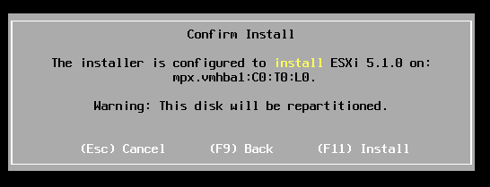
.. |image25| image:: media/image18.png
   :width: 5.96104in
   :height: 3.36437in
.. |image26| image:: media/image19.png
   :width: 4.01948in
   :height: 2.07457in
.. |image27| image:: media/image20.png
   :width: 6.10177in
   :height: 1.51498in
.. |image28| image:: media/image21.png
   :width: 3.94156in
   :height: 3.75832in

.. |image37| image:: media/image27.png
   :width: 6.10208in
   :height: 4.36944in
.. |image38| image:: media/image28.png
   :width: 6.10165in
   :height: 3.14887in

.. |image44| image:: media/image29.png
   :width: 4.21158in
   :height: 1.04181in

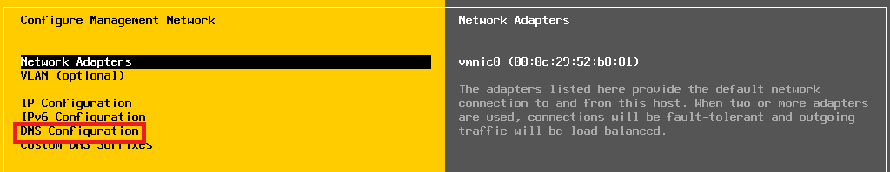

.. |image49| image:: media/image32.png
   :width: 5.99351in
   :height: 2.22701in
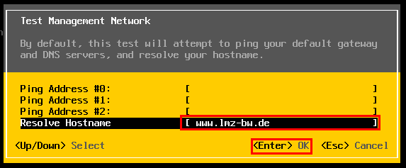
.. |image51| image:: media/image34.png
   :width: 4.79094in
   :height: 1.21978in

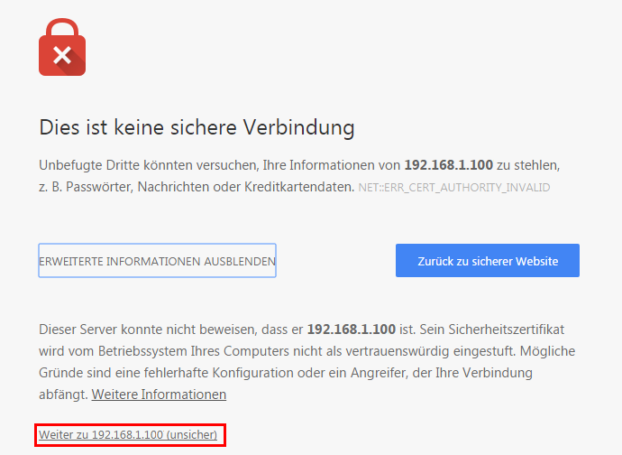

.. |image55| image:: media/image38.png
   :width: 1.84000in
   :height: 3.32366in
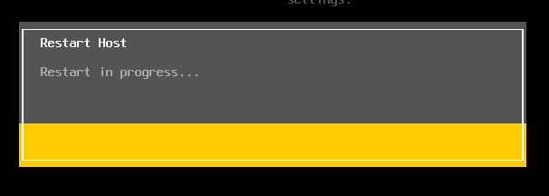

.. |image59| image:: media/image41.png
   :width: 6.03898in
   :height: 1.28000in
.. |image60| image:: media/image42.png
   :width: 5.88453in
   :height: 1.34400in
.. |image61| image:: media/image43.png
   :width: 3.14986in
   :height: 1.96282in
.. |image62| image:: media/image44.png
   :width: 4.75161in
   :height: 1.04800in
.. |image63| image:: media/image45.png
   :width: 5.99720in
   :height: 1.23200in
.. |image64| image:: media/image46.png
   :width: 5.27130in
   :height: 1.44800in

.. |image66| image:: media/image48.png
   :width: 6.93622in
   :height: 1.99200in
.. |image67| image:: media/image49.png
   :width: 6.10208in
   :height: 2.91022in

.. |image70| image:: media/image50.png
   :width: 4.82497in
   :height: 1.67164in
.. |image71| image:: media/image51.png
   :width: 5.97248in
   :height: 1.25974in

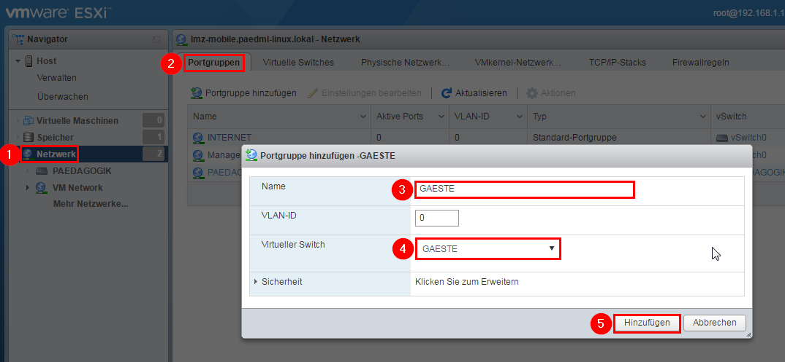

.. |image79| image:: media/image55.png
   :width: 6.10208in
   :height: 2.45742in

.. |image82| image:: media/image57.png
   :width: 5.99351in
   :height: 2.34550in

.. |image86| image:: media/image60.png
   :width: 6.01299in
   :height: 3.44528in

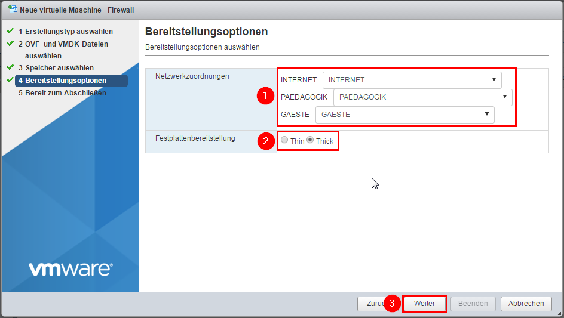

.. |image97| image:: media/image64.png
   :width: 5.66542in
   :height: 3.89583in

.. |image102| image:: media/image68.png
   :width: 5.25325in
   :height: 3.24872in

.. |image110| image:: media/image74.png
   :width: 5.88961in
   :height: 2.68678in
.. |image111| image:: media/image75.png
   :width: 6.02098in
   :height: 1.68056in
.. |image112| image:: media/image76.png
   :width: 5.96613in
   :height: 1.48701in

.. |image118| image:: media/image79.png
   :width: 5.22727in
   :height: 3.28151in

.. |image120| image:: media/image81.png
   :width: 0.44114in
   :height: 0.36443in

.. |image123| image:: media/image82.png
   :width: 6.10208in
   :height: 3.53248in

.. |image125| image:: media/image84.png
   :width: 5.39363in
   :height: 2.46457in

.. |image129| image:: media/image86.png
   :width: 5.45455in
   :height: 2.87264in

.. |image131| image:: media/image87.png
   :width: 4.58588in
   :height: 2.42431in

.. |image134| image:: media/image90.png
   :width: 6.10208in
   :height: 1.83125in
.. |image135| image:: media/image91.png
   :width: 6.10208in
   :height: 2.50136in

.. |image137| image:: media/image93.png
   :width: 5.45440in
   :height: 2.12917in

.. |image139| image:: media/image95.png
   :width: 3.66181in
   :height: 2.01854in

.. |image144| image:: media/image98.png
   :width: 2.38897in
   :height: 3.55512in
.. |image145| image:: media/image99.png
   :width: 2.55512in
   :height: 3.63018in
.. |image146| image:: media/image100.png
   :width: 6.10123in
   :height: 1.86772in
.. |image147| image:: media/image101.png
   :width: 3.86567in
   :height: 3.02624in

.. |image151| image:: media/image103.png
   :width: 6.10199in
   :height: 1.59712in

.. |image155| image:: media/image106.png
   :width: 6.10236in
   :height: 2.27165in
.. |image156| image:: media/image107.png
   :width: 6.06528in
   :height: 4.26793in

.. |image158| image:: media/image109.png
   :width: 6.08883in
   :height: 3.15583in

.. |image163| image:: media/image111.png
   :width: 6.10079in
   :height: 1.22016in

.. |image165| image:: media/image112.png
   :width: 4.37561in
   :height: 2.34408in
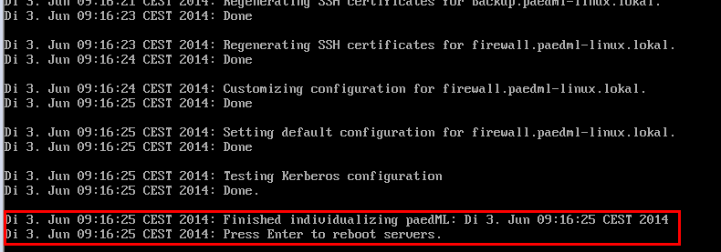

.. |image174| image:: media/image118.png
   :width: 5.82639in
   :height: 3.03565in
.. |image175| image:: media/image119.png
   :width: 6.10208in
   :height: 2.37986in

.. |image177| image:: media/image121.png
   :width: 3.83387in
   :height: 1.77108in
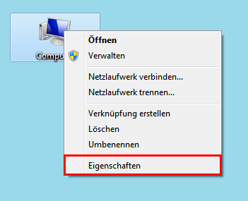

.. |image181| image:: media/image124.png
   :width: 5.79861in
   :height: 3.29933in

.. |image183| image:: media/image126.png
   :width: 5.77447in
   :height: 1.59028in
.. |image184| image:: media/image127.png
   :width: 2.79167in
   :height: 2.97230in
.. |image185| image:: media/image128.png
   :width: 2.79950in
   :height: 0.90180in
.. |image186| image:: media/image129.png
   :width: 5.40447in
   :height: 2.81652in
.. |image187| image:: media/image130.png
   :width: 6.03452in
   :height: 1.72727in
.. |image188| image:: media/image131.png
   :width: 5.98701in
   :height: 1.54189in
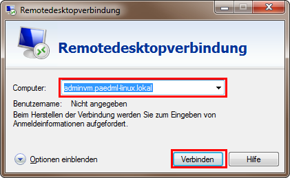

.. |image194| image:: media/image134.png
   :width: 4.03040in
   :height: 3.05224in
.. |image195| image:: media/image135.png
   :width: 6.10208in
   :height: 3.50139in

.. |image198| image:: media/image7.png
   :width: 0.53150in
   :height: 0.53150in

.. |image202| image:: media/image137.png
   :width: 5.38583in
   :height: 3.27559in

.. |image205| image:: media/image139.png
   :width: 2.92553in
   :height: 2.93232in

.. |image207| image:: media/image140.png
   :width: 4.32090in
   :height: 2.10704in
.. |image208| image:: media/image141.png
   :width: 4.55118in
   :height: 2.92520in
.. |image209| image:: media/image141.png
   :width: 4.35039in
   :height: 2.77953in
.. |image210| image:: media/image142.png
   :width: 3.50394in
   :height: 2.18504in
.. |image211| image:: media/image143.png
   :width: 4.31496in
   :height: 2.62205in

.. |image215| image:: media/image146.png
   :width: 3.06716in
   :height: 0.20567in
.. |image216| image:: media/image147.png
   :width: 2.76920in
   :height: 3.88596in

.. |image218| image:: media/image149.png
   :width: 2.68461in
   :height: 0.41175in

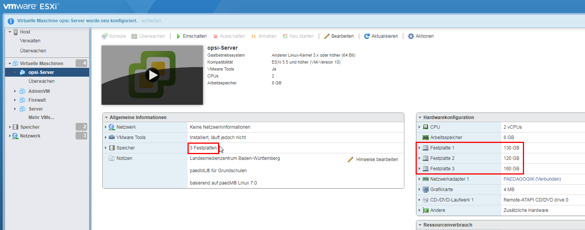
.. |image229| image:: media/image160.PNG
   :width: 0.54167in
   :height: 0.53125in

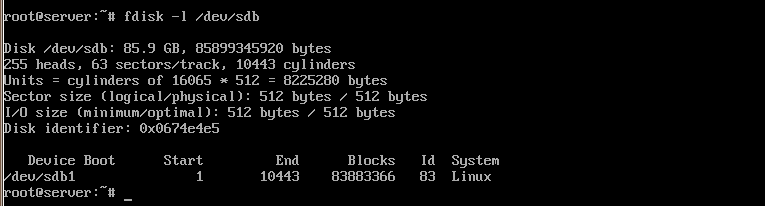
.. |image233| image:: media/image164.png
   :width: 3.05251in
   :height: 4.83401in

.. |image236| image:: media/image7.png
   :width: 0.53150in
   :height: 0.53150in

.. |image239| image:: media/image167.png
   :width: 3.46457in
   :height: 0.57087in

.. |image242| image:: media/image169.png
   :width: 5.58744in
   :height: 4.99583in

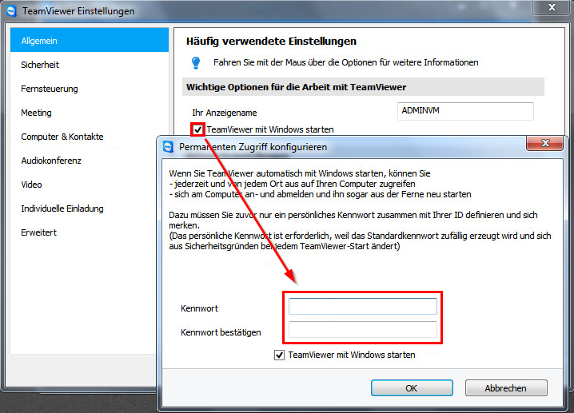

.. |image248| image:: media/image171.png
   :width: 4.87560in
   :height: 3.44722in

.. |image287| image:: media/image7.png
   :width: 0.53150in
   :height: 0.53150in

.. |image294| image:: media/image7.png
   :width: 0.53150in
   :height: 0.53150in

.. |image300| image:: media/image209.png
   :width: 6.10208in
   :height: 2.95764in

.. |image333| image:: media/image229.png
   :width: 6.03200in
   :height: 3.92248in

.. |image380| image:: media/image262.png
   :width: 2.81159in
   :height: 3.74400in

.. |image400| image:: media/image279.png
   :width: 3.12544in
   :height: 3.02126in

.. |image436| image:: media/image313.png
   :width: 6.10208in
   :height: 3.23056in

.. |image456| image:: media/image7.png
   :width: 0.53150in
   :height: 0.53150in

.. |image467| image:: media/image332.png
   :width: 3.83387in
   :height: 1.19808in

.. |image469| image:: media/image7.png
   :width: 0.53150in
   :height: 0.53150in

.. |image474| image:: media/image7.png
   :width: 0.53150in
   :height: 0.53150in

.. |image493| image:: media/image353.png
   :width: 6.10208in
   :height: 2.89541in

.. |image499| image:: media/image357.png
   :width: 5.97698in
   :height: 0.84722in

.. |image506| image:: media/image7.png
   :width: 0.53150in
   :height: 0.53150in

.. |image508| image:: media/image365.png
   :width: 6.10208in
   :height: 2.51597in

.. |image549| image:: media/image7.png
   :width: 0.53150in
   :height: 0.53150in

