+-----------------------------------------------------------+
|     \ **Beratung und Support**                            |
|                                                           |
|     **Technische Plattform**                              |
|                                                           |
|     **Support-Netz-Portal**                               |
+===========================================================+
|     paedML\ :sup:`®` – stabil und zuverlässig vernetzen   |
+-----------------------------------------------------------+
|                                                           |
+-----------------------------------------------------------+
| Stand                                                     |
|                                                           |
| paedML\ :sup:`®`                                          |
|                                                           |
| Version:                                                  |
|                                                           |
| paedML\ :sup:`®`                                          |
|                                                           |
| Version:                                                  |
+-----------------------------------------------------------+

+------------------------------------------------------------------------------------------------------------------------------------------------------------------------------------------------------------------------------------------------+
| **Impressum**                                                                                                                                                                                                                                  |
+------------------------------------------------------------------------------------------------------------------------------------------------------------------------------------------------------------------------------------------------+
| **Herausgeber **                                                                                                                                                                                                                               |
|                                                                                                                                                                                                                                                |
| | Landesmedienzentrum Baden-Württemberg (LMZ)                                                                                                                                                                                                  |
| | Support-Netz                                                                                                                                                                                                                                 |
| | Rotenbergstraße 111                                                                                                                                                                                                                          |
|                                                                                                                                                                                                                                                |
| 70190 Stuttgart                                                                                                                                                                                                                                |
+------------------------------------------------------------------------------------------------------------------------------------------------------------------------------------------------------------------------------------------------+
| **Autoren **                                                                                                                                                                                                                                   |
|                                                                                                                                                                                                                                                |
| | der Zentralen Expertengruppe Netze (ZEN),                                                                                                                                                                                                    |
| | Support-Netz, LMZ                                                                                                                                                                                                                            |
+------------------------------------------------------------------------------------------------------------------------------------------------------------------------------------------------------------------------------------------------+
|                                                                                                                                                                                                                                                |
+------------------------------------------------------------------------------------------------------------------------------------------------------------------------------------------------------------------------------------------------+
| **Endredaktion **                                                                                                                                                                                                                              |
+------------------------------------------------------------------------------------------------------------------------------------------------------------------------------------------------------------------------------------------------+
| Bildnachweis Symbole Titelseite                                                                                                                                                                                                                |
|                                                                                                                                                                                                                                                |
| CC By 3.0 US von Gregor Cresnar, The Noun Project                                                                                                                                                                                              |
+------------------------------------------------------------------------------------------------------------------------------------------------------------------------------------------------------------------------------------------------+
| **Weitere Informationen**                                                                                                                                                                                                                      |
|                                                                                                                                                                                                                                                |
| | www.support-netz.de                                                                                                                                                                                                                          |
| | www.lmz-bw.de                                                                                                                                                                                                                                |
+------------------------------------------------------------------------------------------------------------------------------------------------------------------------------------------------------------------------------------------------+
| **Änderungen und Irrtümer vorbehalten.**                                                                                                                                                                                                       |
+------------------------------------------------------------------------------------------------------------------------------------------------------------------------------------------------------------------------------------------------+
| Veröffentlicht:                                                                                                                                                                                                                                |
|                                                                                                                                                                                                                                                |
| Die Nutzung dieses Handbuches ist ausschließlich für eigene Zwecke zulässig. Die Nutzung sowie die Weitergabe dieses Handbuches zu kommerziellen Zwecken wie z.B. Schulungen ist nur nach ausdrücklicher Einwilligung durch das LMZ erlaubt.   |
|                                                                                                                                                                                                                                                |
| © Landesmedienzentrum Baden-Württemberg                                                                                                                                                                                                        |
+------------------------------------------------------------------------------------------------------------------------------------------------------------------------------------------------------------------------------------------------+
|                                                                                                                                                                                                                                                |
+------------------------------------------------------------------------------------------------------------------------------------------------------------------------------------------------------------------------------------------------+

Inhaltsverzeichnis

`1. Grundlagen der paedML Linux 7.0 10 <#_Toc511656078>`__

`1.1 Server, Firewall und AdminVM 10 <#_Toc511656079>`__

`1.2 Virtualisierung 10 <#_Toc511656080>`__

`1.3 Management-PC 11 <#_Toc511656081>`__

`1.4 Netzübersicht 12 <#_Toc511656082>`__

`1.5 Schematische Übersicht über die paedML Linux 7.0
13 <#_Toc511656083>`__

`2. Vorbereitung des Virtualisierungs-Hosts 14 <#_Toc511656084>`__

`2.1 Download des Installationsmediums 14 <#_Toc511656085>`__

`2.2 Beschaffung eines schulspezifischen Lizenzschlüssels
14 <#_Toc511656086>`__

`2.3 Installation des Hypervisors auf dem Virtualisierungs-Host
14 <#_Toc511656087>`__

`2.4 Anschluss des Virtualisierungs-Hosts an die Netzwerkinfrastruktur
der Schule 20 <#_Toc511656088>`__

`2.5 Grundlegende Konfiguration Virtualisierungs-Host
21 <#_Toc511656089>`__

`2.5.1 Verbinden der physischen NIC mit dem Netz „INTERNET“
22 <#_Toc511656090>`__

`2.5.2 Auswahl der Netzwerkkarte für das „Management Network“
22 <#_Toc511656091>`__

`2.5.3 Setzen der IP-Adresse im „Management-Network“
23 <#_Toc511656092>`__

`2.5.4 Deaktivieren von IPv6 24 <#_Toc511656093>`__

`2.5.5 Konfigurieren von DNS und Hostname 25 <#_Toc511656094>`__

`2.5.6 Test der DNS-Namensauflösung 26 <#_Toc511656095>`__

`2.5.7 Test der Erreichbarkeit des Virtualisierungs-Hosts
28 <#_Toc511656096>`__

`2.5.8 Durchführen der Änderungen und Neustart des
Virtualisierungs-Hosts 30 <#_Toc511656097>`__

`2.6 Eingabe des Lizenzschlüssels 31 <#eingabe-des-lizenzschlüssels>`__

`2.7 Zeitsynchronisation des Hypervisors 33 <#_Toc511656099>`__

`3. Konfiguration der virtuellen Netzwerke 35 <#_Toc511656100>`__

`3.1 Definition virtuelles Netzwerk „INTERNET“ 35 <#_Toc511656101>`__

`3.2 Definition virtuelles Netzwerk „PAEDAGOGIK“ 36 <#_Toc511656102>`__

`3.3 Definition virtuelles Netzwerk „GAESTE“ 37 <#_Toc511656103>`__

`3.4 Überprüfen der virtuellen Netze 39 <#_Toc511656104>`__

`4. Import der virtuellen Maschinen 40 <#_Toc511656105>`__

`4.1 Import der VM „Firewall“ 40 <#_Toc511656106>`__

`4.2 Import der VM „Server“ 44 <#_Toc511656107>`__

`4.3 Import der VM „opsi-Server“ 48 <#_Toc511656108>`__

`4.4 Import der VM „AdminVM“ 51 <#_Toc511656109>`__

`4.5 Upgrade der VM-Kompatibilität 56 <#_Toc511656110>`__

`4.6 Überprüfen des Imports 58 <#überprüfen-des-imports>`__

`5. Basiskonfiguration der virtuellen Maschinen 62 <#_Toc511656112>`__

`5.1 Basiskonfiguration der VM „Firewall“ 62 <#_Toc511656113>`__

`5.1.1 IP-Konfiguration der externen Netzwerkkarte (statische
IP-Adresse) 63 <#_Toc511656114>`__

`5.1.2 Updaten der Firewall 68 <#_Toc511656115>`__

`5.1.2.1 Updatevariante 1: Web-Oberfläche 68 <#_Toc511656116>`__

`5.1.2.2 Updatevariante 2: Konsole 71 <#_Toc511656117>`__

`5.1.3 OpenVM-Tools aktualisieren 72 <#_Toc511656118>`__

`5.2 Basiskonfiguration der VM „Server“
72 <#basiskonfiguration-der-vm-server>`__

`5.2.1 Durchführen der Systemindividualisierung 73 <#_Toc511656120>`__

`5.2.2 Optional: Ändern des Passwortes von „domadmin“
76 <#_Toc511656121>`__

`5.2.3 Aktualisieren des Basissystems der VM „Server“
76 <#_Toc511656122>`__

`5.3 Basiskonfiguration der VM „opsi-Server“ 77 <#_Toc511656123>`__

`5.3.1 Aktualisieren des Basissystems der VM „opsi-Server“
77 <#_Toc511656124>`__

`5.3.2 Aktualisieren der opsi-Produkte 78 <#_Toc511656125>`__

`6. Ausrollen der VM „AdminVM“ 79 <#_Toc511656126>`__

`6.1 Import der VM aus OVF-Vorlage 79 <#_Toc511656127>`__

`6.2 Anpassen der MAC-Adresse der Netzwerkkarte 79 <#_Toc511656128>`__

`6.3 SSL-Zertifikat installieren 80 <#_Toc511656129>`__

`6.4 RDP-Zugriff auf die AdminVM 81 <#_Toc511656130>`__

`6.4.1 Einrichten der AdminVM für den RDP-Zugriff 81 <#_Toc511656131>`__

`6.4.2 Test des Zugriffs per RDP auf die AdminVM 85 <#_Toc511656132>`__

`7. Automatischer Start der virtuellen Maschinen 88 <#_Toc511656133>`__

`7.1 Einrichtung des automatischen Starts 88 <#_Toc511656134>`__

`8. Rahmenbedingungen für die Backuplösung 91 <#_Toc511656135>`__

`9. Starten und Stoppen von virtuellen Maschinen 91 <#_Toc511656136>`__

`9.1 Starten von virtuellen Maschinen 91 <#_Toc511656137>`__

`9.2 Startreihenfolge 92 <#_Toc511656138>`__

`9.3 Herunterfahren und Neustart virtueller Maschinen
92 <#_Toc511656139>`__

`9.3.1 Herunterfahren über die Konsole des Betriebssystems
92 <#_Toc511656140>`__

`9.3.1.1 AdminVM (Windows) 92 <#adminvm-windows>`__

`9.3.1.2 Server / opsi-Server 93 <#server-opsi-server>`__

`9.3.1.3 Firewall 94 <#firewall>`__

`9.3.2 Herunterfahren / Neustart durch vmware-Host-Client
94 <#_Toc511656144>`__

`9.4 Hartes Ausschalten/ Harter Neustart 95 <#_Toc511656145>`__

`10. Snapshots der virtuellen Maschinen 96 <#_Toc511656146>`__

`10.1 Grundsätzliche Informationen zu Snapshots 97 <#_Toc511656147>`__

`10.2 Erstellen von Snapshots von „Server“ und „opsi-Server“
97 <#_Toc511656148>`__

`10.3 Erstellen von Snapshots der Firewall 99 <#_Toc511656149>`__

`10.4 Snapshots weiterer virtueller Maschinen 99 <#_Toc511656150>`__

`10.5 Wiederherstellen eines Snapshots
100 <#wiederherstellen-eines-snapshots>`__

`10.6 Verwalten von Snapshots 102 <#_Toc511656152>`__

`11. Erweiterungsmöglichkeiten der *paedML Linux*
102 <#_Toc511656153>`__

`11.1 Integration weiterer Server 102 <#_Toc511656154>`__

`11.2 Vergrößern der Festplatten der VM „Server“ 104 <#_Toc511656155>`__

`11.2.1 Hinzufügen einer Festplatte zu einer virtuellen Maschine
104 <#_Toc511656156>`__

`11.2.2 Vorbereiten der neuen Festplatte 106 <#_Toc511656157>`__

`11.2.2.1 Anlegen einer neuen Partitionstabelle 107 <#_Toc511656158>`__

`11.2.2.2 Anlegen einer Partition 108 <#_Toc511656159>`__

`11.2.2.3 Formatieren der Partition als „Physical Volume“
109 <#_Toc511656160>`__

`11.2.2.4 Erweitern der Volume Group „vg\_ucs“ 109 <#_Toc511656161>`__

`11.2.2.5 Vergrößern des Logical Volumens 109 <#_Toc511656162>`__

`11.2.2.6 Übersicht über die Logical Volumes 110 <#_Toc511656163>`__

`11.3 Installation von VMware Tools 110 <#_Toc511656164>`__

`12. Einrichtung des Fernzugriffs 112 <#einrichtung-des-fernzugriffs>`__

`12.1 Teamviewer 113 <#_Toc511656166>`__

`12.1.1 Zugriff auf Teamviewer 113 <#_Toc511656167>`__

`12.1.2 Einrichtung für den permanenten Zugriff 114 <#_Toc511656168>`__

`12.2 Fernzugriff über vmware einrichten 115 <#_Toc511656169>`__

`12.2.1 Einrichtung Management-Netzwerk 115 <#_Toc511656170>`__

`12.2.2 Feste IP-Adresse/DynDNS-Namen für die Erreichbarkeit
116 <#_Toc511656171>`__

`12.2.3 Routereinrichtung 116 <#_Toc511656172>`__

`12.2.3.1 Firewall-Regel „Port-Forwarding“ 116 <#_Toc511656173>`__

`12.2.3.2 Beschränkung des IP-Adressbereiches 117 <#_Toc511656174>`__

`12.2.3.3 Router Werte für vmware-Fernzugriff 117 <#_Toc511656175>`__

`Anhang A Dokumentation der Zugangsdaten 118 <#_Toc511656176>`__

Einführung

Vielen Dank, dass Sie sich für die *paedML* *Linux* entschieden haben.
Die *paedML* *Linux *\ ist seit der Version *6.0* eine Neuentwicklung,
die im Vergleich zu ihren Vorgängerversionen mit einem komplett neuen
Server- und Clientmanagement ausgestattet wurde. *Univention Corporate
Server („UCS*\ “ mit der Applikation *UCS@school*) bilden nun die
technologische Plattform für die Schul-IT-Komplettlösung. Damit ist die
*paedML* hervorragend geeignet, um IT-Infrastrukturen im Schulumfeld
bereitzustellen und zu verwalten. Für Lehrkräfte wurde die
Anwenderoberfläche neu gestaltet und mit einer intuitiven
„\ *Schulkonsole*\ “ ausgestattet. Hinzugekommen sind neue
Steuerungsfunktionen, die den Lehrkräften noch mehr Sicherheit beim
Unterrichten geben (zum Beispiel „Schülercomputer steuern“,
„Klassenarbeiten schreiben“, „Internet verwalten“ oder „Drucker
moderieren“). Die neue Version ermöglicht deutlich mehr Mobilität beim
Lernen, denn Schülerinnen und Schüler können auch mit ihren privaten
Geräten im „\ *Gäste-Netz*\ “ der Schule arbeiten
(„*Bring Your Own Device*\ “). Schuleigene Geräte sind im pädagogischen
Schulnetz integriert.

Neben den Verbesserungen für den aktiven Unterrichtablauf bringt die
*paedML* *Linux 7.0* auch für Netzwerkbetreuer deutliche
Arbeitserleichterungen mit sich: Viele Installationsroutinen wurden
automatisiert. Das beginnt mit einem vereinfachten und weniger
fehleranfälligen Installationsverfahren (der *paedML* -Server) mittels
Virtualisierung. Außerdem erfolgen Betriebssysteminstallation und
Softwareverteilung weitgehend automatisch mit einer Open Source Software
(*Open Server Integration* – *opsi)*. Die Restaurierung wurde ebenso
deutlich verbessert, sodass jetzt einzelne oder die gesamten
Schüler-Computer in einem Klassenraum innerhalb kürzester Zeit
wiederhergestellt werden können.

Mit der *paedML Linux 7.0* haben Sie sich für eine moderne IT-Lösung
entschieden, die mit einem professionellen technischen Unterbau
ausgestattet ist. Verlässlichkeit und Stabilität kennzeichnen die neue
Version, denn Hardwareunterstützung und die Handhabung wurden deutlich
verbessert. Technologisch gesehen ist die *paedML Linux 7.0* stärker
modular aufgebaut, wodurch die weitere Produktentwicklung in Zukunft
flexibler gestaltet werden kann. Wir sind an der Rückmeldung unserer
Kunden interessiert und wenn Sie Anregungen oder Wünsche für die
Weiterentwicklung der *paedML* *Linux* haben, bitten wir Sie um
Rückmeldung z. B. über unseren User-Helpdesk.

Die Hotline steht Ihnen mit Rat und Tat zur Seite, um Sie in der
Administration Ihres schulischen Netzwerks zu unterstützen. Die
Erfahrung hat gezeigt, dass es ratsam ist, lieber einmal zu viel, als
einmal zu wenig in der Hotline anzurufen. Wenn Sie Fragen zu Ihrer
*paedML* *Linux* haben, dann kontaktieren Sie bitte Ihre
Supportmitarbeiter.

**Linux Hotline**

**0711 – 25 35 83 88**

**linux-hotline@lmz-bw.de **

**Geschäftszeiten:**

**Montag – Donnerstag 8.00 – 16.00 Uhr**

**Freitag 8.00 – 14.30 Uhr**

Es gibt drei Handbücher für die *paedML Linux*:

-  Die hier vorliegende „Installationsanleitung“, welche die Einrichtung
       von VMware, das Aufsetzen der *paedML Linux* Infrastruktur und
       den technischen Aufbau des *paedML Linux*-Netzwerks behandelt.
       Diese Anleitung richtet sich an *Dienstleister*, die die *paedML
       Linux* einrichten.

-  Das „Administrationshandbuch“ richtet sich an den *Netzwerkberater*
       als Systembetreuer der Schule und an den *Dienstleister*. In
       diesem Handbuch werden administrative Aufgaben beschrieben, die
       im Schulalltag getätigt werden können. Darüber hinaus werden dort
       auch administrative Aufgaben bei der Einrichtung des Schulnetzes
       beschrieben, die primäre Aufgabe des Dienstleisters ist, der das
       Schulnetz einrichtet.

-  Das „Handbuch für Lehrkräfte“, welches die pädagogischen Funktionen
       Ihrer *paedML Linux* näher beschreibt, erläutert relevante Module
       für den Unterricht.

Neben diesen drei Handbüchern gibt es weitere Dokumente, die Sie bei der
Planung und dem Aufbau eines *paedML Linux* Netzwerkes unterstützen.

-  Der „Konzeptionsleitfaden“ ist eine Kurzeinführung in die *paedML
   Linux*. Dieses Dokument enthält Hinweise zur Planung der Installation
   des schulischen Netzwerkes.

-  Hinweise für die Ausschreibung des schulischen Netzes und bei der
   Übergabe des Netzwerks von Ihrem Dienstleister an die Schule finden
   Sie in unserem „Ausschreibungsleitfaden“.

-  In einem weiteren Dokument haben wir die „Hardwareanforderungen“ der
   paedML Linux 7.0 zusammengefasst.

Um Doppellungen zu vermeiden haben wir unsere Handreichungen dergestalt
gegliedert, dass wir an gegebener Stelle auf die anderen Handbücher
verweisen.

Alle hier genannten Handreichungen zur paedML Linux finden Sie unter
`*http://www.lmz-bw.de/technische-unterstuetzung/kundenportal/linux/dokumentationen.html* <http://www.lmz-bw.de/technische-unterstuetzung/kundenportal/linux/dokumentationen.html>`__
.

Überprüfen Sie diese Seite bitte regelmäßig nach Aktualisierungen!

Typografische Konventionen

Zur besseren Lesbarkeit werden bestimmte Elemente typografisch vom Rest
des Textes abgehoben.

-  Hervorhebungen in diesem Dokument sind *kursiv*.

-  Besondere Hervorhebungen sind fett ausgezeichnet.

-  Ausgaben oder Abfragen von Programmen sind *„kursiv und erhalten
   Anführungszeichen“*. Ebenso werden Menüs oder Knöpfe, in Programmen
   und Bedienoberflächen mit Anführungszeichen hervorgehoben.

-  Vom Benutzer auszuführende Tastatureingaben an der Linux-Konsole oder
   an der *Windows* Eingabeaufforderung (zum Beispiel Systembefehle)
   sowie Auszüge aus Systemdateien, werden durch die Roboto Mono vom
   Rest des Textes abgesetzt. Das gleiche gilt für Zugangsdaten wie
   Benutzernamen oder Passwörter.

-  Tastenbeschriftungen werden durch Rahmen hervorgehoben.

-  Verschachtelte Menüstrukturen werden durch einen senkrechten Strich
   (\|) als Trennzeichen (in der Linux Welt auch „\ *Pipe*\ “ [1]_
   genannt) voneinander getrennt. So finden Sie zum Beispiel den Zugriff
   für das Helpdesk-Modul unter „\ *Schulkonsole: Unterricht \| Helpdesk
   kontaktieren*\ “.

Unter einigen Kapitelüberschriften finden Sie einen Hinweis, wie Sie den
in dem Kapitel beschriebenen Baustein der *paedML Linux* aufrufen
können. In der Regel werden konfigurative Änderungen, die in diesem
Handbuch beschrieben sind, vom Netzwerkberater ausgeführt. Manche Menüs
sind jedoch nur für den Administrator zugänglich. Diese Ausnahmen werden
durch Nennung des vom Benutzer „\ *netzwerkberater*\ “ abweichenden
Benutzernamens gekennzeichnet.

Beispiele:

*Aufruf über Schulkonsole* (Administrator): Unterricht \| Computerraum

Adresse: https://server.paedml-linux.lokal/nagios

+------------+------------------------------------------------------------------------------------------------------------------------------------------------+
| |image0|   | Der Aufruf aller internen Webseiten der *paedML Linux* muss über den FQDN (voll qualifizierten Domain-Namen) der jeweiligen Seite geschehen.   |
|            |                                                                                                                                                |
|            | Es genügt also nicht bspw. `*https://server/horde* <https://server/horde>`__ einzugeben, um die Startseite des Webmailers aufzurufen.          |
|            |                                                                                                                                                |
|            | Nutzen Sie stattdessen *https://server.paedml-linux.lokal/horde*.                                                                              |
+============+================================================================================================================================================+
+------------+------------------------------------------------------------------------------------------------------------------------------------------------+

Hinweise und Tipps werden durch besondere Symbole grafisch vom Text
abgehoben:

+--------------+--------------------------------------------------------------------------------------------------------------------------------------------------------------------------------------------+
| \ |image1|   | Durch Hinweis-Felder, werden Sie auf Sachverhalte hingewiesen, die Sie beachten sollten, um bestimmte Probleme zu vermeiden, die den Betrieb der *paedML Linux* beeinträchtigen könnten.   |
+==============+============================================================================================================================================================================================+
+--------------+--------------------------------------------------------------------------------------------------------------------------------------------------------------------------------------------+

+------------+----------------------------------------------------------------------------------+
| |image2|   | Das Tipp-Feld gibt Hinweise, die nicht zwingend notwendig aber hilfreich sind.   |
+============+==================================================================================+
+------------+----------------------------------------------------------------------------------+

+------------+-----------------------------------------------------------------------------------------------------------------------------------------------------------------------------------------------------------------------------------------------------------+
| |image3|   | Dieses Feld kennzeichnet Inhalte, die nicht von der Hotline unterstützt werden.                                                                                                                                                                           |
|            |                                                                                                                                                                                                                                                           |
|            | Es handelt sich einerseits um Funktionen und Programme, die nicht Bestandteil der Entwicklung der paedML Linux sind. Diese Programme sind in der Regel zu komplex und zu umfangreich, um in Ihrer Tiefe durch die Hotline unterstützt werden zu können.   |
|            |                                                                                                                                                                                                                                                           |
|            | Andererseits bewirken Änderungen in den beschriebenen Funktionen, Abweichungen von Standardeinstellungen der paedML Linux [2]_.                                                                                                                           |
+============+===========================================================================================================================================================================================================================================================+
+------------+-----------------------------------------------------------------------------------------------------------------------------------------------------------------------------------------------------------------------------------------------------------+

Aufgrund der besseren Lesbarkeit wird in diesem Handbuch die männliche
Form verwendet.

Die weibliche Form ist selbstverständlich immer mit eingeschlossen.

Grundlagen der paedML Linux 7.0
===============================

Die *paedML Linux 7.0* ist eine vollständige Neuentwicklung und
unterscheidet sich grundlegend von den Vorgängerversionen. So besteht
die *paedML Linux 7.0* im Auslieferungszustand aus drei Servern.
Zusätzlich wird ein *Windows*-Rechner für die Aktivierung von
Windows-Lizenzen, die sogenannte AdminVM benötigt. Diese Geräte werden
virtualisiert installiert.

Im Folgenden soll ein Überblick über den Aufbau und die Nomenklatur der
*paedML Linux* gegeben werden. Weitergehende Ausführungen finden sich im
ersten Kapitel des Administrator-Handbuches.

+------------+------------------------------------------------------------------------------------------------------------------------------------------------------------------------------+
| |image4|   | Bitte installieren Sie immer die aktuellste Version der paedML Linux 7.0. Sollten Sie eine ältere Version installieren, müssen Sie die Update Anleitungen berücksichtigen:   |
|            |                                                                                                                                                                              |
|            | http://www.lmz-bw.de/technische-unterstuetzung/kundenportal/linux/updates-und-patches.html                                                                                   |
+============+==============================================================================================================================================================================+
+------------+------------------------------------------------------------------------------------------------------------------------------------------------------------------------------+

Server, Firewall und AdminVM
----------------------------

Die *paedML Linux* basiert in der Standardkonfiguration auf den
folgenden vier virtuellen Maschinen mit unterschiedlichen Funktionen:

+--------------------------+--------------------------------------------------------------------------------------------------------------------------------------------------------------------------------------------------------------------------+
| virtuelle Maschine       | Funktionen (auszugsweise)                                                                                                                                                                                                |
+==========================+==========================================================================================================================================================================================================================+
| VM „\ *Server*\ “        | Benutzerauthentifizierung                                                                                                                                                                                                |
|                          | File-Server (Benutzerverzeichnisse)                                                                                                                                                                                      |
|                          | Administration des Systems (Schulkonsole)                                                                                                                                                                                |
|                          | Proxy-Server                                                                                                                                                                                                             |
|                          | Steuerung des Internetzugriffs                                                                                                                                                                                           |
+--------------------------+--------------------------------------------------------------------------------------------------------------------------------------------------------------------------------------------------------------------------+
| VM „\ *opsi-Server*\ “   | Client-Management (Ausrollen der Betriebssysteme, Softwareverteilung). Aus Gründen, die dem Unterbau auf *Univention Corporate Server* geschuldet sind, lautet die Bezeichnung an manchen Stellen auch „\ *backup*\ “.   |
+--------------------------+--------------------------------------------------------------------------------------------------------------------------------------------------------------------------------------------------------------------------+
| VM „\ *Firewall*\ “      | Die Firewall trennt die internen Netze (pädagogisches Netz, Lehrernetz, Gäste-Netz) und stellt den Internetzugang für diese Netze bereit. Die Firewall bietet eine Reihe von Filtermöglichkeiten.                        |
+--------------------------+--------------------------------------------------------------------------------------------------------------------------------------------------------------------------------------------------------------------------+
| VM „\ *AdminVM*\ “       | virtuelle Maschine, die unter *Windows 7 *\ (64 bit) läuft. Sie wird für diverse Hilfsdienste (z.B. Gruppenrichtlinien, *Windows*-Aktivierung) benötigt, die zwingend unter *Windows* laufen müssen.                     |
|                          | Für diese VM wird eine *Windows 7* (64 bit)-Lizenz benötigt.                                                                                                                                                             |
+--------------------------+--------------------------------------------------------------------------------------------------------------------------------------------------------------------------------------------------------------------------+

Tabelle : Die virtuellen Maschinen der paedML Linux

Virtualisierung
---------------

Virtualisierungs-Host

Grundlage der Virtualisierung bildet der physische Server, der
sogenannte „\ *Virtualisierungs-Host*\ “. Dieser muss über genügend
Prozessorleistung, Hauptspeicher und Plattenplatz verfügen. Hinweise zur
Ausstattung des Virtualisierungs-Hosts finden Sie in unseren
Hardwareanforderungs-Dokument unter
`*http://support-netz.de/technische-unterstuetzung/kundenportal/linux/dokumentationen.html* <http://support-netz.de/technische-unterstuetzung/kundenportal/linux/dokumentationen.html>`__.

Hypervisor

Als *Hypervisor* bezeichnet man die Software, die auf dem
Virtualisierungs-Host die eigentliche Virtualisierung vornimmt und eine
Umgebung für virtuelle Gastsysteme zur Verfügung stellt. Die
*paedML Linux* basiert auf *VMware vSphere ESXi*, einem nativen
Hypervisor, der ohne ein zusätzliches Wirts-Betriebssystem direkt auf
der Hardware des Servers läuft.

Virtuelle Maschinen

In der virtuellen Umgebung des Hypervisors werden mehrere virtuelle
Maschinen (VM) betrieben. Diese virtuellen Maschinen laufen auf
„virtueller Hardware“ und teilen sich die Ressourcen des
Virtualisierungs-Hosts.

Konsolenzugriff auf den Hypervisor

| Per angeschlossener Tastatur und Monitor kann auf den Hypervisor nur
  über eine Textoberfläche zugegriffen werden, die ausschließlich zur
  Basiskonfiguration des Hypervisors selbst dient. Eine Verwaltung oder
  ein Zugriff auf die virtuellen Maschinen ist darüber nicht möglich.
| Sollte es später bei einer versehentlichen Fehlkonfiguration der Netze
  über die grafische Schnittstelle (s. nächster Abschnitt) zu einem sog.
  „Lockout“ kommen, d.h. der Zugriff über die grafische Schnittstelle
  dadurch auf den Hypervisor abgeschnitten sein, so kann über die
  Textkonsole der Netzzugriff wieder hergestellt werden.

Grafischer Zugriff auf die virtuellen Maschinen

Die Verwaltung der virtuellen Maschinen und der grafische Zugriff
erfolgt über die Software „\ *VMware vSphere Client*\ “, die auf einem
physischen *Windows*-Rechner außerhalb des Virtualisierungs-Hosts
installiert sein muss oder über den *„VMware Host Client“.*

+------------+-----------------------------------------------------------------------------------------------------------------------------------------------------------------------------------------------------------------------------------------------------------------------------------------------------------------------------------------------------------------------------------------------------------------+
| |image5|   | Der *„VMware vSphere Client“* wird nur bis zur ESXi-Version 6.0 unterstützt. In späteren Versionen ist nur der browserbasierte *„VMware Host Client“* lauffähig. Er setzt einen HTML5-fähigen Browser voraus. Wir empfehlen hier zusätzlich den Einsatz der *„VMware Remote Console“,* welche die Bedienung erleichtert. Sie wird auf der Seite von VMware als Download für Windows, Mac und Linux angeboten.   |
|            |                                                                                                                                                                                                                                                                                                                                                                                                                 |
|            | Die vorliegende Anleitung basiert auf dem *„VMware Host Client“.* Sollten Sie noch den VMware vSphere Client einsetzen, finden Sie in der Installationsanleitung der paedML 6.0 weitere Informationen.                                                                                                                                                                                                          |
+============+=================================================================================================================================================================================================================================================================================================================================================================================================================+
+------------+-----------------------------------------------------------------------------------------------------------------------------------------------------------------------------------------------------------------------------------------------------------------------------------------------------------------------------------------------------------------------------------------------------------------+

Für den Installationsvorgang der *paedML Linux* kann der
*vmware-Host-Client* auch temporär auf einem beliebigen PC (z.B. auf dem
Notebook eines IT-Dienstleisters) verwendet werden, der per Netzwerk mit
dem Virtualisierungs-Host verbunden ist.

Im laufenden Betrieb ist es ebenfalls notwendig, per
*vmware-Host-Client* auf die virtuellen Maschinen zuzugreifen. Hierzu
könnte auf den \ *vmware-Host-Client* über einen beliebigen PC oder
Notebook zugegriffen werden. Dieses Gerät muss über das Netzwerk mit dem
Virtualisierungs-Host verbunden sein.

Management-PC
-------------

In der vorliegenden Installationsanleitung wird unter dem Begriff
*Management-PC* ein physischer PC verstanden, über den auf den
*vmware-Host-Client* zugegriffen wird. Dieser Rechner ist über das
Netzwerk mit dem Virtualisierungs-Host verbunden. Bei der Einrichtung
des schulischen Netzes kann ein Rechner des Dienstleisters diese Aufgabe
übernehmen.

Vorgehen nach der Installation

Wenn die Installation der *paedML Linux* abgeschlossen ist, wird der
*Management-PC* nur noch sporadisch benötigt. Über den
*vmware-Host-Client* werden virtuelle Maschinen und/oder der Hypervisor
gestartet oder Heruntergefahren. Konfigurative Änderungen an der
Virtualisierung werden ebenfalls über den *vmware-Host-Client*
durchgeführt.

Obwohl aus „Kostengründen“ auch ein Client-PC temporär als
*Management-PC* zweckentfremdet werden könnte, empfehlen wir, für
Administrationsaufgaben der *paedML Linux* einen dedizierten PC als
*Management-PC* zu verwenden.

Der Vorteil beim Einsatz eines dedizierten Management-PCs im Netzsegment
„\ *Internet*\ “(vgl. folgender Abschnitt) ist, dass Dienstleister oder
die Hotline immer auf das System zugreifen können. Dies gilt auch, wenn
der Virtualisierungs-Server Probleme macht, da der Zugriff direkt nach
dem Router erfolgt. Wenn das Gerät nicht in Benutzung ist, kann es
ausgeschaltet werden.

+------------+-----------------------------------------------------------------------------------------------------------------------------+
| |image6|   | Bei „Management-PC“ und „AdminVM“ handelt es sich um völlig verschiedene Maschinen, die nicht verwechselt werden sollten.   |
|            |                                                                                                                             |
|            | Als Betriebssystem für den Management-PC wird *Windows* 7 (64 Bit) empfohlen.                                               |
+============+=============================================================================================================================+
+------------+-----------------------------------------------------------------------------------------------------------------------------+

Netzübersicht
-------------

Innerhalb der *paedML Linux* sind drei Netze definiert:

-  „\ *PAEDAGOGIK*\ “: Hier befinden sich die Client-Rechner und die
   Server der *paedML Linux.*

-  „\ *GAESTE*\ “: Das Gäste-Netz ist für den sicheren Betrieb von nicht
   zum Schul-Netz gehörigen Rechnern wie Notebooks von Schülern oder
   Lehrern (Stichwort: „\ *Bring Your Own Device*\ “) vorgesehen. Sollen
   keine schulfremden Geräte an das Schulnetz angeschlossen werden, so
   kann auf das Gäste-Netz verzichtet werden.

-  „\ *INTERNET*\ “: Netz für die Internetanbindung und den
   Management-PC, über den auf den Hypervisor zugegriffen werden kann.
   In der Nomenklatur des Hypervisors ist dies das sogenannte
   „\ *Management-Netz*\ “.

Die drei Netze können sowohl mit drei physikalisch getrennten Switches,
als auch per VLAN über einen management-fähigen Switch betrieben werden.
Dies ist von der vorhandenen Netzinfrastruktur der Schule abhängig.

Jedes Netz existiert sowohl außerhalb des Virtualisierungs-Hosts als
auch innerhalb der virtualisierten Umgebung, dort existiert für jedes
Netz ein „virtueller Switch“ (in der VMware-Nomenklatur
„\ *vSwitch*\ “).

Innerhalb der virtualisierten Umgebung werden die virtualisierten
Netzwerkkarten der VMs „per Mausklick“ mit einem *vSwitch* verbunden und
so an das Netz angebunden.

Die physischen Netzwerkkarten des Virtualisierungs-Hosts verbinden den
physischen mit dem virtualisierten Teil eines jeden Netzes. Aus Sicht
der Netzwerkgeräte (Client-PCs und auch virtualisierte Server) geschieht
dies jedoch völlig transparent.

+------------+-------------------------------------------------------------------------------------------------------------+
| |image7|   | Die Einrichtung und Wartung einer funktionierenden Netzwerk-Infrastruktur ist Aufgabe des Dienstleisters.   |
|            |                                                                                                             |
|            | Die Mitarbeiter der Hotline können hierbei nur unterstützend wirken.                                        |
+============+=============================================================================================================+
+------------+-------------------------------------------------------------------------------------------------------------+

Schematische Übersicht über die paedML Linux 7.0
------------------------------------------------

Die folgende Grafik gibt einen Überblick über den Aufbau der
*paedML Linux*:

+------------+
| |image8|   |
+------------+

Abb. : Schematischer Aufbau der paedML Linux.

Vorbereitung des Virtualisierungs-Hosts
=======================================

Auf dem Virtualisierungs-Host muss zunächst der Hypervisor
(Virtualisierungs-Software) installiert werden. In der *paedML Linux*
kommt das Produkt „\ *VMware vSphere Hypervisor (ESXi)*\ “ in der
aktuellen Version 6.5 zum Einsatz.

In den folgenden Schritten werden Download, Installation und
Basiskonfiguration des Hypervisors beschrieben.

Download des Installationsmediums
---------------------------------

Den freien Hypervisor „\ *VMware vSphere Hypervisor (ESXi)“* können Sie
sich auf der Website des Herstellers unter
`*http://www.vmware.com/de/products/vsphere-hypervisor.* <http://www.vmware.com/de/products/vsphere-hypervisor.html>`__\ `*html* <http://www.vmware.com/de/products/vsphere-hypervisor.html>`__
herunterladen. Hierzu ist lediglich eine Registrierung per Emailadresse
(„*Create an Account*\ “, bzw. „\ *Konto erstellen*\ “) auf der
vorgenannten Website erforderlich. Empfohlen wird die Versionsnummer
6.5.

Brennen Sie abschließend das zuvor heruntergeladene ISO-Image des
Hypervisors auf CD. Sie benötigen diese im Rahmen des folgenden
Installationsprozesses.

Beschaffung eines schulspezifischen Lizenzschlüssels
----------------------------------------------------

Der *vSphere Hypervisor* befindet sich direkt nach der Installation in
einem 60 Tage andauernden Testmodus, in welchem er auch im Hinblick auf
die teuerste Kaufvariante des vorgenannten Hypervisors zunächst
funktional uneingeschränkt ist.

+------------+------------------------------------------------------------------------------------------------------------------------------------------------------------------------------------------------------------------------------------------------------------------------------------------------------------------------------------------------------------------------------------------------------------+
| |image9|   | Bitte beachten Sie, dass Sie nur mit der Kaufvariante des vSphere Hypervisors die Sicherung des Sytems (virtuelle Maschinen und Daten) durchführen können. Weitere Informationen zur Sicherung und Wiederherstellung der paedML Linux finden Sie hier: http://www.lmz-bw.de/technische-unterstuetzung/kundenportal/linux/howtos/unsupported-howto-vollbackup-und-wiederherstellung-der-paedml-linux.html   |
+============+============================================================================================================================================================================================================================================================================================================================================================================================================+
+------------+------------------------------------------------------------------------------------------------------------------------------------------------------------------------------------------------------------------------------------------------------------------------------------------------------------------------------------------------------------------------------------------------------------+

Es wird empfohlen, die schulische Hypervisor-Installation vor Ort
umgehend auf eine zeitlich unbefristete Nutzungsdauer umzustellen, indem
Sie den Lizenzschlüssel eingeben.

Der individuelle Lizenzschlüssel für die Schule lässt sich nach Login
auf der Herstellerseite mit dem oben erzeugten Benutzerkonto unter der
Rubrik „\ *License & Download*\ “ abrufen. Am besten speichern Sie
diesen Lizenzschlüssel auf einem externen Datenträger (z.B. USB-Stick)
ab, da er später noch für die kostenlose Lizensierung des
Virtualisierungs-Hosts benötigt wird.

Für spätere Verwendungszwecke (z.B. Neuinstallation des Hypervisors) ist
es ratsam den Lizenzschlüssel aufzubewahren.

Installation des Hypervisors auf dem Virtualisierungs-Host
----------------------------------------------------------

Die eingesetzte Serverhardware sollte grundsätzlich VMware-zertifiziert
sein (vgl. https://www.vmware.com/guides.html) und darüber hinaus dem
Hardware-Anforderungspapier zur *paedML Linux 7.0* (vgl.
`http://support-netz.de/technische-unterstuetzung/kundenportal/linux
/dokumentationen.html <http://support-netz.de/technische-unterstuetzung/kundenportal/linux%20/dokumentationen.html>`__)
entsprechen.

Legen Sie nun die gebrannte Installations-CD in das optische Laufwerk
des Servers ein und booten Sie diesen von CD-ROM.

Wenn Ihr Server auf Booten vom optischen Laufwerk eingestellt ist,
erscheint zunächst das folgende Auswahlmenü:

+-------------+
| |image10|   |
+-------------+

Abb. : Auswahl des Bootmediums

Bestätigen Sie den Bootvorgang von der Installer-CD mit Enter. Daraufhin
wird das Installer-System von CD gebootet:

+-------------+---------------------------------------------------------------------------------------------------+
| |image11|   | Beim Installationsvorgang werden sämtliche Daten auf der Festplatte unwiederbringlich gelöscht!   |
+=============+===================================================================================================+
+-------------+---------------------------------------------------------------------------------------------------+

+-------------+
| |image12|   |
+-------------+

Abb. : Bootvorgang des Installer-Systems

Nach kurzer Wartezeit wird der Startschirm der Installationsroutine
angezeigt. Bestätigen Sie den Start des Installationsvorgangs mit ENTER.

+-------------+
| |image13|   |
+-------------+

Abb. : Start der Installation des Hypervisors

Im nächsten Bildschirm werden die Lizenzbedingungen (*End User License
Agreement*, kurz *EULA*) angezeigt:

+-------------+
| |image14|   |
+-------------+

Abb. : Bestätigung der Lizenzbedingungen des Hypervisors

Bestätigen Sie mit F11. Der Installer beginnt mit dem Scannen der
Hardware.

+-------------+
| |image15|   |
+-------------+

Abb. : Scan der Hardware des Virtualisierungs-Hosts

Im nächsten Bildschirm muss die Festplatte für die Installation des
Hypervisors ausgewählt werden:

+-------------+
| |image16|   |
+-------------+

Abb. : Auswahl der Festplatte, auf der der Hypervisor installiert wird.

Wählen Sie die Festplatte aus, auf der der Hypervisor installiert werden
soll und bestätigen Sie Ihre Wahl mit ENTER.

Im nächsten Bildschirm muss die Tastaturbelegung ausgewählt werden:

+-------------+
| |image17|   |
+-------------+

Abb. : Auswahl der Tastaturbelegung

Wählen Sie mit den Pfeiltasten Hoch/Runter die gewünschte
Tastaturbelegung aus (typischerweise „\ *German*\ “) und bestätigen Sie
mit ENTER.

Im nächsten Bildschirm müssen Sie ein *root*-Passwort für die
Administration des Hypervisors vergeben:

+-------------+
| |image18|   |
+-------------+

Abb. : Setzen des root-Passworts für den Hypervisor

Geben Sie das *root*-Passwort zweimal ein und bestätigen Sie mit ENTER.

Nach einem weiteren Scan muss die endgültige Installation des
Hypervisors nochmals bestätigt werden:

+----------------+
| |image19|\ …   |
+----------------+

Abb. : Endgültige Bestätigung der Installation des Hypervisors

Bestätigen Sie die Installation mit F11. Daraufhin beginnt der
eigentliche Installationsvorgang.

+-------------+
| |image20|   |
+-------------+

Abb. : Installationsvorgang des Hypervisors

Nach erfolgreichem Abschluss des Installationsvorgangs erscheint die
folgende Meldung:

+-------------+
| |image21|   |
+-------------+

Abb. : Der Hypervisor wurde erfolgreich installiert

Bestätigen Sie den Neustart des Systems mit ENTER, das System führt
einen Neustart aus:

+-------------+
| |image22|   |
+-------------+

Abb. : Neustart des Systems nach abgeschlossener Installation

Nach dem Neustart des Systems erscheint die Oberfläche des Hypervisors.
Damit ist die Basisinstallation des Hypervisors abgeschlossen.

+-------------+
| |image23|   |
+-------------+

Abb. : Oberfläche des Hypervisors nach dem Neustart

Anschluss des Virtualisierungs-Hosts an die Netzwerkinfrastruktur der Schule
----------------------------------------------------------------------------

In der vorliegenden Anleitung wird von den folgenden Prämissen
ausgegangen:

+-------------------+-------------------------------------------------------------------------------------------------------------+
| Netzbezeichnung   | Verwendung                                                                                                  |
+===================+=============================================================================================================+
| INTERNET          | -  Internetanschluss z.B. über einen DSL-Router wie zum Beispiel *Telekom Speedport*, *AVM* *FRITZ!Box,…*   |
|                   |                                                                                                             |
|                   | -  Außerdem Zugriff auf den Hypervisor per *vmware-Host-Client*                                             |
+-------------------+-------------------------------------------------------------------------------------------------------------+
| PAEDAGOGIK        | -  | Netz mit strukturierter Verkabelung und evtl. WLAN für                                                 |
|                   |    | schuleigene und von der ***paedML Linux*** verwaltete Geräte                                           |
+-------------------+-------------------------------------------------------------------------------------------------------------+
| GAESTE            | -  | „\ *Gäste-Netz*\ “ mit strukturierter Verkabelung und evtl. WLAN für                                   |
|                   |    | **schulfremde bzw. nicht von der *paedML Linux* verwaltete** Geräte                                    |
+-------------------+-------------------------------------------------------------------------------------------------------------+

Tabelle : Die Bezeichnungen der einzelnen Netze

Vor dem Durchführen der im nächsten Abschnitt beschriebenen Arbeiten
empfehlen wir, vorerst nur eine der (mindestens) drei im Server
vorhandenen Netzwerkkarten per Kabel anzuschließen. Dieses zuerst
eingesteckte Kabel sollte (eventuell über einen Switch) mit einer der
LAN-Buchsen Ihres DSL-Routers verbunden sein.

Die schrittweise Vorgehensweise bezüglich der Verkabelung der beiden
anderen im Server befindlichen Netzwerkkarten erleichtert die Zuordnung
der Karten zu den im Verlauf der Installation noch einzurichtenden
virtuellen Netzwerken.

Grundlegende Konfiguration Virtualisierungs-Host 
-------------------------------------------------

Nach Abschluss der Basisinstallation und Neustart des Servers finden Sie
sich auf der Startseite des Hypervisors wieder. Über die F2-Taste
gelangen Sie – nach Eingabe von Benutzername (root) und zugehörigem
Passwort – in das Konfigurationsmenü.

+-------------+
| |image24|   |
+-------------+

Abb. : Hypervisor nach Abschluss der Basisinstallation

Falls im Netz „\ *INTERNET*\ “ ein DHCP-Server vorhanden ist (z.B. auf
einem DSL-Router), bekommt die externe Netzwerkkarte des
Virtualisierungs-Hosts automatisch eine IP-Adresse zugewiesen. Aus
Gründen der Wartbarkeit empfehlen wir jedoch, die IP-Adresse des
ESXi-Servers statisch zu vergeben.

Im Folgenden wird ein Class C Netz verwendet. Der Router wird als
Default-Gateway genutzt und läuft auf der IP-Adresse 192.168.1.1. Der
ESXi-Server bekommt die Adresse 192.168.1.100 zugewiesen.

Im Folgenden wird der Virtualisierungs-Host so eingerichtet, dass der
Hypervisor per *vmware-Host-Client*\ über eine statische IP-Adresse aus
dem Netz „\ *INTERNET*\ “ erreichbar ist.

**Das „Management Network“**

In der VMware-Nomenklatur bezeichnet „\ *Management Network*" das
Netzwerk, über das der Hypervisor mittels *vmware-Host-Client*\ zu
Management-Zwecken erreichbar ist. Bei der Einrichtung der
*paedML Linux* wird empfohlen das Management-Netz auf das Netzwerk
„\ *INTERNET*\ “ zu legen.

Verbinden der physischen NIC mit dem Netz „INTERNET“
~~~~~~~~~~~~~~~~~~~~~~~~~~~~~~~~~~~~~~~~~~~~~~~~~~~~

Verbinden Sie zunächst nur diejenige Netzwerkkarte (NIC) des
Virtualisierungs-Hosts, die für das Netz „\ *INTERNET*\ “ vorgesehen
ist. Verbinden Sie die Netzwerkkarte per LAN-Kabel mit dem
entsprechenden Switch oder direkt mit der LAN-seitigen Buchse des
DSL-Routers.

Durch Drücken der F2-Taste und anschließender root-Authentifizierung
gelangen Sie in das Menü, in dem Sie die Netzwerkkonfiguration des
Virtualisierungs-Hosts anpassen können.

Navigieren Sie per Pfeiltaste auf die Option
„\ *Configure Management Network*\ “ und bestätigen Sie mit Enter.

+-------------+
| |image25|   |
+-------------+

Abb. : Hauptmenü zur Konfiguration des Hypervisors

Auswahl der Netzwerkkarte für das „Management Network“
~~~~~~~~~~~~~~~~~~~~~~~~~~~~~~~~~~~~~~~~~~~~~~~~~~~~~~

Wählen Sie im nächsten Menü per Pfeiltasten die Option „\ *Network
Adapters*\ “ aus und bestätigen Sie mit Enter:

+-------------+
| |image26|   |
+-------------+

Abb. : Untermenü zur Konfiguration des „Management Networks“

Markieren Sie durch Drücken der Leertaste diejenige Netzwerkkarte, die
den Status „\ *Connected*\ “ hat mit einem „\ *X*\ “. Entfernen Sie
eventuell gesetzte Markierungen bei den anderen Netzwerkkarten.
Bestätigen mit Enter.

+-------------+
| |image27|   |
+-------------+

Abb. : Konfiguration der Netzwerkkarte für das „Management Network“

Setzen der IP-Adresse im „Management-Network“
~~~~~~~~~~~~~~~~~~~~~~~~~~~~~~~~~~~~~~~~~~~~~

Zurück im nachfolgenden Menü wählen Sie bitte per Pfeiltaste die Option
„\ *IP Configuration*\ “ aus und bestätigen Sie dann die Auswahl mit
Enter:

+-------------+
| |image28|   |
+-------------+

Abb. : Auswahl des Punkts „IP Configuration“

Wählen Sie die zweite Option („*Set static IP address…*\ “) aus.
Vergeben Sie die statische IP (ggf. auf eigenen IP-Bereich anpassen!)
und bestätigen Sie mit Enter.

+-------------+
| |image29|   |
+-------------+

Abb. : Eintragen der statischen IP-Adresse

Deaktivieren von IPv6
~~~~~~~~~~~~~~~~~~~~~

Die Deaktivierung von IPv6 auf dem Hypervisor ist nicht zwingend
erforderlich, wird jedoch empfohlen.

Wählen Sie im Konfigurationsmenü per Pfeiltaste die Option
„\ *IPv6 Configuration*\ “ aus und bestätigen Sie dann die Auswahl mit
Enter:

+-------------+
| |image30|   |
+-------------+

Abb. : Navigation zur Konfiguration von IPv6

Um IPv6 zu deaktivieren, muss das Kreuz bei „\ *Enable IPv6*\ “ entfernt
werden. Bestätigen Sie dann die Auswahl mit Enter.

+-------------+
| |image31|   |
+-------------+

Abb. : Deaktivieren von IPv6: Kreuz entfernen

Konfigurieren von DNS und Hostname
~~~~~~~~~~~~~~~~~~~~~~~~~~~~~~~~~~

+-------------+------------------------------------------------------------------------------------------------------------------------------------------------------------------------------------------+
| |image32|   | Die Namensauflösung per DNS muss auf dem Virtualisierungs-Host unbedingt funktionieren, da davon weitere Dienste wie z.B. die Zeitsynchronisation aller virtuellen Maschinen abhängen!   |
+=============+==========================================================================================================================================================================================+
+-------------+------------------------------------------------------------------------------------------------------------------------------------------------------------------------------------------+

Zurück im nachfolgend dargestellten Menü wählen Sie bitte per Pfeiltaste
die Option „\ *DNS Configuration*\ “ aus. Bestätigen Sie die Auswahl mit
Enter:

+-------------+
| |image33|   |
+-------------+

Abb. : Zur Konfiguration von DNS und Hostname

Wählen Sie die zweite Option („*Use the following DNS server addresses
and hostname:“*) aus.

Tragen Sie zwei gültige DNS-Server ein. Die genauen Adressen hängen von
der konkreten Netzkonfiguration in der Schule ab, denkbare DNS-Server
sind:

-  Die (interne) IP-Adresse ihres Internetzugangsrouters, falls auf
   diesem ein eigener DNS-Server läuft. Dies könnte z.B. *192.168.178.1*
   sein.

-  Der DNS-Server, den Sie von ihrem Internetanbieter genannt bekommen.
   Im Falle eines BelWü-Zugangs ist dies dann z.B. *129.143.2.1* oder
   *129.143.2.4*.

-  Einen öffentlich zugänglichen DNS-Server, z.B. die von Google
   betriebenen DNS-Server *8.8.8.8 und 8.8.4.4.*

Benennen Sie den Virtualisierungs-Host wie beispielhaft dargestellt.
Bestätigen Sie mit Enter:

+-------------+
| |image34|   |
+-------------+

Abb. : Konfiguration von DNS und Hostname

Test der DNS-Namensauflösung
~~~~~~~~~~~~~~~~~~~~~~~~~~~~

Melden Sie sich auf der Konsole des Virtualisierungs-Hosts (F2-Taste und
anschließende Authentifizierung als Benutzer „\ *root*\ “) an und
navigieren Sie mit den Pfeiltasten zum Punkt
„\ *Test Management Network*\ “ und drücken Sie Enter.

+-------------+
| |image35|   |
+-------------+

Abb. : Diagnosefunktionen des Hypervisors aufrufen

Mit der folgenden Maske können Sie IP-Adressen pingen und die
DNS-Namensauflösung testen.

Tragen Sie einen externen Hostnamen in das letzte Feld ein (z.B.
„\ `*www.lmz-bw.de* <http://www.lmz-bw.de>`__\ “) und starten Sie den
Test mit Klick auf Enter:

+-------------+
| |image36|   |
+-------------+

Abb. : Test der DNS-Namensauflösung

Eine erfolgreiche Namensauflösung wird mit „\ *OK*\ “ quittiert. Schlägt
die Namensauflösung fehl (Meldung „\ *Failed*\ “), muss die
Netzkonfiguration nochmals überprüft werden.

+-------------+
| |image37|   |
+-------------+

Abb. : Erfolgreiche Namensauflösung.

Test der Erreichbarkeit des Virtualisierungs-Hosts
~~~~~~~~~~~~~~~~~~~~~~~~~~~~~~~~~~~~~~~~~~~~~~~~~~

Wenn die vorherigen Schritte korrekt ausgeführt worden sind, ist der
Virtualisierungs-Host aus dem Netz „\ *INTERNET*\ “ zu erreichen.

-  Schließen Sie für den Test den Management-PC an das Netz
   „\ *INTERNET*\ “ an.

-  Vergeben Sie für diesen Rechner manuell eine IP-Adresse aus dem
   Netzbereich des Netzes „\ *INTERNET*\ “ (im obigen Beispiel z.B.
   *192.168.1.101*) und setzen Sie dessen Netzwerkmaske korrekt (im
   obigen Beispiel auf *255.255.255.0*).

-  Öffnen Sie einen Browser auf dem Management-PC.

-  Geben Sie in die Adresszeile des Browsers die IP-Adresse des
   Hypervisors ein (in unserem Beispiel https://192.168.1.100/ui). Je
   nach ESXi-Version kann die Adresse geringfügig abweichen.

-  Klicken Sie danach auf *„ERWEITERT“*\ …

+-------------+
| |image38|   |
+-------------+

Abb. : Erweitert…

-  …und bestätigen Sie die Weiterleitung zum *vSphere-Host-Client*:

+-------------+
| |image39|   |
+-------------+

Abb. : Weiter zu… bestätigen

-  Sie sollten nun dieses Bild sehen:

+-------------+
| |image40|   |
+-------------+

Abb. : Test des Zugriffs auf den Virtualisierungs-Host, IP-Adresse ist
auf eigene Konfiguration anzupassen!

Wenn Sie diese Seite im Browser sehen, können Sie mit den nächsten
Schritten fortfahren. Andernfalls muss die Netzwerkkonfiguration
überprüft werden.

Beim ersten Login als *„root“* zeigt Ihnen der Server den
Lizensierungsstatus „\ *60 Tage Testversion*\ “ an, bestätigen Sie bitte
durch Drücken auf „\ *OK*\ “: Damit ist der Zugriff vom
*vmware-Host-Client* auf den Hypervisor eingerichtet.

Durchführen der Änderungen und Neustart des Virtualisierungs-Hosts
~~~~~~~~~~~~~~~~~~~~~~~~~~~~~~~~~~~~~~~~~~~~~~~~~~~~~~~~~~~~~~~~~~

Verlassen Sie das Untermenü „\ *Configure Management Network*\ “ durch
Drücken von ESC. Im nachfolgenden Fenster werden Sie aufgefordert, die
Änderungen am Virtualisierungs-Host zu bestätigen. Bestätigen Sie die
Änderungen durch Drücken der Taste Y:

+-------------+
| |image41|   |
+-------------+

Abb. : Endgültige Bestätigung der Änderungen am „Management Network“

Im Anschluss wird ein Neustart des Virtualisierungs-Hosts durchgeführt:

+-------------+
| |image42|   |
+-------------+

Abb. : Neustart des Virtualisierungs-Hosts

Nach dem Neustart ist die Netzwerkkarte im Netz „\ *INTERNET*\ “ für das
Management des Virtualisierungs-Hosts eingerichtet. Auf der Startseite
des Virtualisierungs-Hosts sollten die eben eingestellte IP-Adresse und
der Hostname angezeigt werden:

+-------------+
| |image43|   |
+-------------+

Abb. : Startseite nach erfolgtem Reboot

Eingabe des Lizenzschlüssels
----------------------------

Als nächstes muss der Hypervisor lizenziert werden.

Klicken Sie im linken Menü auf „\ *Host*\ “ () \| *„Verwalten“* () und
danach im rechten Fenster auf den Reiter „Lizenzierung“ (). Klicken Sie
dann auf *„Lizenz zuweisen“* ().

+-------------+
| |image44|   |
+-------------+

Abb. : Lizenz zuweisen

Geben Sie im darauffolgenden Fenster Ihren individuellen Lizenzschlüssel
für den Hypervisor ein () und bestätigen Sie mit *„Lizenz zuweisen“*
()*.*

+-------------+
| |image45|   |
+-------------+

Abb. : Lizenzschlüssel eingeben

Der Lizensierungs-Status Ihres Virtualisierungs-Hosts sollte nun der
folgenden Abbildung entsprechen. Eine erfolgreiche Eingabe des
Lizenzschlüssels wird mit dem Eintrag „\ *Ablaufdatum: Nie*\ “ im
Informationstext des Reiters „\ *Lizenzierung*\ “ angezeigt.

+-------------+
| |image46|   |
+-------------+

Abb. : Lizenzschlüssel wurde korrekt eingetragen

Zeitsynchronisation des Hypervisors
-----------------------------------

Im Folgenden wird der Hypervisor so eingerichtet, dass er die Uhrzeit
stets mit Zeitservern im Internet per NTP („Network Time Protocol“)
abgleicht. Dies ist notwendig, damit die virtuellen Maschinen ihrerseits
die korrekte BIOS-Uhrzeit erhalten.

+-------------+------------------------------------------------------------------------------------------------------------------------------------------------+
| |image47|   | Die Zeitsynchronisation funktioniert nur, wenn das Management-Netz des Hypervisors Internetzugriff hat und die Namensauflösung funktioniert!   |
+=============+================================================================================================================================================+
+-------------+------------------------------------------------------------------------------------------------------------------------------------------------+

Klicken Sie im linken Menü auf „\ *Host*\ “ () \| *„Verwalten“* () und
danach im rechten Fenster auf den Reiter *„System“* (). Klicken Sie dann
auf *„Uhrzeit und Datum“* () \| *„Einstellungen bearbeiten“* ().

+-------------+
| |image48|   |
+-------------+

Abb. : Ändern der Uhrzeitkonfiguration

Aktivieren Sie den NTP-Client (), setzen Sie bei „Startrichtlinie für
NTP-Dienst“ den Wert *„Mit dem Host starten und beenden“* () und nehmen
Sie unter NTP-Server folgende Eintragungen durch Kommas getrennt vor ():

0.de.pool.ntp.org, 1.de.pool.ntp.org, 2.de.pool.ntp.org,
3.de.pool.ntp.org

Bestätigen Sie mit *„Speichern“* ().

+-------------+
| |image49|   |
+-------------+

Abb. : NTP Client aktivieren, NTP-Server eintragen

Im vmware-Host-Clientsollten Sie nun die folgende Situation vorfinden:

+-------------+
| |image50|   |
+-------------+

Abb. : Der NTP-Client ist erfolgreich eingerichtet

1. .. rubric:: Konfiguration der virtuellen Netzwerke
      :name: konfiguration-der-virtuellen-netzwerke

   1. .. rubric:: Definition virtuelles Netzwerk „INTERNET“
         :name: definition-virtuelles-netzwerk-internet

Öffnen Sie den *vmware-Host-Client* über die IP-Adresse des ESXi-Hosts
in einem Browser. Klicken Sie im linken Menü auf *„Netzwerk“* () \| *„VM
Network“* () und danach im rechten Fenster auf den Eintrag *„Aktionen“*
(). Klicken Sie dann auf *„Entfernen“* ().

Bitte entfernen Sie auf keinen Fall das „Management Netzwerk“!

+-------------+
| |image51|   |
+-------------+

Abb. : VM Network entfernen

Bestätigen Sie im folgenden Fenster das Entfernen der Portgruppe *„VM
Network“*.

+-------------+
| |image52|   |
+-------------+

Abb. : Bestätigen: Entfernen der Portgruppe

Nun wird das virtuelle Netzwerk „INTERNET“ hinzugefügt. Klicken Sie dazu
im linken Menü auf *„Netzwerk“* () und danach im rechten Fenster auf den
Eintrag *„Portgruppe hinzufügen“* (). Geben Sie im sich öffnenden
Fenster als Name *„INTERNET“* () ein und bestätigen Sie mit
*„Hinzufügen“* ().

+-------------+
| |image53|   |
+-------------+

Abb. : Portgruppe „INTERNET“ hinzufügen

Definition virtuelles Netzwerk „PAEDAGOGIK“
-------------------------------------------

Zunächst muss ein virtueller Switch namens „PAEDAGOGIK“ hinzugefügt
werden. Klicken Sie dazu im linken Menü auf *„Netzwerk“* () und danach
im rechten Fenster auf den Reiter *„Virtuelle Switche“* (). Klicken Sie
dann auf *„Virtuellen Standard-Switch hinzufügen“* ().

+-------------+
| |image54|   |
+-------------+

Abb. : Virtuellen Switch hinzufügen

Im folgenden Fenster geben Sie als vSwitch-Name *„PAEDAGOGIK“* () ein,
wählen bei Uplink 1 *„vmnic1“* aus () und bestätigen Sie mit
*„Hinzufügen“* ().

+-------------+
| |image55|   |
+-------------+

Abb. : Virtuellen Switch „PAEDAGOGIK“ hinzufügen

Klicken Sie nun im linken Menü auf *„Netzwerk“* () und danach im rechten
Fenster auf den Eintrag *„Portgruppe hinzufügen“* (). Geben Sie im sich
öffnenden Fenster als Name *„PAEDAGOGIK“* () ein, wählen den virtuellen
Switch „PAEDAGOGIK“ aus () und bestätigen Sie mit *„Hinzufügen“* ().

+-------------+
| |image56|   |
+-------------+

Abb. : Portgruppe „PAEDAGOGIK“ hinzufügen

Definition virtuelles Netzwerk „GAESTE“
---------------------------------------

Zunächst muss ein virtueller Switch namens *„GAESTE“* hinzugefügt
werden. Klicken Sie dazu im linken Menü auf *„Netzwerk“* () und danach
im rechten Fenster auf den Reiter *„Virtuelle Switche“* (). Klicken Sie
dann auf *„Virtuellen Standard-Switch hinzufügen“* ().

+-------------+
| |image57|   |
+-------------+

Abb. : Virtuellen Switch hinzufügen

Im folgenden Fenster geben Sie als vSwitch-Name *„GAESTE“* () ein,
wählen bei Uplink 1 *„vmnic2“* aus () und bestätigen Sie mit
*„Hinzufügen“* ().

+-------------+
| |image58|   |
+-------------+

Abb. : Virtuellen Switch „GAESTE“ hinzufügen

Klicken Sie nun im linken Menü auf *„Netzwerk“* () und danach im rechten
Fenster auf den Eintrag *„Portgruppe hinzufügen“* (). Geben Sie im sich
öffnenden Fenster als Name *„GAESTE“* () ein, wählen den virtuellen
Switch *„GAESTE“* aus () und bestätigen Sie mit *„Hinzufügen“* ().

+-------------+
| |image59|   |
+-------------+

Abb. : Portgruppe „GAESTE“ hinzufügen

Überprüfen der virtuellen Netze
-------------------------------

Sie sollten auf dem Virtualisierungs-Host nun die drei nachstehend
abgebildeten virtuellen Netzwerke „\ *INTERNET*\ “, „\ *PAEDAGOGIK*\ “
und „\ *GAESTE*\ “ vorfinden:

+-------------+
| |image60|   |
+-------------+

Abb. : Übersicht der auf dem Virtualisierungs-Host eingerichteten Netze

+-------------------+------------------------------------------------------------------+----------------------+
| virtuelles Netz   | Bedeutung                                                        | Physischer Adapter   |
+===================+==================================================================+======================+
| „INTERNET“        | Verbindung der Firewall zum Internet-Router (DSL, BelWü etc.),   | vmnic0               |
|                   | Zugriff auf Hypervisor („Management Network“)                    |                      |
+-------------------+------------------------------------------------------------------+----------------------+
| „PAEDAGOGIK“      | Verbindung zum pädagogischen Netz                                | vmnic1               |
+-------------------+------------------------------------------------------------------+----------------------+
| „GAESTE“          | Verbindung zum Netz für Gäste-Rechner                            | vmnic2               |
+-------------------+------------------------------------------------------------------+----------------------+

Tabelle : Zuordnung der virtuellen Netze zu physischen Adaptern

1. .. rubric:: Import der virtuellen Maschinen
      :name: import-der-virtuellen-maschinen

   1. .. rubric:: Import der VM „Firewall“
         :name: import-der-vm-firewall

Öffnen Sie den *vmware-Host-Client* über die IP-Adresse des ESXi-Hosts
in einem Browser. Klicken Sie dann im linken Menü des
*vmware-Host-Client* auf *„Virtuelle Maschinen“* () und danach im
rechten Fenster auf den Eintrag *„VM erstellen/registrieren“* ().

+-------------+
| |image61|   |
+-------------+

Abb. : Virtuelle Maschine erstellen

Wählen Sie im folgenden Fenster „\ *Eine virtuelle Maschine aus einer
OVF- oder OVA-Datei..“* aus () und gehen Sie mit „Weiter“ zum nächsten
Schritt ():

+-------------+
| |image62|   |
+-------------+

Abb. : Import eines OVF-Images

Geben Sie als Namen für die virtuelle Maschine „Firewall“ ein () und
klicken Sie in den Bereich darunter (), um die später zu importierenden
Dateien auszuwählen. Sie können hier auch mit *„Ziehen und Ablegen“*
*(„Drag and Drop“)* arbeiten.

+-------------+
| |image63|   |
+-------------+

Abb. : OVF- und VMDK-Dateien für die VM „Firewall“ auswählen

Wählen Sie das OVF-Image und die VMDK-Datei der Firewall auf dem
*paedML Linux*-Datenträger aus () und klicken Sie auf „\ *Öffnen*\ “ ():

+-------------+
| |image64|   |
+-------------+

Abb. : Auswahl der OVF-Vorlage

Überprüfen Sie nochmals alle Angaben ( und ) und klicken Sie auf
„\ *Weiter*\ “ ():

+-------------+
| |image65|   |
+-------------+

Abb. : Alle Angaben sind korrekt.

Im nächsten Dialog müssen Sie denjenigen Datastore auswählen, auf dem
die virtuelle Maschine gespeichert werden soll (). Bestätigen Sie
anschließend mit „\ *Weiter*\ “ ().

+-------------+
| |image66|   |
+-------------+

Abb. : Auswahl des Datastores

Im nachfolgenden Dialog werden das Festplattenformat und die
Netzwerkzuordnungen der virtuellen Maschine festgelegt. Ordnen Sie die
Netzwerke wie in der Abbildung () zu, wählen Sie die Option
„\ *Thick*\ “ aus () und bestätigen Sie mit „\ *Weiter*\ “ ():

+-------------+
| |image67|   |
+-------------+

Abb. : Netzwerkzuordnungen und Auswahl des Festplattenformats „Thick“

Nachfolgend werden nochmals alle Einstellungen angezeigt. Kontrollieren
Sie diese Einstellungen () und bestätigen Sie den Dialog mit
„\ *Beenden*\ “ ():

+----+
|    |
+----+

Abb. : Letzte Kontrolle der Einstellungen vor dem tatsächlichen
Importvorgang

Nun beginnt der eigentliche Import der VM, dies kann je nach
Systemleistung und Imagegröße einige Zeit in Anspruch nehmen.

Import der VM „Server“
----------------------

Öffnen Sie den *vmware-Host-Client* über die IP-Adresse des ESXi-Hosts
in einem Browser. Klicken Sie dann im linken Menü des
*vmware-Host-Client* auf *„Virtuelle Maschinen“* () und danach im
rechten Fenster auf den Eintrag *„VM erstellen/registrieren“* ().

+-------------+
| |image68|   |
+-------------+

Abb. : Virtuelle Maschine erstellen

Wählen Sie im folgenden Fenster „\ *Eine virtuelle Maschine aus einer
OVF- oder OVA-Datei..“* aus () und gehen Sie mit *„Weiter“* zum nächsten
Schritt ():

+-------------+
| |image69|   |
+-------------+

Abb. : Import eines OVF-Images

Geben Sie als Namen für die virtuelle Maschine *„Server“* ein () und
klicken Sie in den Bereich darunter (), um die später zu importierenden
Dateien auszuwählen. Sie können hier auch mit *„Ziehen und Ablegen“*
*(„Drag and Drop“)* arbeiten.

+-------------+
| |image70|   |
+-------------+

Abb. : OVF- und VMDK-Dateien für die VM „Server“ auswählen

Wählen Sie das OVF-Image und die VMDK-Datei der Firewall auf dem
*paedML Linux*-Datenträger aus () und klicken Sie auf „\ *Öffnen*\ “ ():

+-------------+
| |image71|   |
+-------------+

Abb. : Auswahl der OVF-Vorlage

Überprüfen Sie nochmals alle Angaben ( und ) und klicken Sie auf
„\ *Weiter*\ “ ():

+-------------+
| |image72|   |
+-------------+

Abb. : Alle Angaben sind korrekt.

Im nächsten Dialog müssen Sie denjenigen Datastore auswählen, auf dem
die virtuelle Maschine gespeichert werden soll (). Bestätigen Sie
anschließend mit „\ *Weiter*\ “ ().

+-------------+
| |image73|   |
+-------------+

Abb. : Auswahl des Datastores

Im nachfolgenden Dialog werden das Festplattenformat und die
Netzwerkzuordnungen der virtuellen Maschine festgelegt. Ordnen Sie die
Netzwerke wie in der Abbildung () zu, wählen Sie die Option
„\ *Thick*\ “ aus () und bestätigen Sie mit „\ *Weiter*\ “ ():

+-------------+
| |image74|   |
+-------------+

Abb. : Netzwerkzuordnungen und Auswahl des Festplattenformats „Thick“

Nachfolgend werden nochmals alle Einstellungen angezeigt. Kontrollieren
Sie diese Einstellungen () und bestätigen Sie den Dialog mit
„\ *Beenden*\ “ ():

+-------------+
| |image75|   |
+-------------+

Abb. : Letzte Kontrolle der Einstellungen vor dem tatsächlichen
Importvorgang

Nun beginnt der eigentliche Import der VM, dies kann je nach
Systemleistung und Imagegröße einige Zeit in Anspruch nehmen.

Import der VM „opsi-Server“
---------------------------

Öffnen Sie den *vmware-Host-Client* über die IP-Adresse des ESXi-Hosts
in einem Browser. Klicken Sie dann im linken Menü des
*vmware-Host-Client* auf *„Virtuelle Maschinen“* () und danach im
rechten Fenster auf den Eintrag *„VM erstellen/registrieren“* ().

+-------------+
| |image76|   |
+-------------+

Abb. : Virtuelle Maschine erstellen

Wählen Sie im folgenden Fenster „\ *Eine virtuelle Maschine aus einer
OVF- oder OVA-Datei..“* aus () und gehen Sie mit *„Weiter“* zum nächsten
Schritt ():

+-------------+
| |image77|   |
+-------------+

Abb. : Import eines OVF-Images

Geben Sie als Namen für die virtuelle Maschine *„Server“* ein () und
klicken Sie in den Bereich darunter (), um die später zu importierenden
Dateien auszuwählen. Sie können hier auch mit *„Ziehen und Ablegen“*
*(„Drag and Drop“)* arbeiten.

+-------------+
| |image78|   |
+-------------+

Abb. : OVF- und VMDK-Dateien für die VM „OPSIServer“ auswählen

Wählen Sie das OVF-Image und die beiden VMDK-Datei der Firewall auf dem
*paedML Linux*-Datenträger aus () und klicken Sie auf „\ *Öffnen*\ “ ():

+-------------+
| |image79|   |
+-------------+

Abb. : Auswahl der OVF-Vorlage

Überprüfen Sie nochmals alle Angaben ( und ) und klicken Sie auf
„\ *Weiter*\ “ ():

+-------------+
| |image80|   |
+-------------+

Abb. : Alle Angaben sind korrekt.

Im nächsten Dialog müssen Sie denjenigen Datastore auswählen, auf dem
die virtuelle Maschine gespeichert werden soll (). Bestätigen Sie
anschließend mit „\ *Weiter*\ “ ().

+-------------+
| |image81|   |
+-------------+

Abb. : Auswahl des Datastores

Im nachfolgenden Dialog werden das Festplattenformat und die
Netzwerkzuordnungen der virtuellen Maschine festgelegt. Ordnen Sie die
Netzwerke wie in der Abbildung () zu, wählen Sie die Option
„\ *Thick*\ “ aus () und bestätigen Sie mit „\ *Weiter*\ “ ():

+-------------+
| |image82|   |
+-------------+

Abb. : Netzwerkzuordnungen und Auswahl des Festplattenformats „Thick“

Nachfolgend werden nochmals alle Einstellungen angezeigt. Kontrollieren
Sie diese Einstellungen () und bestätigen Sie den Dialog mit
„\ *Beenden*\ “ ():

+-------------+
| |image83|   |
+-------------+

Abb. : Letzte Kontrolle der Einstellungen vor dem tatsächlichen
Importvorgang

Nun beginnt der eigentliche Import der VM, dies kann je nach
Systemleistung und Imagegröße einige Zeit in Anspruch nehmen.

Import der VM „AdminVM“ 
------------------------

Hinweis: Das mit der AdminVM mitgelieferte Windows-Betriebssystem muss
nach dem Import lizenziert werden.

Öffnen Sie den *vmware-Host-Client* über die IP-Adresse des ESXi-Hosts
in einem Browser. Klicken Sie dann im linken Menü des
*vmware-Host-Client* auf *„Virtuelle Maschinen“* () und danach im
rechten Fenster auf den Eintrag *„VM erstellen/registrieren“* ().

+-------------+
| |image84|   |
+-------------+

Abb. : Virtuelle Maschine erstellen

Wählen Sie im folgenden Fenster „\ *Eine virtuelle Maschine aus einer
OVF- oder OVA-Datei..“* aus () und gehen Sie mit „Weiter“ zum nächsten
Schritt ():

+-------------+
| |image85|   |
+-------------+

Abb. : Import eines OVF-Images

Geben Sie als Namen für die virtuelle Maschine „Firewall“ ein () und
klicken Sie in den Bereich darunter (), um die später zu importierenden
Dateien auszuwählen. Sie können hier auch mit *„Ziehen und Ablegen“*
*(„Drag and Drop“)* arbeiten.

+-------------+
| |image86|   |
+-------------+

Abb. : OVF- und VMDK-Dateien für die VM „Firewall“ auswählen

Wählen Sie das OVF-Image und die VMDK-Datei der Firewall auf dem
*paedML Linux*-Datenträger aus () und klicken Sie auf „\ *Öffnen*\ “ ():

+-------------+
| |image87|   |
+-------------+

Abb. : Auswahl der OVF-Vorlage

Überprüfen Sie nochmals alle Angaben ( und ) und klicken Sie auf
„\ *Weiter*\ “ ():

+-------------+
| |image88|   |
+-------------+

Abb. : Alle Angaben sind korrekt.

Im nächsten Dialog müssen Sie denjenigen Datastore auswählen, auf dem
die virtuelle Maschine gespeichert werden soll (). Bestätigen Sie
anschließend mit „\ *We*\ iter“ ().

+-------------+
| |image89|   |
+-------------+

Abb. : Auswahl des Datastores

Im nachfolgenden Dialog werden das Festplattenformat und die
Netzwerkzuordnungen der virtuellen Maschine festgelegt. Ordnen Sie die
Netzwerke wie in der Abbildung () zu, wählen Sie die Option
„\ *Thick*\ “ aus () und bestätigen Sie mit „\ *Weiter*\ “ ():

+-------------+
| |image90|   |
+-------------+

Abb. : Netzwerkzuordnungen und Auswahl des Festplattenformats „Thick“

Nachfolgend werden nochmals alle Einstellungen angezeigt. Kontrollieren
Sie diese Einstellungen () und bestätigen Sie den Dialog mit
„\ *Beenden*\ “ ():

+-------------+
| |image91|   |
+-------------+

Abb. : Letzte Kontrolle der Einstellungen vor dem tatsächlichen
Importvorgang

Nun beginnt der eigentliche Import der VM, dies kann je nach
Systemleistung und Imagegröße einige Zeit in Anspruch nehmen.

Upgrade der VM-Kompatibilität
-----------------------------

Wenn Sie *vmware ESXi* in der Version 6.5 einsetzen ist nach dem Import
der virtuellen Maschinen ein Upgrade der VM-Kompatibilität auf
mindestens Version 5.5 nötig. In der folgenden Abbildung sehen Sie, dass
die virtuelle Maschine *„opsi-Server“* noch nicht auf die Version 5.5
aktualisiert wurde.

Führen Sie das Upgrade für alle virtuellen Maschinen durch. Der
Upgradevorgang ist nachfolgend exemplarisch für die VM *„opsi-Server“*
beschrieben.

Klicken Sie im *„Navigator“* auf der linken Seite des *vmware
Host-Clients* auf die VM „opsi-Server“ (), danach auf Aktionen () und
auf „Upgrade der VM-Kompatibilität“ ()

+-------------+
| |image92|   |
+-------------+

Abb. : Die VM-Kompatibilität der VM „opsi-Server“

Wählen Sie dann „Virtuelle ESXi 5.5-Maschine“ aus und klicken Sie auf
„Upgrade“.

+-------------+
| |image93|   |
+-------------+

Abb. : „Virtuelle ESXi 5.5-Maschine“ auswählen

Lesen und bestätigen Sie nun den Hinweis.

+-------------+
| |image94|   |
+-------------+

Abb. : Hinweis bestätigen

Danach müssen Sie die Einstellungen der virtuellen Maschine anpassen.
Klicken Sie dazu unter „Aktionen“ () auf „Einstellungen bearbeiten“ ().

+-------------+
| |image95|   |
+-------------+

Abb. : Einstellungen der VM „opsi-Server“ bearbeiten

Klicken Sie auf „VM-Optionen“ () und wählen Sie unter Version des
Gastbetriebssystems „Anderer Linux-Kernel 3.x oder höher (64 Bit)“ aus
() und klicken Sie auf „Speichern“ ().

+-------------+
| |image96|   |
+-------------+

Abb. : VM-Optionen der VM „opsi-Server“ bearbeiten

Überprüfen des Imports
----------------------

Sind alle virtuellen Maschinen erfolgreich importiert, so sollten Sie am
Ende im *vmware-Host-Client* folgendes Bild vorfinden:

+-------------+
| |image97|   |
+-------------+

Abb. : Alle virtuellen Maschinen wurden erfolgreich importiert.

Überprüfen Sie den erfolgreichen Import der einzelnen virtuellen
Maschinen, indem Sie diese per Mausklick im *vmware-Host-Client*
anwählen. Die Übersichtsseiten im Auslieferungszustand sind auf den
nächsten Seiten dargestellt.

Übersichtsseite der VM „Firewall“

+-------------+
| |image98|   |
+-------------+

Abb. : Übersichtsseite der VM „Firewall“ im Auslieferungszustand\ **
**

Übersichtsseite VM „Server“

+-------------+
| |image99|   |
+-------------+

Abb. : Übersichtsseite der VM „Server“ im Auslieferungszustand

Übersichtsseite VM „\ *opsi*-Server“

+--------------+
| |image100|   |
+--------------+

Abb. : Übersichtsseite der VM „\ *opsi-Server*\ “ im
Auslieferungszustand

Übersichtsseite VM „AdminVM“

+--------------+
| |image101|   |
+--------------+

Abb. : Übersichtsseite der virtuellen Maschine „AdminVM“ im
Auslieferungszustand.

Basiskonfiguration der virtuellen Maschinen
===========================================

Es erfolgt die Basiskonfiguration der drei importierten Maschinen
„\ *Firewall*\ “, „\ *Server*\ “ und „\ *opsi-Server*\ “, die Maschine
„\ *AdminVM*\ “ erfordert ein gesondertes Vorgehen, dies wird in
Kapitel 6 ab Seite 79 beschrieben.

+--------------+---------------------------------------------------------------------------------------------------------------+
| |image102|   | Schalten Sie die virtuellen Maschinen immer in der angegebenen Reihenfolge ein!                               |
|              |                                                                                                               |
|              | Warten Sie dabei stets mit dem Start der nächsten Maschine, bis die vorherige vollständig hochgefahren ist!   |
+==============+===============================================================================================================+
+--------------+---------------------------------------------------------------------------------------------------------------+

Die virtuellen Server „\ *Firewall*\ “, „\ *Server*\ “ und
„\ *opsi-Server*\ “ müssen nun in der folgenden Reihenfolge
eingeschaltet werden.

1. *Firewall*

2. *Server*

3. *opsi-Server*

Markieren Sie dazu im *vmware-Host-Client* jeweils die entsprechende
Maschine mit der Maus und klicken Sie auf den Button
„\ *Einschalten*\ “.

+--------------+
| |image103|   |
+--------------+

Abb. : Einschalten einer virtuellen Maschine über den vmware-Host-Client

Die Passwörter für alle zentralen Benutzerkonten wie *root* oder
*Administrator* (Domänen-Administrator) sind initial auf den Wert
„\ *paedmllinux*\ “ gesetzt.

Basiskonfiguration der VM „Firewall“
------------------------------------

Die externe Netzwerkkarte der Firewall (Netz „\ *INTERNET*\ “) ist im
Auslieferungszustand auf den Bezug von dynamischen IP-Adressen
konfiguriert. Falls die Firewall über das externe Interface keine
IP-Adresse per DHCP, zugewiesen bekommt (z.B. bei einem DSL-Router),
muss das externe Netzwerkinterface zwingend auf eine statische
IP-Adresse umgestellt werden.

+--------------+----------------------------------------------------------------------------------------------------------------------------------------+
| |image104|   | Veränderungen an den Einstellungen der Firewall dürfen nur per Browser über die Web-Schnittstelle („*WebGUI*\ “) vorgenommen werden.   |
|              |                                                                                                                                        |
|              | Die über die Textkonsole angebotenen Funktionen zur Netzkonfiguration dürfen nicht genutzt werden!                                     |
+==============+========================================================================================================================================+
+--------------+----------------------------------------------------------------------------------------------------------------------------------------+

IP-Konfiguration der externen Netzwerkkarte (statische IP-Adresse)
~~~~~~~~~~~~~~~~~~~~~~~~~~~~~~~~~~~~~~~~~~~~~~~~~~~~~~~~~~~~~~~~~~

Login auf der WebGUI der Firewall

Öffnen Sie im Browser die WebGUI der Firewall unter
http://firewall.paedml-linux.lokal und melden Sie sich als Benutzer
„\ *admin*\ “ an (initiales Passwort ist „\ *paedmllinux*\ “). Um die
WebGUI der Firewall aufrufen zu können, ist das Booten eines Clients mit
einer Live-Linux Distribution [3]_ (mithilfe einer Live-CD oder eines
Live-USB-Sticks) denkbar.

+--------------+
| |image105|   |
+--------------+

Abb. : Login-Maske der Firewall

Umstellen der externen Netzwerkkarte auf statische IP-Adresse

Navigieren Sie zum Punkt *„Interfaces \| INTERNET*\ “ um die
Einstellungen der externen Netzwerkkarte zu ändern.

+--------------+
| |image106|   |
+--------------+

Abb. : Navigation zu den Einstellungen der externen Netzwerkkarte

Führen Sie im folgenden Fenster folgende Änderungen durch:

-  Ändern Sie die Einstellung „\ *IPv4 Configuration Type*\ “ auf
   „\ *Static IPv4*\ “.

-  Tragen Sie im Feld „\ *IPv4 address*\ “ die statische IP-Adresse des
   externen Interfaces sowie den Netzbereich ein. Die Adresse und die
   Subnetzmaske sind abhängig von der lokal gegebenen
   Netzwerkkonfiguration und muss an diese angepasst werden!

-  Wählen Sie im Feld „\ *Gateway*\ “ die IP-Adresse des Gateways für
   den Internetzugang (z.B. die interne IP-Adresse ihres DSL-Routers)
   aus, falls das Gateway der Firewall schon bekannt ist. Im Regelfall
   ist dieses Gateway der Firewall aber noch nicht bekannt und muss
   zunächst durch Klick auf „\ *Add a new gateway*\ “ angelegt werden.

+--------------+
| |image107|   |
+--------------+

Abb. : Einstellen der externen IP-Adresse

Nach Klick auf „\ *Add a new gateway*\ “ kann das Gateway in der
Firewall angelegt werden:

-  Setzen Sie den Haken bei „\ *Default gateway*\ “

-  Vergeben Sie unter „\ *Gateway Name*\ “ einen Namen für das Gateway
   oder übernehmen Sie die Voreinstellung „\ *INTERNETGW*\ “

-  Tragen Sie unter „\ *Gateway IPv4*\ “ die LAN-seitige IP-Adresse des
   Gateways ein.

-  Vergeben Sie unter „\ *Description*\ “ eine Beschreibung für das
   Gateway (Freitextfeld).

-  Speichern Sie die Änderungen durch Klick auf „\ *Add*\ “.

+--------------+
| |image108|   |
+--------------+

Abb. : Anlegen eines neuen Gateways

Nun kann das eben angelegte Gateway ausgewählt werden. Speichern Sie mit
Klick auf „\ *Save*\ “.

+--------------+
| |image109|   |
+--------------+

Abb. : Eintragen des Gateways

Die neue Konfiguration muss anschließend übernommen werden. Dies
geschieht über einen Klick auf „\ *Apply changes*\ “.

+--------------+
| |image110|   |
+--------------+

Abb. : Übernahme der Änderungen in den laufenden Betrieb

Einstellen der DNS-Server

Wird die IP-Adresse der externen Netzwerkkarte manuell eingetragen, dann
müssen die zu verwendenden DNS-Server ebenfalls manuell eingestellt
werden. Navigieren Sie dazu auf „\ *System \| General Setup*\ “.

+--------------+
| |image111|   |
+--------------+

Abb. : Navigation zu den Grundeinstellungen der Firewall

Tragen Sie nun die IP-Adressen der DNS-Server in die entsprechenden
Felder ein. Hierfür gibt es – je nach Art der Internetverbindung –
verschiedene Alternativen:

-  Die DNS-Server werden von ihrem Internetanbieter vorgegeben. Für
   BelWü-Kunden sind dies zum Beispiel *129.143.2.1* und *129.143.2.4*.

-  Falls Sie den DNS-Server nicht kennen, können Sie versuchen, die
   IP-Adresse ihres Internetrouters einzutragen. Dies setzt allerdings
   voraus, dass Ihr Internetrouter seinerseits die DNS-Anfragen korrekt
   verarbeitet, was häufig bei Routern der Consumer-Klasse nicht
   zuverlässig funktioniert.

-  Sie tragen die IP-Adresse von frei verfügbaren DNS-Servern ein (z.B.
   die DNS-Server von Google *8.8.8.8* oder *8.8.4.4*).

Jedem DNS-Server muss das im Menü „\ *Interfaces Internet*\ “ definierte
Gateway zugewiesen werden.

+--------------+
| |image112|   |
+--------------+

Abb. : Eintragen der DNS-Server

Die Einrichtung der Firewall ist hiermit abgeschlossen. Sie können die
Internetverbindung testen, in dem Sie über das *pfSense*-Menü
„\ *Diagnostics \| Ping*\ “ eine Internetseite pingen.

+--------------+
| |image113|   |
+--------------+

Abb. : Erfolgreicher Ping-Versuch auf
`www.lmz-bw.de <http://www.lmz-bw.de>`__

Updaten der Firewall
~~~~~~~~~~~~~~~~~~~~

Die in der *paedML Linux* verwendete Firewall-Lösung „\ *pfSense*\ “
besitzt einen einfachen Updatemechanismus, mit dem die Software der
Firewall (in *pfSense*-Nomenklatur „Firmware“) stets aktuell gehalten
werden kann.

Zu Beginn der *paedML Linux*-Installation sollte die Firmware der
*pfSense* manuell auf den aktuellen Stand gebracht werden.

+--------------+-------------------------------------------------------------------------------------------------------------------------+
| |image114|   | Das System ist so konfiguriert, dass es automatisch prüft, ob Aktualisierungen verfügbar sind.                          |
|              |                                                                                                                         |
|              | Überprüfen Sie bitte regelmäßig, ob es Aktualisierungen der *pfSense* gibt und installieren Sie diese gegebenenfalls.   |
+==============+=========================================================================================================================+
+--------------+-------------------------------------------------------------------------------------------------------------------------+

Updatevariante 1: Web-Oberfläche
^^^^^^^^^^^^^^^^^^^^^^^^^^^^^^^^

Öffnen Sie für das Update der Firewall die Startseite über ein
Browserfenster. Sie erreichen die Seite über die URL
https://firewall.paedml-linux.lokal\ *. *

Melden Sie sich als Benutzer Administrator mit dem zugehörigen Kennwort
an.

Auf der Startseite wird angezeigt, wenn Aktualisierungen verfügbar sind
(„Version \* is available“). Unter dem „Downloadsymbol“ versteckt sich
der Link, der angeklickt werden muss, um das Update anzustoßen.

+--------------+
| |image115|   |
+--------------+

Abb. : Aufruf der *pfSense*-Startseite mit verfügbarem Update

+--------------+-----------------------------------------------------------------------------------------------------------------------------------------------------------------------------------------------------------------------+
| |image116|   | Sollte auf der Startseite der Firewall die Meldung *„Unable to check for updates“* erscheinen, aktualisieren Sie die Firewall über die Konsole. Dies ist im nachfolgenden Kapitel 5.1.2.2 auf Seite 71 beschrieben.   |
+==============+=======================================================================================================================================================================================================================+
+--------------+-----------------------------------------------------------------------------------------------------------------------------------------------------------------------------------------------------------------------+

Auf den nächsten Seiten werden Informationen zu dem verfügbaren Update
angezeigt. Über den Knopf „\ *Confirm*\ “ können Sie die
Systemaktualisierung starten.

+--------------+
| |image117|   |
+--------------+

Abb. : Start des Upgrades über den entsprechenden Schalter

Im Anschluss wird das Update heruntergeladen…

+--------------+
| |image118|   |
+--------------+

Abb. : Die Aktualisierungen werden heruntergeladen

… und installiert. Nach der Installation wird die Firewall neu
gestartet.

+--------------+
| |image119|   |
+--------------+

Abb. : Anzeige eines Neustarts der *pfSense*

+----------------+-----------------------------------------------------------------------------+
| \ |image120|   | Schalten Sie die Firewall während des Updatevorgangs auf keinen Fall aus!   |
+================+=============================================================================+
+----------------+-----------------------------------------------------------------------------+

Updatevariante 2: Konsole
^^^^^^^^^^^^^^^^^^^^^^^^^

1. Öffnen Sie die Konsole der Firewall im vmware-Host-Client mit einem
   Rechtsklick auf die Firewall \| Konsole \| Remotekonsole starten (Um
   die Remotekonsole nutzen zu können muss die VMRC installiert sein.)

+--------------+
| |image121|   |
+--------------+

Abb. : Die Konsole der Firewall öffnen

1. Tippen Sie danach 13 (Update from console) ein und bestätigen Sie mit
   der Enter-Taste. Die Firewall wird daraufhin aktualisiert:

+--------------+
| |image122|   |
+--------------+

Abb. : Die Firewall über die Konsole aktualisieren

+--------------+------------------------------------------------------------------------------------------------------------------------------------------------------------------------+
| |image123|   | Nach dem Update ist das Tastaturlayout auf *„Englisch“* eingestellt. Führen Sie lmz-initial-setup –f auf der Konsole des Servers erneut aus, um dies zu korrigieren.   |
+==============+========================================================================================================================================================================+
+--------------+------------------------------------------------------------------------------------------------------------------------------------------------------------------------+

OpenVM-Tools aktualisieren
~~~~~~~~~~~~~~~~~~~~~~~~~~

Nach jedem Update der Firewall müssen Sie die open-vm-tools (die Open
Source Variante der vmware-Tools) auf der Firewall auffrischen.

Dies geschieht über das Firewall-Menü „\ *System \| Package Manager*\ “.
Im Reiter „\ *Installed Packages*\ “ finden Sie das Paket
„\ *Open-VM-Tools*\ “. Rechts der Tabelle befinden sich drei Symbole.
Mit dem mittleren „\ *pkg*\ “-Symbol können Sie das Paket neu
installieren. Beim Mouseover springt ein Hilfedialog auf „\ *Reinstall
Open-VM-Tools package*\ “, der anzeigt, dass der richtige Knopf gewählt
wurde.

+--------------+
| |image124|   |
+--------------+

Abb. : Aktualisierungvon Open-VM-Tools

Im nächsten Dialog muss die Installation nochmals mittels
„\ *Confirm*\ “ bestätigt werden.

+--------------+
| |image125|   |
+--------------+

Abb. : Bestätigung der Neuinstallation

Basiskonfiguration der VM „Server“
----------------------------------

Auf der VM „\ *Server*\ “ muss nach dem Import die
Systemindividualisierung durchgeführt werden.

Im Auslieferungszustand sind alle *paedML Linux*-Installationen zunächst
vollständig identisch, so sind alle Passwörter auf „\ *paedmllinux*\ “
gesetzt.

Für einen sicheren Betrieb muss die *paedML Linux*-Installation
individualisiert werden, hierbei werden unter anderem alle Passwörter
geändert, die SSH-Schlüssel und SSL-Zertifikate neu generiert sowie
weitere sicherheitsrelevante Konfigurationen ausgetauscht.

Bei der Individualisierung werden außerdem Lizenzinformationen, die für
den Betrieb der *paedML Linux* notwendig sind, in das System übernommen.

Durchführen der Systemindividualisierung
~~~~~~~~~~~~~~~~~~~~~~~~~~~~~~~~~~~~~~~~

+--------------+-------------------------------------------------------------------------------------------------------------------------------------+
| |image126|   | Die Systemindividualisierung kann nur bei bestehender Internetverbindung durchgeführt werden!                                       |
|              |                                                                                                                                     |
|              | Um Ihren Server einzurichten, benötigen Sie Zugangsdaten, die Sie nach der Bestellung einer paedML Linux ab Version 7.0 erhalten.   |
|              |                                                                                                                                     |
|              | Führen Sie die im Folgenden beschriebenen Arbeitsschritte ausschließlich direkt an der Serverkonsole und NICHT per ssh aus!         |
+==============+=====================================================================================================================================+
+--------------+-------------------------------------------------------------------------------------------------------------------------------------+

1. Melden Sie sich an der Server-Konsole als Benutzer *root* an.

1. Vergewissern Sie sich, dass die virtuellen Maschinen
   „\ *opsi-Server*\ “ und „\ *Firewall*\ “ ebenfalls eingeschaltet und
   per Netzwerk vom Server aus erreichbar sind:

   1. Pingen der VM „\ *opsi-Server*\ “: #ping backup.paedml-linux.lokal

   2. Pingen der VM „\ *Firewall*\ “: #ping firewall.paedml-linux.lokal

2. Vergewissern Sie sich, dass der Server eine Verbindung zum Internet
   hat: #ping `www.lmz-bw.de <http://www.lmz-bw.de>`__

3. Rufen Sie das Skript für den Individualisierungs-Prozess mit dem
   Befehl #lmz-initial-setup auf:

+--------------+
| |image127|   |
+--------------+

Abb. : Start der Systemindividualisierung auf der Konsole des Servers

Das System fragt Sie zunächst nach Ihrer
*paedML Linux*-Installationsnummer, die Sie vom LMZ erhalten, und dem
dazugehörigen Passwort. Geben Sie diese beiden Werte ein:

+--------------+
| |image128|   |
+--------------+

Abb. : Abfrage der Installationsnummer

Anschließend werden Sie nach den gewünschten neuen Passwörtern für
zentrale Benutzerkonten gefragt. Tragen Sie dort ein selbst gewähltes
Passwort ein. Dieses Passwort wird für die folgenden Benutzer gesetzt:

-  *root* (Server, opsi-Server)

-  *Administrator* (Domänen-Administrator, *pfSense*-Administrator,
   opsi-Administrator)

-  *domadmin* (Konto für die Clientaufnahme)

-  *netzwerkberater* (administratives Benutzerkonto mit eingeschränkten
   Rechten)

+--------------+
| |image129|   |
+--------------+

Abb. : Vergabe eines neuen Passwortes für zentrale Benutzerkonten

Nun beginnt der Individualisierungsprozess. Dieser kann einige Minuten
dauern, die Ausgabe kann auf der Konsole beobachtet werden:

+--------------+
| |image130|   |
+--------------+

Abb. : Die Systemindividualisierung wird durchgeführt

Erfolgreicher Durchlauf

Läuft das Skript erfolgreich durch, so sollten Sie die Meldung
„\ *Finished individualizing paedML*\ “ sehen. Wenn diese Meldung nicht
erscheint, war die Systemindividualisierung nicht erfolgreich.

Drücken Sie Enter, daraufhin werden alle *paedML Linux* Server neu
gestartet.

+--------------+
| |image131|   |
+--------------+

Abb. : Erfolgreicher Abschluss des Individualisierungsprozesses

**Mögliche Fehlerquellen**

Falls keine Internetverbindung besteht oder die anderen Maschinen per
Netzwerk nicht erreichbar sind, so bricht das Skript mit einer der
folgenden Meldungen ab:

+--------------+
| |image132|   |
+--------------+

Abb. : Abbruch des Individualisierungsprozesses bei fehlender
Internetverbindung

+--------------+
| |image133|   |
+--------------+

Abb. : Abbruch des Individualisierungsprozesses

Brechen Sie das ggf. noch laufende Skript mit Strg+C ab. Stellen Sie
daraufhin sicher, dass

-  alle virtuellen Maschinen eingeschaltet sind,

-  die Konfiguration der virtuellen Netzwerke korrekt durchgeführt
   wurde,

-  alle Maschinen sich untereinander mit dem DNS-Namen pingen können,

-  vom Server aus eine Internetverbindung besteht.

Starten Sie den Individualisierungsvorgang nach der Behebung möglicher
Fehler erneut.

Optional: Ändern des Passwortes von „domadmin“
~~~~~~~~~~~~~~~~~~~~~~~~~~~~~~~~~~~~~~~~~~~~~~

+--------------+-----------------------------------------------------------------------------------------------------------------------------------------------------------------+
| |image134|   | Dieser Schritt ist notwendig, wenn Sie die Domänenaufnahme von Geräten durch Personen, die nicht Dienstleister oder Netzwerkberater sind, durchführen lassen.   |
|              |                                                                                                                                                                 |
|              | Das Kennwort des Accounts *domadmin* sollte in diesem Fall von den Kennwörtern der Benutzer *root,* *Administrator* und *netzwerkberater* abweichen!            |
+==============+=================================================================================================================================================================+
+--------------+-----------------------------------------------------------------------------------------------------------------------------------------------------------------+

Da bei der Systemindividualisierung mit #lmz-initial-setup alle
Kennwörter auf den gleichen Wert gesetzt werden, ist es gegebenenfalls
notwendig, das Kennwort des Benutzers *domadmin* zu ändern.

+--------------+--------------------------------------------------------------------------------------------------+
| |image135|   | Hier wird nur die Passwortänderung für den Benutzer *domadmin* erklärt.                          |
|              |                                                                                                  |
|              | Im Administratorhandbuch ist die Änderung der Kennwörter administrativer Benutzer beschrieben.   |
+==============+==================================================================================================+
+--------------+--------------------------------------------------------------------------------------------------+

Zum Ändern des domadmin-Passworts gehen Sie wie folgt vor:

1. Melden Sie sich als Benutzer *root* auf der Konsole des Servers an.

1. Rufen Sie das Kommando #lmz-initial-setup --domadmin auf.

2. Geben Sie auf Nachfrage das neue Passwort für den Benutzer *domadmin*
   ein.

3. Geben Sie auf Nachfrage das neue Passwort ein zweites Mal ein.

4. Daraufhin wird das Passwort für den Benutzer *domadmin* geändert.
   Nach Ablauf des Skripts drücken Sie auf ENTER.

5. In der Regel ist danach – im Gegensatz zur vollständigen
   Systemindividualisierung – kein Neustart der Server mehr nötig.

6. Melden Sie sich von der Konsole mit dem Befehl #exit ab.

   1. .. rubric:: Aktualisieren des Basissystems der VM „Server“
         :name: aktualisieren-des-basissystems-der-vm-server

Zu Beginn müssen Sie das Basissystem einmalig manuell auf den aktuellen
Softwarestand bringen. Spätere Updates werden dann automatisch
ausgeführt.

Loggen Sie sich als Benutzer „\ *root*\ “ auf der Konsole der VM
„\ *Server*\ “ ein. Starten Sie den Vorgang mit dem Befehl

#univention-upgrade --updateto=4.1-99

+--------------+
| |image136|   |
+--------------+

Abb. : Upgrade des Servers und Sicherheitsabfrage

| Es wird eine Liste von aktualisierbaren Paketen angezeigt. Es folgt
  nochmals eine Abfrage:
| „\ *Do you want to continue* *[Y\|n]?*\ “

Bestätigen Sie diese Abfrage durch Eingabe von y und Enter. Darauf
werden die aktuellen Updates eingespielt, Dieser Vorgang kann – je nach
Größe der Updates und Geschwindigkeit der Internetverbindung – einige
Zeit in Anspruch nehmen. Am Ende des Updatevorgangs erscheint wieder der
Cursor.

+----------------+----------------------------------------------------------------------------------------------------------------+
| \ |image137|   | Starten Sie nach dem Update den Server neu, damit alle geänderten Systemdienste neu gestartet werden können.   |
+================+================================================================================================================+
+----------------+----------------------------------------------------------------------------------------------------------------+

Basiskonfiguration der VM „opsi-Server“
---------------------------------------

+--------------+----------------------------------------------------------------------------------------------------------+
| |image138|   | Hinweis: Die VM „\ *opsi-Server*\ “ wird auf der Konsole unter dem Namen als „\ *backup*\ “ angezeigt.   |
+==============+==========================================================================================================+
+--------------+----------------------------------------------------------------------------------------------------------+

Aktualisieren des Basissystems der VM „opsi-Server“
~~~~~~~~~~~~~~~~~~~~~~~~~~~~~~~~~~~~~~~~~~~~~~~~~~~

Zu Beginn müssen Sie das Basissystem einmalig manuell auf den aktuellen
Softwarestand bringen. Spätere Updates werden dann automatisch
ausgeführt.

Loggen Sie sich als Benutzer „\ *root*\ “ auf der Konsole der VM
„\ *opsi-Server*\ “ ein.

Starten Sie den Updatevorgang mit dem Befehl

#univention-upgrade --updateto=4.1-99

| Es wird eine Liste von aktualisierbaren Paketen angezeigt. Es folgt
  nochmals eine Abfrage
| „\ *Do you want to continue* *[Y\|n]?*\ “

Bestätigen Sie diese Abfrage durch Eingabe von y und Enter. Darauf
werden die aktuellen Updates eingespielt. Dieser Vorgang kann – je nach
Größe der Updates und Geschwindigkeit der Internetverbindung – einige
Zeit in Anspruch nehmen. Am Ende des Updatevorgangs erscheint wieder der
Cursor.

+--------------+---------------------------------------------------------------------------------------------------------------------+
| |image139|   | Starten Sie nach dem Update den opsi-Server neu, damit alle geänderten Systemdienste neu gestartet werden können.   |
+==============+=====================================================================================================================+
+--------------+---------------------------------------------------------------------------------------------------------------------+

Aktualisieren der opsi-Produkte
~~~~~~~~~~~~~~~~~~~~~~~~~~~~~~~

Auf der VM „\ *opsi-Server*\ “ müssen im nächsten Schritt alle
*opsi*-Produkte auf den neusten Stand gebracht werden

Melden Sie sich auf der Textkonsole der VM „\ *opsi-Server*\ “ als
Benutzer „\ *root*\ “ an. Sie lösen den Updatevorgang mit dem folgenden
Befehl aus:

#opsi-product-updater –vv

Durch Eingabe dieses Befehls werden die *opsi* -Produkte auf den neusten
Stand gebracht. Dieser Vorgang kann – abhängig von Menge und Größe der
Updates und der Internetbandbreite – einige Zeit (auch mehrere Stunden)
in Anspruch nehmen.

Es ist auch möglich, einzelne Produkte mit folgendem Befehl zu
aktualisieren. Sind sie nicht installiert, so werden sie installiert.
Die Liste muss den genauen Namen des Produkts enthalten (keine
Wildcards), z.B. *„mshotfix-win10-win2016-x64-glb“.*

opsi-product-updater –vv –p produktname-eins,produktname-zwei

+--------------+
| |image140|   |
+--------------+

Abb. : Update aller *opsi*-Produkte auf der Konsole der VM
„\ *opsi*-Server“

Ausrollen der VM „AdminVM“
==========================

Rolle und Funktion der VM „AdminVM“

Es gibt einige Services für den Betrieb der *paedML Linux* (z.B. die
*Windows*-Aktivierung, Gruppenrichtlinien), die auf einem
*Windows*-Rechner laufen müssen. Dafür ist die virtuelle Maschine
„\ *AdminVM*\ “ vorgesehen. Die *AdminVM* ist bereits mit Windows 7
Professional 64-Bit installiert und den notwendigen Werkzeugen, wie z.B.
VAMT oder RSAT. Einige wenige Anpassungen müssen jedoch noch vorgenommen
werden.

Import der VM aus OVF-Vorlage
-----------------------------

Der Import der OVF-Vorlage sollte bereits erfolgt sein, damit steht auf
dem Virtualisierungs-Host schon eine virtuelle Maschine bereit.

Falls der Import der OVF-Vorlage noch nicht erfolgt ist, führen Sie die
Kapitel 4.4 (Seite 51) beschriebenen Schritte aus.

Anpassen der MAC-Adresse der Netzwerkkarte
------------------------------------------

Nach dem Import der *AdminVM* muss noch die MAC-Adresse der
Netzwerkkarte auf 00:50:56:00:00:01 geändert werden. Die *AdminVM* muss
zunächst ausgeschaltet sein. Klicken Sie dann im vmware-Host-Client mit
der rechten Maustaste auf die *AdminVM* und danach auf *„Einstellungen
bearbeiten…“*.

+--------------+
| |image141|   |
+--------------+

Abb. : Einstellungen der AdminVM bearbeiten

Wählen Sie dann den Netzwerkadapter, stellen die MAC-Adresse auf
„Manuell“ um (1) und tippen Sie die MAC-Adresse 00:50:56:00:00:01 ein
(2). Bestätigen Sie die Einstellungen mit „Speichern“.

+--------------+
| |image142|   |
+--------------+

Abb. : Ändern der MAC-Adresse

SSL-Zertifikat installieren
---------------------------

Starten Sie nun die virtuellen Maschinen wie in Kapitel 9 auf Seite 91
beschrieben und öffnen Sie die *AdminVM*. Auf der *AdminVM* starten Sie
den *opsi config editor*.

+--------------+
| |image143|   |
+--------------+

Abb. : Symbol des opsi config editor

Klicken Sie auf die *AdminVM* in der Clientliste (1). Wählen Sie im
Reiter „Produktkonfiguration“ das Produkt *„zertifikat“* (2) aus und
setzen es in der Spalte *„Angefordert“* auf *„setup“ (3).*

+--------------+
| |image144|   |
+--------------+

Abb. : SSl-Zertifikat auf der AdminVM installieren

Speichern Sie die Konfiguration mit einem Klick auf den roten Haken und
starten Sie die *AdminVM* neu.

RDP-Zugriff auf die AdminVM
---------------------------

Es gibt mehrere technische Möglichkeiten, um auf die *AdminVM*
zuzugreifen

-  per vmware-Host-Client

-  per Remote Desktop Protocol (RDP)

-  per Software von Drittanbietern (z.B. TeamViewer, VNC etc.)

Da RDP standardmäßig auf jedem *Windows*-Rechner installiert ist,
empfehlen wir diesen Weg.

Einrichten der AdminVM für den RDP-Zugriff
~~~~~~~~~~~~~~~~~~~~~~~~~~~~~~~~~~~~~~~~~~

Öffnen Sie auf der AdminVM die Systemeinstellungen durch eine der
folgenden Methoden:

-  Rechtsklick auf das „\ *Computer*\ “-Symbol auf dem Desktop (falls
   vorhanden), dann „Eigenschaften“

-  Klick auf „\ *Start \| Einstellungen \| Systemsteuerung \| System*\ “

-  Drücken der Tasten Windows + Pause

+--------------+
| |image145|   |
+--------------+

Abb. : Öffnen der Systemeinstellungen

Klicken Sie im folgenden Fenster auf „\ *Remoteeinstellungen*\ “:

+--------------+
| |image146|   |
+--------------+

Abb. : Konfigurieren der Remoteeinstellungen

Wählen Sie den Reiter „\ *Remote“* aus. Setzen Sie den Haken bei
„\ *Remoteunterstützungsverbindung mit diesem Computer zulassen*\ “.
Wählen sie im Bereich „\ *Remotedesktop*\ “ die zweite Option
„\ *Verbindungen von Computern zulassen…*\ “, wie im Screenshot gezeigt.

Klicken Sie anschließend auf „\ *Benutzer auswählen…*\ “, um diejenigen
Benutzer auszuwählen, die per RDP auf die *AdminVM* zugreifen dürfen.

+--------------+
| |image147|   |
+--------------+

Abb. : Einrichten des RDP-Zugriffs auf die AdminVM

Klicken Sie im nächsten Fenster auf „\ *Hinzufügen*\ …“.

+--------------+
| |image148|   |
+--------------+

Abb. : Hinzufügen eines Benutzers für den RDP-Zugriff

Tragen Sie den Benutzer Administrator@paedml-linux.lokal in das
angegebene Feld ein und klicken Sie auf „\ *Namen überprüfen*\ “:

+--------------+
| |image149|   |
+--------------+

Abb. : Eintragen des Benutzers

Im nächsten Fenster müssen Sie sich gegenüber dem Domänencontroller
authentifizieren, um die Liste aller Benutzer überprüfen zu dürfen.
Tragen Sie dort die Zugangsdaten für den (Domänen-) *Administrator* ein.

+--------------+
| |image150|   |
+--------------+

Abb. : Authentifizierung als Administrator mit Kennwort

Nach erfolgreicher Authentifizierung wird der soeben eingegebene
Benutzer mit dem Domänencontroller abgeglichen und in leicht veränderter
Form angezeigt. Klicken Sie auf „\ *OK*\ “.

+--------------+
| |image151|   |
+--------------+

Abb. : Der Name wurde erfolgreich überprüft.

Nun ist der Benutzer „Administrator“ berechtigt, eine RDP-Verbindung
herzustellen. Klicken Sie erneut auf „\ *OK*\ “

+--------------+
| |image152|   |
+--------------+

Abb. : Der Benutzer „Administrator“ darf nun per RDP auf die AdminVM
zugreifen.

Sie können die Systemeigenschaften der *AdminVM* nun mit „\ *OK*\ “
schließen.

Damit ist der Zugriff auf die *AdminVM* per RDP eingerichtet.

+--------------+
| |image153|   |
+--------------+

Abb. : Schließen der Systemeigenschaften

Test des Zugriffs per RDP auf die AdminVM
~~~~~~~~~~~~~~~~~~~~~~~~~~~~~~~~~~~~~~~~~

Dieser Schritt ist nicht Teil der Installation. Er kann auch zu einem
späteren Zeitpunkt von jedem *Windows*-Rechner im Schul-Netz ausgeführt
werden.

Öffnen Sie von demjenigen Rechner, von dem Sie auf die *AdminVM*
zugreifen wollen, die Remotedesktopverbindung über „\ *Start \|
Programme \| Zubehör \| Remotedesktopverbindung*\ “:

+--------------+
| |image154|   |
+--------------+

Abb. : Startmenü \| Programme \| Zubehör \| Remotedesktopverbindung

Tragen Sie im Feld „\ *Computer*\ “ den Wert
*adminvm.paedml-linux.lokal* ein. Sollte dies aufgrund der
DNS-Konfiguration fehlschlagen, können Sie alternativ die IP-Adresse
*10.1.0.13* eintragen.

+--------------+
| |image155|   |
+--------------+

Abb. : Aufbau einer Remotedesktopverbindung zur AdminVM

Nun müssen Sie sich an der *AdminVM* authentifizieren. Geben Sie dazu
den Benutzernamen *Administrator* (=Domänenadministrator) und das
zugehörige Kennwort ein:

+--------------+------------------------------------------------------------------------------------------+
| |image156|   | Wir empfehlen ausdrücklich, die Anmeldedaten nicht zu speichern (Haken nicht setzen!).   |
+==============+==========================================================================================+
+--------------+------------------------------------------------------------------------------------------+

+--------------+
| |image157|   |
+--------------+

Abb. : Anmeldung an der AdminVM

Daraufhin sollte der Desktop der *AdminVM* in einem Fenster angezeigt
werden und Sie können an diesem Rechner arbeiten. Sie beenden die
RDP-Sitzung einfach, indem Sie das Fenster schließen.

+--------------+
| |image158|   |
+--------------+

Abb. : Zugriff per RDP auf die AdminVM

Automatischer Start der virtuellen Maschinen
============================================

+--------------+-------------------------------------------------------------------------------------------------------------------------+
| |image159|   | Die hier beschriebenen Schritte für den automatischen Start virtueller Maschinen sollten UNBEDINGT ausgeführt werden.   |
|              |                                                                                                                         |
|              | Nur so kann der Server zum Beispiel im Falle eines Stromausfalles ohne Eingriff von außen wieder gestartet werden.      |
+==============+=========================================================================================================================+
+--------------+-------------------------------------------------------------------------------------------------------------------------+

*VMware* bietet die Möglichkeit, dass virtuelle Maschinen beim Start des
Hypervisors automatisch gestartet werden. Dies kann und sollte für den
Fall, dass der Server ausgeschaltet wird, eingerichtet werden.

Beispiel-Szenario:

Ein Bagger hat bei Bauarbeiten ein Stromkabel beschädigt, über das die
Schule mit Strom versorgt wird. Der Schaden wurde repariert und das
Schulnetz soll wieder in Betrieb genommen werden. Der Schulserver
(Hypervisor) wird wieder angeschaltet und (im Idealfall) ca. eine
Viertelstunde später kann der IT-Betrieb der Schule wieder aufgenommen
werden, da die virtuellen Maschinen beim Start des Servers gestartet
werden.

Sofern der Autostart nicht konfiguriert wurde, müssen die virtuellen
Maschinen von Hand gestartet werden. Dies kann über den *Management-PC*
geschehen. Im „schlimmsten Fall“ muss der Dienstleister vor Ort kommen
und diese Aufgaben durchführen.

Einrichtung des automatischen Starts
------------------------------------

1. Öffnen Sie den *vmware-Host-Client* und melden Sie sich mit Ihren
   Zugangsdaten an.

1. Wählen Sie im *„Verwalten“* aus (1).

2. Wählen Sie den Reiter „\ *System*\ “ (2).

3. Im Abschnitt „\ *Autostart*\ “ (3) wählen Sie den Punkt
   „\ *Einstellungen bearbeiten*" (4) aus.

4. Es öffnet sich ein neues Fenster.

+----------------+
| \ |image160|   |
+----------------+

Abb. : Konfiguration von automatischem Start der virtuellen Maschinen

1. | Hier aktivieren Sie die Option „Ja“ bei „Aktiviert“ und klicken auf
     „Speichern“.
   | Das automatische Starten und Herunterfahren setzt voraus, dass auf
     den virtuellen Maschinen *„VMware-Tools“* installiert sind.

+--------------+
| |image161|   |
+--------------+

Abb. : Konfiguration von automatischem Start der virtuellen Maschinen

1. Aktivieren Sie den Autostart aller virtuellen Maschinen, indem Sie
   einen Rechtsklick auf die jeweilige Maschine ausführen (1),
   „Autostart“ auswählen (2) und „Aktivieren“ anklicken (3).

+--------------+
| |image162|   |
+--------------+

Abb. : Konfiguration von automatischem Start der virtuellen Maschinen

1. Abschließend muss die Startreihenfolge der virtuellen Maschinen
   festgelegt werden. Wechseln Sie hierfür in die Übersicht *„Virtuelle
   Maschinen“* (1) und wählen Sie die automatisch zu startende virtuelle
   Maschine aus. In der Spalte „Autostart-Reihenfolge“ wird die
   Reihenfolge angezeigt, nach der die virtuellen Maschinen gestartet
   werden (2). Die Reihenfolge kann verändert werden, indem Sie mit der
   rechten Maustaste auf die virtuelle Maschine klicken und
   *„Autostart“* auswählen“ (3). Mit „\ *Später starten*\ “ und
   „\ *Früher starten*\ “ können Sie die Position der virtuellen
   Maschinen in der Liste ändern. Wiederholen Sie den Vorgang für alle
   automatisch zu startenden Rechner. Die folgende Startreihenfolge muss
   eingestellt werden:

   -  Firewall

   -  Server

   -  opsi-Server

   -  AdminVM

   -  (optional:) weitere Server, sofern eingerichtet.

+--------------+
| |image163|   |
+--------------+

Abb. : Konfiguration von automatischem Start der virtuellen Maschinen

Rahmenbedingungen für die Backuplösung
======================================

Im Dokument *„Installation und Nutzung von Veeam Backup & Replication“*
wird die Vollsicherung des Systems mit *„Veeam Backup & Replication*\ “
beschrieben, sodass im *„Worst Case“* das gesamte System
wiederhergestellt werden kann, ohne eine Neuinstallation durchführen zu
müssen:

http://www.lmz-bw.de/technische-unterstuetzung/kundenportal/linux/howtos/unsupported-howto-vollbackup-und-wiederherstellung-der-paedml-linux.html

Soll eine Vollsicherung des Systems implementiert werden, sind dort u.a.
auch Voraussetzungen beschrieben, die bei der Neuinstallation der
*paedML Linux* beachtet werden sollten. Die Integration des Backups kann
natürlich auch zu einem späteren Zeitpunkt erfolgen.

+--------------+-----------------------------------------------------+
| |image164|   | Die Sicherung des Systems ist dringend empfohlen!   |
+==============+=====================================================+
+--------------+-----------------------------------------------------+

Starten und Stoppen von virtuellen Maschinen
============================================

Zum Starten und stoppen der virtuellen Maschinen gibt es mehrere
Möglichkeiten, die im Folgenden beschrieben werden.

Starten von virtuellen Maschinen
--------------------------------

Der *vmware-Host-Client* bietet eine Vielzahl an Möglichkeiten, eine VM
einzuschalten, drei Möglichkeiten sind im Folgenden dargestellt:

-  Klick auf „Virtuelle Maschinen“ (1) \| virtuelle Maschine auswählen
   (2) \| „Einschalten“ (3)

-  Rechtsklick auf die virtuelle Maschine (4) \| „Betrieb“ (5) \|
   „Einschalten“ (6)

+----------------+
| \ |image165|   |
+----------------+

Abb. : Möglichkeiten zum Starten einer virtuellen Maschine

-  Klick auf die virtuelle Maschine (1) \| „Einschalten“ über (2) oder
   (3).

+--------------+
| |image166|   |
+--------------+

Abb. : Möglichkeiten zum Starten einer virtuellen Maschine

Startreihenfolge
----------------

Starten Sie virtuelle Maschinen immer in der folgenden Reihenfolge.
Beobachten Sie den Startvorgang und schalten Sie die nächste VM erst
dann ein, wenn die vorherige vollständig hochgefahren ist.

-  *Firewall*

-  *Server*

-  *opsi-Server*

-  *AdminVM *

   1. .. rubric:: Herunterfahren und Neustart virtueller Maschinen
         :name: herunterfahren-und-neustart-virtueller-maschinen

Für das sichere Herunterfahren der virtuellen Maschinen gibt es - je
nach Betriebssystem- verschiedene Methoden. Welche Methode Sie wählen,
hängt vom konkreten Einsatzfall ab. Fahren Sie die Maschinen in
umgekehrter Startreihenfolge zurück, d.h.

-  *AdminVM*

-  *opsi-Server*

-  *Server*

-  *Firewall*

   1. .. rubric:: Herunterfahren über die Konsole des Betriebssystems
         :name: herunterfahren-über-die-konsole-des-betriebssystems

Falls sie gerade auf der auszuschaltenden VM arbeiten, (Textkonsole bei
Server, *ospi*--Server und Firewall, Grafische Konsole bei *AdminVM*)
können Sie die VM direkt von der Konsole aus herunterfahren bzw. neu
starten. Die Vorgehensweisen sind dabei unterschiedlich:

AdminVM (Windows)
^^^^^^^^^^^^^^^^^

Fahren Sie das virtuelle System über die gewohnte *Windows*-Abmeldung
herunter.

+--------------+
| |image167|   |
+--------------+

Abb. : Normaler Windows Shutdown

Server / opsi-Server
^^^^^^^^^^^^^^^^^^^^

Melden Sie sich als Root an der Textkonsole an und führen Sie einen der
folgenden Befehle aus:

# poweroff (Maschine herunterfahren)

# reboot (Maschine neu starten)

+--------------+
| |image168|   |
+--------------+

Abb. : Herunterfahren der VM Server bzw. OPSI-Server von der Textkonsole
aus]

Firewall
^^^^^^^^

Wählen Sie auf der Textkonsole der Firewall die Option "*5) Reboot
system*" bzw. "*6) Halt system*" und bestätigen Sie die Auswahl mit
"*y*"

+--------------+
| |image169|   |
+--------------+

Abb. : Herunterfahren der Firewall von der Textkonsole aus

Herunterfahren / Neustart durch vmware-Host-Client
~~~~~~~~~~~~~~~~~~~~~~~~~~~~~~~~~~~~~~~~~~~~~~~~~~

Ein Herunterfahren bzw. ein Neustart kann auch über den
*vmware-Host-Client* ausgelöst werden. Die *VMware-Tools* auf der VM
sorgen für das Auslösen eines sicheren Shutdowns. Auf den VM
„\ *Server*\ “, „\ *opsi-Server*\ “ und „\ *Firewall*\ “ sind die
*VMware-Tools* im Auslieferungszustand bereits installiert, auf der VM
„\ *AdminVM*\ “ müssen die *VMware-Tools* nachträglich installiert
werden.

Markieren Sie die VM, klicken Sie auf das „\ *Stop-Symbol*\ “ in der
oberen Menüleiste. Alternative: Rechtsklick auf die VM, dann *"Betrieb
\|* *Gast* *herunterfahren*".

+--------------+
| |image170|   |
+--------------+

Abb. : Gastsystem über Stop-Symbol herunterfahren

+--------------+
| |image171|   |
+--------------+

Abb. : Gastsystem über Kontextmenü herunterfahren

Für einen Neustart klicken Sie auf das Neustart-Symbol. Alternative:
Rechtsklick auf die VM, dann "*Gastbetriebssystem \| Neu starten*"

+--------------+
| |image172|   |
+--------------+

Abb. : Gastsystem über Reboot-Symbol neu starten

+--------------+
| |image173|   |
+--------------+

Abb. : Gastsystem über Kontextmenü neu starten

Hartes Ausschalten/ Harter Neustart
-----------------------------------

ACHTUNG!

Das *„harte Ausschalten“* entspricht der Betätigung eines
Ein-Ausschalters bzw. das Ziehen des Netzsteckers und sollte – wenn
irgendwie möglich – vermieden werden! Der einzige Grund, eine VM hart
auszuschalten liegt vor, wenn ein sicheres Herunterfahren – z.B.
aufgrund eines Systemabsturzes – nicht möglich sein sollte.

Um eine VM hart auszuschalten, klicken Sie mit der rechten Maustaste auf
die VM und wählen Sie den Menüpunkt "*Betrieb \| Ausschalten*" bzw.
"*Betrieb \| Zurücksetzen*"

+--------------+
| |image174|   |
+--------------+

Abb. : Harter Shutdown

+--------------+
| |image175|   |
+--------------+

Abb. : Zurücksetzen einer VM

Snapshots der virtuellen Maschinen
==================================

Der Hypervisor *VMware vSphere ESXi* bietet die Möglichkeit, sogenannte
*Snapshots* von virtuellen Maschinen anzufertigen. Dabei handelt es sich
um komplette Abbilder der virtuellen Maschinen incl. deren Festplatten.

Grundsätzliche Informationen zu Snapshots
-----------------------------------------

An dieser Stelle kann die Thematik von Snapshots nicht umfassend
behandelt werden. Für ein tieferes Verständnis verweisen wir auf die
Dokumentation des Hypervisors unter https://www.vmware.com/support/pubs/

Ein Snapshot ist das temporäre Abbild einer virtuellen Maschine. Da die
virtuellen Maschinen der *paedML Linux* jedoch eine Einheit bilden,
sollten Sie unbedingt beim Erstellen von Snapshots der *paedML Linux*
Server folgende Hinweise beachten:

+--------------+--------------------------------------------------------------------------------------------------------------------------------------------------------------------------------------------------------------------------------------------------------------------------------------------------------------------------------------+
| |image176|   | -  Die virtuellen Maschinen „\ *Server*\ “ und „\ *opsi-Server*\ “ müssen immer gemeinsam gesichert und wiederhergestellt werden. Das Sichern oder auch Wiederherstellen nur einer einzelnen virtuellen Maschine kann zu Dateninkonsistenzen und im schlimmsten Fall zu einem nicht mehr lauffähigen *paedML Linux* System führen.   |
|              |                                                                                                                                                                                                                                                                                                                                      |
|              | -  Snapshots dürfen nur angelegt werden, wenn die virtuellen Maschinen ausgeschaltet sind.                                                                                                                                                                                                                                           |
|              |                                                                                                                                                                                                                                                                                                                                      |
|              | -  Das Vorhalten vieler Snapshots kann sich eventuell negativ auf die Performance der virtuellen Maschinen auswirken.                                                                                                                                                                                                                |
|              |                                                                                                                                                                                                                                                                                                                                      |
|              | -  Ein Snapshot ist KEIN ERSATZ FÜR EINE DATENSICHERUNG.                                                                                                                                                                                                                                                                             |
+==============+======================================================================================================================================================================================================================================================================================================================================+
+--------------+--------------------------------------------------------------------------------------------------------------------------------------------------------------------------------------------------------------------------------------------------------------------------------------------------------------------------------------+

Erstellen von Snapshots von „Server“ und „opsi-Server“
------------------------------------------------------

Herunterfahren der virtuellen Maschinen

Fahren Sie die virtuellen Maschinen „\ *Server*\ “ und
„\ *opsi-Server*\ “ kontrolliert herunter, hierzu gibt es drei
Möglichkeiten.

1. Über vSphere-Host-Client: Rechtsklick im vmware-Host-Client auf die
   entsprechende VM, danach Klick auf „\ *Betrieb \| Gast
   herunterfahren*\ “.

1. Über Schulkonsole: Melden Sie sich mithilfe eines Browser im Netz
   „\ *PAEDAGOGIK*\ “ (z.B. aus der „\ *AdminVM*\ “ als
   „\ *Administrator*\ “ auf der Schulkonsole des Servers
   („*server.paedml-linux.lokal*\ “) oder auf der Schulkonsole des
   *opsi*-Servers („*backup.paedml-linux.lokal*\ “) an. Wählen Sie im
   Menü „\ *System*\ “ den Untermenüpunkt „\ *Neustarten*\ “ aus und im
   nächsten Fenster die Aktion „\ *Herunterfahren*\ “.

2. Über Textkonsole: Anmelden als Benutzer „\ *root*\ “ auf der Konsole
   der VM „\ *Server*\ “ bzw. „\ *opsi-Server*\ “, dann #poweroff
   ausführen.

Vom „harten Ausschalten“ aus dem *vmware-Host-Client*\ heraus über
„\ *Betrieb \| Ausschalten*\ “ sollte unbedingt abgesehen werden!

Erstellen des Snapshots der VM „Server“

Rechtsklick auf die virtuelle Maschine „\ *Server*\ “, Auswahl von
„\ *Snapshot \| Snapshot erstellen…*\ “

+--------------+
| |image177|   |
+--------------+

Abb. : Erstellen eines Snapshots der VM „Server“

Vergeben Sie einen aussagekräftigen Namen für den Snapshot sowie eine
ausführliche Beschreibung und starten Sie den Vorgang mit „\ *OK*\ “.
Der Snapshot wird anschließend erstellt.

+--------------+
| |image178|   |
+--------------+

Abb. : Name und Beschreibung des Snapshots angeben.

Erstellen des Snapshots der VM „\ *opsi-Server*\ “

Erstellen Sie auf gleiche Art und Weise einen Snapshot der VM
„\ *opsi-Server*\ “. Vergeben Sie dabei ebenfalls einen aussagekräftigen
Namen und eine ausführliche Beschreibung. Empfohlen wird außerdem die
Namen der Snapshots anzupassen, um bei der Wiederherstellung den
gleichen Versionsstand der zusammengehörenden Snapshots wieder
herzustellen. Dies kann beispielsweise über einen Timestamp im Namen des
Snapshots geschehen.

Beispiele für Namen von Snapshots:

-  Server-2017-07-09

-  Backup-Server-2017-07-09

Der Fortschritt der Snapshots kann im unteren Bereich des
*vSphere-Host-Clients* beobachtet werden.

+--------------+
| |image179|   |
+--------------+

Abb. : Snapshot einer virtuellen Maschine wird erstellt.

Wenn beide Snapshots angelegt sind, wird dies ebenfalls unter „Aktuelle
Aufgaben“ im *vmware-Host-Client* angezeigt.

Hochfahren der virtuellen Maschinen

Fahren Sie abschließend zuerst die VM Server und danach die VM
opsi-Server wieder hoch.

Erstellen von Snapshots der Firewall
------------------------------------

Erstellen Sie einen Snapshot der VM Firewall wie oben beschrieben. Eine
zeitlich gemeinsame Sicherung bzw. Wiederherstellung mit den Maschinen
„Server“ bzw. „opsi-Server“ kann erfolgen, ist jedoch nicht notwendig.

Snapshots weiterer virtueller Maschinen
---------------------------------------

Für eventuell weitere im System befindliche Maschinen (z.B.
„\ *AdminVM*\ “) können natürlich ebenfalls Snapshots angelegt werden.
Dies ist optional, aber empfohlen. Snapshots der AdminVM können auch
zeitlich unabhängig von den Maschinen „\ *Server*\ “ und
„\ *opsi-Server*\ “ angelegt und wiederhergestellt werden.

Wiederherstellen eines Snapshots
--------------------------------

Beim Wiederherstellen eines Snapshots werden die virtuellen Maschinen
„\ *Server*\ “, „\ *opsi-Server“* und *„Firewall“* vollständig auf den
Stand des Erstellungszeitpunkts des Snapshots zurückgesetzt. Die beiden
Maschinen *„Server“* und *„opsi-Server“* können nur zusammen
wiederhergestellt werden. Dies setzt voraus, dass von beiden Maschinen
Snapshots zum gleichen Zeitpunkt angefertigt wurden.

+--------------+---------------------------------------------------------------------------------------------------------------------------------------------------------------------------------------------------------------------+
| |image180|   | Achtung, potentieller Datenverlust!                                                                                                                                                                                 |
|              |                                                                                                                                                                                                                     |
|              | Beim Wiederherstellen eines Snapshots werden sämtliche System-Einstellungen und Benutzerdaten auf den Stand des Snapshots zurückgesetzt.                                                                            |
|              |                                                                                                                                                                                                                     |
|              | Nach Erstellung des Snapshots geänderte Daten (neu angelegte/geänderte Dateien von Benutzern, geänderte Benutzerkonten, Konfigurationsänderungen am System, Änderungen von Benutzerpasswörtern,…) gehen verloren.   |
+==============+=====================================================================================================================================================================================================================+
+--------------+---------------------------------------------------------------------------------------------------------------------------------------------------------------------------------------------------------------------+

Herunterfahren der beiden virtuellen Maschinen

Fahren Sie die beiden virtuellen Maschinen „\ *Server*\ “ und
„\ *opsi-Server*\ “ herunter.

Optional: Anlegen eines Snapshots

Da der aktuelle Zustand der virtuellen Maschinen beim Wiederherstellen
eines anderen Snapshots unwiederbringlich verloren geht, sollte an
dieser Stelle überlegt werden, ob das Anlegen eines neuen Snapshots vor
der Wiederherstellung eines alten Snapshots sinnvoll ist.

Wiederherstellen eines Snapshots der VM „Server“

Klicken Sie im *vmware-Host-Client* mit der rechten Maustaste auf die VM
„\ *server*\ “ und wählen Sie „\ *Snapshot \| Snapshot‑Manager…“:*

+--------------+
| |image181|   |
+--------------+

Abb. : Öffnen des Snapshot-Managers

Wählen Sie nun denjenigen Snapshot aus, auf den Sie zurückwechseln
möchten und klicken Sie auf „\ *Wechseln zu*\ “:

+--------------+
| |image182|   |
+--------------+

Abb. : Auswahl eines angelegten Snapshots

Bestätigen Sie die Sicherheitsabfrage, um die Wiederherstellung des
Snapshots anzustoßen.

+--------------+
| |image183|   |
+--------------+

Abb. : Sicherheitsabfrage vor dem endgültigen Wechsel zu einem früheren
Snapshot

Schließen Sie das Fenster des Snapshot-Managers über den Knopf
„\ *Schließen*\ “

Wiederherstellen des passenden Snapshots der VM „opsi-Server“

Stellen Sie anschließend den Snapshot der VM „\ *opsi-Server*\ “ wieder
her. Achten Sie darauf, dass Sie den zur VM „\ *Server*\ “ passenden
Snapshot auswählen.

Hochfahren der virtuellen Maschinen

Fahren Sie anschließend beide Maschinen wieder hoch (zuerst den Server,
dann den opsi-Server).

Optional: Domänenmitgliedschaft der Clients wiederherstellen

Beim Wiederherstellen der virtuellen Maschinen kann es vorkommen, dass
Clients ihre Domänenzugehörigkeit verlieren, da die *Windows*-Clients in
regelmäßigen Abständen die Kennwörter ihrer Domänenkonten ändern.

Ein Snapshot, der die letzte Kennwortänderung der *Windows*-Clients
nicht enthält, führt dazu, dass sich Benutzer, bzw. Rechner nicht mehr
an der Domäne anmelden können.

Falls ein erneuter Domänenbeitritt der Clients notwendig sein sollte,
kann dieser über das *opsi*-Produkt *windomain* angestoßen werden. Um
den Rechner wieder in die Domäne aufzunehmen, muss das Paket *windomain*
erneut auf dem Rechner installiert werden. Genauere Informationen zu
*opsi* finden Sie im Administratorhandbuch in Kapitel 7.

Verwalten von Snapshots
-----------------------

Snapshots stellen vor allem bei Konfigurationsänderungen am
*paedML Linux* System, eine bequeme Art dar, jederzeit wieder auf einen
funktionierenden Zustand zurückwechseln zu können. Hierüber können
gefahrlos Konfigurationsänderungen getestet werden. Es sollten jedoch
nicht bedenkenlos zu viele Snapshots angelegt werden, denn

-  das Bevorraten mehrerer Snapshots kann unter Umständen massiv
   Festplattenplatz belegen, da im Snapshot alle Benutzerdaten
   gespeichert sind.

-  bei Snapshots werden – vereinfacht dargestellt – nur die Unterschiede
   zu Vorgänger-Snapshots gespeichert. Beim Betrieb mit mehreren
   Snapshots besteht der aktuelle „Zustand“ aus einem Grundzustand und
   mehreren Änderungen. Der häufige Gebrauch von Snapshots kann sich
   negativ auf die Performance des Systems auswirken.

Löschen von Snapshots

Um Speicherplatz zu sparen, können „alte“, nicht mehr benötigte
Snapshots gelöscht werden. Das Löschen von „alten“ Snapshots ist jedoch
eine sehr aufwändige Operation, da die Daten des gelöschten Snapshots
unter Umständen in einen darauf basierenden späteren Snapshot integriert
werden müssen. Darum sollte das Löschen von Snapshots ebenfalls nur bei
ausgeschalteter VM durchgeführt werden.

+--------------+-------------------------------------------------------------------------------------------+
| |image184|   | Löschen Sie Snapshots einer virtuellen Maschine nur dann, wenn diese ausgeschaltet ist!   |
+==============+===========================================================================================+
+--------------+-------------------------------------------------------------------------------------------+

Erweiterungsmöglichkeiten der *paedML Linux*
============================================

Die *paedML Linux* bietet Erweiterungsmöglichkeiten, die im Folgenden
beschrieben werden.

Integration weiterer Server
---------------------------

Die *paedML Linux* kann durch den Betrieb weiterer Server auf
individuelle Bedürfnisse angepasst bzw. erweitert werden. Für den
Betrieb dieser Server ist ein spezieller IP-Bereich vorgesehen, um
(zukünftige) Konflikte mit dem *paedML Linux* System zu vermieden.

+--------------+--------------------------------------------------------------------------------------------------------------------+
| |image185|   | Auf den bestehenden Servern dürfen keine weiteren Services (z.B. Webserver, Datenbankserver) installiert werden.   |
+==============+====================================================================================================================+
+--------------+--------------------------------------------------------------------------------------------------------------------+

Sollen innerhalb des Schulnetzes weitere Services (z.B. Webserver,
Datenbankserver für Unterrichtszwecke) betrieben werden, so darf dies
nicht auf den virtuellen *paedML* Servern geschehen [4]_. Für diese
Zwecke müssen eine oder mehrere weitere virtuelle Maschinen auf dem
Virtualisierungs-Host angelegt werden und ins Netz „\ *PAEDAGOGIK*\ “
eingebunden werden.

Für die Installation eines eigenen virtuellen Servers gibt es mehrere
Möglichkeiten:

-  Virtualisierung einer bereits bestehenden physikalischen Maschine.

-  Neuinstallation von CD bzw. ISO-Datei.

-  Verwenden von vorkonfigurierten VMware-Images (als ..zip-Archiv oder
   OVF-Vorlage), die direkt auf den Hypervisor importiert werden können.
   Dazu gibt es im Internet ein reichhaltiges Angebot für die
   unterschiedlichsten Einsatzwecke, zum Beispiel unter

   -  Turnkey Linux (http://www.turnkeylinux.org)

   -  Bitnami (http://www.bitnami.com)

Netzanbindung

Im Netz „\ *PAEDAGOGIK*\ “ ist der IP-Adressbereich *10.1.0.1 –
10.1.0.31* reserviert, Adressen oberhalb von *10.1.0.31* werden vom
DHCP-Server für die Client-Rechner vergeben.

Der Bereich *10.1.0.1 – 10.1.0.20* ist für *paedML Linux*-eigene
Maschinen reserviert (z.B. Server, Firewall oder Router zur Anbindung
weiterer Netze). Diese IP-Adressen dürfen nicht für eigene Server
verwendet werden!

Der Bereich *10.1.0.21 – 10.1.0.31* kann für zusätzliche Server genutzt
werden. Wählen Sie eine IP aus diesem Bereich aus.

+-------------------------+--------------------------------------------------+
| IP-Bereich              | Verwendung                                       |
+=========================+==================================================+
| 10.1.0.1 – 10.1.0.20    | reservierte IP-Adressen für *paedML Linux* VMs   |
+-------------------------+--------------------------------------------------+
| 10.1.0.21 – 10.1.0.31   | IPs-Adressen für weitere Server                  |
+-------------------------+--------------------------------------------------+

Tabelle : Aufteilung des unteren IP-Bereichs

+--------------+--------------------------------------------------------------------------------------------------------------------------------------------------------------------------------------------------------------------------------------------------------------------------+
| |image186|   | Auch wenn zum jetzigen Zeitpunkt nicht alle IP-Adressen aus dem Bereich *10.1.0.1* bis *10.1.0.20* in Verwendung sind, kann dies in späteren *paedML Linux*-Versionen durchaus der Fall sein. Verwenden Sie keine IP-Adressen aus diesem Bereich für eigene Maschinen!   |
+==============+==========================================================================================================================================================================================================================================================================+
+--------------+--------------------------------------------------------------------------------------------------------------------------------------------------------------------------------------------------------------------------------------------------------------------------+

Abhängig vom Einsatzzweck der zusätzlichen Server müssen eventuell noch
weitere Konfigurationen durchgeführt werden.

Vergrößern der Festplatten der VM „Server“
------------------------------------------

Falls die im Auslieferungszustand definierten Festplattengrößen der
virtuellen Server nicht ausreichen, können diese vergrößert werden.

Wenn die Rede von „Festplatten“ ist, muss zwischen den folgenden
Begriffen unterschieden werden.

-  Physische Festplatten des Virtualisierungs-Hosts: Reale Festplatten,
   die entweder intern (SCSI, SATA) im Virtualisierungs-Host eingebaut
   oder z.B. per SAN mit dem Hypervisor verbunden sind.

-  Datastores: Im Hypervisor eingerichtete Partitionen auf den
   physikalischen Festplatten, auf denen virtuelle Maschinen
   einschließlich ihrer virtuellen Festplattenabbilder gespeichert
   werden.

-  virtuelles Festplattenabbild: Eine oder mehrere zusammengehörige
   Dateien (z.B. „\ *my-vm-disk001.vmdk*\ “), innerhalb eines Datastores
   des Hypervisors, innerhalb der die Daten für eine Festplatte einer
   virtuellen Maschine gespeichert werden. Festplatte einer virtuellen
   Maschine: Jede VM benötigt in der Regel mindestens eine Festplatte.
   Diese wird beim Anlegen (oder beim Import) der VM erstellt und
   besitzt eine festgelegte Größe (z.B. 60 GB).

Soll die Festplatte einer virtuellen Maschine vergrößert werden, wird
grundsätzlich empfohlen, eine weitere Festplatte hinzuzufügen: Es wird
eine weitere Festplatte in die virtuelle Maschine „eingebaut“.

Hinzufügen einer Festplatte zu einer virtuellen Maschine
~~~~~~~~~~~~~~~~~~~~~~~~~~~~~~~~~~~~~~~~~~~~~~~~~~~~~~~~

+--------------+-----------------------------------------------------------------------------------------------------------------------------------------------------------------------------------------------------------------------+
| |image187|   | Das Verändern der Festplattenkonfiguration stellt einen massiven Eingriff in die Konfiguration des gesamten paedML-Systems dar. Im Fehlerfall kann ein vollständiger Datenverlust eintreten.                          |
|              |                                                                                                                                                                                                                       |
|              | Sichern Sie vor der Anpassung der Festplattenkonfiguration alle virtuellen Festplattenabbilder auf einem externen Speichermedium.                                                                                     |
|              |                                                                                                                                                                                                                       |
|              | Überprüfen Sie vorher die VM-Kompatibilität. Die virtuellen Maschinen sollten mit der ESXi-Version 5.5 kompatibel sein. Wie Sie ein Kompatibilitätsupgrade durchführen ist in Kapitel 4.5 auf Seite 56 beschrieben.   |
+==============+=======================================================================================================================================================================================================================+
+--------------+-----------------------------------------------------------------------------------------------------------------------------------------------------------------------------------------------------------------------+

Stellen Sie zunächst sicher, dass auf dem Datastore des
Virtualisierungs-Hosts genügend Speicherplatz für die neue Festplatte
vorhanden ist.

Loggen Sie sich im *vmware-Host-Client* ein und wählen Sie die VM aus,
zu der Sie eine weitere Festplatte hinzufügen möchten (1). Klicken Sie
auf „\ *Aktionen*\ “ (2) und auf „\ *Einstellungen bearbeiten*\ “ (3).

+--------------+
| |image188|   |
+--------------+

Abb. : Bearbeiten der Einstellungen der VM

Klicken Sie im nächsten Fenster auf „\ *Festplatte hinzufügen*\ “ *\|
„Neue Festplatte“.*

+--------------+
| |image189|   |
+--------------+

Abb. : Hinzufügen eines neuen Geräts zu einer virtuellen Maschine

Geben Sie die gewünschte Größe der neuen Festplatte an (1) und klicken
Sie auf „Speichern“ (2).

+--------------+
| |image190|   |
+--------------+

Abb. : Festplattengröße angeben und speichern

Nachdem die neue Festplatte angelegt wurde, sollte diese in den
Einstellungen der virtuellen Maschine wie folgt erscheinen:

+--------------+
| |image191|   |
+--------------+

Abb. : Die neue Festplatte wurde erfolgreich angelegt.

Vorbereiten der neuen Festplatte
~~~~~~~~~~~~~~~~~~~~~~~~~~~~~~~~

+--------------+---------------------------------------------------------------------------------------------------------------------------------------------------------------------------------------------------------------------------------------------------------------------------------------------------------------------------------------------------------------------+
| |image192|   | Achten Sie im Folgenden darauf, was Sie eintippen. Ein falsches Zeichen kann die gesamte *paedML Linux*-Installation unbrauchbar machen! Im Folgenden wird die Änderung der Datenträger mit dem Linux-Werkzeug *fdisk* beschrieben. Bei Änderungen gehen alle auf der Festplatte vorhandenen Daten verloren. Erstellen Sie bei Bedarf vorher eine Datensicherung.   |
+==============+=====================================================================================================================================================================================================================================================================================================================================================================+
+--------------+---------------------------------------------------------------------------------------------------------------------------------------------------------------------------------------------------------------------------------------------------------------------------------------------------------------------------------------------------------------------+

Loggen Sie sich als nächstes auf der Konsole der virtuellen Maschine als
*root* ein.

+--------------+
| |image193|   |
+--------------+

Abb. : Login auf der Konsole des Servers

Anlegen einer neuen Partitionstabelle
^^^^^^^^^^^^^^^^^^^^^^^^^^^^^^^^^^^^^

Mit dem Befehl #fdisk –l können sich eine Liste der am System
angeschlossenen Geräte ausgeben lassen.

+--------------+
| |image194|   |
+--------------+

Abb. : Ausgabe der am System angeschlossenen Festplatten via fdisk

Zunächst muss auf der neu angelegten Festplatte eine Partitionstabelle
angelegt werden, starten Sie dazu das Partitionierungstool *fdisk* unter
Angabe der Gerätedatei der neu angelegten Platte. Normalerweise wird
dies */dev/sdb* sein.

Beispiel:

#fdisk /dev/sdb

Eine Liste aller in *fdisk* verfügbaren Befehle erhalten Sie durch
Drücken der Tasten h oder m.

-  Drücken Sie die Taste o, um eine neue, leere Partitionstabelle
   anzulegen.

-  Drücken Sie danach die Taste w, um die Änderungen tatsächlich
   durchzuführen.

-  Drücken Sie q, falls Sie fdisk verlassen wollen ohne Änderungen zu
   speichern.

   1. .. rubric:: Anlegen einer Partition
         :name: anlegen-einer-partition

Starten Sie das Tool *fdisk* erneut unter Angabe der Gerätedatei der
neuen Festplatte:

Beispiel:

#fdisk /dev/sdb

-  Drücken Sie die Taste n, um eine neue Partition anzulegen

-  Drücken Sie p für „primäre Partition“.

-  Drücken Sie 1, um die Nummer der anzulegenden Partition anzugeben.

-  Übernehmen Sie die Voreinstellung für „\ *first cylinder*\ “ durch
   Drücken von Enter

-  Übernehmen Sie die Voreinstellung für „\ *last cylinder*\ “ durch
   Drücken von Enter.

-  Drücken Sie w um die Änderungen tatsächlich durchzuführen.

+--------------+
| |image195|   |
+--------------+

Abb. : Anlegen einer neuen Partition

Überprüfen Sie anschließend die Partitionierung durch Eingabe von fdisk
–l <Gerätedatei>

Beispiel:

#fdisk –l /dev/sdb

In der Ausgabe sollte die neue Partitionstabelle mit einer einzigen
Partition erscheinen:

+--------------+
| |image196|   |
+--------------+

Abb. : Überprüfen der neu angelegten Partition

Formatieren der Partition als „Physical Volume“
^^^^^^^^^^^^^^^^^^^^^^^^^^^^^^^^^^^^^^^^^^^^^^^

Im nächsten Schritt muss die Partition mit dem Tool „\ *pvcreate*\ “ als
sogenannte „\ *Physical Partition*\ “ formatiert werden, um vom
*Logical Volume Manager* (*LVM*) genutzt werden zu können.

Beispiel:

# pvcreate /dev/sdb1

Erweitern der Volume Group „vg\_ucs“
^^^^^^^^^^^^^^^^^^^^^^^^^^^^^^^^^^^^

Die neue Partition muss nun in die Volume Group „\ *vg\_ucs*\ “ des LVM
aufgenommen werden, damit der Speicherplatz genutzt werden kann:

Beispiel:

# vgextend vg\_ucs /dev/sdb1

Überprüfen Sie, ob die Partition korrekt in die volume group
„\ *vg\_ucs*\ “ aufgenommen wurde mit

# lvm pvscan

In der Ausgabe sollte die neu hinzugefügte Platte als Bestandteil des
Volume Group „\ *vg\_ucs“* angezeigt werden:

+--------------+
| |image197|   |
+--------------+

Abb. : Die neue Partition wurde in die Volume Group „vg\_ucs“
aufgenommen.

Damit steht der Speicherplatz der neuen Festplatte dem LVM zur
Verfügung.

Vergrößern des Logical Volumens
^^^^^^^^^^^^^^^^^^^^^^^^^^^^^^^

Der zusätzliche Speicherplatz kann nun durch LVM-Befehle an die
*Logical Volumens* vergeben werden. Im folgenden Beispiel vergeben wir
den kompletten neuen (freien) Speicherplatz an das *Logical Volume
„/hohe“*.

Beispiel:# lvresize –-extents +100%FREE vg\_ucs/homefs

+--------------+
| |image198|   |
+--------------+

Abb. : Ausgabe des Kommandos lvresize

Nachdem das Volume vergrößert wurde, muss noch das Dateisystem ebenfalls
angepasst werden:

Beispiel:

# resize2fs /dev/vg\_ucs/homefs

+--------------+
| |image199|   |
+--------------+

Abb. : Ausgabe des Kommandos resize2fs

Dieser Vorgang kann einige Zeit in Anspruch nehmen. Damit ist die
Vergrößerung abgeschlossen.

Alternativ könne auch nur ein Teil des neuen Speicherplatzes (z.B. nur
20GB) an das *Logical Volume* vergeben werden, der Befehl dazu würde
dann lauten

Beispiel:

# lvresize –-size +20G vg\_ucs/homefs

Übersicht über die Logical Volumes
^^^^^^^^^^^^^^^^^^^^^^^^^^^^^^^^^^

Die LVM-Konfiguration im Auslieferungszustand:

+----------------------+----------------+----------------------------+-------------------------------+
| virtuelle Maschine   | Volume Group   | Logical Volume und Größe   | Einhägepunkt und Verwendung   |
+======================+================+============================+===============================+
| Server               | „vg\_ucs“      | homefs (180 GB)            | /home : Benutzerdaten         |
+----------------------+----------------+----------------------------+-------------------------------+
|                      |                | rootfs (20 GB)             | / Root-Verzeichnis            |
+----------------------+----------------+----------------------------+-------------------------------+
|                      |                | varfs (55 GB)              | /var                          |
+----------------------+----------------+----------------------------+-------------------------------+
| *opsi*-Server        | vg\_ucs        | rootfs (20 GB)             | /home                         |
+----------------------+----------------+----------------------------+-------------------------------+
|                      |                | varfs (100 GB)             | /var                          |
+----------------------+----------------+----------------------------+-------------------------------+

*Tabelle 5: LVM-Konfiguration der paedML Linux*

Installation von VMware Tools
-----------------------------

Wenn die *paedML Linux* in größeren Umgebungen eingesetzt wird oder die
virtuellen Maschinen auf mit Backup-Software gesichert werden sollen ist
die Installation der VMware-Tools anstelle der Open-VMware-Tools
empfehlenswert. Die Sicherung der virtuellen Maschinen ist dringend
empfohlen, damit das System im Fehlerfall wiederhergestellt werden kann

Die Vorgehensweise zur Installation der VMware-Tools ist in Kurzform im
Wiki von Univention beschrieben:
*http://wiki.univention.de/index.php?title=Installing\_UCS\_in\_VMWare*

Einrichtung des Fernzugriffs
============================

Der Fernzugriff durch LMZ-Mitarbeiter ist nötig, um Wartungsarbeiten am
System durchzuführen. Hierfür werden in der *paedML Linux* zwei
Möglichkeiten des Fernzugriffs durch die Hotline genutzt.

1. Zugriff über das Programm *Teamviewer*, das auf einem
   fernzusteuernden Rechner installiert wurde.

1. Zugriff auf den Virtualisierungsserver mit Hilfe von
   *vmware*-Werkzeugen.

+--------------+------------------------------------------------------------------------------------------------------------------------------------------------------------------------------------------+
| |image200|   | Es wird dringend empfohlen BEIDE hier beschriebenen Fernzugriffsmöglichkeiten einzurichten, der Hotline die Zugangsdaten zu übermitteln und den Zugriff mit der LMZ-Hotline zu testen.   |
+==============+==========================================================================================================================================================================================+
+--------------+------------------------------------------------------------------------------------------------------------------------------------------------------------------------------------------+

1. Teamviewer

Durch *Teamviewer* kann – ohne Einrichtung von Firewallregeln – direkt
aus dem Internet auf einen Rechner zugegriffen und eine Fernwartung
durchgeführt werden.

Teamviewer muss auf der Admin-VM eingerichtet werden.

+--------------+---------------------------------------------------------------------------------------------------------------------------------------------------------------------------------------------------------------------------------------------------------------------------------------------------------------------------------------------+
| |image201|   | Die Software *Teamviewer* ist NUR für den privaten Gebrauch kostenlos. Für die kommerzielle Nutzung – und hierzu zählt auch der Einsatz in der Schule – muss eine Lizenzgebühr an den Hersteller abgeführt werden. Der kostenlose Zugriff auf Services des Schulnetzes kann über *OpenVPN* umgesetzt werden (vgl. Administratorhandbuch).   |
+==============+=============================================================================================================================================================================================================================================================================================================================================+
+--------------+---------------------------------------------------------------------------------------------------------------------------------------------------------------------------------------------------------------------------------------------------------------------------------------------------------------------------------------------+

+--------------+
| |image202|   |
+--------------+

Abb. : Teamviewer kann als opsi-Paket installiert werden

2. Fernzugriff via vmware

Mittels *vmware* kann sich die Hotline mit dem Virtualisierungs-Server
verbinden. Hierdurch ist ein tieferer Eingriff in das System möglich. So
können zum Beispiel alle virtuellen Maschinen der paedML gesteuert
werden. Die Hotline-Mitarbeiter, und auch der Dienstleister, erhalten
die Möglichkeit den Status der virtuellen Maschinen und des
Virtualisierungs-Server einzusehen und Ursachen von Störungen schneller
zu erkennen.

Ein Beispiel aus der Praxis: Nach einem Stromausfall wird der Server
wieder hochgefahren. Dabei starten nicht alle virtuellen Maschinen.
Nachdem der Zugriff auf vmware eingerichtet wurde, kann die Hotline die
Systeme warten und Störungen beheben – in diesem Fall die virtuelle
Maschine starten.

1. .. rubric:: Teamviewer
      :name: teamviewer

   1. .. rubric:: Zugriff auf Teamviewer
         :name: zugriff-auf-teamviewer

Das Programm liegt als opsi-Paket vor und kann über opsi installiert
werden. Alternativ können Sie es unter
`*www.teamviewer.com* <http://www.teamviewer.com>`__ herunterladen und
auf den fernzusteuernden Rechner einspielen.

Nachdem *Teamviewer* auf der Admin-VM (sofern die Schule einen
Management-PC [5]_ hat auch dort) installiert wurde, können Sie das
Programm auf dem fernzusteuernden Rechner ausführen.

Das Hauptfenster des bProgrammes zeigt eine ID und ein zugehöriges
Kennwort. Mit diesen Daten kann eine Remote-Verbindung zu dem Rechner
aufgebaut werden. Das Kennwort ändert sich, sobald das Programm neu
gestartet wird.

+--------------+
| |image203|   |
+--------------+

Abb. : Teamviewer

+--------------+-------------------------------------------------------------------------------------------------------------------------------------+
| |image204|   | Wir empfehlen ausdrücklich *Teamviewer* als Systemdienst zu installieren.                                                           |
|              |                                                                                                                                     |
|              | Dies hat den entscheidenden Vorteil, dass die Hotline jederzeit auf das System zugreifen kann selbst wenn Sie nicht vor Ort sind.   |
+==============+=====================================================================================================================================+
+--------------+-------------------------------------------------------------------------------------------------------------------------------------+

Damit die Hotline eigenständig auf das System zugreifen kann, muss
*Teamviewer* als Systemdienst eingerichtet werden, der automatisch beim
Systemstart des Rechners gestartet wird und ein festes Kennwort
hinterlegt werden.

Einrichtung für den permanenten Zugriff
~~~~~~~~~~~~~~~~~~~~~~~~~~~~~~~~~~~~~~~

Starten Sie *Teamviewer*. Öffnen Sie das Menü „\ *Extras \|
Optionen*\ “.

+--------------+
| |image205|   |
+--------------+

Abb. : Einrichtung Teamviewer als Systemdienst

Es öffnet sich ein neues Fenster mit den „\ *Teamviewer
Einstellungen*\ “. Im Reiter „\ *Allgemein*\ “ müssen Sie die Checkbox
bei „\ *Teamviewer mit Windows starten*\ “ aktivieren. Es öffnet sich
nochmals ein Fenster „\ *Permanenten Zugriff konfigurieren*\ “, in dem
Sie ein Kennwort eintragen müssen. Wenn Sie die Einstellungen
vorgenommen haben, schließen Sie mit „\ *OK*\ “ den Einrichtungsdialog
ab. Anschließend wird empfohlen den Client neu zu starten und zu
überprüfen, ob die Einrichtung erfolgreich war und *Teamviewer*
automatisch startet.

+--------------+
| |image206|   |
+--------------+

Abb. : Einrichtung Teamviewer als Systemdienst

+--------------+--------------------------------------------------------------------------------------------------------------------------------------------------------------------------------------------------------------------------------------------------------------------------+
| |image207|   | Im Anhang dieser Anleitung finden Sie eine Übersicht, auf der die Informationen für den Fernzugriff dokumentiert werden sollten. Übermitteln Sie bitte das für den permanenten Zugriff gesetzte Kennwort und die Teamviewer-ID der Hotline und testen Sie den Zugriff!   |
+==============+==========================================================================================================================================================================================================================================================================+
+--------------+--------------------------------------------------------------------------------------------------------------------------------------------------------------------------------------------------------------------------------------------------------------------------+

Fernzugriff über vmware einrichten
----------------------------------

Damit durch die LMZ-Hotline eine Verbindung auf den
Virtualisierungsserver aufgebaut werden kann, müssen verschiedene
Rahmenbedingungen erfüllt sein:

1. Am Virtualisierungsserver ist das *„Management Netzwerk“* für den
   Zugriff von außen konfiguriert.

1. Das pädagogische Netz der Schule ist über eine feste IP-Adresse
   (Alternativ über eine DynDNS-Adresse) von außen erreichbar.

2. Der Router, über den das *paedML*-Netz mit dem Internet verbunden
   ist, ist für den externen Zugriff eingerichtet worden.

   1. Einrichtung einer Firewall-Regel für den Fernzugriff auf Port 443,
      902 und 903.

   2. Beschränkung des IP-Adressbereiches für den Fernzugriff auf die
      Adressen der LMZ-Hotline.

      1. .. rubric:: Einrichtung Management-Netzwerk
            :name: einrichtung-management-netzwerk

Ab Kapitel 2 (Seite 14) wird ausführlich beschrieben, wie die virtuellen
Maschinen unter *vmware* eingerichtet und das virtuelle Netz
konfiguriert wird.

Kapitel 2.5 „Grundlegende Konfiguration Virtualisierungs-Host“
beschreibt, wie Sie eine Netzwerkkarte des *paedML*-Servers für den
Fernzugriff einrichten und die Funktion anschließend überprüfen können.

Feste IP-Adresse/DynDNS-Namen für die Erreichbarkeit
~~~~~~~~~~~~~~~~~~~~~~~~~~~~~~~~~~~~~~~~~~~~~~~~~~~~

Sofern Sie von Ihrem Provider immer die gleiche (statische) IP-Adresse
erhalten, ist in diesem Arbeitsschritt nichts weiter zu tun. Notieren
Sie diese IP-Adresse in den *„Zugangsdaten“* im Anhang und übermitteln
Sie diese Daten an die Hotline.

Wenn das pädagogische Netz nicht über eine feste IP-Adresse mit dem
Internet verbunden wird, der Provider also verschiedene (dynamische)
IP-Adressen an das Schulnetz übermittelt, ist es notwendig bei einem
DynDNS-Provider eine feste Adresse zu beziehen. Dieser Service
ermöglicht es Netzwerke mit dynamischer IP-Adresse über eine feste
*„Internetadresse“* (z.B. meineschule.dyndnsdienst.de) zu erreichen.

Um diesen Service zuverlässig nutzen zu können, muss der Router des
Schulnetzes so konfiguriert werden, dass er dem DynDNS-Provider jeweils
die aktuelle dynamische IP-Adresse der Schule übermittelt.

+--------------+----------------------------------------------------------------------------------------------------------------------------------------------------------------+
| |image208|   | Ein Grund, warum wir unseren Kunden empfehlen den Internetzugang über `BelWü <https://www.belwue.de/>`__ zu bestellen ist der Bezug einer festen IP-Adresse.   |
+==============+================================================================================================================================================================+
+--------------+----------------------------------------------------------------------------------------------------------------------------------------------------------------+

1. .. rubric:: Routereinrichtung
      :name: routereinrichtung

   1. .. rubric:: Firewall-Regel „Port-Forwarding“
         :name: firewall-regel-port-forwarding

Mithilfe des „Port-Forwardings“ (bzw. der Port-Weiterleitung) wird der
Router geöffnet, um den Fernzugriff auf das Schulnetz zu ermöglichen.

Sie erstellen hierfür eine Port-Weiterleitungsregel für Port 443, 902
und 903. – Der Port wird am Router frei gegeben und an die externe
Schnittstelle des Virtualisierungsservers weiter geleitet.

Die Einrichtung ist abhängig vom Router-Modell. Im Folgenden sehen Sie
exemplarisch eine Port-Weiterleitung für Port 902 an einer Fritz!Box.
Die Ziel-IP-Adresse ist abhängig von der Konfiguration Ihres Netzwerkes.

+--------------+
| |image209|   |
+--------------+

Abb. : Einrichtung des Port-Forwardings am Beispiel einer Fritz-Box

Wiederholen Sie die Einrichtung für Port 443 und 903.

Beschränkung des IP-Adressbereiches
^^^^^^^^^^^^^^^^^^^^^^^^^^^^^^^^^^^

+--------------+---------------------------------------------------------------------------------------------------------------------------------------------------------------------------------------------------------------------------------------------------------------------------------------------------------------------------------------------------+
| |image210|   | Bedingung für die Fernwartung durch die Hotline des LMZ ist, dass der IP-Adressbereich für den Zugriff von außen eingeschränkt wird. Ermöglichen Sie den Zugriff nur für die LMZ-Hotline und den externen Dienstleister, in dem Sie „fremde“ externe IP-Adressen aussperren. Die Sperre weiterer IP-Adressen erschwert Angriffe auf das System.   |
|              |                                                                                                                                                                                                                                                                                                                                                   |
|              | **Es wird außerdem dringend empfohlen ein sicheres Passwort für den Zugriff den vmware-Server zu vergeben. **                                                                                                                                                                                                                                     |
+==============+===================================================================================================================================================================================================================================================================================================================================================+
+--------------+---------------------------------------------------------------------------------------------------------------------------------------------------------------------------------------------------------------------------------------------------------------------------------------------------------------------------------------------------+

Die LMZ-Hotline greift mit IP-Adressen aus den folgenden Adresspools auf
Kundensysteme zu:

-  193.197.1.0/24 und

-  193.197.157.0/24

Wenn der Dienstleister ebenfalls auf den Virtualisierungsserver
zugreifen möchte, müssen ggf. weitere IP-Adressen für den Fernzugriff
frei geschaltet werden.

Router Werte für vmware-Fernzugriff
^^^^^^^^^^^^^^^^^^^^^^^^^^^^^^^^^^^

+-------------------+---------------------------------------+
| Port-Forwarding   | IP-Adressbereich LMZ                  |
+===================+=======================================+
| Port 443          | 193.197.1.0/24                        |
+-------------------+---------------------------------------+
| Port 903          | 193.197.1.0/24                        |
+-------------------+---------------------------------------+
| Port 902          | 193.197.1.0/24 und 193.197.157.0/24   |
+-------------------+---------------------------------------+

Dokumentation der Zugangsdaten
==============================

Bitte lassen Sie die folgende Seite von Ihrem Dienstleister ausfüllen
und übermitteln Sie die Daten an die Hotline.

+--------------------+
| Schuldaten         |
+====================+
| Name der Schule:   |
+--------------------+
| Adresse:           |
+--------------------+

+------------------+----+----+
| Teamviewer       |    |    |
+==================+====+====+
| Teamviewer-ID:   |    |    |
+------------------+----+----+
| Passwort:        |    |    |
+------------------+----+----+

+------------------------+----+
| vmware                 |    |
+========================+====+
| IP-Adresse / DynDns:   |    |
+------------------------+----+
| Passwort:              |    |
+------------------------+----+

+-----------------------------+----+
| Server                      |    |
+=============================+====+
| Administrator-Passwort:     |    |
+-----------------------------+----+
| Netzwerkberater-Passwort:   |    |
+-----------------------------+----+

+-------------------------------------------------+
| **Landesmedienzentrum Baden-Württemberg (LMZ)   |
| Support Netz                                    |
| Rotenbergstraße 111**                           |
|                                                 |
| **70190 Stuttgart**                             |
|                                                 |
| © Landesmedienzentrum Baden-Württemberg,        |
+-------------------------------------------------+

.. [1]
   http://de.wikipedia.org/wiki/Pipe_%28Informatik%29

.. [2]
   In der Entwicklung unserer Produkte setzen wir Standards, die durch
   die Hotline unterstützt werden (können). Wir bitten Sie um
   Verständnis, dass es unseren Mitarbeitern nicht möglich ist auf alle
   Bedürfnisse en Detail einzugehen. Wir können Ihnen bei manchen
   Anfragen lediglich Hinweise geben, wie Sie Änderungen am System
   vornehmen oder wo Sie weitere Dokumentationen zu dem Thema finden
   können.

.. [3]
   z.B. „Knoppix“ http://www.knopper.net/knoppix/, abgerufen am
   14.09.2016

.. [4]
   Leider zeigt die Erfahrung, dass Modifikationen an Systemdiensten
   häufig zu Fehlern im Betrieb der *paedML* führen. Um dies zu
   vermeiden, sollten eigenständige Anpassungen an den *paedML*
   Maschinen weitestgehend vermieden werden.

.. [5]
   Vgl. Kapitel 1.3, Seite 11

.. |image0| image:: media/image5.png
   :width: 0.59055in
   :height: 0.53150in
.. |image1| image:: media/image5.png
   :width: 0.59055in
   :height: 0.53150in

.. |image5| image:: media/image5.png
   :width: 0.59055in
   :height: 0.53150in
.. |image6| image:: media/image5.png
   :width: 0.59055in
   :height: 0.53150in

.. |image8| image:: media/image8.png
   :width: 5.25116in
   :height: 6.06107in
.. |image9| image:: media/image5.png
   :width: 0.59055in
   :height: 0.53150in
.. |image10| image:: media/image9.png
   :width: 4.19466in
   :height: 2.68069in
.. |image11| image:: media/image5.png
   :width: 0.59055in
   :height: 0.53150in

.. |image14| image:: media/image12.png
   :width: 3.44805in
   :height: 2.58604in
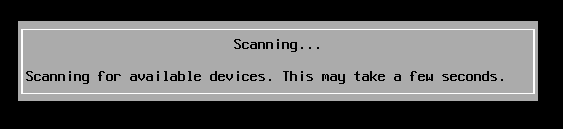

.. |image17| image:: media/image15.png
   :width: 2.88209in
   :height: 1.81954in

.. |image19| image:: media/image17.png
   :width: 3.79186in
   :height: 1.45146in

.. |image24| image:: media/image22.png
   :width: 6.10208in
   :height: 4.54067in
.. |image25| image:: media/image23.png
   :width: 6.10208in
   :height: 4.57656in
.. |image26| image:: media/image24.png
   :width: 6.10208in
   :height: 4.57639in
.. |image27| image:: media/image25.png
   :width: 4.58357in
   :height: 2.55569in
.. |image28| image:: media/image26.png
   :width: 6.10208in
   :height: 1.29861in

.. |image32| image:: media/image5.png
   :width: 0.59055in
   :height: 0.53150in
.. |image33| image:: media/image30.png
   :width: 6.10208in
   :height: 1.18542in
.. |image34| image:: media/image31.png
   :width: 4.64607in
   :height: 2.06895in
.. |image35| image:: media/image32.png
   :width: 6.10208in
   :height: 1.19861in
.. |image36| image:: media/image33.png
   :width: 4.78834in
   :height: 1.98052in

.. |image38| image:: media/image35.png
   :width: 4.19429in
   :height: 2.45135in
.. |image39| image:: media/image36.png
   :width: 4.13854in
   :height: 3.02294in
.. |image40| image:: media/image37.png
   :width: 6.09518in
   :height: 3.08329in

.. |image42| image:: media/image39.png
   :width: 4.20855in
   :height: 1.50008in
.. |image43| image:: media/image40.png
   :width: 6.10208in
   :height: 4.55755in
.. |image44| image:: media/image41.png
   :width: 6.10159in
   :height: 3.73403in

.. |image47| image:: media/image5.png
   :width: 0.59055in
   :height: 0.53150in

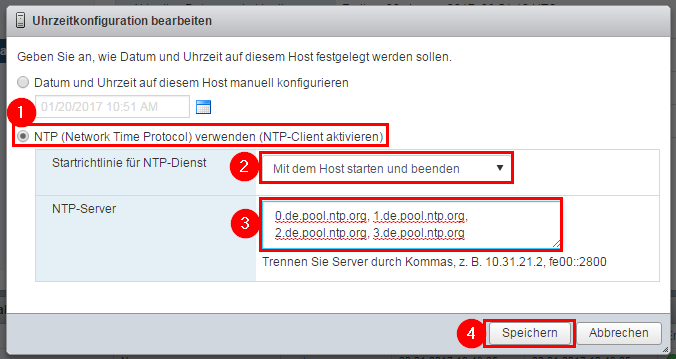

.. |image51| image:: media/image47.png
   :width: 4.88961in
   :height: 3.84711in
.. |image52| image:: media/image48.png
   :width: 3.69481in
   :height: 1.62729in

.. |image56| image:: media/image52.png
   :width: 5.96735in
   :height: 2.86721in

.. |image58| image:: media/image53.png
   :width: 4.71304in
   :height: 2.17886in
.. |image59| image:: media/image54.png
   :width: 5.96735in
   :height: 2.76142in

.. |image61| image:: media/image56.png
   :width: 4.23377in
   :height: 1.93524in

.. |image63| image:: media/image58.png
   :width: 6.10208in
   :height: 3.47032in
.. |image64| image:: media/image59.png
   :width: 4.49501in
   :height: 3.23693in

.. |image66| image:: media/image61.png
   :width: 6.02239in
   :height: 3.40035in
.. |image67| image:: media/image62.png
   :width: 6.00746in
   :height: 3.39192in
.. |image68| image:: media/image56.png
   :width: 4.23377in
   :height: 1.93524in

.. |image70| image:: media/image63.png
   :width: 6.10208in
   :height: 3.45181in

.. |image72| image:: media/image65.png
   :width: 6.05872in
   :height: 3.42170in
.. |image73| image:: media/image66.png
   :width: 5.40135in
   :height: 3.41574in
.. |image74| image:: media/image67.png
   :width: 5.40310in
   :height: 3.40575in
.. |image75| image:: media/image68.png
   :width: 5.48199in
   :height: 3.45547in
.. |image76| image:: media/image56.png
   :width: 4.23377in
   :height: 1.93524in

.. |image78| image:: media/image69.png
   :width: 6.09067in
   :height: 3.45181in
.. |image79| image:: media/image70.png
   :width: 4.49501in
   :height: 2.85867in
.. |image80| image:: media/image71.png
   :width: 6.04393in
   :height: 3.42170in
.. |image81| image:: media/image72.png
   :width: 5.85075in
   :height: 3.30614in
.. |image82| image:: media/image73.png
   :width: 5.99254in
   :height: 3.38432in

.. |image84| image:: media/image56.png
   :width: 4.23377in
   :height: 1.93524in

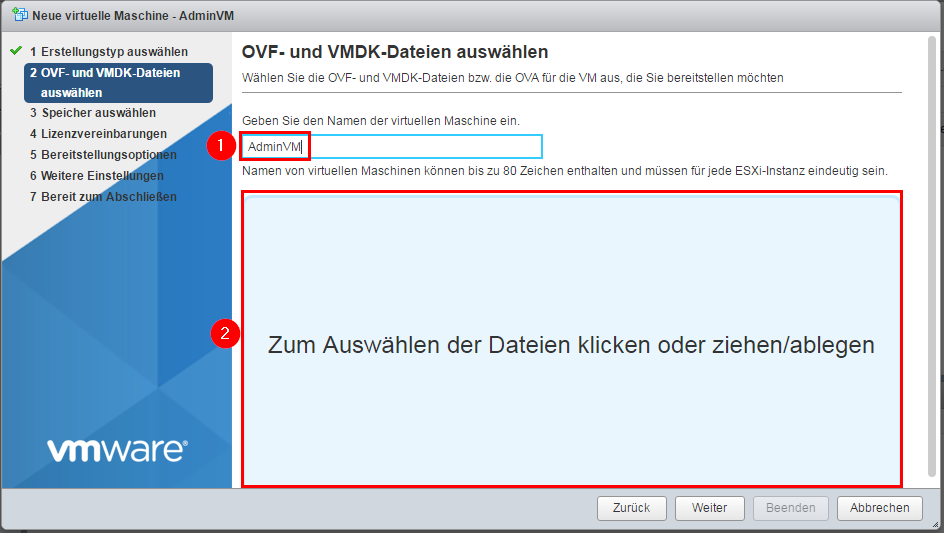
.. |image87| image:: media/image76.png
   :width: 4.49501in
   :height: 2.85867in
.. |image88| image:: media/image77.png
   :width: 6.05872in
   :height: 3.42644in
.. |image89| image:: media/image78.png
   :width: 6.02703in
   :height: 3.41574in
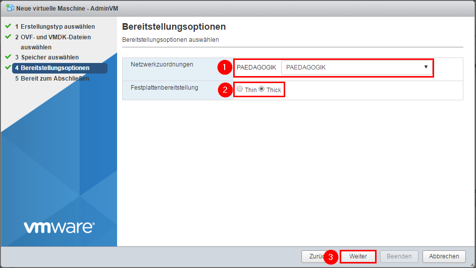
.. |image91| image:: media/image80.png
   :width: 6.10208in
   :height: 3.45181in
.. |image92| image:: media/image81.png
   :width: 6.10208in
   :height: 2.86181in

.. |image94| image:: media/image83.png
   :width: 4.12800in
   :height: 1.87562in
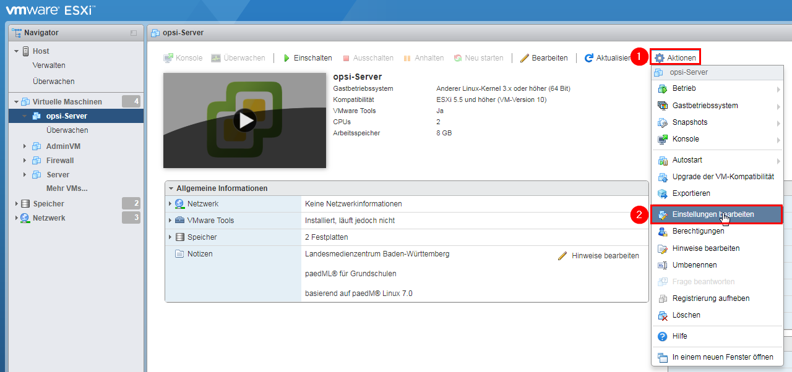
.. |image96| image:: media/image85.png
   :width: 5.31567in
   :height: 3.42400in

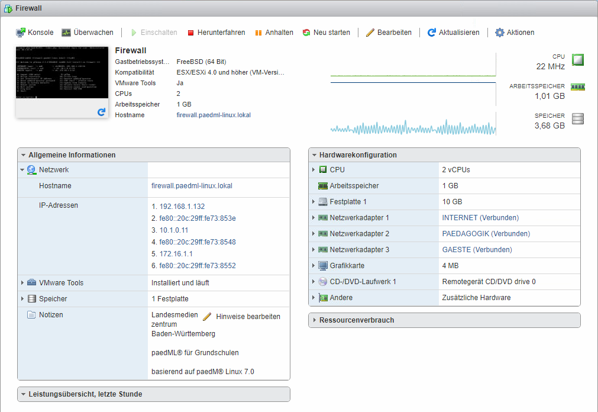
.. |image99| image:: media/image88.png
   :width: 6.02083in
   :height: 3.61963in
.. |image100| image:: media/image89.png
   :width: 6.02778in
   :height: 3.64526in

.. |image102| image:: media/image5.png
   :width: 0.59055in
   :height: 0.53150in
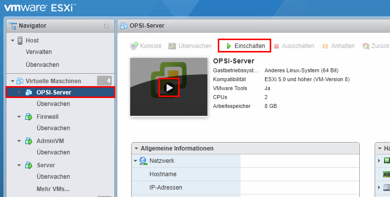
.. |image104| image:: media/image5.png
   :width: 0.59055in
   :height: 0.53150in
.. |image105| image:: media/image92.png
   :width: 5.56920in
   :height: 4.47917in

.. |image107| image:: media/image94.png
   :width: 5.98951in
   :height: 4.24000in

.. |image109| image:: media/image96.png
   :width: 5.49213in
   :height: 2.80952in
.. |image110| image:: media/image97.png
   :width: 5.32286in
   :height: 1.31875in
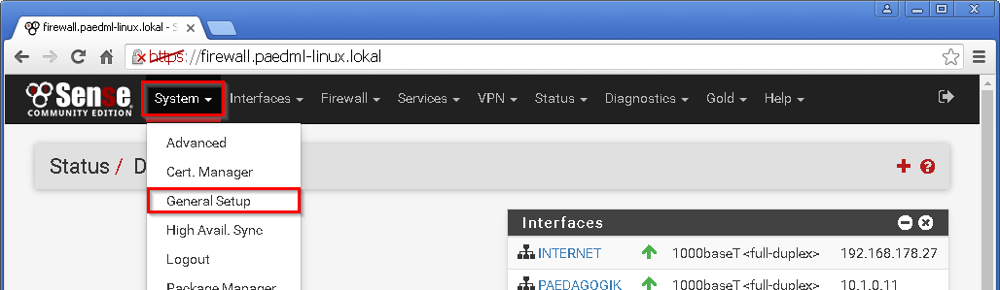

.. |image113| image:: media/image100.png
   :width: 5.40000in
   :height: 4.78016in

.. |image117| image:: media/image102.png
   :width: 3.19771in
   :height: 2.71806in

.. |image119| image:: media/image104.png
   :width: 6.07804in
   :height: 2.61458in
.. |image120| image:: media/image5.png
   :width: 0.59055in
   :height: 0.53150in
.. |image121| image:: media/image105.png
   :width: 4.09722in
   :height: 2.59987in

.. |image125| image:: media/image108.png
   :width: 5.98087in
   :height: 1.92800in
.. |image126| image:: media/image5.png
   :width: 0.59055in
   :height: 0.53150in
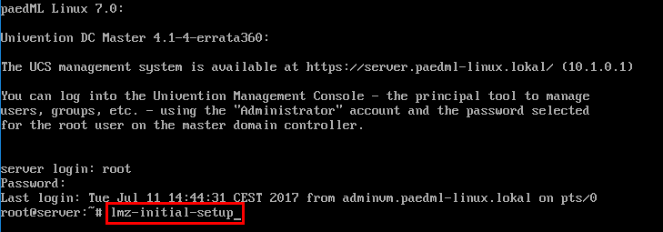
.. |image128| image:: media/image110.PNG
   :width: 3.36076in
   :height: 0.56517in

.. |image131| image:: media/image113.png
   :width: 6.10208in
   :height: 2.13958in
.. |image132| image:: media/image114.png
   :width: 6.10208in
   :height: 1.22778in
.. |image133| image:: media/image115.png
   :width: 6.10208in
   :height: 1.72847in
.. |image134| image:: media/image5.png
   :width: 0.59055in
   :height: 0.53150in

.. |image136| image:: media/image116.png
   :width: 4.85417in
   :height: 2.55839in
.. |image137| image:: media/image5.png
   :width: 0.59055in
   :height: 0.53150in

.. |image139| image:: media/image5.png
   :width: 0.59055in
   :height: 0.53150in
.. |image140| image:: media/image117.png
   :width: 4.90972in
   :height: 3.09526in

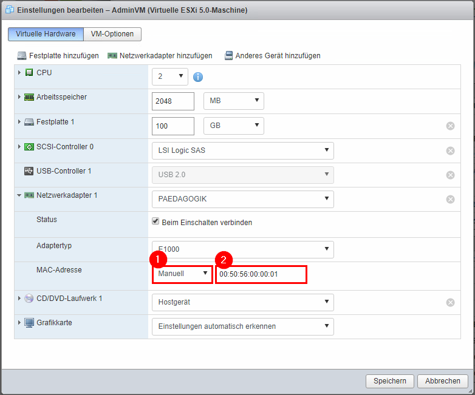
.. |image143| image:: media/image120.png
   :width: 1.33352in
   :height: 0.86470in

.. |image145| image:: media/image122.png
   :width: 2.65625in
   :height: 2.15678in
.. |image146| image:: media/image123.png
   :width: 6.10208in
   :height: 1.89236in

.. |image148| image:: media/image125.png
   :width: 3.01389in
   :height: 2.61052in

.. |image155| image:: media/image132.png
   :width: 4.38719in
   :height: 2.69901in
.. |image156| image:: media/image5.png
   :width: 0.59055in
   :height: 0.53150in
.. |image157| image:: media/image133.png
   :width: 3.60417in
   :height: 2.94737in

.. |image159| image:: media/image5.png
   :width: 0.59055in
   :height: 0.53150in

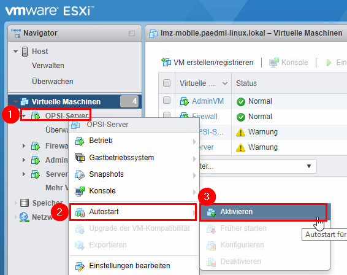
.. |image163| image:: media/image138.png
   :width: 6.04658in
   :height: 2.34028in
.. |image164| image:: media/image5.png
   :width: 0.59055in
   :height: 0.53150in

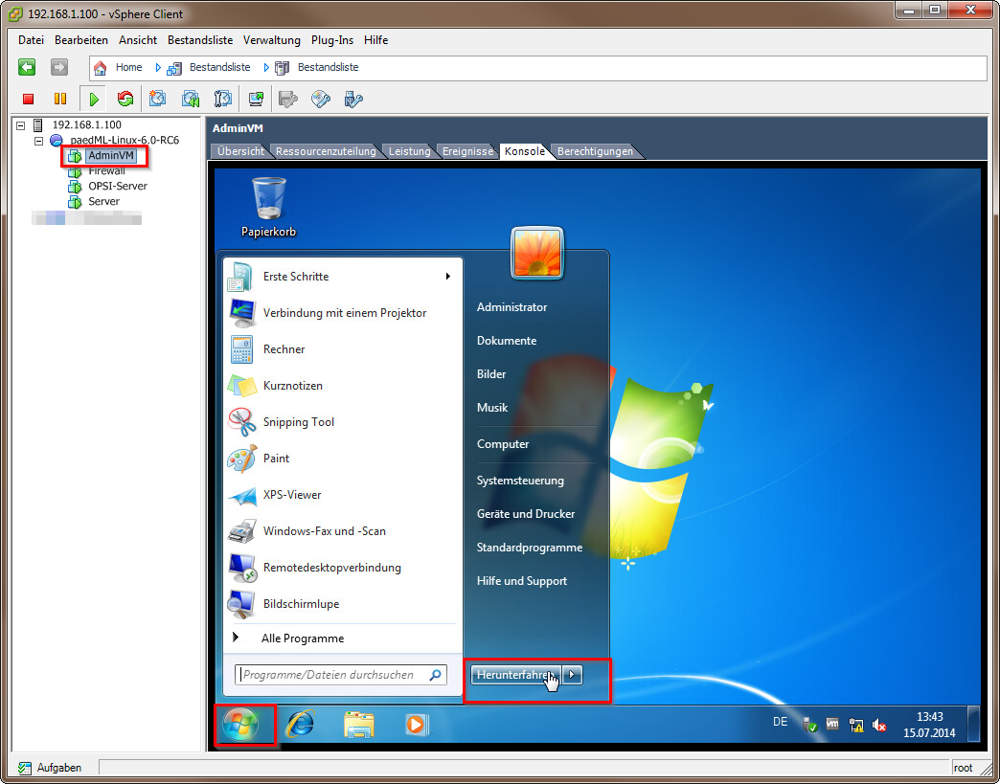

.. |image170| image:: media/image144.png
   :width: 5.54623in
   :height: 1.95833in
.. |image171| image:: media/image145.png
   :width: 3.99306in
   :height: 2.17868in

.. |image174| image:: media/image148.png
   :width: 5.19130in
   :height: 3.11096in

.. |image176| image:: media/image5.png
   :width: 0.59055in
   :height: 0.53150in
.. |image177| image:: media/image150.png
   :width: 4.26789in
   :height: 4.24409in
.. |image178| image:: media/image151.png
   :width: 4.84028in
   :height: 2.84103in
.. |image179| image:: media/image152.png
   :width: 6.10208in
   :height: 0.54029in
.. |image180| image:: media/image5.png
   :width: 0.59055in
   :height: 0.53150in
.. |image181| image:: media/image153.png
   :width: 3.75288in
   :height: 2.79134in
.. |image182| image:: media/image154.png
   :width: 6.00694in
   :height: 3.75043in
.. |image183| image:: media/image155.png
   :width: 4.33855in
   :height: 1.65278in
.. |image184| image:: media/image5.png
   :width: 0.59055in
   :height: 0.53150in
.. |image185| image:: media/image5.png
   :width: 0.59055in
   :height: 0.53150in
.. |image186| image:: media/image5.png
   :width: 0.59055in
   :height: 0.53150in
.. |image187| image:: media/image5.png
   :width: 0.59055in
   :height: 0.53150in
.. |image188| image:: media/image156.png
   :width: 6.10208in
   :height: 2.88403in
.. |image189| image:: media/image157.png
   :width: 6.10208in
   :height: 3.93333in
.. |image190| image:: media/image158.png
   :width: 6.10208in
   :height: 4.24722in
.. |image191| image:: media/image159.png
   :width: 6.10208in
   :height: 2.40278in
.. |image192| image:: media/image5.png
   :width: 0.59055in
   :height: 0.53150in
.. |image193| image:: media/image160.png
   :width: 6.10208in
   :height: 1.77708in
.. |image194| image:: media/image161.png
   :width: 5.70913in
   :height: 3.00042in
.. |image195| image:: media/image162.png
   :width: 6.10208in
   :height: 3.66597in
.. |image196| image:: media/image163.png
   :width: 6.10208in
   :height: 1.64306in

.. |image198| image:: media/image165.png
   :width: 5.62727in
   :height: 0.78157in
.. |image199| image:: media/image166.png
   :width: 6.10208in
   :height: 0.86042in
.. |image200| image:: media/image5.png
   :width: 0.59055in
   :height: 0.53150in
.. |image201| image:: media/image5.png
   :width: 0.59055in
   :height: 0.53150in

.. |image203| image:: media/image168.png
   :width: 6.01857in
   :height: 3.45600in

.. |image206| image:: media/image170.png
   :width: 5.57153in
   :height: 4.01181in

.. |image210| image:: media/image5.png
   :width: 0.59055in
   :height: 0.53150in
